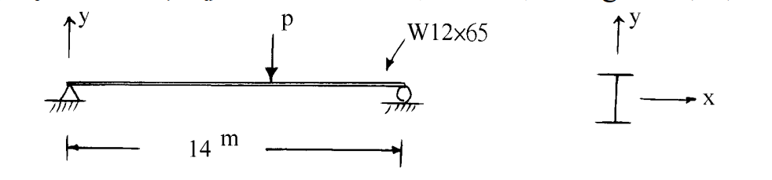

# 考題編號：SS-2002-2

**主分類：** `4.1.2` 梁桿件
**副分類：**（無）
**設計法：** ASD
**標籤：** `梁桿件` `容許應力法` `ASD` `側向扭轉挫屈` `Lc` `Lu` `移動集中載重` `容許撓曲應力` `Fb` `W型鋼` `A36`

---

## 1. 原始題目重述 (Problem Restatement)

如圖所示之 A36 簡支梁，斷面為 W12×65，跨度 $L = 14\ \text{m}$，承受一**移動集中載重** $P$。梁兩端及每 1/4 跨距處之弱軸方向均有一側向支撐，考慮自重。

*圖說：W12×65 簡支梁，跨距 14m。側向支撐點位置：0、3.5m、7.0m、10.5m、14m（共 5 處），相鄰支撐間距（無支撐長度）$L_b = 3.5\ \text{m}$。自重 $w = 97\ \text{kg/m} = 0.097\ \text{tf/m}$。*

**材料與斷面性質：**

| 項目 | 數值 |
|------|------|
| 鋼材 | A36，$F_y = 2.5\ \text{tf/cm}^2$，$F_u = 4.1\ \text{tf/cm}^2$ |
| $E$ | $2100\ \text{tf/cm}^2$ |
| $A$ | $119.4\ \text{cm}^2$ |
| $d \times t_w \times b_f \times t_f$ | $30.3 \times 1 \times 30 \times 1.5\ \text{cm}$ |
| $S_x$ | $1373\ \text{cm}^3$ |
| $S_y$ | $455\ \text{cm}^3$ |
| $L_c$（題目給定） | $3.87\ \text{m}$ |
| $L_u$（題目給定） | $8.44\ \text{m}$ |
| 自重 | $97\ \text{kg/m} = 0.097\ \text{tf/m}$ |

**求：** 依容許應力設計法（ASD），計算容許載重 $P_a$。

---

## 2. 考題核心精神與出題者意圖 (Core Concepts & Examiner's Intent)

**核心觀念：**
ASD 梁設計的核心是根據無支撐長度 $L_b$ 與 $L_c$、$L_u$ 的比較決定容許撓曲應力 $F_b$，再以最大彎矩不超過容許彎矩作為設計條件。

**出題者意圖：**
1. 測驗考生能否正確**辨別移動載重的控制位置**（P 在何處產生最大彎矩）
2. 測驗 $L_b$ 與 $L_c$/$L_u$ 的比較與 $F_b$ 的決定
3. 確認考生不忘記**自重的貢獻**（靜載重 + 活載重疊加）

---

## 3. 解題戰略地圖與陷阱分析 (Strategic Roadmap & Trap Analysis)

**解題順序：**
$$\text{確認 }L_b \to \text{比較 }L_b, L_c, L_u \to F_b \to M_a \to \text{移動載重最不利位置} \to P_a$$

**關鍵陷阱：**

1. **移動載重最不利位置**：移動集中載重 $P$ 在**跨中**（$x = L/2 = 7\ \text{m}$）時產生最大彎矩 $M_{max} = PL/4$。許多考生直接假設 $P$ 在跨中但忘了說明理由，扣分。

2. **自重不可漏算**：自重 $w = 0.097\ \text{tf/m}$ 為靜載重，跨中彎矩 $M_{sw} = wL^2/8$ 必須與活載重彎矩疊加。

3. **$L_b$ 確認**：側向支撐在「兩端及每 1/4 跨距處」，即 5 個支撐點，$L_b = 14/4 = 3.5\ \text{m}$，**不是** $14/3 = 4.67\ \text{m}$（學生常誤算）。

4. **W12×65 為結實斷面（compact section）**：題目已說明，無需另行驗證翼板及腹板的寬厚比，可直接使用 $F_b = 0.66 F_y$（若 $L_b \leq L_c$）。

## 3.5 變數層次分析（Variable Hierarchy Analysis）

> 複習提示：解題後，在每個卡住的知識點「卡關?」欄標記 `⚠`；第二次複習時只看有 `⚠` 的項目。

**最終目標：** 確認 $L_b$ vs $L_c$ → 決定 $F_b$ → 計算 $M_a$ → 確認移動載重最不利位置 → 求 $\boxed{P_a}$

### 主要公式（$\boxed{\phantom{x}}$ = 未知，待推導）

$$L_b = \frac{L}{4} = 3.5\ \text{m} < L_c = 3.87\ \text{m} \Rightarrow \boxed{F_b} = 0.66F_y$$
$$\boxed{M_a} = F_b \times S_x$$
$$M_{sw} = \frac{wL^2}{8}, \quad M_{P,max} = \frac{P \cdot L}{4}\text{（P 在跨中）}$$
$$M_{P,max} + M_{sw} \leq M_a \Rightarrow \boxed{P_a}$$

### L1：題目直接給定

| 符號 | 數值 | 說明 |
|------|------|------|
| $L$ | 14 m | 簡支梁跨距 |
| $w$ | 0.097 tf/m | 自重（W12×65，靜載重）|
| $F_y$ | 2.5 tf/cm² | A36 鋼材降伏應力 |
| $S_x$ | 1373 cm³ | 強軸斷面模數 |
| $d \times t_w$ | $30.3 \times 1.0$ cm | 腹板尺寸（剪力用）|
| $L_c$（給定）| 3.87 m | 全截面塑性彎矩的無支撐上限 |
| $L_u$（給定）| 8.44 m | 彈性 LTB 分界 |
| 側向支撐位置 | 兩端 + 1/4 跨（共 5 點）| $L_b = 14/4 = 3.5$ m |

### L2：需知識點推導

**Step 1：確認 $L_b$ 與選取 $F_b$**

| 符號 | 公式 / 來源 | 卡關? |
|------|------------|:-----:|
| $L_b$ | $14/4 = 3.5$ m（相鄰側撐間距）| |
| $F_b$ | $L_b < L_c \Rightarrow 0.66F_y = 1.65$ tf/cm² | |

**Step 2：計算容許彎矩**

| 符號 | 公式 / 來源 | 卡關? |
|------|------------|:-----:|
| $M_a$ | $F_b \times S_x = 1.65 \times 1373 = 22.66$ tf·m | |

**Step 3：自重彎矩**

| 符號 | 公式 / 來源 | 卡關? |
|------|------------|:-----:|
| $M_{sw}$ | $wL^2/8 = 0.097 \times 196/8 = 2.38$ tf·m | |

**Step 4：移動載重最不利位置**

| 符號 | 公式 / 來源 | 卡關? |
|------|------------|:-----:|
| 最不利位置 | $x = L/2$（跨中），$M_{P,max} = PL/4$ | |
| $P_a$ | $(M_a - M_{sw})/(L/4) = 20.28/3.5 \approx 5.79$ tf | |

**Step 5：剪力檢核（驗算）**

| 符號 | 公式 / 來源 | 卡關? |
|------|------------|:-----:|
| $F_v$ | $0.4F_y = 1.0$ tf/cm² | |
| $V_a$ | $F_v \times (d \times t_w) = 30.3$ tf（遠大於 $V_{max}$）| |

### L3：深層知識（不懂就卡住）

| 知識點 | 說明 | 補強頁 | 卡關? |
|--------|------|:------:|:-----:|
| ASD $L_b$ vs $L_c$ vs $L_u$ 三段判斷 | $L_b < L_c$：$F_b = 0.66F_y$；$L_c < L_b < L_u$：內插；$L_b > L_u$：彈性 LTB 公式 | [[asd-column]] | |
| 移動載重最不利位置推導 | $M(x) = Px(L-x)/L$ 在 $x=L/2$ 取最大值 $PL/4$ | | |
| 自重屬靜載重不因數化（ASD）| ASD 法中自重彎矩直接加入，不乘因數 | | |
| ASD 剪力容許應力 | $F_v = 0.4F_y$，對應容許剪應力（非 LRFD 的 $0.6F_y$）| | |

---

## 4. 步驟化詳細計算過程 (Step-by-Step Detailed Calculation)

### 步驟 1：確認無支撐長度 $L_b$

側向支撐位置：$0,\ 3.5,\ 7.0,\ 10.5,\ 14.0\ \text{m}$（共 5 處，4 個區間）

$$L_b = \frac{14}{4} = 3.5\ \text{m}$$

### 步驟 2：比較 $L_b$ 與 $L_c$、$L_u$，決定容許撓曲應力 $F_b$

$$L_b = 3.5\ \text{m} < L_c = 3.87\ \text{m}$$

→ **全截面塑性彎矩控制**，採用最大容許撓曲應力：

$$\boxed{F_b = 0.66 F_y = 0.66 \times 2.5 = 1.65\ \text{tf/cm}^2}$$

### 步驟 3：計算容許彎矩 $M_a$

$$M_a = F_b \times S_x = 1.65 \times 1373 = 2265.45\ \text{tf·cm} = 22.655\ \text{tf·m}$$

### 步驟 4：計算自重在跨中產生的彎矩

$$w = 0.097\ \text{tf/m}$$

$$M_{sw} = \frac{w L^2}{8} = \frac{0.097 \times 14^2}{8} = \frac{0.097 \times 196}{8} = \frac{19.012}{8} = 2.377\ \text{tf·m}$$

### 步驟 5：確認移動集中載重的最不利位置

移動集中載重 $P$ 在位置 $x$ 時，跨中彎矩（即最大彎矩位置的彎矩）：

$$M_P(x) = \frac{P \cdot x \cdot (L - x)}{L}$$

對 $x$ 微分求極值：$\dfrac{dM_P}{dx} = \dfrac{P(L - 2x)}{L} = 0 \Rightarrow x = \dfrac{L}{2} = 7\ \text{m}$

$$\therefore M_{P,max} = \frac{P \cdot L}{4} = \frac{P \times 14}{4} = 3.5P \quad \text{（tf·m）}$$

**此時 $P$ 恰好位於第 3 個側向支撐點（$x = 7\ \text{m}$），$L_b = 3.5\ \text{m}$ 不受影響。**

### 步驟 6：彎矩設計條件求 $P_a$

$$M_{P,max} + M_{sw} \leq M_a$$

$$3.5 P_a + 2.377 \leq 22.655$$

$$3.5 P_a \leq 20.278$$

$$\boxed{P_a = \frac{20.278}{3.5} \approx 5.79\ \text{tf}}$$

### 驗算：剪力檢核

移動載重 $P$ 靠近支承端時，最大剪力發生：

$$V_{max} = P_a + \frac{wL}{2} = 5.79 + \frac{0.097 \times 14}{2} = 5.79 + 0.679 = 6.47\ \text{tf}$$

$$F_v = 0.4 F_y = 0.4 \times 2.5 = 1.0\ \text{tf/cm}^2$$

$$A_w = d \times t_w = 30.3 \times 1.0 = 30.3\ \text{cm}^2$$

$$V_a = F_v \times A_w = 1.0 \times 30.3 = 30.3\ \text{tf}$$

$$V_{max} = 6.47\ \text{tf} \ll V_a = 30.3\ \text{tf} \quad \checkmark$$

**剪力大量餘裕，彎矩控制設計。**

---

### 計算結果總覽

| 項目 | 數值 |
|------|------|
| $L_b$ | $3.5\ \text{m}$ |
| $L_c$（題目給定） | $3.87\ \text{m}$ |
| $L_b$ vs $L_c$ | $3.5 < 3.87$ → $F_b = 0.66F_y$ |
| $F_b$ | $1.65\ \text{tf/cm}^2$ |
| $M_a = F_b S_x$ | $22.655\ \text{tf·m}$ |
| $M_{sw}$（自重，跨中） | $2.377\ \text{tf·m}$ |
| 可用於 $P$ 的彎矩 | $20.278\ \text{tf·m}$ |
| $P_a = 20.278/3.5$ | **$5.79\ \text{tf}$** |
| 剪力檢核 | $6.47\ \text{tf} \leq 30.3\ \text{tf}$ ✓ |

---

## 5. 關鍵爭議點與進階探討 (Critical Issues & Advanced Discussion)

### Q：為何控制情況是 $P$ 在跨中而非其他位置？

移動集中載重對簡支梁產生的最大跨中彎矩函數 $M(x) = Px(L-x)/L$ 在 $x=L/2$ 達到最大值 $PL/4$。對任意其他位置 $x \neq L/2$，彎矩均小於此值。自重彎矩在跨中也是最大。兩者疊加後的最大值仍在跨中，因此 $P$ 在跨中時為控制情況。

### Q：$L_c$ 的物理意義是什麼？

$L_c$（ASD 法）是梁能充分發展側向扭轉塑性（使 $F_b = 0.66F_y$）的最大無支撐長度，由以下兩式取小值定義（A36 鋼，SI 單位）：

$$L_c = \min\left(\frac{200 b_f}{\sqrt{F_y}},\ \frac{137900}{(d/A_f) F_y}\right) \quad \text{（cm，}F_y \text{ 單位 kgf/cm}^2\text{）}$$

本題由考卷直接給定 $L_c = 3.87\ \text{m}$，無需自行計算。

### Q：若 $L_b > L_u = 8.44\ \text{m}$ 時如何處理？

當 $L_b > L_u$ 時，$F_b$ 需由彈性側向扭轉挫屈公式計算（$F_b < 0.60F_y$），需計算 $rT$、$A_f$、$C_b$ 等參數。本題 $L_b = 3.5\ \text{m} \ll L_u = 8.44\ \text{m}$，無此問題。

### Q：本題為何不考慮撓度限制？

ASD 規範要求梁的活載重撓度 $\delta \leq L/360$（使用性）。題目僅要求計算容許載重，未要求撓度驗算，故略去。實際設計時需補充驗算：

$$\delta = \frac{PL^3}{48EI} \leq \frac{L}{360}$$
