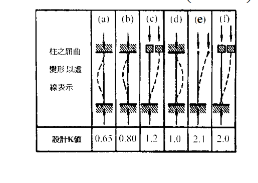
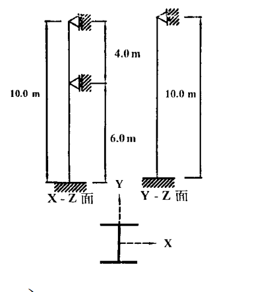

# 考題編號：SS-2002-3

**主分類：** `4.1.1` 拉力及壓力桿件
**副分類：**（無）
**設計法：** 混合（ASD + LRFD）
**標籤：** `壓力桿件` `有效長度` `K值` `端部條件` `弱軸挫屈` `強軸挫屈` `中間側向支撐` `ASD` `LRFD` `Cc` `Fa` `λc` `Fcr` `φcPn` `W型鋼` `A36`

---

## 1. 原始題目重述 (Problem Restatement)

有一受軸向載重之鋼柱，長度 $L = 10\ \text{m}$，斷面為 W14×53（A36），為結實斷面。柱之邊界條件：
- **底部**：固接於基礎（fixed）
- **頂端**：鉸接（pinned）
- **中間（距底部 5m）**：垂直於弱軸有鉸接側向支撐（prevents weak-axis displacement）

*圖說：X-Z 平面（強軸平面）：柱高 10m，底部固接、頂部鉸接，無中間側向支撐（強軸），有效長度係數 $K_x = 0.80$。Y-Z 平面（弱軸平面）：柱高 10m，在 5m 處（中間）設鉸接側向支撐，將弱軸分為上下兩段各 5m；下段固接-鉸接 $K_y=0.80$，上段鉸接-鉸接 $K_y=1.0$，上段控制。*

*圖說：(a) 兩端固接：$K=0.65$；(b) 一端固接、一端鉸接（無側移）：$K=0.80$；(c) 一端固接、一端固接但有側移：$K=1.2$；(d) 兩端鉸接（無側移）：$K=1.0$；(e) 一端固接、一端自由（懸臂）：$K=2.1$；(f) 一端鉸接、一端自由：$K=2.0$。*

**斷面與材料：**

| 項目 | 數值 |
|------|------|
| $A$ | $100.64\ \text{cm}^2$ |
| $r_x$（強軸迴轉半徑） | $14.96\ \text{cm}$ |
| $r_y$（弱軸迴轉半徑） | $4.88\ \text{cm}$ |
| $F_y$ | $2.50\ \text{tf/cm}^2$ |
| $E$ | $2100\ \text{tf/cm}^2$ |

**求：**
1. ASD：容許載重 $P_a$
2. LRFD：設計載重 $\phi_c P_n$

---

## 2. 考題核心精神與出題者意圖 (Core Concepts & Examiner's Intent)

**核心觀念：** 壓力柱設計需同時考慮**強軸**與**弱軸**兩個方向的有效細長比，取較大值（較不利方向）控制設計。中間側向支撐只對**特定軸**有效，不能同時改善兩軸。

**出題者意圖：**
1. 測驗考生能否從邊界條件圖表正確查取 $K$ 值
2. 測驗中間側向支撐的影響：只作用於弱軸，強軸不受影響
3. 要求同一斷面用 ASD 與 LRFD 兩法計算，比較兩種設計哲學

---

## 3. 解題戰略地圖與陷阱分析 (Strategic Roadmap & Trap Analysis)

**解題順序：**
$$\text{判斷各軸端部條件} \to K \to KL/r \text{（強軸 vs 弱軸）} \to \text{弱軸控制} \to \text{ASD: }F_a,\,P_a \to \text{LRFD: }\lambda_c,\,F_{cr},\,\phi_c P_n$$

**關鍵陷阱：**

1. **中間側向支撐只對弱軸有效**：中間支撐「垂直於弱軸」表示它阻止了弱軸方向的位移，故僅在計算弱軸有效長度時分段計算，強軸仍用全長 10m。

2. **弱軸兩段取控制段**：下段（固接-鉸接）$K=0.80$，$KL=4.0\ \text{m}$；上段（鉸接-鉸接）$K=1.0$，$KL=5.0\ \text{m}$。上段細長比較大，**上段控制**。

3. **強軸有效長度係數**：底固頂鉸、無側移 → $K_x = 0.80$（查表 (b)），而非 $K=0.7$（理論值）或 $K=1.0$（兩端鉸接）。

4. **$C_c$ 與彈性/非彈性判斷**：ASD 中 $KL/r$ 與 $C_c$ 比較決定使用哪個公式，容易忽略或算錯 $C_c$。

## 3.5 變數層次分析（Variable Hierarchy Analysis）

> 複習提示：解題後，在每個卡住的知識點「卡關?」欄標記 `⚠`；第二次複習時只看有 `⚠` 的項目。

**最終目標：** 判斷強弱軸端部條件 → 查取 $K$ → 比較 $KL/r$（弱軸控制）→ ASD：$\boxed{P_a}$；LRFD：$\boxed{\phi_c P_n}$

### 主要公式（$\boxed{\phantom{x}}$ = 未知，待推導）

$$\frac{KL_x}{r_x} = \frac{0.8 \times 1000}{14.96} = 53.5, \quad \frac{KL_y}{r_y} = \frac{1.0 \times 500}{4.88} = \boxed{102.5}\text{（控制）}$$

**ASD：**
$$C_c = \sqrt{\frac{2\pi^2 E}{F_y}} = 128.8, \quad KL/r < C_c \Rightarrow \boxed{F_a} \text{（非彈性拋物線）} \Rightarrow \boxed{P_a} = F_a \cdot A$$

**LRFD：**
$$\lambda_c = \frac{KL}{r\pi}\sqrt{\frac{F_y}{E}} = \boxed{1.125} < 1.5 \Rightarrow F_{cr} = e^{-0.419\lambda_c^2}F_y \Rightarrow \boxed{\phi_c P_n} = 0.85 F_{cr} A$$

### L1：題目直接給定

| 符號 | 數值 | 說明 |
|------|------|------|
| $L$ | 10 m | 柱全長 |
| $A$ | 100.64 cm² | W14×53 斷面積 |
| $r_x$ | 14.96 cm | 強軸迴轉半徑 |
| $r_y$ | 4.88 cm | 弱軸迴轉半徑 |
| $F_y$ | 2.50 tf/cm² | A36 降伏應力 |
| $E$ | 2100 tf/cm² | 彈性模數 |
| 底端條件 | 固接 | 旋轉、平移均束制 |
| 頂端條件 | 鉸接 | 允許旋轉，束制平移 |
| 弱軸中間支撐 | 距底 5 m，鉸接 | 只對弱軸有效 |

### L2：需知識點推導

**Step 1：判斷各軸端部條件與 K 值**

| 符號 | 公式 / 來源 | 卡關? |
|------|------------|:-----:|
| $K_x$ | 強軸底固頂鉸，查圖表 (b) → $K_x = 0.80$ | |
| $KL_x$ | $0.80 \times 10 = 8.0$ m（強軸全長）| |
| $K_{y,下}$ | 弱軸下段固接-鉸接，查 (b) → $K = 0.80$，$KL = 4.0$ m | |
| $K_{y,上}$ | 弱軸上段兩端鉸接，查 (d) → $K = 1.0$，$KL = 5.0$ m（控制）| |

**Step 2：計算細長比，確認控制軸**

| 符號 | 公式 / 來源 | 卡關? |
|------|------------|:-----:|
| $(KL/r)_x$ | $800/14.96 = 53.5$（強軸）| |
| $(KL/r)_y$ | $500/4.88 = 102.5$（弱軸，控制）| |

**Step 3(a)：ASD — $F_a$ 與 $P_a$**

| 符號 | 公式 / 來源 | 卡關? |
|------|------------|:-----:|
| $C_c$ | $\sqrt{2\pi^2 E/F_y} = 128.8$（彈性/非彈性分界）| |
| 挫屈類型 | $102.5 < 128.8 \Rightarrow$ 非彈性，用拋物線公式 | |
| $F_a$ | 分子 $(1-(KL/r)^2/2C_c^2)F_y$，分母 $5/3+3\alpha/8-\alpha^3/8$ → $0.898$ tf/cm² | |
| $P_a$ | $F_a \times A = 0.898 \times 100.64 \approx 90.4$ tf | |

**Step 3(b)：LRFD — $\lambda_c$、$F_{cr}$ 與 $\phi_c P_n$**

| 符號 | 公式 / 來源 | 卡關? |
|------|------------|:-----:|
| $\lambda_c$ | $(KL/r\pi)\sqrt{F_y/E} = 1.125 < 1.5$（非彈性）| |
| $F_{cr}$ | $e^{-0.419 \times 1.125^2} \times F_y = 1.471$ tf/cm² | |
| $\phi_c P_n$ | $0.85 \times F_{cr} \times A = 125.8$ tf | |

### L3：深層知識（不懂就卡住）

| 知識點 | 說明 | 補強頁 | 卡關? |
|--------|------|:------:|:-----:|
| 中間側向支撐只對特定軸有效 | 弱軸側撐只改善弱軸 $KL$，強軸仍取全長 | [[effective-length-chart]] | |
| 弱軸分段取控制段（較大 $KL$）| 兩段分別算 $KL$，取較大者做設計 | | |
| ASD $C_c$ 物理意義 | Euler 臨界應力 $= F_y/2$ 時的細長比；非「最大細長比」| [[asd-column]] | |
| LRFD $\lambda_c$ vs $C_c$ 換算 | $\lambda_c = (KL/r)/C_c \cdot \sqrt{2}/\pi$，$\lambda_c=1.0$ 對應 $KL/r \approx C_c/\sqrt{2}$ | [[lrfd-column]] · [[COLUMN-STRENGTH-CURVE]] | |
| K 值查表用設計值而非理論值 | 設計推薦值（如 0.80）比理論值（0.70）保守，反映實際固接不完全 | [[effective-length-chart]] | |

---

## 4. 步驟化詳細計算過程 (Step-by-Step Detailed Calculation)

### 步驟 1：判斷各軸端部條件並查取 K 值

**強軸（x-x，X-Z 平面）：**

| 端部 | 條件 |
|------|------|
| 底部 | 固接（旋轉 ✗，平移 ✗） |
| 頂端 | 鉸接（旋轉 ○，平移 ✗）|
| 中間 | 無側向支撐 |

→ 對應 K 值圖表條件 **(b)**（底固頂鉸，無側移）：

$$K_x = 0.80$$

$$KL_x = 0.80 \times 10 = 8.0\ \text{m} = 800\ \text{cm}$$

---

**弱軸（y-y，Y-Z 平面）：** 中間（5m 處）有鉸接側向支撐，分為兩段

**下段（0 ～ 5m）：**

| 端部 | 條件 |
|------|------|
| 底部（0m） | 固接（旋轉 ✗，平移 ✗） |
| 中間（5m） | 鉸接側撐（旋轉 ○，平移 ✗） |

→ 條件 **(b)**，$K_y = 0.80$：

$$KL_{y,下} = 0.80 \times 5 = 4.0\ \text{m} = 400\ \text{cm}$$

**上段（5m ～ 10m）：**

| 端部 | 條件 |
|------|------|
| 中間（5m） | 鉸接側撐（旋轉 ○，平移 ✗） |
| 頂端（10m） | 鉸接（旋轉 ○，平移 ✗） |

→ 條件 **(d)**（兩端鉸接，無側移），$K_y = 1.0$：

$$KL_{y,上} = 1.0 \times 5 = 5.0\ \text{m} = 500\ \text{cm}$$

弱軸取較大值：$KL_y = 500\ \text{cm}$（上段控制）

---

### 步驟 2：計算各軸細長比，確認控制軸

$$\frac{KL_x}{r_x} = \frac{800}{14.96} = 53.5$$

$$\frac{KL_y}{r_y} = \frac{500}{4.88} = 102.5$$

$$\boxed{\frac{KL}{r} = 102.5 \quad \text{（弱軸控制，}KL_y/r_y \gg KL_x/r_x\text{）}}$$

---

### 步驟 3（一）ASD — 計算容許載重 $P_a$

**計算臨界細長比 $C_c$（彈性/非彈性分界）：**

$$C_c = \sqrt{\frac{2\pi^2 E}{F_y}} = \sqrt{\frac{2 \times 9.870 \times 2100}{2.5}} = \sqrt{\frac{41454}{2.5}} = \sqrt{16581} = 128.8$$

**判斷挫屈類型：**

$$\frac{KL}{r} = 102.5 < C_c = 128.8 \quad \Rightarrow \text{非彈性挫屈}$$

**計算容許應力 $F_a$（ASD 非彈性挫屈公式）：**

$$F_a = \frac{\left[1 - \dfrac{(KL/r)^2}{2C_c^2}\right]F_y}{\dfrac{5}{3} + \dfrac{3(KL/r)}{8C_c} - \dfrac{(KL/r)^3}{8C_c^3}}$$

計算各項：

| 項目 | 計算 | 數值 |
|------|------|------|
| $(KL/r)^2$ | $102.5^2$ | $10506$ |
| $2C_c^2$ | $2 \times 128.8^2$ | $33170$ |
| $(KL/r)^2/(2C_c^2)$ | $10506/33170$ | $0.3167$ |
| **分子** | $(1-0.3167)\times 2.5$ | **$1.708\ \text{tf/cm}^2$** |
| $3(KL/r)/(8C_c)$ | $3\times102.5/(8\times128.8)$ | $0.2984$ |
| $(KL/r)^3/(8C_c^3)$ | $1075922/(8\times2135860)$ | $0.0630$ |
| **分母** | $1.6667+0.2984-0.0630$ | **$1.9021$** |

$$F_a = \frac{1.708}{1.9021} = 0.898\ \text{tf/cm}^2$$

**容許載重：**

$$\boxed{P_a = F_a \times A = 0.898 \times 100.64 \approx 90.4\ \text{tf}}$$

---

### 步驟 3（二）LRFD — 計算設計載重 $\phi_c P_n$

**計算等效細長比 $\lambda_c$：**

$$\lambda_c = \frac{KL}{r\pi}\sqrt{\frac{F_y}{E}} = \frac{102.5}{\pi}\sqrt{\frac{2.5}{2100}} = 32.61 \times 0.03450 = 1.125$$

**判斷：** $\lambda_c = 1.125 < 1.5$ → **非彈性挫屈**

**計算臨界應力 $F_{cr}$：**

$$F_{cr} = \left[\exp(-0.419\lambda_c^2)\right]F_y = \exp(-0.419 \times 1.125^2) \times 2.5$$

$$= \exp(-0.419 \times 1.266) \times 2.5 = \exp(-0.530) \times 2.5 = 0.5886 \times 2.5$$

$$\boxed{F_{cr} = 1.471\ \text{tf/cm}^2}$$

**名目強度與設計強度：**

$$P_n = F_{cr} \times A = 1.471 \times 100.64 = 148.0\ \text{tf}$$

$$\boxed{\phi_c P_n = 0.85 \times 148.0 = 125.8\ \text{tf}}$$

---

### 計算結果總覽

| 項目 | 強軸 | 弱軸（上段）| 弱軸（下段）|
|------|------|------------|------------|
| 端部條件 | 底固頂鉸 | 兩端鉸 | 底固、頂鉸（側撐）|
| K | 0.80 | 1.0 | 0.80 |
| 計算長度 KL | 800 cm | 500 cm | 400 cm |
| r | $r_x = 14.96\ \text{cm}$ | $r_y = 4.88\ \text{cm}$ | $r_y = 4.88\ \text{cm}$ |
| KL/r | 53.5 | **102.5（控制）** | 82.0 |

| 設計法 | 控制 KL/r | 結果 |
|--------|----------|------|
| ASD | 102.5（< $C_c=128.8$，非彈性） | $P_a = \mathbf{90.4\ \text{tf}}$ |
| LRFD | $\lambda_c = 1.125$（< 1.5，非彈性） | $\phi_c P_n = \mathbf{125.8\ \text{tf}}$ |

---

## 5. 關鍵爭議點與進階探討 (Critical Issues & Advanced Discussion)

### Q：為何強軸 $K_x = 0.80$ 而非 $0.70$（理論值）？

AISC 設計表所列 $K$ 值（如 0.80）為**設計推薦值**，比理論值（0.70）略為保守，以考慮：
1. 實際固接節點的旋轉剛度不完全無窮大
2. 施工誤差與不完整約束
3. 設計安全裕度

本題從查表（設計 K 圖）得 $K_x = 0.80$，此為正確做法。

### Q：ASD 與 LRFD 結果比較

$$\frac{\phi_c P_n}{P_a} = \frac{125.8}{90.4} = 1.39$$

典型比值在 1.3~1.5 之間，這反映兩種設計法的荷重組合差異：
- ASD：$P_a$ 對應**工作載重（實際使用載重）**
- LRFD：$\phi_c P_n$ 對應**因數化極限載重**（如 $1.2D + 1.6L$）

若活載重占主導（$L/D \approx 3$），因數化載重約為工作載重的 1.4~1.5 倍，與上述比值吻合。

### Q：若 $KL/r > C_c$（彈性挫屈區），ASD 使用哪個公式？

$$F_a = \frac{12\pi^2 E}{23(KL/r)^2} \quad (KL/r > C_c)$$

本題 $KL/r = 102.5 < C_c = 128.8$，故使用非彈性區公式。

### Q：LRFD 中 $\lambda_c > 1.5$ 時呢？

$$\lambda_c > 1.5: \quad F_{cr} = \frac{0.877}{\lambda_c^2} F_y \quad \text{（彈性挫屈）}$$

本題 $\lambda_c = 1.125 < 1.5$，為非彈性挫屈，使用指數公式。

### 強軸驗算（確認弱軸控制）

$$\lambda_{c,x} = \frac{53.5}{\pi}\sqrt{\frac{2.5}{2100}} = 17.03 \times 0.03450 = 0.587$$

$$F_{cr,x} = \exp(-0.419 \times 0.587^2) \times 2.5 = \exp(-0.144) \times 2.5 = 0.866 \times 2.5 = 2.165\ \text{tf/cm}^2$$

$$\phi_c P_{n,x} = 0.85 \times 2.165 \times 100.64 = 184.9\ \text{tf}$$

強軸設計載重 184.9 tf ≫ 弱軸 125.8 tf，**弱軸控制確認**。
