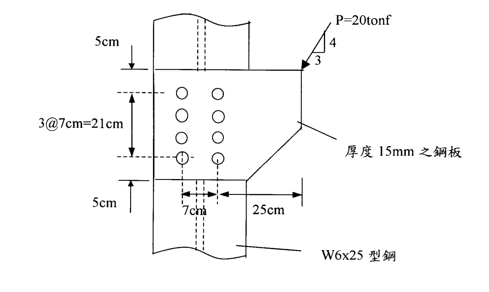

# 考題編號：SS-2002-4

**主分類：** `4.1.4` 接合之分析與設計
**副分類：**（無）
**設計法：** ASD
**標籤：** `接合設計` `偏心螺栓群` `彈性分析法` `承壓型螺栓` `A325X` `容許剪應力` `容許承壓應力` `向量疊加` `扭矩極慣性矩` `強度不足`

---

## 1. 原始題目重述 (Problem Restatement)

圖示接合受偏心工作荷重 $P = 20\ \text{tonf}$（垂直向下），螺栓對稱配置於 W6×25 型鋼腹板兩側，兩螺栓列心距 $7\ \text{cm}$。螺栓採標稱直徑 22 mm 之 A325X 承壓型螺栓（標準孔，螺紋不在剪力平面），螺栓孔附近之變形非設計考量因素。

*圖說：W6×25 腹板連接至厚 15mm 鋼板。4 列 × 2 行 = 8 顆 A325X 螺栓。垂直方向：上邊距 5cm、列間距 3@7cm=21cm、下邊距 5cm；水平方向：兩螺栓列心距 7cm。偏心距（荷重作用點至螺栓群形心）e = 25cm。最頂列螺栓（第 1 列）與最底列螺栓（第 4 列）距形心 ±10.5cm，第 2、3 列距形心 ±3.5cm。*

**材料與元件性質：**

| 項目 | 數值 |
|------|------|
| 鋼板與型鋼 | $F_y = 2.5\ \text{tf/cm}^2$，$F_u = 4.1\ \text{tf/cm}^2$ |
| W6×25 腹板厚 $t_w$ | $0.813\ \text{cm}$ |
| 鋼板厚 | $15\ \text{mm} = 1.5\ \text{cm}$ |
| 螺栓 Ab | $3.88\ \text{cm}^2$ |
| Fv（A325X，標準孔，承壓式，螺紋不在剪力面）| $2.10\ \text{tf/cm}^2$ |

**求：** 依容許應力設計法（ASD）以彈性分析法，檢核此接合強度是否足夠。

---

## 2. 考題核心精神與出題者意圖 (Core Concepts & Examiner's Intent)

**核心觀念：** 偏心螺栓群受偏心荷重時，每顆螺栓承受兩種剪力的疊加：
1. **直接剪力**：$P/n$（均勻分配，方向與 $P$ 同向）
2. **扭矩剪力**：由偏心彎矩 $M = P \times e$ 引起，大小與螺栓至形心距離成正比，方向垂直於半徑

最大螺栓力為這兩者的向量合力，必須小於容許值（剪力與承壓強度取小值）。

**出題者意圖：** 測驗偏心接合的彈性向量疊加法（非正規力矩法），著重考生能否正確：
1. 計算螺栓群幾何形心與扭矩極慣性矩 $I_p = \Sigma r^2$
2. 識別最大受力螺栓位置
3. 正確疊加直接剪力與扭矩剪力的向量

---

## 3. 解題戰略地圖與陷阱分析 (Strategic Roadmap & Trap Analysis)

**解題順序：**
$$\text{螺栓配置（位置、形心）} \to I_p = \Sigma r^2 \to \text{直接剪力} \to \text{扭矩剪力} \to \text{向量合力} \to \text{容許值比較}$$

**關鍵陷阱：**

1. **偏心距 e 的量取**：e 為荷重作用線至螺栓群**形心**的距離，不是至邊緣或至最近螺栓的距離。本題 e = 25cm。

2. **最大受力螺栓位置**：需對各象限螺栓算出合力再比較，直覺上「距荷重最遠且位於形心對角」者最危險，本題為右列最頂或最底列（形心距離 $r = \sqrt{3.5^2 + 10.5^2} = 11.07\ \text{cm}$）。

3. **容許承壓應力公式選擇**：需確認邊距 $L > 1.5d = 3.3\ \text{cm}$（上邊距 5cm ✓）且螺栓中心間距 $> 3d = 6.6\ \text{cm}$（列距 7cm ✓），方可採用 $F_p = 1.2F_u$。

4. **承壓控制元素**：腹板（$t_w = 0.813\ \text{cm}$）遠薄於鋼板（$1.5\ \text{cm}$），**腹板承壓控制**。

## 3.5 變數層次分析（Variable Hierarchy Analysis）

> 複習提示：解題後，在每個卡住的知識點「卡關?」欄標記 `⚠`；第二次複習時只看有 `⚠` 的項目。

**最終目標：** 計算螺栓群 $I_p$ → 直接剪力 + 扭矩剪力向量疊加 → 最大合力 vs 容許值 → $\boxed{\text{N.G.（超載 28.5\%）}}$

### 主要公式（$\boxed{\phantom{x}}$ = 未知，待推導）

$$\boxed{I_p} = \Sigma x^2 + \Sigma y^2 = 98.0 + 490.0 = 588\ \text{cm}^2$$
$$V_d = P/n = 2.5\ \text{tf},\quad M = P \times e = 500\ \text{tf·cm}$$
$$f_{T,x} = \frac{M y_i}{I_p},\quad f_{T,y} = -\frac{M x_i}{I_p}$$
$$\boxed{F_{max}} = \sqrt{F_x^2 + F_y^2} = 10.47\ \text{tf} > R_{allow} = 8.148\ \text{tf}$$

### L1：題目直接給定

| 符號 | 數值 | 說明 |
|------|------|------|
| $P$ | 20 tf（垂直向下）| 工作荷重 |
| $e$ | 25 cm | 荷重至螺栓群形心的水平距離 |
| 螺栓配置 | 4 列 × 2 行 = 8 顆 | 垂直列距 7 cm，水平行距 7 cm |
| 上邊距 | 5 cm | 第 1 列至頂端 |
| 列間距 | 3 @ 7 cm | 縱向螺栓間距 |
| $d$ | 22 mm = 2.2 cm | A325X 螺栓標稱直徑 |
| $A_b$ | 3.88 cm² | 螺栓截面積 |
| $F_v$（A325X）| 2.10 tf/cm² | 容許剪應力（螺紋不在剪力面）|
| $F_u$ | 4.1 tf/cm² | 母材極限強度 |
| $t_w$（腹板）| 0.813 cm | W6×25 腹板厚度（控制承壓）|

### L2：需知識點推導

**Step 1：建立坐標系，計算 $I_p$**

| 符號 | 公式 / 來源 | 卡關? |
|------|------------|:-----:|
| 各螺栓 $(x_i, y_i)$ | 相對形心，$x = \pm 3.5$，$y = \pm 10.5, \pm 3.5$ | |
| $\Sigma x^2$ | $8 \times 3.5^2 = 98.0$ cm² | |
| $\Sigma y^2$ | $2 \times 2 \times (10.5^2 + 3.5^2) = 490.0$ cm² | |
| $I_p$ | $98.0 + 490.0 = 588.0$ cm² | |

**Step 2：直接剪力**

| 符號 | 公式 / 來源 | 卡關? |
|------|------------|:-----:|
| $V_d$ | $P/n = 20/8 = 2.5$ tf（垂直向下）| |

**Step 3：扭矩剪力（以頂右螺栓為例）**

| 符號 | 公式 / 來源 | 卡關? |
|------|------------|:-----:|
| $M$ | $P \times e = 500$ tf·cm（順時針）| |
| $f_{T,x}$ | $M y_i / I_p = 500 \times 10.5/588 = 8.929$ tf（向右）| |
| $f_{T,y}$ | $-M x_i / I_p = -500 \times 3.5/588 = -2.976$ tf（向下）| |

**Step 4：向量合力與容許值比較**

| 符號 | 公式 / 來源 | 卡關? |
|------|------------|:-----:|
| $F_{max}$ | $\sqrt{8.929^2 + 5.476^2} = 10.47$ tf | |
| $R_v$ | $F_v \times A_b = 2.10 \times 3.88 = 8.148$ tf | |
| $R_b$（腹板）| $1.2F_u \times d \times t_w = 4.92 \times 2.2 \times 0.813 = 8.795$ tf | |
| $R_{allow}$ | $\min(8.148, 8.795) = 8.148$ tf（剪力控制）| |
| 判斷 | $10.47 > 8.148$ → N.G.（超載 28.5%）| |

### L3：深層知識（不懂就卡住）

| 知識點 | 說明 | 補強頁 | 卡關? |
|--------|------|:------:|:-----:|
| 偏心螺栓彈性分析法（$I_p$ 法）| 假設螺栓群剛性旋轉，各螺栓剪力與 $r$ 成正比 | [[eccentric-bolt]] | |
| 最大受力螺栓識別 | 扭矩剪力與直接剪力同向疊加之角落螺栓（右列上下角）| [[eccentric-bolt]] | |
| 容許承壓應力公式條件 | 邊距 $> 1.5d$、間距 $> 3d$ 才用 $F_p = 1.2F_u$ | | |
| 腹板承壓控制（取較薄板）| 承壓計算以 $\min(t_w, t_{plate})$ 為準 | | |
| 彈性法 vs 即時中心法 | 彈性法保守（低估 15–30%），考試 ASD 標準做法 | [[eccentric-bolt]] | |

---

## 4. 步驟化詳細計算過程 (Step-by-Step Detailed Calculation)

### 步驟 1：建立螺栓坐標系，計算扭矩極慣性矩 $I_p$

**螺栓配置：** 4 列 × 2 行 = **8 顆**螺栓

**形心位置（以對稱性確認）：**
- 垂直形心（從頂邊量起）：$\bar{y} = \dfrac{5+12+19+26}{4} = \dfrac{62}{4} = 15.5\ \text{cm}$（即列距對稱中點）
- 水平形心：兩行對稱，$\bar{x} = 0$（取形心為原點）

**各螺栓坐標（$x, y$）相對形心：**

| 位置 | $x$（cm）| $y$（cm）|
|------|---------|---------|
| 第 1 列左（頂左） | −3.5 | +10.5 |
| 第 1 列右（頂右） | +3.5 | +10.5 |
| 第 2 列左 | −3.5 | +3.5 |
| 第 2 列右 | +3.5 | +3.5 |
| 第 3 列左 | −3.5 | −3.5 |
| 第 3 列右 | +3.5 | −3.5 |
| 第 4 列左（底左） | −3.5 | −10.5 |
| 第 4 列右（底右）| +3.5 | −10.5 |

**扭矩極慣性矩：**

$$\Sigma x^2 = 8 \times (3.5)^2 = 8 \times 12.25 = 98.0\ \text{cm}^2$$

$$\Sigma y^2 = 2 \times \left[(10.5)^2 + (3.5)^2 + (3.5)^2 + (10.5)^2\right] = 2 \times 245.0 = 490.0\ \text{cm}^2$$

$$\boxed{I_p = \Sigma r^2 = \Sigma x^2 + \Sigma y^2 = 98.0 + 490.0 = 588.0\ \text{cm}^2}$$

---

### 步驟 2：計算直接剪力

$$V_d = \frac{P}{n} = \frac{20}{8} = 2.5\ \text{tf/顆（垂直向下）}$$

向量：$\vec{V}_d = (0,\,-2.5)\ \text{tf}$

---

### 步驟 3：計算偏心彎矩與扭矩剪力

偏心距（荷重作用點至螺栓群形心水平距離）：$e = 25\ \text{cm}$

$$M = P \times e = 20 \times 25 = 500\ \text{tf·cm（順時針）}$$

對任一螺栓 $(x_i, y_i)$，扭矩剪力分量：

$$f_{T,x} = \frac{M \cdot y_i}{I_p},\quad f_{T,y} = -\frac{M \cdot x_i}{I_p}$$

**識別最大受力螺栓：**

由物理判斷，順時針扭矩下，右列螺栓（$x_i > 0$）之 $f_{T,y}$ 向下，與直接剪力 $V_d$ 同向疊加。距形心最遠的右列角落螺栓（第 1 或第 4 列，$y_i = \pm 10.5,\ x_i = +3.5$）為最危險螺栓。

**以頂右螺栓（$x = +3.5,\ y = +10.5$）計算：**

$$f_{T,x} = \frac{500 \times 10.5}{588} = \frac{5250}{588} = 8.929\ \text{tf（向右）}$$

$$f_{T,y} = -\frac{500 \times 3.5}{588} = -\frac{1750}{588} = -2.976\ \text{tf（向下）}$$

---

### 步驟 4：向量疊加，計算最大合力

$$F_x = 0 + 8.929 = 8.929\ \text{tf}$$

$$F_y = (-2.500) + (-2.976) = -5.476\ \text{tf}$$

$$\boxed{F_{max} = \sqrt{F_x^2 + F_y^2} = \sqrt{8.929^2 + 5.476^2} = \sqrt{79.73 + 29.99} = \sqrt{109.72} = 10.47\ \text{tf}}$$

**驗算底右螺栓（$x=+3.5,\ y=-10.5$）：**
$$f_{T,x} = \frac{500\times(-10.5)}{588} = -8.929\ \text{tf（向左）},\quad f_{T,y} = -2.976\ \text{tf（向下）}$$
$$F_x = -8.929\ \text{tf},\quad F_y = -5.476\ \text{tf},\quad |F| = 10.47\ \text{tf（同頂右，為控制值）}$$

---

### 步驟 5：計算容許螺栓力

**剪力容許：**

$$R_v = F_v \times A_b = 2.10 \times 3.88 = 8.148\ \text{tf/顆}$$

（A325X，螺紋不在剪力平面，承壓型，標準孔）

**承壓容許應力選用：**

確認邊距與間距條件（以垂直方向為主）：
- $d = 2.2\ \text{cm}$，$1.5d = 3.3\ \text{cm}$，$3d = 6.6\ \text{cm}$
- 上邊距 $L_{top} = 5\ \text{cm} > 1.5d = 3.3\ \text{cm}$ ✓
- 列距 $s = 7\ \text{cm} > 3d = 6.6\ \text{cm}$ ✓
- 作用力線上螺栓數 ≥ 2 ✓

→ 採用公式 (1a)：$F_p = 1.2F_u = 1.2 \times 4.1 = 4.92\ \text{tf/cm}^2$

**各元件承壓容許：**

| 元件 | 厚度 | $R_b = F_p \times d \times t$ |
|------|------|------|
| 腹板（W6×25）| $t_w = 0.813\ \text{cm}$ | $4.92 \times 2.2 \times 0.813 = \mathbf{8.795}\ \text{tf}$（**控制**）|
| 鋼板 | $t = 1.5\ \text{cm}$ | $4.92 \times 2.2 \times 1.5 = 16.24\ \text{tf}$ |

**容許螺栓力（取剪力與承壓之小值）：**

$$R_{allow} = \min(R_v,\ R_b) = \min(8.148,\ 8.795) = \boxed{8.148\ \text{tf（剪力控制）}}$$

---

### 步驟 6：強度檢核

$$F_{max} = 10.47\ \text{tf} > R_{allow} = 8.148\ \text{tf}$$

$$\text{超載比} = \frac{10.47}{8.148} = 1.285 \quad \Rightarrow \text{超載約 } 28.5\%$$

$$\boxed{\text{強度不足（N.G.）— 接合設計不符合 ASD 要求}}$$

---

### 各螺栓合力彙整（完整表格）

| 螺栓位置 | $(x_i, y_i)$ | $f_{T,x}$（tf）| $f_{T,y}$（tf）| $F_x$（tf）| $F_y$（tf）| $\|F\|$（tf）|
|---------|-------------|-------------|-------------|----------|----------|------------|
| 頂右 ★ | (+3.5, +10.5) | +8.929 | −2.976 | +8.929 | −5.476 | **10.47** |
| 底右 ★ | (+3.5, −10.5) | −8.929 | −2.976 | −8.929 | −5.476 | **10.47** |
| 頂左 | (−3.5, +10.5) | +8.929 | +2.976 | +8.929 | +0.476 | 8.94 |
| 底左 | (−3.5, −10.5) | −8.929 | +2.976 | −8.929 | +0.476 | 8.94 |
| 2 右 | (+3.5, +3.5) | +2.976 | −2.976 | +2.976 | −5.476 | 6.25 |
| 3 右 | (+3.5, −3.5) | −2.976 | −2.976 | −2.976 | −5.476 | 6.25 |
| 2 左 | (−3.5, +3.5) | +2.976 | +2.976 | +2.976 | +0.476 | 3.01 |
| 3 左 | (−3.5, −3.5) | −2.976 | +2.976 | −2.976 | +0.476 | 3.01 |

★ 控制螺栓（頂右與底右），$\|F\| = 10.47\ \text{tf}$

---

## 5. 關鍵爭議點與進階探討 (Critical Issues & Advanced Discussion)

### Q：為何頂右與底右螺栓同為最危險？

對順時針偏心彎矩（P 向下、偏右），右列螺栓的扭矩剪力垂直分量（$f_{T,y}$）為**向下**，與直接剪力方向一致（加成效應）。頂右與底右螺栓到形心的距離相同（$r = 11.07\ \text{cm}$），扭矩剪力大小相同，直接剪力相同，故合力大小相等。

### Q：若要使接合強度足夠，應採取何種補強措施？

方案一（最直接）：**增加螺栓數**
- 所需螺栓數估算：維持相同配置下，$P_a = 8.148 \times 8 / 1.285 \approx 50.7\ \text{tf}$ for n=8 ... 不對，因為增加螺栓數同時改變 $I_p$，需迭代計算
- 改為 6 列（12 顆），$I_p$ 增大，$f_{T}$ 降低

方案二：**增大偏心距外的側向距離（減小 e）**
- e 減小則 M 減小，$f_{T}$ 降低；但受幾何條件限制

方案三：**使用高強度螺栓（A490X）**
- A490X（螺紋不在剪力面）：$F_v = 2.80\ \text{tf/cm}^2$，$R_v = 2.80 \times 3.88 = 10.86\ \text{tf} > 10.47\ \text{tf}$ ✓
- 但仍需確認腹板承壓：同樣 $R_b = 8.795\ \text{tf} < 10.47\ \text{tf}$ → 腹板仍 N.G.

方案四：**加設補強板（doubler plate）**提高腹板等效厚度，增加承壓容量。

### Q：彈性分析法（Elastic Method）與即時中心法（Instantaneous Center Method）的差異？

| 項目 | 彈性分析法 | 即時中心法 |
|------|-----------|----------|
| 假設 | 螺栓群剛性旋轉，各螺栓剪力與 $r$ 成正比 | 考慮螺栓負載-變形關係（非線性）|
| 計算難度 | 簡單，直接向量疊加 | 較複雜，需迭代 |
| 保守性 | **較保守**（預測容許荷重偏低約 15～30%）| 精確（AISC 設計法推薦） |
| 考試適用 | ASD 手算標準做法 | LRFD 精確設計，電腦輔助 |

本題為 ASD 彈性分析法，計算結果為保守值。

### 直接剪力 vs 扭矩剪力貢獻比較

| 螺栓（頂右）| 分量 | 值（tf）| 佔合力 % |
|-----------|------|--------|---------|
| 直接剪力 $V_d$ | (0, −2.5) | 2.5 tf | 23.9% |
| 扭矩剪力水平分量 $f_{T,x}$ | (+8.929, 0) | 8.929 tf | 85.3% |
| 扭矩剪力垂直分量 $f_{T,y}$ | (0, −2.976) | 2.976 tf | 28.4% |
| **合力** | — | **10.47 tf** | — |

→ 扭矩剪力（特別是水平分量）主導，高達合力的 85%，這是偏心螺栓群設計中扭轉效應的典型特徵。
