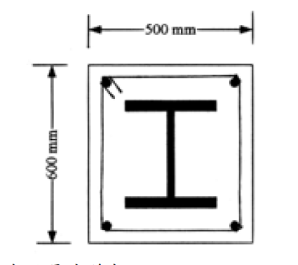

# 考題編號：SS-2003-2

**主分類：** `4.1.1` 拉力及壓力桿件
**副分類：**（無）
**設計法：** LRFD
**標籤：** `SRC複合柱` `包覆型複合柱` `有效降伏強度Fmy` `修正彈性模數Em` `整體挫屈` `彈性挫屈` `λc` `Fcr` `φcPn` `H型鋼` `A572` `SD420`

---

## 1. 原始題目重述 (Problem Restatement)

一 SRC 複合柱（包覆型），斷面及材料如下：

*圖說：混凝土斷面 500 mm（寬）× 600 mm（高）；H312×303×13×21 型鋼（強軸垂直）置於斷面中央；四角配置 D32 圓形螺紋鋼筋（SD420）。*

**材料性質：**

| 材料 | 規格 | 強度 | 彈性模數 |
|------|------|------|---------|
| 結構鋼（H型鋼） | A572 Gr.50 | $F_y = 3.5\ \text{tf/cm}^2$ | $E = 2100\ \text{tf/cm}^2$ |
| 鋼筋 | SD420, D32 | $F_{yr} = 4.2\ \text{tf/cm}^2$ | — |
| 混凝土 | — | $f'_c = 280\ \text{kgf/cm}^2$ | $E_c = 250\ \text{tf/cm}^2$ |

**H312×303×13×21 型鋼斷面性質：**

$$A_s = 165\ \text{cm}^2,\quad r_x = 13.4\ \text{cm},\quad r_y = 7.7\ \text{cm}$$

**D32 單根面積：** $A_{D32} = 8.14\ \text{cm}^2$（四角各一，共 4 根）

**柱高與有效長度：** $L = 15\ \text{m} = 1500\ \text{cm}$，$K = 0.8$

**提供公式（AISC LRFD 複合柱）：**

$$P_n = A_s \cdot F_{cr} \tag{1}$$

$$\lambda_c \leq 1.5:\quad F_{cr} = \left[\exp(-0.419\lambda_c^2)\right]F_{my} \tag{2}$$

$$\lambda_c > 1.5:\quad F_{cr} = \left[\frac{0.877}{\lambda_c^2}\right]F_{my} \tag{3}$$

$$\lambda_c = \frac{kL}{\pi r}\sqrt{\frac{F_{my}}{E_m}} \tag{4}$$

**修正公式（包覆型 SRC，$C_1 = 0.7,\ C_2 = 0.6,\ C_3 = 0.2$）：**

$$F_{my} = F_y + C_1 F_{yr}\frac{A_r}{A_s} + C_2 f'_c\frac{A_c}{A_s}$$

$$E_m = E + C_3 E_c\frac{A_c}{A_s}$$

**求：**
1. 各部分面積 $A_s, A_r, A_c$，確認最小鋼料比，並確定控制迴轉半徑 $r_m$
2. 計算修正降伏強度 $F_{my}$ 與修正彈性模數 $E_m$
3. 計算設計壓力強度 $\phi_c P_n$（$\phi_c = 0.85$）

---

## 2. 考題核心精神與出題者意圖 (Core Concepts & Examiner's Intent)

**核心觀念：** SRC 複合柱的三大構成要素（結構鋼、鋼筋、混凝土）各有不同貢獻係數，透過 $F_{my}$、$E_m$ 等效成純鋼柱的修正設計強度，再套用 AISC LRFD 柱強度曲線求 $\phi_c P_n$。

**出題意圖：**
1. 測驗考生是否理解「為何要折減混凝土與鋼筋的貢獻」（C 係數 < 1.0）
2. 測驗 $\lambda_c$ 計算與彈性/非彈性挫屈的判斷
3. 考驗長柱（$\lambda_c > 1.5$）使用彈性挫屈公式的能力

---

## 3. 解題戰略地圖與陷阱分析 (Strategic Roadmap & Trap Analysis)

**解題順序：**
$$\text{各面積} \to \text{最小鋼料比檢核} \to F_{my},\,E_m \to \lambda_c \to F_{cr} \to \phi_c P_n$$

**關鍵陷阱：**

1. **$f'_c$ 單位轉換**：題目給 $f'_c = 280\ \text{kgf/cm}^2$，代入公式前須換算為 $0.280\ \text{tf/cm}^2$（與 $F_y$ 同單位）。這是最常出錯的地方。

2. **控制軸的選取**：須比較 $KL/r_x$ 與 $KL/r_y$，弱軸（$r_y = 7.7\ \text{cm}$）細長比必然大於強軸（$r_x = 13.4\ \text{cm}$），弱軸控制。

3. **$P_n = A_s \cdot F_{cr}$（不是 $A_g \cdot F_{cr}$）**：複合柱的名目強度乘的是**鋼料斷面積** $A_s$，而非整體複合斷面積 $A_g$。公式中「$A_g$」的標記有時指鋼料本身的 gross area，即 $A_s$。

4. **C 係數選對**：包覆型 SRC 使用 $C_1=0.7,\,C_2=0.6,\,C_3=0.2$；充填型 CFT 使用 $C_1=1.0,\,C_2=0.85,\,C_3=0.4$——兩組千萬不能用錯。

## 3.5 變數層次分析（Variable Hierarchy Analysis）

> 複習提示：解題後，在每個卡住的知識點「卡關?」欄標記 `⚠`；第二次複習時只看有 `⚠` 的項目。

**最終目標：** 各面積 → 最小鋼料比 → $\boxed{F_{my}}$、$\boxed{E_m}$ → $\boxed{\lambda_c}$ → $\boxed{F_{cr}}$（彈性挫屈）→ $\boxed{\phi_c P_n}$

### 主要公式（$\boxed{\phantom{x}}$ = 未知，待推導）

$$A_c = A_g - A_s - A_r = 3000 - 165 - 32.56 = \boxed{2802.44}\ \text{cm}^2$$
$$\boxed{F_{my}} = F_y + 0.7 F_{yr}\frac{A_r}{A_s} + 0.6 f'_c\frac{A_c}{A_s} = 6.934\ \text{tf/cm}^2$$
$$\boxed{E_m} = E + 0.2 E_c\frac{A_c}{A_s} = 2949\ \text{tf/cm}^2$$
$$\boxed{\lambda_c} = \frac{KL}{\pi r_y}\sqrt{\frac{F_{my}}{E_m}} = 2.405 > 1.5 \Rightarrow \text{彈性挫屈}$$
$$\boxed{F_{cr}} = \frac{0.877}{\lambda_c^2}F_{my} = 1.051\ \text{tf/cm}^2 \Rightarrow \boxed{\phi_c P_n} = 0.85 A_s F_{cr} \approx 147\ \text{tf}$$

### L1：題目直接給定

| 符號 | 數值 | 說明 |
|------|------|------|
| 混凝土斷面 | 500 × 600 mm | $A_g = 3000$ cm² |
| H 型鋼 | H312×303×13×21 | $A_s = 165$ cm²，$r_x = 13.4$，$r_y = 7.7$ cm |
| 鋼筋 | 4 根 D32（SD420）| $A_{D32} = 8.14$ cm²，$F_{yr} = 4.2$ tf/cm² |
| $F_y$（H 型鋼）| 3.5 tf/cm² | A572 Gr.50 |
| $f'_c$ | 280 kgf/cm² = 0.280 tf/cm² | 混凝土抗壓強度 |
| $E_c$ | 250 tf/cm² | 混凝土彈性模數 |
| $L$ | 15 m | 柱高 |
| $K$ | 0.8 | 有效長度係數 |
| 斷面型式 | 包覆型 SRC | $C_1=0.7$，$C_2=0.6$，$C_3=0.2$ |

### L2：需知識點推導

**Step 1：各斷面積與最小鋼料比**

| 符號 | 公式 / 來源 | 卡關? |
|------|------------|:-----:|
| $A_r$ | $4 \times 8.14 = 32.56$ cm² | |
| $A_c$ | $3000 - 165 - 32.56 = 2802.44$ cm² | |
| $A_s/A_g$ | $165/3000 = 5.5\% \geq 4\%$ ✓ | |
| 控制 $r_m$ | $r_y = 7.7$ cm（弱軸，$r_y < r_x$）| |

**Step 2：$F_{my}$ 計算（注意 $f'_c$ 單位換算）**

| 符號 | 公式 / 來源 | 卡關? |
|------|------------|:-----:|
| $f'_c$ | $280\ \text{kgf/cm}^2 = 0.280\ \text{tf/cm}^2$（**單位換算，最常錯**）| |
| $C_1 F_{yr}(A_r/A_s)$ | $0.7 \times 4.2 \times 0.197 = 0.581$ tf/cm² | |
| $C_2 f'_c(A_c/A_s)$ | $0.6 \times 0.280 \times 16.98 = 2.853$ tf/cm² | |
| $F_{my}$ | $3.5 + 0.581 + 2.853 = 6.934$ tf/cm² | |

**Step 3：$E_m$ 計算**

| 符號 | 公式 / 來源 | 卡關? |
|------|------------|:-----:|
| $C_3 E_c(A_c/A_s)$ | $0.2 \times 250 \times 16.98 = 849$ tf/cm² | |
| $E_m$ | $2100 + 849 = 2949$ tf/cm² | |

**Step 4：$\lambda_c$ 與挫屈判斷**

| 符號 | 公式 / 來源 | 卡關? |
|------|------------|:-----:|
| $KL/r_y$ | $0.8 \times 1500/7.7 = 155.8$ | |
| $\lambda_c$ | $(KL/\pi r_y)\sqrt{F_{my}/E_m} = 2.405 > 1.5$（彈性挫屈）| |
| $F_{cr}$ | $0.877/\lambda_c^2 \times F_{my} = 1.051$ tf/cm² | |
| $\phi_c P_n$ | $0.85 \times 165 \times 1.051 = 147.4$ tf | |

### L3：深層知識（不懂就卡住）

| 知識點 | 說明 | 補強頁 | 卡關? |
|--------|------|:------:|:-----:|
| $f'_c$ 單位換算（kgf → tf）| kgf/cm² ÷ 1000 = tf/cm²，漏換算是最常見失分點 | | |
| $P_n = A_s \cdot F_{cr}$（非 $A_g$）| 複合柱公式的等效面積邏輯：貢獻已折算進 $F_{my}$，只乘 $A_s$ | | |
| $\lambda_c > 1.5$ 用 $0.877/\lambda_c^2$ 公式 | 彈性挫屈（長柱）；$\leq 1.5$ 用指數公式（非彈性）| [[lrfd-column]] · [[COLUMN-STRENGTH-CURVE]] | |
| 包覆型 vs 充填型 C 係數 | SRC：$C_2=0.6$；CFT：$C_2=0.85$，不能混用 | | |
| 弱軸控制（$r_y < r_x$）| 複合柱仍需比較兩軸細長比 | | |

---

## 4. 步驟化詳細計算過程 (Step-by-Step Detailed Calculation)

### 步驟 1：計算各斷面積

$$A_g = 50 \times 60 = 3000\ \text{cm}^2 \quad \text{（複合斷面總面積）}$$

$$A_s = 165\ \text{cm}^2 \quad \text{（H型鋼斷面積，題目給定）}$$

$$A_r = 4 \times 8.14 = 32.56\ \text{cm}^2 \quad \text{（4 根 D32 鋼筋）}$$

$$A_c = A_g - A_s - A_r = 3000 - 165 - 32.56 = \boxed{2802.44\ \text{cm}^2}$$

**最小鋼料比檢核（AISC 要求 $A_s/A_g \geq 4\%$）：**

$$\frac{A_s}{A_g} = \frac{165}{3000} = 5.5\% \geq 4\% \quad \checkmark$$

可採用複合柱設計公式。

**控制迴轉半徑：**

$$r_m = r_y = 7.7\ \text{cm} \quad \text{（弱軸控制，}r_y < r_x\text{）}$$

---

### 步驟 2：計算修正降伏強度 $F_{my}$

單位統一：$f'_c = 280\ \text{kgf/cm}^2 = 0.280\ \text{tf/cm}^2$

$$F_{my} = F_y + C_1 F_{yr}\frac{A_r}{A_s} + C_2 f'_c\frac{A_c}{A_s}$$

$$= 3.5 + 0.7 \times 4.2 \times \frac{32.56}{165} + 0.6 \times 0.280 \times \frac{2802.44}{165}$$

$$= 3.5 + 0.7 \times 4.2 \times 0.1973 + 0.6 \times 0.280 \times 16.984$$

$$= 3.5 + 0.581 + 2.853$$

$$\boxed{F_{my} = 6.934\ \text{tf/cm}^2}$$

---

### 步驟 3：計算修正彈性模數 $E_m$

$$E_m = E + C_3 E_c \frac{A_c}{A_s}$$

$$= 2100 + 0.2 \times 250 \times \frac{2802.44}{165}$$

$$= 2100 + 50 \times 16.984$$

$$= 2100 + 849.2$$

$$\boxed{E_m = 2949\ \text{tf/cm}^2}$$

---

### 步驟 4：計算等效細長比 $\lambda_c$

有效長度：

$$KL = 0.8 \times 1500 = 1200\ \text{cm}$$

弱軸（控制）：

$$\frac{KL}{r_y} = \frac{1200}{7.7} = 155.8$$

$$\lambda_c = \frac{KL}{\pi r_y}\sqrt{\frac{F_{my}}{E_m}} = \frac{1200}{\pi \times 7.7}\sqrt{\frac{6.934}{2949}}$$

$$= \frac{1200}{24.19} \times \sqrt{0.002351}$$

$$= 49.60 \times 0.04849$$

$$\boxed{\lambda_c = 2.405}$$

**判斷：** $\lambda_c = 2.405 > 1.5$ → **彈性挫屈**，使用公式 (3)

> *策略註解：此柱 $L=15\,\text{m}$、$K=0.8$，$KL/r_y=155.8$ 相當細長。$\lambda_c > 2.0$ 表示柱在彈性範圍內挫屈，混凝土貢獻（反映在 $F_{my}$）雖大幅提高名目降伏強度，但彈性挫屈公式 $F_{cr}=0.877/\lambda_c^2 \times F_{my}$ 同時將其大幅折減。*

---

### 步驟 5：計算臨界應力 $F_{cr}$

$$F_{cr} = \frac{0.877}{\lambda_c^2} \times F_{my} = \frac{0.877}{(2.405)^2} \times 6.934$$

$$= \frac{0.877}{5.784} \times 6.934 = 0.1516 \times 6.934$$

$$\boxed{F_{cr} = 1.051\ \text{tf/cm}^2}$$

---

### 步驟 6：計算設計壓力強度 $\phi_c P_n$

$$P_n = A_s \times F_{cr} = 165 \times 1.051 = 173.4\ \text{tf}$$

$$\phi_c P_n = 0.85 \times 173.4$$

$$\boxed{\phi_c P_n \approx 147.4\ \text{tf}}$$

---

### 驗算：確認強軸不控制

$$\frac{KL}{r_x} = \frac{1200}{13.4} = 89.6$$

$$\lambda_{cx} = \frac{89.6}{\pi}\sqrt{\frac{6.934}{2949}} = 28.52 \times 0.04849 = 1.383 < 1.5$$

→ 強軸為**非彈性挫屈**：

$$F_{cr,x} = \exp(-0.419 \times 1.383^2) \times 6.934 = \exp(-0.800) \times 6.934 = 0.449 \times 6.934 = 3.114\ \text{tf/cm}^2$$

$$\phi_c P_{n,x} = 0.85 \times 165 \times 3.114 = 436.4\ \text{tf}$$

**結論：弱軸控制，$\phi_c P_n = 147.4\ \text{tf}$。**

---

## 5. 關鍵爭議點與進階探討 (Critical Issues & Advanced Discussion)

### Q：$\lambda_c > 2.0$ 的柱是否過於細長？

本題 $\lambda_c = 2.405$，屬彈性挫屈範圍。AISC 並未直接限制 $\lambda_c$ 上限，但規定壓力桿件 $KL/r \leq 200$（本題 155.8 < 200 ✓）。然而 $\lambda_c > 2$ 時 $F_{cr} < 0.22F_{my}$，柱效率極低，實務上應考慮縮短有效長度（增加側向支撐）或增大斷面。

### Q：C 係數為何 SRC < CFT？

| 型式 | $C_1$（鋼筋）| $C_2$（混凝土）| 原因 |
|------|------------|------------|------|
| 包覆型 SRC | 0.7 | 0.6 | 混凝土易脫落，圍束效果較差 |
| 充填型 CFT | 1.0 | 0.85 | 鋼管提供圍束，混凝土三軸壓力提高強度 |

SRC 的混凝土在受壓破壞時保護層會剝落，實際有效面積偏少，故 $C_2$ 較低。

### Q：$P_n = A_s \cdot F_{cr}$ 為何不用 $A_g$？

AISC LRFD 複合柱公式的物理意義：$F_{my}$ 與 $E_m$ 已將鋼筋與混凝土的強度等效到鋼料面積 $A_s$ 上（「換算面積法」的精神）。$P_n = A_s \times F_{cr}$ 本質上是「等效鋼料面積 × 等效臨界應力」，不需再乘 $A_g$，否則雙重計入混凝土貢獻。

### 面積比對計算過程驗算

| 項目 | 數值 |
|------|------|
| $A_r/A_s$ | $32.56/165 = 0.197$ |
| $A_c/A_s$ | $2802.44/165 = 16.98$ |
| $C_1 F_{yr}(A_r/A_s)$ | $0.7\times4.2\times0.197 = 0.580\ \text{tf/cm}^2$ |
| $C_2 f'_c(A_c/A_s)$ | $0.6\times0.280\times16.98 = 2.853\ \text{tf/cm}^2$ |
| $F_{my}$ | $3.5 + 0.580 + 2.853 = 6.933\ \text{tf/cm}^2$ |
| $C_3 E_c(A_c/A_s)$ | $0.2\times250\times16.98 = 849\ \text{tf/cm}^2$ |
| $E_m$ | $2100 + 849 = 2949\ \text{tf/cm}^2$ |
| $\lambda_c$（弱軸）| 2.405 |
| $F_{cr}$ | $1.051\ \text{tf/cm}^2$ |
| $\phi_c P_n$ | **147 tf** |
