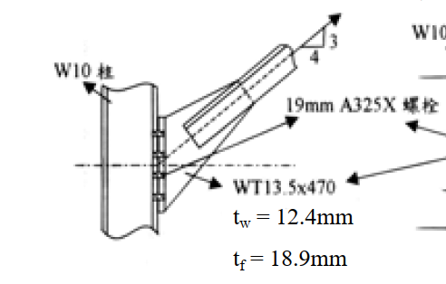
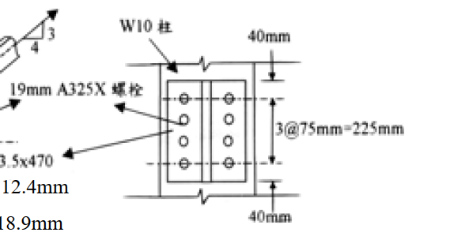

# 考題編號：SS-2003-3

**主分類：** `SS-U1-4` 接合之分析與設計
**副分類：** `SS-U1-1` 拉力及壓力桿件
**設計法：** LRFD
**標籤：** `接合設計` `剪力遲滯` `U值` `螺栓接合` `A325X` `塊狀剪力` `淨斷面斷裂` `WT斷面` `承壓型螺栓` `有效淨面積`

---

## 1. 原始題目重述 (Problem Restatement)

WT13.5×470 拉力構材以 19mm A325X 螺栓（承壓型，牙紋在剪力面外）連接至 W10 柱，螺栓孔徑 22mm。

*圖說：WT13.5×470 莖部（stem）置於 W10 柱腹板旁，螺栓穿過 WT 莖部傳力；W10 左側為托架式連接，右側為螺栓配置詳圖。*

*圖說：沿載重方向：端邊距 $L_e = 40$ mm，螺栓間距 $S = 75$ mm（共 3 個間距＝4 顆螺栓列），端邊距 40mm；橫向雙列配置時，列距 $g$（見 fig-1 圖）。*

**材料性質：**

| 項目 | 數值 |
|------|------|
| 鋼材（A36）| $F_y = 2.5\ \text{tf/cm}^2$，$F_u = 4.1\ \text{tf/cm}^2$ |
| WT 莖部厚度 | $t_w = 12.4\ \text{mm} = 1.24\ \text{cm}$ |
| WT 翼板厚度 | $t_f = 18.9\ \text{mm} = 1.89\ \text{cm}$ |
| 連接板厚度 | $t = 9.5\ \text{mm} = 0.95\ \text{cm}$ |
| WT 全斷面積 | $A_g = 34.45\ \text{cm}^2$ |

**螺栓性質（19mm A325X）：**

| 項目 | 數值 |
|------|------|
| 螺栓面積 | $A_b = 2.85\ \text{cm}^2$ |
| 剪力強度 | $F_v = 4.2\ \text{tf/cm}^2$（X 型，牙紋在剪力面外）|
| 拉力強度 | $F_t = 6.3\ \text{tf/cm}^2$ |
| 設計折減係數 | $\phi = 0.75$ |

**螺栓幾何：** $L_e = 40\ \text{mm}$，$S = 75\ \text{mm}$，螺栓孔 $d_h = 22\ \text{mm}$（計算用扣除：$d_h + 2 = 24\ \text{mm} = 2.4\ \text{cm}$）

**求：**

**(一)** 3 顆螺栓（單列，沿載重方向），計算各破壞模式的設計強度 $\phi R_n$ 或 $\phi_t P_n$

**(二)** 8 顆螺栓（2 列 × 4 顆），計算塊狀剪力（block shear）設計強度

---

## 2. 考題核心精神與出題者意圖 (Core Concepts & Examiner's Intent)

**核心觀念：** WT 斷面以莖部（單元素）連接時，翼板未直接傳力，產生「剪力遲滯」（shear lag），導致有效淨斷面積 $A_e < A_n$。多列螺栓的塊狀剪力破壞是另一個必須檢核的接合失效模式。

**出題意圖：**
1. WT 以莖部連接 → 翼板有剪力遲滯 → 必須乘以 U 折減係數
2. 比較「U = 0.75、0.85、0.90」三種情況的適用條件
3. 塊狀剪力計算：考驗學生能否正確識別剪力面與拉力面，並選擇正確的強度公式

---

## 3. 解題戰略地圖與陷阱分析 (Strategic Roadmap & Trap Analysis)

**解題順序（一）：** 螺栓剪力 → 承壓 → 全斷面降伏 → 淨斷面斷裂（含 U）→ 取最小值

**解題順序（二）：** 判斷剪力/拉力面 → 比較 $F_u A_{nt}$ vs $0.6F_u A_{nv}$ → 選公式 → $\phi R_n$

**關鍵陷阱：**

1. **U 值選取**：WT 僅以莖部連接，翼板不連接，連接元素寬度 $< 2/3$ 翼板寬，故 U 不能取 0.90。3 顆螺栓單列 → 查表取 **U = 0.75**。

2. **承壓公式辨認**：端部螺栓（$L_e = 40\ \text{mm} \geq 1.5d = 28.5\ \text{mm}$）用端部公式；內部螺栓用間距公式，並受上限 $2.4dtF_u$ 控制。

3. **塊狀剪力「組合選擇」**：先比較 $F_u A_{nt}$ 與 $0.6F_u A_{nv}$ 的大小，再決定是「剪切降伏＋拉力斷裂」還是「剪切斷裂＋拉力降伏」。

4. **連接板厚度取較薄者**：承壓計算使用 $\min(t_w, t) = \min(1.24, 0.95) = 0.95\ \text{cm}$（連接板控制）。

## 3.5 變數層次分析（Variable Hierarchy Analysis）

> 複習提示：解題後，在每個卡住的知識點「卡關?」欄標記 `⚠`；第二次複習時只看有 `⚠` 的項目。

**最終目標：** (一) 3 螺栓：螺栓剪力 → 承壓 → 全斷面降伏 → 淨斷面斷裂（含 $U=0.75$）→ $\boxed{\phi R_n}$（剪力控制）；(二) 8 螺栓：$\boxed{\phi R_{n,BSR}}$

### 主要公式（$\boxed{\phantom{x}}$ = 未知，待推導）

**小題(一)：3 螺栓**
$$\boxed{\phi R_{n,shear}} = n \cdot \phi \cdot F_v \cdot A_b = 3 \times 0.75 \times 4.2 \times 2.85 = 26.97\ \text{tf}$$
$$A_e = U \cdot A_n = 0.75 \times 31.47 = 23.60\ \text{cm}^2 \Rightarrow \phi_t P_n = 0.75 F_u A_e = 72.6\ \text{tf}$$

**小題(二)：8 螺栓塊狀剪力**
$$0.6F_uA_{nv} = 84.60\ \text{tf} > F_uA_{nt} = 19.87\ \text{tf} \Rightarrow \text{剪斷控制}$$
$$\boxed{\phi R_{n,BSR}} = 0.75 \times (0.6F_uA_{nv} + F_yA_{gt}) = 0.75 \times 102.4 = 76.8\ \text{tf}$$

### L1：題目直接給定

| 符號 | 數值 | 說明 |
|------|------|------|
| WT 斷面 | WT13.5×470 | 以莖部連接至柱腹板 |
| $A_g$ | 34.45 cm² | WT 全斷面積 |
| $t_w$（莖部）| 1.24 cm | 傳力元素厚度 |
| $F_y$ | 2.5 tf/cm² | A36 降伏強度 |
| $F_u$ | 4.1 tf/cm² | 極限強度 |
| $d$（螺栓）| 19 mm = 1.9 cm | A325X 螺栓直徑 |
| $A_b$ | 2.85 cm² | 螺栓截面積 |
| $F_v$ | 4.2 tf/cm² | A325X 容許剪應力（X 型）|
| $d_h$（計算用）| 2.4 cm（孔徑 + 2 mm）| 淨面積扣除量 |
| $L_e$ | 40 mm = 4.0 cm | 端邊距 |
| $S$ | 75 mm = 7.5 cm | 縱向螺栓間距 |
| $g$（小題二）| 7.5 cm | 橫向列距 |
| $t$（連接板）| 0.95 cm | 承壓控制元素（比 $t_w$ 薄）|

### L2：需知識點推導

**Step 1(一)：螺栓剪力強度**

| 符號 | 公式 / 來源 | 卡關? |
|------|------------|:-----:|
| $\phi R_{n,shear}$ | $3 \times 0.75 \times 4.2 \times 2.85 = 26.97$ tf（**控制**）| |

**Step 2(一)：淨斷面斷裂（含 $U$）**

| 符號 | 公式 / 來源 | 卡關? |
|------|------------|:-----:|
| $A_n$ | $A_g - d_h t_w = 34.45 - 2.4 \times 1.24 = 31.47$ cm² | |
| $U$（3 螺栓，莖部連接）| 查表 → $U = 0.75$（翼板未連接，螺栓數 = 3）| |
| $A_e$ | $U \times A_n = 0.75 \times 31.47 = 23.60$ cm² | |
| $\phi_t P_n$（淨斷面）| $0.75 \times 4.1 \times 23.60 = 72.6$ tf | |

**Step 3(二)：8 螺栓塊狀剪力面積**

| 符號 | 公式 / 來源 | 卡關? |
|------|------------|:-----:|
| $A_{gv}$（2 剪力面）| $2 \times (L_e + 3S) \times t = 2 \times 26.5 \times 0.95 = 50.35$ cm² | |
| $A_{nv}$ | $2 \times (26.5 - 3.5 \times 2.4) \times 0.95 = 34.39$ cm² | |
| $A_{gt}$（拉力面）| $g \times t = 7.5 \times 0.95 = 7.125$ cm² | |
| $A_{nt}$ | $(g - d_h) \times t = 5.1 \times 0.95 = 4.845$ cm² | |
| 判斷 | $0.6F_uA_{nv} = 84.60 > F_uA_{nt} = 19.87$→剪斷控制 | |
| $R_n$ | $84.60 + F_yA_{gt} = 84.60 + 17.81 = 102.4$ tf | |
| $\phi R_{n,BSR}$ | $0.75 \times 102.4 = 76.8$ tf | |

### L3：深層知識（不懂就卡住）

| 知識點 | 說明 | 補強頁 | 卡關? |
|--------|------|:------:|:-----:|
| 剪力遲滯 $U$ 值查表邏輯 | WT 莖部連接（單元素），3 螺栓 → $U = 0.75$；4 螺栓以上 → $U = 0.85$ | [[shear-lag-u]] · [[SHEAR-LAG]] | |
| Block Shear 兩種公式選擇 | 先比較 $F_uA_{nt}$ vs $0.6F_uA_{nv}$，較大者為強者，另一面先達極限 | [[block-shear]] · [[BLOCK-SHEAR-RUPTURE]] | |
| 拉力面孔扣除數量 | 橫向拉力面只扣 1 個孔（即 $g - d_h$），不像縱向那樣按列數扣 | | |
| 承壓控制板厚取較薄者 | $\min(t_w, t_{plate}) = 0.95$ cm（連接板控制）| | |
| $\phi = 0.75$ 用於接合破壞（非 0.9）| 淨斷面斷裂、塊狀剪力、螺栓剪力均用 $\phi = 0.75$ | | |

---

## 4. 步驟化詳細計算過程 (Step-by-Step Detailed Calculation)

### (一) 3 螺栓單列：各破壞模式設計強度

#### 4.1 螺栓剪力強度（單面剪切）

$$\phi R_{n,shear} = n \times \phi \times F_v \times A_b = 3 \times 0.75 \times 4.2 \times 2.85$$

$$\boxed{\phi R_{n,shear} = 26.97\ \text{tf}}$$

#### 4.2 承壓強度（控制板厚：$t = 0.95\ \text{cm}$，$d = 1.9\ \text{cm}$）

**檢核 $L_e \geq 1.5d$：** $40\ \text{mm} \geq 1.5 \times 19 = 28.5\ \text{mm}$ ✓（用標準端部公式）

**端部螺栓（共 1 顆）：**
$$R_{n,end} = L_e \times t \times F_u = 4.0 \times 0.95 \times 4.1 = 15.58\ \text{tf}$$
$$\text{上限：}2.4 \times d \times t \times F_u = 2.4 \times 1.9 \times 0.95 \times 4.1 = 17.73\ \text{tf}$$
$$R_{n,end} = 15.58\ \text{tf}\ \text{（端部公式控制）}$$

**內部螺栓（共 2 顆）：**
$$R_{n,int} = (S - 0.5d) \times t \times F_u = (7.5 - 0.95) \times 0.95 \times 4.1 = 6.55 \times 3.895 = 25.52\ \text{tf}$$
$$\text{上限：}2.4dtF_u = 17.73\ \text{tf}\ \text{（上限控制）}$$
$$R_{n,int} = 17.73\ \text{tf each}$$

**總承壓設計強度：**
$$\phi R_{n,bearing} = 0.75 \times (15.58 + 17.73 \times 2) = 0.75 \times 51.04$$

$$\boxed{\phi R_{n,bearing} = 38.28\ \text{tf}}$$

#### 4.3 全斷面降伏（$\phi_t = 0.9$）

$$\phi_t P_n = 0.9 \times F_y \times A_g = 0.9 \times 2.5 \times 34.45$$

$$\boxed{\phi_t P_n = 77.5\ \text{tf}}$$

#### 4.4 淨斷面斷裂（含剪力遲滯 U，$\phi_t = 0.75$）

**淨斷面積**（莖部單列，每截面扣 1 孔）：

$$A_n = A_g - d_h \times t_w = 34.45 - 2.4 \times 1.24 = 34.45 - 2.98 = 31.47\ \text{cm}^2$$

**U 值判斷（WT 莖部連接，3 顆螺栓）：**

WT 以莖部連接，翼板完全未連接，連接元素寬度 $< 2/3 b_f$：

$$\text{查表：僅莖部連接，螺栓數} = 3 \Rightarrow U = 0.75$$

亦可用公式驗算：$U = 1 - \bar{x}/L$

- $\bar{x}$ ≈ WT 斷面重心到莖部尖端距離（約 3.74 cm，依斷面性質）
- $L = (3-1) \times 7.5 = 15.0\ \text{cm}$（連接長度）
- $U = 1 - 3.74/15.0 = 0.751 \approx 0.75$ ✓

**有效淨斷面積：**
$$A_e = U \times A_n = 0.75 \times 31.47 = 23.60\ \text{cm}^2$$

**設計強度：**
$$\phi_t P_n = 0.75 \times F_u \times A_e = 0.75 \times 4.1 \times 23.60$$

$$\boxed{\phi_t P_n = 72.6\ \text{tf}\ \text{（淨斷面斷裂）}}$$

#### 4.5 三螺栓接合設計強度匯整

| 破壞模式 | 設計強度 |
|---------|---------|
| 螺栓剪力 | **26.97 tf** ← 控制 |
| 承壓（連接板） | 38.28 tf |
| 全斷面降伏 | 77.51 tf |
| 淨斷面斷裂（U=0.75）| 72.63 tf |

$$\boxed{\phi R_n = 26.97\ \text{tf}\ \text{（螺栓剪力控制）}}$$

> *策略註解：3 顆螺栓的剪力容量（≈27 tf）遠低於構材容量（≈73 tf），代表此接合設計不足。若需充分發揮構材承載力，至少需要 $\lceil 73/8.99 \rceil = 9$ 顆螺栓。*

---

### (二) 8 螺栓（2 列 × 4 顆）：塊狀剪力設計強度

螺栓配置：2 列（橫向列距 $g = 75\ \text{mm} = 7.5\ \text{cm}$），每列 4 顆（縱向間距 $S = 75\ \text{mm}$）

連接板（控制）：$t = 0.95\ \text{cm}$，$d_h = 2.4\ \text{cm}$

#### 4.6 識別塊狀剪力面積

**剪力面（2 個，沿載重方向，平行於兩列螺栓外緣）：**

$$A_{gv} = 2 \times \left[L_e + (n_{row}-1) \times S\right] \times t = 2 \times (4.0 + 3 \times 7.5) \times 0.95$$

$$= 2 \times (4.0 + 22.5) \times 0.95 = 2 \times 26.5 \times 0.95 = 50.35\ \text{cm}^2$$

$$A_{nv} = 2 \times \left[L_e + (n_{row}-1)S - (n_{row}-0.5) \times d_h\right] \times t$$

$$= 2 \times \left[26.5 - 3.5 \times 2.4\right] \times 0.95 = 2 \times (26.5 - 8.4) \times 0.95$$

$$= 2 \times 18.1 \times 0.95 = 34.39\ \text{cm}^2$$

**拉力面（1 個，垂直於載重方向，連接兩列最前端螺栓）：**

$$A_{gt} = g \times t = 7.5 \times 0.95 = 7.125\ \text{cm}^2$$

$$A_{nt} = (g - d_h) \times t = (7.5 - 2.4) \times 0.95 = 5.1 \times 0.95 = 4.845\ \text{cm}^2$$

#### 4.7 判斷破壞組合

$$F_u A_{nt} = 4.1 \times 4.845 = 19.87\ \text{tf}$$

$$0.6 F_u A_{nv} = 0.6 \times 4.1 \times 34.39 = 84.60\ \text{tf}$$

$$\because 0.6F_u A_{nv} = 84.60 > F_u A_{nt} = 19.87$$

→ **剪力斷裂控制**，搭配拉力面降伏（$F_y A_{gt}$）：

$$R_n = 0.6F_u A_{nv} + F_y A_{gt}$$

$$= 84.60 + 2.5 \times 7.125 = 84.60 + 17.81 = 102.4\ \text{tf}$$

**上限值驗算：**
$$\text{上限} = 0.6F_u A_{nv} + F_u A_{nt} = 84.60 + 19.87 = 104.47\ \text{tf}$$

$R_n = 102.4 < 104.47$ ✓，無需調整

#### 4.8 設計塊狀剪力強度

$$\phi R_{n,BSR} = 0.75 \times 102.4$$

$$\boxed{\phi R_{n,BSR} = 76.8\ \text{tf}}$$

---

## 5. 關鍵爭議點與進階探討 (Critical Issues & Advanced Discussion)

### Q：U = 0.75 是保守值？還是正確值？

對於 WT 連接而言：
- 若能用公式 $U = 1 - \bar{x}/L$ 計算出比 0.75 更高的值，可取公式值
- 但當螺栓數僅 3 顆（$L$ 短），$\bar{x}/L$ 往往不小，U 接近甚至低於 0.75
- 本題計算 $U \approx 0.751$，與查表值 0.75 吻合，無爭議

### Q：塊狀剪力的「上限值」為何？

AISC LRFD 規定上限值防止同一面積被重複計算：
$$R_n \leq 0.6F_uA_{nv} + F_uA_{nt}$$

這等同於「兩個面都用斷裂值」的上限，因為物理上不可能在剪力面和拉力面同時發生降伏 + 斷裂。

### Q：8 螺栓接合足以發揮構材強度嗎？

構材全斷面降伏：$\phi_t P_n = 77.5\ \text{tf}$

8 螺栓接合控制：$\phi R_{n,BSR} = 76.8\ \text{tf}$（若塊狀剪力控制）

 $76.8 \approx 77.5$ tf，塊狀剪力強度幾乎等於構材容量，接合效率達 99%。惟應同時確認螺栓剪力與承壓不控制：

8 螺栓剪力：$\phi R_n = 8 \times 0.75 \times 4.2 \times 2.85 = 71.9\ \text{tf}$（比構材容量略低，仍為控制值）

**結論：8 螺栓接合在螺栓剪力模式下 $\phi R_n = 71.9\ \text{tf}$，略小於構材容量 77.5 tf，仍有效率損失；若改用雙剪（插板式）接合，容量加倍。**
