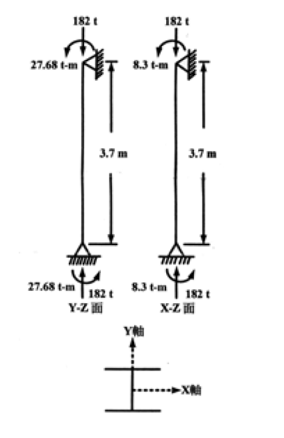

# 考題編號：SS-2003-4

**主分類：** `SS-U1-3` 梁柱桿件
**副分類：**（無）
**設計法：** ASD
**標籤：** `梁柱桿件` `ASD` `雙軸彎矩` `P-M互制` `Cm係數` `放大係數` `fa/Fa判斷` `F'e歐拉應力` `穩定方程式` `強度方程式` `W12×170` `A36`

---

## 1. 原始題目重述 (Problem Restatement)

W12×170 梁柱桿件，A36 鋼材，承受雙軸彎矩與軸壓，以 ASD 法設計，25 分。

*圖說：W12×170 柱，柱高 $L = 3.7\ \text{m}$，軸壓 $P = 182\ \text{t}$；強軸彎矩（Y-Z 面）$M_x = 27.68\ \text{t-m}$，弱軸彎矩（X-Z 面）$M_y = 8.30\ \text{t-m}$；有效長度係數 $K_x = K_y = 1.0$，兩端（柱頂與柱底）承受相同方向彎矩（側移構架）。*

**W12×170 斷面性質（A36）：**

| 性質 | 數值 |
|------|------|
| 斷面積 $A$ | 322.58 cm² |
| 強軸斷面模數 $S_x$ | 3850.96 cm³ |
| 強軸迴轉半徑 $r_x$ | 14.58 cm |
| 弱軸斷面模數 $S_y$ | 1348.66 cm³ |
| 弱軸迴轉半徑 $r_y$ | 8.18 cm |
| 緊密撓度極限距 $L_c$ | 4.05 m |
| 非緊密撓度極限距 $L_u$ | 19.6 m |

**材料性質：**

$$F_y = 2.50\ \text{tf/cm}^2,\quad F_u = 4.10\ \text{tf/cm}^2,\quad E = 2100\ \text{tf/cm}^2$$

**ASD 設計公式（題目提供）：**

$$C_c = \sqrt{\frac{2\pi^2 E}{F_y}}$$

$$\frac{KL}{r} \leq C_c:\quad F_a = \frac{\left[1-\dfrac{(KL/r)^2}{2C_c^2}\right]F_y}{\dfrac{5}{3}+\dfrac{3(KL/r)}{8C_c}-\dfrac{(KL/r)^3}{8C_c^3}}$$

$$\frac{KL}{r} > C_c:\quad F_a = \frac{12\pi^2 E}{23(KL/r)^2}$$

$$F'_{ex} = \frac{12\pi^2 E}{23(KL_b/r_x)^2},\quad F'_{ey} = \frac{12\pi^2 E}{23(KL_b/r_y)^2}$$

**互制方程式（$f_a/F_a > 0.15$）：**

$$\frac{f_a}{F_a} + \frac{C_{mx}f_{bx}}{\left(1-\dfrac{f_a}{F'_{ex}}\right)F_{bx}} + \frac{C_{my}f_{by}}{\left(1-\dfrac{f_a}{F'_{ey}}\right)F_{by}} \leq 1.0 \tag{穩定式}$$

$$\frac{f_a}{0.6F_y} + \frac{f_{bx}}{F_{bx}} + \frac{f_{by}}{F_{by}} \leq 1.0 \tag{強度式}$$

**互制方程式（$f_a/F_a \leq 0.15$）：**

$$\frac{f_a}{F_a} + \frac{f_{bx}}{F_{bx}} + \frac{f_{by}}{F_{by}} \leq 1.0$$

**求：**

**(一)** 說明本例 $C_m = 0.85$ 的適用條件與理由

**(二)** 確認適用的互制方程式（$f_a/F_a$ 與 0.15 的比較），並驗算 W12×170 是否安全

**(三)** 若柱在兩端間另有橫向載重，依端部束制條件說明 $C_m$ 的取值

---

## 2. 考題核心精神與出題者意圖 (Core Concepts & Examiner's Intent)

**核心觀念：** ASD 梁柱桿件設計的兩個關鍵——$C_m$（彎矩放大係數，描述二階效應的影響）和互制方程式（穩定式 + 強度式同時檢核）。

**出題意圖：**
1. 測驗是否知道 $f_a/F_a$ 是判斷使用簡化式或完整式的門檻
2. 測驗 $F'_e$（歐拉放大應力）的計算——與 $F_a$ 不同，$F'_e$ 無安全係數
3. 測驗 $C_m$ 在不同約束條件與載重型式下的三種取值邏輯
4. 雙軸彎矩（$M_x$ + $M_y$ 同時存在）的互制疊加方式

---

## 3. 解題戰略地圖與陷阱分析 (Strategic Roadmap & Trap Analysis)

**解題順序：**

$$f_a,f_{bx},f_{by} \to F_a \to f_a/F_a比較0.15 \to F_{bx},F_{by} \to F'_{ex},F'_{ey} \to C_m \to \text{互制檢核}$$

**關鍵陷阱：**

1. **$F_a$ vs $F'_e$ 的差異**：$F_a$ 有安全係數（1.67–1.92），用於 $f_a/F_a$ 的軸壓部分；$F'_e = 12\pi^2E/[23(KL/r)^2]$ **沒有安全係數但乘了 12/23**，用於分母中的放大係數，兩者不可互換。

2. **兩個互制方程式都必須滿足**：$f_a/F_a > 0.15$ 時，「穩定式」和「強度式」**兩式都要通過**，取最不利者。

3. **$C_m = 0.85$ 的適用情境**：側移框架（無側向斜撐）→ $C_m = 0.85$；有側撐框架有端彎矩才用 $0.6-0.4(M_1/M_2)$。

4. **$L_b < L_c$ → $F_{bx} = 0.66F_y$**：側撐間距 $L_b = 3.7\ \text{m} < L_c = 4.05\ \text{m}$ 在緊密範圍，可取最大值。

## 3.5 變數層次分析（Variable Hierarchy Analysis）

> 複習提示：解題後，在每個卡住的知識點「卡關?」欄標記 `⚠`；第二次複習時只看有 `⚠` 的項目。

**最終目標：** 計算 $f_a, f_{bx}, f_{by}$ → 確認 $f_a/F_a > 0.15$ → 驗算穩定式與強度式互制方程 → $\boxed{\text{兩式均 N.G.}}$

### 主要公式（$\boxed{\phantom{x}}$ = 未知，待推導）

$$f_a = P/A,\quad f_{bx} = M_x/S_x,\quad f_{by} = M_y/S_y$$
$$\boxed{F_a}\text{（弱軸控制 }KL/r_y=45.23\text{，非彈性拋物線）} = 1.308\ \text{tf/cm}^2$$
$$\frac{f_a}{F_a} = 0.431 > 0.15 \Rightarrow \text{用完整互制方程式}$$
$$\boxed{F'_{ey}} = \frac{12\pi^2 E}{23(KL/r_y)^2} = 5.286\ \text{tf/cm}^2$$
$$\text{穩定式：}\frac{f_a}{F_a} + \frac{C_m f_{bx}}{(1-f_a/F'_{ex})F_{bx}} + \frac{C_m f_{by}}{(1-f_a/F'_{ey})F_{by}} = \boxed{1.127 > 1.0\ \text{N.G.}}$$
$$\text{強度式：}\frac{f_a}{0.6F_y} + \frac{f_{bx}}{F_{bx}} + \frac{f_{by}}{F_{by}} = \boxed{1.141 > 1.0\ \text{N.G.}}$$

### L1：題目直接給定

| 符號 | 數值 | 說明 |
|------|------|------|
| $P$ | 182 tf | 軸壓力 |
| $M_x$ | 27.68 tf·m | 強軸彎矩 |
| $M_y$ | 8.30 tf·m | 弱軸彎矩 |
| $L$ | 3.7 m | 柱高 |
| $K_x = K_y$ | 1.0 | 有效長度係數（兩端均為此值）|
| $A$ | 322.58 cm² | W12×170 斷面積 |
| $S_x$ | 3850.96 cm³ | 強軸斷面模數 |
| $S_y$ | 1348.66 cm³ | 弱軸斷面模數 |
| $r_x$ | 14.58 cm | 強軸迴轉半徑 |
| $r_y$ | 8.18 cm | 弱軸迴轉半徑 |
| $L_c$ | 4.05 m | ASD 強軸全截面彎矩無支撐上限 |
| $L_u$ | 19.6 m | ASD 彈性 LTB 分界 |
| $F_y$ | 2.50 tf/cm² | A36 降伏強度 |
| $E$ | 2100 tf/cm² | 彈性模數 |
| 構架型式 | 側移構架 | $C_m = 0.85$ |

### L2：需知識點推導

**Step 1：實際應力**

| 符號 | 公式 / 來源 | 卡關? |
|------|------------|:-----:|
| $f_a$ | $182/322.58 = 0.564$ tf/cm² | |
| $f_{bx}$ | $2768/3850.96 = 0.719$ tf/cm² | |
| $f_{by}$ | $830/1348.66 = 0.616$ tf/cm² | |

**Step 2：容許軸壓應力 $F_a$**

| 符號 | 公式 / 來源 | 卡關? |
|------|------------|:-----:|
| $(KL/r)_y$ | $370/8.18 = 45.23$（弱軸控制）| |
| $C_c$ | $\sqrt{2\pi^2 E/F_y} = 128.8$ | |
| 挫屈類型 | $45.23 < 128.8 \Rightarrow$ 非彈性，用拋物線公式 | |
| $F_a$ | 分子/分母 → $1.308$ tf/cm² | |

**Step 3：判斷互制方程式類型**

| 符號 | 公式 / 來源 | 卡關? |
|------|------------|:-----:|
| $f_a/F_a$ | $0.564/1.308 = 0.431 > 0.15$（用完整式）| |

**Step 4：容許彎曲應力與 $C_m$**

| 符號 | 公式 / 來源 | 卡關? |
|------|------------|:-----:|
| $F_{bx}$ | $L_b = 3.7 < L_c = 4.05$ m → $0.66F_y = 1.65$ tf/cm² | |
| $F_{by}$ | I 型斷面弱軸彎曲 → $0.75F_y = 1.875$ tf/cm² | |
| $C_m$ | 側移構架統一取 $0.85$ | |

**Step 5：歐拉放大應力 $F'_e$**

| 符號 | 公式 / 來源 | 卡關? |
|------|------------|:-----:|
| $F'_{ex}$ | $12\pi^2E/[23 \times 25.38^2] = 16.79$ tf/cm² | |
| $F'_{ey}$ | $12\pi^2E/[23 \times 45.23^2] = 5.286$ tf/cm² | |

**Step 6：穩定式與強度式**

| 項目 | 計算 | 卡關? |
|------|------|:-----:|
| 穩定式值 | $0.431 + 0.383 + 0.313 = 1.127 > 1.0$（N.G.）| |
| 強度式值 | $0.376 + 0.436 + 0.329 = 1.141 > 1.0$（N.G.）| |

### L3：深層知識（不懂就卡住）

| 知識點 | 說明 | 補強頁 | 卡關? |
|--------|------|:------:|:-----:|
| $F_a$ vs $F'_e$ 的本質差異 | $F_a$ 含安全係數用於軸壓比；$F'_e = (12/23)F_{Euler}$ 用於放大分母，不可互換 | | |
| $f_a/F_a$ 判斷門檻 0.15 | 超過 0.15 才需用完整穩定式 + 強度式；0.15 以下用簡化式 | [[pm-interaction]] · [[BEAM-COLUMN-INTERACTION]] | |
| 穩定式 vs 強度式各別意義 | 穩定式：二階 P-δ 放大後的失穩；強度式：截面全截面降伏 | [[pm-interaction]] · [[BEAM-COLUMN-INTERACTION]] | |
| $C_m = 0.85$ 的適用情境 | 側移構架（無斜撐）統一取 0.85；有斜撐且純端彎矩才用 $0.6-0.4M_1/M_2$ | | |
| 弱軸容許彎曲應力 $F_{by} = 0.75F_y$ | I 型斷面弱軸無 LTB 問題，直接取 $0.75F_y$ | | |

---

## 4. 步驟化詳細計算過程 (Step-by-Step Detailed Calculation)

### 步驟 1：計算實際應力

$$f_a = \frac{P}{A} = \frac{182}{322.58} = 0.5643\ \text{tf/cm}^2$$

$$f_{bx} = \frac{M_x}{S_x} = \frac{27.68 \times 100}{3850.96} = \frac{2768}{3850.96} = 0.7188\ \text{tf/cm}^2$$

$$f_{by} = \frac{M_y}{S_y} = \frac{8.30 \times 100}{1348.66} = \frac{830}{1348.66} = 0.6155\ \text{tf/cm}^2$$

---

### 步驟 2：計算容許軸壓應力 $F_a$

**臨界細長比 $C_c$：**

$$C_c = \sqrt{\frac{2\pi^2 E}{F_y}} = \sqrt{\frac{2 \times 9.870 \times 2100}{2.5}} = \sqrt{16{,}581} = 128.8$$

**計算 $KL/r$（控制軸）：**

$$\frac{K_x L}{r_x} = \frac{1.0 \times 370}{14.58} = 25.38 \quad \text{（強軸）}$$

$$\frac{K_y L}{r_y} = \frac{1.0 \times 370}{8.18} = 45.23 \quad \text{（弱軸，控制）}$$

$$\frac{KL}{r} = 45.23 < C_c = 128.8 \Rightarrow \text{非彈性挫屈，用拋物線公式}$$

**分子：**

$$\left[1-\frac{(45.23)^2}{2\times(128.8)^2}\right]F_y = \left[1-\frac{2046}{33{,}163}\right]\times 2.5 = 0.9383\times 2.5 = 2.346\ \text{tf/cm}^2$$

**分母（令 $\alpha = KL/r/C_c = 45.23/128.8 = 0.3512$）：**

$$\frac{5}{3} + \frac{3\alpha}{8} - \frac{\alpha^3}{8} = 1.6667 + \frac{3\times0.3512}{8} - \frac{(0.3512)^3}{8}$$

$$= 1.6667 + 0.1317 - \frac{0.04334}{8} = 1.6667 + 0.1317 - 0.00542 = 1.793$$

$$\boxed{F_a = \frac{2.346}{1.793} = 1.308\ \text{tf/cm}^2}$$

---

### 步驟 3：判斷互制方程式類型

$$\frac{f_a}{F_a} = \frac{0.5643}{1.308} = 0.431 > 0.15$$

→ 使用**完整互制方程式**（穩定式 + 強度式均需檢核）

---

### 步驟 4：容許彎曲應力 $F_{bx}$、$F_{by}$

**強軸彎曲（確認 $L_b$ vs $L_c$）：**

$$L_b = 3.7\ \text{m} < L_c = 4.05\ \text{m} \Rightarrow F_{bx} = 0.66F_y = 0.66\times2.5 = 1.65\ \text{tf/cm}^2$$

**弱軸彎曲（I 型斷面）：**

$$F_{by} = 0.75F_y = 0.75\times2.5 = 1.875\ \text{tf/cm}^2$$

---

### 步驟 5：計算歐拉放大應力 $F'_{ex}$、$F'_{ey}$

$$F'_{ex} = \frac{12\pi^2 E}{23(KL/r_x)^2} = \frac{12\times9.870\times2100}{23\times(25.38)^2}$$

$$= \frac{248{,}724}{23\times644.1} = \frac{248{,}724}{14{,}814} = \boxed{16.79\ \text{tf/cm}^2}$$

$$F'_{ey} = \frac{12\pi^2 E}{23(KL/r_y)^2} = \frac{248{,}724}{23\times(45.23)^2}$$

$$= \frac{248{,}724}{23\times2046} = \frac{248{,}724}{47{,}058} = \boxed{5.286\ \text{tf/cm}^2}$$

---

### 步驟 6：$C_m$ 係數（對應子題一、三）

**(一) 本題情境：側移框架（Sidesway Frame）→ $C_m = 0.85$**

本柱位於側移構架中（無側向斜撐），依 AISC ASD 規定，側移框架中所有梁柱桿件均取：

$$\boxed{C_{mx} = C_{my} = 0.85}$$

此值反映構架側移放大了柱端彎矩，屬保守但簡便的統一取值。

**(三) 有橫向載重時的 $C_m$ 取值：**

| 端部條件 | $C_m$ | 說明 |
|---------|-------|------|
| 端部有束制（固接或受梁梁抵抗） | $C_m = 0.85$ | 彎矩放大有限 |
| 端部無束制（兩端鉸接） | $C_m = 1.00$ | 最大放大效應，等同純樑 |

> *補充：若柱在有側撐框架且僅受端部彎矩（無橫向載重），則 $C_m = 0.6 - 0.4(M_1/M_2)$，其中 $M_1/M_2 > 0$ 為單曲率（保守），$< 0$ 為雙曲率（有利）。*

---

### 步驟 7：互制方程式驗算

**放大分母計算：**

$$1 - \frac{f_a}{F'_{ex}} = 1 - \frac{0.5643}{16.79} = 1 - 0.0336 = 0.9664$$

$$1 - \frac{f_a}{F'_{ey}} = 1 - \frac{0.5643}{5.286} = 1 - 0.1068 = 0.8932$$

**穩定式（$f_a/F_a > 0.15$ → 需滿足）：**

$$\frac{f_a}{F_a} + \frac{C_{mx}f_{bx}}{\left(1-\dfrac{f_a}{F'_{ex}}\right)F_{bx}} + \frac{C_{my}f_{by}}{\left(1-\dfrac{f_a}{F'_{ey}}\right)F_{by}} \leq 1.0$$

$$= 0.431 + \frac{0.85\times0.719}{0.9664\times1.65} + \frac{0.85\times0.616}{0.8932\times1.875}$$

$$= 0.431 + \frac{0.6112}{1.595} + \frac{0.5236}{1.675}$$

$$= 0.431 + 0.383 + 0.313 = \boxed{1.127 > 1.0 \quad \textbf{N.G.}}$$

**強度式（同樣需滿足）：**

$$\frac{f_a}{0.6F_y} + \frac{f_{bx}}{F_{bx}} + \frac{f_{by}}{F_{by}} \leq 1.0$$

$$= \frac{0.5643}{1.5} + \frac{0.719}{1.65} + \frac{0.616}{1.875}$$

$$= 0.376 + 0.436 + 0.329 = \boxed{1.141 > 1.0 \quad \textbf{N.G.}}$$

---

### 計算結果彙整

| 計算項目 | 數值 |
|---------|------|
| $f_a$ | 0.564 tf/cm² |
| $f_{bx}$ | 0.719 tf/cm² |
| $f_{by}$ | 0.616 tf/cm² |
| $F_a$（弱軸控制）| 1.308 tf/cm² |
| $f_a/F_a$ | 0.431 → 用完整互制式 |
| $F_{bx}$（$L_b < L_c$）| 1.65 tf/cm² |
| $F_{by}$ | 1.875 tf/cm² |
| $F'_{ex}$ | 16.79 tf/cm² |
| $F'_{ey}$ | 5.286 tf/cm² |
| $C_{mx} = C_{my}$ | 0.85（側移構架）|
| **穩定式** | **1.127 > 1.0 → N.G.** |
| **強度式** | **1.141 > 1.0 → N.G.** |

$$\boxed{\text{W12×170 對於給定載重不足，兩式均不滿足}}$$

---

## 5. 關鍵爭議點與進階探討 (Critical Issues & Advanced Discussion)

### Q：兩個方程式各自捕捉什麼失效模式？

| 方程式 | 名稱 | 主要考量 | 不足時代表 |
|--------|------|---------|-----------|
| 穩定式 | Stability interaction | 二階 P-δ 放大（$C_m$/$F'_e$）+ 軸壓 | 柱可能在彎矩放大後挫屈 |
| 強度式 | Strength interaction | 截面全截面降伏 | 柱在無挫屈條件下截面先達到降伏 |

本題兩者都超過 1.0，代表桿件在**側向穩定性**（穩定式）和**截面強度**（強度式）上均不足。

### Q：$F'_e$ 為何與 $F_a$ 的公式相似卻不同？

$$F'_e = \frac{12\pi^2 E}{23(KL/r)^2}$$

- 分子：$12\pi^2$ 而非 $1\pi^2$
- 分母：$23(KL/r)^2$ 而非 $1(KL/r)^2$

**本質**：$F'_e = (12/23) \times F_{e,Euler}$，其中 12/23 ≈ 0.522 是 Euler 彈性挫屈的折減係數（安全係數 23/12 ≈ 1.92）。$F'_e$ 用在分母放大係數中，目的是通過「$1-f_a/F'_e$」計入 P-δ 效應，並非用於計算容許應力。

### Q：若改用 LRFD 法，如何對應？

| ASD 元素 | LRFD 對應 |
|---------|-----------|
| $f_a/F_a + C_m f_b/(1-f_a/F'_e)F_b$ | $P_u/\phi_c P_n + C_1 M_{ux}/\phi_b M_{nx}$ (AISC H1-1a/b) |
| $C_m$ 係數 | $B_1$ 放大係數（$B_1 = C_m/(1-P_u/P_{e1})$） |
| $F'_e$ | $P_{e1}$（彈性挫屈載重） |

LRFD 的 $B_1$ 放大係數本質上就是 ASD 穩定式中 $C_m/(1-f_a/F'_e)$ 的變形，兩者邏輯完全相同。
