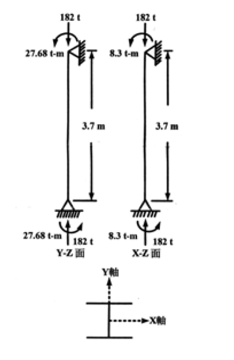
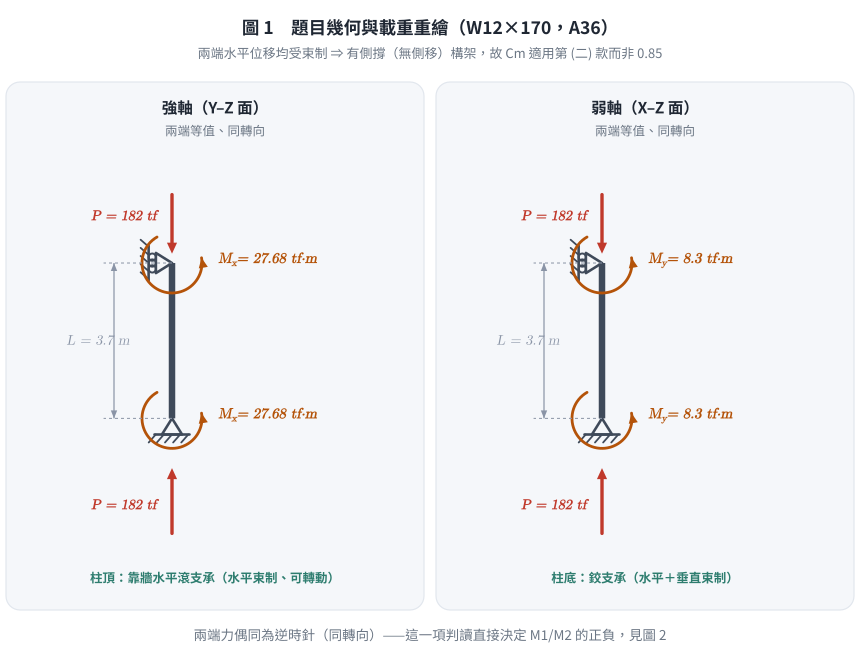
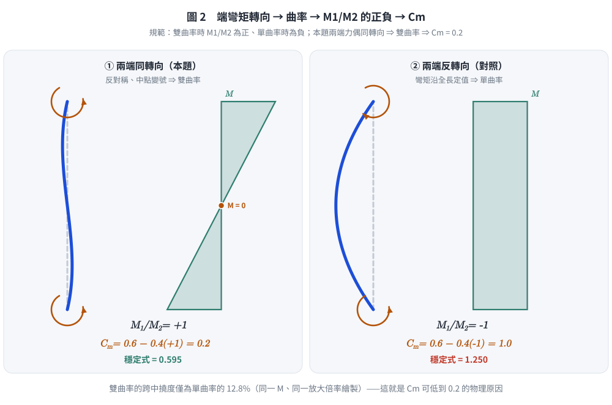
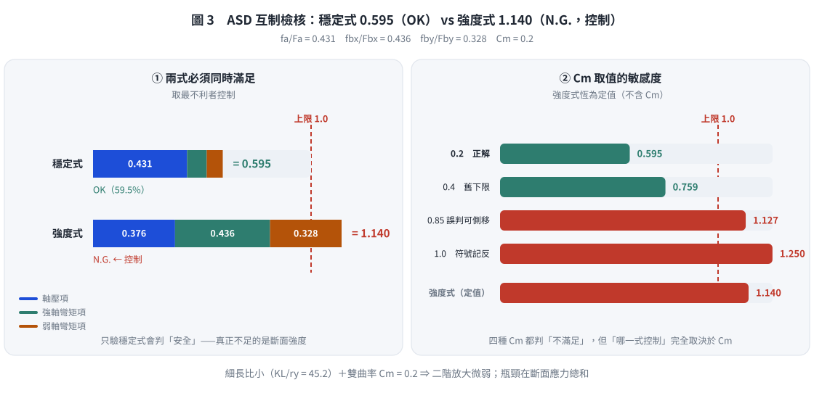

# 考題編號：SS-2003-4

**主分類：** `SS-U1-3` 梁柱桿件
**副分類：**（無）
**設計法：** ASD
**標籤：** `梁柱桿件` `ASD` `雙軸彎矩` `P-M互制` `Cm係數` `放大係數` `fa/Fa判斷` `F'e歐拉應力` `穩定方程式` `強度方程式` `W12×170` `A36` `雙曲率判定` `有側撐構架`

---

## 1. 原始題目重述 (Problem Restatement)

> **原卷逐字**：「有一梁柱構材長度為 L，其斷面為 W12×170 型鋼且為**結實斷面**，受一軸向載重 (P) 及端點之強軸、弱軸彎矩如附圖所示，使用 A36 鋼材，假設其 $K_x = K_y = 1.0$，試檢核該構材是否滿足容許應力法 (ASD) 之要求？（25 分）」

⚠️ **原卷為單一問句**（只問「是否滿足 ASD 之要求」），並未分成 (一)(二)(三) 小題。

*圖說（依原卷附圖 450 dpi 目視判讀）：柱高 $L = 3.7$ m，軸壓 $P = 182$ t（上下端對向施加）。**柱頂**為靠牆之**水平滾支承**（斜線牆面＋三角形，束制水平位移、可轉動）；**柱底**為**鉸支承**（三角形＋斜線地面）。強軸（Y-Z 面）柱頂與柱底各施加 $M_x = 27.68$ t-m；弱軸（X-Z 面）各施加 $M_y = 8.30$ t-m。**兩端的彎矩箭頭皆為逆時針（同一轉向）**——柱頂弧線由右經頂至左、箭頭在左下方向下；柱底弧線由左經底至右、箭頭在右方向上。*

*圖 1　題目幾何與載重重繪。兩端水平位移都受束制 ⇒ 有側撐（無側移）構架；這張圖攔的是把本柱誤判為可側移而取 $C_m = 0.85$（穩定式會由 0.595 跳到 1.127，控制式判斷整個翻轉）。*

**⚠️ 兩項關鍵判讀（決定 $C_m$，也是本題最易失分處）：**

| 項目 | 正確判讀 | 依據 |
|------|---------|------|
| 構架型式 | **有側撐（含斜撐）構架，無側移** | 柱頂有水平滾支承、柱底為鉸支承，兩端水平位移均受束制；且題目給 $K_x = K_y = 1.0$（無側移之鉸-鉸值） |
| 端彎矩曲率 | **雙曲率（反向曲率）**，$M_1/M_2 = +1$ | 兩端外加力偶**同轉向**（皆逆時針）→ 內力彎矩圖反對稱、中點變號 |

> **曲率判定的通用規則（可自行驗證，不必背）**：長度 $L$ 之構材兩端各施加外力偶 $C_A$、$C_B$（逆時針為正），則內力彎矩 $M(x) = (C_A+C_B)x/L - C_A$。
> - 兩端**反轉向**（$C_B = -C_A$）→ $M(x) = -C_A$ 為**定值** → **單曲率**（$M_1/M_2 = -1$，$C_m = 1.0$）
> - 兩端**同轉向**（$C_B = C_A = M$）→ $M(x) = 2Mx/L - M$，於 $x=0$ 為 $-M$、$x=L/2$ 為 $0$、$x=L$ 為 $+M$ → **反對稱、雙曲率**（$M_1/M_2 = +1$，$C_m = 0.2$）
>
> 本題兩端力偶同為逆時針 ⇒ **雙曲率** ⇒ $M_1/M_2 = +1$。

**W12×170 斷面性質（A36）：**

| 性質 | 數值 |
|------|------|
| 斷面積 $A$ | 322.58 cm² |
| 強軸斷面模數 $S_x$ | 3850.96 cm³ |
| 強軸迴轉半徑 $r_x$ | 14.58 cm |
| 弱軸斷面模數 $S_y$ | 1348.66 cm³ |
| 弱軸迴轉半徑 $r_y$ | 8.18 cm |
| 緊密撓度極限距 $L_c$ | 4.05 m |
| 非緊密撓度極限距 $L_u$ | 19.6 m |

**材料性質：**

$$F_y = 2.50\ \text{tf/cm}^2,\quad F_u = 4.10\ \text{tf/cm}^2,\quad E = 2100\ \text{tf/cm}^2$$

**ASD 設計公式（題目提供）：**

$$C_c = \sqrt{\frac{2\pi^2 E}{F_y}}$$

$$\frac{KL}{r} \leq C_c:\quad F_a = \frac{\left[1-\dfrac{(KL/r)^2}{2C_c^2}\right]F_y}{\dfrac{5}{3}+\dfrac{3(KL/r)}{8C_c}-\dfrac{(KL/r)^3}{8C_c^3}}$$

$$\frac{KL}{r} > C_c:\quad F_a = \frac{12\pi^2 E}{23(KL/r)^2}$$

$$F'_{ex} = \frac{12\pi^2 E}{23(KL_b/r_x)^2},\quad F'_{ey} = \frac{12\pi^2 E}{23(KL_b/r_y)^2}$$

**互制方程式（$f_a/F_a > 0.15$）：**

$$\frac{f_a}{F_a} + \frac{C_{mx}f_{bx}}{\left(1-\dfrac{f_a}{F'_{ex}}\right)F_{bx}} + \frac{C_{my}f_{by}}{\left(1-\dfrac{f_a}{F'_{ey}}\right)F_{by}} \leq 1.0 \tag{穩定式}$$

$$\frac{f_a}{0.6F_y} + \frac{f_{bx}}{F_{bx}} + \frac{f_{by}}{F_{by}} \leq 1.0 \tag{強度式}$$

**互制方程式（$f_a/F_a \leq 0.15$）：**

$$\frac{f_a}{F_a} + \frac{f_{bx}}{F_{bx}} + \frac{f_{by}}{F_{by}} \leq 1.0$$

**$C_m$ 之取值規定（原卷逐字列出三款）：**

| 款 | 條件 | $C_m$ |
|:--:|------|:---:|
| (一) | 可側向位移構架之受壓構材 | $0.85$ |
| (二) | 含斜撐構架中之受束制壓力構材，**且在構材彎曲平面兩端點間無橫向載重時** | $0.6 - 0.4(M_1/M_2)$ |
| (三) 1. | 含斜撐構架之受壓構材，兩端點間受橫向載重、構材端點**受束制** | $0.85$ |
| (三) 2. | 含斜撐構架之受壓構材，兩端點間受橫向載重、構材端點**未束制** | $1.00$ |

> **本題適用第 (二) 款**：柱頂水平滾支承＋柱底鉸支承 ⇒ 側移受束制（含斜撐構架）；兩端點間**無橫向載重**（只有端彎矩）。
> ⚠️ 原卷所印之 $C_m = 0.6 - 0.4(M_1/M_2)$ **未加任何下限**。經查台灣「鋼構造建築物鋼結構設計技術規範」**容許應力設計法第 8.2 節式 (8.2-5)** 亦無下限，其解說更明言舊式的「$\geq 0.4$」限制「在 1986 年版的 AISC-LRFD 規範及本規範中**均已不再採用**」；AISC ASD 9th Ed.（1989）§H1 同樣無下限。故本題**不設 $C_m \geq 0.4$ 的地板值**。

**求：** 檢核該構材是否滿足容許應力法（ASD）之要求。（單一問句，25 分）

---

## 2. 考題核心精神與出題者意圖 (Core Concepts & Examiner's Intent)

**核心觀念：** ASD 梁柱桿件設計的兩個關鍵——$C_m$（彎矩放大係數，描述二階效應的影響）和互制方程式（穩定式 + 強度式同時檢核）。

**出題意圖：**
1. 測驗是否知道 $f_a/F_a$ 是判斷使用簡化式或完整式的門檻
2. 測驗 $F'_e$（歐拉放大應力）的計算——與 $F_a$ 不同，$F'_e$ 無安全係數
3. 測驗 $C_m$ 在不同約束條件與載重型式下的三種取值邏輯
4. 雙軸彎矩（$M_x$ + $M_y$ 同時存在）的互制疊加方式

---

## 3. 解題戰略地圖與陷阱分析 (Strategic Roadmap & Trap Analysis)

**解題順序：**

$$f_a,f_{bx},f_{by} \to F_a \to f_a/F_a比較0.15 \to F_{bx},F_{by} \to F'_{ex},F'_{ey} \to C_m \to \text{互制檢核}$$

**關鍵陷阱：**

1. **$F_a$ vs $F'_e$ 的差異**：$F_a$ 有安全係數（1.67–1.92），用於 $f_a/F_a$ 的軸壓部分；$F'_e = 12\pi^2E/[23(KL/r)^2]$ **沒有安全係數但乘了 12/23**，用於分母中的放大係數，兩者不可互換。

2. **兩個互制方程式都必須滿足**：$f_a/F_a > 0.15$ 時，「穩定式」和「強度式」**兩式都要通過**，取最不利者。

3. **$C_m$ 的款別與曲率符號（本題唯一的觀念關卡）**：本題柱頂水平滾支承＋柱底鉸接 ⇒ **有側撐（無側移）**、且兩端點間無橫向載重 ⇒ 適用 $C_m = 0.6 - 0.4(M_1/M_2)$，**不是** 0.85。兩端力偶同轉向 ⇒ **雙曲率** ⇒ $M_1/M_2 = \mathbf{+1}$（正值）⇒ $C_m = 0.6 - 0.4 = \mathbf{0.2}$。**符號記錯（誤取 $-1$）會得 $C_m = 1.0$，穩定式由 0.595 暴增到 1.250，結論翻轉。**

4. **$L_b < L_c$ → $F_{bx} = 0.66F_y$**：側撐間距 $L_b = 3.7\ \text{m} < L_c = 4.05\ \text{m}$ 在緊密範圍，可取最大值。

## 3.5 變數層次分析（Variable Hierarchy Analysis）

> 複習提示：解題後，在每個卡住的知識點「卡關?」欄標記 `⚠`；第二次複習時只看有 `⚠` 的項目。

**最終目標：** 計算 $f_a, f_{bx}, f_{by}$ → 確認 $f_a/F_a > 0.15$ → 判定構架型式與曲率求 $C_m$ → 驗算穩定式與強度式 → $\boxed{\text{穩定式 OK（0.595）、強度式 N.G.（1.140）} \Rightarrow \text{不滿足 ASD}}$

### 主要公式（$\boxed{\phantom{x}}$ = 未知，待推導）

$$f_a = P/A,\quad f_{bx} = M_x/S_x,\quad f_{by} = M_y/S_y$$
$$\boxed{F_a}\text{（弱軸控制 }KL/r_y=45.23\text{，非彈性拋物線）} = 1.308\ \text{tf/cm}^2$$
$$\frac{f_a}{F_a} = 0.431 > 0.15 \Rightarrow \text{用完整互制方程式}$$
$$\boxed{F'_{ey}} = \frac{12\pi^2 E}{23(KL/r_y)^2} = 5.285\ \text{tf/cm}^2$$
$$\boxed{C_m} = 0.6 - 0.4\!\left(\tfrac{M_1}{M_2}\right) = 0.6 - 0.4(+1) = 0.2 \quad(\textbf{雙曲率，無下限})$$
$$\text{穩定式：}\frac{f_a}{F_a} + \frac{C_m f_{bx}}{(1-f_a/F'_{ex})F_{bx}} + \frac{C_m f_{by}}{(1-f_a/F'_{ey})F_{by}} = \boxed{0.595 \leq 1.0\ \text{OK}}$$
$$\text{強度式：}\frac{f_a}{0.6F_y} + \frac{f_{bx}}{F_{bx}} + \frac{f_{by}}{F_{by}} = \boxed{1.140 > 1.0\ \text{N.G. ← 控制}}$$

### L1：題目直接給定

| 符號 | 數值 | 說明 |
|------|------|------|
| $P$ | 182 tf | 軸壓力 |
| $M_x$ | 27.68 tf·m | 強軸彎矩 |
| $M_y$ | 8.30 tf·m | 弱軸彎矩 |
| $L$ | 3.7 m | 柱高 |
| $K_x = K_y$ | 1.0 | 有效長度係數（兩端均為此值）|
| $A$ | 322.58 cm² | W12×170 斷面積 |
| $S_x$ | 3850.96 cm³ | 強軸斷面模數 |
| $S_y$ | 1348.66 cm³ | 弱軸斷面模數 |
| $r_x$ | 14.58 cm | 強軸迴轉半徑 |
| $r_y$ | 8.18 cm | 弱軸迴轉半徑 |
| $L_c$ | 4.05 m | ASD 強軸全截面彎矩無支撐上限 |
| $L_u$ | 19.6 m | ASD 彈性 LTB 分界 |
| $F_y$ | 2.50 tf/cm² | A36 降伏強度 |
| $E$ | 2100 tf/cm² | 彈性模數 |
| 端部支承 | 柱頂水平滾支承、柱底鉸接 | **有側撐（無側移）** |
| 端彎矩轉向 | 兩端力偶**同為逆時針** | **雙曲率**，$M_1/M_2 = +1$ |
| 斷面等級 | 題目明示「**結實斷面**」 | 免驗 $b/t$、$h/t_w$ |

### L2：需知識點推導

**Step 1：實際應力**

| 符號 | 公式 / 來源 | 卡關? |
|------|------------|:-----:|
| $f_a$ | $182/322.58 = 0.564$ tf/cm² | |
| $f_{bx}$ | $2768/3850.96 = 0.719$ tf/cm² | |
| $f_{by}$ | $830/1348.66 = 0.616$ tf/cm² | |

**Step 2：容許軸壓應力 $F_a$**

| 符號 | 公式 / 來源 | 卡關? |
|------|------------|:-----:|
| $(KL/r)_y$ | $370/8.18 = 45.23$（弱軸控制）| |
| $C_c$ | $\sqrt{2\pi^2 E/F_y} = 128.8$ | |
| 挫屈類型 | $45.23 < 128.8 \Rightarrow$ 非彈性，用拋物線公式 | |
| $F_a$ | 分子/分母 → $1.308$ tf/cm² | |

**Step 3：判斷互制方程式類型**

| 符號 | 公式 / 來源 | 卡關? |
|------|------------|:-----:|
| $f_a/F_a$ | $0.564/1.308 = 0.431 > 0.15$（用完整式）| |

**Step 4：容許彎曲應力與 $C_m$**

| 符號 | 公式 / 來源 | 卡關? |
|------|------------|:-----:|
| $F_{bx}$ | $L_b = 3.7 < L_c = 4.05$ m → $0.66F_y = 1.65$ tf/cm² | |
| $F_{by}$ | I 型斷面弱軸彎曲 → $0.75F_y = 1.875$ tf/cm² | |
| $M_1/M_2$ | $+1$（雙曲率；兩端等值同轉向）⚠ 常見卡關 | |
| $C_m$ | $0.6 - 0.4(+1) = \mathbf{0.2}$（第 (二) 款，無下限） | |

**Step 5：歐拉放大應力 $F'_e$**

| 符號 | 公式 / 來源 | 卡關? |
|------|------------|:-----:|
| $F'_{ex}$ | $12\pi^2E/[23 \times 25.38^2] = 16.79$ tf/cm² | |
| $F'_{ey}$ | $12\pi^2E/[23 \times 45.23^2] = 5.286$ tf/cm² | |

**Step 6：穩定式與強度式**

| 項目 | 計算 | 卡關? |
|------|------|:-----:|
| 穩定式值 | $0.431 + 0.090 + 0.074 = \mathbf{0.595} \leq 1.0$（OK）| |
| 強度式值 | $0.376 + 0.436 + 0.328 = \mathbf{1.140} > 1.0$（**N.G. ← 控制**）| |

### L3：深層知識（不懂就卡住）

| 知識點 | 說明 | 補強頁 | 卡關? |
|--------|------|:------:|:-----:|
| $F_a$ vs $F'_e$ 的本質差異 | $F_a$ 含安全係數用於軸壓比；$F'_e = (12/23)F_{Euler}$ 用於放大分母，不可互換 | | |
| $f_a/F_a$ 判斷門檻 0.15 | 超過 0.15 才需用完整穩定式 + 強度式；0.15 以下用簡化式 | [[pm-interaction]] · [[BEAM-COLUMN-INTERACTION]] | |
| 穩定式 vs 強度式各別意義 | 穩定式：二階 P-δ 放大後的失穩；強度式：截面全截面降伏 | [[pm-interaction]] · [[BEAM-COLUMN-INTERACTION]] | |
| $C_m$ 三款的分辨 | ①可側移 → 0.85；②有側撐＋無橫載 → $0.6-0.4(M_1/M_2)$；③有側撐＋有橫載 → 端部束制 0.85／未束制 1.00。**先判構架能否側移，再判有無橫向載重** | | |
| $M_1/M_2$ 的符號 | 規範原文：「當構材受彎成**雙曲率**彎曲時，$M_1/M_2$ 之比為**正值**；當構材成**單曲率**彎曲時，為**負值**」。判別法：兩端外加力偶**同轉向**→雙曲率；**反轉向**→單曲率（定值彎矩） | | |
| $C_m$ 無下限 | 台灣 ASD 規範 (8.2-5) 與 AISC ASD-89 §H1 皆**無** $\geq 0.4$ 之限制；該限制是 1978 年以前 AISC 的舊規定，1986 年後已廢止 | | |
| 弱軸容許彎曲應力 $F_{by} = 0.75F_y$ | I 型斷面弱軸無 LTB 問題，直接取 $0.75F_y$ | | |

---

## 4. 步驟化詳細計算過程 (Step-by-Step Detailed Calculation)

### 步驟 1：計算實際應力

$$f_a = \frac{P}{A} = \frac{182}{322.58} = 0.5643\ \text{tf/cm}^2$$

$$f_{bx} = \frac{M_x}{S_x} = \frac{27.68 \times 100}{3850.96} = \frac{2768}{3850.96} = 0.7188\ \text{tf/cm}^2$$

$$f_{by} = \frac{M_y}{S_y} = \frac{8.30 \times 100}{1348.66} = \frac{830}{1348.66} = 0.6155\ \text{tf/cm}^2$$

---

### 步驟 2：計算容許軸壓應力 $F_a$

**臨界細長比 $C_c$：**

$$C_c = \sqrt{\frac{2\pi^2 E}{F_y}} = \sqrt{\frac{2 \times 9.870 \times 2100}{2.5}} = \sqrt{16{,}581} = 128.8$$

**計算 $KL/r$（控制軸）：**

$$\frac{K_x L}{r_x} = \frac{1.0 \times 370}{14.58} = 25.38 \quad \text{（強軸）}$$

$$\frac{K_y L}{r_y} = \frac{1.0 \times 370}{8.18} = 45.23 \quad \text{（弱軸，控制）}$$

$$\frac{KL}{r} = 45.23 < C_c = 128.8 \Rightarrow \text{非彈性挫屈，用拋物線公式}$$

**分子：**

$$\left[1-\frac{(45.23)^2}{2\times(128.8)^2}\right]F_y = \left[1-\frac{2046}{33{,}163}\right]\times 2.5 = 0.9383\times 2.5 = 2.346\ \text{tf/cm}^2$$

**分母（令 $\alpha = KL/r/C_c = 45.23/128.8 = 0.3512$）：**

$$\frac{5}{3} + \frac{3\alpha}{8} - \frac{\alpha^3}{8} = 1.6667 + \frac{3\times0.3512}{8} - \frac{(0.3512)^3}{8}$$

$$= 1.6667 + 0.1317 - \frac{0.04334}{8} = 1.6667 + 0.1317 - 0.00542 = 1.793$$

$$\boxed{F_a = \frac{2.346}{1.793} = 1.308\ \text{tf/cm}^2}$$

---

### 步驟 3：判斷互制方程式類型

$$\frac{f_a}{F_a} = \frac{0.5643}{1.308} = 0.431 > 0.15$$

→ 使用**完整互制方程式**（穩定式 + 強度式均需檢核）

---

### 步驟 4：容許彎曲應力 $F_{bx}$、$F_{by}$

**強軸彎曲（確認 $L_b$ vs $L_c$）：**

$$L_b = 3.7\ \text{m} < L_c = 4.05\ \text{m} \Rightarrow F_{bx} = 0.66F_y = 0.66\times2.5 = 1.65\ \text{tf/cm}^2$$

**弱軸彎曲（I 型斷面）：**

$$F_{by} = 0.75F_y = 0.75\times2.5 = 1.875\ \text{tf/cm}^2$$

---

### 步驟 5：計算歐拉放大應力 $F'_{ex}$、$F'_{ey}$

$$F'_{ex} = \frac{12\pi^2 E}{23(KL/r_x)^2} = \frac{12\times9.870\times2100}{23\times(25.38)^2}$$

$$= \frac{248{,}724}{23\times644.1} = \frac{248{,}724}{14{,}814} = \boxed{16.79\ \text{tf/cm}^2}$$

$$F'_{ey} = \frac{12\pi^2 E}{23(KL/r_y)^2} = \frac{248{,}724}{23\times(45.23)^2}$$

$$= \frac{248{,}724}{23\times2046} = \frac{248{,}724}{47{,}058} = \boxed{5.286\ \text{tf/cm}^2}$$

---

### 步驟 6：判定構架型式與曲率，求 $C_m$

#### 6.1 構架型式：有側撐（無側移）

由附圖：**柱頂為靠牆之水平滾支承**（束制水平位移、可自由轉動與豎向滑動），**柱底為鉸支承**。兩端水平位移均受束制 ⇒ 本柱**不可側移**，屬「含斜撐構架中之受束制壓力構材」。

**旁證：** 題目給定 $K_x = K_y = 1.0$。$K = 1.0$ 正是「**無側移**、鉸接-鉸接」的值（見 102 年考卷 K 值表）；若為可側移構架，$K$ 至少為 1.2～2.0。若構架真能側移而仍取 $K = 1.0$，$F_a$ 會被嚴重高估，題目不會如此設定。

⇒ **適用第 (二) 款**：$C_m = 0.6 - 0.4(M_1/M_2)$（**不是** 0.85）

#### 6.2 曲率：雙曲率，$M_1/M_2 = +1$

兩端外加力偶大小相等（強軸皆 27.68 t-m、弱軸皆 8.30 t-m），且**轉向相同**（皆逆時針，見 §1 圖說之目視判讀）。

代入通用式 $M(x) = (C_A + C_B)x/L - C_A$，以 $C_A = C_B = M$：

$$M(0) = -M,\qquad M(L/2) = 0,\qquad M(L) = +M$$

彎矩圖**反對稱、於中點變號** ⇒ **雙曲率（反向曲率）**。依規範「雙曲率時 $M_1/M_2$ 為正值」：

$$\frac{M_1}{M_2} = +1 \quad(\text{兩軸皆同})$$

*圖 2　端彎矩轉向如何決定 $M_1/M_2$ 的正負。兩格用同一個放大倍率繪製，雙曲率的跨中撓度只有單曲率的 12.8%——這張圖攔的是曲率符號記反（$C_m$ 由 0.2 變成 1.0）。*

#### 6.3 $C_m$

$$\boxed{C_{mx} = C_{my} = 0.6 - 0.4(+1) = 0.2}$$

**無下限**（見 §1 之規範查證）。

> ⚠️ **雙曲率是最有利的端彎矩型態**：最大彎矩在端點、而 P-δ 二階撓曲的最大值在中點附近，兩者不疊加，故放大係數極小。反之單曲率（定值彎矩）最不利，$C_m = 1.0$。

**$C_m$ 取值敏感度（同一題四種可能）：**

| $C_m$ | 來源 | 穩定式 | 判定 |
|:---:|------|:---:|:---:|
| **0.2** | **正解**（雙曲率，無下限） | **0.595** | **OK** |
| 0.4 | 若誤用已廢止的 $\geq 0.4$ 下限 | 0.759 | OK |
| 0.85 | 若誤判為可側移構架 | 1.127 | N.G. |
| 1.0 | 若曲率符號記反（誤為單曲率） | 1.250 | N.G. |

**四者的強度式恆為 1.140（不含 $C_m$），故「不滿足 ASD」的結論不因 $C_m$ 而改變；但「哪一式控制」完全取決於 $C_m$。**

---

### 步驟 7：互制方程式驗算

**放大分母計算：**

$$1 - \frac{f_a}{F'_{ex}} = 1 - \frac{0.5643}{16.79} = 1 - 0.0336 = 0.9664$$

$$1 - \frac{f_a}{F'_{ey}} = 1 - \frac{0.5643}{5.286} = 1 - 0.1068 = 0.8932$$

**穩定式（$f_a/F_a > 0.15$ → 需滿足）：**

$$\frac{f_a}{F_a} + \frac{C_{mx}f_{bx}}{\left(1-\dfrac{f_a}{F'_{ex}}\right)F_{bx}} + \frac{C_{my}f_{by}}{\left(1-\dfrac{f_a}{F'_{ey}}\right)F_{by}} \leq 1.0$$

$$= 0.4312 + \frac{0.2\times0.7188}{0.9664\times1.65} + \frac{0.2\times0.6155}{0.8933\times1.875}$$

$$= 0.4312 + \frac{0.14376}{1.5946} + \frac{0.12310}{1.6749}$$

$$= 0.4312 + 0.0902 + 0.0735 = \boxed{0.595 \leq 1.0 \quad \textbf{OK}}$$

**強度式（同樣需滿足）：**

$$\frac{f_a}{0.6F_y} + \frac{f_{bx}}{F_{bx}} + \frac{f_{by}}{F_{by}} \leq 1.0$$

$$= \frac{0.5643}{1.50} + \frac{0.7188}{1.65} + \frac{0.6155}{1.875}$$

$$= 0.3762 + 0.4356 + 0.3282 = \boxed{1.140 > 1.0 \quad \textbf{N.G. ← 控制}}$$

> **結論**：**穩定式通過（59.5%）、強度式不通過（114.0%）** ⇒ 該構材**不滿足** ASD 之要求，且**由斷面強度（全斷面降伏）控制**，而非由二階穩定控制。
> 這與「$C_m = 0.85$ 兩式皆 N.G.」的舊結論在**判定**上相同、在**成因**上完全不同：本柱的細長比很小（$KL/r_y = 45.2$，僅為 $C_c$ 的 35%），二階放大本就微弱（$1-f_a/F'_{ey} = 0.893$），再加上雙曲率的 $C_m = 0.2$，穩定式自然不會控制。真正的問題是**斷面應力總和已超出容許值 14%**。
> **改善方向**：強度式三項中 $f_{bx}/F_{bx} = 0.436$ 最大，$f_{by}/F_{by} = 0.328$ 次之 —— 應加大斷面（尤其弱軸 $S_y$），或減小端彎矩。

---

*圖 3　兩式必須同時檢核。穩定式只用掉 59.5%、強度式卻超出 14%；這張圖攔的是「只驗穩定式就判安全」，以及把控制極限狀態誤歸給二階穩定而非斷面降伏。*

### 計算結果彙整

| 計算項目 | 數值 |
|---------|------|
| $f_a$ | 0.564 tf/cm² |
| $f_{bx}$ | 0.719 tf/cm² |
| $f_{by}$ | 0.616 tf/cm² |
| $F_a$（弱軸控制）| 1.308 tf/cm² |
| $f_a/F_a$ | 0.431 → 用完整互制式 |
| $F_{bx}$（$L_b < L_c$）| 1.65 tf/cm² |
| $F_{by}$ | 1.875 tf/cm² |
| $F'_{ex}$ | 16.79 tf/cm² |
| $F'_{ey}$ | 5.286 tf/cm² |
| 構架型式 | **有側撐（無側移）**，$K = 1.0$ |
| 曲率 | **雙曲率**，$M_1/M_2 = +1$ |
| $C_{mx} = C_{my}$ | **0.2**（$= 0.6-0.4(+1)$，無下限）|
| **穩定式** | **0.595 ≤ 1.0 → OK** |
| **強度式** | **1.140 > 1.0 → N.G.（控制）** |

$$\boxed{\text{W12×170 不滿足 ASD 要求；由「強度式（斷面降伏）」控制，穩定式通過}}$$

---

## 5. 關鍵爭議點與進階探討 (Critical Issues & Advanced Discussion)

### Q：兩個方程式各自捕捉什麼失效模式？

| 方程式 | 名稱 | 主要考量 | 不足時代表 |
|--------|------|---------|-----------|
| 穩定式 | Stability interaction | 二階 P-δ 放大（$C_m$/$F'_e$）+ 軸壓 | 柱可能在彎矩放大後挫屈 |
| 強度式 | Strength interaction | 截面全截面降伏 | 柱在無挫屈條件下截面先達到降伏 |

本題**穩定式 0.595 通過、強度式 1.140 不通過** —— 代表桿件的二階穩定有充裕餘裕（細長比小＋雙曲率），真正的瓶頸是**斷面應力總和已達降伏**。這正是「兩式必須分別檢核、取最不利者」的價值：只算穩定式會誤判為安全。

### Q：$F'_e$ 為何與 $F_a$ 的公式相似卻不同？

$$F'_e = \frac{12\pi^2 E}{23(KL/r)^2}$$

- 分子：$12\pi^2$ 而非 $1\pi^2$
- 分母：$23(KL/r)^2$ 而非 $1(KL/r)^2$

**本質**：$F'_e = (12/23) \times F_{e,Euler}$，其中 12/23 ≈ 0.522 是 Euler 彈性挫屈的折減係數（安全係數 23/12 ≈ 1.92）。$F'_e$ 用在分母放大係數中，目的是通過「$1-f_a/F'_e$」計入 P-δ 效應，並非用於計算容許應力。

### Q：若改用 LRFD 法，如何對應？

| ASD 元素 | LRFD 對應 |
|---------|-----------|
| $f_a/F_a + C_m f_b/(1-f_a/F'_e)F_b$ | $P_u/\phi_c P_n + \tfrac{8}{9}\big(B_1M_{ntx}/\phi_b M_{nx} + \cdots\big)$（H1-1a） |
| $C_m$ 係數 | $B_1$ 放大係數（$B_1 = C_m/(1-P_u/P_{e1})$） |
| $F'_e$ | $P_{e1}$（彈性挫屈載重，$F'_e = \tfrac{12}{23}P_e/A$） |
| $F_{bx} = 0.66F_y$（對 $S_x$） | $\phi_bM_p = 0.9F_yZ_x$（對 $Z_x$）→ 新規範可用塑性儲備 |
| $F_{by} = 0.75F_y$（對 $S_y$） | $\phi_b\min(F_yZ_y,\,1.6F_yS_y)$ |
| 兩式（穩定式＋強度式） | **單一式** H1-1a／H1-1b |

LRFD 的 $B_1$ 放大係數本質上就是 ASD 穩定式中 $C_m/(1-f_a/F'_e)$ 的變形，兩者邏輯完全相同；但 **LRFD／AISC 360 已把 ASD 的「兩式」合併為一式**（二階彎矩已含放大，故不需另設穩定式）。

### 為何 ASD 的強度式用 $0.6F_y$ 而不是 $F_a$？

強度式 $f_a/(0.6F_y) + f_{bx}/F_{bx} + f_{by}/F_{by} \leq 1.0$ 檢核的是**斷面的降伏**，與桿件細長無關，故軸壓項的分母取「短柱」的容許應力 $0.6F_y$（即 $F_y/1.67$），而非含細長比折減的 $F_a$。本題 $F_a = 1.308 < 0.6F_y = 1.50$，所以**穩定式的軸壓項（0.431）反而大於強度式的軸壓項（0.376）**；但強度式的兩個彎矩項未經 $C_m$ 縮減，總和仍較大。

---

## 6. 依最新規範（AISC 360-16／-22）對照

> **主答依據**：內政部「鋼構造建築物鋼結構設計技術規範」**容許應力設計法**（民國 99 年／2010 修正版）第 8.2 節。台灣 ASD 章節迄今未隨 AISC 360 改版，AISC 自 2005 年版起已把 ASD 併入單一規範（以 $\Omega$ 表示），本節僅列對照。

### 6.1 斷面辨識與補充性質（交叉驗算）

題目只給 $A$、$S_x$、$S_y$、$r_x$、$r_y$、$L_c$、$L_u$，未給 $Z$。以英制反查 AISC 手冊之 **W12×170**：

| 性質 | 題目給定（公制） | AISC 手冊（英制） | 換算 | 吻合 |
|------|:---:|:---:|:---:|:---:|
| $A$ | 322.58 cm² | 50.0 in² | 322.58 | ✓ |
| $S_x$ | 3850.96 cm³ | 235 in³ | 3851.0 | ✓ |
| $S_y$ | 1348.66 cm³ | 82.3 in³ | 1348.7 | ✓ |
| $r_x$ | 14.58 cm | 5.74 in | 14.58 | ✓ |
| $r_y$ | 8.18 cm | 3.22 in | 8.18 | ✓ |
| $Z_x$ | （未給） | 275 in³ | **4506 cm³** | 補充 |
| $Z_y$ | （未給） | 126 in³ | **2065 cm³** | 補充 |

五項給定值**全部精確吻合** ⇒ 確認為 W12×170，故 $Z_x = 4506$、$Z_y = 2065$ cm³ 可信。形狀因數 $Z_x/S_x = 1.170$、$Z_y/S_y = 1.531$（均在 I 型斷面常見範圍內 ✓）。

### 6.2 三處實質差異

| 項目 | 台灣 ASD（＝AISC ASD 9th） | AISC 360-16／-22（ASD, $\Omega$） |
|------|------|------|
| 軸壓 | $F_a$ 拋物線式／$FS$ 隨 $KL/r$ 變（1.67～1.92）；$F_a = 1.308$ | $F_{cr} = 0.658^{F_y/F_e}F_y$，$\Omega_c = 1.67$（**定值**） |
| 撓曲 | $F_{bx} = 0.66F_y$（對 $S_x$）、$F_{by} = 0.75F_y$（對 $S_y$） | $M_n = M_p = F_yZ$（對 $Z$），$\Omega_b = 1.67$；弱軸另受 $1.6F_yS_y$ 上限 |
| 互制 | **穩定式＋強度式**兩式；放大靠 $C_m/(1-f_a/F'_e)$ | **單一式** H1-1a／H1-1b；放大靠 $B_1$（附錄 8）或直接二階分析 |

### 6.3 依 AISC 360-16 重算（ASD，$\Omega = 1.67$）

**軸壓：**
$$F_e = \frac{\pi^2E}{(KL/r_y)^2} = \frac{9.8696 \times 2100}{45.23^2} = 10.130\ \text{tf/cm}^2, \qquad \frac{F_y}{F_e} = 0.2468 \leq 2.25$$
$$F_{cr} = 0.658^{0.2468}\,F_y = 0.9019 \times 2.50 = 2.255\ \text{tf/cm}^2$$
$$P_n = 2.255 \times 322.58 = 727.3\ \text{tf}, \qquad P_c = \frac{P_n}{1.67} = 435.5\ \text{tf}$$
$$\frac{P_r}{P_c} = \frac{182}{435.5} = 0.418 \geq 0.2 \Rightarrow \textbf{H1-1a}$$

（對照台灣 ASD 之 $f_a/F_a = 0.431$，僅差 3%——兩者的軸壓折減幾乎等價。）

**撓曲：** $L_b = 370$ cm，$L_p = 1.76r_y\sqrt{E/F_y} = 1.76(8.18)(28.98) = 417$ cm $> L_b$ ⇒ 塑性區，$M_{nx} = M_{px}$
$$M_{cx} = \frac{F_yZ_x}{1.67} = \frac{2.50 \times 4506}{1.67} = 6746\ \text{tf·cm} = 67.46\ \text{tf·m}$$
$$M_{ny} = \min(F_yZ_y,\ 1.6F_yS_y) = \min(5162,\ 5395) = 5162\ \text{tf·cm} \Rightarrow M_{cy} = \frac{5162}{1.67} = 30.91\ \text{tf·m}$$

> 註：台灣 ASD 的 $L_c = 4.05$ m $> L_b = 3.7$ m 與 AISC 的 $L_p = 4.17$ m $> L_b$ 判定一致 ✓。

**二階放大（附錄 8，ASD 之 $\alpha = 1.6$）：**
$$P_{e1x} = \frac{\pi^2EI_x}{L^2} = \frac{9.8696(2100)(68{,}573)}{370^2} = 10{,}382\ \text{tf}, \qquad \frac{\alpha P_r}{P_{e1x}} = \frac{1.6(182)}{10{,}382} = 0.028$$
$$P_{e1y} = \frac{9.8696(2100)(21{,}585)}{370^2} = 3{,}268\ \text{tf}, \qquad \frac{\alpha P_r}{P_{e1y}} = 0.089$$
$$B_{1x} = \frac{0.2}{1-0.028} = 0.206 \to \mathbf{1.0}, \qquad B_{1y} = \frac{0.2}{1-0.089} = 0.220 \to \mathbf{1.0}$$

（$C_m = 0.2$ 太小，$B_1$ 均受 $\geq 1.0$ 下限控制 ⇒ **無放大**。）

**H1-1a：**
$$\frac{P_r}{P_c} + \frac{8}{9}\!\left(\frac{M_{rx}}{M_{cx}} + \frac{M_{ry}}{M_{cy}}\right) = 0.418 + \frac{8}{9}\!\left(\frac{27.68}{67.46} + \frac{8.30}{30.91}\right)$$
$$= 0.418 + \frac{8}{9}(0.410 + 0.269) = 0.418 + 0.365 + 0.239 = \mathbf{1.021 > 1.0} \quad \textbf{N.G.}$$

### 6.4 對照結論

| 項目 | 台灣 ASD（主答） | AISC 360-16／-22（ASD） | 差異 |
|------|:---:|:---:|:---:|
| 軸壓比 | 0.431（$f_a/F_a$） | 0.418（$P_r/P_c$） | −3% |
| 強軸彎矩比 | 0.436（對 $S_x$，$0.66F_y$） | 0.410（對 $Z_x$，$\Omega=1.67$） | −6% |
| 弱軸彎矩比 | 0.328（對 $S_y$，$0.75F_y$） | 0.269（$F_yZ_y/1.67$） | −18% |
| 檢核式數量 | **2 式**（穩定＋強度） | **1 式**（H1-1a） | — |
| 二階放大 | $C_m/(1-f_a/F'_e)$，$C_m = 0.2$ | $B_1 = 1.0$（受下限控制） | 皆無放大 |
| **最終判定** | **N.G.（強度式 1.140）** | **N.G.（H1-1a 1.021）** | **結論一致** |

**兩規範同判「不足」，但 AISC 360 的超出量只有 2.1%，遠小於台灣 ASD 的 14.0%。** 主因是新規範以**塑性斷面模數 $Z$** 取代彈性 $S$，弱軸的塑性儲備（$Z_y/S_y = 1.53$）尤其顯著（該項比值由 0.328 降到 0.269）。

**作答建議**：原卷明示「試檢核…是否滿足容許應力法（ASD）之要求」並印出全套 ASD 公式，**主答必須用 ASD 兩式**。可在末尾補述「若依 AISC 360-16 之統一式，互制比為 1.02，同樣不足但僅超出 2%」，屬加分。

---

*修正日期：2026-08-22（**重大勘誤**：①原解析把本柱誤判為「側移構架」而取 $C_m = 0.85$；由 450 dpi 目視原卷附圖確認**柱頂為靠牆水平滾支承、柱底為鉸支承**，兩端水平位移均受束制 ⇒ **有側撐（無側移）構架**（題目給 $K_x=K_y=1.0$ 亦為旁證），適用原卷第 (二) 款 $C_m = 0.6-0.4(M_1/M_2)$；②兩端外加力偶**同為逆時針** ⇒ **雙曲率**，$M_1/M_2 = +1$ ⇒ $\mathbf{C_m = 0.2}$（查證台灣 ASD 規範 (8.2-5) 與 AISC ASD-89 §H1 皆**無** $\geq 0.4$ 下限，該下限 1986 年起已廢止）；③**穩定式由 1.127（N.G.）改為 0.595（OK）**，強度式 1.140（N.G.）不變 ⇒ **控制極限狀態由「穩定＋強度雙重不足」改為「僅斷面強度不足」**；④刪除原 §1 虛構的三個小題（原卷為單一問句）並改為逐字重述；⑤更正原「$M_1/M_2>0$ 為單曲率、$<0$ 為雙曲率」之符號顛倒敘述；⑥新增曲率判定通用式之推導、$C_m$ 四種取值敏感度表、§6 最新規範對照（含 W12×170 斷面反查與 AISC 360-16 ASD 重算 1.021）。$f_a$／$f_{bx}$／$f_{by}$／$F_a$／$F'_e$／強度式等數值原本即正確）*
*圖解補繪：2026-08-29（向量圖 3 張，腳本 `gen_SS-2003-4.py`，改輸入可原地重跑；SVG 供 wiki／PDF，2× PNG 供 pptx／影片）*
*驗證狀態：unverified*
