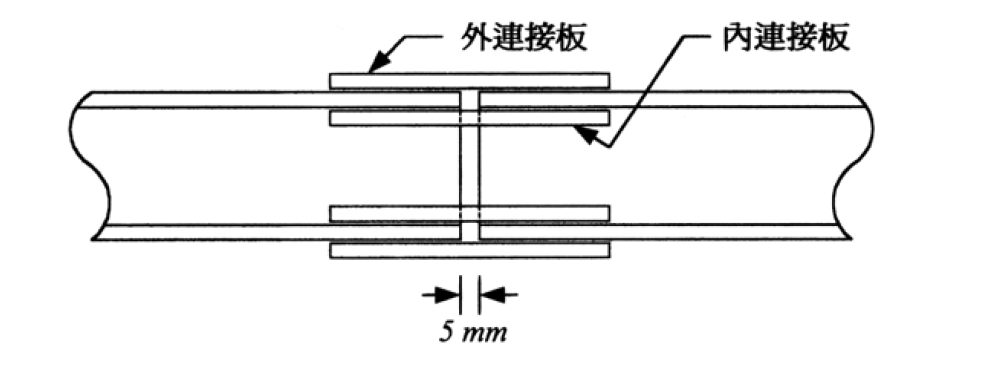

# 考題編號：SS-2004-2

**主分類：** `SS-U1-4` 接合之分析與設計
**副分類：** `SS-U1-1` 拉力及壓力桿件
**設計法：** ASD
**標籤：** `拉力構材續接` `高拉力螺栓` `摩阻型接合` `A325` `翼板連接` `連接板設計` `最短接合長度` `ASD`

---

## 1. 原始題目重述

一根 **H150×150×7×10** 斷面拉力構材之**續接**（如附圖，兩構材端部有 5 mm 間隙）。構材承受：

- 靜載重 $DL = 40\ \text{tf}$
- 活載重 $LL = 30\ \text{tf}$
- **在服務載重下接合不可產生滑動**（→ 摩阻型接合）

設計條件：
- 鋼材：A36，$F_y = 2.5\ \text{tf/cm}^2$，$F_u = 4.1\ \text{tf/cm}^2$
- 螺栓：A325 高拉力螺栓，**標準孔**
- 連接板：全斷面積降伏控制（$F_t = 0.6 F_y = 1.5\ \text{tf/cm}^2$）
- 孔距規定：最小邊距 $1.5d$，最小間距 $3d$，尺寸增量 1 mm
- **僅在翼板連結，不在腹板接合**

設計內容：螺栓直徑 $d$、個數、配置；連接板厚度、寬度、長度；孔形式配置圖。



*圖說：H150×150×7×10 拉力構材以螺栓續接，兩端構材有 5 mm 間隙，翼板設外連接板（outer splice plate）與內連接板（inner splice plate），腹板不接合。附表為聯結物容許應力（t/cm²），A325 摩阻型標準孔：$F_v = 1.19\ \text{tf/cm}^2$。*

---

## 2. 考題核心精神與出題者意圖

本題測驗 **ASD 摩阻型螺栓拉力續接**的完整設計流程：

1. 「在服務載重下不可滑動」→ 必須用**摩阻型（Friction Type）**，設計荷重取服務載重（不乘載重係數）
2. 「僅翼板連結」→ 全部拉力需由兩翼板連接板傳遞，每翼板承擔 $P/2$
3. 「盡量縮短接合長度」→ 需選擇最佳螺栓直徑（更大直徑 → 更少排數 → 更短接合）
4. 連接板須同時滿足**強度**（全斷面降伏）與**幾何約束**（內連接板受腹板圓角限制）

---

## 3. 解題戰略地圖與陷阱分析

**作戰計畫：**
1. 計算設計荷重（ASD 用服務載重）
2. 選定螺栓直徑，以「最少排數」原則求最短接合長度
3. 決定螺栓配置（每排顆數、邊距、間距）
4. 設計外、內連接板尺寸

**陷阱分析：**

| 陷阱 | 說明 | 應對策略 |
|------|------|---------|
| ⚠️ ASD 用服務載重 | 勿乘 1.2/1.6 係數 | P = DL+LL = 70 tf |
| ⚠️ 腹板未接合 → 全力由翼板承擔 | 不是按斷面積比分配 | 每翼板 = P/2 = 35 tf |
| ⚠️ 摩阻型設計強度 | 使用 Fv，不用承壓公式 | $F_v = 1.19\ \text{tf/cm}^2$（A325 標準孔） |
| ⚠️ 內連接板受腹板圓角限制 | 最大有效寬度 = $b_f - t_w - 2R$ | $= 150 - 7 - 22 = 121\ \text{mm}$ |
| ⚠️ 增大螺栓直徑可減少排數 | d=25mm 才能從4排降到3排 | 最短接合長度在 d=25mm |

## 3.5 變數層次分析（Variable Hierarchy Analysis）

> 複習提示：解題後，在每個卡住的知識點「卡關?」欄標記 `⚠`；第二次複習時只看有 `⚠` 的項目。

**最終目標：** ASD 摩阻型螺栓拉力續接 → 選最短接合（最大螺栓直徑）→ 設計連接板尺寸

### 主要公式（$\boxed{\phantom{x}}$ = 未知，待推導）

$$P = DL + LL = 70\ \text{tf（ASD 服務載重）}$$

$$P_{\text{per flange}} = \frac{P}{2} = 35\ \text{tf}$$

$$\boxed{R_{\text{bolt}}} = 2 \times F_v \times A_b \quad (\text{雙剪摩阻型})$$

$$\boxed{n} = \lceil P_{\text{per flange}} / R_{\text{bolt}} \rceil \quad \text{（所需排數）}$$

$$\boxed{L_{\text{join}}} = e_1 + (n-1)\cdot s = 1.5d + (n-1)\cdot 3d \quad \text{（接合長度）}$$

$$\boxed{t_{\text{plate}}} \geq \frac{P_{\text{per flange}}}{F_t \cdot (b_{\text{outer}} + b_{\text{inner}})}$$

### L1：題目直接給定

| 符號 | 數值 | 說明 |
|------|------|------|
| $DL$ | 40 tf | 靜載重 |
| $LL$ | 30 tf | 活載重 |
| $F_y$ | 2.5 tf/cm² | A36 鋼材降伏應力 |
| $F_u$ | 4.1 tf/cm² | 極限應力 |
| $F_v$ | 1.19 tf/cm² | A325 摩阻型標準孔容許剪力 |
| $F_t$ | 0.6$F_y$ = 1.5 tf/cm² | 連接板全斷面降伏 |
| 斷面 | H150×150×7×10 | 翼板 $b_f$=150mm，$t_f$=10mm，$t_w$=7mm，$R$=11mm |
| 接合條件 | 僅翼板連結，服務載重不可滑動 | 摩阻型，ASD |

### L2：需知識點推導

**Step 1：設計荷重**

| 符號 | 公式 / 來源 | 卡關? |
|------|------------|:-----:|
| $P$ | $DL + LL = 70$ tf（ASD，**不乘係數**） | |
| $P_{\text{per flange}}$ | $P / 2 = 35$ tf（腹板未接合，全力由翼板承擔） | |

**Step 2：選螺栓直徑（最短接合長度）**

| 符號 | 公式 / 來源 | 卡關? |
|------|------------|:-----:|
| $A_b$ | $\pi d^2/4$（$d$ = 22/25/27/30 mm） | |
| $R_{\text{bolt}}$ | $2 \times 1.19 \times A_b$（雙剪） | |
| $n$ | $\lceil 35 / R_{\text{bolt}} \rceil$ | |
| $L_{\text{join}}$ | $1.5d + (n-1) \times 3d$ | |
| 最優直徑 | $d=25$ mm，$n$ 從 4 排降至 3 排，$L=188$ mm | |

**Step 3：連接板幾何**

| 符號 | 公式 / 來源 | 卡關? |
|------|------------|:-----:|
| $b_{\text{outer}}$ | $b_f = 150$ mm | |
| $b_{\text{inner}}$ | $b_f - t_w - 2R = 121$ mm → 取 120 mm（受腹板圓角限制） | |
| $A_{\text{req}}$ | $P_{\text{per flange}} / F_t = 35/1.5 = 23.33$ cm² | |
| $t$ | $(15+12)t \geq 23.33 \Rightarrow t \geq 0.864$ cm → **9 mm** | |
| 全板長 | $2 \times (e_1 + 2s + e_1) + 5$ mm gap = 457 mm | |

### L3：深層知識（不懂就卡住）

| 知識點 | 說明 | 補強頁 | 卡關? |
|--------|------|:------:|:-----:|
| ASD vs. LRFD 設計荷重 | ASD 用服務載重（不加係數），誤乘 1.2/1.6 則螺栓數過多 | | |
| 摩阻型 vs. 承壓型容許剪力 | 摩阻型 $F_v=1.19$，承壓型約 2.10 tf/cm²，差近 1.8 倍 | | |
| 腹板圓角限制內連接板寬度 | $b_{\text{inner}} = b_f - t_w - 2R$，忽略圓角使板寬過大無法安裝 | | |
| 增大螺栓直徑縮短接合長度原理 | 排數降低（4→3）的長度節省遠大於間距增加量 | | |
| 雙剪 vs. 單剪 | 外板+翼板+內板 = 雙剪，每顆強度 $= 2 F_v A_b$ | | |

---

## 4. 步驟化詳細計算過程

### 4.1 設計荷重與幾何

$$P = DL + LL = 40 + 30 = 70\ \text{tf（服務載重，ASD）}$$

**腹板未接合 → 所有拉力由翼板傳遞：**

$$P_{\text{per flange}} = \frac{P}{2} = \frac{70}{2} = 35\ \text{tf}$$

H150×150×7×10 斷面性質：
- 翼板：$b_f = 150\ \text{mm}$，$t_f = 10\ \text{mm}$
- 腹板：$t_w = 7\ \text{mm}$
- 翼腹板交接圓角：$R = 11\ \text{mm}$

---

### 4.2 螺栓選擇（最短接合長度）

採 **A325 螺栓，標準孔，摩阻型接合**：

$$F_v = 1.19\ \text{tf/cm}^2$$

每顆螺栓通過 外連接板 + 翼板 + 內連接板 = **雙剪（double shear）**：

$$R_{\text{bolt}} = 2 \times F_v \times A_b = 2 \times 1.19 \times \frac{\pi}{4}d^2$$

**每翼板一側**（每側需傳遞 35 tf），**每排 1 顆**（置中，單排螺栓）：

| 直徑 $d$ (mm) | $A_b$ (cm²) | 每顆容許力 (tf) | 所需排數 | 接合長度/側 |
|-------------|------------|--------------|---------|-----------|
| 22 | 3.80 | 9.05 | 4 排 | $33 + 3 \times 66 = 231\ \text{mm}$ |
| **25** | **4.91** | **11.69** | **3 排** | $\mathbf{38 + 2 \times 75 = 188\ \text{mm}}$ |
| 27 | 5.73 | 13.64 | 3 排 | $41 + 2 \times 81 = 203\ \text{mm}$ |
| 30 | 7.07 | 16.83 | 3 排 | $45 + 2 \times 90 = 225\ \text{mm}$ |

> 接合長度 = $e_1 + (n-1) \times s = 1.5d + (n-1) \times 3d$

**結論：$d = 25\ \text{mm}$ 時從 4 排降至 3 排，接合長度最短（188 mm/側）。**

$$\boxed{d = 25\ \text{mm（A325，標準孔）}}$$

---

### 4.3 螺栓容量驗算

$$A_b = \frac{\pi}{4} \times 2.5^2 = 4.91\ \text{cm}^2$$

每顆螺栓雙剪容許力：

$$R_{\text{bolt}} = 2 \times 1.19 \times 4.91 = \boxed{11.69\ \text{tf}}$$

每側每翼板 3 排，每排 1 顆，共 3 顆：

$$R_{\text{total per side}} = 3 \times 11.69 = 35.07\ \text{tf} \geq 35\ \text{tf} \quad \checkmark$$

---

### 4.4 螺栓配置與孔位

**孔形式：標準孔（Standard Hole），孔徑 $d_h = 25 + 2 = 27\ \text{mm}$**

**縱向（沿構材軸線方向，每側）：**

$$e_1 = 1.5 \times 25 = 37.5\ \text{mm} \rightarrow 38\ \text{mm（取整）}$$

$$s = 3 \times 25 = 75\ \text{mm}$$

- 第 1 排：距構材切斷面 38 mm
- 第 2 排：距構材切斷面 113 mm
- 第 3 排：距構材切斷面 188 mm

**橫向（沿翼板寬度方向）：**

每排 1 顆，置中於翼板：

$$e_{\text{transverse}} = 75\ \text{mm（距翼板兩側邊）} \gg 1.5d = 38\ \text{mm} \quad \checkmark$$

**每翼板螺栓數：**

$$n = 3\ \text{排/側} \times 1\ \text{顆/排} \times 2\ \text{側} = 6\ \text{顆/翼板}$$

$$\text{總螺栓數} = 6 \times 2\ \text{翼板} = \boxed{12\ \text{顆}}$$

---

### 4.5 連接板設計

**連接板強度（全斷面積降伏控制）：**

$$F_t = 0.6 F_y = 0.6 \times 2.5 = 1.5\ \text{tf/cm}^2$$

每翼板所需連接板總面積：

$$A_{\text{req}} = \frac{P_{\text{per flange}}}{F_t} = \frac{35}{1.5} = 23.33\ \text{cm}^2$$

**外連接板（外側，1 片/翼板）：**

寬度 = 翼板寬 = $b_f = 150\ \text{mm} = 15\ \text{cm}$

**內連接板（內側，1 片/翼板）：**

受腹板圓角限制，最大可用寬度：

$$b_{\text{inner}} = b_f - t_w - 2R = 150 - 7 - 2 \times 11 = 121\ \text{mm} \rightarrow \text{取}\ 120\ \text{mm} = 12\ \text{cm}$$

（內連接板置中於翼板內側，螺栓孔邊距：$(120-0)/2 = 60\ \text{mm} \gg 38\ \text{mm}\ \checkmark$）

**厚度計算（外、內採相同厚度 $t$）：**

$$(15 + 12) \times t \geq 23.33\ \text{cm}^2$$

$$27t \geq 23.33 \implies t \geq 0.864\ \text{cm} \rightarrow \boxed{t = 9\ \text{mm}}$$

驗算：

$$A_{\text{outer}} = 15.0 \times 0.9 = 13.5\ \text{cm}^2$$
$$A_{\text{inner}} = 12.0 \times 0.9 = 10.8\ \text{cm}^2$$
$$A_{\text{total}} = 13.5 + 10.8 = 24.3\ \text{cm}^2 \geq 23.33\ \text{cm}^2 \quad \checkmark$$

**連接板長度：**

板端至最遠端螺栓排之邊距（取 $1.5d = 38\ \text{mm}$）：

$$\text{半板長}\ (\text{自切斷面至板端}) = 188 + 38 = 226\ \text{mm}$$

$$\text{全板長} = 2 \times 226 + 5\ (\text{間隙}) = \boxed{457\ \text{mm}}$$

---

### 4.6 設計成果彙整

$$\boxed{\text{螺栓：A325，}d = 25\ \text{mm，標準孔，雙剪，每側 3 顆/翼板，共 12 顆}}$$

| 項目 | 外連接板 | 內連接板 |
|------|---------|---------|
| **數量** | 2 片（各翼板 1 片） | 2 片（各翼板 1 片） |
| **寬度** | 150 mm | 120 mm |
| **厚度** | 9 mm | 9 mm |
| **長度** | 457 mm | 457 mm |

螺栓配置（每翼板，半側）：

```
  [板端] ─38mm─ ●(第3排) ─75mm─ ●(第2排) ─75mm─ ●(第1排) ─38mm─[切斷面]
                                                         ↕ 5mm gap ↕
  [切斷面]─38mm─●(第1排) ─75mm─●(第2排) ─75mm─●(第3排) ─38mm─[板端]
```

螺栓均置中於翼板寬度（距兩側各 75 mm），孔徑 $d_h = 27\ \text{mm}$。

---

## 5. 關鍵爭議點與進階探討

### 5.1 為何不在腹板接合？

本題明確規定僅翼板接合，這在實務上對**純拉力構材**可行，因為均勻拉伸下截面應力分佈均勻，拉力可由翼板接板傳遞。腹板的拉力需「繞道」經由翼板傳至對側，引起輕微偏心效應，但在低應力水準下可接受。若為彎矩＋剪力，腹板接合則不可省略。

### 5.2 摩阻型 vs 承壓型

本題「服務載重下不可滑動」→ 強制採摩阻型。若允許滑動，可用承壓型 $F_v = 2.10\ \text{tf/cm}^2$（A325，螺紋不在剪力平面），幾乎是摩阻型的 1.77 倍，每顆螺栓可承受更大力，可進一步縮短接合長度。

### 5.3 5 mm 間隙的工程意義

5 mm 間隙（填縫或空縫）是施工期間構材熱漲冷縮的預留空間，或施工誤差的容許量。連接板跨越此間隙，設計時不計間隙對承載力的影響。

### 5.4 增大螺栓直徑縮短接合長度的原理

接合長度 $= e_1 + (n-1)s = d[1.5 + 3(n-1)]$，排數 $n$ 的降低（由 4→3）產生的長度節省（$\Delta L = 3d = 75\ \text{mm}$）遠大於因 $d$ 增大帶來的每排長度增加。故 $d = 25\ \text{mm}$ 是本題在 1 顆/排配置下的最優解。

### 5.5 淨斷面驗算（本題不要求但可補充）

按題意「連接板為全斷面積降伏控制」，已確保接板斷裂不先於降伏。主構材 H150 在螺栓孔位置的淨斷面：

$$A_{n,\text{flange}} = (15.0 - 2.7) \times 1.0 = 12.3\ \text{cm}^2$$

（翼板扣除 1 個孔：每排 1 顆，孔徑 $d_h = 2.7\ \text{cm}$）

翼板淨斷面容許力 = $0.5 F_u \times A_n = 0.5 \times 4.1 \times 12.3 = 25.2\ \text{tf}$

> 此值 < 35 tf，顯示主構材翼板斷面因縮孔而強度不足！出題者說明「連接板為全斷面積降伏控制」是針對連接板，主構材本身需設計者確認承載力。本題重點在接合設計，假設主構材已通過驗算。
