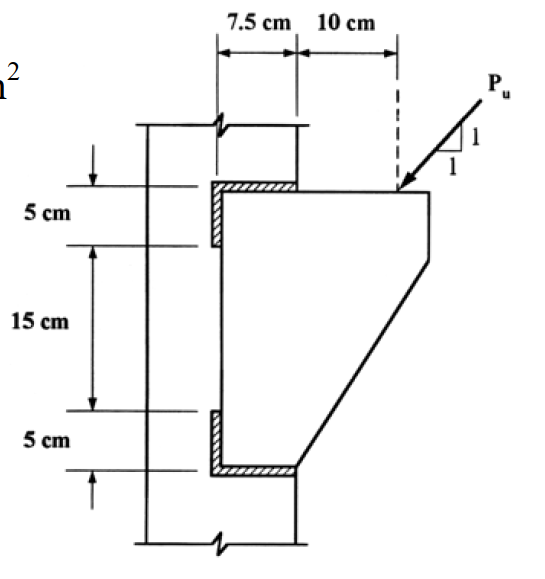

# 考題編號：SS-2004-3

**主分類：** `4.1.4` 接合之分析與設計
**副分類：** （無）
**設計法：** LRFD
**標籤：** `填角銲` `偏心接合` `彈性向量法` `托架` `E70XX` `雙角鋼` `LRFD` `極慣性矩`

---

## 1. 原始題目重述

一**雙角鋼托架（bracket）**以填角銲銲接於 W 型鋼柱之翼板，承受斜向因數化設計載重 $P_u$（45°方向，如附圖）。

設計條件：
- 鋼材：A36，$F_y = 2.50\ \text{tf/cm}^2$
- 銲條：E70XX，$F_{EXX} = 4.93\ \text{tf/cm}^2$
- 填角銲尺寸：$w = 10\ \text{mm}$
- 設計法：**LRFD，彈性分析（Elastic Vector Method）**

托架幾何（附圖 SS-2004-3-fig-1.png）：
- 托架總高：$h = 25\ \text{cm}$（上翼板 5 cm + 腹板 15 cm + 下翼板 5 cm）
- 上、下各一道水平填角銲，銲縫長度各 $L_w = 7.5\ \text{cm}$
- 銲縫位於柱翼板面，上下各距托架形心 $12.5\ \text{cm}$
- 載重作用點距柱面水平距離 $e_x = 10\ \text{cm}$，作用於托架頂端（距形心垂直距離 $e_y = 12.5\ \text{cm}$）
- 載重 $P_u$ 方向：45°（水平分量 $P_{ux} = P_u/\sqrt{2}$，垂直分量 $P_{uy} = P_u/\sqrt{2}$）

**求：最大許可 $P_u$（tf）**

*圖說：雙角鋼托架銲接於 W 型柱翼板（正面），托架高 25 cm（5+15+5）；上下各一道水平填角銲，各長 7.5 cm，位於柱面；載重 $P_u$ 以 45° 作用於托架頂端右側，水平距柱面 10 cm、垂直距形心 12.5 cm；填角銲尺寸 $w = 10\ \text{mm}$，E70XX。*

---

## 2. 考題核心精神與出題者意圖

本題測驗 **LRFD 填角銲偏心接合（彈性向量法）**的完整設計流程：

1. **偏心載重** → 需同時考慮直接剪力 + 扭矩引起的銲縫應力
2. **45° 斜向載重** → 水平分量與垂直分量均有偏心效果，必須正確疊加力矩
3. **控制點選擇** → 需逐一比對各角點，確認最不利位置
4. **極慣性矩 $J_w$** → 銲縫群線形性質，決定扭矩分佈

---

## 3. 解題戰略地圖與陷阱分析

**作戰計畫：**
1. 計算填角銲單位長度設計強度 $\phi R_{nw}$
2. 建立銲縫群線形性質（$A_w$、$I_x$、$I_y$、$J_w$）
3. 計算等效扭矩 $M_t$
4. 以彈性向量法求最不利點（上方右端）的合力
5. 設合力 $\leq \phi R_{nw}$，解出 $P_u$

**陷阱分析：**

| 陷阱 | 說明 | 應對策略 |
|------|------|---------|
| ⚠️ 45°載重兩分量均有力矩 | 水平分量×垂直偏心 + 垂直分量×水平偏心，方向相同，必須相加 | $M_t = P_u/\sqrt{2} \times (12.5 + 10) = P_u \times 22.5/\sqrt{2}$ |
| ⚠️ 扭矩方向判斷 | 兩分量均產生順時針力矩（對形心），需確認方向一致後才能相加 | 以右手定則驗算，均為 CW，確認 |
| ⚠️ 控制點為上方右端 | 直接剪力與扭矩誘發應力在上右端均為同向（最大疊加） | 逐點驗算確認 |
| ⚠️ 銲縫線形性質，$I_y$ 易漏算 | $J_w = I_x + I_y$，$I_y$ 雖小但不可省略 | 每條水平銲 $I_y = L^3/12$ |
| ⚠️ 有效喉深 $a = 0.707w$ | 公制 $w=10\ \text{mm}=1\ \text{cm}$ | $a = 0.707\ \text{cm}$ |

## 3.5 變數層次分析（Variable Hierarchy Analysis）

> 複習提示：解題後，在每個卡住的知識點「卡關?」欄標記 `⚠`；第二次複習時只看有 `⚠` 的項目。

**最終目標：** LRFD 填角銲偏心接合（彈性向量法）→ 計算銲縫群極慣性矩 → 疊加直接剪力與扭矩應力 → 求最大許可 $P_u$

### 主要公式（$\boxed{\phantom{x}}$ = 未知，待推導）

$$\boxed{a} = 0.707\,w \quad \text{（有效喉深）}$$

$$\phi R_{nw} = 0.75 \times 0.6\,F_{EXX} \times \boxed{a} \quad \text{（單位長度銲縫設計強度）}$$

$$\boxed{J_w} = I_x + I_y \quad \text{（銲縫群線形極慣性矩）}$$

$$\boxed{M_t} = \frac{P_u}{\sqrt{2}}\,(e_y + e_x) \quad \text{（兩分量力矩同向相加）}$$

$$\boxed{f_r} = \sqrt{(f_{d,z}+f'_z)^2 + (f_{d,y}+f'_y)^2} \leq \phi R_{nw}$$

### L1：題目直接給定

| 符號 | 數值 | 說明 |
|------|------|------|
| $w$ | 10 mm | 填角銲尺寸 |
| $F_{EXX}$ | 4.93 tf/cm² | E70XX 銲條強度 |
| $L_w$ | 7.5 cm | 上/下各一道水平銲縫長度 |
| $h$ | 25 cm | 托架總高（5+15+5） |
| $e_x$ | 10 cm | 載重點距柱面水平距離 |
| 載重角度 | 45° | $P_{ux} = P_{uy} = P_u/\sqrt{2}$ |

### L2：需知識點推導

**Step 1：銲縫設計強度**

| 符號 | 公式 / 來源 | 卡關? |
|------|------------|:-----:|
| $a$ | $0.707 \times 1.0 = 0.707$ cm | |
| $\phi R_{nw}$ | $0.75 \times 0.6 \times 4.93 \times 0.707 = 1.568$ tf/cm | |

**Step 2：銲縫群線形性質**

| 符號 | 公式 / 來源 | 卡關? |
|------|------------|:-----:|
| $A_w$ | $2 \times 7.5 = 15$ cm | |
| $I_x$ | $2 \times L_w \times \bar{y}^2 = 2 \times 7.5 \times 12.5^2 = 2343.75$ cm³ | |
| $I_y$ | $2 \times L_w^3/12 = 2 \times 7.5^3/12 = 70.31$ cm³ | |
| $J_w$ | $I_x + I_y = 2414.06$ cm³ | |

**Step 3：等效扭矩**

| 符號 | 公式 / 來源 | 卡關? |
|------|------------|:-----:|
| $e_y$ | 12.5 cm（載重點距形心垂直距離） | |
| $M_t$ | $(P_u/\sqrt{2})(e_x + e_y) = 22.5\,P_u/\sqrt{2}$ tf·cm | |
| 方向確認 | 水平分量 × 垂直臂 + 垂直分量 × 水平臂，均為順時針，相加 | |

**Step 4：彈性向量法（控制點：上右端）**

| 符號 | 公式 / 來源 | 卡關? |
|------|------------|:-----:|
| $f_{d,z}$ | $P_{ux}/A_w = 0.04714\,P_u$ | |
| $f_{d,y}$ | $-P_{uy}/A_w = -0.04714\,P_u$ | |
| $f'_z$ | $M_t \cdot y_i / J_w = +0.08237\,P_u$ | |
| $f'_y$ | $-M_t \cdot z_i / J_w = -0.02471\,P_u$ | |
| $f_r$ | $\sqrt{0.12951^2 + 0.07185^2}\,P_u = 0.1481\,P_u$ | |
| $P_{u,\max}$ | $\phi R_{nw} / 0.1481 = 1.568/0.1481 = 10.6$ tf | |

### L3：深層知識（不懂就卡住）

| 知識點 | 說明 | 補強頁 | 卡關? |
|--------|------|:------:|:-----:|
| 彈性向量法 vs. 瞬心法（ICR） | 彈性法偏保守；ICR 考慮變形相容，可得較高 $P_u$（+10~20%） | [[eccentric-weld]] | |
| 45° 斜向載重兩分量力矩相加 | 兩分量均對形心產生順時針扭矩，必須相加；忽略水平分量低估 55% | | |
| 控制點選取方法 | 直接剪力方向與扭矩誘發方向「同向疊加」的角點即為控制點 | | |
| 銲縫線形慣性矩 $I_y$ | 兩道短水平銲，$I_y$ 僅佔 $J_w$ 的 2.9%，考試可酌省略 | | |
| 有效喉深 $a = 0.707w$ | 公制填角銲強度以喉深計，忘乘 0.707 則高估強度 | | |

---

## 4. 步驟化詳細計算過程

### 4.1 填角銲設計強度

$$a = 0.707 \times w = 0.707 \times 1.0 = 0.707\ \text{cm}$$

$$\phi R_{nw} = \phi \times 0.6 F_{EXX} \times a = 0.75 \times 0.6 \times 4.93 \times 0.707$$

$$= 0.75 \times 2.958 \times 0.707 = \boxed{1.568\ \text{tf/cm（每公分銲縫）}}$$

---

### 4.2 銲縫群線形性質

**銲縫群組成：**
- 上銲縫：水平，長 $L_w = 7.5\ \text{cm}$，位於 $y = +12.5\ \text{cm}$（距形心）
- 下銲縫：水平，長 $L_w = 7.5\ \text{cm}$，位於 $y = -12.5\ \text{cm}$（距形心）
- 各銲縫沿 $z$ 方向延伸，關於形心對稱（$z$ 軸方向各從 $-3.75$ 至 $+3.75\ \text{cm}$）

**形心：** 由對稱性，形心在 $(z=0,\ y=0)$（即上下銲縫中間，柱面處）

**總銲縫長（線面積）：**
$$A_w = 2 \times 7.5 = 15\ \text{cm}$$

**對 $x$ 軸之線形慣性矩（$I_x$，繞水平軸）：**
$$I_x = 2 \times (L_w \times \bar{y}^2) = 2 \times (7.5 \times 12.5^2) = 2 \times 1171.875 = 2343.75\ \text{cm}^3$$

**對 $y$（$z$）軸之線形慣性矩（$I_y$，繞垂直軸）：**

各水平銲縫繞自身形心（即縱軸）之線形矩：
$$I_{y,\text{each}} = \frac{L_w^3}{12} = \frac{7.5^3}{12} = \frac{421.875}{12} = 35.16\ \text{cm}^3$$

$$I_y = 2 \times 35.16 = 70.31\ \text{cm}^3$$

**極慣性矩（$J_w$）：**
$$J_w = I_x + I_y = 2343.75 + 70.31 = \boxed{2414.06\ \text{cm}^3}$$

---

### 4.3 等效扭矩（力矩）

載重 $P_u$ 方向 45°，分量：
$$P_{ux} = P_{uy} = \frac{P_u}{\sqrt{2}}\ \text{（水平向外 + 垂直向下）}$$

偏心：
- 垂直分量 $P_{uy}$ 之水平力臂（距形心）：$e_x = 10\ \text{cm}$
- 水平分量 $P_{ux}$ 之垂直力臂（距形心）：$e_y = 12.5\ \text{cm}$

**兩分量均對形心產生同向（順時針）力矩：**

$$M_t = P_{uy} \times e_x + P_{ux} \times e_y$$

$$= \frac{P_u}{\sqrt{2}} \times 10 + \frac{P_u}{\sqrt{2}} \times 12.5 = \frac{P_u}{\sqrt{2}} \times 22.5$$

$$\boxed{M_t = \frac{22.5\ P_u}{\sqrt{2}}\ \text{tf·cm}\ \text{（順時針）}}$$

---

### 4.4 控制點分析（彈性向量法）

**分析四個端點，建立受力分量（以形心為原點）：**

| 端點 | 座標 $(z,\ y)$ (cm) | $r$ (cm) |
|------|---------------------|---------|
| 上右 | $(+3.75,\ +12.5)$ | $\sqrt{3.75^2+12.5^2} = 13.05$ |
| 上左 | $(-3.75,\ +12.5)$ | $13.05$ |
| 下右 | $(+3.75,\ -12.5)$ | $13.05$ |
| 下左 | $(-3.75,\ -12.5)$ | $13.05$ |

**直接剪力（均勻分佈於 $A_w$）：**
$$f_{d,z} = \frac{P_{ux}}{A_w} = \frac{P_u/\sqrt{2}}{15} = \frac{P_u}{15\sqrt{2}} = 0.04714\ P_u\ \text{（向右）}$$

$$f_{d,y} = \frac{-P_{uy}}{A_w} = \frac{-P_u/\sqrt{2}}{15} = -0.04714\ P_u\ \text{（向下）}$$

**扭矩誘發應力（彈性向量法）：**

在點 $(z_i,\ y_i)$ 處：
$$f'_z = \frac{-M_t \cdot y_i}{J_w} = \frac{-(-\text{CW}) \cdot y_i}{J_w}$$

採順時針 $M_t$ 為正，公式為：
$$f'_z = +\frac{M_t \cdot y_i}{J_w},\qquad f'_y = -\frac{M_t \cdot z_i}{J_w}$$

其中 $M_t = \dfrac{22.5\ P_u}{\sqrt{2}}$

---

**以上右端點 $(z=+3.75,\ y=+12.5)$ 為例（預期最不利）：**

$$f'_z = \frac{(22.5\ P_u/\sqrt{2}) \times 12.5}{2414.06} = \frac{281.25\ P_u}{1.4142 \times 2414.06} = \frac{281.25\ P_u}{3414.0} = +0.08237\ P_u\ \text{（向右）}$$

$$f'_y = -\frac{(22.5\ P_u/\sqrt{2}) \times 3.75}{2414.06} = -\frac{84.375\ P_u}{3414.0} = -0.02471\ P_u\ \text{（向下）}$$

**合計：**
$$f_z = f_{d,z} + f'_z = 0.04714\ P_u + 0.08237\ P_u = +0.12951\ P_u$$

$$f_y = f_{d,y} + f'_y = -0.04714\ P_u - 0.02471\ P_u = -0.07185\ P_u$$

**合力（每公分銲縫所受力）：**
$$f_r = \sqrt{f_z^2 + f_y^2} = \sqrt{(0.12951)^2 + (0.07185)^2}\ P_u$$

$$= \sqrt{0.016773 + 0.005162}\ P_u = \sqrt{0.021935}\ P_u = 0.14810\ P_u$$

---

**驗算其他端點確認上右端最不利：**

| 端點 $(z,y)$ | $f_z$ | $f_y$ | $f_r / P_u$ |
|-------------|-------|-------|------------|
| 上右 $(+3.75,+12.5)$ | $+0.12951$ | $-0.07185$ | **0.14810** ← 最大 |
| 上左 $(-3.75,+12.5)$ | $+0.12951$ | $-0.02243$ | $0.13143$ |
| 下右 $(+3.75,-12.5)$ | $-0.03522$ | $-0.07185$ | $0.08001$ |
| 下左 $(-3.75,-12.5)$ | $-0.03522$ | $-0.02243$ | $0.04174$ |

> ✅ 上右端為控制點，$f_r = 0.14810\ P_u$

---

### 4.5 求解最大 $P_u$

$$f_r \leq \phi R_{nw}$$

$$0.14810\ P_u \leq 1.568\ \text{tf/cm}$$

$$P_u \leq \frac{1.568}{0.14810} = 10.59\ \text{tf}$$

$$\boxed{P_{u,\text{max}} = 10.6\ \text{tf}}$$

---

## 5. 設計成果彙整

| 項目 | 數值 |
|------|------|
| 填角銲尺寸 | $w = 10\ \text{mm}$，E70XX |
| 每公分銲縫設計強度 | $\phi R_{nw} = 1.568\ \text{tf/cm}$ |
| 銲縫群 $A_w$ | $15\ \text{cm}$ |
| 銲縫群 $J_w$ | $2414.06\ \text{cm}^3$ |
| 等效扭矩 | $M_t = 22.5\ P_u / \sqrt{2}\ \text{tf·cm}$ |
| 控制點 | 上方右端 $(z=+3.75,\ y=+12.5)$ |
| 控制點合力 | $f_r = 0.1481\ P_u\ \text{tf/cm}$ |
| **最大許可載重** | $\boxed{P_{u,\text{max}} = 10.6\ \text{tf}}$ |

---

## 6. 關鍵爭議點與進階探討

### 6.1 為何上右端為控制點？

在順時針扭矩下：
- 上方點（$y>0$）：扭矩誘發 $f'_z$ 為**正（向右）**，與直接剪力 $f_{d,z}$（亦向右）**相加**
- 右端點（$z>0$）：扭矩誘發 $f'_y$ 為**負（向下）**，與直接剪力 $f_{d,y}$（亦向下）**相加**

上右端同時滿足兩個「最不利相加」條件，故為控制點。

### 6.2 水平分量的工程意義

$P_{ux} = P_u/\sqrt{2}$（水平，向外）對銲縫形心的力矩貢獻 $= P_u/\sqrt{2} \times 12.5 = 8.84\ P_u$，比垂直分量的貢獻 $P_u/\sqrt{2} \times 10 = 7.07\ P_u$ 更大。換言之，**載重偏高（作用點在頂端）使水平分量的力矩臂更長**，水平分量反而是主要的扭矩來源。若忽略水平分量，$M_t$ 少算 $8.84/15.91 = 55\%$，嚴重低估銲縫需求。

### 6.3 $I_y$ 的影響

$I_y = 70.31\ \text{cm}^3$ vs $I_x = 2343.75\ \text{cm}^3$，$I_y$ 僅佔 $J_w$ 的 $2.9\%$。因為上下兩道水平銲縫關於垂直軸的分佈極為集中（各寬只有 7.5 cm），$I_y$ 很小。若省略 $I_y$，誤差約 2.9%，在考試中可接受。

### 6.4 極限載重的物理意義

$P_{u,max} = 10.6\ \text{tf}$ 時，控制點單位銲縫長度受力 $= 1.568\ \text{tf/cm}$，銲縫喉深 $a = 0.707\ \text{cm}$，折合銲縫喉深應力 $= 1.568/0.707 = 2.218\ \text{tf/cm}^2 = 0.6 \times F_{EXX} = 0.6 \times 4.93 \times \phi^{-1}$，與 E70XX 剪力強度吻合。

### 6.5 彈性向量法 vs 瞬心法（ICR Method）

本題採**彈性向量法（Elastic Vector Method）**，假設銲縫強度與變形成線性比例，偏保守。若改用 AISC LRFD 的**瞬心法（ICR Method）**，考慮銲縫變形能力，可得更高 $P_u$（約高 10–20%）。考試中若題目未指定，通常用彈性向量法即可。
