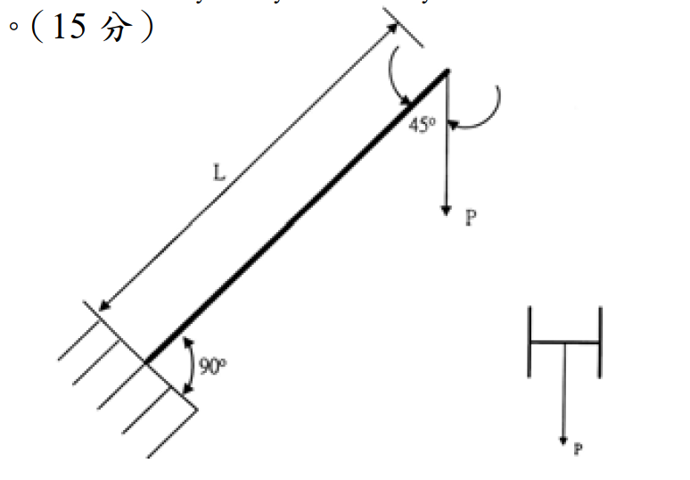

# 考題編號：SS-2004-4

**主分類：** `4.1.3` 梁柱桿件
**副分類：** （無）
**設計法：** ASD
**標籤：** `梁柱桿件` `ASD` `Cm係數` `懸臂柱` `弱軸彎曲` `45°斜置構材` `互制方程式` `有效長度`

---

## 1. 原始題目重述

本題分三小題（共 25 分）：

**(一) （5分）** 說明梁柱桿件穩定公式中 $C_m$ 係數的意義與目的。

**(二) （5分）** $C_m = 0.6 - 0.4(M_1/M_2) \geq 0.4$ 適用於哪類構材？其下限 $0.4$ 的工程意義為何？

**(三) （15分）** 一 H 型鋼懸臂梁柱構材，斜置 45°（如附圖），承受靜載重：$P = 2000\ \text{kg}$，構材長度 $L = 350\ \text{cm}$，以 ASD 法驗算本構材是否滿足強度需求。

設計條件：
- 鋼材：A36，$F_y = 2.5\ \text{tf/cm}^2$
- 斷面性質：$S_x = 451\ \text{cm}^3$，$S_y = 152\ \text{cm}^3$，$r_x = 8.81\ \text{cm}$，$r_y = 5.13\ \text{cm}$，$A = 59\ \text{cm}^2$，$E = 2.1 \times 10^3\ \text{tf/cm}^2$
- 設計參數（已知）：$K = 2.1$，$C_c = 127$，$F_{bx} = 0.66F_y$，$F_{by} = 0.75F_y$，$C_m = 0.85$
- **弱軸彎曲（$S_y$ 控制）**

ASD 互制方程式（考題附）：

$$\text{若}\ \frac{f_a}{F_a} < 0.15：\quad \frac{f_a}{F_a} + \frac{f_{bx}}{F_{bx}} + \frac{f_{by}}{F_{by}} \leq 1.0$$

$$\text{若}\ \frac{f_a}{F_a} \geq 0.15：$$

$$\text{穩定方程式：}\quad \frac{f_a}{F_a} + \frac{C_{mx}f_{bx}}{F_{bx}\!\left(1-\dfrac{f_a}{F'_{ex}}\right)} + \frac{C_{my}f_{by}}{F_{by}\!\left(1-\dfrac{f_a}{F'_{ey}}\right)} \leq 1.0$$

$$\text{強度方程式：}\quad \frac{f_a}{0.6F_y} + \frac{f_{bx}}{F_{bx}} + \frac{f_{by}}{F_{by}} \leq 1.0$$

$$F'_e = \frac{12\pi^2 E}{23(KL/r)^2}$$

*圖說：H 型鋼懸臂構材，底部固接，頂部自由，構材斜置 45°，在頂端自由端施以垂直向下力 $P$。右側小圖為斷面截面示意（弱軸彎曲方向），$P$ 方向指向弱軸。$L = 350\ \text{cm}$，$K = 2.1$（懸臂），構材軸線與鉛直方向夾角 45°。*

---

## 2. 考題核心精神與出題者意圖

本題三小題涵蓋：

1. **觀念題（$C_m$ 係數）**：考驗對 ASD 梁柱設計哲學的理解——$C_m$ 是等效均勻彎矩係數，反映實際彎矩分佈對穩定性的影響
2. **公式適用範圍辨別**：$C_m = 0.6-0.4(M_1/M_2)$ 只用於「無側移」且「無橫向力」的梁柱桿件
3. **計算題**：45° 斜置懸臂構材，**需正確分解荷載為軸力 + 橫向力**，再進行 ASD 互制公式驗算

---

## 3. 解題戰略地圖與陷阱分析

**作戰計畫：**
1. 回答 (一)(二) 觀念題
2. 分解 45° 斜置垂直荷載為軸力與橫向分量
3. 計算 $f_a$（軸壓應力）與 $f_{by}$（弱軸彎曲應力）
4. 計算允許壓縮應力 $F_a$（依 $KL/r_y$ 與 $C_c$ 判斷公式）
5. 判斷 $f_a/F_a$ 是否 $\geq 0.15$，選用適當互制方程式
6. 代入互制公式，得出結論

**陷阱分析：**

| 陷阱 | 說明 | 應對策略 |
|------|------|---------|
| ⚠️ 45° 荷載分解方向 | P 為鉛直力，需分解至「沿桿軸」與「垂直桿軸」兩分量 | 軸壓 $= P\cos45°=P/\sqrt{2}$，橫向 $= P\sin45°=P/\sqrt{2}$ |
| ⚠️ 弱軸用 $r_y$ 計算 $F_a$ | 弱軸彎曲 → 弱軸挫屈控制 → $KL/r_y$ | $r_y = 5.13\ \text{cm}$，不用 $r_x$ |
| ⚠️ $KL/r > C_c$ → 用尤拉公式 | $143.3 > 127$ → 進入彈性挫屈區 | $F_a = 12\pi^2E/[23(KL/r)^2]$ |
| ⚠️ $f_a/F_a < 0.15$ → 用簡化式 | 軸壓力極小，採簡化互制式 | $f_a/F_a + f_{by}/F_{by}$ 即可 |
| ⚠️ $C_m$ 不適用於懸臂梁 | 懸臂有橫向載重，不能用 $0.6-0.4M_1/M_2$ | 題目直接給定 $C_m = 0.85$ |

## 3.5 變數層次分析（Variable Hierarchy Analysis）

> 複習提示：解題後，在每個卡住的知識點「卡關?」欄標記 `⚠`；第二次複習時只看有 `⚠` 的項目。

**最終目標：** 說明 $C_m$ 係數概念 → 分解 45° 斜置懸臂構材荷載 → ASD 梁柱互制驗算（彈性挫屈區）

### 主要公式（$\boxed{\phantom{x}}$ = 未知，待推導）

$$N = P\cos45°,\quad V = P\sin45° \quad \text{（荷載分解）}$$

$$\boxed{M} = V \times L \quad \text{（懸臂固端彎矩）}$$

$$\boxed{f_a} = N/A,\quad \boxed{f_{by}} = M/S_y$$

$$\frac{KL}{r_y} > C_c \Rightarrow \boxed{F_a} = \frac{12\pi^2 E}{23(KL/r)^2} \quad \text{（彈性挫屈區）}$$

$$\frac{f_a}{F_a} < 0.15 \Rightarrow \frac{f_a}{F_a} + \frac{f_{by}}{F_{by}} \leq 1.0 \quad \text{（簡化式）}$$

### L1：題目直接給定

| 符號 | 數值 | 說明 |
|------|------|------|
| $P$ | 2 tf（2000 kg） | 頂端垂直靜載重 |
| $L$ | 350 cm | 構材長度 |
| $K$ | 2.1 | 懸臂有效長度係數 |
| $C_c$ | 127 | 彈性/非彈性分界細長比 |
| $S_x$ | 451 cm³ | 強軸斷面模數 |
| $S_y$ | 152 cm³ | 弱軸斷面模數 |
| $r_x$ | 8.81 cm | 強軸迴轉半徑 |
| $r_y$ | 5.13 cm | 弱軸迴轉半徑 |
| $A$ | 59 cm² | 斷面積 |
| $E$ | 2100 tf/cm² | 彈性模數 |
| $F_{bx}$ | $0.66F_y$ | 強軸允許彎曲應力 |
| $F_{by}$ | $0.75F_y$ = 1.875 tf/cm² | 弱軸允許彎曲應力 |
| $C_m$ | 0.85 | 等效均勻彎矩係數（直接給定） |
| 構材方向 | 弱軸彎曲 | 橫向荷載沿弱軸 |

### L2：需知識點推導

**Step 1：荷載分解（45° 斜置）**

| 符號 | 公式 / 來源 | 卡關? |
|------|------------|:-----:|
| $N$（軸壓） | $P\cos45° = 2/\sqrt{2} = 1.414$ tf | |
| $V$（弱軸橫向） | $P\sin45° = 2/\sqrt{2} = 1.414$ tf | |
| $M$（固端） | $V \times L = 1.414 \times 350 = 495$ tf·cm | |

**Step 2：實際應力**

| 符號 | 公式 / 來源 | 卡關? |
|------|------------|:-----:|
| $f_a$ | $N/A = 1.414/59 = 0.024$ tf/cm² | |
| $f_{by}$ | $M/S_y = 495/152 = 3.257$ tf/cm² | |
| $f_{bx}$ | 0（無強軸彎矩） | |

**Step 3：允許壓縮應力（彈性挫屈區）**

| 符號 | 公式 / 來源 | 卡關? |
|------|------------|:-----:|
| $KL/r_y$ | $2.1 \times 350 / 5.13 = 143.3$ | |
| 判斷 | $143.3 > C_c = 127$ → 彈性挫屈區 | |
| $F_a$ | $12\pi^2 E / [23(143.3)^2] = 0.527$ tf/cm² | |

**Step 4：互制方程式驗算**

| 符號 | 公式 / 來源 | 卡關? |
|------|------------|:-----:|
| $f_a/F_a$ | $0.024/0.527 = 0.046 < 0.15$ → 簡化式 | |
| 簡化式 | $0.046 + 3.257/1.875 = 0.046 + 1.737 = 1.783 > 1.0$ ❌ | |
| 強度式 | $0.016 + 1.737 = 1.753 > 1.0$ ❌ | |

### L3：深層知識（不懂就卡住）

| 知識點 | 說明 | 補強頁 | 卡關? |
|--------|------|:------:|:-----:|
| $C_m$ 係數的物理意義 | 等效均勻彎矩係數，校正非均勻彎矩分佈對穩定性的有利影響 | | |
| $C_m = 0.6-0.4(M_1/M_2)$ 適用條件 | 僅用於有側撐、無橫向力的桿件；懸臂有橫向力不適用 | | |
| ASD 柱設計 $C_c$ 分界 | $KL/r < C_c$ 非彈性；$> C_c$ 改用尤拉公式，$F_a$ 大幅降低 | [[asd-column]] | |
| 弱軸彎曲的嚴重性 | $S_y = 152$ vs $S_x = 451$，弱軸抗彎只有強軸 33%；方向選擇至關重要 | | |
| $f_a/F_a < 0.15$ 判斷 | 軸壓比小於 0.15 才用簡化式；否則需用含 $C_m/(1-f_a/F'_e)$ 的穩定式 | | |
| $F'_e$（尤拉彈性挫屈應力） | $12\pi^2E/[23(KL/r)^2]$，既是 $F_a$（彈性區）也出現在分母放大係數中 | | |

---

## 4. 步驟化詳細計算過程

### (一) $C_m$ 係數的意義（5分）

**$C_m$（等效均勻彎矩係數，Equivalent Moment Factor）** 用於 ASD 梁柱穩定互制公式中，目的是：

1. **校正彎矩分佈形狀的影響**：穩定公式的推導假設構材承受「均勻彎矩（uniform moment）」，此時放大效果最嚴重。當實際彎矩分佈非均勻（如三角形、拋物線）時，實際的二次效應較小。
2. **換算為等效均勻彎矩**：$C_m \leq 1.0$ 表示實際彎矩分佈比均勻彎矩「溫和」，允許承受更大的彎矩；$C_m = 1.0$ 為最保守，等同均勻彎矩假設。
3. **物理意義**：$C_m/(1 - f_a/F'_e)$ 是考慮 P-δ 效應後的放大係數，$C_m < 1.0$ 反映非均勻彎矩對穩定性的有利影響。

---

### (二) $C_m = 0.6-0.4(M_1/M_2)\geq 0.4$ 的適用條件與下限意義（5分）

**適用條件：**
- 有側向支撐（braced frame），**無側移**的梁柱構材
- 構材在兩端之間**無橫向載重**，僅在端部受彎矩 $M_1$、$M_2$

**$M_1/M_2$ 符號規定：**
- 雙曲率（double curvature，反曲）→ $M_1/M_2$ 取**負值**，$C_m$ 減小（最有利）
- 單曲率（single curvature）→ $M_1/M_2$ 取**正值**，$C_m$ 增大
- $M_2$ 為絕對值較大端；$M_1$ 為較小端

**下限 $0.4$ 的工程意義：**
即使是雙曲率（最有利分佈，$M_1/M_2 = -1$ 時 $C_m = 1.0$），甚至考慮雙曲率的有利影響，由於：
1. 幾何非線性（P-δ 效應）始終存在，不可忽略
2. 加工誤差與殘留應力導致實際初始偏心
3. 公式推導的保守餘量

下限 $C_m \geq 0.4$ 確保即使在最有利的彎矩分佈下，仍保有適當的安全餘量。

---

### (三) 45° 懸臂梁柱 ASD 驗算（15分）

#### 4.1 荷載分解

構材斜置 45°，自由端承受鉛直向下力 $P = 2000\ \text{kg} = 2\ \text{tf}$：

$$\text{沿桿軸壓力（軸壓）：}\quad N = P\cos 45° = \frac{2}{\sqrt{2}} = \sqrt{2} \approx 1.414\ \text{tf（壓縮）}$$

$$\text{垂直桿軸橫向力（弱軸彎曲）：}\quad V = P\sin 45° = \frac{2}{\sqrt{2}} = \sqrt{2} \approx 1.414\ \text{tf}$$

> 因構材弱軸方向承受橫向載重，彎矩作用於**弱軸**（$S_y$ 控制）

#### 4.2 固端彎矩（懸臂）

$$M = V \times L = \sqrt{2} \times 350 = 494.97 \approx 495\ \text{tf·cm}$$

---

#### 4.3 實際應力

**軸壓應力：**
$$f_a = \frac{N}{A} = \frac{\sqrt{2}}{59} = \frac{1.414}{59} = \boxed{0.02396\ \text{tf/cm}^2}$$

**弱軸彎曲應力：**
$$f_{by} = \frac{M}{S_y} = \frac{494.97}{152} = \boxed{3.257\ \text{tf/cm}^2}$$

（無強軸彎曲，$f_{bx} = 0$）

---

#### 4.4 允許應力

**弱軸彎曲允許應力：**
$$F_{by} = 0.75 F_y = 0.75 \times 2.5 = \boxed{1.875\ \text{tf/cm}^2}$$

**細長比（弱軸，控制）：**
$$\frac{KL}{r_y} = \frac{2.1 \times 350}{5.13} = \frac{735}{5.13} = \boxed{143.3}$$

判斷：$KL/r_y = 143.3 > C_c = 127$ → **彈性挫屈區，採尤拉公式：**

$$F_a = \frac{12\pi^2 E}{23\left(\dfrac{KL}{r}\right)^2} = \frac{12\pi^2 \times 2100}{23 \times 143.3^2} = \frac{248{,}808}{23 \times 20{,}535} = \frac{248{,}808}{472{,}305} = \boxed{0.527\ \text{tf/cm}^2}$$

---

#### 4.5 ASD 互制方程式驗算

**判斷適用公式：**
$$\frac{f_a}{F_a} = \frac{0.02396}{0.527} = 0.0455 < 0.15$$

→ 採**簡化互制公式**：

$$\frac{f_a}{F_a} + \frac{f_{by}}{F_{by}} \leq 1.0$$

$$0.0455 + \frac{3.257}{1.875} = 0.0455 + 1.737 = \boxed{1.783 > 1.0\ ❌}$$

**另驗算強度方程式（無論 $f_a/F_a$ 大小皆須驗算）：**

$$\frac{f_a}{0.6F_y} + \frac{f_{by}}{F_{by}} = \frac{0.024}{1.5} + \frac{3.257}{1.875} = 0.016 + 1.737 = \boxed{1.753 > 1.0\ ❌}$$

---

#### 4.6 結論

$$\boxed{\text{本構材不滿足 ASD 梁柱互制需求，設計 NG}}$$

| 驗算項目 | 計算值 | 允許值 | 結果 |
|---------|-------|-------|------|
| $f_{by}$ 單獨 | $3.257\ \text{tf/cm}^2$ | $F_{by} = 1.875\ \text{tf/cm}^2$ | ❌ 超出 $1.74\times$ |
| 簡化互制 $f_a/F_a + f_{by}/F_{by}$ | $1.783$ | $\leq 1.0$ | ❌ |
| 強度方程式 $f_a/0.6F_y + f_{by}/F_{by}$ | $1.753$ | $\leq 1.0$ | ❌ |

**主要失敗原因：** 弱軸彎曲應力 $f_{by} = 3.257\ \text{tf/cm}^2$ 遠超允許彎曲應力 $F_{by} = 1.875\ \text{tf/cm}^2$（超出 74%）。軸壓分量 $f_a/F_a = 0.046$ 極小，影響微乎其微。

---

## 5. 設計成果彙整

| 項目 | 數值 |
|------|------|
| 軸壓力 | $N = \sqrt{2} = 1.414\ \text{tf}$ |
| 橫向力（弱軸） | $V = \sqrt{2} = 1.414\ \text{tf}$ |
| 固端彎矩 $M$ | $495\ \text{tf·cm}$ |
| 軸壓應力 $f_a$ | $0.024\ \text{tf/cm}^2$ |
| 弱軸彎曲應力 $f_{by}$ | $3.257\ \text{tf/cm}^2$ |
| $KL/r_y$ | $143.3 > C_c = 127$（彈性區） |
| 允許壓縮應力 $F_a$ | $0.527\ \text{tf/cm}^2$ |
| 允許弱軸彎曲 $F_{by}$ | $1.875\ \text{tf/cm}^2$ |
| 互制比（簡化式） | $\mathbf{1.783 \gg 1.0}$（NG） |
| **判斷** | **不滿足，需加大斷面或改變幾何** |

---

## 6. 關鍵爭議點與進階探討

### 6.1 為何弱軸彎曲如此嚴重？

弱軸彎矩 $M = 495\ \text{tf·cm}$，僅 $2\ \text{tf}$ 的小載重即造成如此大的彎曲應力，原因：
- 弱軸斷面模數 $S_y = 152\ \text{cm}^3$ 遠小於強軸 $S_x = 451\ \text{cm}^3$（弱軸抗彎能力僅強軸的 $33\%$）
- 懸臂長度 $L = 350\ \text{cm}$ 對彎矩放大效果顯著
- 若改用強軸承受橫向彎矩：$f_{bx} = 495/451 = 1.098\ \text{tf/cm}^2 < F_{bx} = 1.65\ \text{tf/cm}^2\ \checkmark$（通過）

這說明**斷面方向的選擇對斜置梁柱的設計至關重要**。

### 6.2 懸臂構材的 $C_m$

本題 $C_m = 0.85$ 為直接給定。ASD 規範對有橫向載重的構材（包括懸臂）通常建議 $C_m = 0.85$（保守值），而非用 $0.6-0.4M_1/M_2$（後者僅適用於端部受彎矩、無橫向載重的構材）。

### 6.3 為何使用弱軸而非強軸？

從附圖的截面示意可知，橫向荷載方向沿弱軸（$y$ 軸），故彎矩作用在弱軸方向，控制設計。若構材能旋轉 90° 使橫向荷載作用在強軸方向，則設計強度大幅提升（$S_x/S_y = 451/152 = 2.97\times$）。

### 6.4 改善方向

1. **改變斷面方向**：旋轉 90° 使強軸承受橫向彎矩
2. **加大斷面**：選用 $S_y \geq 330\ \text{cm}^3$ 的斷面（約 $M/F_{by} = 495/1.875 = 264\ \text{cm}^3$，加上軸壓折減後需更大）
3. **縮短有效長度**：在中間增設側向支撐，降低 $KL$
4. **減小作用荷載或增設斜撐**：使構材軸線更接近垂直，減少橫向分量
