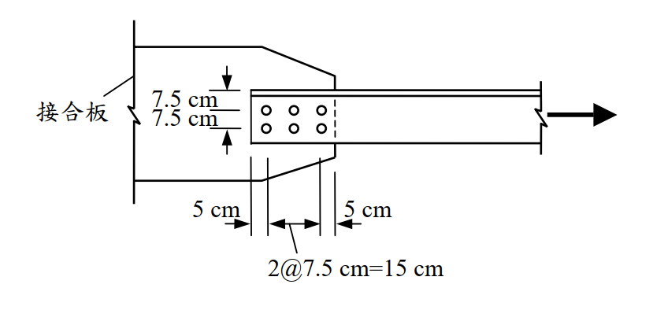

# 考題編號：SS-2005-1

**主分類：** `SS-U1-1` 拉力及壓力桿件
**副分類：** `SS-U1-4` 接合之分析與設計
**設計法：** LRFD
**標籤：** `拉力桿件` `剪力遲滯` `有效淨面積` `U值` `淨斷面斷裂` `塊狀剪力` `螺栓接合` `等肢角鋼`

---

## 1. 原始題目重述

一根 **L200×200×20 mm 等肢角鋼**拉力構件，材料強度 $F_y = 2.5\ \text{tf/cm}^2$，$F_u = 4.1\ \text{tf/cm}^2$，以 **6 顆 22 mm 高拉力螺栓（承壓型）** 通過一肢連接至接合板，孔徑 $d_h = 23.5\ \text{mm}$，螺栓排列如附圖（2 行 × 3 列）。

**螺栓幾何：**
- 橫向（穿越肢寬方向）：2 行，行距 $g = 7.5\ \text{cm}$
- 縱向（沿載重方向）：3 列，列距 $s = 7.5\ \text{cm}$，端距 $e = 5\ \text{cm}$
- 接合長度：$L = 2 \times 7.5 = 15\ \text{cm}$

*圖說：接合板以螺栓連接角鋼單一肢（水平肢），螺栓排列為2行（橫向行距7.5cm）×3列（縱向列距7.5cm），縱向端距5cm，連接長度L=15cm。角鋼承受右向拉力。*

---

## 2. 考題核心精神與出題者意圖

本題測驗 **LRFD 拉力構件設計** 的完整流程，核心在於：
1. **剪力遲滯係數 U**（Shear Lag Factor）的條件判斷與適用規定
2. **三種極限狀態**的強度計算：全斷面降伏、淨斷面斷裂、塊狀剪力

出題者刻意採用「僅通過一肢」的角鋼連接，強制考生必須考慮剪力遲滯（$U < 1$），並且透過 2 行螺栓的排列設置塊狀剪力破壞的陷阱。

---

## 3. 解題戰略地圖與陷阱分析

**作戰計畫：**
1. 計算角鋼斷面積 $A_g$ 與重心距離 $\bar{x}$
2. 依規範確認 U 值（三種適用條件）
3. 計算淨斷面積 $A_n$（扣除孔洞）
4. 計算有效淨斷面積 $A_e = U \times A_n$
5. 三種極限狀態取最小值

**陷阱分析：**

| 陷阱 | 說明 | 應對策略 |
|------|------|---------|
| ⚠️ 混淆 U 值條件 | U=0.90 只適用 W/H 型鋼翼板連接，**不適用角鋼** | 角鋼≥3個螺栓 → U=0.85 |
| ⚠️ 淨面積計算誤用 | 截面內有 2 個螺栓孔（2行），須扣除 2 個孔 | $A_n = A_g - 2 \times d_h \times t$ |
| ⚠️ 忽略塊狀剪力 | 多行螺栓務必檢查所有可能的塊狀剪力破壞面 | 分別計算各破壞模式 |
| ⚠️ 有效淨面積用於降伏 | U 值（剪力遲滯）**只影響淨斷面斷裂**，不影響全斷面降伏 | 降伏用 $A_g$，斷裂用 $A_e = UA_n$ |

## 3.5 變數層次分析（Variable Hierarchy Analysis）

> 複習提示：解題後，在每個卡住的知識點「卡關?」欄標記 `⚠`；第二次複習時只看有 `⚠` 的項目。

**最終目標：** LRFD 拉力構件設計 → 三種極限狀態（全斷面降伏 / 淨斷面斷裂 / 塊狀剪力）取最小值

### 主要公式（$\boxed{\phantom{x}}$ = 未知，待推導）

$$\phi_t P_n^{(1)} = 0.9\,F_y\,A_g \quad \text{（全斷面降伏）}$$

$$\boxed{A_e} = U \times \boxed{A_n} \quad \text{（有效淨斷面積，含剪力遲滯）}$$

$$\phi_t P_n^{(2)} = 0.75\,F_u\,\boxed{A_e} \quad \text{（淨斷面斷裂）}$$

$$\boxed{R_n^{BSR}} = 0.6F_u A_{nv} + U_{bs}F_u A_{nt} \leq 0.6F_y A_{gv} + U_{bs}F_u A_{nt} \quad \text{（塊狀剪力）}$$

### L1：題目直接給定

| 符號 | 數值 | 說明 |
|------|------|------|
| 斷面 | L200×200×20 mm | 等肢角鋼 |
| $F_y$ | 2.5 tf/cm² | 降伏應力 |
| $F_u$ | 4.1 tf/cm² | 極限應力 |
| 螺栓 | 6 顆，22 mm，承壓型 | 2 行 × 3 列 |
| $d_h$ | 23.5 mm = 2.35 cm | 螺栓孔徑 |
| $g$ | 7.5 cm | 橫向行距 |
| $s$ | 7.5 cm | 縱向列距 |
| $e$ | 5 cm | 端距 |
| 接合方式 | 僅通過一肢 | 需考慮剪力遲滯 |

### L2：需知識點推導

**Step 1：角鋼斷面積與重心**

| 符號 | 公式 / 來源 | 卡關? |
|------|------------|:-----:|
| $A_g$ | $(200+200-20)\times20 = 7600$ mm² = 76 cm² | |
| $\bar{x}$ | 以兩矩形分割求重心距背面 = 5.74 cm | |

**Step 2：剪力遲滯係數 U**

| 符號 | 公式 / 來源 | 卡關? |
|------|------------|:-----:|
| 接合長度 $L$ | $2s = 15$ cm | |
| 公式值 | $U = 1 - \bar{x}/L = 1 - 5.74/15 = 0.617$ | |
| 表格值 | 角鋼每行 ≥ 3 顆 → $U = 0.85$（取較大值） | |

**Step 3：淨斷面斷裂**

| 符號 | 公式 / 來源 | 卡關? |
|------|------------|:-----:|
| $A_n$ | $A_g - 2 \times d_h \times t = 76 - 9.4 = 66.6$ cm²（臨界截面扣 2 孔） | |
| $A_e$ | $U \times A_n = 0.85 \times 66.6 = 56.61$ cm² | |
| $\phi_t P_n$ | $0.75 \times 4.1 \times 56.61 = 174.1$ tf | |

**Step 4：塊狀剪力（BSR，共三種模式）**

| 符號 | 公式 / 來源 | 卡關? |
|------|------------|:-----:|
| 剪切長度 | $e + 2s = 5+15 = 20$ cm | |
| $A_{gv}$ | $20 \times 2 = 40$ cm²（每條剪切面） | |
| $A_{nv}$ | $[20 - 2.5 \times 2.35] \times 2 = 28.25$ cm²（扣 2.5 孔） | |
| BSR-B（控制） | $A_{nt} = (5-0.5\times2.35)\times2 = 7.65$ cm²，$\phi R_n = 68.6$ tf | |
| 上限檢核 | $0.6F_y A_{gv}$ 上限控制剪力面 | |

### L3：深層知識（不懂就卡住）

| 知識點 | 說明 | 補強頁 | 卡關? |
|--------|------|:------:|:-----:|
| 剪力遲滯係數 U 值規定 | W/H 型鋼翼板連接 U=0.90；角鋼≥3顆 U=0.85；角鋼2顆 U=0.75 | [[shear-lag-u]] · [[SHEAR-LAG]] | |
| U 值僅影響淨斷面斷裂 | 降伏用 $A_g$（無 U），斷裂用 $A_e = U A_n$ | | |
| 塊狀剪力上限式 | $0.6F_y A_{gv}$（降伏控制剪切面）+ $F_u A_{nt}$（斷裂控制拉力面） | [[block-shear]] · [[BLOCK-SHEAR-RUPTURE]] | |
| 塊狀剪力多模式分析 | 2 行螺栓有三種 BSR 路徑，取最小值為設計強度 | | |
| 淨面積扣孔數 | 臨界截面有幾行螺栓就扣幾個孔，勿少算 | | |

---

## 4. 步驟化詳細計算過程

### 4.1 角鋼斷面性質

**L200×200×20mm（等肢角鋼）：**

$$A_g = (200 + 200 - 20) \times 20 = 380 \times 20 = 7600\ \text{mm}^2 = 76.0\ \text{cm}^2$$

**重心距離 $\bar{x}$**（距角鋼背面，即由任一肢背面量至斷面重心之距離）：

以肢背面（heel）為原點，將斷面分為兩矩形：
- 水平肢：$A_1 = 200 \times 20 = 4000\ \text{mm}^2$，重心距背 $x_1 = 100\ \text{mm}$
- 垂直肢（扣除重疊）：$A_2 = 180 \times 20 = 3600\ \text{mm}^2$，重心距背 $x_2 = 10\ \text{mm}$

$$\bar{x} = \frac{4000 \times 100 + 3600 \times 10}{7600} = \frac{436000}{7600} = 57.4\ \text{mm} \approx 5.74\ \text{cm}$$

---

### 4.2 剪力遲滯係數 U 值規定（題目要求說明三種情況）

依台灣鋼結構設計規範（AISC LRFD 架構）：

| 情況 | 適用斷面與條件 | U 值 |
|------|--------------|------|
| **1** | W、H、S、I 型鋼，**所有元件均連接**（翼板寬 $b_f \geq \frac{2}{3}d$），每行≥3個螺栓 | **0.90** |
| **2** | W、H、S、I、T 型鋼，翼板連接但 $b_f < \frac{2}{3}d$，或其他斷面型式（含角鋼、槽鋼），每行≥**3**個螺栓 | **0.85** |
| **3** | 角鋼、槽鋼等非對稱斷面，僅通過一元件連接，每行只有 **2** 個螺栓 | **0.75** |

**或**以公式計算（如規範許可）：
$$U = 1 - \frac{\bar{x}}{L} = 1 - \frac{5.74}{15} = 1 - 0.383 = 0.617$$

> 本題採用 **U = 0.85**（角鋼，每行3個螺栓，適用情況2）
> （公式計算 U = 0.617 < 0.85，規範表格值 0.85 為下限，取表格值較為保守安全）

---

### 4.3 極限狀態一：全斷面降伏（Gross Section Yielding, GSY）

$$\phi_t P_n = 0.9 \times F_y \times A_g = 0.9 \times 2.5 \times 76.0 = \boxed{171.0\ \text{tf}}$$

---

### 4.4 極限狀態二：淨斷面斷裂（Net Section Fracture, NSF）

**淨斷面積 $A_n$**（臨界截面有 2 個螺栓孔，即 2 行螺栓同時截到）：

$$A_n = A_g - 2 \times d_h \times t = 76.0 - 2 \times 2.35 \times 2.0 = 76.0 - 9.4 = 66.6\ \text{cm}^2$$

**有效淨斷面積：**
$$A_e = U \times A_n = 0.85 \times 66.6 = 56.61\ \text{cm}^2$$

**淨斷面強度：**
$$\phi_t P_n = 0.75 \times F_u \times A_e = 0.75 \times 4.1 \times 56.61 = \boxed{174.1\ \text{tf}}$$

---

### 4.5 極限狀態三：塊狀剪力破壞（Block Shear Rupture, BSR）

公式（LRFD）：
$$R_n = 0.6F_u A_{nv} + U_{bs} F_u A_{nt} \leq 0.6F_y A_{gv} + U_{bs} F_u A_{nt}$$

取 $U_{bs} = 1.0$（均勻拉力分布）

**幾何條件（水平連接肢，寬 20cm，厚 2cm）：**

依附圖，螺栓橫向位置（由肢背heel量起）：
- 第 1 行：$g_1 = 5\ \text{cm}$（距 heel）
- 第 2 行：$g_1 + g = 5 + 7.5 = 12.5\ \text{cm}$（距 heel）
- 肢趾 toe：20 cm（距 heel），距第2行 = $20 - 12.5 = 7.5\ \text{cm}$

縱向剪切長度：$L_{shear} = e_1 + 2s = 5 + 7.5 + 7.5 = 20\ \text{cm}$（由端部至末端螺栓）

---

**BSR 模式 A：第2行（外側行）剪出，拉力拉裂至肢趾（7.5cm）**

$$A_{gv} = L_{shear} \times t = 20 \times 2 = 40\ \text{cm}^2$$

$$A_{nv} = \left[20 - 2.5 \times 2.35\right] \times 2 = \left[20 - 5.875\right] \times 2 = 28.25\ \text{cm}^2$$

$$A_{nt} = \left(7.5 - 0.5 \times 2.35\right) \times 2 = 6.325 \times 2 = 12.65\ \text{cm}^2$$

$$R_n = 0.6 \times 4.1 \times 28.25 + 1.0 \times 4.1 \times 12.65 = 69.5 + 51.9 = 121.4\ \text{tf}$$
$$\text{上限} = 0.6 \times 2.5 \times 40 + 4.1 \times 12.65 = 60.0 + 51.9 = 111.9\ \text{tf} \leftarrow \text{控制}$$
$$\phi R_n^A = 0.75 \times 111.9 = 83.9\ \text{tf}$$

---

**BSR 模式 B：第1行（內側行）剪出，拉力拉裂至肢背（5cm）**

$$A_{gv} = 20 \times 2 = 40\ \text{cm}^2,\quad A_{nv} = 28.25\ \text{cm}^2$$

$$A_{nt} = \left(5 - 0.5 \times 2.35\right) \times 2 = 3.825 \times 2 = 7.65\ \text{cm}^2$$

$$R_n = 0.6 \times 4.1 \times 28.25 + 4.1 \times 7.65 = 69.5 + 31.4 = 100.9\ \text{tf}$$
$$\text{上限} = 0.6 \times 2.5 \times 40 + 4.1 \times 7.65 = 60.0 + 31.4 = 91.4\ \text{tf} \leftarrow \text{控制}$$
$$\phi R_n^B = 0.75 \times 91.4 = \boxed{68.6\ \text{tf}} \leftarrow \text{最小，控制}$$

---

**BSR 模式 C：兩行同時剪出，拉力拉裂行間（7.5cm）**

$$A_{gv} = 2 \times 40 = 80\ \text{cm}^2,\quad A_{nv} = 2 \times 28.25 = 56.5\ \text{cm}^2$$

$$A_{nt} = \left(7.5 - 2.35\right) \times 2 = 10.3\ \text{cm}^2$$

$$R_n = 0.6 \times 4.1 \times 56.5 + 4.1 \times 10.3 = 138.9 + 42.2 = 181.1\ \text{tf}$$
$$\text{上限} = 0.6 \times 2.5 \times 80 + 4.1 \times 10.3 = 120.0 + 42.2 = 162.2\ \text{tf} \leftarrow \text{控制}$$
$$\phi R_n^C = 0.75 \times 162.2 = 121.7\ \text{tf}$$

---

### 4.6 螺栓承壓強度（補充：每顆螺栓承壓檢核）

依題目給定公式 $R_n = 2.4 d t F_u$：

$$R_n = 2.4 \times 2.2 \times 2.0 \times 4.1 = 43.5\ \text{tf/bolt}$$

$$\phi R_n = 0.75 \times 43.5 = 32.6\ \text{tf/bolt}$$

6 顆螺栓：$\phi R_{n,\text{total}} = 6 \times 32.6 = 195.6\ \text{tf}$（遠大於構件強度，承壓不控制）

---

### 4.7 設計拉力強度彙整

| 極限狀態 | $\phi P_n$ |
|---------|-----------|
| 全斷面降伏 GSY | 171.0 tf |
| 淨斷面斷裂 NSF（U=0.85） | 174.1 tf |
| 塊狀剪力 BSR-A | 83.9 tf |
| **塊狀剪力 BSR-B（控制）** | **68.6 tf** |
| 塊狀剪力 BSR-C | 121.7 tf |
| 螺栓承壓 | 195.6 tf |

$$\boxed{\phi P_n = 68.6\ \text{tf}}\ \text{（由塊狀剪力 BSR-B 控制）}$$

---

## 5. 關鍵爭議點與進階探討

### 5.1 U 值：表格值 vs. 公式計算

本題若用公式 $U = 1 - \bar{x}/L = 1 - 5.74/15 = 0.617$，比表格值 0.85 更保守。部分版本規範規定「取公式計算值與表格值之**較大值**」（即不得低於表格規定），此時取 U = 0.85。如規範要求取計算值，則：

$$A_e = 0.617 \times 66.6 = 41.1\ \text{cm}^2$$
$$\phi P_n^{NSF} = 0.75 \times 4.1 \times 41.1 = 126.4\ \text{tf}$$

淨斷面斷裂仍不控制（因 BSR-B 更低），但若單考慮 GSY + NSF，則採公式值差異顯著。

### 5.2 塊狀剪力的主控地位

本題最令考生意外之處：**塊狀剪力（68.6 tf）遠小於全斷面降伏（171 tf）**，相差 2.5 倍。原因是：
- 連接長度（20cm）相對角鋼全斷面積而言偏短
- 第1行螺栓距 heel 僅 5cm，拉力破壞面積極小

改善方法：增加螺栓行數、增大端距、改用較大螺距。

### 5.3 等肢角鋼兩肢均連接的 U 值

若改為雙肢均連接至接合板（如背靠背雙角鋼），則所有元件均已連接，$U = 1.0$，可大幅提升有效淨斷面強度，設計強度可接近全斷面降伏容量。
