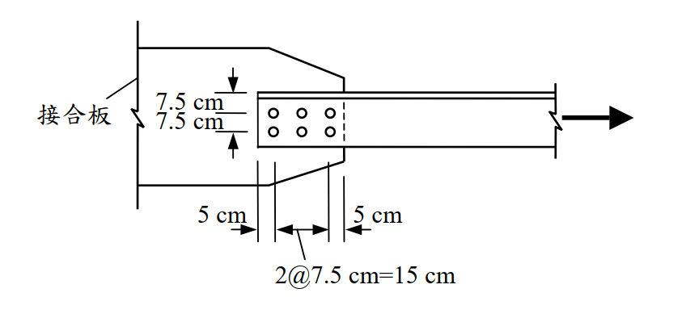
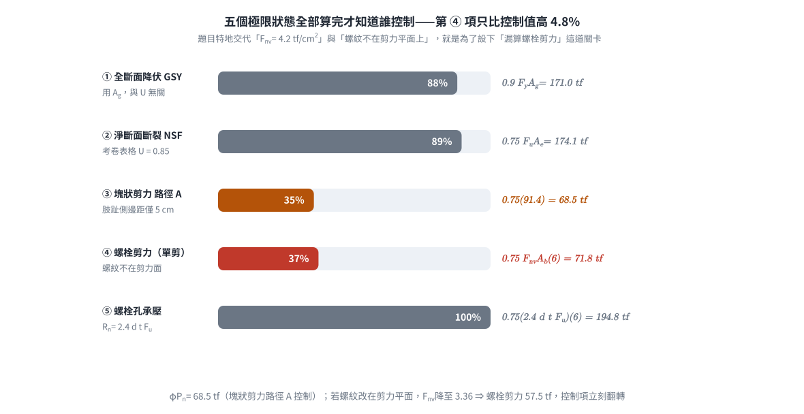

# 考題編號：SS-2005-1

**主分類：** `SS-U1-1` 拉力及壓力桿件
**副分類：** `SS-U1-4` 接合之分析與設計
**設計法：** LRFD
**標籤：** `拉力桿件` `剪力遲滯` `U值` `淨斷面斷裂` `塊狀剪力` `螺栓接合` `等肢角鋼` `有效淨面積` `螺栓剪力` `螺栓承壓`

---

## 1. 原始題目重述

如圖所示為一**單角鋼**與鋼板以螺栓之接合。角鋼為 **L200×200×20（mm）**，鋼材 $F_y = 2.5$ tf/cm²、$F_u = 4.1$ tf/cm²。**承壓型螺栓直徑為 22 mm，螺栓標稱剪力強度為 4.2 tf/cm²，螺紋不在剪力平面上**，螺栓孔直徑為 23.5 mm。試依**極限設計法規範**，**假設接合板強度足夠**，計算角鋼能承受之**設計拉力強度 $\phi P_n$**。（25 分）

**參考資料（考卷提供）：**

| 情況 | 適用條件 | $U$ |
|:---:|:---|:---:|
| 1 | 翼板寬度與斷面深度之比不小於 2/3 之 W、H、S 或 I 型鋼（及由此類型鋼切割或符合前述尺度需求之銲接 T 型鋼），且接合須在翼板處；若以螺栓接合則接合處沿應力方向每行螺栓數不少於 3 根 | 0.90 |
| 2 | 不合於上款之 W、H、S、I 或 T 型鋼，及包括組合斷面之其他各種斷面。若以螺栓接合則接合處沿應力方向每行螺栓數不少於 3 根 | 0.85 |
| 3 | 以螺栓接合之所有各種斷面且在接合處沿應力方向每行僅有 2 根螺栓 | 0.75 |

螺栓孔承壓強度 $\phi R_n$，採用 $R_n = 2.4dtF_u$

**螺栓幾何（由圖判讀）：**

- **6 顆螺栓 = 2 行（橫向，垂直載重）× 3 列（縱向，沿載重方向）**
- 橫向（沿肢寬 20 cm 方向，自角鋼**背（heel）**量起）：$7.5$ cm → 第 1 行；$+7.5$ cm → 第 2 行；剩 $5$ cm 至**肢趾（toe）**
- 縱向（沿載重方向）：端距 $e = 5$ cm，列距 $s = 7.5$ cm × 2，接合長度 $L_{conn} = 2s = 15$ cm



*圖說：角鋼以**單一肢**（圖中水平肢，寬 20 cm、厚 2 cm）搭接於接合板，接合板為左側之梯形板。螺栓配置為 **2 行 × 3 列共 6 顆**，行距（橫向、垂直於載重）7.5 cm，列距（縱向、沿載重）7.5 cm，端距 5 cm。角鋼的**未連接肢（外伸肢）位於圖上緣**（以細雙線表示），故橫向尺寸自角鋼背（heel，上緣）量起為 7.5 cm 至第 1 行、再 7.5 cm 至第 2 行，第 2 行至**肢趾（toe，下緣自由邊）剩 5 cm**。角鋼向右受拉力，螺栓為**單剪**（角鋼僅單面搭接一片接合板）。*

---

## 2. 考題核心精神與出題者意圖

本題測驗 **LRFD 螺栓接合拉力構件的「五個極限狀態」全套檢核**，且刻意布置成「非最明顯者控制」：

1. **剪力遲滯係數 $U$**：單角鋼僅一肢連接，強制 $U < 1$
2. **五個極限狀態**：全斷面降伏（GSY）／有效淨斷面斷裂（NSF）／**塊狀剪力（BSR）**／**螺栓剪力**／螺栓孔承壓

> **出題者的兩個伏筆：**
> ① 題目特地給了「**螺栓標稱剪力強度 4.2 tf/cm²**」與「**螺紋不在剪力平面上**」——這兩項**只有算螺栓剪力才會用到**。
> 若解答裡沒出現 $\phi R_n = 0.75 F_{nv} A_b n$，就是漏了一個極限狀態（本題該值 71.8 tf，與控制值只差 5%！）。
> ② 肢趾側的邊距只有 5 cm（比肢背側的 7.5 cm 小），塊狀剪力的拉力面因此很小 → BSR 成為控制項（68.5 tf），
> 只有全斷面降伏（171 tf）的 40%。

---

## 3. 解題戰略地圖與陷阱分析

**作戰計畫：**
```
Step 1  角鋼斷面性質：Ag、x̄
Step 2  U 值（依考卷表格；並與最新規範公式對照）
Step 3  ① GSY：φtPn = 0.9 Fy Ag
Step 4  ② NSF：An → Ae = U·An → φtPn = 0.75 Fu Ae
Step 5  ③ BSR：分別檢核肢趾側／肢背側／兩行之間三條破壞路徑
Step 6  ④ 螺栓剪力：φRn = 0.75 × Fnv × Ab × 6（單剪）  ← 別漏
Step 7  ⑤ 螺栓孔承壓：φRn = 0.75 × 2.4dtFu × 6
Step 8  取五者最小值
```

**陷阱分析：**

| 陷阱 | 說明 | 應對策略 |
|:---|:---|:---|
| ⚠️ **漏算螺栓剪力** | 題目給 $F_{nv} = 4.2$ tf/cm² 與「螺紋不在剪力平面」就是要你算；本題 71.8 tf，與控制值 68.5 tf 僅差 4.8% | 五個極限狀態逐一列表，缺一不可 |
| ⚠️ 單剪 vs 雙剪 | 角鋼只搭接**一片**接合板 → **單剪**（1 個剪力面）。誤判雙剪會把螺栓剪力翻倍成 143.7 tf，直接漏掉這個近控制項 | 數接合板片數 |
| ⚠️ 混淆 $U$ 值適用款次 | $U = 0.90$ 只適用 W／H／S／I／T 型鋼**翼板**連接，**不適用角鋼** | 角鋼屬「其他各種斷面」，每行 ≥ 3 顆 → 情況 2，$U = 0.85$ |
| ⚠️ 淨面積扣孔數 | 臨界橫斷面上有 **2 個**孔（2 行），非 6 個 | $A_n = A_g - 2 d_h t$ |
| ⚠️ BSR 路徑選錯邊 | 肢趾側邊距 5 cm < 肢背側 7.5 cm，**小的那邊控制**；且肢背側破壞須連帶剪斷外伸肢，實務上不會發生 | 三條路徑都算，並說明肢背側路徑為何不成立 |
| ⚠️ $U$ 只影響 NSF | 全斷面降伏用 $A_g$（無 $U$），斷裂才用 $A_e = UA_n$ | 分開記 |

## 3.5 變數層次分析（Variable Hierarchy Analysis）

> 複習提示：解題後，在每個卡住的知識點「卡關?」欄標記 `⚠`；第二次複習時只看有 `⚠` 的項目。

**最終目標：** LRFD 螺栓接合單角鋼拉力構件 → 五個極限狀態（GSY／NSF／BSR／螺栓剪力／螺栓承壓）取最小值

### 主要公式（$\boxed{\phantom{x}}$ = 未知，待推導）

$$\text{① GSY:}\quad \phi_t P_n = 0.9\,F_y\,A_g$$

$$\text{② NSF:}\quad \boxed{A_n} = A_g - 2 d_h t,\quad \boxed{A_e} = U\,\boxed{A_n},\quad \phi_t P_n = 0.75\,F_u\,\boxed{A_e}$$

$$\text{③ BSR:}\quad \boxed{R_n} = 0.6F_uA_{nv} + U_{bs}F_uA_{nt} \le 0.6F_yA_{gv} + U_{bs}F_uA_{nt},\quad \phi = 0.75$$

$$\text{④ 螺栓剪力:}\quad \boxed{A_b} = \frac{\pi d_b^2}{4},\quad \phi R_n = 0.75\,F_{nv}\,\boxed{A_b}\,n\quad(n = 6,\ \text{單剪})$$

$$\text{⑤ 承壓:}\quad \phi R_n = 0.75\,(2.4\,d_b\,t\,F_u)\,n$$

$$\boxed{\phi P_n} = \min\left(①,②,③,④,⑤\right)$$

### L1：題目直接給定

_看到題目就能讀出的數字，不需要任何公式。_

| 符號 | 數值 | 說明 |
|:---:|:---|:---|
| 斷面 | L200×200×20 mm | 等肢單角鋼，$t = 2.0$ cm |
| $F_y$ | 2.5 tf/cm² | 降伏應力 |
| $F_u$ | 4.1 tf/cm² | 抗拉強度 |
| $d_b$ | 22 mm = 2.2 cm | 螺栓直徑（承壓型） |
| $F_{nv}$ | 4.2 tf/cm² | 螺栓標稱剪力強度（螺紋**不在**剪力平面） |
| $d_h$ | 23.5 mm = 2.35 cm | 螺栓孔徑 |
| 螺栓數 | 6 顆（2 行 × 3 列） | 單剪 |
| 行距（橫向） | 7.5 cm | 兩行間距 |
| 邊距（自肢背） | 7.5 cm | 至第 1 行 |
| 邊距（至肢趾） | 5 cm | 第 2 行至自由邊 |
| 列距 $s$ | 7.5 cm | 沿載重方向 |
| 端距 $e$ | 5 cm | 至角鋼端 |
| 接合方式 | 僅通過一肢 | 需考慮剪力遲滯 |
| 接合板 | 強度足夠（題目假設） | 不需檢核接合板 |

### L2：需知識點推導

_需要知道公式名稱與適用條件，套入 L1 即可算出。_

**Step 1：角鋼斷面性質**

| 符號 | 公式／來源 | 卡關? |
|:---:|:---|:---|
| $A_g$ | $(200+200-20)\times20 = 7600$ mm² $= 76.0$ cm² | |
| $\bar x$ | 兩矩形分割求形心距肢背 $= 5.74$ cm（型鋼表 5.67 cm） | |
| $L_{conn}$ | $2s = 15$ cm（沿載重方向的接合長度） | |

**Step 2：剪力遲滯係數 $U$**

| 符號 | 公式／來源 | 卡關? |
|:---:|:---|:---|
| 考卷表格值 | 角鋼＝「其他各種斷面」、每行 3 顆 ≥ 3 → 情況 2 → $U = 0.85$ | |
| 最新規範公式 | $U = 1-\bar x/L_{conn} = 1-5.74/15 = 0.617$（AISC Table D3.1 Case 2） | |
| 最新規範單角鋼專款 | 每行 3 顆 → $U = 0.60$（Case 8）；取兩者較大 → 0.617 | |

**Step 3：① 全斷面降伏 GSY**

| 符號 | 公式／來源 | 卡關? |
|:---:|:---|:---|
| $\phi_t P_n$ | $0.9 \times 2.5 \times 76.0 = 171.0$ tf | |

**Step 4：② 有效淨斷面斷裂 NSF**

| 符號 | 公式／來源 | 卡關? |
|:---:|:---|:---|
| $A_n$ | $76.0 - 2(2.35)(2.0) = 66.6$ cm² | |
| $A_e$（考卷 $U=0.85$） | $0.85 \times 66.6 = 56.61$ cm² | |
| $\phi_t P_n$ | $0.75 \times 4.1 \times 56.61 = 174.1$ tf | |

**Step 5：③ 塊狀剪力 BSR（三條路徑）**

| 符號 | 公式／來源 | 卡關? |
|:---:|:---|:---|
| 剪切長度 | $e + 2s = 5+15 = 20$ cm | |
| $A_{gv}$（每面） | $20 \times 2.0 = 40$ cm² | |
| $A_{nv}$（每面） | $[20 - 2.5(2.35)] \times 2.0 = 28.25$ cm²（扣 2.5 孔） | |
| 路徑 A（肢趾側 5 cm）**控制** | $A_{nt} = (5-0.5\times2.35)(2.0) = 7.65$ cm² → $\phi R_n = 68.5$ tf | |
| 路徑 B（肢背側 7.5 cm） | $A_{nt} = 12.65$ cm² → $\phi R_n = 83.9$ tf（且須剪斷外伸肢，實務不發生） | |
| 路徑 C（兩行之間 7.5 cm，雙剪面） | $A_{nt} = 10.3$ cm² → $\phi R_n = 121.7$ tf | |

**Step 6：④ 螺栓剪力（單剪）**

| 符號 | 公式／來源 | 卡關? |
|:---:|:---|:---|
| $A_b$ | $\pi(2.2)^2/4 = 3.801$ cm² | |
| 每顆 $\phi R_n$ | $0.75 \times 4.2 \times 3.801 = 11.97$ tf | |
| 6 顆合計 | $6 \times 11.97 = 71.8$ tf | |

**Step 7：⑤ 螺栓孔承壓**

| 符號 | 公式／來源 | 卡關? |
|:---:|:---|:---|
| 每顆 $R_n$ | $2.4 d_b t F_u = 2.4(2.2)(2.0)(4.1) = 43.3$ tf | |
| 每顆 $\phi R_n$ | $0.75 \times 43.3 = 32.5$ tf | |
| 6 顆合計 | $194.8$ tf | |

### L3：深層知識（不懂就卡住）

| 知識點 | 說明 | 補強頁 | 卡關? |
|:---|:---|:---:|:---|
| 剪力遲滯係數 $U$ 的款次判定 | W／H／S／I／T 翼板連接 $U=0.90$；其他斷面（含角鋼）每行≥3 顆 $U=0.85$；每行僅 2 顆 $U=0.75$ | [[shear-lag-u]] · [[SHEAR-LAG]] | |
| $U$ 只影響淨斷面斷裂 | 全斷面降伏用 $A_g$（無 $U$）；斷裂用 $A_e = UA_n$ | | |
| 塊狀剪力的上限式 | $0.6F_yA_{gv}$（剪力面降伏）＋$F_uA_{nt}$（拉力面斷裂）為上限，取與 $0.6F_uA_{nv}+F_uA_{nt}$ 之較小值 | [[block-shear]] · [[BLOCK-SHEAR-RUPTURE]] | |
| 塊狀剪力扣孔的 2.5 顆慣例 | 剪力面通過 3 個孔，末端孔只切到一半 → 扣 $2.5 d_h$ | [[block-shear]] | |
| 肢背側 BSR 路徑為何不成立 | 肢背是折角、外伸肢仍相連，該路徑要同時剪斷外伸肢，容量遠高於算式值 → 實際由肢趾側控制 | | |
| 螺栓剪力面數判定 | 單面搭接一片接合板 → 單剪（$n$ 個剪力面 = 螺栓數）；夾在兩片板中 → 雙剪（$2n$） | | |
| 螺紋在／不在剪力平面 | 不在剪力平面（X 型）用全桿身面積 $A_b$；在剪力平面（N 型）標稱剪力強度約降至 0.8 倍 | | |

---

## 4. 步驟化詳細計算過程

### 4.1 角鋼斷面性質

**L200×200×20 mm（等肢角鋼）：**

$$A_g = (200 + 200 - 20) \times 20 = 380 \times 20 = 7600\ \text{mm}^2 = 76.0\ \text{cm}^2$$

**形心距離 $\bar{x}$**（距角鋼背面）：以肢背為原點，分為兩矩形

- 水平肢：$A_1 = 200 \times 20 = 4000$ mm²，$x_1 = 100$ mm
- 垂直肢（扣除重疊）：$A_2 = 180 \times 20 = 3600$ mm²，$x_2 = 10$ mm

$$\bar{x} = \frac{4000(100) + 3600(10)}{7600} = \frac{436{,}000}{7600} = 57.4\ \text{mm} = 5.74\ \text{cm}$$

*（型鋼規格表值 $C_x = 5.67$ cm，含圓角；差異 1.2%，不影響結論。）*

---

### 4.2 剪力遲滯係數 $U$

**依考卷提供之表格（＝台灣現行極限設計法規範 §4.3）：**

角鋼不屬 W／H／S／I／T 型鋼，歸入情況 2「包括組合斷面之其他各種斷面」；接合處沿應力方向**每行 3 根**螺栓（$\ge 3$）：

$$\boxed{U = 0.85}$$

**依最新規範（AISC 360-16／-22 Table D3.1）之對照：**

| 條款 | 規定 | 本題值 |
|:---|:---|:---:|
| Case 2 | $U = 1 - \bar x / l$，$l$ = 接合長度 | $1 - 5.74/15 = 0.617$ |
| Case 8（單角鋼專款） | 每行 4 顆以上 $U = 0.80$；**每行 3 顆 $U = 0.60$** | 0.60 |
| 取用 | 兩者取較大 | **0.617** |

> ⚠️ 最新規範的 $U = 0.617$ 比考卷表格的 0.85 **嚴格得多**（$A_e$ 少 27%）。所幸本題 NSF 兩者皆不控制（見 4.7），
> 故最終答案不變。**考場請照考卷給的表格取 $U = 0.85$**；本對照僅供理解規範演進方向。

---

### 4.3 極限狀態①：全斷面降伏（Gross Section Yielding, GSY）

$$\phi_t P_n = 0.9 \times F_y \times A_g = 0.9 \times 2.5 \times 76.0 = \boxed{171.0\ \text{tf}}$$

---

### 4.4 極限狀態②：淨斷面斷裂（Net Section Fracture, NSF）

**淨斷面積**（臨界橫斷面上有 **2 個**螺栓孔，即 2 行螺栓同時被截到）：

$$A_n = A_g - 2 d_h t = 76.0 - 2(2.35)(2.0) = 76.0 - 9.4 = 66.6\ \text{cm}^2$$

**有效淨斷面積與強度（$U = 0.85$）：**

$$A_e = U A_n = 0.85 \times 66.6 = 56.61\ \text{cm}^2$$

$$\phi_t P_n = 0.75 \times F_u \times A_e = 0.75 \times 4.1 \times 56.61 = \boxed{174.1\ \text{tf}}$$

*（若依最新規範 $U = 0.617$：$A_e = 41.1$ cm²，$\phi_t P_n = 126.4$ tf——仍不控制。）*

---

### 4.5 極限狀態③：塊狀剪力破壞（Block Shear Rupture, BSR）

$$R_n = 0.6F_u A_{nv} + U_{bs} F_u A_{nt} \le 0.6F_y A_{gv} + U_{bs} F_u A_{nt},\qquad \phi = 0.75,\ U_{bs} = 1.0$$

**幾何（連接肢寬 20 cm、厚 2 cm）：**

| 位置 | 距肢背（heel） | 距肢趾（toe） |
|:---|:---:|:---:|
| 第 1 行 | 7.5 cm | 12.5 cm |
| 第 2 行 | 15.0 cm | **5.0 cm** |

縱向剪切長度（自角鋼端至最遠螺栓）：$L_{sh} = e + 2s = 5 + 7.5 + 7.5 = 20$ cm

每一剪力面：$A_{gv} = 20 \times 2.0 = 40$ cm²；$A_{nv} = [20 - 2.5(2.35)] \times 2.0 = 28.25$ cm²


*圖 2　把三條塊狀剪力路徑畫在同一張幾何上：剪力面（紫）永遠是自角鋼端到最遠螺栓的 20 cm，差別只在拉力面（紅）落在哪一段寬度。肢趾側只剩 5 cm，拉力面積最小，故路徑 A 控制。**攔錯：** 只算一條路徑、或把拉力面畫到邊距較大的肢背側，答案會從 68.5 tf 變成 83.9 tf。*


---

**路徑 A：沿第 2 行剪出 ＋ 拉裂至肢趾（拉力寬 5.0 cm）** ← **控制**

$$A_{nt} = (5.0 - 0.5 \times 2.35)(2.0) = 3.825 \times 2.0 = 7.65\ \text{cm}^2$$

$$R_n = 0.6(4.1)(28.25) + 1.0(4.1)(7.65) = 69.5 + 31.4 = 100.9\ \text{tf}$$

$$\text{上限} = 0.6(2.5)(40) + 4.1(7.65) = 60.0 + 31.4 = 91.4\ \text{tf}\ \leftarrow\ \text{控制}$$

$$\phi R_n^{A} = 0.75 \times 91.4 = \boxed{68.5\ \text{tf}}\ \leftarrow\ \textbf{五個極限狀態中最小}$$

---

**路徑 B：沿第 1 行剪出 ＋ 拉裂至肢背（拉力寬 7.5 cm）**

$$A_{nt} = (7.5 - 0.5 \times 2.35)(2.0) = 12.65\ \text{cm}^2$$

$$R_n = 0.6(4.1)(28.25) + 4.1(12.65) = 69.5 + 51.9 = 121.4\ \text{tf}$$

$$\text{上限} = 0.6(2.5)(40) + 51.9 = 111.9\ \text{tf} \;\Rightarrow\; \phi R_n^{B} = 83.9\ \text{tf}$$

> **註：** 此路徑的破壞面須自肢背（折角處）撕出，實際上還要一併剪斷**未連接的外伸肢**，真實容量遠高於算式值，
> 因此不會控制。列出僅為說明「為何是肢趾側（5 cm）控制」。

---

**路徑 C：兩行同時剪出 ＋ 拉裂行間（拉力寬 7.5 cm，兩個剪力面）**

$$A_{gv} = 2(40) = 80\ \text{cm}^2,\qquad A_{nv} = 2(28.25) = 56.5\ \text{cm}^2$$

$$A_{nt} = (7.5 - 2.35)(2.0) = 10.3\ \text{cm}^2$$

$$R_n = 0.6(4.1)(56.5) + 4.1(10.3) = 139.0 + 42.2 = 181.2\ \text{tf}$$

$$\text{上限} = 0.6(2.5)(80) + 42.2 = 162.2\ \text{tf} \;\Rightarrow\; \phi R_n^{C} = 121.7\ \text{tf}$$

---

### 4.6 極限狀態④：螺栓剪力（本題的第二關鍵，勿漏）

角鋼僅搭接**一片**接合板 $\Rightarrow$ **單剪**，剪力面數 = 螺栓數 = 6。

螺紋**不在**剪力平面上 $\Rightarrow$ 剪力面採**全桿身面積**：

$$A_b = \frac{\pi d_b^2}{4} = \frac{\pi (2.2)^2}{4} = 3.801\ \text{cm}^2$$

每顆螺栓：

$$\phi R_n = \phi F_{nv} A_b = 0.75 \times 4.2 \times 3.801 = 11.97\ \text{tf/bolt}$$

6 顆合計：

$$\boxed{\phi R_n = 6 \times 11.97 = 71.8\ \text{tf}}$$

> ⚠️ 這一項與控制值 68.5 tf 只差 **4.8%**。題目給「$F_{nv} = 4.2$ tf/cm²」與「螺紋不在剪力平面上」
> 就是為了設這道關卡——不算就等於少檢核一個幾乎控制的極限狀態。

---

### 4.7 極限狀態⑤：螺栓孔承壓

依題目給定 $R_n = 2.4 d t F_u$（$t$ 取角鋼厚 2.0 cm）：

$$R_n = 2.4(2.2)(2.0)(4.1) = 43.3\ \text{tf/bolt} \;\Rightarrow\; \phi R_n = 0.75 \times 43.3 = 32.5\ \text{tf/bolt}$$

$$\phi R_{n,\text{total}} = 6 \times 32.5 = \boxed{194.8\ \text{tf}}$$

*（依最新規範 AISC 360-16 J3.10 尚須檢核撕出：端部螺栓 $L_c = 5 - 2.35/2 = 3.825$ cm，
$1.2L_ctF_u = 1.2(3.825)(2.0)(4.1) = 37.6$ tf/bolt $< 43.3$ → 該顆改由撕出控制；
但即使 6 顆全取 37.6 tf，$\phi\sum R_n = 169$ tf 仍遠大於 68.5 tf，不控制。）*

---

### 4.8 設計拉力強度彙整

| 極限狀態 | $\phi P_n$（tf） | 備註 |
|:---|:---:|:---|
| ① 全斷面降伏 GSY | 171.0 | |
| ② 淨斷面斷裂 NSF（$U=0.85$） | 174.1 | 依最新規範 $U=0.617$ 則為 126.4 |
| ③ 塊狀剪力 BSR — 路徑 A（肢趾側） | **68.5** | ← **控制** |
| ③ 塊狀剪力 BSR — 路徑 B（肢背側） | 83.9 | 須連帶剪斷外伸肢，實務不發生 |
| ③ 塊狀剪力 BSR — 路徑 C（行間） | 121.7 | |
| ④ **螺栓剪力（單剪，6 顆）** | **71.8** | ← **僅比控制值高 4.8%** |
| ⑤ 螺栓孔承壓（6 顆） | 194.8 | |

$$\boxed{\phi P_n = 68.5\ \text{tf}\quad\text{（由塊狀剪力 BSR 路徑 A 控制）}}$$



*圖 3　五個極限狀態並排後才看得出：第 ④ 項螺栓剪力（71.8 tf）只比控制值高 4.8%，兩根長條幾乎同高。**攔錯：** 漏算螺栓剪力——題目給的 $F_{nv} = 4.2$ tf/cm² 與「螺紋不在剪力平面上」若沒用到，就是少檢核了一個幾乎控制的極限狀態。*


---

## 5. 關鍵爭議點與進階探討

### 5.1 塊狀剪力主控：只有全斷面降伏的 40%

$$\frac{\phi P_n^{BSR}}{\phi P_n^{GSY}} = \frac{68.5}{171.0} = 0.40$$

原因：

- 接合長度（$e + 2s = 20$ cm）相對角鋼 76 cm² 的斷面積偏短
- **肢趾側邊距僅 5 cm**，拉力破壞面積只有 7.65 cm²，是整條路徑的瓶頸
- 上限式 $0.6F_yA_{gv}$ 控制（剪力面由降伏而非斷裂控制）

**改善順序（效益由大到小）：** ① 把第 2 行往肢趾方向移、拉大 toe 邊距；② 增加列數（拉長 $L_{sh}$）；③ 加大端距 $e$。
注意單純加大螺栓直徑無效——BSR 與 $d_b$ 幾乎無關（只透過 $d_h$ 略微變差）。

### 5.2 螺栓剪力與 BSR 只差 4.8%：這題的「雙瓶頸」

$$\phi R_n^{\text{bolt shear}} = 71.8\ \text{tf} \quad\text{vs}\quad \phi R_n^{BSR} = 68.5\ \text{tf}$$

實務上這是一個「設計得剛好」的接合：兩個機制幾乎同時到達。若螺栓改為**螺紋在剪力平面上**（N 型），
$F_{nv}$ 約降至 $0.8 \times 4.2 = 3.36$ tf/cm²，則

$$\phi R_n = 0.75(3.36)(3.801)(6) = 57.5\ \text{tf} < 68.5\ \text{tf}$$

**控制項就會從塊狀剪力翻轉為螺栓剪力**。這正是題目要交代「螺紋不在剪力平面上」的理由。

### 5.3 $U$ 值：考卷表格 vs 最新規範

| 依據 | $U$ | $A_e$ | $\phi P_n^{NSF}$ |
|:---|:---:|:---:|:---:|
| 考卷表格（台灣現行規範 §4.3 情況 2） | 0.85 | 56.6 cm² | 174.1 tf |
| AISC 360-16／-22 Case 2（$1-\bar x/l$） | 0.617 | 41.1 cm² | 126.4 tf |
| AISC 360-16／-22 Case 8（單角鋼，每行 3 顆） | 0.60 | 40.0 cm² | 122.9 tf |

**規範演進的方向：** 舊表格用「螺栓根數」一刀切給 0.85，過於寬鬆；新規範改為**顯式的偏心距公式** $1-\bar x/l$
並對單角鋼另訂下限（3 顆 0.60、4 顆以上 0.80），能反映「接合越短、偏心越大 → 剪力遲滯越嚴重」的物理。

本題因 BSR 控制，$U$ 的差異不改變答案；但若題目把肢趾邊距加大（BSR 不控制），新舊規範就會給出
174 tf vs 126 tf 的顯著差別。**考場依考卷給的表格作答**，實務設計則應用現行 AISC 條款。

### 5.4 若雙肢均連接，$U$ 可提升至 1.0

若改為背靠背雙角鋼、或以兩片接合板將兩肢均連接，則「所有元件均已連接」，$U = 1.0$：

$$\phi_t P_n^{NSF} = 0.75(4.1)(66.6) = 204.8\ \text{tf} > 171.0\ \text{tf}\ (\text{GSY})$$

此時 NSF 不再控制，且螺栓改為**雙剪**（$\phi R_n = 143.7$ tf），BSR 剪力面也加倍 → 整體容量可逼近全斷面降伏容量。

### 5.5 最新規範對本題其他項目的影響彙整

| 項目 | 考卷／台灣現行規範（99 年版） | AISC 360-16／-22 | 對本題答案的影響 |
|:---|:---|:---|:---|
| $\phi_t$（GSY／NSF） | 0.90／0.75 | 0.90／0.75 | 無變動 |
| $U$（單角鋼） | 表格 0.85 | $\max(1-\bar x/l,\ 0.60) = 0.617$ | NSF 由 174 → 126 tf，仍不控制 |
| 塊狀剪力 | $0.6F_uA_{nv}+U_{bs}F_uA_{nt} \le 0.6F_yA_{gv}+U_{bs}F_uA_{nt}$ | J4.3 條文形式相同 | 無變動 |
| 螺栓剪力 $\phi$ | 0.75 | 0.75 | 無變動 |
| 承壓 | $R_n = 2.4dtF_u$ | $R_n = \min(2.4dtF_u,\ 1.2L_ctF_u)$（-22 版另列撕出） | 端栓由 43.3 → 37.6 tf，仍不控制 |

$\Rightarrow$ **本題最終答案在新舊規範下皆為 $\phi P_n = 68.5$ tf（塊狀剪力控制）。**

*解析完成時間：2026-04-xx*
*修正日期：2026-08-22（補算漏掉的螺栓剪力極限狀態 71.8 tf；修正 BSR 路徑之肢背／肢趾判讀與 $2.4dtF_u = 43.3$ tf 之算術；加入最新規範 $U$ 值對照）*
*圖解補繪：2026-08-29（向量圖，腳本 `gen_SS-2005-1.py`，可重跑）*
*驗證狀態：unverified*
