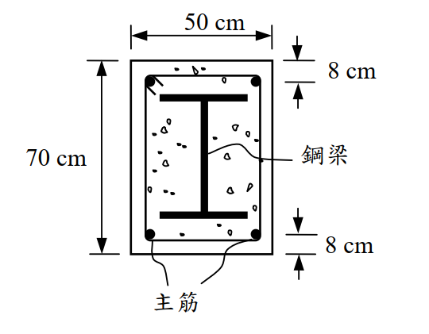

# 考題編號：SS-2005-2

**主分類：** `SS-U1-2` 梁桿件
**副分類：** （無）
**設計法：** LRFD（塑性應力分佈法）
**標籤：** `SRC鋼骨鋼筋混凝土` `塑性應力分佈法` `公稱彎矩強度` `降伏力彙整` `塑性中性軸` `合成斷面`

---

## 1. 原始題目重述

一根 **SRC 鋼骨鋼筋混凝土梁**（Steel Reinforced Concrete），斷面尺寸 **50cm × 70cm**，內含：

- 鋼梁：**H488×300×11×18**（$d \times b_f \times t_w \times t_f$，單位 mm），$F_y = 2.5\ \text{tf/cm}^2$
- 鋼筋：**D32**（$A_b = 8.19\ \text{cm}^2$/支），$F_y = 4200\ \text{kgf/cm}^2 = 4.2\ \text{tf/cm}^2$；共 4 支，上下各 2 支，各距混凝土外緣 8cm（重心距）
- 混凝土：$f'_c = 210\ \text{kgf/cm}^2 = 2.1\ \text{tf/cm}^2$

試：
(一) 列出各組成材料之降伏力（yield force）
(二) 以**塑性應力分佈法（LRFD）**計算公稱彎矩強度 $M_n$ 及設計彎矩強度 $\phi_b M_n$（$\phi_b = 0.9$）

*圖說：矩形混凝土斷面50cm（寬）×70cm（高），H488鋼梁居中（頂部距混凝土頂面10.6cm，底部距底面10.6cm），四角各置1根D32鋼筋，上排筋重心距頂面8cm，下排筋（主筋）重心距底面8cm（即距頂面62cm）。*

---

## 2. 考題核心精神與出題者意圖

本題測驗 **SRC 梁塑性彎矩強度**的計算，核心在於：
1. 理解 SRC 斷面由「混凝土 + 鋼骨 + 鋼筋」三種材料共同承載
2. 正確運用塑性應力分佈法，確定**塑性中性軸（PNA）**位置
3. 計算各組成材料的降伏力，並求力矩和

出題者刻意設置「所有受拉，只有混凝土受壓」的情境（PNA 落在混凝土頂部區域），考驗考生是否能識別此種情況並正確計算。

---

## 3. 解題戰略地圖與陷阱分析

**作戰計畫：**
1. 建立幾何座標系，確認各組成材料的位置
2. 列出各組成材料的降伏力（yield force）
3. 設 PNA 深度為 $c$，建立平衡方程（$\Sigma F = 0$）
4. 解出 $c$，取矩求 $M_n$

**陷阱分析：**

| 陷阱 | 說明 | 應對策略 |
|------|------|---------|
| ⚠️ 鋼骨強度遠大於混凝土 | PNA 可能落在混凝土區域（非鋼梁腹板），勿先假設 PNA 在腹板 | 先假設、後驗證 PNA 位置 |
| ⚠️ 鋼筋是否在受壓區 | 若 PNA < 上排筋位置，上排筋也是受拉，勿扣除混凝土 | 確認 $c$ 後再判斷 |
| ⚠️ 壓力區混凝土強度 | 壓力區取 $0.85f'_c$，非 $f'_c$ | 全程使用 $0.85f'_c = 1.785\ \text{tf/cm}^2$ |

## 3.5 變數層次分析（Variable Hierarchy Analysis）

> 複習提示：解題後，在每個卡住的知識點「卡關?」欄標記 `⚠`；第二次複習時只看有 `⚠` 的項目。

**最終目標：** SRC 梁塑性應力分佈法 → 確定 PNA 位置 → 對 PNA 取矩求 $M_n$

### 主要公式（$\boxed{\phantom{x}}$ = 未知，待推導）

$$\Sigma F_{\text{tension}} = F_y A_{\text{steel}} + F_{y,r} A_{\text{rebar}} \quad \text{（所有鋼骨＋鋼筋均受拉假設）}$$

$$0.85 f'_c \times b \times \boxed{c} = \Sigma F_{\text{tension}} \quad \text{（力平衡求 PNA 深度）}$$

$$\boxed{M_n} = \Sigma F_i \times d_i \quad \text{（各力對 PNA 取矩）}$$

$$\boxed{\phi_b M_n} = 0.9 \times \boxed{M_n}$$

### L1：題目直接給定

| 符號 | 數值 | 說明 |
|------|------|------|
| 斷面尺寸 | 50cm × 70cm | 矩形混凝土斷面 |
| 鋼梁 | H488×300×11×18 | 居中，$F_y = 2.5$ tf/cm² |
| 鋼筋 | D32 × 4（上下各 2） | $A_b = 8.19$ cm²/支，$F_y = 4.2$ tf/cm² |
| $f'_c$ | 210 kgf/cm² = 2.1 tf/cm² | 混凝土強度 |
| 鋼筋位置 | 上排距頂面 8 cm，下排距底面 8 cm | |
| $\phi_b$ | 0.9 | 彎矩折減係數 |

### L2：需知識點推導

**Step 1：各組成材料幾何位置**

| 符號 | 公式 / 來源 | 卡關? |
|------|------------|:-----:|
| 鋼梁頂面距混凝土頂 | $(70-48.8)/2 = 10.6$ cm | |
| 上翼板重心 | $10.6 + 0.9 = 11.5$ cm（距頂） | |
| 腹板重心 | $10.6 + 1.8 + 22.6 = 35.0$ cm（距頂） | |
| 下翼板重心 | $59.4 - 0.9 = 58.5$ cm（距頂） | |
| 下排筋重心 | $70 - 8 = 62.0$ cm（距頂） | |

**Step 2：各組成材料降伏力**

| 符號 | 公式 / 來源 | 卡關? |
|------|------------|:-----:|
| 上翼板 | $30 \times 1.8 \times 2.5 = 135.0$ tf | |
| 腹板 | $1.1 \times 45.2 \times 2.5 = 124.3$ tf（$h_w = 488-36 = 452$ mm） | |
| 下翼板 | $30 \times 1.8 \times 2.5 = 135.0$ tf | |
| 上排筋 | $2 \times 8.19 \times 4.2 = 68.8$ tf | |
| 下排筋 | $2 \times 8.19 \times 4.2 = 68.8$ tf | |
| 合計 | $394.3 + 137.6 = 531.9$ tf | |

**Step 3：PNA 位置（力平衡）**

| 符號 | 公式 / 來源 | 卡關? |
|------|------------|:-----:|
| 壓力 $C$ | $0.85 f'_c \times b \times c = 1.785 \times 50 \times c = 89.25c$ | |
| $c$ | $531.9 / 89.25 = 5.96$ cm（< 8 cm，PNA 在混凝土頂部） | |
| 驗證 | $c = 5.96 < 8.0$ cm（上排筋）→ 所有鋼骨鋼筋均受拉 ✓ | |

**Step 4：對 PNA 取矩求 $M_n$**

| 符號 | 公式 / 來源 | 卡關? |
|------|------------|:-----:|
| 混凝土壓力力矩 | $531.9 \times c/2 = 531.9 \times 2.98 = 1585.1$ tf·cm | |
| 各受拉元素力矩 | $\Sigma F_i \times (y_i - c)$，合計 15447.5 tf·cm | |
| $M_n$ | $1585.1 + 15447.5 = 17032.6$ tf·cm = 170.3 tf·m | |
| $\phi_b M_n$ | $0.9 \times 170.3 = 153.3$ tf·m | |

### L3：深層知識（不懂就卡住）

| 知識點 | 說明 | 補強頁 | 卡關? |
|--------|------|:------:|:-----:|
| SRC 塑性應力分佈法假設 | 鋼骨與鋼筋均達降伏；混凝土壓力區取 $0.85f'_c$（均勻應力塊） | | |
| PNA 確定策略 | 先假設所有鋼骨均受拉，解 $c$，再驗證 $c$ 的位置是否合理 | | |
| 壓力區混凝土強度係數 | 壓力取 $0.85f'_c$，非 $f'_c$；忘乘 0.85 高估壓力容量 | | |
| 上排鋼筋也受拉 | $c < $ 上排筋位置時，上排筋不是受壓，不可套用 RC 壓筋公式 | | |
| 塑性中性軸 vs. 彈性中性軸 | PNA = 面積平分線（與模數無關）；ENA = 各材料面積×彈性模數加權重心 | | |

---

## 4. 步驟化詳細計算過程

### 4.1 幾何位置（以頂面為零點，向下為正）

**H488×300×11×18 鋼梁居中於 70cm 深斷面：**

$$y_{\text{top of steel}} = \frac{70 - 48.8}{2} = 10.6\ \text{cm from top}$$

$$y_{\text{bot of steel}} = 10.6 + 48.8 = 59.4\ \text{cm from top}$$

各組成材料位置：

| 組成材料 | 面積 (cm²) | 重心距頂面 (cm) |
|---------|-----------|--------------|
| 上排鋼筋（2D32） | $2 \times 8.19 = 16.38$ | **8.0** |
| 鋼梁上翼板（$300 \times 18$） | $30 \times 1.8 = 54.0$ | $10.6 + 0.9 = $ **11.5** |
| 鋼梁腹板（$11 \times 452$） | $1.1 \times 45.2 = 49.72$ | $10.6 + 1.8 + 22.6 = $ **35.0** |
| 鋼梁下翼板（$300 \times 18$） | $30 \times 1.8 = 54.0$ | $59.4 - 0.9 = $ **58.5** |
| 下排鋼筋（2D32，主筋） | $2 \times 8.19 = 16.38$ | $70 - 8 = $ **62.0** |

> 腹板高度：$h_w = 488 - 2 \times 18 = 452\ \text{mm} = 45.2\ \text{cm}$

---

### 4.2 各組成材料降伏力（Yield Forces）

**（一）題目要求列出各降伏力：**

| 組成材料 | 面積 (cm²) | 強度 (tf/cm²) | **降伏力 (tf)** |
|---------|-----------|-------------|---------------|
| 混凝土（壓力，$0.85f'_c$） | $50 \times c$（待定） | $1.785$ | $89.25c$ |
| 鋼梁上翼板 | 54.0 | 2.5 | **135.0** |
| 鋼梁腹板 | 49.72 | 2.5 | **124.3** |
| 鋼梁下翼板 | 54.0 | 2.5 | **135.0** |
| 鋼梁小計 $\Sigma F_{steel}$ | **157.72** | 2.5 | **394.3** |
| 上排鋼筋（D32×2） | 16.38 | 4.2 | **68.8** |
| 下排鋼筋（D32×2） | 16.38 | 4.2 | **68.8** |
| **鋼筋合計** | 32.76 | 4.2 | **137.6** |

---

### 4.3 塑性中性軸（PNA）位置

**假設 PNA 位於鋼梁以上的混凝土壓力區（驗證後確認）。**

若所有鋼骨及鋼筋均在 PNA 以下（全斷面受拉）：

$$\text{全體拉力} = F_y A_s + F_{y,r} A_r = 394.3 + 137.6 = 531.9\ \text{tf}$$

令壓力 = 拉力：

$$0.85 f'_c \times b \times c = 531.9\ \text{tf}$$

$$1.785 \times 50 \times c = 531.9$$

$$89.25c = 531.9 \implies \boxed{c = 5.96\ \text{cm}}$$

**驗證：** PNA 在 $c = 5.96\ \text{cm}$ 處，而上排鋼筋在 $8.0\ \text{cm}$，鋼梁頂翼在 $10.6\ \text{cm}$

$$c = 5.96\ \text{cm} < 8.0\ \text{cm} \quad \Rightarrow \quad \text{PNA 在混凝土頂部，所有鋼骨與鋼筋均受拉} \checkmark$$

---

### 4.4 公稱彎矩強度 $M_n$（對 PNA 取矩）

以 PNA（距頂面 $c = 5.96\ \text{cm}$）為力矩中心，計算各力的力矩臂：

**壓力（混凝土）：**
$$C = 531.9\ \text{tf}，\quad \text{作用點} = \frac{c}{2} = 2.98\ \text{cm from top}$$
$$\text{力矩臂} = c - \frac{c}{2} = 2.98\ \text{cm}$$
$$M_C = 531.9 \times 2.98 = 1585.1\ \text{tf·cm}$$

**拉力（各組成材料）：**

| 組成材料 | 力 (tf) | 重心位置 (cm) | 力矩臂 (cm) | 力矩 (tf·cm) |
|---------|--------|------------|-----------|------------|
| 上排鋼筋 | 68.8 | 8.0 | $8.0 - 5.96 = 2.04$ | **140.4** |
| 上翼板 | 135.0 | 11.5 | $11.5 - 5.96 = 5.54$ | **747.9** |
| 腹板 | 124.3 | 35.0 | $35.0 - 5.96 = 29.04$ | **3,610.7** |
| 下翼板 | 135.0 | 58.5 | $58.5 - 5.96 = 52.54$ | **7,092.9** |
| 下排鋼筋 | 68.8 | 62.0 | $62.0 - 5.96 = 56.04$ | **3,855.6** |
| **合計** | | | | **15,447.5** |

$$M_n = 1585.1 + 15447.5 = 17032.6\ \text{tf·cm}$$

$$\boxed{M_n \approx 170.3\ \text{tf·m}}$$

$$\boxed{\phi_b M_n = 0.9 \times 170.3 = 153.3\ \text{tf·m}}$$

---

## 5. 關鍵爭議點與進階探討

### 5.1 PNA 落在混凝土頂區的物理意義

PNA 在距頂面僅 5.96cm 處（位於混凝土頂部，高度尚未及上排鋼筋），表示：
- **整根鋼梁全斷面受拉**（包含上翼板）
- **所有鋼筋全部受拉**
- 只需 5.96cm 厚的混凝土即可平衡所有受拉力

這正是 SRC 梁的特色：鋼骨大幅提升拉力容量，使 PNA 被推到離頂面很近的位置，充分利用混凝土的壓力容量，彎矩臂極大（腹板重心至 PNA 力矩臂達 29cm，下翼板達 52cm）。

### 5.2 上排鋼筋也受拉的意義

PNA（5.96cm）< 上排筋（8cm），上排筋意外處於受拉側。這在 SRC 梁中很常見——若誤以為上排筋受壓而改用「扣除混凝土」的壓力公式，將得到錯誤的平衡方程。

考場安全策略：**先用「全部受拉」假設求 $c$，再驗證各元件確實在 PNA 以下**。

### 5.3 與純鋼梁的比較

若只有鋼梁 H488（$Z_x \approx 3800\ \text{cm}^3$ 估計值）：
$$M_p \approx F_y Z_x = 2.5 \times 3800 = 9500\ \text{tf·cm} = 95.0\ \text{tf·m}$$

SRC 梁的 $M_n = 170.3\ \text{tf·m}$ 約為純鋼梁的 **1.79 倍**，混凝土包覆大幅提升彎矩強度。

### 5.4 鋼筋混凝土僅作為保護層？

有人認為 SRC 梁中混凝土只是防火保護，但本題計算顯示：混凝土壓力貢獻 1585 tf·cm，佔 $M_n$ 的約 9%。更重要的是，混凝土使 PNA 上移，大幅增加了鋼梁各部分的力矩臂，間接提升了整體彎矩容量。
