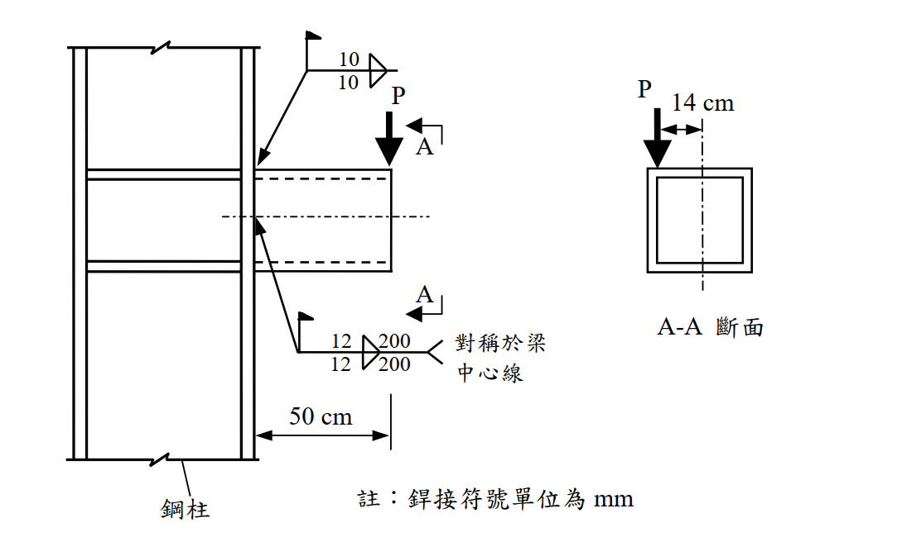

# 考題編號：SS-2005-3

**主分類：** `4.1.4` 接合之分析與設計
**副分類：** （無）
**設計法：** LRFD
**標籤：** `填角銲` `偏心接合` `箱形斷面` `牛腿接合` `銲接群分析` `彎矩剪力接合` `扭矩` `E70XX`

---

## 1. 原始題目重述

一根**方形箱形斷面牛腿（bracket）** 以填角銲連接至鋼柱，承受偏心集中載重 $P = 25\ \text{tf}$。

**材料：**
- 鋼材：$F_y = 2.5\ \text{tf/cm}^2$，$F_u = 4.1\ \text{tf/cm}^2$
- 填角銲：E70XX，$F_{EXX} = 4.9\ \text{tf/cm}^2$

**幾何（依附圖）：**
- 箱形斷面（鋼柱側為 300×300×18×18 mm，即 $b_o = 30\ \text{cm}$，$t = 1.8\ \text{cm}$）
- 牛腿懸臂長度：$L = 50\ \text{cm}$（柱面至載重點）
- 載重偏心：$e = 14\ \text{cm}$（P 距箱形斷面重心軸之水平偏距）
- 銲接：
  - 上翼板：兩道填角銲（各 $w = 10\ \text{mm}$）
  - 下翼板：兩道填角銲，各 $w = 12\ \text{mm}$，$l = 200\ \text{mm}$，對稱於梁中心線

*圖說：鋼柱（左）以填角銲連接箱形斷面牛腿（右），牛腿長50cm，A-A斷面為方形空心箱，P=25tf向下作用於距箱形截面中心線14cm處（水平偏心）。銲接符號單位mm；下排銲縫12mm×200mm，對稱於梁中心線（上下各一道）；上排銲縫10mm。*

---

## 2. 考題核心精神與出題者意圖

本題測驗**偏心銲接群（eccentric weld group）**的設計檢核，包含：
1. 識別牛腿連接的三種內力：剪力（V）、彎矩（M，懸臂）、扭矩（T，偏心）
2. 使用**彈性向量法（elastic vector method）**求銲縫最大應力
3. 對照填角銲設計強度

出題者透過「偏心14cm」製造扭矩，要求考生不能只算 V 和 M，還要考慮 T。

---

## 3. 解題戰略地圖與陷阱分析

**作戰計畫：**
1. 計算柱面連接處的內力（V、M、T）
2. 計算箱形斷面性質（用於扭矩剪力流）
3. 以彈性法求各銲縫單元受力
4. 比對銲縫設計強度

**陷阱分析：**

| 陷阱 | 說明 | 應對策略 |
|------|------|---------|
| ⚠️ 只算 V+M，忘記扭矩 T | 偏心 14cm 造成扭矩，對銲縫有顯著影響 | 三種內力均需納入 |
| ⚠️ 扭矩剪力流方向搞錯 | 扭矩在不同管壁的剪力方向不同，需判別加成或相減 | 選最不利的管壁面 |
| ⚠️ 銲縫有效喉深 | 填角銲強度應乘 0.707w（有效喉深） | $a = 0.707w$ |
| ⚠️ 忘記 $\phi = 0.75$ | LRFD 填角銲折減係數 | $\phi R_{nw} = 0.75 \times 0.6 F_{EXX} \times a$ |

## 3.5 變數層次分析（Variable Hierarchy Analysis）

> 複習提示：解題後，在每個卡住的知識點「卡關?」欄標記 `⚠`；第二次複習時只看有 `⚠` 的項目。

**最終目標：** LRFD 偏心銲接群（箱形牛腿）→ 計算三種內力（V / M / T）→ 彈性向量法求最大銲縫應力 → 判斷銲縫是否足夠

### 主要公式（$\boxed{\phantom{x}}$ = 未知，待推導）

$$V = P = 25\ \text{tf},\quad \boxed{M} = P \times L = 1250\ \text{tf·cm},\quad \boxed{T} = P \times e = 350\ \text{tf·cm}$$

$$\boxed{f_M} = \frac{M \cdot y}{I_w},\quad \boxed{q_T} = \frac{T}{2A_m} \quad \text{（Bredt 扭矩剪力流）}$$

$$\boxed{f_r} = \sqrt{f_M^2 + (f_V + f_T)^2} \leq \phi R_{nw} = 0.75 \times 0.6\,F_{EXX} \times a$$

### L1：題目直接給定

| 符號 | 數值 | 說明 |
|------|------|------|
| $P$ | 25 tf | 偏心集中載重 |
| $L$ | 50 cm | 牛腿懸臂長度 |
| $e$ | 14 cm | 載重距箱形重心水平偏距 |
| $b_o$ | 30 cm，$t$ = 1.8 cm | 箱形斷面外邊長與板厚 |
| $F_{EXX}$ | 4.9 tf/cm² | E70XX 銲條強度 |
| 銲縫 | 下翼板：$w$ = 12 mm，$l$ = 20 cm（兩道） | 上翼板：$w$ = 10 mm |

### L2：需知識點推導

**Step 1：柱面連接處三種內力**

| 符號 | 公式 / 來源 | 卡關? |
|------|------------|:-----:|
| $V$ | $P = 25$ tf | |
| $M$ | $P \times L = 25 \times 50 = 1250$ tf·cm | |
| $T$ | $P \times e = 25 \times 14 = 350$ tf·cm | |

**Step 2：箱形斷面扭矩常數（Bredt 公式）**

| 符號 | 公式 / 來源 | 卡關? |
|------|------------|:-----:|
| $A_m$ | $(b_o - t)^2 = 28.2^2 = 795.2$ cm²（中線圍面積） | |
| $q_T$ | $T / (2A_m) = 350 / 1590.4 = 0.220$ tf/cm | |
| 下翼板扭剪力 | $q_T \times b_o = 0.220 \times 30 = 6.60$ tf | |
| $f_T$ | $6.60 / (\Sigma l) = 6.60/40 = 0.165$ tf/cm | |

**Step 3：銲縫群線形性質**

| 符號 | 公式 / 來源 | 卡關? |
|------|------------|:-----:|
| $\Sigma l$ | $2 \times 20 = 40$ cm | |
| $y$（銲縫至重心） | $b_o/2 - t/2 \approx 15$ cm | |
| $I_w$ | $2 \times l \times y^2 = 2 \times 20 \times 225 = 9000$ cm³ | |

**Step 4：下翼板銲縫應力疊加（最不利）**

| 符號 | 公式 / 來源 | 卡關? |
|------|------------|:-----:|
| $f_M$（垂直，拉力） | $M \cdot y / I_w = 1250 \times 15/9000 = 2.083$ tf/cm | |
| $f_V$（剪力） | $V / \Sigma l = 25/40 = 0.625$ tf/cm | |
| $f_T$（扭剪） | 0.165 tf/cm（同向疊加） | |
| $f_r$ | $\sqrt{2.083^2 + 0.790^2} = 2.228$ tf/cm | |

**Step 5：銲縫設計強度（12 mm）**

| 符號 | 公式 / 來源 | 卡關? |
|------|------------|:-----:|
| $a$ | $0.707 \times 1.2 = 0.848$ cm | |
| $\phi R_{nw}$ | $0.75 \times 0.6 \times 4.9 \times 0.848 = 1.870$ tf/cm | |
| DCR | $2.228 / 1.870 = 1.19 > 1.0$ → 銲縫不足，需加大至 15 mm | |

### L3：深層知識（不懂就卡住）

| 知識點 | 說明 | 補強頁 | 卡關? |
|--------|------|:------:|:-----:|
| 偏心接合三種內力 | 懸臂牛腿必看：剪力 V + 懸臂彎矩 M + 偏心扭矩 T，三者同時存在 | [[eccentric-weld]] | |
| Bredt 公式（閉合箱形扭矩） | $q = T/(2A_m)$，$A_m$ 為中線圍面積；開放斷面不可用此公式 | | |
| 彎矩引發的銲縫力方向 | M 在下翼板產生拉力（開合力，垂直於柱面），與 V/T 的剪力方向正交 | | |
| 合力的向量疊加 | 正交方向的力用勾股定理；同向分量先代數相加再取模 | | |
| 扭矩剪力流方向辨別 | 閉合斷面扭矩剪力流沿閉合路徑循環，需判斷各壁面方向是否與 V 疊加 | | |

---

## 4. 步驟化詳細計算過程

### 4.1 箱形斷面（300×300×18×18 mm）性質

$$b_o = 30\ \text{cm},\quad t = 1.8\ \text{cm},\quad b_i = 30 - 2 \times 1.8 = 26.4\ \text{cm}$$

**斷面積：**
$$A = b_o^2 - b_i^2 = 30^2 - 26.4^2 = 900 - 697.0 = 203.0\ \text{cm}^2$$

**斷面模數（彈性）：**
$$I = \frac{b_o^4 - b_i^4}{12} = \frac{30^4 - 26.4^4}{12} = \frac{810000 - 484716}{12} = \frac{325284}{12} = 27107\ \text{cm}^4$$
$$S = \frac{I}{b_o/2} = \frac{27107}{15} = 1807\ \text{cm}^3$$

**閉合箱形扭矩常數：**

中線圍面積：
$$A_m = (b_o - t)^2 = 28.2^2 = 795.2\ \text{cm}^2$$

Bredt 公式扭轉剪力流：

$$q = \frac{T}{2A_m}$$

---

### 4.2 柱面連接處內力（取 A-A 斷面 = 柱面）

$$\boxed{V = P = 25\ \text{tf}}$$（垂直剪力）

$$\boxed{M = P \times L = 25 \times 50 = 1250\ \text{tf·cm}}$$（懸臂彎矩，對銲縫群水平軸取矩）

$$\boxed{T = P \times e = 25 \times 14 = 350\ \text{tf·cm}}$$（扭矩，偏心 14cm 造成）

---

### 4.3 銲縫群幾何與力矩慣性矩

**銲縫配置（以彈性向量法，將銲縫視為線元素）：**

下翼板（拉力側）：兩道 12mm，各 200mm = 20cm，位於距重心 $\pm y$

若銲縫配置為上、下翼板各一道（對稱於水平中心線）：
$$y = \frac{b_o}{2} - \frac{t}{2} = 15 - 0.9 = 14.1\ \text{cm} \approx 15\ \text{cm}\ (\text{近似取中})$$

**銲縫群對水平軸的線慣性矩（treating welds as unit-throat lines）：**

$$I_w = 2 \times l \times y^2 = 2 \times 20 \times 15^2 = 2 \times 20 \times 225 = 9000\ \text{cm}^3$$

（銲縫長度 $\Sigma l = 2 \times 20 = 40\ \text{cm}$）

---

### 4.4 各內力在下翼板銲縫的應力分量

**① 由 V（垂直剪力）產生之銲縫剪力（平行銲縫方向）：**

$$f_V = \frac{V}{\Sigma l} = \frac{25}{40} = 0.625\ \text{tf/cm（垂直，平行銲縫長方向）}$$

**② 由 M（彎矩）產生之銲縫拉力（垂直銲縫方向，開合力）：**

$$f_M = \frac{M \cdot y}{I_w} = \frac{1250 \times 15}{9000} = 2.083\ \text{tf/cm（拉力，垂直於柱面）}$$

**③ 由 T（扭矩）產生之銲縫剪力（Bredt 剪力流）：**

下翼板銲縫（水平板）受到沿銲縫長方向的剪力流：

$$q_T = \frac{T}{2A_m} = \frac{350}{2 \times 795.2} = \frac{350}{1590.4} = 0.220\ \text{tf/cm}$$

下翼板總扭剪力 = $q_T \times b_o = 0.220 \times 30 = 6.60\ \text{tf}$

$$f_T = \frac{6.60}{40} = 0.165\ \text{tf/cm（水平，平行於銲縫長方向）}$$

---

### 4.5 合力與設計強度比較

**下翼板銲縫（最大受力，拉力側）合力：**

| 方向 | 分量 | 數值 |
|------|------|------|
| 垂直銲縫方向（拉力，開合） | $f_M$ | 2.083 tf/cm |
| 平行銲縫長方向（剪力） | $f_V + f_T$ | $0.625 + 0.165 = 0.790\ \text{tf/cm}$ |

$$f_r = \sqrt{f_M^2 + (f_V + f_T)^2} = \sqrt{2.083^2 + 0.790^2} = \sqrt{4.339 + 0.624} = \sqrt{4.963} = \boxed{2.228\ \text{tf/cm}}$$

**12mm E70XX 填角銲設計強度（LRFD）：**

$$a = 0.707 \times w = 0.707 \times 1.2 = 0.848\ \text{cm}$$

$$\phi R_{nw} = 0.75 \times 0.6 \times F_{EXX} \times a = 0.75 \times 0.6 \times 4.9 \times 0.848 = \boxed{1.870\ \text{tf/cm}}$$

**強度比（DCR）：**

$$DCR = \frac{f_r}{\phi R_{nw}} = \frac{2.228}{1.870} = 1.19 > 1.0$$

$$\boxed{\therefore\ \text{12mm 填角銲不足，需加大銲縫尺寸}}$$

---

### 4.6 所需最小銲縫尺寸

$$w_{req} = w \times DCR = 12 \times 1.19 = 14.3\ \text{mm} \implies \text{採用}\ w = 15\ \text{mm（圓整至標準尺寸）}$$

驗算（15mm，E70XX）：

$$\phi R_{nw} = 0.75 \times 0.6 \times 4.9 \times (0.707 \times 1.5) = 0.75 \times 2.94 \times 1.061 = 2.339\ \text{tf/cm} > 2.228\ \text{tf/cm} \checkmark$$

---

## 5. 關鍵爭議點與進階探討

### 5.1 扭矩貢獻不可忽略

本題中 $f_T = 0.165\ \text{tf/cm}$ 與 $f_V = 0.625\ \text{tf/cm}$ 相加為 0.790 tf/cm，貢獻約 12% 的合力。若忽略扭矩：

$$f_r' = \sqrt{2.083^2 + 0.625^2} = \sqrt{4.339 + 0.391} = \sqrt{4.730} = 2.175\ \text{tf/cm}$$

仍大於 1.870 tf/cm，銲縫仍不足。扭矩使情況更加惡化，不可省略。

### 5.2 彎矩是主控因素

在三種內力中，彎矩（M = 1250 tf·cm）造成的銲縫應力 $f_M = 2.083\ \text{tf/cm}$ 遠大於 $f_V$ 和 $f_T$ 之和，是本題的**主控因素**。減少牛腿長度（L = 50cm）或增加銲縫臂距（加高牛腿截面深度）均可有效改善。

### 5.3 閉合箱形的優勢

相較於開放式斷面（H 型鋼），箱形斷面的 $J$ 極大，扭轉剛度極佳，能有效限制扭轉變形。但閉合的代價是銲接與施工難度提高（全熔透對接銲或多道填角銲）。

### 5.4 上翼板銲縫（10mm）驗算

上翼板為壓力側，由 M 產生壓力：$f_M = 2.083\ \text{tf/cm}$（方向相反）。
10mm 銲縫設計強度：$\phi R_{nw} = 0.75 \times 0.6 \times 4.9 \times 0.707 \times 1.0 = 1.558\ \text{tf/cm}$

若上翼板銲縫亦為 10mm、20cm 長：
$$DCR = 2.228 / 1.558 = 1.43 > 1.0$$

上翼板 10mm 銲縫同樣不足，需加大至 17mm（$\approx$ 18mm）。考量一致性，建議統一採用 16–18mm 銲縫。
