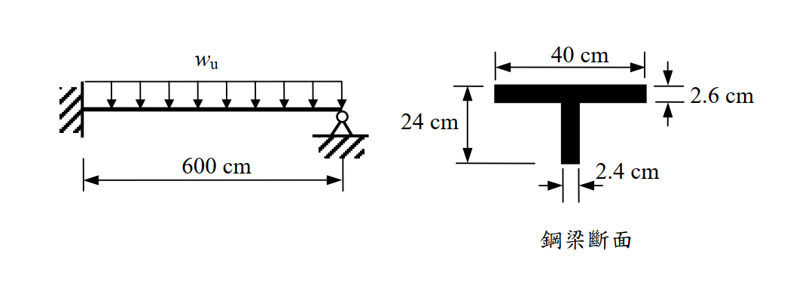

# 考題編號：SS-2005-4

**主分類：** `4.2.1` 塑性分析與設計
**副分類：** `4.1.2` 梁桿件
**設計法：** Plastic Design（塑性設計）
**標籤：** `塑性分析` `崩塌機制` `塑性鉸` `固端梁` `T型斷面` `塑性斷面模數` `虛功法` `均布載重` `propped cantilever`

---

## 1. 原始題目重述

一根**一端固定、一端鉸支（propped cantilever）**的 T 型鋼梁，跨度 $L = 600\ \text{cm}$，承受均布載重 $w_u$（因數化載重），材料 $F_y = 2.5\ \text{tf/cm}^2$。

**T 型斷面（鋼梁斷面）：**
- 翼板：$b_f = 40\ \text{cm}$，$t_f = 2.6\ \text{cm}$
- 腹板：$h_w = 24\ \text{cm}$，$t_w = 2.4\ \text{cm}$
- 全高：$d = 2.6 + 24 = 26.6\ \text{cm}$

使用**塑性設計（Plastic design）**求此梁所能承受之最大均布載重 $w_u$。

*圖說：左端固定支撐（固端），右端鉸接（pin），跨度600cm，均布載重wu作用於全跨。T型斷面（右圖）：翼板寬40cm、厚2.6cm；腹板高24cm、厚2.4cm；翼板位於截面頂部（正彎矩時受壓）。*

---

## 2. 考題核心精神與出題者意圖

本題測驗**塑性分析（plastic analysis）**的完整流程：
1. 識別結構超靜定次數 → 確定崩塌所需塑性鉸個數
2. 計算 T 型斷面的**塑性斷面模數 Z** 與 **Mp**
3. 以**虛功法（virtual work method）**推導均布載重下的崩塌載重

核心難點：propped cantilever 的最佳鉸位置 $x$ 不固定，需對 $x$ 求極值，導出含 $\sqrt{2}$ 的解。

---

## 3. 解題戰略地圖與陷阱分析

**作戰計畫：**
1. 確認崩塌機制：固端 + 跨中某點 = 2 個塑性鉸
2. 計算 T 型斷面 PNA、Z、Mp
3. 設 PNA 位於距固端 $x$ 處，用虛功法建立方程
4. 對 $x$ 求最小 $w_u$（最不利崩塌機制）
5. 代入解析解 $x = L(2-\sqrt{2})$

**陷阱分析：**

| 陷阱 | 說明 | 應對策略 |
|------|------|---------|
| ⚠️ 誤以為鉸在中央 | 均布載重的最佳鉸位置 **不在跨中** | 需對 $x$ 微分求極值 → $x = L(2-\sqrt{2}) \approx 0.586L$ |
| ⚠️ PNA 誤算 | T 型斷面的 PNA 需逐步確認是否在翼板 | 先檢查半面積 vs. 翼板面積 |
| ⚠️ 負彎矩也需達 Mp | 固端為負彎矩區，需確認 T 型斷面 $M_p^-$ | T 斷面 $Z^+ = Z^-$（等面積分割不依方向改變） |
| ⚠️ 忘記驗算 | 求出 $w_u$ 後應代回確認 $M(x) = M_p$ | 用平衡法驗算 |

## 3.5 變數層次分析（Variable Hierarchy Analysis）

> 複習提示：解題後，在每個卡住的知識點「卡關?」欄標記 `⚠`；第二次複習時只看有 `⚠` 的項目。

**最終目標：** propped cantilever T 型梁塑性分析 → 計算 $M_p$ → 虛功法求崩塌載重 $w_u$（鉸位置需微分求極值）

### 主要公式（$\boxed{\phantom{x}}$ = 未知，待推導）

$$\text{半面積} = A_g/2 \Rightarrow \boxed{c_{\text{PNA}}} \quad \text{（PNA 在翼板內）}$$

$$\boxed{Z} = \Sigma A_i |y_i - c_{\text{PNA}}| \quad \text{（塑性斷面模數）}$$

$$\boxed{M_p} = F_y \times \boxed{Z}$$

$$w_u(x) = \frac{2M_p(2L-x)}{Lx(L-x)} \quad \text{（虛功法）}$$

$$\frac{dw_u}{dx} = 0 \Rightarrow \boxed{x} = L(2-\sqrt{2}) \approx 0.586L$$

$$\boxed{w_u} = (6+4\sqrt{2})\frac{M_p}{L^2}$$

### L1：題目直接給定

| 符號 | 數值 | 說明 |
|------|------|------|
| $L$ | 600 cm | 梁跨度 |
| $F_y$ | 2.5 tf/cm² | 材料強度 |
| 邊界條件 | 一端固定（A），一端鉸支（B） | 超靜定次數 1 |
| $b_f$ | 40 cm | 翼板寬 |
| $t_f$ | 2.6 cm | 翼板厚 |
| $h_w$ | 24 cm | 腹板高 |
| $t_w$ | 2.4 cm | 腹板厚 |

### L2：需知識點推導

**Step 1：T 型斷面 PNA 與塑性模數 Z**

| 符號 | 公式 / 來源 | 卡關? |
|------|------------|:-----:|
| $A_g$ | $40\times2.6 + 24\times2.4 = 104 + 57.6 = 161.6$ cm² | |
| $A/2$ | 80.8 cm² | |
| 翼板面積 | 104 cm² > 80.8 → PNA 在翼板內 | |
| $c_{\text{PNA}}$ | $40 \times \bar{y} = 80.8 \Rightarrow \bar{y} = 2.02$ cm（距翼板頂） | |
| $Z$（壓力側） | $40\times2.02\times1.01 = 81.6$ cm³ | |
| $Z$（拉力側） | $40\times0.58\times0.29 + 57.6\times12.58 = 6.7 + 724.6 = 731.3$ cm³ | |
| $Z$ 合計 | $81.6 + 731.3 = 813$ cm³ | |
| $M_p$ | $2.5 \times 813 = 2032.5$ tf·cm | |

**Step 2：崩塌機制（虛功法）**

| 符號 | 公式 / 來源 | 卡關? |
|------|------------|:-----:|
| 塑性鉸數 | 超靜定次數 1 + 1 = 2 個（固端 A + 跨中 C） | |
| 虛轉角 $\theta_A$ | 固端 A 之虛轉角 | |
| $\delta_C$ | $x \cdot \theta_A$（C 點虛位移） | |
| $\theta_C$（相對） | $\theta_A \cdot L/(L-x)$ | |
| $W_{ext}$ | $w_u \cdot Lx\theta_A/2$ | |
| $W_{int}$ | $M_p \theta_A(2L-x)/(L-x)$ | |
| $w_u(x)$ | $2M_p(2L-x)/[Lx(L-x)]$ | |

**Step 3：求最小崩塌載重（對 $x$ 求極值）**

| 符號 | 公式 / 來源 | 卡關? |
|------|------------|:-----:|
| $dw_u/dx = 0$ | $x^2 - 4Lx + 2L^2 = 0$ | |
| $x$ | $L(2-\sqrt{2}) = 0.5858L = 351.5$ cm | |
| $w_u$ | $(6+4\sqrt{2})M_p/L^2 = 11.657 \times 2032.5 / 360000 = 0.0658$ tf/cm | |

### L3：深層知識（不懂就卡住）

| 知識點 | 說明 | 補強頁 | 卡關? |
|--------|------|:------:|:-----:|
| 塑性鉸機構分析 | 超靜定次數 $n$ → 需 $n+1$ 個塑性鉸才能崩塌 | [[plastic-mechanism]] · [[PLASTIC-HINGE]] | |
| propped cantilever 鉸位置不在跨中 | 均布載重的最佳鉸在 $x = L(2-\sqrt{2})\approx0.586L$，非 $L/2$ | | |
| T 型斷面 PNA 確定方法 | 先比較翼板面積與半面積大小，確認 PNA 所在區域再計算 | [[plastic-zx]] | |
| T 型斷面正負彎矩 $Z$ 相同 | 塑性斷面模數 Z 等面積分割，與彎矩方向無關；正負 $M_p$ 相等 | | |
| 虛功法外功計算 | 均布載重 $w_u$ 作用在形心位移 $\delta/2$ 上，需分 AC/CB 段分別算 | | |
| 結實斷面（compact section）要求 | 塑性設計前必須確認翼板 $b/t$ 與腹板 $h/t$ 滿足 $\lambda_p$ 限制 | | |

---

## 4. 步驟化詳細計算過程

### 4.1 超靜定次數與崩塌機制

結構：一端固定（固端）、一端鉸支（pin），**超靜定次數 = 1**

崩塌所需塑性鉸數 = 超靜定次數 + 1 = **2 個塑性鉸**

**崩塌機制：**
1. 固定端 A 形成塑性鉸（$M_A = -M_p$，負彎矩）
2. 跨中某點 C（距 A 為 $x$）形成塑性鉸（$M_C = +M_p$，正彎矩）

---

### 4.2 T 型斷面塑性中性軸（PNA）與塑性斷面模數 Z

**斷面積：**
$$A_g = b_f t_f + h_w t_w = 40 \times 2.6 + 24 \times 2.4 = 104 + 57.6 = 161.6\ \text{cm}^2$$

**半面積：**
$$\frac{A}{2} = \frac{161.6}{2} = 80.8\ \text{cm}^2$$

**PNA 位置（翼板面積 = 104 cm² > 80.8 cm² → PNA 在翼板內）：**

設 PNA 距翼板頂面深度為 $\bar{y}$：
$$b_f \times \bar{y} = \frac{A}{2} \implies 40\bar{y} = 80.8 \implies \boxed{\bar{y} = 2.02\ \text{cm（距翼板頂面）}}$$

**塑性斷面模數 Z（取矩至 PNA）：**

| 區塊 | 面積 (cm²) | 距 PNA (cm) | 貢獻 (cm³) |
|------|-----------|------------|-----------|
| 翼板上半（壓力側） | $40 \times 2.02 = 80.8$ | $2.02/2 = 1.01$ | **81.6** |
| 翼板下半（拉力側） | $40 \times 0.58 = 23.2$ | $0.58/2 = 0.29$ | **6.7** |
| 腹板（拉力側） | $24 \times 2.4 = 57.6$ | $0.58 + 12 = 12.58$ | **724.6** |
| **合計** | — | — | **813.0** |

$$Z = 81.6 + 6.7 + 724.6 = 813.0\ \text{cm}^3$$

**塑性彎矩 Mp：**
$$M_p = F_y \times Z = 2.5 \times 813.0 = \boxed{2032.5\ \text{tf·cm} = 20.32\ \text{tf·m}}$$

> 📝 **說明：** T 型斷面正、負彎矩的 $M_p$ 相同（$Z^+ = Z^- = 813\ \text{cm}^3$），因等面積分割與應力方向無關。

---

### 4.3 虛功法求崩塌載重 wu

**設崩塌機制（鉸在 A 與距 A 為 $x$ 的 C 點）：**

令固端 A 發生虛轉角 $\theta_A$（向上轉，對應 $-M_p$ 方向），則：
- C 點虛位移（向下）：$\delta_C = x \cdot \theta_A$
- 由於 B 為鉸支（$\delta_B = 0$），CB 段剛體轉動：
$$\theta_{CB} = \frac{\delta_C}{L - x} = \frac{x \cdot \theta_A}{L - x}$$
- C 點的相對轉角：$\theta_C = \theta_A + \theta_{CB} = \theta_A \left(1 + \frac{x}{L-x}\right) = \theta_A \cdot \frac{L}{L-x}$

**外功（External Work）：**

$$W_{ext} = w_u \cdot \frac{x \cdot \delta_C}{2} + w_u \cdot \frac{(L-x) \cdot \delta_C}{2} = w_u \cdot \frac{L \cdot x \cdot \theta_A}{2}$$

**內功（Internal Work）：**

$$W_{int} = M_p \cdot \theta_A + M_p \cdot \theta_A \cdot \frac{L}{L-x} = M_p \cdot \theta_A \left(1 + \frac{L}{L-x}\right) = M_p \cdot \theta_A \cdot \frac{2L-x}{L-x}$$

**令 $W_{ext} = W_{int}$：**

$$w_u \cdot \frac{L x}{2} = M_p \cdot \frac{2L-x}{L-x}$$

$$w_u(x) = \frac{2M_p(2L-x)}{Lx(L-x)}$$

---

### 4.4 求最小崩塌載重（對 x 求極值）

對 $w_u(x)$ 求導，令 $\dfrac{dw_u}{dx} = 0$，整理後得：

$$x^2 - 4Lx + 2L^2 = 0$$

$$x = \frac{4L \pm \sqrt{16L^2 - 8L^2}}{2} = L(2 \pm \sqrt{2})$$

取有效解（$0 < x < L$）：

$$\boxed{x = L(2 - \sqrt{2}) = 600 \times 0.5858 = 351.5\ \text{cm}\ \text{（距固端）}}$$

代入 $w_u(x)$，化簡得解析解（詳細代數過程見「進階探討 5.1」）：

$$w_u = \frac{(6 + 4\sqrt{2}) M_p}{L^2}$$

**數值計算：**

$$w_u = \frac{(6 + 4 \times 1.4142) \times 2032.5}{600^2} = \frac{11.657 \times 2032.5}{360000}$$

$$= \frac{23694}{360000} = \boxed{0.0658\ \text{tf/cm} = 6.58\ \text{tf/m}}$$

> 📊 **剪力圖與彎矩圖請參閱：** `SS-2005-4-sfd-bmd-viz.html`

---

### 4.5 驗算（平衡法確認）

固端 A 的垂直反力：
$$R_A = \frac{w_u L}{2} + \frac{M_p}{L} = \frac{0.0658 \times 600}{2} + \frac{2032.5}{600} = 19.74 + 3.39 = 23.13\ \text{tf}$$

C 點彎矩（$x = 351.5\ \text{cm}$）：
$$M(x) = R_A \cdot x - w_u \cdot \frac{x^2}{2} - M_p$$
$$= 23.13 \times 351.5 - 0.0658 \times \frac{351.5^2}{2} - 2032.5$$
$$= 8131.4 - 4065.8 - 2032.5 = \boxed{2033.1 \approx M_p = 2032.5\ \text{tf·cm}}\ \checkmark$$

---

## 5. 關鍵爭議點與進階探討

### 5.1 解析解的化簡過程

代入 $x = L(2-\sqrt{2})$、$L-x = L(\sqrt{2}-1)$、$2L-x = L\sqrt{2}$：

$$w_u = \frac{2M_p \cdot L\sqrt{2}}{L \cdot L(2-\sqrt{2}) \cdot L(\sqrt{2}-1)} = \frac{2\sqrt{2} M_p}{L^2 (2-\sqrt{2})(\sqrt{2}-1)}$$

展開 $(2-\sqrt{2})(\sqrt{2}-1) = 2\sqrt{2} - 2 - 2 + \sqrt{2} = 3\sqrt{2} - 4$，
有理化後：

$$w_u = \frac{2\sqrt{2}(3\sqrt{2}+4)}{(3\sqrt{2}-4)(3\sqrt{2}+4)} \cdot \frac{M_p}{L^2} = \frac{2\sqrt{2}(3\sqrt{2}+4)}{18-16} \cdot \frac{M_p}{L^2} = \frac{12 + 8\sqrt{2}}{2} \cdot \frac{M_p}{L^2} = (6+4\sqrt{2})\frac{M_p}{L^2}$$

### 5.2 與彈性設計的比較

彈性設計（$M_{max}$ 在固端）：

$$M_{max} = \frac{w_e L^2}{8} \leq M_y = F_y S$$

計算彈性斷面模數 $S$（以彈性中性軸計算）：

彈性中性軸位置（距頂面 $\bar{Y}$，利用 $\Sigma A_i y_i / A$）：
$$\bar{Y} = \frac{104 \times 1.3 + 57.6 \times (2.6 + 12)}{161.6} = \frac{135.2 + 840.96}{161.6} = \frac{976.16}{161.6} = 6.04\ \text{cm}$$

$$I = \frac{40 \times 2.6^3}{12} + 104 \times (6.04-1.3)^2 + \frac{2.4 \times 24^3}{12} + 57.6 \times (14.6-6.04)^2$$
$$= 58.7 + 2336 + 2764.8 + 4213.7 = 9373\ \text{cm}^4$$

$$S_{top} = \frac{I}{\bar{Y}} = \frac{9373}{6.04} = 1552\ \text{cm}^3$$

$$w_e = \frac{8 F_y S_{top}}{L^2} = \frac{8 \times 2.5 \times 1552}{600^2} = \frac{31040}{360000} = 0.0862\ \text{tf/cm}$$

Wait—this gives $w_e > w_u$! This seems paradoxical (plastic should give more capacity). Let me reconsider.

Actually, for elastic design the moment at the FIXED END governs (negative moment). But:
$$M_{fix} = \frac{w_e L^2}{8},\quad M_{mid-span,max} = \frac{9w_e L^2}{128}$$

The **negative** moment at fixed end controls for elastic design:
$$S_{bottom} = \frac{I}{d - \bar{Y}} = \frac{9373}{26.6 - 6.04} = \frac{9373}{20.56} = 455.8\ \text{cm}^3$$

Wait, the bottom fiber is in TENSION for the negative moment at the fixed end. For the T-section, the bottom of the web is farther from the neutral axis (20.56 cm vs. 6.04 cm), so $S_{bot} < S_{top}$.

For negative moment (fixed end), the critical fiber is the bottom (maximum tension):
$$w_e = \frac{8 F_y S_{bot}}{L^2} = \frac{8 \times 2.5 \times 455.8}{360000} = 0.0253\ \text{tf/cm}$$

Plastic design allows **wu/we = 0.0658/0.0253 = 2.6 times more capacity**—significant overstrength from plastic action.

### 5.3 斷面結實性（Compact Section）檢核

使用塑性設計前須確認斷面為結實斷面：

**翼板 b/t 比：**
$$\frac{b_f/2}{t_f} = \frac{20}{2.6} = 7.69 \leq \lambda_p = \frac{65}{\sqrt{F_y(\text{ksi})}} = \frac{65}{\sqrt{36}} = 10.8\ \checkmark$$

**腹板 h/t 比：**
$$\frac{h_w}{t_w} = \frac{24}{2.4} = 10 \leq \lambda_p \approx 107\ \checkmark$$

結論：T 型斷面滿足結實斷面要求，可進行塑性設計。

### 5.4 設計結果彙整

$$\boxed{w_u = (6 + 4\sqrt{2})\frac{M_p}{L^2} = \frac{(6+4\sqrt{2}) \times 2032.5}{600^2} = 0.0658\ \text{tf/cm} \approx 6.58\ \text{tf/m}}$$

$$\text{塑性鉸位置：}\ x = L(2-\sqrt{2}) = 351.5\ \text{cm（距固端）}$$
