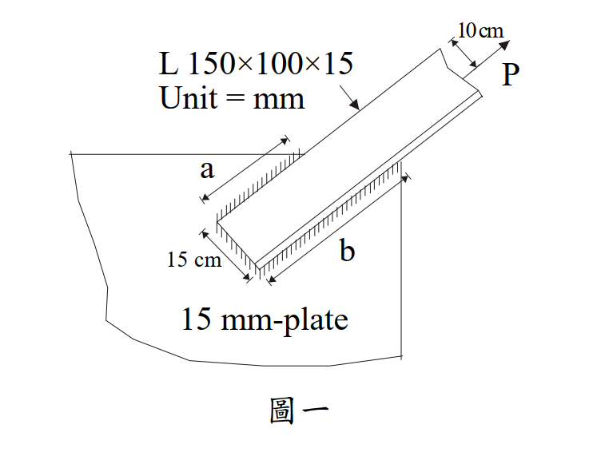

# 考題編號：SS-2007-1

**主分類：** `SS-U1-4` 接合之分析與設計
**副分類：** `SS-U1-1` 拉力及壓力桿件
**設計法：** ASD
**標籤：** `填角銲` `ASD` `偏心接合` `不等肢角鋼` `剪力遲滯` `U值` `拉力桿件` `銲道容許應力`

---

## 1. 原始題目重述

不等肢角鋼 L 150×100×15 mm（長肢為連接肢）以填角銲接至 15 mm 厚鋼板，如圖一所示。力 P 通過角鋼形心，距連接板面 10 cm。

**材料與接合條件：**
- 角鋼：$F_y = 3.5 \text{ tf/cm}^2$，$F_u = 4.8 \text{ tf/cm}^2$
- 連接板：$F_u = 4.9 \text{ tf/cm}^2$（厚 15 mm）
- 填角銲腳尺寸 $w = 1.2 \text{ cm}$
- 銲道 a（長肢背側，靠短肢角落）與銲道 b（長肢趾側），各長 **25 cm**
- 剪力遲滯係數 $U = 0.85$
- P 距連接板面偏心距 $e = 10 \text{ cm}$

*圖說：長肢（150 mm）寬度 = 兩道銲道間距 = 15 cm。銲道 a 在靠短肢角落一側（背側），銲道 b 在長肢自由端（趾側）。力 P 在距板面 10 cm 處施力，通過角鋼形心。*

---

## 2. 考題核心精神與出題者意圖

本題核心考點：
1. **偏心填角銲 ASD 設計**：P 距板面 10 cm，在連接處產生彎矩 $M = P \times 10$，銲道需同時抵抗直接剪力與彎矩引起的垂直分力。
2. **拉力桿件淨斷面驗算**：含剪力遲滯折減（$U = 0.85$）的 ASD 容許拉力。

出題意圖：考生須能在 ASD 框架下合成兩種力分量的向量合，並判斷銲道與母材何者控制容許載重。

---

## 3. 解題戰略地圖與陷阱分析

**解題步驟：**
1. 計算銲道容許強度（喉厚、容許剪應力）
2. 分解偏心載重 → 直接剪力 + 力矩引起的垂直分力
3. 向量合成最不利銲道的合力，求 $P_{allow}$
4. 驗算角鋼淨斷面（Ae = U × An）

**關鍵陷阱：**
1. **力矩臂的計算**：力矩 $M = P \times 10$ 由兩道銲道形成力偶抵抗，力偶臂 = 銲道間距 = 15 cm（非銲道長度）
2. **U 值的用途**：U 只用於淨斷面斷裂（NSF），不影響銲道強度計算
3. **FEXX 取值**：以電銲條與板材 $F_u$ 較小值控制，此題取 $F_u = 4.9 \text{ tf/cm}^2$

---

## 3.5 變數層次分析（Variable Hierarchy Analysis）

> 複習提示：解題後，在每個卡住的知識點「卡關?」欄標記 `⚠`；第二次複習時只看有 `⚠` 的項目。

**最終目標：** 以 ASD 求不等肢角鋼偏心填角銲的容許載重，比較銲道與淨斷面何者控制

### 主要公式（$\boxed{\phantom{x}}$ = 未知，待推導）

$$q_{allow} = 0.3 F_{EXX} \times (0.707w) \quad \text{（每公分填角銲容許力）}$$

$$\boxed{q_b} = \sqrt{q_d^2 + q_m^2} \leq q_{allow}$$

$$q_d = \frac{P}{2L},\quad q_m = \frac{P \cdot e}{d \cdot L} \quad \text{（力偶臂 } d = 15 \text{ cm）}$$

$$\boxed{P_{allow,\text{淨斷面}}} = \min\left(0.6F_y A_g,\ 0.5F_u A_e\right),\quad A_e = U A_n$$

### L1：題目直接給定

| 符號 | 數值 | 說明 |
|------|------|------|
| 角鋼 | L 150×100×15 mm | 長肢 150（連接肢），短肢 100 |
| $w$ | 1.2 cm | 填角銲腳尺寸 |
| $L$（各銲道） | 25 cm | 銲道 a（背側）與 b（趾側）各長 |
| $e$ | 10 cm | P 距連接板面偏心距 |
| $d$（力偶臂） | 15 cm | 兩銲道間距 = 長肢寬度 |
| $F_y$ | 3.5 tf/cm² | 角鋼降伏應力 |
| $F_u$（角鋼） | 4.8 tf/cm² | 角鋼極限應力 |
| $F_u$（板） | 4.9 tf/cm² | 連接板極限應力 |
| $U$ | 0.85 | 剪力遲滯係數 |

### L2：需知識點推導

**Step 1：角鋼毛斷面積與形心**

| 符號 | 公式 / 來源 | 卡關? |
|------|------------|:-----:|
| $A_g$ | $(b_1 + b_2 - t) \times t = 23.5 \times 1.5 = 35.25$ cm² | |
| $\bar{y}$（由趾端） | 加權平均形心 $\approx 9.94$ cm | |

**Step 2：填角銲容許強度**

| 符號 | 公式 / 來源 | 卡關? |
|------|------------|:-----:|
| $F_{EXX}$ | 取 $\min(F_u\text{板}, F_u\text{角鋼}) = 4.9$ tf/cm²（取板材） | |
| $f_v^{allow}$ | $0.3 \times F_{EXX} = 1.47$ tf/cm² | |
| $t_e$（有效喉厚） | $0.707 \times w = 0.707 \times 1.2 = 0.848$ cm | |
| $q_{allow}$ | $1.47 \times 0.848 = 1.246$ tf/cm | |

**Step 3：偏心銲道合力（銲道 b 趾側最不利）**

| 符號 | 公式 / 來源 | 卡關? |
|------|------------|:-----:|
| $q_d$（直接剪力） | $P/(2 \times 25) = P/50$ tf/cm | |
| $q_m$（力矩分力） | $Pe/(d \times L) = 10P/(15 \times 25) = 2P/75$ tf/cm | |
| $q_b$（合力） | $\sqrt{(P/50)^2 + (2P/75)^2} = P/30$ tf/cm | |
| $P_{allow,\text{銲道}}$ | $q_{allow} \times 30 = 1.246 \times 30 = 37.4$ tf | |

**Step 4：角鋼淨斷面容許拉力（ASD）**

| 符號 | 公式 / 來源 | 卡關? |
|------|------------|:-----:|
| $A_n$ | $= A_g = 35.25$ cm²（全銲，無螺栓孔） | |
| $A_e$ | $U \times A_n = 0.85 \times 35.25 = 29.96$ cm² | |
| 全斷面降伏 | $0.6 F_y A_g = 74.0$ tf | |
| 淨斷面斷裂 | $0.5 F_u A_e = 71.9$ tf（控制） | |

### L3：深層知識（不懂就卡住）

| 知識點 | 說明 | 補強頁 | 卡關? |
|--------|------|:------:|:-----:|
| 偏心彎矩力偶臂 | 力偶臂 = 兩銲道間距 = 長肢寬 15 cm（**非**銲道長度 25 cm） | [[eccentric-weld]] | |
| 剪力遲滯 $U$ 值的用途 | $U$ 只用於計算 $A_e = UA_n$（淨斷面斷裂），不影響銲道強度 | [[shear-lag-u]] · [[SHEAR-LAG]] | |
| ASD 淨斷面公式 | 降伏：$0.6F_y A_g$；斷裂：$0.5F_u A_e$，兩者取小值控制 | | |
| 銲道最不利點 | 偏心彎矩使趾側銲道（b）受附加拉力，背側（a）受壓，趾側合力最大 | [[eccentric-weld]] | |

---

## 4. 步驟化詳細計算過程

### Step 1：角鋼毛斷面積

$$A_g = (b_1 + b_2 - t) \times t = (15 + 10 - 1.5) \times 1.5 = 23.5 \times 1.5 = 35.25 \text{ cm}^2$$

### Step 2：角鋼形心位置（沿長肢方向，由趾端量起）

- 長肢矩形板：$A_1 = 15 \times 1.5 = 22.5 \text{ cm}^2$，形心位置 $y_1 = 7.5 \text{ cm}$（由趾端）
- 短肢矩形板（扣除角落重疊）：$A_2 = (10 - 1.5) \times 1.5 = 12.75 \text{ cm}^2$，形心位置 $y_2 = 15 - 0.75 = 14.25 \text{ cm}$（靠背側）

$$\bar{y} = \frac{22.5 \times 7.5 + 12.75 \times 14.25}{35.25} = \frac{168.75 + 181.69}{35.25} \approx 9.94 \text{ cm（由趾端）}$$

（即形心距背側 = $15 - 9.94 = 5.06$ cm）

### Step 3：填角銲容許強度（E70XX 電銲條）

$$f_v^{allow} = 0.3 \times F_{EXX} = 0.3 \times 4.9 = 1.47 \text{ tf/cm}^2$$

有效喉厚：
$$t_e = 0.707 \times w = 0.707 \times 1.2 = 0.848 \text{ cm}$$

每單位長度容許力：
$$q_{allow} = 1.47 \times 0.848 = 1.246 \text{ tf/cm}$$

### Step 4：直接剪力分量

力 P 平均分配至兩道銲道（各長 25 cm）：

$$q_d = \frac{P}{2 \times 25} = \frac{P}{50} \text{ tf/cm}$$

### Step 5：偏心彎矩引起的垂直分力

偏心彎矩 $M = P \times e = 10P$ (tf·cm)，由兩道銲道形成力偶抵抗：

$$q_m = \frac{M}{d \times L} = \frac{10P}{15 \times 25} = \frac{2P}{75} \text{ tf/cm}$$

（銲道 b 趾側受拉，銲道 a 背側受壓）

### Step 6：合力驗算（銲道 b 最不利）

$$q_b = \sqrt{q_d^2 + q_m^2} = \sqrt{\left(\frac{P}{50}\right)^2 + \left(\frac{2P}{75}\right)^2}$$

$$= P\sqrt{\frac{1}{2500} + \frac{4}{5625}} = P\sqrt{\frac{6.25}{5625}} = \frac{P}{30}$$

令 $q_b \leq q_{allow}$：

$$\frac{P}{30} = 1.246 \implies \boxed{P_{allow,\text{銲道}} = 37.4 \text{ tf}}$$

### Step 7：角鋼淨斷面強度（ASD）

無螺栓孔（全銲接），$A_n = A_g = 35.25 \text{ cm}^2$

有效淨斷面積（剪力遲滯折減）：
$$A_e = U \times A_n = 0.85 \times 35.25 = 29.96 \text{ cm}^2$$

ASD 容許拉力：

① 全斷面降伏：
$$P_{allow} = 0.6 F_y A_g = 0.6 \times 3.5 \times 35.25 = 74.0 \text{ tf}$$

② 淨斷面斷裂：
$$P_{allow} = 0.5 F_u A_e = 0.5 \times 4.8 \times 29.96 = 71.9 \text{ tf}$$

淨斷面斷裂控制：$P_{allow,\text{角鋼}} = 71.9$ tf

### 結論彙整

| 破壞模式 | 容許載重 |
|---------|---------|
| 填角銲（含偏心彎矩） | **37.4 tf** ← 控制 |
| 角鋼淨斷面斷裂（U=0.85）| 71.9 tf |
| 角鋼全斷面降伏 | 74.0 tf |

$$\boxed{P_{allow} = 37.4 \text{ tf（銲道強度控制）}}$$

---

## 5. 關鍵爭議點與進階探討

**爭議點：平衡銲道設計（消除形心偏心）**

本題兩道銲道等長（各 25 cm），但角鋼形心在趾端 9.94 cm（不在銲道群中點 7.5 cm）。為消除 in-plane 偏心，應採不等長設計：

$$L_a : L_b = \bar{y}_{趾端} : (15 - \bar{y}_{趾端}) = 9.94 : 5.06 \approx 2 : 1$$

等長設計產生的形心偏心量 = $9.94 - 7.5 = 2.44$ cm，由 U = 0.85 (shear lag) 間接反映於淨斷面強度中。

**考場建議：**
題目直接給出 U = 0.85 時，直接套用 $A_e = U \times A_n$ 即可，不需另外計算 U 值；偏心彎矩（10 cm）須額外計入銲道合力中，不可忽略。
