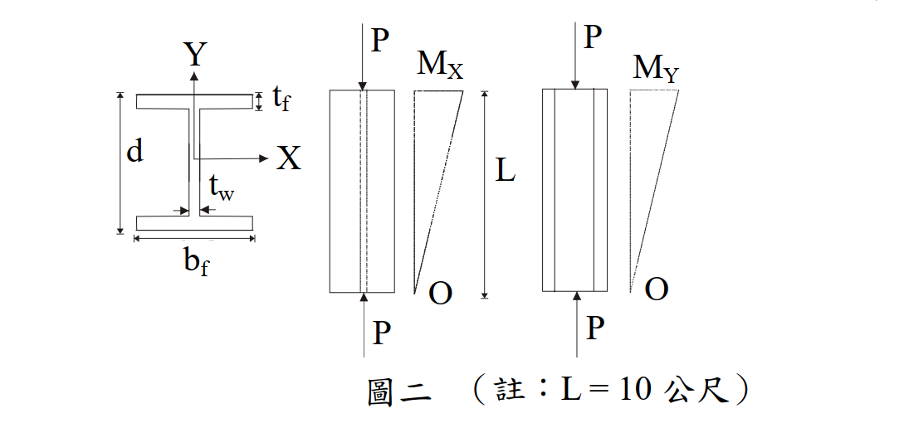

# 考題編號：SS-2007-2

**主分類：** `SS-U1-3` 梁柱桿件
**副分類：** 無
**設計法：** ASD
**標籤：** `梁柱桿件` `ASD` `雙軸彎矩` `LTB側扭挫屈` `Cm放大係數` `F'e歐拉應力` `彈性挫屈` `互制方程式`

---

## 1. 原始題目重述

H 500×300×15×20（$d \times b_f \times t_w \times t_f$，單位 mm）鋼柱，兩端鉸接（K=1），承受下列組合載重，以 ASD 驗算是否滿足規範要求：

**設計載重：**
- 軸壓力：$P = 40$ tf
- 強軸彎矩：$M_x = 20$ m-tf（= 2000 tf·cm）
- 弱軸彎矩：$M_y = 10$ m-tf（= 1000 tf·cm）
- 柱長：$L = 10$ m = 1000 cm

**材料：** $F_y = 3.5 \text{ tf/cm}^2$，$F_u = 5 \text{ tf/cm}^2$，$E = 2040 \text{ tf/cm}^2$

**斷面性質（題目提供）：**

| 性質 | 數值 |
|------|------|
| $A$ | 189 cm² |
| $r_x$ | 20.74 cm |
| $r_y$ | 6.91 cm |
| $r_T$ | 7.94 cm |
| $S_x$ | 3253 cm³ |
| $S_y$ | 600 cm³ |
| $I_x$ | 81327 cm⁴ |
| $I_y$ | 9012 cm⁴ |

**附圖：**

*圖說：梁柱兩端受軸壓力 P = 40 tf；彎矩 Mx 與 My 均為線性分布，一端為最大值，另一端為零（M1 = 0，M2 = Mx 或 My）。L = 10 m（公尺）。*

**設計參數：**
$$C_m = 0.6 - 0.4(M_1/M_2) \quad;\quad C_b = 1.75 + 1.05(M_1/M_2) + 0.3(M_1/M_2)^2 \leq 2.3$$

---

## 2. 考題核心精神與出題者意圖

本題核心：**ASD 雙軸彎矩梁柱桿件完整驗算流程**。

關鍵難點：
1. 弱軸細長比 $KL/r_y = 144.7 > C_c = 107.3$，進入**彈性挫屈**區段 → $F_a$ 很小，且 $F'_{ey} = F_a$，使放大係數 $1/(1-f_a/F'_{ey})$ 顯著放大弱軸彎矩效應
2. 強軸 LTB（L/rT 落在非彈性 LTB 範圍）→ Fbx 需以公式計算，不能直接用 0.66Fy
3. 判斷 fa/Fa ≥ 0.15 → 必須用 Equation (2) 含放大係數

---

## 3. 解題戰略地圖與陷阱分析

**解題步驟：**
1. 計算實際應力 fa、fbx、fby
2. 計算 Cc 並比對 KL/r，確認 Fa（弱軸彈性挫屈控制）
3. 計算 Fbx（需考慮 LTB，兩公式取大）
4. 確認 Fby（弱軸彎曲，結實斷面 = 0.75Fy）
5. 判斷 fa/Fa 是否 ≥ 0.15，選用 Equation (2)
6. 代入兩個互制方程式驗算

**關鍵陷阱：**
1. **F'ey ≠ Euler 公式**：當弱軸為彈性挫屈時，$F'_{ey} = F_a$（與 Fa 計算式相同），而非另外算一個 Euler 值
2. **兩個互制方程式都要查**：Equation (2) 和 Equation (3) 均不得超過 1.0
3. **M1/M2 = 0 的影響**：矩一端為零 → Cm = 0.6，Cb = 1.75（不是 1.0）

---

## 3.5 變數層次分析（Variable Hierarchy Analysis）

> 複習提示：解題後，在每個卡住的知識點「卡關?」欄標記 `⚠`；第二次複習時只看有 `⚠` 的項目。

**最終目標：** 以 ASD 雙軸互制方程式驗算 H500×300×15×20 梁柱（P+Mx+My），判斷是否符合規範

### 主要公式（$\boxed{\phantom{x}}$ = 未知，待推導）

$$\frac{f_a}{\boxed{F_a}} + \frac{C_{mx}f_{bx}}{\left(1-f_a/\boxed{F'_{ex}}\right)\boxed{F_{bx}}} + \frac{C_{my}f_{by}}{\left(1-f_a/\boxed{F'_{ey}}\right)\boxed{F_{by}}} \leq 1.0 \quad \text{（Eq.2，穩定性）}$$

$$\frac{f_a}{0.6F_y} + \frac{f_{bx}}{\boxed{F_{bx}}} + \frac{f_{by}}{\boxed{F_{by}}} \leq 1.0 \quad \text{（Eq.3，斷面強度）}$$

### L1：題目直接給定

| 符號 | 數值 | 說明 |
|------|------|------|
| 斷面 | H 500×300×15×20 mm | $d \times b_f \times t_w \times t_f$ |
| $P$ | 40 tf | 軸壓力 |
| $M_x$ | 2000 tf·cm | 強軸彎矩（一端最大，另端為零） |
| $M_y$ | 1000 tf·cm | 弱軸彎矩（一端最大，另端為零） |
| $L$ | 1000 cm | 柱長（兩端鉸接 $K=1$） |
| $F_y$ | 3.5 tf/cm² | 降伏應力 |
| $E$ | 2040 tf/cm² | 彈性模數 |
| $A$ | 189 cm² | 斷面積 |
| $r_x$ | 20.74 cm | 強軸迴轉半徑 |
| $r_y$ | 6.91 cm | 弱軸迴轉半徑 |
| $r_T$ | 7.94 cm | 扭轉對應迴轉半徑 |
| $S_x$ | 3253 cm³ | 強軸彈性模數 |
| $S_y$ | 600 cm³ | 弱軸彈性模數 |

### L2：需知識點推導

**Step 1：力矩分布與 Cm、Cb**

| 符號 | 公式 / 來源 | 卡關? |
|------|------------|:-----:|
| $M_1/M_2$ | $= 0$（一端最大，另端為零） | |
| $C_m$ | $0.6 - 0.4(M_1/M_2) = 0.6$ | |
| $C_b$ | $1.75 + 1.05 \times 0 + 0.3 \times 0 = 1.75$ | |

**Step 2：實際應力**

| 符號 | 公式 / 來源 | 卡關? |
|------|------------|:-----:|
| $f_a$ | $P/A = 40/189 = 0.2116$ tf/cm² | |
| $f_{bx}$ | $M_x/S_x = 2000/3253 = 0.615$ tf/cm² | |
| $f_{by}$ | $M_y/S_y = 1000/600 = 1.667$ tf/cm² | |

**Step 3：容許軸壓應力 Fa（弱軸彈性挫屈控制）**

| 符號 | 公式 / 來源 | 卡關? |
|------|------------|:-----:|
| $C_c$ | $\sqrt{2\pi^2 E/F_y} = 107.3$ | |
| $KL/r_y$ | $1000/6.91 = 144.7 > C_c$ → **彈性挫屈** | |
| $F_a$ | $\frac{12\pi^2 E}{23(KL/r_y)^2} = 0.502$ tf/cm² | |
| $f_a/F_a$ | $0.2116/0.502 = 0.422 > 0.15$ → 用 Eq.(2) | |

**Step 4：容許強軸彎矩應力 Fbx（LTB 判斷）**

| 符號 | 公式 / 來源 | 卡關? |
|------|------------|:-----:|
| $L/r_T$ | $1000/7.94 = 125.9$ | |
| LTB 區段 | $\sqrt{7160C_b/F_y} = 59.8 < 125.9 < \sqrt{35800C_b/F_y} = 133.8$ → 非彈性 | |
| $F_{b1}$（LTB公式一） | $[2/3 - F_y(L/r_T)^2/(107600C_b)]F_y = 1.302$ tf/cm² | |
| $F_{b2}$（Ld/Af公式） | $840C_b/(Ld/A_f) = 1.764$ tf/cm² | |
| $F_{bx}$ | $\max(1.302, 1.764) = 1.764$ tf/cm² | |

**Step 5：容許弱軸彎矩應力 Fby**

| 符號 | 公式 / 來源 | 卡關? |
|------|------------|:-----:|
| 翼板結實判斷 | $b_f/(2t_f) = 7.5 \leq 65/\sqrt{F_y(\text{ksi})}$ ✓ | |
| $F_{by}$ | $0.75 F_y = 2.625$ tf/cm²（結實斷面） | |

**Step 6：歐拉應力 F'e 與互制方程式**

| 符號 | 公式 / 來源 | 卡關? |
|------|------------|:-----:|
| $F'_{ex}$ | $12\pi^2E / [23(KL/r_x)^2] = 4.522$ tf/cm² | |
| $F'_{ey}$ | $= F_a = 0.502$ tf/cm²（弱軸彈性挫屈，公式相同） | |
| Eq.(2) 合計 | $0.422 + 0.220 + 0.658 = 1.300 > 1.0$ ❌ | |
| Eq.(3) 合計 | $0.101 + 0.349 + 0.635 = 1.085 > 1.0$ ❌ | |

### L3：深層知識（不懂就卡住）

| 知識點 | 說明 | 補強頁 | 卡關? |
|--------|------|:------:|:-----:|
| ASD 互制方程式兩式都要驗 | Eq.(2) 穩定性 + Eq.(3) 斷面強度，兩者均不得超過 1.0 | [[pm-interaction]] · [[BEAM-COLUMN-INTERACTION]] | |
| $F'_{ey} = F_a$（彈性挫屈時） | 弱軸彈性挫屈時，$F'_{ey}$ 與 $F_a$ 使用完全相同公式，兩者數值相等 | [[b1b2-amplification]] | |
| 弱軸細長比大的放大效應 | $KL/r_y = 144.7 > C_c$，$F'_{ey}$ 極小，放大係數 $1/(1-f_a/F'_{ey}) = 1.73$，弱軸項被大幅放大 | | |
| $C_b$ 與 $C_m$ 的差異 | $C_b$ 用於 LTB 強度（梁彎矩梯度）；$C_m$ 用於二階放大係數（梁柱撓曲形狀） | [[cb-factor]] | |
| ASD LTB 兩公式取較大值 | $F_{b1}$（L/rT 公式）與 $F_{b2}$（Ld/Af 公式）各自適用不同 LTB 範圍，取較大值 | [[asd-column]] | |

---

## 4. 步驟化詳細計算過程

### Step 1：力矩分布參數

由圖二，彎矩一端為最大值，另一端為零：

$$M_1/M_2 = 0$$

$$C_m = 0.6 - 0.4 \times 0 = \mathbf{0.6}$$

$$C_b = 1.75 + 1.05 \times 0 + 0.3 \times 0^2 = \mathbf{1.75}$$

### Step 2：實際應力

$$f_a = \frac{P}{A} = \frac{40}{189} = 0.2116 \text{ tf/cm}^2$$

$$f_{bx} = \frac{M_x}{S_x} = \frac{2000}{3253} = 0.6148 \text{ tf/cm}^2$$

$$f_{by} = \frac{M_y}{S_y} = \frac{1000}{600} = 1.667 \text{ tf/cm}^2$$

### Step 3：容許軸壓應力 Fa（ASD）

**計算 Cc：**

$$C_c = \sqrt{\frac{2\pi^2 E}{F_y}} = \sqrt{\frac{2\pi^2 \times 2040}{3.5}} = \sqrt{11{,}505} = 107.3$$

**計算兩軸細長比：**

$$\frac{KL}{r_x} = \frac{1 \times 1000}{20.74} = 48.2$$

$$\frac{KL}{r_y} = \frac{1 \times 1000}{6.91} = 144.7 \quad \leftarrow \text{ 控制}$$

由於 $KL/r_y = 144.7 > C_c = 107.3$ → **彈性挫屈**：

$$F_a = \frac{12\pi^2 E}{23(KL/r)^2} = \frac{12\pi^2 \times 2040}{23 \times (144.7)^2} = \frac{241{,}607}{481{,}574} = \boxed{0.502 \text{ tf/cm}^2}$$

**判斷互制方程式類型：**

$$\frac{f_a}{F_a} = \frac{0.2116}{0.502} = 0.422 > 0.15 \implies \text{使用 Equation (2)}$$

### Step 4：容許強軸彎矩應力 Fbx（含 LTB）

$$\frac{L}{r_T} = \frac{1000}{7.94} = 125.9$$

$$\sqrt{\frac{7160 C_b}{F_y}} = \sqrt{\frac{7160 \times 1.75}{3.5}} = 59.8 \quad ; \quad \sqrt{\frac{35800 C_b}{F_y}} = 133.8$$

$\because 59.8 < 125.9 < 133.8$ → 非彈性 LTB：

$$F_{b1} = \left[\frac{2}{3} - \frac{F_y(L/r_T)^2}{107600 C_b}\right]F_y = \left[0.6667 - 0.2947\right] \times 3.5 = 1.302 \text{ tf/cm}^2$$

$$A_f = b_f \times t_f = 30 \times 2.0 = 60 \text{ cm}^2 \quad ; \quad \frac{Ld}{A_f} = \frac{1000 \times 50}{60} = 833.3$$

$$F_{b2} = \frac{840 C_b}{Ld/A_f} = \frac{840 \times 1.75}{833.3} = 1.764 \text{ tf/cm}^2$$

$$F_{bx} = \max(1.302,\ 1.764) = \boxed{1.764 \text{ tf/cm}^2}$$

### Step 5：容許弱軸彎矩應力 Fby

$$F_{by} = 0.75 F_y = 0.75 \times 3.5 = \boxed{2.625 \text{ tf/cm}^2}$$

### Step 6：歐拉應力 F'e

$$F'_{ex} = \frac{12\pi^2 E}{23(KL/r_x)^2} = 4.522 \text{ tf/cm}^2$$

$$F'_{ey} = \frac{12\pi^2 E}{23(KL/r_y)^2} = 0.502 \text{ tf/cm}^2 = F_a$$

### Step 7：ASD 互制方程式驗算

**Equation (2)：**

$$\frac{f_a}{F_a} + \frac{C_{mx} f_{bx}}{\left(1-\dfrac{f_a}{F'_{ex}}\right)F_{bx}} + \frac{C_{my} f_{by}}{\left(1-\dfrac{f_a}{F'_{ey}}\right)F_{by}} = 0.422 + 0.220 + 0.658 = \mathbf{1.300 > 1.0\ ❌}$$

**Equation (3)：**

$$\frac{f_a}{0.6 F_y} + \frac{f_{bx}}{F_{bx}} + \frac{f_{by}}{F_{by}} = 0.101 + 0.349 + 0.635 = \mathbf{1.085 > 1.0\ ❌}$$

$$\boxed{\text{H500×300×15×20 不滿足 ASD 雙軸梁柱互制方程式}}$$

---

## 5. 關鍵爭議點與進階探討

**關鍵觀察：弱軸彈性挫屈的特殊性**

當 $KL/r_y > C_c$ 時，$F'_{ey} = F_a$，導致放大係數 $1/(1-f_a/F'_{ey})$ 的分母極小（= 0.578），使弱軸彎矩項被放大 1.73 倍。這是本題超過限制的主要原因，提示考試重點：**細長柱的 Fa 很小時，弱軸彎矩的二階放大效應會非常顯著**。

**改善方向（實務）：**
- 縮短柱長（加設中間側向支撐點 → 降低 $KL/r_y$）
- 改用更大的 H 型或箱型斷面（提高 $r_y$ 和 $S_y$）
- 採用鋼管或箱型柱（兩軸 $r$ 接近，避免弱軸主導）

**與 LRFD 的比較：**
ASD 在此情境的放大係數 $C_m/(1-f_a/F'_e)$ 對應 LRFD 的 $B_1$ 放大係數，兩者物理意義相同（P-δ 效應）。
