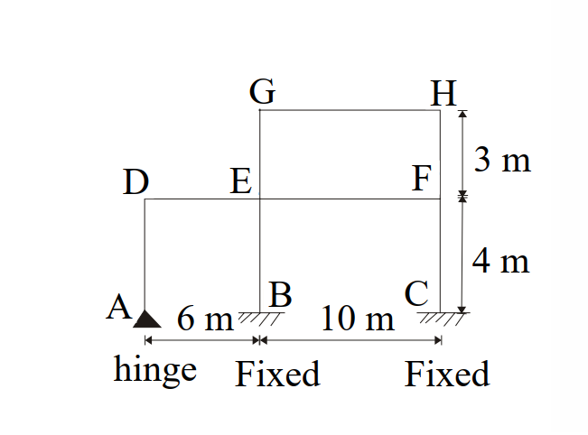
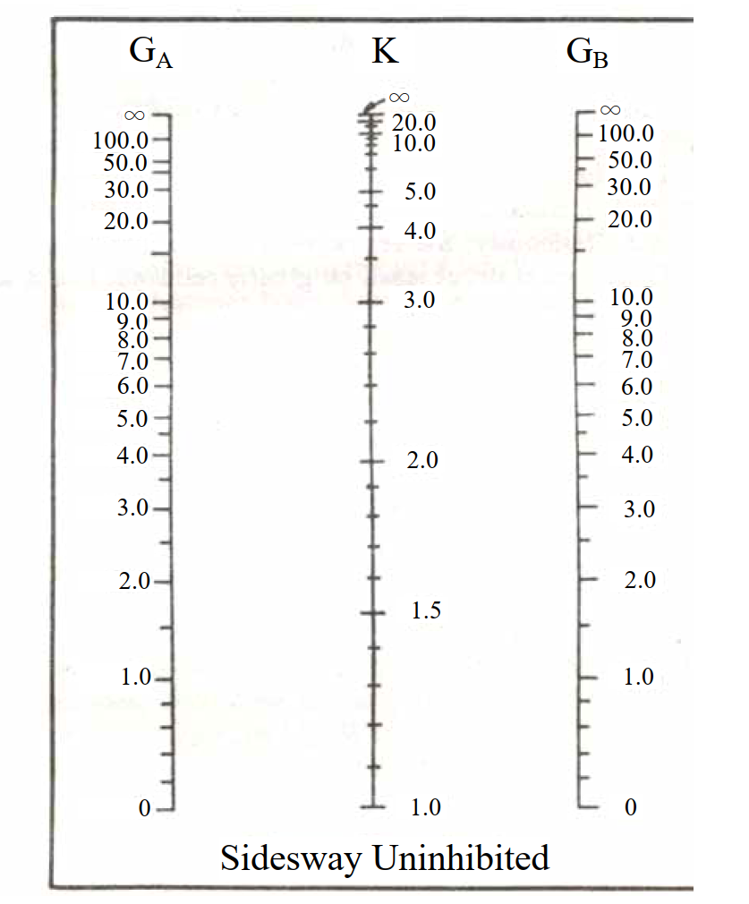

# 考題編號：SS-2007-4

**主分類：** `SS-U1-1` 拉力及壓力桿件
**副分類：** 無
**設計法：** LRFD
**標籤：** `壓力桿件` `有效長度` `K係數` `對位圖` `nomograph` `側移構架` `G值` `多層框架` `鉸接` `固接`

---

## 1. 原始題目重述

多層不規則鋼骨框架如圖一所示，以 LRFD 法求各柱之精確有效長度係數 K 值。

**邊界條件：**
- A 點（柱 AD 底部）：鉸接（hinge）→ $G = 10$
- B 點（柱 BE 底部）：固接（fixed）→ $G = 1$
- C 點（柱 CF 底部）：固接（fixed）→ $G = 1$

**斷面慣性矩（題目提供）：**

| 構件 | 慣性矩 $I$ (cm⁴) | 長度 $L$ |
|------|-----------------|---------|
| 柱 AD、BE、CF | 15000 | 4 m = 400 cm |
| 柱 EG、FH | 4000 | 3 m = 300 cm |
| 梁 DE | 17000 | 6 m = 600 cm |
| 梁 EF、GH | 36000 | 10 m = 1000 cm |

**附圖：**

*圖說：框架尺寸：跨距 A-B = 6 m，B-C = 10 m；柱高：底部至一樓（A/B/C 至 D/E/F）= 4 m，一樓至二樓（E/F 至 G/H）= 3 m。G-H 層僅在 B-C 跨上方，D 節點無上方柱。*

*圖說：側移未束制（Sidesway Uninhibited）對位圖，$G_A$ 與 $G_B$ 分別為柱兩端之 G 值，連線與中間 K 軸交點即為有效長度係數。G 值範圍 0 至 ∞（∞ 以 10 代入，0 以 1 代入）。*

---

## 2. 考題核心精神與出題者意圖

本題核心：**多層不規則側移框架的精確 K 值計算（nomograph 法）**。

難點在於：
1. D 節點只有一根柱（AD）和一根梁（DE），非典型對稱節點
2. F 節點只有右側梁 EF（無右方梁），需注意分母只有單梁
3. G 節點（頂層，只有 GH 梁，無左方梁）

出題意圖：考生須能正確識別每個節點的 $\Sigma(I_c/L_c)$ 和 $\Sigma(I_b/L_b)$，並在對位圖上精確查讀 K 值。

---

## 3. 解題戰略地圖與陷阱分析

**解題步驟：**
1. 計算每根柱的 $I_c/L_c$（柱貢獻）
2. 計算每根梁的 $I_b/L_b$（梁貢獻）
3. 對各節點計算 $G = \Sigma(I_c/L_c) / \Sigma(I_b/L_b)$
4. 代入對位圖查讀 K

**關鍵陷阱：**
1. **D 節點無上方柱**：G_D 的分子只有 AD 柱（向下），無上方柱，分母只有梁 DE（無右側以外方向的梁）
2. **F 節點右方無梁**：G_F 的分母只有梁 EF（向左），因 F 為最右側節點
3. **鉸接基礎 G = 10（非 ∞）**：實用設計取 G = 10，避免算出過高的 K 值
4. **二樓柱 EG/FH 的底端 G 值**：用的是節點 E 和 F 的 G 值（已含一樓梁和柱影響）

---

## 3.5 變數層次分析（Variable Hierarchy Analysis）

> 複習提示：解題後，在每個卡住的知識點「卡關?」欄標記 `⚠`；第二次複習時只看有 `⚠` 的項目。

**最終目標：** 計算各節點 G 值 → 查 Sidesway Uninhibited 對位圖 → 求各柱有效長度係數 K

### 主要公式（$\boxed{\phantom{x}}$ = 未知，待推導）

$$G = \frac{\sum (I_c/L_c)}{\sum (I_b/L_b)}$$

$$\boxed{G_D} = \frac{I_{AD}/L_{AD}}{\sum I_b/L_b \text{ at D}}, \quad \boxed{G_E} = \frac{I_{BE}/L_{BE} + I_{EG}/L_{EG}}{\sum I_b/L_b \text{ at E}}$$

$$\boxed{G_F} = \frac{I_{CF}/L_{CF} + I_{FH}/L_{FH}}{I_{EF}/L_{EF}}, \quad \boxed{G_G} = \frac{I_{EG}/L_{EG}}{I_{GH}/L_{GH}}, \quad \boxed{G_H} = \frac{I_{FH}/L_{FH}}{I_{GH}/L_{GH}}$$

$$\boxed{K} \leftarrow \text{對位圖查讀}(G_{\text{底}},\, G_{\text{頂}}) \quad \Rightarrow \quad KL = \boxed{KL}$$

### L1：題目直接給定

| 符號 | 數值 | 說明 |
|------|------|------|
| $I_{AD}=I_{BE}=I_{CF}$ | 15000 cm⁴ | 一樓柱慣性矩 |
| $L_{AD}=L_{BE}=L_{CF}$ | 400 cm | 一樓柱長 |
| $I_{EG}=I_{FH}$ | 4000 cm⁴ | 二樓柱慣性矩 |
| $L_{EG}=L_{FH}$ | 300 cm | 二樓柱長 |
| $I_{DE}$ | 17000 cm⁴ | 梁 DE 慣性矩 |
| $L_{DE}$ | 600 cm | 梁 DE 長度 |
| $I_{EF}=I_{GH}$ | 36000 cm⁴ | 梁 EF / GH 慣性矩 |
| $L_{EF}=L_{GH}$ | 1000 cm | 梁 EF / GH 長度 |
| $G_A$ | 10（規定值） | 鉸接底部邊界條件 |
| $G_B=G_C$ | 1.0（規定值） | 固接底部邊界條件 |

### L2：需知識點推導

**Step 1：計算各構件 $I/L$**

| 符號 | 公式 / 來源 | 卡關? |
|------|------------|:-----:|
| $(I_c/L_c)_{AD}$ | $15000/400 = 37.50$ cm³ | |
| $(I_c/L_c)_{EG}$ | $4000/300 = 13.33$ cm³ | |
| $(I_b/L_b)_{DE}$ | $17000/600 = 28.33$ cm³ | |
| $(I_b/L_b)_{EF}$ | $36000/1000 = 36.00$ cm³ | |

**Step 2：各節點 G 值**

| 符號 | 公式 / 來源 | 卡關? |
|------|------------|:-----:|
| $G_D$ | $37.50/28.33 = 1.323$（D 僅一根下柱、一根梁） | |
| $G_E$ | $(37.50+13.33)/(28.33+36.00) = 0.790$ | |
| $G_F$ | $(37.50+13.33)/36.00 = 1.412$（F 無右梁） | |
| $G_G$ | $13.33/36.00 = 0.370$（G 無上柱、無左梁） | |
| $G_H$ | $13.33/36.00 = 0.370$ | |

**Step 3：查對位圖得 K，求 KL**

| 符號 | 公式 / 來源 | 卡關? |
|------|------------|:-----:|
| $K_{AD}$ | 對位圖 $(G_A=10,\, G_D=1.323) \approx 2.5$ | |
| $K_{BE}$ | 對位圖 $(G_B=1.0,\, G_E=0.790) \approx 1.2$ | |
| $K_{CF}$ | 對位圖 $(G_C=1.0,\, G_F=1.412) \approx 1.27$ | |
| $K_{EG}$ | 對位圖 $(G_E=0.790,\, G_G=0.370) \approx 1.15$ | |
| $K_{FH}$ | 對位圖 $(G_F=1.412,\, G_H=0.370) \approx 1.20$ | |

### L3：深層知識（不懂就卡住）

| 知識點 | 說明 | 補強頁 | 卡關? |
|--------|------|:------:|:-----:|
| 有效長度係數 K | 側移構架 K > 1，須用 Sidesway Uninhibited 對位圖，非側移用另一圖 | [[effective-length-chart]] | |
| G 值定義與邊界條件 | $G = \Sigma(I_c/L_c)/\Sigma(I_b/L_b)$；鉸接 G = 10，固接 G = 1.0（規定值） | [[effective-length-chart]] | |
| 不對稱節點處理 | D 節點無上方柱、F 節點無右側梁，分子/分母只計實際存在的構件 | | |
| 對位圖讀值精確性 | 連接 $G_{\text{底}}$ 與 $G_{\text{頂}}$ 的直線與 K 軸交點，讀值有人為誤差，K 偏大偏保守 | | |
| 靠柱效應（進階） | 鉸接底柱（靠桿）的 P-Δ 效應可能轉嫁給其他柱，考場不要求但實務注意 | [[P-DELTA-EFFECT]] | |

---

## 4. 步驟化詳細計算過程

### Step 1：各構件 Ic/Lc 及 Ib/Lb

**柱（Ic/Lc）：**

| 柱 | $I_c$ (cm⁴) | $L_c$ (cm) | $I_c/L_c$ (cm³) |
|----|-------------|------------|-----------------|
| AD | 15000 | 400 | **37.50** |
| BE | 15000 | 400 | **37.50** |
| CF | 15000 | 400 | **37.50** |
| EG | 4000 | 300 | **13.33** |
| FH | 4000 | 300 | **13.33** |

**梁（Ib/Lb）：**

| 梁 | $I_b$ (cm⁴) | $L_b$ (cm) | $I_b/L_b$ (cm³) |
|----|-------------|------------|-----------------|
| DE | 17000 | 600 | **28.33** |
| EF | 36000 | 1000 | **36.00** |
| GH | 36000 | 1000 | **36.00** |

### Step 2：各節點 G 值計算

$$G = \frac{\sum (I_c/L_c)_{\text{柱}}}{\sum (I_b/L_b)_{\text{梁}}}$$

**節點 A（柱 AD 底部，鉸接）：**
$$G_A = 10 \quad \text{（鉸接邊界條件，依規定取 10）}$$

**節點 D（柱 AD 頂端，梁 DE 左端）：**
- 分子（柱）：僅有柱 DA 向下 → $37.50$
- 分母（梁）：僅有梁 DE 向右 → $28.33$（D 無上方柱，亦無左方梁）

$$G_D = \frac{37.50}{28.33} = \mathbf{1.323}$$

**節點 B（柱 BE 底部，固接）：**
$$G_B = 1.0 \quad \text{（固接邊界條件）}$$

**節點 E（柱 BE 頂端 + 柱 EG 底端，梁 DE 右端 + 梁 EF 左端）：**
- 分子（柱）：$37.50\ (\text{BE}) + 13.33\ (\text{EG}) = 50.83$
- 分母（梁）：$28.33\ (\text{DE}) + 36.00\ (\text{EF}) = 64.33$

$$G_E = \frac{50.83}{64.33} = \mathbf{0.790}$$

**節點 C（柱 CF 底部，固接）：**
$$G_C = 1.0$$

**節點 F（柱 CF 頂端 + 柱 FH 底端，梁 EF 右端）：**
- 分子（柱）：$37.50\ (\text{CF}) + 13.33\ (\text{FH}) = 50.83$
- 分母（梁）：$36.00\ (\text{EF})$（F 為最右節點，右方無梁）

$$G_F = \frac{50.83}{36.00} = \mathbf{1.412}$$

**節點 G（柱 EG 頂端，梁 GH 左端）：**
- 分子（柱）：$13.33\ (\text{EG})$（G 無上方柱）
- 分母（梁）：$36.00\ (\text{GH})$（G 無左方梁）

$$G_G = \frac{13.33}{36.00} = \mathbf{0.370}$$

**節點 H（柱 FH 頂端，梁 GH 右端）：**
- 分子（柱）：$13.33\ (\text{FH})$（H 無上方柱）
- 分母（梁）：$36.00\ (\text{GH})$（H 無右方梁）

$$G_H = \frac{13.33}{36.00} = \mathbf{0.370}$$

### Step 3：各柱 K 值（對位圖查讀）

依 Sidesway Uninhibited 對位圖（圖二），連接各柱兩端 G 值，讀取中間 K 軸數值：

| 柱 | $G_{\text{底端}}$ | $G_{\text{頂端}}$ | K（由對位圖查讀） |
|----|-----------------|-----------------|----------------|
| **AD** | $G_A = 10$ | $G_D = 1.323$ | $\approx \mathbf{2.5}$ |
| **BE** | $G_B = 1.0$ | $G_E = 0.790$ | $\approx \mathbf{1.2}$ |
| **CF** | $G_C = 1.0$ | $G_F = 1.412$ | $\approx \mathbf{1.27}$ |
| **EG** | $G_E = 0.790$ | $G_G = 0.370$ | $\approx \mathbf{1.15}$ |
| **FH** | $G_F = 1.412$ | $G_H = 0.370$ | $\approx \mathbf{1.20}$ |

### Step 4：有效長度 KL 彙整

$$K_{\text{AD}} \times L_{\text{AD}} = 2.5 \times 400 = \boxed{1000 \text{ cm} = 10 \text{ m}}$$

$$K_{\text{BE}} \times L_{\text{BE}} = 1.2 \times 400 = \boxed{480 \text{ cm} = 4.8 \text{ m}}$$

$$K_{\text{CF}} \times L_{\text{CF}} = 1.27 \times 400 = \boxed{508 \text{ cm} = 5.08 \text{ m}}$$

$$K_{\text{EG}} \times L_{\text{EG}} = 1.15 \times 300 = \boxed{345 \text{ cm} = 3.45 \text{ m}}$$

$$K_{\text{FH}} \times L_{\text{FH}} = 1.20 \times 300 = \boxed{360 \text{ cm} = 3.60 \text{ m}}$$

> **最關鍵柱為 AD**：底部鉸接 $G = 10$ 使 K 急遽增大至 $\approx 2.5$，有效長度達 10 m（兩倍實際柱長），在設計時須特別注意。

---

## 5. 關鍵爭議點與進階探討

**爭議點一：D 節點無上方柱的處理**

節點 D 只有柱 DA（向下）和梁 DE（向右），無向上的柱。這種「頂端不延伸」的節點在計算 G 時，分子僅計下方柱，不應補充虛擬柱。結果 G_D = 1.323（中等值），不會使 K 過大。

**爭議點二：F 節點只有單側梁**

F 為框架最右端，梁 EF 是唯一連接的梁，分母只有 36.00，使 G_F = 1.412，相對於對稱節點（有兩側梁的情況）偏高，導致柱 CF 的 K 值略大於 BE。這反映了**邊柱效應**：邊柱比內柱更容易發生側移。

**爭議點三：鉸接 G = 10 vs. G = ∞**

理論上，鉸接（pin support）的旋轉剛度為零，G → ∞。但實際查圖時採用 G = 10，這是 AISC 的實用建議值，避免讀圖超出對位圖刻度範圍，同時已偏保守（K 比 G = ∞ 時略小）。

**進階：LeMessurier 靠柱效應修正**

本題的柱 AD（鉸接底部）在實際多層框架中，其挫屈可能連帶影響同層柱（靠柱效應，leaning column effect）。AISC 建議對鉸接底柱在系統層級另行修正，以免低估 K 值。此修正在考題層級通常不要求，但在實務設計中需注意。
