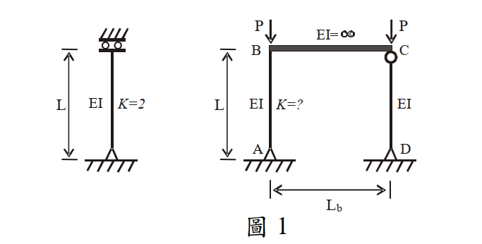

# 考題編號：SS-2008-2

**主分類：** `SS-U1-1` 拉力及壓力桿件
**副分類：** 無
**設計法：** LRFD（概念計算混合題）
**標籤：** `壓力桿件` `有效長度係數` `靠桿效應` `LeMessurier公式` `側向挫屈` `未束制頂層` `鋼架穩定` `P-Δ效應`

---

## 1. 原始題目重述 (Problem Restatement)

本題分為兩小題：

**（一）計算 K_AB（10 分）**

圖 1 之鋼架結構條件：
- 柱 AB：高度 $L$，勁度 $EI$，底端 A 固定，待求 $K_{AB}$
- 柱 CD：高度 $L$，勁度 $EI$，**靠桿**（leaning column，無側向勁度）
- 梁 BC：$EI = \infty$（無限剛梁，使 B、C 頂端位移相同）
- 各柱頂端載重：$P$（AB 頂 B 處 $P$，CD 頂 C 處 $P$）
- 已知：單根柱之 $K = 2.0$（固定端-自由端懸臂柱，$EI$、高 $L$ 與框架柱相同）

萊梅厥公式（LeMessurier formula）：

$$K' = \sqrt{\frac{P_e}{P_I} \times \frac{\Sigma P}{\Sigma P_{eK}}}$$

其中：
- $P_e$：欲求柱之尤拉載重（基本尤拉載重，$K=1$ 時 $P_e = \pi^2 EI / L^2$）
- $P_I$：欲求柱所受垂直載重
- $\Sigma P$：整個結構所受總外載重
- $\Sigma P_{eK}$：所有非靠桿在**考慮有效長度係數後**之挫屈載重

**（二）說明靠桿效應造成 K_AB 增大的原因（15 分）**



*圖說：左側為單根懸臂柱（固定底、自由頂，K=2.0，高L，勁度EI，頂端施P）。右側為兩柱一梁框架：AB柱（EI，底端固定，頂端B連接無限剛梁，K=?），CD柱（EI，靠桿），BC梁（EI=∞），水平間距Lb，AB與CD頂端各施垂直載重P。*

---

## 2. 考題核心精神與出題者意圖 (Core Concepts & Examiner's Intent)

**核心觀念：** 靠桿效應（leaning column effect）是鋼框架設計中常被忽略的重要二階效應。靠桿柱自身不提供任何側向抵抗力，但透過剛性梁（樓板系統）將其 P-Δ 不穩定效應「轉嫁」給有側向抵抗能力的柱，使有效長度增大。

**出題者意圖：**
1. 考察 LeMessurier 公式的正確使用（$P_e$ 與 $P_{eK}$ 的區別）
2. 考察靠桿效應的物理機制（非純計算，需有深度理解）

**關鍵認知：** $P_e$ 為基本尤拉載重（$K=1$）；$\Sigma P_{eK}$ 為非靠桿柱以對齊圖 K 值計算之挫屈載重。兩者不同，不可混淆。

---

## 3. 解題戰略地圖與陷阱分析 (Strategic Roadmap & Trap Analysis)

**解題路徑：**
```
① 確認 K_AB,0（框架中 AB 柱不含靠桿效應之 K 值）
      ↓
② 確認各公式參數：Pe、PI、ΣP、ΣPeK
      ↓
③ 代入 LeMessurier 公式求 K'_AB
      ↓
④ 驗證 K'_AB > K_AB,0（靠桿效應必定增大 K）
```

**關鍵陷阱：**

| 陷阱 | 錯誤做法 | 正確做法 |
|------|---------|---------|
| ① $P_e$ 的定義 | 誤用有效長度後的 Euler 載重（含 K） | $P_e = \pi^2 EI/L^2$（基本尤拉載重，$K=1$） |
| ② $\Sigma P_{eK}$ 的範圍 | 把靠桿 CD 也納入計算 | 只計非靠桿（僅 AB） |
| ③ $\Sigma P$ 的範圍 | 只算 AB 的載重 P | 整個框架總載重 = P + P = 2P |
| ④ K_AB,0 的判斷 | 誤以為剛梁提供旋轉束制 | 剛梁另端接靠桿，節點 C 自由轉動，B 端亦無旋轉束制，故 $K_{AB,0} = 2.0$ |

---

## 3.5 變數層次分析（Variable Hierarchy Analysis）

> 複習提示：解題後，在每個卡住的知識點「卡關?」欄標記 `⚠`；第二次複習時只看有 `⚠` 的項目。

**最終目標：** 確認 $K_{AB,0}$ → 代入 LeMessurier 公式（$P_e, P_I, \Sigma P, \Sigma P_{eK}$）→ 求靠桿效應後之 $K'_{AB} = 2\sqrt{2}$

### 主要公式（$\boxed{\phantom{x}}$ = 未知，待推導）

$$P_e = \frac{\pi^2 EI}{L^2}, \quad P_I = P, \quad \Sigma P = 2P$$

$$\Sigma P_{eK} = \frac{\pi^2 EI}{(\boxed{K_{AB,0}} \cdot L)^2} = \frac{\pi^2 EI}{4L^2}$$

$$\boxed{K'_{AB}} = \sqrt{\frac{P_e}{P_I} \times \frac{\Sigma P}{\Sigma P_{eK}}} = \sqrt{8} = 2\sqrt{2}$$

### L1：題目直接給定

| 符號 | 數值 | 說明 |
|------|------|------|
| $EI$ | 同值（AB 與 CD 相同） | 各柱勁度 |
| $L$ | 柱高 | AB 與 CD 均為高度 $L$ |
| $P$ | 頂端外載 | AB 頂（B）與 CD 頂（C）各一個 $P$ |
| $EI_{beam}$ | $\infty$ | BC 梁為無限剛梁 |
| $K_{\text{single}}$ | 2.0（題目給定） | 單根懸臂柱（固定底-自由頂）有效長度係數 |
| LeMessurier 公式 | 題目給定 | $K' = \sqrt{(P_e/P_I)(\Sigma P/\Sigma P_{eK})}$ |

### L2：需知識點推導

**Step 1：判斷 $K_{AB,0}$（不含靠桿效應）**

| 符號 | 公式 / 來源 | 卡關? |
|------|------------|:-----:|
| CD 為靠桿 | CD 兩端鉸接，無彎矩傳遞能力 → 節點 C 旋轉自由 | |
| $\theta_B = \theta_C$ | $EI_{beam} = \infty$ → 剛梁使 B、C 旋轉角相等 | |
| $K_{AB,0}$ | 節點 B 旋轉自由 + 固定底端 → 固定-自由懸臂柱 → $K_{AB,0} = 2.0$ | |

**Step 2：確認各公式參數**

| 符號 | 公式 / 來源 | 卡關? |
|------|------------|:-----:|
| $P_e$ | $\pi^2 EI/L^2$（基本尤拉載重，$K=1$，**非** $K_{AB,0}$） | |
| $P_I$ | $P$（AB 柱承受的載重） | |
| $\Sigma P$ | $P + P = 2P$（含靠桿 CD） | |
| $\Sigma P_{eK}$ | 僅 AB（非靠桿）：$\pi^2 EI/(K_{AB,0} \cdot L)^2 = \pi^2 EI/4L^2$ | |

**Step 3：代入公式求 $K'_{AB}$**

| 符號 | 公式 / 來源 | 卡關? |
|------|------------|:-----:|
| $K'_{AB}$ | $\sqrt{(\pi^2 EI/L^2)/P \times 2P/(\pi^2 EI/4L^2)} = \sqrt{8} = 2\sqrt{2}$ | |
| 驗證 | $K'_{AB} = 2\sqrt{2} \approx 2.83 > K_{AB,0} = 2.0$ ✓ | |

### L3：深層知識（不懂就卡住）

| 知識點 | 說明 | 補強頁 | 卡關? |
|--------|------|:------:|:-----:|
| 靠桿效應（Leaning Column Effect） | 靠桿不提供側向抵抗，但透過剛梁將 P-Δ 不穩定效應轉嫁給有勁度的柱，使 $K$ 增大 | [[P-DELTA-EFFECT]] | |
| $P_e$ vs $P_{eK}$ 的差異 | $P_e = \pi^2EI/L^2$（$K=1$）；$P_{eK} = \pi^2EI/(KL)^2$（含有效長度修正） | | |
| 靠桿識別 | 靠桿 = 無側向勁度的柱；$\Sigma P_{eK}$ 只計非靠桿柱 | | |
| 無限剛梁的力學含義 | $EI \to \infty$ → 梁兩端旋轉角相等，傳遞側向不穩定效應 | | |
| 靠桿比的影響 | 靠桿比 $\alpha = P_\text{leaning}/P_\text{non-leaning}$；$K' = K_0\sqrt{1+\alpha}$，靠桿比越大，$K'$ 越大 | [[effective-length-chart]] | |

---

## 4. 步驟化詳細計算過程 (Step-by-Step Detailed Calculation)

### Step 1：判斷 AB 柱不含靠桿效應之有效長度係數 $K_{AB,0}$

CD 柱為靠桿，兩端鉸接（無彎矩傳遞能力），故節點 C 可自由轉動：

$$\text{CD 靠桿} \Rightarrow \text{節點 C 旋轉無束制}$$

由於梁 BC 為無限剛梁（$EI = \infty$），節點 B 與節點 C 必須有相同旋轉角：

$$\theta_B = \theta_C \quad (\text{因 } EI_{beam} = \infty)$$

節點 C 自由轉動 $\Rightarrow$ 節點 B 亦無旋轉束制

$$\Rightarrow \text{AB 柱之頂端 B 為旋轉自由（等效自由端）}$$

AB 柱底端 A 固定（固定端），頂端 B 旋轉自由（自由端），側移框架：

$$\boxed{K_{AB,0} = 2.0 \quad (\text{與單根懸臂柱相同})}$$

> **策略註解：** 這正是題目給出單根柱 K=2.0 的原因——用來確認 AB 柱的初始 K 值，而非無用資訊。

---

### Step 2：確認各公式參數

**① $P_e$（AB 柱基本尤拉載重，$K=1$）：**

$$P_e = \frac{\pi^2 EI}{L^2}$$

**② $P_I$（AB 柱所受垂直載重）：**

$$P_I = P$$

**③ $\Sigma P$（整體結構總垂直載重）：**

$$\Sigma P = P_{AB} + P_{CD} = P + P = 2P$$

**④ $\Sigma P_{eK}$（非靠桿柱以有效長度係數計算之挫屈載重）：**

CD 為靠桿，不計入。僅 AB 柱（$K_{AB,0} = 2.0$）：

$$\Sigma P_{eK} = \frac{\pi^2 EI}{(K_{AB,0} \cdot L)^2} = \frac{\pi^2 EI}{(2.0 \cdot L)^2} = \frac{\pi^2 EI}{4L^2}$$

---

### Step 3：代入 LeMessurier 公式

$$K'_{AB} = \sqrt{\frac{P_e}{P_I} \times \frac{\Sigma P}{\Sigma P_{eK}}}$$

$$K'_{AB} = \sqrt{\frac{\dfrac{\pi^2 EI}{L^2}}{P} \times \frac{2P}{\dfrac{\pi^2 EI}{4L^2}}}$$

$$= \sqrt{\frac{\pi^2 EI}{PL^2} \times \frac{2P \times 4L^2}{\pi^2 EI}}$$

$$= \sqrt{\frac{8\pi^2 EI \cdot PL^2}{\pi^2 EI \cdot PL^2}} = \sqrt{8}$$

$$\boxed{K'_{AB} = 2\sqrt{2} \approx 2.83}$$

**驗證：** $K'_{AB} = 2\sqrt{2} \approx 2.83 > K_{AB,0} = 2.0$ ✓（靠桿效應確實增大 $K_{AB}$）

---

### Step 4：（二）靠桿效應造成 K_AB 增大的原因

**物理機制分析：**

當框架發生側向位移 $\delta$ 時，P-Δ 不穩定效應由所有受重柱共同貢獻，但抵抗力僅來自有側向勁度的非靠桿柱。

**靠桿 CD 的角色：**

```
      δ（側向位移）
P──→B════════C──→P
   ‖    EI=∞   ‖
   ‖ AB        ‖ CD（靠桿）
   ‖            ‖
   A（固定）    D（固定）
```

| 項目 | AB 柱 | CD 靠桿 |
|------|-------|--------|
| 承受垂直載重 | P | P |
| 側向位移 | δ | δ（與B相同，因剛梁） |
| P-Δ 不穩定效應 | $P \times \delta$ | $P \times \delta$ |
| 側向抵抗力 | ✅ 有（固定底端提供恢復彎矩） | ❌ 無（靠桿，無彎矩能力） |

**AB 柱的負擔：**

$$\text{總 P-Δ 不穩定效應} = P_{AB} \times \delta + P_{CD} \times \delta = 2P \times \delta$$

$$\text{總抵抗力} = \text{僅 AB 柱的彈性恢復力}$$

AB 柱以**原本的側向勁度**（對應 $K_{AB,0} = 2.0$ 之抵抗能力），**必須抵抗原本兩倍的 P-Δ 效應**：

$$\text{等效垂直載重} = 2P \quad (\text{而非原本的 } P)$$

**有效長度的增大：**

挫屈載重條件：
$$P_{cr} = \frac{\pi^2 EI}{(K'_{AB} \cdot L)^2} \Rightarrow \text{抵抗 } 2P \text{ 的 P-Δ，需 } K'_{AB} = K_{AB,0} \times \sqrt{\frac{\Sigma P}{P_I}} = 2.0 \times \sqrt{2} = 2\sqrt{2}$$

**結論（考場答題重點）：**

1. **靠桿 CD 本身不提供側向抵抗力**，但透過無限剛梁（樓板）與 AB 柱形成動力耦合，使 CD 的 P-Δ 效應完全轉由 AB 承擔。

2. **AB 柱之側向勁度固定**（由其 $EI$、$L$ 和端點束制決定），但需抵抗的 P-Δ 不穩定效應加倍（由 $P$ 增為 $2P$）。

3. **等效有效長度增大**：在同樣的 $EI$ 和 $L$ 條件下，抵抗更大的 P-Δ 效應等同於柱需要更長的「有效屈曲長度」，亦即 $K_{AB}$ 值上升，從 $2.0$ 增大至 $2\sqrt{2} \approx 2.83$。

$$\boxed{靠桿效應 \Rightarrow \text{AB 必須以固有勁度抵抗多出的靠桿 P-Δ} \Rightarrow K_{AB} \text{ 增大}}$$

---

## 5. 關鍵爭議點與進階探討 (Critical Issues & Advanced Discussion)

### LeMessurier 公式的推導邏輯

公式的本質是一個**剛度需求與供給的比值調整**：

$$K'_{AB} = \underbrace{\sqrt{\frac{P_e}{P_I}}}_{\text{單柱 K 值}} \times \underbrace{\sqrt{\frac{\Sigma P}{\Sigma P_{eK}}}}_{\text{靠桿放大係數}}$$

本題中：
- 單柱 K 值部分：$\sqrt{\pi^2 EI/(L^2 \cdot P)}$ → 對應 K_AB,0 = 2.0 時為 $\sqrt{\pi^2 EI/PL^2}$
- 靠桿放大係數：$\sqrt{2P / (\pi^2 EI/4L^2)} = \sqrt{8PL^2/\pi^2 EI}$
- 合計：$\sqrt{8} = 2\sqrt{2}$ ✓

### 靠桿比（Leaning Ratio）的影響

若定義靠桿比 $\alpha = P_{leaning} / P_{non-leaning}$，本題 $\alpha = 1$（CD 與 AB 各承 P）：

$$K'_{AB} = K_{AB,0} \times \sqrt{1 + \alpha} = 2.0 \times \sqrt{1+1} = 2\sqrt{2}$$

靠桿比越大（靠桿承擔越多總載重），$K'_{AB}$ 越大，設計越不利。

### 實務意義

現代高層建築常有大量重力柱（靠桿），設計時必須將其 P-Δ 效應分配給少數核心筒或剪力牆，否則嚴重低估有效長度係數。AISC 360 的直接分析法（DAM）通過放大側移 $\Delta$ 的方式間接考慮靠桿效應，更具普遍性。
