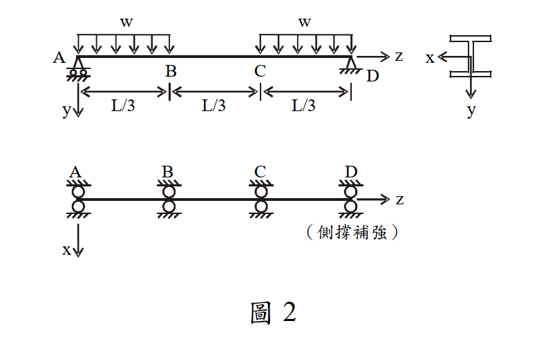

# 考題編號：SS-2008-3

**主分類：** `4.1.2` 梁桿件
**副分類：** 無
**設計法：** LRFD
**標籤：** `梁桿件` `LRFD` `LTB側扭挫屈` `Cb彎矩梯度` `塑性彎矩` `結實斷面` `Lp Lr` `X1 X2` `均佈載重`

---

## 1. 原始題目重述 (Problem Restatement)

簡支 W 型鋼梁，全長 $L = 18$ m，在 A、B、C、D 四點有側向束制（間距 $L/3 = 6$ m），承受均佈設計載重 $w$（t/m）。以 LRFD 求解容許標稱外載重 $w_{n,cr}$。

**斷面參數：**

| 參數 | 數值 | 參數 | 數值 |
|------|------|------|------|
| $d$ | 54.43 cm | $r_x$ | 22.02 cm |
| $b_f$ | 21.22 cm | $S_x$ | 2802 cm³ |
| $t_f$ | 2.12 cm | $Z_x$ | 3212 cm³ |
| $t_w$ | 1.31 cm | $r_y$ | 4.65 cm |
| $A$ | 156.77 cm² | $r_T$ | 5.46 cm |
| $I_x$ | 76170 cm⁴ | $C_w$ | 2,317,464 cm⁶ |
| $I_y$ | 3388 cm⁴ | $J$ | 181 cm⁴ |

**材料特性：** $F_y = 3.5$ t/cm²，$E = 2100$ t/cm²，$G = 840$ t/cm²



*圖說：簡支梁總長L=18m，A為左支承，D為右支承，側向束制分別在A、B、C、D（間距L/3=6m）。均佈載重w（t/m）作用於全跨。H型鋼斷面（強軸撓曲），強軸側撐示意圖見底部視圖。*

---

## 2. 考題核心精神與出題者意圖 (Core Concepts & Examiner's Intent)

**核心考點：** LRFD 梁桿件設計三段式 LTB 流程：
1. 確認結實斷面（排除局部挫屈）
2. 計算 $L_p$、$L_r$，判斷控制極限狀態
3. 對各無束制段計算 $C_b$，求 $\phi_b M_n$
4. 以最大彎矩對應設計強度求解 $w_{n,cr}$

**出題者意圖：** 測試能否正確計算 $L_r$（含 $X_1$、$X_2$），並辨別不同段的 $C_b$，最終以中間段控制設計。

---

## 3. 解題戰略地圖與陷阱分析 (Strategic Roadmap & Trap Analysis)

**解題順序：**
```
① 局部挫屈（翼板、腹板）→ 確認結實斷面
② 計算 Mp、X1、X2、Lp、Lr
③ 比較 Lb = 600 cm 與 Lp、Lr
④ 各段計算 Cb → 求 φbMn（注意 Mn ≤ Mp 上限）
⑤ 各段對應彎矩需求 → 求解 wn,cr
```

**關鍵陷阱：**

| 陷阱 | 錯誤 | 正確 |
|------|------|------|
| ① Cb 的段落定義 | 用全梁計算一個 Cb | 每個無束制段（AB、BC、CD）各算各的 Cb |
| ② Mn 的上限 | 忘記 $M_n \leq M_p$ | 即使 $C_b \times M_{cr} > M_p$，仍要以 $M_p$ 為上限 |
| ③ 控制段 | 誤以為 AB 或 CD 控制 | BC 段彎矩需求最大（含跨中最大彎矩），為控制段 |
| ④ Lr 的計算 | 跳過 X1、X2 直接查表 | 題目給了斷面參數，需完整計算 X1、X2 後求 Lr |

---

## 3.5 變數層次分析（Variable Hierarchy Analysis）

> 複習提示：解題後，在每個卡住的知識點「卡關?」欄標記 `⚠`；第二次複習時只看有 `⚠` 的項目。

**最終目標：** 驗結實斷面 → 算 $L_p, X_1, X_2, L_r$ → 判斷各段 LTB 區段 → 各段 $C_b$ → $\phi_b M_n$ → BC 段（含最大彎矩）控制 → 求 $w_{n,cr} \approx 2.50$ t/m

### 主要公式（$\boxed{\phantom{x}}$ = 未知，待推導）

$$\boxed{M_p} = F_y Z_x, \quad \phi_b M_p = 0.9 M_p$$

$$\boxed{L_p} = \frac{80 r_y}{\sqrt{F_y}}, \quad \boxed{X_1} = \frac{\pi}{S_x}\sqrt{\frac{EGJA}{2}}, \quad \boxed{X_2} = \frac{4C_w}{I_y}\left(\frac{S_x}{GJ}\right)^2$$

$$\boxed{L_r} = \frac{r_y X_1}{F_y - F_r}\sqrt{1 + \sqrt{1 + X_2(F_y-F_r)^2}}$$

$$\boxed{M_n} = C_b \cdot M_{cr}(C_b=1) \leq M_p \quad \Rightarrow \quad w_{n,cr} = \frac{\phi_b M_n}{M_u/w}$$

### L1：題目直接給定

| 符號 | 數值 | 說明 |
|------|------|------|
| $L$ | 18 m | 梁總跨距 |
| $L_b$ | 6 m = 600 cm | 無束制段長度（A-B-C-D 四點均等分） |
| $F_y$ | 3.5 t/cm² | 鋼材降伏應力 |
| $E$ | 2100 t/cm² | 彈性模數 |
| $G$ | 840 t/cm² | 剪力模數 |
| $Z_x$ | 3212 cm³ | 塑性斷面模數 |
| $S_x$ | 2802 cm³ | 彈性斷面模數 |
| $r_y$ | 4.65 cm | 弱軸迴轉半徑 |
| $J$ | 181 cm⁴ | St. Venant 扭轉常數 |
| $C_w$ | 2,317,464 cm⁶ | 翹曲常數 |
| $I_y$ | 3388 cm⁴ | 弱軸慣性矩 |
| $A$ | 156.77 cm² | 全斷面積 |

### L2：需知識點推導

**Step 1：結實斷面確認**

| 符號 | 公式 / 來源 | 卡關? |
|------|------------|:-----:|
| $\lambda_f = b_f/(2t_f)$ | $21.22/(2\times2.12) = 5.00$ | |
| $\lambda_{p,f} = 17/\sqrt{F_y}$ | $9.09$ → $\lambda_f < \lambda_{p,f}$ ✓ | |
| $\lambda_w = h/t_w$ | $38.31 < \lambda_{p,w} = 90.87$ ✓ 結實腹板 | |

**Step 2：基本強度參數**

| 符號 | 公式 / 來源 | 卡關? |
|------|------------|:-----:|
| $M_p$ | $F_y Z_x = 3.5 \times 3212 = 11242$ t·cm | |
| $F_r$ | 熱軋斷面 $0.69$ t/cm²；$F_y - F_r = 2.81$ t/cm² | |

**Step 3：$L_p, X_1, X_2, L_r$ 計算**

| 符號 | 公式 / 來源 | 卡關? |
|------|------------|:-----:|
| $L_p$ | $80r_y/\sqrt{F_y} = 199$ cm | |
| $X_1$ | $(\pi/S_x)\sqrt{EGJA/2} = 177.4$ t/cm² | |
| $X_2$ | $(4C_w/I_y)(S_x/GJ)^2 = 0.9291$ cm⁴/t² | |
| $L_r$ | 代入公式 $= 579$ cm；$L_b = 600 > L_r$ → 彈性 LTB | |

**Step 4：各段 $C_b$ 與 $M_n$**

| 符號 | 公式 / 來源 | 卡關? |
|------|------------|:-----:|
| $M_{cr}(C_b=1)$ | 彈性 LTB 公式，$L_b/r_y = 129.03$ → $7469$ t·cm | |
| $C_b$（AB/CD 段） | $1.75 + 1.05(0) = 1.75$；$1.75 \times 7469 > M_p$ → $M_n = M_p$ | |
| $C_b$（BC 段） | 計算值 3.10 > 2.3 → 取 $C_b = 2.3$；$M_n = M_p$ | |
| $\phi_b M_n$ | $0.9 \times 11242 = 10118$ t·cm = 101.18 t·m（各段相同） | |

**Step 5：控制段與 $w_{n,cr}$**

| 符號 | 公式 / 來源 | 卡關? |
|------|------------|:-----:|
| 控制段 | BC 段；最大彎矩 $M_u = 40.5w$（跨中值） | |
| $w_{n,cr}$ | $101.18/40.5 = 2.498 \approx 2.50$ t/m | |

### L3：深層知識（不懂就卡住）

| 知識點 | 說明 | 補強頁 | 卡關? |
|--------|------|:------:|:-----:|
| LTB 三段判斷 | $L_b \leq L_p$：塑性；$L_p < L_b \leq L_r$：非彈性；$L_b > L_r$：彈性 | [[ltb-3zone]] · [[LATERAL-TORSIONAL-BUCKLING]] | |
| $X_1, X_2$ 的物理意義 | $X_1$：扭轉-慣性矩綜合；$X_2$：翹曲/扭轉比值；兩者共同決定 $L_r$ | | |
| $C_b$ 上限 2.3 | ASD 舊版 $C_b$ 公式有 2.3 上限（非均勻彎矩不能無限提升） | [[cb-factor]] · [[BENDING-MODIFICATION-FACTOR-CB]] | |
| $C_b \times M_{cr} > M_p$ | 彈性 LTB 範圍內，$C_b$ 足夠大時 $M_n$ 仍可取 $M_p$ | [[ltb-3zone]] | |
| 各段獨立計算 $C_b$ | 每個無束制段各自計算 $C_b$，不可用全梁統一值 | [[cb-factor]] | |
| 殘留應力 $F_r = 0.69$ t/cm² | 熱軋斷面殘留應力，影響 $L_r$ 計算中的 $F_y - F_r$ | [[RESIDUAL-STRESS]] | |

---

## 4. 步驟化詳細計算過程 (Step-by-Step Detailed Calculation)

### Step 1：局部挫屈檢核（結實斷面確認）

**翼板寬厚比：**

$$\lambda_f = \frac{b_f}{2t_f} = \frac{21.22}{2 \times 2.12} = 5.00$$

$$\lambda_{p,f} = \frac{17}{\sqrt{F_y}} = \frac{17}{\sqrt{3.5}} = \frac{17}{1.871} = 9.09$$

$\lambda_f = 5.00 < \lambda_{p,f} = 9.09$ ✅ 結實翼板

**腹板寬厚比（純彎曲，$f_a = 0$）：**

$$h = d - 2t_f = 54.43 - 2(2.12) = 50.19 \text{ cm}$$

$$\lambda_w = \frac{h}{t_w} = \frac{50.19}{1.31} = 38.31$$

$$\lambda_{p,w} = \frac{170}{\sqrt{F_y}} = \frac{170}{\sqrt{3.5}} = \frac{170}{1.871} = 90.87$$

$\lambda_w = 38.31 < \lambda_{p,w} = 90.87$ ✅ 結實腹板

> **結論：結實斷面（Compact Section）**，塑性彎矩 $M_p$ 為斷面最大撓曲強度。

---

### Step 2：計算基本強度參數

**塑性彎矩：**

$$M_p = F_y Z_x = 3.5 \times 3212 = 11{,}242 \text{ t·cm} = 112.42 \text{ t·m}$$

**設計強度上限：**

$$\phi_b M_p = 0.9 \times 11{,}242 = 10{,}118 \text{ t·cm} = 101.18 \text{ t·m}$$

**殘留應力（熱軋斷面）：**

$$F_r = 0.69 \text{ t/cm}^2 \quad \Rightarrow \quad F_y - F_r = 3.5 - 0.69 = 2.81 \text{ t/cm}^2$$

**彈性極限彎矩：**

$$M_r = (F_y - F_r) S_x = 2.81 \times 2802 = 7{,}874 \text{ t·cm}$$

---

### Step 3：計算 $L_p$

$$L_p = \frac{80 r_y}{\sqrt{F_y}} = \frac{80 \times 4.65}{\sqrt{3.5}} = \frac{372}{1.871} = \mathbf{198.8 \text{ cm} \approx 199 \text{ cm}}$$

---

### Step 4：計算 $X_1$、$X_2$ → 求 $L_r$

**$X_1$（扭轉常數一）：**

$$X_1 = \frac{\pi}{S_x}\sqrt{\frac{EGJA}{2}}$$

$$EGJA = 2100 \times 840 \times 181 \times 156.77 = 5.007 \times 10^{10} \text{ t}^2\text{·cm}^2$$

$$\sqrt{EGJA/2} = \sqrt{2.504 \times 10^{10}} = 158{,}227 \text{ t·cm}$$

$$X_1 = \frac{\pi}{2802} \times 158{,}227 = \frac{3.14159}{2802} \times 158{,}227 = \mathbf{177.4 \text{ t/cm}^2}$$

**$X_2$（扭轉常數二）：**

$$X_2 = \frac{4C_w}{I_y}\left[\frac{S_x}{GJ}\right]^2$$

$$\frac{4C_w}{I_y} = \frac{4 \times 2{,}317{,}464}{3388} = 2{,}735.9 \text{ cm}^2$$

$$\frac{S_x}{GJ} = \frac{2802}{840 \times 181} = \frac{2802}{152{,}040} = 0.018429 \text{ cm/t}$$

$$\left[\frac{S_x}{GJ}\right]^2 = (0.018429)^2 = 3.396 \times 10^{-4} \text{ cm}^2/\text{t}^2$$

$$X_2 = 2{,}735.9 \times 3.396 \times 10^{-4} = \mathbf{0.9291 \text{ cm}^4/\text{t}^2}$$

**$L_r$：**

$$L_r = \frac{r_y X_1}{F_y - F_r}\sqrt{1 + \sqrt{1 + X_2(F_y-F_r)^2}}$$

$$X_2(F_y-F_r)^2 = 0.9291 \times (2.81)^2 = 0.9291 \times 7.896 = 7.335$$

$$\sqrt{1 + X_2(F_y-F_r)^2} = \sqrt{1 + 7.335} = \sqrt{8.335} = 2.887$$

$$\sqrt{1 + 2.887} = \sqrt{3.887} = 1.972$$

$$L_r = \frac{4.65 \times 177.4}{2.81} \times 1.972 = \frac{824.9}{2.81} \times 1.972 = 293.6 \times 1.972 = \mathbf{578.9 \text{ cm} \approx 579 \text{ cm}}$$

---

### Step 5：判斷 LTB 區段

各無束制段之 $L_b$（A-B、B-C、C-D）均為：

$$L_b = L/3 = 18/3 = 6 \text{ m} = 600 \text{ cm}$$

**比較：**

$$L_p = 199 \text{ cm} < L_r = 579 \text{ cm} < L_b = 600 \text{ cm}$$

> **$L_b > L_r$ → 彈性 LTB 控制！**

使用彈性 LTB 公式（LRFD）：

$$M_n = \frac{C_b S_x X_1 \sqrt{2}}{L_b/r_y}\sqrt{1 + \frac{X_1^2 X_2}{2(L_b/r_y)^2}} \leq M_p$$

**計算 $M_{cr}$（$C_b = 1$ 時之基準彈性挫屈彎矩）：**

$$\frac{L_b}{r_y} = \frac{600}{4.65} = 129.03$$

$$\frac{X_1^2 X_2}{2(L_b/r_y)^2} = \frac{(177.4)^2 \times 0.9291}{2 \times (129.03)^2} = \frac{31{,}471 \times 0.9291}{2 \times 16{,}649} = \frac{29{,}241}{33{,}298} = 0.8782$$

$$\sqrt{1 + 0.8782} = \sqrt{1.8782} = 1.3704$$

$$S_x X_1 \sqrt{2} = 2802 \times 177.4 \times 1.4142 = 703{,}022 \text{ t·cm}$$

$$M_{cr}(C_b=1) = \frac{703{,}022}{129.03} \times 1.3704 = 5{,}449 \times 1.3704 = \mathbf{7{,}469 \text{ t·cm}}$$

---

### Step 6：各無束制段之 $C_b$ 與 $M_n$

**彎矩分布（簡支梁，均佈載重 $w$）：**

$$M(x) = \frac{wL}{2} \cdot x - \frac{w}{2}x^2 \quad (w \text{ 單位 t/m，} x \text{ 單位 m，} M \text{ 單位 t·m})$$

關鍵點彎矩（以 w 表示）：

| 位置 | $x$ (m) | $M$ (t·m) |
|------|---------|---------|
| A | 0 | 0 |
| B | 6 | $9 \times 6 \cdot w - 18w = 36w$ |
| 跨中 | 9 | $81w - 40.5w = 40.5w$（最大值）|
| C | 12 | $36w$（對稱） |
| D | 18 | 0 |

---

**段 A-B（$x$ = 0 到 6 m）：**

$$C_b = 1.75 + 1.05\frac{M_A}{M_B} + 0.3\left(\frac{M_A}{M_B}\right)^2$$

- $M_A = 0$（支承），$M_B = 36w$（較大端）
- $M_A/M_B = 0$

$$C_b = 1.75 + 1.05(0) + 0.3(0)^2 = \mathbf{1.75}$$

$$M_n = 1.75 \times 7{,}469 = 13{,}071 \text{ t·cm} > M_p = 11{,}242 \text{ t·cm}$$

$$\Rightarrow M_n = M_p = 11{,}242 \text{ t·cm} = 112.42 \text{ t·m}$$

---

**段 B-C（$x$ = 6 到 12 m，含跨中最大彎矩）：**

- $M_B = 36w$，$M_C = 36w$（雙端相等）
- $M_A/M_B = 36w/36w = 1.0$

$$C_b = 1.75 + 1.05(1.0) + 0.3(1.0)^2 = 3.10 > 2.3 \Rightarrow C_b = \mathbf{2.3}$$

$$M_n = 2.3 \times 7{,}469 = 17{,}179 \text{ t·cm} > M_p \Rightarrow M_n = M_p = 11{,}242 \text{ t·cm}$$

---

**段 C-D（$x$ = 12 到 18 m）：對稱於 A-B**

$$C_b = \mathbf{1.75} \Rightarrow M_n = M_p = 11{,}242 \text{ t·cm}$$

---

**統整：三段之設計強度均相同**

$$\phi_b M_n = 0.9 \times 11{,}242 = 10{,}118 \text{ t·cm} = \mathbf{101.18 \text{ t·m}}$$

> **策略註解：** 即使 $L_b > L_r$（彈性 LTB 範圍），各段 $C_b$ 均足夠大，使 $C_b \times M_{cr} > M_p$，故 $M_n$ 仍以 $M_p$ 控制。本題的關鍵在於 $L_r = 579$ cm 僅略小於 $L_b = 600$ cm，$C_b$ 的提升效果足以補償。

---

### Step 7：求解 $w_{n,cr}$

各段最大彎矩需求：

| 無束制段 | 最大彎矩需求 $M_u$ | $\phi_b M_n$ | 對應 $w$ |
|---------|-----------------|------------|--------|
| A-B | $36w$ (t·m) | 101.18 t·m | $w \leq 2.811$ t/m |
| **B-C** | **$40.5w$ (t·m)** | **101.18 t·m** | **$w \leq 2.498$ t/m ← 控制** |
| C-D | $36w$ (t·m) | 101.18 t·m | $w \leq 2.811$ t/m |

**控制段為 B-C（含最大彎矩 40.5w）：**

$$40.5 \cdot w_{n,cr} = 101.18 \text{ t·m}$$

$$\boxed{w_{n,cr} = \frac{101.18}{40.5} \approx 2.498 \text{ t/m} \approx 2.50 \text{ t/m}}$$

---

### Step 8：剪力驗核（確認不控制）

最大設計剪力（在支承 A 或 D）：

$$V_u = w_{n,cr} \times \frac{L}{2} = 2.50 \times 9 = 22.5 \text{ t}$$

$$A_w = h \cdot t_w = 50.19 \times 1.31 = 65.75 \text{ cm}^2$$

$$\phi_v V_n = 1.0 \times 0.6 F_y A_w = 1.0 \times 0.6 \times 3.5 \times 65.75 = 138.1 \text{ t}$$

$$22.5 \text{ t} \ll 138.1 \text{ t} \quad \checkmark \text{（剪力不控制）}$$

---

## 5. 關鍵爭議點與進階探討 (Critical Issues & Advanced Discussion)

### 為何 Lb 略超過 Lr 但仍能達到 Mp？

$L_r = 579$ cm 是「$C_b = 1$（均勻彎矩）條件下，彈性 LTB 開始的長度」。當 $L_b$ 略超過 $L_r$ 但 $C_b$ 顯著大於 1 時：

$$C_b \times M_{cr}(C_b=1) > M_p \quad \Rightarrow \quad M_n = M_p$$

物理意義：不均勻彎矩（梯度）提升了對側向扭轉的抵抗，使彈性 LTB 強度超過了斷面塑性化能力，因此「有效地」讓斷面能達到 $M_p$。

### 本題 Cb 計算的精確性問題

本題使用的 Cb 公式為：

$$C_b = 1.75 + 1.05\frac{M_A}{M_B} + 0.3\left(\frac{M_A}{M_B}\right)^2$$

此公式只考慮**兩端彎矩的比值**，未直接考慮段內的彎矩分布。現代 AISC 360 改用四分點公式：

$$C_b = \frac{12.5 M_{max}}{2.5 M_{max} + 3M_A + 4M_B + 3M_C}$$

此處 $M_A$、$M_B$、$M_C$ 為段內 1/4、1/2、3/4 點之彎矩。考場使用題目所提供的公式（1.75 公式）即可。

### $X_1$、$X_2$ 的物理意義

- $X_1$：代表截面抵抗 **St. Venant 扭轉**與彎矩慣性矩的綜合指標，$X_1$ 越大，翹曲行為越顯著
- $X_2$：代表截面**翹曲剛度**（$C_w$）相對於扭轉剛度（$GJ$）的比值，$X_2$ 越大，翹曲扭轉在 LTB 中的貢獻越大

$L_r$ 正是利用 $X_1$、$X_2$ 求得的彈性 LTB 開始點（$C_b = 1$，$F_b = F_y - F_r$）。
