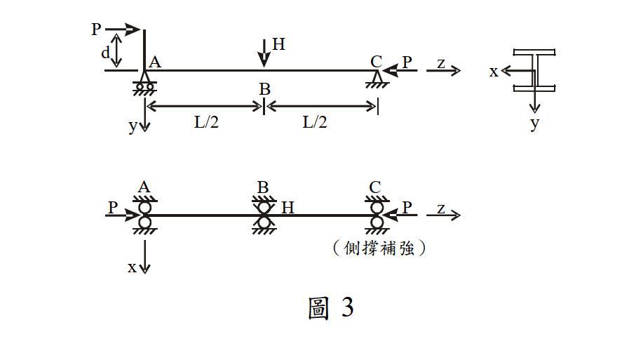

# 考題編號：SS-2008-4

**主分類：** `4.1.3` 梁柱桿件
**副分類：** 無
**設計法：** ASD
**標籤：** `梁柱桿件` `ASD` `P-M互制` `偏心軸壓` `側向力` `有效長度` `Fa` `Fbx` `穩定方程式` `強度方程式`

---

## 1. 原始題目重述 (Problem Restatement)

W 型鋼梁柱構件，總長 $L = 12$ m，在 A、B、C 三點有側向束制。

**載重：**
- 偏心軸壓力 $P$（偏心距 $d = 25$ cm，施加於端點 A）
- 側向力 $H = 2.5$ t（施加於中點 B，y 方向）

**已知：** $K_x = K_y = 1.0$，$C_m = 1.0$，A36 鋼材 $F_y = 2.5$ t/cm²，$E = 2040$ t/cm²

**斷面參數：**

| 參數 | 數值 | 參數 | 數值 |
|------|------|------|------|
| $A$ | 76 cm² | $S_x$ | 851 cm³ |
| $d$ (斷面深度) | 30.3 cm | $r_y$ | 4.91 cm |
| $b_f$ | 20.3 cm | $r_x$ | 13 cm |
| $t_f$ | 1.31 cm | $I_y$ | 1830 cm⁴ |
| $t_w$ | 0.749 cm | $E$ | 2040 t/cm² |



*圖說：水平梁柱構件，總長L=12m，A為左端（施偏心P，偏心距d=25cm在斷面深度方向），B為中點（施H=2.5t側向力向下），C為右端（P集中在斷面形心）。A、B、C均有側撐。斷面為W型鋼，x為強軸，y為弱軸。*

---

## 2. 考題核心精神與出題者意圖 (Core Concepts & Examiner's Intent)

ASD 梁柱互制方程式：同時考量偏心（端部彎矩）與橫向載重（H），需決定彎矩分布，再套用穩定及強度兩個互制方程式求解最大允許 P。

**出題者意圖：**
1. 正確建立彎矩圖（偏心矩 + H 的疊加）
2. 辨別有效長度方向（強軸用全長，弱軸用半跨）
3. 同時解穩定方程式（Eq.1）與強度方程式（Eq.2），取控制值

---

## 3. 解題戰略地圖與陷阱分析 (Strategic Roadmap & Trap Analysis)

**解題順序：**
```
① 建立彎矩圖（偏心 P×d 端矩 + H 三角形矩）
② 計算 Cc、Fa（弱軸 KyLy/ry 控制）
③ 計算 Fbx（ASD LTB 公式）
④ 計算 F'ex（強軸，全長）
⑤ 判斷 fa/Fa > 0.15，套用兩個互制方程式求 P
```

**關鍵陷阱：**

| 陷阱 | 錯誤 | 正確 |
|------|------|------|
| 有效長度判斷 | 強軸弱軸都用 L/2 | 弱軸用 L/2（受中點束制），強軸用全長 L |
| 彎矩最大位置 | 誤以為在端點 A | P < 60 t 時最大彎矩在 B（兩種載重疊加） |
| 兩個方程式的 fbx | 方程式 2 用端矩 | 兩個方程式都用 M_max（在 B）|
| F'ex 對應軸 | 用弱軸計算 | F'ex 用強軸有效長度（彎曲所在平面）|

---

## 3.5 變數層次分析（Variable Hierarchy Analysis）

> 複習提示：解題後，在每個卡住的知識點「卡關?」欄標記 `⚠`；第二次複習時只看有 `⚠` 的項目。

**最終目標：** 建立彎矩圖（偏心矩 $Pd$ + 橫向 $H$）→ 求 $F_a, F_{bx}, F'_{ex}$ → 聯立穩定（Eq.1）與強度（Eq.2）互制方程式 → 穩定方程式控制 → $P_{max} \approx 11.1$ t

### 主要公式（$\boxed{\phantom{x}}$ = 未知，待推導）

$$M_B = \frac{P \cdot d \cdot (L - L/2)}{L} + \frac{HL}{4} = 12.5P + 750 \text{ (t·cm)}$$

$$\boxed{F_a} = \frac{[1-(KL/r)^2/(2C_c^2)]F_y}{FS}, \quad \boxed{F'_{ex}} = \frac{12\pi^2 E}{23(K_x L_x/r_x)^2}$$

$$\text{Eq.1: } \frac{f_a}{F_a} + \frac{C_m f_{bx}}{(1 - f_a/F'_{ex})F_{bx}} \leq 1, \quad \text{Eq.2: } \frac{f_a}{0.6F_y} + \frac{f_{bx}}{F_{bx}} \leq 1$$

$$\boxed{P_{max}} = \min(P_{\text{Eq.1}},\, P_{\text{Eq.2}}) \approx 11.1 \text{ t}$$

### L1：題目直接給定

| 符號 | 數值 | 說明 |
|------|------|------|
| $L$ | 12 m = 1200 cm | 梁柱總長 |
| $d_{\text{偏心}}$ | 25 cm | 偏心距（載重偏心） |
| $H$ | 2.5 t | 側向力（施於中點 B） |
| $K_x = K_y$ | 1.0 | 有效長度係數 |
| $C_m$ | 1.0 | 彎矩放大係數（題目給定，含側向載重） |
| $F_y$ | 2.5 t/cm² | 降伏應力（A36） |
| $E$ | 2040 t/cm² | 彈性模數 |
| $A$ | 76 cm² | 斷面積 |
| $S_x$ | 851 cm³ | 彈性斷面模數（強軸） |
| $r_x$ | 13 cm | 強軸迴轉半徑 |
| $r_y$ | 4.91 cm | 弱軸迴轉半徑 |
| $b_f$ | 20.3 cm | 翼板寬度 |
| $t_f$ | 1.31 cm | 翼板厚度 |
| $t_w$ | 0.749 cm | 腹板厚度 |
| $I_y$ | 1830 cm⁴ | 弱軸慣性矩 |

### L2：需知識點推導

**Step 1：有效長度與彎矩圖**

| 符號 | 公式 / 來源 | 卡關? |
|------|------------|:-----:|
| $K_x L_x$ | $1.0 \times 1200 = 1200$ cm（強軸，B 點束制不阻止面內撓曲） | |
| $K_y L_y$ | $1.0 \times 600 = 600$ cm（弱軸，B 點阻止弱軸位移） | |
| $M_A$ | $P \times 25 = 25P$ t·cm（偏心矩） | |
| $M_H\|_{B}$ | $HL/4 = 2.5 \times 1200/4 = 750$ t·cm | |
| $M_B$ | $12.5P + 750$ t·cm（最大，$P < 60$ t 時） | |

**Step 2：柱強度 $F_a$（弱軸控制）**

| 符號 | 公式 / 來源 | 卡關? |
|------|------------|:-----:|
| $C_c$ | $\sqrt{2\pi^2 E/F_y} = 126.9$ | |
| $(KL/r)_y$ | $600/4.91 = 122.2$（控制） | |
| $FS$ | $5/3 + 3(KL/r)/(8C_c) - (KL/r)^3/(8C_c^3) = 1.916$ | |
| $F_a$ | 非彈性挫屈公式 → $0.700$ t/cm² | |

**Step 3：容許撓曲應力 $F_{bx}$**

| 符號 | 公式 / 來源 | 卡關? |
|------|------------|:-----:|
| $r_T$ | $\sqrt{(I_y/2)/(A_f + A_w/6)} = 5.52$ cm | |
| $L/r_T$ | $600/5.52 = 108.7$（$C_b = 1.75$） | |
| 適用公式 | $70.8 < 108.7 < 158.3$ → 用非彈性 LTB (7.2-6) | |
| $F_{b,(7.2\text{-}6)}$ | $1.275$ t/cm²；$F_{b,(7.2\text{-}8)} = 2.15 > 0.6F_y$ → 取大值並蓋頂 | |
| $F_{bx}$ | $0.6F_y = 1.5$ t/cm² | |

**Step 4：歐拉應力 $F'_{ex}$**

| 符號 | 公式 / 來源 | 卡關? |
|------|------------|:-----:|
| $F'_{ex}$ | $12\pi^2 E/[23(K_xL_x/r_x)^2] = 12\pi^2\times2040/[23\times(1200/13)^2] = 1.232$ t/cm² | |

**Step 5：互制方程式求 P**

| 符號 | 公式 / 來源 | 卡關? |
|------|------------|:-----:|
| $fa/Fa > 0.15$ 判斷 | $P > 7.98$ t → 用完整互制方程式 | |
| $P_{\text{Eq.1}}$ | 穩定方程式 → 二次方程式 → $P \approx 11.1$ t（控制） | |
| $P_{\text{Eq.2}}$ | 強度方程式 → 線性 → $P \approx 22.2$ t | |

### L3：深層知識（不懂就卡住）

| 知識點 | 說明 | 補強頁 | 卡關? |
|--------|------|:------:|:-----:|
| ASD 柱設計 / $C_c$ / $F_a$ | $C_c$ 分界彈性/非彈性挫屈；$KL/r < C_c$ 用中等細長比公式，$> C_c$ 用彈性公式 | [[asd-column]] | |
| 強軸 vs 弱軸有效長度判斷 | B 點束制只阻止弱軸位移（$K_yL_y = L/2$），不影響強軸面內彎曲（$K_xL_x = L$） | [[effective-length-chart]] | |
| ASD LTB 公式取大值 | (7.2-6)/(7.2-7) 與 (7.2-8) 各近似不同扭轉機制，取大值；再蓋 $0.6F_y$ 上限 | [[LATERAL-TORSIONAL-BUCKLING]] | |
| $F'_{ex}$ 的定義 | 強軸歐拉應力（彎曲平面，用 $K_xL_x/r_x$），用於穩定方程式放大係數 | | |
| $C_m = 1.0$ 的條件 | 含橫向載重構件用 $C_m = 1.0$（保守）；純端矩構件用 $0.6 - 0.4(M_1/M_2)$ | | |
| 穩定 vs 強度方程式 | Eq.1 含 P-Δ 放大（$1/(1-fa/F'_{ex})$），為主控方程；Eq.2 驗斷面承載，兩者取控制 | [[asd-column]] | |

---

## 4. 步驟化詳細計算過程 (Step-by-Step Detailed Calculation)

### Step 1：建立彎矩分布

**有效長度設定：**
- 強軸（x 軸）：$K_x L_x = 1.0 \times 1200 = 1200$ cm（端點 A、C 為鉸，B 的束制不阻止強軸面內位移）
- 弱軸（y 軸）：$K_y L_y = 1.0 \times 600 = 600$ cm（B 點束制阻止弱軸位移，各段 $L_b = 600$ cm）

**彎矩疊加（A、C 為鉸支，偏心矩 $M_A = P \cdot d$ 施加於 A 端）：**

偏心矩引起的彎矩（線性分布，從 A 到 C）：
$$M_{ecc}(x) = P \cdot d \cdot \left(1 - \frac{x}{L}\right) = 25P\left(1 - \frac{x}{1200}\right)$$

H 引起的彎矩（三角形，峰值在 B）：
$$M_H\bigg|_{x=600} = \frac{H \cdot L}{4} = \frac{2.5 \times 1200}{4} = 750 \text{ t·cm}$$

**各點總彎矩（兩者同向相加）：**

| 位置 | $x$ (cm) | $M$ (t·cm) |
|------|----------|------------|
| A | 0 | $25P$ |
| B（中點） | 600 | $12.5P + 750$（← 最大，當 $P < 60$ t）|
| C | 1200 | 0 |

> **驗證最大彎矩在 B：** 僅當 $P < 60$ t 時成立（$dM/dx = -25P/1200 + 1.25 > 0$ 時彎矩向 B 遞增）。由最終結果 $P \approx 11$ t < 60 t，故 $M_{max} = M_B = 12.5P + 750$。

---

### Step 2：柱強度 $F_a$

**Cc（臨界細長比）：**

$$C_c = \sqrt{\frac{2\pi^2 E}{F_y}} = \sqrt{\frac{2\pi^2 \times 2040}{2.5}} = \sqrt{16,109} = 126.9$$

**控制細長比：**

$$\frac{K_x L_x}{r_x} = \frac{1200}{13} = 92.3$$

$$\frac{K_y L_y}{r_y} = \frac{600}{4.91} = 122.2 \leftarrow \text{控制}$$

$122.2 < C_c = 126.9$ → 非彈性挫屈，用中等細長比公式：

**安全係數 FS：**

$$FS = \frac{5}{3} + \frac{3(KL/r)}{8C_c} - \frac{(KL/r)^3}{8C_c^3}$$

$$= 1.667 + \frac{3 \times 122.2}{8 \times 126.9} - \frac{(122.2)^3}{8 \times (126.9)^3}$$

$$= 1.667 + \frac{366.6}{1015.2} - \frac{1{,}823{,}588}{16{,}348{,}000} = 1.667 + 0.361 - 0.112 = 1.916$$

**容許壓應力 Fa：**

$$F_a = \frac{\left[1 - \dfrac{(KL/r)^2}{2C_c^2}\right]F_y}{FS} = \frac{\left[1 - \dfrac{14{,}932.8}{32{,}207}\right] \times 2.5}{1.916} = \frac{0.5364 \times 2.5}{1.916} = \mathbf{0.700 \text{ t/cm}^2}$$

---

### Step 3：容許撓曲應力 $F_{bx}$

**計算 $r_T$（壓力翼板 T 斷面之迴轉半徑）：**

$$r_T = \sqrt{\frac{I_y/2}{A_f + A_w/6}}$$

$$A_f = b_f \cdot t_f = 20.3 \times 1.31 = 26.59 \text{ cm}^2$$

$$A_w = (d - 2t_f) \cdot t_w = (30.3 - 2 \times 1.31) \times 0.749 = 27.68 \times 0.749 = 20.73 \text{ cm}^2$$

$$r_T = \sqrt{\frac{1830/2}{26.59 + 20.73/6}} = \sqrt{\frac{915}{26.59 + 3.455}} = \sqrt{\frac{915}{30.045}} = \sqrt{30.46} = 5.52 \text{ cm}$$

**判斷 LTB 公式適用範圍（$L_b = 600$ cm，$C_b = 1.75$ for segment B-C）：**

$$L/r_T = 600/5.52 = 108.7$$

$$\sqrt{\frac{7160 C_b}{F_y}} = \sqrt{\frac{7160 \times 1.75}{2.5}} = \sqrt{5012} = 70.8$$

$$\sqrt{\frac{35800 C_b}{F_y}} = \sqrt{\frac{35800 \times 1.75}{2.5}} = \sqrt{25060} = 158.3$$

$70.8 < 108.7 < 158.3$ → 使用非彈性 LTB 公式 (7.2-6)：

$$F_{b,(7.2\text{-}6)} = \left[\frac{2}{3} - \frac{F_y (L/r_T)^2}{107600 C_b}\right] F_y = \left[0.667 - \frac{2.5 \times 108.7^2}{107600 \times 1.75}\right] \times 2.5$$

$$= \left[0.667 - \frac{29{,}540}{188{,}300}\right] \times 2.5 = [0.667 - 0.157] \times 2.5 = 0.510 \times 2.5 = 1.275 \text{ t/cm}^2$$

**公式 (7.2-8) 校核：**

$$\frac{L_d}{A_f} = \frac{600 \times 30.3}{26.59} = 683.6$$

$$F_{b,(7.2\text{-}8)} = \frac{840 C_b}{L_d/A_f} = \frac{840 \times 1.75}{683.6} = 2.15 \text{ t/cm}^2 > 0.6F_y = 1.5 \text{ t/cm}^2$$

取兩公式較大值，但不超過 $0.6F_y$：

$$\boxed{F_{bx} = \max(1.275, 2.15) = 2.15 \text{ t/cm}^2 \to \text{蓋頂} \to F_{bx} = 0.6F_y = 1.5 \text{ t/cm}^2}$$

---

### Step 4：歐拉應力 $F'_{ex}$

（彎曲在強軸平面，用強軸有效長度 $K_x L_x = 1200$ cm）

$$F'_{ex} = \frac{12\pi^2 E}{23(K_x L_x/r_x)^2} = \frac{12\pi^2 \times 2040}{23 \times (1200/13)^2} = \frac{241{,}570}{23 \times 8521} = \frac{241{,}570}{195{,}983} = 1.232 \text{ t/cm}^2$$

---

### Step 5：互制方程式（判斷適用情況）

**$f_a/F_a > 0.15$ 的 P 門檻：**
$P/(76 \times 0.700) > 0.15 \Rightarrow P > 7.98$ t

最終 P 必定 > 8 t，故使用**完整互制方程式（fa/Fa > 0.15 情況）**：

---

**方程式 1（穩定，Stability）：**

$$\frac{f_a}{F_a} + \frac{C_m f_{bx}}{\left(1 - \dfrac{f_a}{F'_{ex}}\right) F_{bx}} \leq 1$$

$$\frac{P/76}{0.700} + \frac{1.0 \times (12.5P + 750)/851}{\left(1 - \dfrac{P/76}{1.232}\right) \times 1.5} = 1$$

$$\frac{P}{53.2} + \frac{12.5P + 750}{1276.5\left(1 - \dfrac{P}{93.63}\right)} = 1 \quad \cdots (1)$$

整理為一元二次方程式：

令 $\alpha = 1/53.2$，$\beta = 12.5/1276.5$，$\gamma = 750/1276.5 = 0.5877$，$\kappa = 1/93.63$

$$\alpha\kappa P^2 - (\alpha + \beta + \kappa)P + (1 - \gamma) = 0$$

$$0.000201 P^2 - 0.039269 P + 0.4123 = 0$$

除以 $0.000201$：

$$P^2 - 195.4P + 2051 = 0$$

$$P = \frac{195.4 \pm \sqrt{195.4^2 - 4 \times 2051}}{2} = \frac{195.4 \pm \sqrt{38{,}181 - 8{,}204}}{2} = \frac{195.4 \pm \sqrt{29{,}977}}{2}$$

$$= \frac{195.4 \pm 173.1}{2}$$

取較小根（物理解）：

$$\boxed{P_{max,1} = \frac{195.4 - 173.1}{2} = \frac{22.3}{2} \approx 11.1 \text{ t}}$$

---

**方程式 2（強度，Yielding）：**

$$\frac{f_a}{0.6F_y} + \frac{f_{bx}}{F_{bx}} \leq 1$$

$$\frac{P/76}{1.5} + \frac{(12.5P + 750)/851}{1.5} = 1$$

$$\frac{P}{114} + \frac{12.5P + 750}{1276.5} = 1$$

$$P\left(\frac{1}{114} + \frac{12.5}{1276.5}\right) = 1 - \frac{750}{1276.5}$$

$$P \times 0.018565 = 0.4123$$

$$P_{max,2} = \frac{0.4123}{0.018565} \approx 22.2 \text{ t}$$

---

**控制方程式：** 方程式 1（穩定）控制

$$\boxed{P_{max} \approx 11.1 \text{ t}}$$

---

### Step 6：驗算

以 $P = 11.1$ t 代入方程式 1：

$$f_a = 11.1/76 = 0.1461 \text{ t/cm}^2, \quad f_a/F_a = 0.1461/0.700 = 0.209 > 0.15 \checkmark$$

$$1 - f_a/F'_{ex} = 1 - 0.1461/1.232 = 0.881$$

$$M_B = 12.5(11.1) + 750 = 888.8 \text{ t·cm}, \quad f_{bx} = 888.8/851 = 1.044 \text{ t/cm}^2$$

$$\text{方程式 1} = 0.209 + \frac{1.0 \times 1.044}{0.881 \times 1.5} = 0.209 + \frac{1.044}{1.322} = 0.209 + 0.790 = 0.999 \approx 1.00 \checkmark$$

$$\text{方程式 2} = \frac{0.1461}{1.5} + \frac{1.044}{1.5} = 0.097 + 0.696 = 0.793 < 1 \checkmark$$

---

## 5. 關鍵爭議點與進階探討 (Critical Issues & Advanced Discussion)

### 強軸 vs 弱軸的有效長度選取

本題的關鍵設計決策：

| 項目 | 強軸（x 軸） | 弱軸（y 軸） |
|------|------------|------------|
| 束制方向 | 面內，B 點無阻止面內撓曲 | 面外，B 點阻止弱軸位移 |
| 有效長度 | $K_x L = 1200$ cm | $K_y L/2 = 600$ cm |
| 細長比 | 92.3 | 122.2（**控制** $F_a$）|

### Cm = 1.0 的意義

$C_m = 1.0$ 適用於有橫向載重（如 H）的構件。若僅有端部彎矩：
$$C_m = 0.6 - 0.4(M_A/M_B) = 0.6 - 0.4 \times \frac{25P}{12.5P+750}$$

本題以較保守的 $C_m = 1.0$ 給定，體現「橫向載重造成撓度放大」的考量。

### 二階效應的物理意義

穩定方程式中的放大係數 $1/(1 - f_a/F'_{ex})$：
- 當 $f_a \to F'_{ex}$（歐拉臨界應力），放大係數 $\to \infty$（理論上挫屈）
- 本題：$f_a/F'_{ex} = 0.119$，放大係數 = $1/0.881 = 1.135$（約 13.5% 放大）

偏心矩 $P \times d$ + 橫向 $H$，加上 P-Δ 放大，使容許 P 僅約 11.1 t（約為純壓容許值 $F_a \times A = 0.700 \times 76 = 53.2$ t 的 20.9%）。
