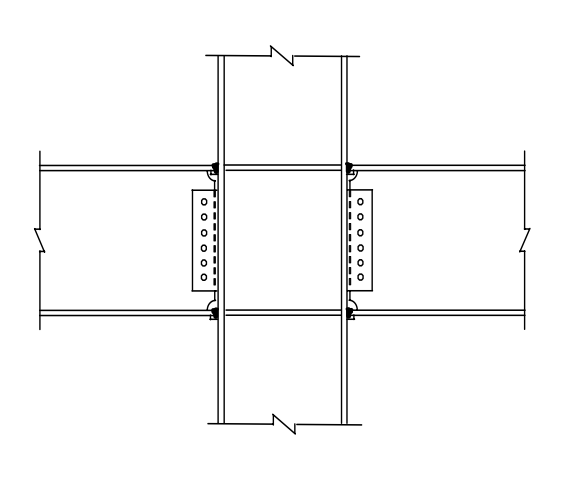

# 考題編號：SS-2009-1

**主分類：** `6.3.1` 結構耐震設計
**副分類：** `4.1.3` 梁柱桿件
**設計法：** LRFD
**標籤：** `強柱弱梁` `梁柱彎矩強度比` `P-M互制` `耐震設計` `韌性抗彎矩構架` `SMRF` `容量設計` `P-M互制曲線` `交互作用方程式`

---

## 1. 原始題目重述 (Problem Restatement)

如右圖所示鋼結構建築之梁柱構材示意圖：

1. 進行鋼骨建築耐震設計時，依據我國鋼結構極限設計法規範，說明如何滿足強柱弱梁（Strong Column Weak Beam）之梁柱彎矩強度比（Moment Strength Ratio）之要求？（10 分）
2. 對於鋼結構建築之鋼柱，依據我國鋼結構極限設計法規範，繪出鋼柱受軸壓力（P）與單軸向彎矩（M）共同作用下之交互作用曲線圖（P-M Interaction Curve）。（15 分）



*圖說：一般型梁柱接頭立面示意。H型柱（垂直）貫通，左右各有一 H型梁（水平），梁腹板以高拉力螺栓連結剪力板（shear tab），翼板採全滲透對接銲（CJP groove weld）。此為「韌性抗彎矩構架（SMRF）」之典型接頭型式。*

---

## 2. 考題核心精神與出題者意圖 (Core Concepts & Examiner's Intent)

**核心觀念：耐震容量設計——強柱弱梁與 P-M 互制**

此題為 SMRF 耐震設計的核心概念題，測驗考生對「容量設計（Capacity Design）」原則的理解，以及鋼柱 LRFD 設計的 P-M 互制曲線（兩段折線型式）。容量設計的精髓：讓設計者能**控制塑性鉸發生的位置**（梁端，而非柱端），使整體構架在地震下具備穩定的能量消散機制。

**出題者測驗重點：**

- **強柱弱梁的物理意義**：$\sum M_{pc}^* > \sum M_{pb}^*$ 代表柱端強度恆大於梁端，確保梁先降伏
- **$1.1 R_y$ 超強係數的來源**：鋼材實際降伏強度往往高於標稱值，$1.1 R_y$ 是梁端「最壞情況」的強度估計
- **P-M 折點 B 在 $P = 0.2\phi_c P_n$**：兩段折線是對橢圓型真實 P-M 曲面的簡化，折點是兩段公式的銜接點
- **$\phi_c = 0.85$ vs $\phi_b = 0.90$**：軸壓不確定性較大（0.85），彎曲不確定性較小（0.90）

---

## 3. 解題戰略地圖與陷阱分析 (Strategic Roadmap & Trap Analysis)

**作戰計畫：**
```
(一) 強柱弱梁：
  Step 1  寫出驗算不等式 ΣM*pc > ΣM*pb
  Step 2  定義 M*pc = Zc(Fyc − Pu/Ag)（含軸力折減）
  Step 3  定義 M*pb = Σ(1.1RyFybZb + Mv)（含超強與剪力附加彎矩）

(二) P-M 互制曲線：
  Step 4  列出兩段公式（高軸力 Pu/φcPn ≥ 0.2，低軸力 < 0.2）
  Step 5  計算 A、B、C 三個控制點（純壓、折點、純彎）
  Step 6  繪製折線圖，標示兩段
```

**陷阱分析：**

| 陷阱 | 說明 | 對策 |
|------|------|------|
| ❶ $1.1R_y$ 方向 | $1.1R_y$ 乘在**梁端**強度（被估計的「超強」），而非柱端 | $M_{pb}^* = \sum(1.1R_yF_{yb}Z_b + M_v)$ |
| ❷ 折點 B 的 P 值 | 折點在 $P = 0.2\phi_c P_n$，而非 $P = 0.5\phi_c P_n$ | 代入兩段公式驗算折點相等 |
| ❸ $\phi_c$ 與 $\phi_b$ 搞混 | 軸壓：$\phi_c = 0.85$；彎曲：$\phi_b = 0.90$ | 壓力安全係數較保守（0.85） |
| ❹ 屋頂層例外 | 屋頂層柱頂不需滿足強柱弱梁要求 | 規範明文例外，答題時需提及 |

---

## 3.5 變數層次分析（Variable Hierarchy Analysis）

> 複習提示：解題後，在每個卡住的知識點「卡關?」欄標記 `⚠`；第二次複習時只看有 `⚠` 的項目。

**最終目標：** （一）說明強柱弱梁不等式 $\sum M_{pc}^* > \sum M_{pb}^*$ 的計算流程；（二）繪出 LRFD P-M 互制曲線（A-B-C 折線，折點在 $P = 0.2\phi_c P_n$）

### 主要公式（$\boxed{\phantom{x}}$ = 未知，待推導）

$$\text{(一)}\quad \sum M_{pc}^* = \sum Z_c\!\left(F_{yc} - \frac{P_u}{A_g}\right) > \sum M_{pb}^* = \sum\!\left(1.1\,R_y F_{yb} Z_b + M_v\right)$$

$$\text{(二) 高軸力段：} \frac{P_u}{\phi_c P_n} + \frac{8}{9}\cdot\frac{M_u}{\phi_b M_n} \leq 1.0 \quad \left(\frac{P_u}{\phi_c P_n} \geq 0.2\right)$$

$$\text{低軸力段：} \frac{P_u}{2\phi_c P_n} + \frac{M_u}{\phi_b M_n} \leq 1.0 \quad \left(\frac{P_u}{\phi_c P_n} < 0.2\right)$$

### L1：題目直接給定

| 符號 | 數值 | 說明 |
|------|------|------|
| 規範 | 我國鋼結構極限設計法（LRFD） | |
| 結構型式 | 韌性抗彎矩構架（SMRF） | |
| 附圖 | 典型 H 型梁柱接頭（CJP 銲接翼板 + 螺栓腹板） | |
| 子題(一) | 說明強柱弱梁計算方法（概念題，10 分） | |
| 子題(二) | 繪 P-M 互制曲線（15 分） | |

### L2：需知識點推導

**Step 1（一）：強柱弱梁不等式各項定義**

| 符號 | 公式 / 來源 | 卡關? |
|------|------------|:-----:|
| $\sum M_{pc}^*$ | $\sum Z_c(F_{yc} - P_u/A_g)$（柱端塑性矩含軸力折減） | |
| $\sum M_{pb}^*$ | $\sum(1.1R_yF_{yb}Z_b + M_v)$（梁端含超強係數與剪力附加矩） | |
| $R_y$ | A992/SN490 取 1.1；A36/SS400 取 1.5（鋼材期望降伏強度比） | |
| $M_v = V_u \cdot s_h$ | 梁端剪力乘以塑性鉸至柱中心線距離 | |

**Step 2（一）：計算流程**

| 符號 | 公式 / 來源 | 卡關? |
|------|------------|:-----:|
| 步驟 ① | 計算接頭上下柱段各自的 $M_{pc}^*$（代入各自 $P_u$） | |
| 步驟 ② | 計算接頭左右梁端各自的 $M_{pb}^*$（含 $1.1R_y$ 與 $M_v$） | |
| 步驟 ③ | 驗算：$\sum M_{pc}^* > \sum M_{pb}^*$（不含屋頂層） | |

**Step 3（二）：P-M 互制曲線三個控制點**

| 符號 | 公式 / 來源 | 卡關? |
|------|------------|:-----:|
| 點 A（純軸壓） | $(P_u, M_u) = (\phi_c P_n, 0)$ | |
| 點 B（折點） | $(P_u, M_u) = (0.2\phi_c P_n, 0.9\phi_b M_n)$（兩段公式交界） | |
| 點 C（純彎） | $(P_u, M_u) = (0, \phi_b M_n)$ | |
| 折點驗算 | 高軸力段：$0.2 + (8/9)(0.9) = 1.0$ ✓；低軸力段：$0.1 + 0.9 = 1.0$ ✓ | |

### L3：深層知識（不懂就卡住）

| 知識點 | 說明 | 補強頁 | 卡關? |
|--------|------|:------:|:-----:|
| P-M 互制 / H1-1a vs H1-1b | 折點在 $P = 0.2\phi_c P_n$；高軸力段斜率陡，低軸力段斜率平 | [[pm-interaction]] · [[BEAM-COLUMN-INTERACTION]] | |
| $\phi_c = 0.85$ vs $\phi_b = 0.90$ | 軸壓不確定性較高用 0.85；彎曲不確定性較低用 0.90 | [[pm-interaction]] | |
| $1.1R_y$ 超強係數 | 鋼材實際降伏強度 > 標稱值，梁端最壞情況強度估計；若低估則柱端仍可能先降伏 | | |
| 強柱弱梁的屋頂層例外 | 屋頂層柱頂不需驗算；該層無上方柱，不會形成整體柱機構 | | |
| 容量設計（Capacity Design）原則 | 控制塑性鉸位置（梁端）→ 梁機構（全局）vs 側移機構（局部層崩塌） | | |
| $M_v$ 的必要性 | 塑性鉸位置通常不在柱面（有 RBS 或加強板），剪力引起的附加矩 $V_u s_h$ 不可省略 | | |

---

## 4. 步驟化詳細計算過程 (Step-by-Step Calculation)

### 一、強柱弱梁之彎矩強度比要求

#### 1.1 設計目的

強柱弱梁（SCWB）原則屬「容量設計（Capacity Design）」的核心概念：確保地震時**塑性鉸**優先在**梁端**形成，而非柱端，使整體構架具備穩定的能量消散機制（梁機構），避免因柱形成塑鉸而導致樓層崩塌（側移機構）。

#### 1.2 規範要求（韌性抗彎矩構架 SMRF）

在每一梁柱接頭處（屋頂層除外），須滿足：

$$\boxed{\sum M_{pc}^* > \sum M_{pb}^*}$$

**柱端彎矩強度總和 $\sum M_{pc}^*$（考量軸力折減後）：**

$$\sum M_{pc}^* = \sum Z_c \left( F_{yc} - \frac{P_u}{A_g} \right)$$

| 符號 | 說明 |
|------|------|
| $Z_c$ | 柱塑性斷面模數（強軸） |
| $F_{yc}$ | 柱鋼材降伏強度 |
| $P_u$ | 柱設計軸壓力 |
| $A_g$ | 柱全斷面積 |

**梁端最可能彎矩強度總和 $\sum M_{pb}^*$（考量鋼材超強及剪力效應）：**

$$\sum M_{pb}^* = \sum \left( 1.1\, R_y F_{yb} Z_b + M_v \right)$$

| 符號 | 說明 |
|------|------|
| $R_y$ | 鋼材期望降伏強度比（A992/SN490 取 1.1；SS400/A36 取 1.5） |
| $F_{yb}$ | 梁鋼材降伏強度 |
| $Z_b$ | 梁塑性斷面模數（強軸） |
| $M_v$ | 梁端剪力（$V_u$）乘以塑性鉸至柱中心線距離（$s_h$）之附加彎矩 |

$$M_v = V_u \cdot s_h$$

#### 1.3 計算流程

```
① 計算接頭上下柱段的 Mpc*（需代入各自 Pu）
② 計算接頭左右梁端的 Mpb*（需考量 1.1RyFybZb + Mv）
③ 驗算：ΣMpc* > ΣMpb*
④ 如不滿足 → 加大柱斷面或減小梁斷面
```

**重要說明：**
- **屋頂層例外：** 屋頂層柱頂無需滿足此要求（該處不會形成柱機構）
- **$1.1 R_y$ 的意義：** 考量鋼材實際降伏強度往往高於標稱值，反映梁端最大可能彎矩

---

### 二、P-M 交互作用曲線圖

#### 2.1 LRFD 交互作用方程式

鋼柱在軸壓力 $P_u$ 與單軸彎矩 $M_u$ 共同作用下，依規範：

**當 $\dfrac{P_u}{\phi_c P_n} \geq 0.2$（高軸力段）：**

$$\frac{P_u}{\phi_c P_n} + \frac{8}{9} \cdot \frac{M_u}{\phi_b M_n} \leq 1.0$$

**當 $\dfrac{P_u}{\phi_c P_n} < 0.2$（低軸力段）：**

$$\frac{P_u}{2\phi_c P_n} + \frac{M_u}{\phi_b M_n} \leq 1.0$$

#### 2.2 關鍵控制點

| 點 | $P_u$ | $M_u$ | 說明 |
|----|--------|--------|------|
| **A** | $\phi_c P_n$ | $0$ | 純軸壓（無彎矩） |
| **B**（折點） | $0.2\, \phi_c P_n$ | $0.9\, \phi_b M_n$ | 兩段公式交界處 |
| **C** | $0$ | $\phi_b M_n$ | 純彎矩（無軸壓） |

折點 B 驗算：高軸力公式：$0.2 + (8/9)(0.9) = 1.0$ ✓；低軸力公式：$0.2/2 + 0.9 = 1.0$ ✓

#### 2.3 P-M 交互作用曲線圖

```
P
│
φcPn ──────● A（純軸壓）
            ╲
             ╲  ← 直線段（高軸力，斜率較陡）
              ╲
0.2φcPn ────── ● B（折點）
                ╲
                 ╲ ← 直線段（低軸力，斜率較平）
                  ╲
        0 ─────────● C（純彎矩）
                    │
               φbMn       M
```

**P-M 曲線特性：**

| 特性 | 說明 |
|------|------|
| 整體形狀 | 由兩段直線組成，在 $P = 0.2\phi_c P_n$ 處有一折點 |
| 上段（AB） | 軸力主導，斜率 $= -9\phi_c P_n/(8\phi_b M_n)$ |
| 下段（BC） | 彎矩主導，斜率 $= -2\phi_c P_n/\phi_b M_n$（絕對值較小，較平） |
| 安全域 | 曲線左下方（含曲線本身）為安全，右上方為不安全 |

---

## 5. 結果彙整與驗算 (Summary & Verification)

**強柱弱梁要求彙整：**

$$\sum M_{pc}^* = \sum Z_c(F_{yc} - P_u/A_g) > \sum M_{pb}^* = \sum(1.1R_yF_{yb}Z_b + M_v)$$

**P-M 互制曲線彙整：**

$$\frac{P_u}{\phi_c P_n} \geq 0.2: \quad \frac{P_u}{\phi_c P_n} + \frac{8}{9}\frac{M_u}{\phi_b M_n} \leq 1.0$$

$$\frac{P_u}{\phi_c P_n} < 0.2: \quad \frac{P_u}{2\phi_c P_n} + \frac{M_u}{\phi_b M_n} \leq 1.0$$

**觀念精析：**

為何強柱弱梁要考量 $1.1 R_y$？鋼材實際降伏強度（$F_{y,actual}$）通常高於標稱值（$F_y$），且具有隨機性。若只用 $F_y Z_b$ 估計梁端彎矩，可能低估實際塑性鉸強度，導致強柱強度仍不足。$1.1 R_y$ 是考量「材料超強效應」的放大係數。

P-M 折點 B 在 $P = 0.2\phi_c P_n$ 出現，原因是 AISC 為了簡化計算，用兩段直線近似橢圓形的真實 P-M 強度曲面。低軸力時彎矩主導，柱受拉翼板可能達到降伏，行為類似梁；高軸力時壓力主導，整體穩定控制設計。$\phi_c = 0.85$（軸壓不確定性較高）vs $\phi_b = 0.90$（彎曲不確定性較低）。
