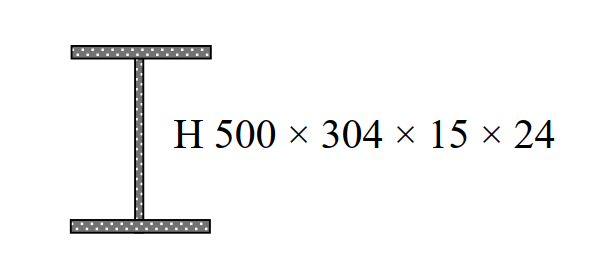

# 考題編號：SS-2009-3

**主分類：** `4.1.2` 梁桿件
**副分類：** `4.1.1` 拉力及壓力桿件
**設計法：** LRFD
**標籤：** `斷面性質` `塑性力矩` `降伏力矩` `形狀因子` `剪力強度` `λc` `弱軸挫屈` `H型鋼` `平行軸定理`

---

## 1. 原始題目重述 (Problem Restatement)

如右圖所示之鋼骨構材斷面，標示為 H 500×304×15×24（mm），鋼材 $F_y = 3.5\ \text{tf/cm}^2$，$E_s = 2{,}040\ \text{tf/cm}^2$。

1. 若作為鋼梁，求強軸之 $M_p / M_y = ?$（8 分）
2. 假設腹板不會發生剪力挫屈，求標稱剪力強度 $V_n = ?$（8 分）
3. 若作為鋼柱，弱軸有效長度 $K_y L_y = 4\ \text{m}$，求弱軸 $\lambda_c = ?$（9 分）



*圖說：H 型鋼斷面 H500×304×15×24（mm）：總深 d=500mm、翼板寬 bf=304mm、腹板厚 tw=15mm、翼板厚 tf=24mm。*

---

## 2. 考題核心精神與出題者意圖 (Core Concepts & Examiner's Intent)

**核心觀念：H 型鋼斷面三大設計量——形狀因子、剪力強度、壓力細長比**

本題為一個斷面同時作為梁（子題一、二）與柱（子題三）的設計量計算，測驗考生「計算一次斷面性質，同時應用於多種設計情境」的效率與正確性。

**出題者測驗重點：**

- **形狀因子 $Z_x/S_x \approx 1.12\sim1.15$**：H 型鋼翼板面積集中，力臂已接近彈性模數所用值，形狀因子遠小於矩形（1.5）
- **$A_w = d \times t_w$（非 $h \times t_w$）**：規範定義腹板面積用**全深** $d$，這是常見筆誤
- **弱軸為控制挫屈軸**：$b_f = 30.4\text{ cm} < d = 50\text{ cm}$，故 $r_y < r_x$，弱軸細長比大
- **$\lambda_c$ 公式含 $\pi$**：$\lambda_c = (KL/r\pi)\sqrt{F_y/E}$，分母有 $\pi$，初學者常忘記

---

## 3. 解題戰略地圖與陷阱分析 (Strategic Roadmap & Trap Analysis)

**作戰計畫：**
```
前置：統一單位 cm，計算斷面幾何

(一) Mp/My：
  Step 1  Ix（平行軸定理）→ Sx → My
  Step 2  Zx（PNA 以上一次面積矩 ×2）→ Mp
  Step 3  形狀因子 = Zx/Sx

(二) Vn：
  Step 4  確認 Cv = 1（h/tw < 2.45√(E/Fy)）
  Step 5  Vn = 0.6 Fy Aw，Aw = d × tw（全深）

(三) λc：
  Step 6  Iy、ry = √(Iy/Ag)
  Step 7  λc = (KL/rπ)√(Fy/E)
```

**陷阱分析：**

| 陷阱 | 說明 | 對策 |
|------|------|------|
| ❶ $A_w$ 用錯 | $A_w = d \times t_w$（全深），非 $h \times t_w$ | AISC 規定用全深 $d$ |
| ❷ 翼板形心距算錯 | $d_f = d/2 - t_f/2$，非 $d/2$ | 翼板形心在翼板中央 |
| ❸ $Z_x$ 上半腹板 | 上半腹板高 = $d/2 - t_f = 22.6\text{ cm}$，形心在 $11.3\text{ cm}$ 處 | 清楚分拆上翼板 + 上半腹板 |
| ❹ $\lambda_c$ 分母漏 $\pi$ | $\lambda_c = (KL/r)/(\pi\sqrt{E/F_y})$ | 分母有 $\pi$ |

---

## 3.5 變數層次分析（Variable Hierarchy Analysis）

> 複習提示：解題後，在每個卡住的知識點「卡關?」欄標記 `⚠`；第二次複習時只看有 `⚠` 的項目。

**最終目標：** 計算 H500×304×15×24 斷面的形狀因子 $M_p/M_y$、標稱剪力強度 $V_n$、弱軸 $\lambda_c$

### 主要公式（$\boxed{\phantom{x}}$ = 未知，待推導）

**子題一：形狀因子**
$$\boxed{I_x} = 2\left[\frac{b_f t_f^3}{12} + b_f t_f \cdot d_f^2\right] + \frac{t_w h^3}{12}$$
$$\boxed{S_x} = \frac{\boxed{I_x}}{d/2}, \quad \boxed{Z_x} = 2\left(b_f t_f \cdot d_f + t_w \cdot \frac{(h/2)^2}{2}\right)$$
$$\boxed{M_p/M_y} = \frac{\boxed{Z_x}}{\boxed{S_x}}$$

**子題二：剪力強度**
$$\boxed{V_n} = 0.6 F_y \cdot (d \times t_w) \cdot C_v$$

**子題三：弱軸 $\lambda_c$**
$$\boxed{I_y} = 2 \times \frac{t_f b_f^3}{12} + \frac{h t_w^3}{12}, \quad \boxed{r_y} = \sqrt{\frac{\boxed{I_y}}{A_g}}$$
$$\boxed{\lambda_c} = \frac{K_y L_y}{\boxed{r_y} \cdot \pi}\sqrt{\frac{F_y}{E}}$$

### L1：題目直接給定

| 符號 | 數值 | 說明 |
|------|------|------|
| $d$ | 50.0 cm | 全深 |
| $b_f$ | 30.4 cm | 翼板寬 |
| $t_w$ | 1.5 cm | 腹板厚 |
| $t_f$ | 2.4 cm | 翼板厚 |
| $F_y$ | 3.5 tf/cm² | 降伏強度 |
| $E_s$ | 2040 tf/cm² | 彈性模數 |
| $K_y L_y$ | 400 cm | 弱軸有效長度 |

### L2：需知識點推導

**Step 1：斷面幾何量**

| 符號 | 公式 / 來源 | 卡關? |
|------|------------|:-----:|
| $h$ | $d - 2t_f = 45.2$ cm（清淨腹板高） | |
| $A_g$ | $2 b_f t_f + h t_w = 213.72$ cm² | |
| $d_f$ | $d/2 - t_f/2 = 23.8$ cm（翼板形心距全斷面形心） | |

**Step 2：形狀因子**

| 符號 | 公式 / 來源 | 卡關? |
|------|------------|:-----:|
| $I_x$ | $2[b_f t_f^3/12 + b_f t_f d_f^2] + t_w h^3/12 = 94{,}265$ cm⁴ | |
| $S_x$ | $I_x / (d/2) = 3{,}771$ cm³ | |
| $Z_x$ | PNA 以上各件一次面積矩 $\times 2 = 4{,}239$ cm³ | |
| $M_p/M_y$ | $Z_x / S_x = 1.124$ | |

**Step 3：標稱剪力強度**

| 符號 | 公式 / 來源 | 卡關? |
|------|------------|:-----:|
| $h/t_w$ | $45.2/1.5 = 30.1$ | |
| $C_v$ | $30.1 < 2.45\sqrt{E/F_y} = 59.1$ → $C_v = 1.0$ | |
| $A_w$ | $d \times t_w = 75.0$ cm²（**全深** $d$，非淨高 $h$） | |
| $V_n$ | $0.6 \times 3.5 \times 75.0 \times 1.0 = 157.5$ tf | |

**Step 4：弱軸 $\lambda_c$**

| 符號 | 公式 / 來源 | 卡關? |
|------|------------|:-----:|
| $I_y$ | $2 \times t_f b_f^3/12 + h t_w^3/12 = 11{,}251$ cm⁴ | |
| $r_y$ | $\sqrt{I_y/A_g} = 7.255$ cm | |
| $kL/r_y$ | $400/7.255 = 55.1$ | |
| $\lambda_c$ | $(55.1/\pi)\sqrt{3.5/2040} = 0.727$ | |

### L3：深層知識（不懂就卡住）

| 知識點 | 說明 | 補強頁 | 卡關? |
|--------|------|:------:|:-----:|
| $Z_x$ 計算（I 形斷面） | PNA 以上各件對 PNA 一次面積矩之和；翼板形心距 $d_f = d/2 - t_f/2$，非 $d/2$ | [[plastic-zx]] | |
| $A_w = d \times t_w$（全深） | AISC 規定腹板剪力面積用全深 $d$，非淨高 $h$；用錯會低估 $V_n$ | [[SHEAR-BUCKLING-WEB]] | |
| $C_v = 1.0$ 的判斷條件 | $h/t_w \leq 2.45\sqrt{E/F_y}$ 時，腹板無剪力挫屈，$C_v = 1.0$ | | |
| $\lambda_c$ 公式分母含 $\pi$ | $\lambda_c = (kL/r)/(\pi\sqrt{E/F_y})$；漏掉 $\pi$ 會使 $\lambda_c$ 高估約 3.14 倍 | [[lrfd-column]] · [[COLUMN-STRENGTH-CURVE]] | |
| 弱軸為 Y 軸的理由 | $b_f < d$，故 $I_y < I_x$；翼板繞弱軸慣性矩靠板寬三次方，遠小於強軸 | | |
| 殘留應力 / 切線模數 | $\lambda_c = 0.727 \leq 1.5$ → 非彈性挫屈段，殘留應力使有效剛度下降 | [[RESIDUAL-STRESS]] · [[TANGENT-MODULUS-THEORY]] | |

---

## 4. 步驟化詳細計算過程 (Step-by-Step Calculation)

### 斷面幾何（cm 單位）

| 參數 | 符號 | 數值 |
|------|------|------|
| 全深 | $d$ | $50.0\ \text{cm}$ |
| 翼板寬 | $b_f$ | $30.4\ \text{cm}$ |
| 腹板厚 | $t_w$ | $1.5\ \text{cm}$ |
| 翼板厚 | $t_f$ | $2.4\ \text{cm}$ |
| 清淨腹板高 | $h$ | $45.2\ \text{cm}$ |
| 全斷面積 | $A_g$ | $213.72\ \text{cm}^2$ |

---

### 一、$M_p / M_y$（形狀因子）

翼板形心距全斷面形心：$d_f = 25.0 - 1.2 = 23.8\ \text{cm}$

$$I_x = 2\left[\frac{30.4 \times 2.4^3}{12} + 72.96 \times 23.8^2\right] + \frac{1.5 \times 45.2^3}{12} = 82{,}722 + 11{,}543 = \mathbf{94{,}265\ \text{cm}^4}$$

$$S_x = \frac{94{,}265}{25} = 3{,}771\ \text{cm}^3; \quad M_y = 3.5 \times 3{,}771 = 13{,}198\ \text{tf·cm}$$

PNA 以上一次面積矩（PNA 在 $y = 25\ \text{cm}$）：

| 構件 | $A_i$ | $\bar{e}_i$ | $A_i\bar{e}_i$ |
|------|-------|-------------|----------------|
| 上翼板 | $72.96$ | $23.8$ | $1{,}736.4$ |
| 上半腹板（$h/2=22.6$cm） | $33.9$ | $11.3$ | $383.1$ |

$$Z_x = 2 \times 2{,}119.5 = 4{,}239\ \text{cm}^3; \quad M_p = 3.5 \times 4{,}239 = 14{,}837\ \text{tf·cm}$$

$$\boxed{\frac{M_p}{M_y} = \frac{4{,}239}{3{,}771} \approx 1.124}$$

---

### 二、標稱剪力強度 $V_n$

$$\frac{h}{t_w} = \frac{45.2}{1.5} = 30.1 < 2.45\sqrt{\frac{2{,}040}{3.5}} = 59.1 \quad \Rightarrow C_v = 1.0$$

$$A_w = d \times t_w = 50.0 \times 1.5 = 75.0\ \text{cm}^2$$

$$\boxed{V_n = 0.6 \times 3.5 \times 75.0 \times 1.0 = 157.5\ \text{tf}}$$

---

### 三、弱軸 $\lambda_c$

$$I_y = 2 \times \frac{2.4 \times 30.4^3}{12} + \frac{45.2 \times 1.5^3}{12} = 11{,}238 + 12.7 = 11{,}251\ \text{cm}^4$$

$$r_y = \sqrt{\frac{11{,}251}{213.72}} = 7.255\ \text{cm}; \quad \frac{K_y L_y}{r_y} = \frac{400}{7.255} = 55.1$$

$$\boxed{\lambda_c = \frac{400}{7.255 \times \pi}\sqrt{\frac{3.5}{2{,}040}} = 17.55 \times 0.04143 = 0.727}$$

$\lambda_c = 0.727 \leq 1.5$，非彈性挫屈段，$F_{cr} = 0.658^{0.529} \times 3.5 = 2.80\ \text{tf/cm}^2$（供參）

---

## 5. 結果彙整與驗算 (Summary & Verification)

| 項目 | 計算結果 |
|------|---------|
| $I_x$ | $94{,}265\ \text{cm}^4$ |
| $S_x$ / $Z_x$ | $3{,}771$ / $4{,}239\ \text{cm}^3$ |
| **$M_p / M_y$（形狀因子）** | **$1.124$** |
| $A_w = d \times t_w$ | $75.0\ \text{cm}^2$ |
| **$V_n$** | **$157.5\ \text{tf}$** |
| $r_y$ | $7.255\ \text{cm}$ |
| **$\lambda_c$** | **$0.727$** |

**觀念精析：**

H 型鋼形狀因子 $\approx 1.12\sim1.15$：翼板面積集中在遠離形心處，塑性儲備已接近彈性極限，遠小於矩形斷面（1.5）。

$A_w = d \times t_w$ 而非 $h \times t_w$：AISC 定義腹板剪力面積用全深 $d$，含角落翼腹交界的剪力流貢獻。

弱軸 $r_y \ll r_x$ 的原因：翼板寬 $b_f < $ 全深 $d$，弱軸慣性矩 $I_y$ 主要靠翼板（形如薄板繞窄邊），而強軸靠翼板遠離形心（力臂大），故 $r_y < r_x$，弱軸為控制挫屈軸。
