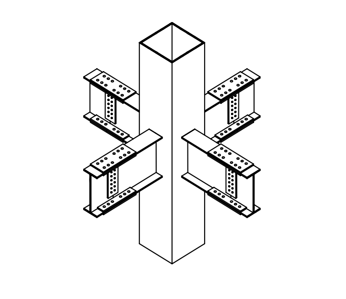

# 考題編號：SS-2009-4

**主分類：** `4.1.4` 接合之分析與設計
**副分類：** `4.2.3` 設計規範對施工之要求
**設計法：** 概念題
**標籤：** `銲接` `高拉力螺栓` `開槽銲` `Single V` `Single Bevel` `SAW潛弧銲` `UT超音波` `NDT` `螺栓間距` `預拉力` `施工規範`

---

## 1. 原始題目重述 (Problem Restatement)

如右圖所示鋼結構建築的梁柱接頭示意圖，依據我國鋼結構設計與施工相關規範，試回答有關「銲接（Welding）」與「高強度螺栓（High Strength Bolt）」之問題（每小題 5 分，共 25 分）：

1. 開槽銲接（Groove Weld）型式中，說明「Single V」與「Single Bevel」開槽方式之差異
2. 「SAW」之英文全名及中文譯名
3. 「UT」之英文全名及中文譯名
4. 相鄰螺栓孔中心至中心的距離，不得小於多少倍之螺栓標稱直徑？
5. 鎖緊螺栓之最小預拉力應達到多少倍的螺栓最小抗拉強度 $F_u$？



*圖說：箱型鋼柱（方管斷面，垂直貫通）與四方向 H 型鋼梁的梁柱接頭。梁腹板：以高拉力螺栓（多排）鎖於剪力板（shear tab）上；梁翼板：以銲接（全滲透對接銲，CJP groove weld）接至柱外表面（或端板）。本題聚焦銲接形式及螺栓施工規定。*

---

## 2. 考題核心精神與出題者意圖 (Core Concepts & Examiner's Intent)

**核心觀念：銲接接頭形式與高拉力螺栓施工規定的基本知識**

本題五個子題均為「記憶型」知識考點，涵蓋銲接形式分類（Single V vs Single Bevel）、銲接製程（SAW）、非破壞檢測（UT）以及高拉力螺栓施工規定（中心距、預拉力）。雖無計算，但每個知識點在結構工程實務中均有重要意義。

**出題者測驗重點：**

- **Single V vs Single Bevel 的關鍵差異**：V 形是兩側開槽（對接接頭），Bevel 是單側開槽（T 形接頭）——接頭類型決定開槽選擇
- **SAW 的「潛弧」特性**：電弧在熔劑覆蓋下燃燒，適合工廠厚板自動銲接，現場施工不適用
- **UT 適合面狀缺陷**：超音波對裂縫、未熔合（LOF）最靈敏，比 RT 更適合 CJP 銲道檢測
- **3 倍螺栓直徑的物理意義**：防止承壓破壞與剪出破壞，確保孔間鋼板有足夠強度
- **0.7 $F_u$ 預拉力**：確保接合面夾持力足夠，防止摩阻型接頭在地震往復荷載下滑動

---

## 3. 解題戰略地圖與陷阱分析 (Strategic Roadmap & Trap Analysis)

**作戰計畫：**
```
(一) Single V vs Single Bevel：
  → 兩側開槽 vs 單側開槽，對接 vs T形接頭，各列出優缺點

(二) SAW：
  → 英文全名 Submerged Arc Welding，中文潛弧銲接
  → 補充特性：熔劑覆蓋、平/橫銲限制

(三) UT：
  → 英文全名 Ultrasonic Testing，中文超音波檢測
  → 補充適用場合與 NDT 方法比較

(四) 螺栓中心距：
  → 規定下限 3 倍標稱直徑（3d），說明理由

(五) 螺栓預拉力：
  → 最小預拉力 = 0.7 Fu × Ab，說明施工方法
```

**陷阱分析：**

| 陷阱 | 說明 | 對策 |
|------|------|------|
| ❶ V 形與 Bevel 搞混 | Single V = 兩側均開槽；Single Bevel = 單側開槽，方向相反不等於 V | 記憶：V 形（對稱）= 對接（Butt），Bevel（非對稱）= T 形（T-joint） |
| ❷ SAW 誤寫為 SMAW | SMAW = Shielded Metal Arc Welding（手工電弧銲），是另一種製程 | SAW 的 S = Submerged（潛埋），SMAW 的 S = Shielded（遮護） |
| ❸ NDT 縮寫混淆 | UT = 超音波；RT = 射線；MT = 磁粒；PT = 液滲 | 記住 UT/RT 偵內部，MT/PT 偵表面 |
| ❹ 螺栓中心距記成 2.5d | 規範下限是 $3d$（工程建議），絕對最小才是 $2\frac{2}{3}d$ | 考試答 $3d$（標準值） |
| ❺ 預拉力係數記錯 | 是 $0.70 F_u$，不是 $0.60 F_u$（$0.60 F_u$ 是銲道剪力強度的係數） | 預拉力 $= 0.70 F_u A_b$；銲道剪力 $= 0.60 F_{EXX}$ |

---

## 3.5 變數層次分析（Variable Hierarchy Analysis）

> 複習提示：解題後，在每個卡住的知識點「卡關?」欄標記 `⚠`；第二次複習時只看有 `⚠` 的項目。

**最終目標：** 正確描述 Single V vs Single Bevel 差異、SAW/UT 全名、螺栓中心距下限、螺栓預拉力係數

### 主要公式（$\boxed{\phantom{x}}$ = 未知，待推導）

**子題四：螺栓中心距**
$$\boxed{s_{\min}} = 3 d_b$$

**子題五：螺栓預拉力**
$$\boxed{T_0} = 0.70 \times F_u \times A_b$$

### L1：題目直接給定

| 符號 | 數值 | 說明 |
|------|------|------|
| 接頭型式 | 箱型柱梁柱接頭 | 梁腹板螺栓、梁翼板銲接（CJP） |
| 設計法 | 概念題 | 五個子題均為規範知識與名詞說明 |

### L2：需知識點推導

**Step 1：Single V vs Single Bevel**

| 符號 | 公式 / 來源 | 卡關? |
|------|------------|:-----:|
| Single V | 兩側母材均開斜角，截面對稱 V 形，適用對接接頭（Butt Joint） | |
| Single Bevel | 僅單側母材開斜角，截面不對稱半 V 形，適用 T 形接頭 | |

**Step 2：SAW 英文全名**

| 符號 | 公式 / 來源 | 卡關? |
|------|------------|:-----:|
| SAW | Submerged Arc Welding（潛弧銲接）；電弧在熔劑覆蓋下燃燒，限平/橫銲 | |

**Step 3：UT 英文全名**

| 符號 | 公式 / 來源 | 卡關? |
|------|------------|:-----:|
| UT | Ultrasonic Testing（超音波檢測）；偵測內部缺陷，適用 CJP 銲道 | |

**Step 4：螺栓中心距**

| 符號 | 公式 / 來源 | 卡關? |
|------|------------|:-----:|
| $s_{\min}$ | $3 d_b$（標準下限）；絕對下限 $2\tfrac{2}{3}d_b$（考試答 $3d_b$） | |

**Step 5：螺栓預拉力**

| 符號 | 公式 / 來源 | 卡關? |
|------|------------|:-----:|
| $T_0$ | $0.70 F_u A_b$；係數 **0.70**（非 0.60） | |

### L3：深層知識（不懂就卡住）

| 知識點 | 說明 | 補強頁 | 卡關? |
|--------|------|:------:|:-----:|
| V 形 vs Bevel 接頭型式對應 | V 形（兩側）→ 對接；Bevel（單側）→ T 形；接頭型式決定開槽選擇 | | |
| SAW vs SMAW 縮寫混淆 | SAW = Submerged（潛埋）；SMAW = Shielded Metal Arc Welding（手工電弧銲） | | |
| NDT 方法比較 | UT/RT 偵內部缺陷；MT/PT 偵表面缺陷；CJP 銲道用 UT | | |
| 螺栓中心距的物理意義 | $3d_b$ 防止孔間鋼板剪出破壞（Shear-Out）及承壓破壞 | | |
| 預拉力 0.70 vs 0.60 | $0.70 F_u$：夾持力機制（預拉力）；$0.60 F_{EXX}$：銲道剪力強度，意義完全不同 | | |

---

## 4. 步驟化詳細計算過程 (Step-by-Step Calculation)

### 一、Single V vs Single Bevel 開槽銲接之差異

#### Single V 開槽（V 形開槽）

**兩側母材均予開斜角（Bevel）**，組合後形成對稱的「V」字形槽口：

- 兩側母材各磨去同等角度（通常各 30°～37.5°，合計 60°～75°）
- 槽口關於接縫軸線**對稱**
- 適用於：板厚較大、需熔透深度大的對接接頭（Butt Joint）
- 優點：銲道較易施工，銲材可從中央完全熔透
- 常用於：柱翼板、梁翼板之全滲透對接銲（CJP）

#### Single Bevel 開槽（斜向開槽）

**僅一側母材開斜角**，另一側保持垂直（方形）：

- 只有一側母材開斜角，截面呈半 V 形
- 槽口**不對稱**
- 適用於：T 形接頭（T-joint）或角接頭（Corner Joint），一側母材不易磨切時
- 優點：加工量少（只需開一側）
- 較 Single V 難以達到完全熔透，需注意根部熔透品質

#### 兩者差異彙整

| 特性 | Single V | Single Bevel |
|------|---------|--------------|
| 開槽側 | 兩側均開槽 | 僅單側開槽 |
| 截面形狀 | 對稱 V 形（▽） | 不對稱半 V（└）|
| 常見接頭型式 | 對接接頭（Butt Joint） | T 形接頭、角接頭 |
| 加工量 | 較多（兩側均需磨切） | 較少（單側磨切） |
| 熔透難度 | 較容易（對稱填充） | 較難（非對稱，需注意根部） |

---

### 二、SAW 英文全名與中文譯名

$$\boxed{\text{SAW} = \text{Submerged Arc Welding（潛弧銲接）}}$$

電弧在顆粒狀熔劑（Flux）覆蓋下燃燒，電弧本身不可見（故稱「潛弧」）。熔劑隔絕空氣，保護熔池不受氧化污染。適用大型構件（如橋梁主梁、厚板對接）之自動化銲接；優點：銲速快、熱輸入量大、銲道品質穩定；缺點：只能平銲或橫銲，不適用立銲或仰銲。

---

### 三、UT 英文全名與中文譯名

$$\boxed{\text{UT} = \text{Ultrasonic Testing（超音波檢測）}}$$

利用超音波（頻率 1～5 MHz）傳入材料，遇到缺陷（裂縫、未熔合、孔洞）時產生反射波。儀器偵測反射波的**時間**（判斷缺陷位置）與**振幅**（判斷缺陷大小）。適用厚板全滲透銲道（CJP）之內部缺陷檢測，優點：可檢測材料內部深處缺陷，靈敏度高；缺點：需技術熟練操作人員。

**常見 NDT 方法對照：**

| 縮寫 | 英文全名 | 中文 | 適用缺陷 |
|------|---------|------|---------|
| VT | Visual Testing | 目視檢測 | 表面 |
| MT | Magnetic Particle Testing | 磁粒（粉）檢測 | 近表面（磁性材料） |
| PT | Liquid Penetrant Testing | 液滲（染料滲透）檢測 | 表面開口缺陷 |
| **UT** | **Ultrasonic Testing** | **超音波檢測** | **內部缺陷** |
| RT | Radiographic Testing | 放射線（射線）檢測 | 內部缺陷 |

---

### 四、螺栓孔最小中心距

$$\boxed{\text{相鄰螺栓孔中心至中心之距離} \geq 3 d_b}$$

規範規定：中心距**不得小於 3 倍**螺栓標稱直徑 $d_b$（$s \geq 3d_b$）；規範另訂絕對最小值為 $2\tfrac{2}{3}d_b$（絕對下限，工程上避免採用）。

理由：防止螺栓孔間鋼板發生「剪出破壞（Shear-Out Failure）」及承壓破壞，確保孔間鋼材有足夠淨截面與邊距來傳遞荷載。

---

### 五、螺栓最小預拉力

$$\boxed{T_0 = 0.70 \times F_u \times A_b}$$

鎖緊螺栓之最小預拉力 $T_0$ 應達到螺栓最小抗拉強度 $F_u$ 乘以螺栓有效受拉截面積 $A_b$ 的 **70%**（即 $0.70 F_u A_b$）。

施工方法（四種）：
1. **扭力板手法（Torque Control Method）**：以扭力板手施加規定扭矩
2. **旋轉角法（Turn-of-Nut Method）**：由貼緊位置再旋轉規定角度（1/2～2/3 圈，依螺栓長度）
3. **直接拉力指示器法（DTI, Direct Tension Indicator）**：墊圈壓縮量確認預拉力
4. **扭剪型高拉力螺栓（TC Bolt）**：以尾端斷裂確認達到規定預拉力

---

## 5. 結果彙整與驗算 (Summary & Verification)

| 子題 | 答案 | 關鍵數值 |
|------|------|---------|
| (一) Single V vs Single Bevel | V 形：兩側對稱開槽，用於對接；Bevel：單側開槽，用於 T 形接頭 | 核心差異：開槽側數量與接頭型式 |
| (二) SAW | Submerged Arc Welding（潛弧銲接） | 電弧在熔劑覆蓋下燃燒，自動化，限平/橫銲 |
| (三) UT | Ultrasonic Testing（超音波檢測） | 偵測內部缺陷（裂縫/LOF），適用 CJP 銲道 |
| (四) 螺栓中心距 | $s \geq 3d_b$ | 標準下限 3 倍，絕對下限 $2\tfrac{2}{3}d_b$ |
| (五) 螺栓預拉力 | $T_0 = 0.70 F_u A_b$ | 係數 **0.70**，施工可用扭力/旋轉角/DTI/TC螺栓 |

**觀念精析：**

Single V 與 Single Bevel 的選擇核心在於接頭型式：V 形開槽適合對接接頭（兩板端對端，兩側均可磨切），Bevel 開槽適合 T 形接頭（一板垂直插入另一板，只有一側可磨切）。SAW 的「潛」字是關鍵：電弧「潛」在熔劑下燃燒，無煙塵飛濺，但此特性也限制其只能在重力方向進行（平銲、橫銲），不適合現場仰銲作業。螺栓預拉力 $0.70F_u$ 與銲道剪力強度係數 $0.60F_{EXX}$ 的區別是高頻考點，前者是「夾持力機制」，後者是「銲填金屬強度折減」，兩者意義完全不同。
