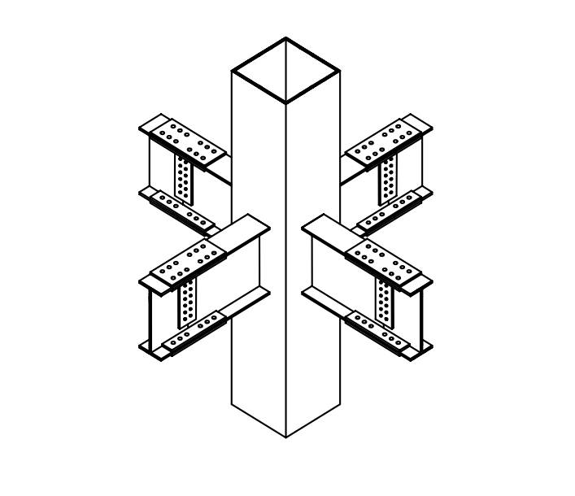

# 考題編號：SS-2009-4

**主分類：** `SS-U1-4` 接合之分析與設計
**副分類：** `SS-U2-3` 設計規範對施工之要求
**設計法：** 概念題
**標籤：** `銲接` `高拉力螺栓` `開槽銲` `Single V` `Single Bevel` `SAW潛弧銲` `UT超音波` `NDT` `螺栓間距` `預拉力` `施工規範` `8/3倍直徑` `抗拉面積At` `AWS開槽符號`

---

## 1. 原始題目重述 (Problem Restatement)

如**下**圖所示鋼結構建築的梁柱接頭示意圖，依據我國鋼結構設計與施工相關規範，試回答有關「銲接（Welding）」與「高強度螺栓（High Strength Bolt）」之問題（每小題 5 分，共 25 分）：

1. 開槽銲接（Groove Weld）型式中，說明「Single V」與「Single Bevel」開槽方式之差異
2. 「SAW」之英文全名及中文譯名
3. 「UT」之英文全名及中文譯名
4. 相鄰螺栓孔中心至中心的距離，不得小於多少倍之螺栓標稱直徑？
5. 鎖緊螺栓之最小預拉力應達到多少倍的螺栓最小抗拉強度 $F_u$？



*圖說（2026-08-22 重新檢視原圖確認）：箱型鋼柱（方管斷面，垂直貫通）與四方向 H 型鋼梁之梁柱接頭立體示意。圖中可見**梁之上翼板、下翼板與腹板三處皆佈滿螺栓孔列並加續接鋼鈑**，屬「翼板續接鈑 + 腹板續接鈑」之**全螺栓**現場接合。此為台灣常見之施工方式：柱四面先於**工廠**銲接一段短梁（stub／bracket，其與柱面之接合通常為全滲透開槽銲 CJP，圖中未標示），現場再以高拉力螺栓將梁段與短梁續接。故本題同時涉及「工廠銲接」（子題一～三）與「現場螺栓」（子題四、五）兩類規範。*

> 🔍 **圖說更正**：舊版圖說寫「梁腹板以螺栓鎖於剪力板、梁翼板以 CJP 接至柱外表面」——但原圖中**翼板亦佈滿螺栓孔並加續接鈑**，並非直接銲於柱面。銲接位置在柱與短梁之交界（圖中未繪出）。

---

## 2. 考題核心精神與出題者意圖 (Core Concepts & Examiner's Intent)

**核心觀念：銲接接頭形式與高拉力螺栓施工規定的基本知識**

本題五個子題均為「記憶型」知識考點，涵蓋銲接形式分類（Single V vs Single Bevel）、銲接製程（SAW）、非破壞檢測（UT）以及高拉力螺栓施工規定（中心距、預拉力）。雖無計算，但每個知識點在結構工程實務中均有重要意義。

**出題者測驗重點：**

- **Single V vs Single Bevel 的關鍵差異**：V 形是兩側開槽（對接接頭），Bevel 是單側開槽（T 形接頭）——接頭類型決定開槽選擇
- **SAW 的「潛弧」特性**：電弧在熔劑覆蓋下燃燒，適合工廠厚板自動銲接，現場施工不適用
- **UT 適合面狀缺陷**：超音波對裂縫、未熔合（LOF）最靈敏，比 RT 更適合 CJP 銲道檢測
- **螺栓中心距下限的規範層次**：$\frac{8}{3}d$ 為一般強制下限，$3d$ 為沿力方向之有條件加嚴——考生常把兩者層次寫反
- **0.7 $F_u$ 預拉力**：確保接合面夾持力足夠，防止摩阻型接頭在地震往復荷載下滑動；須乘**螺紋處有效抗拉面積 $A_t$**

---

## 3. 解題戰略地圖與陷阱分析 (Strategic Roadmap & Trap Analysis)

**作戰計畫：**
```
(一) Single V vs Single Bevel：
  → 兩側開槽 vs 單側開槽，對接 vs T形接頭，各列出優缺點

(二) SAW：
  → 英文全名 Submerged Arc Welding，中文潛弧銲接
  → 補充特性：熔劑覆蓋、平/橫銲限制

(三) UT：
  → 英文全名 Ultrasonic Testing，中文超音波檢測
  → 補充適用場合與 NDT 方法比較

(四) 螺栓中心距：
  → 規範一般下限 8/3 d（= 2⅔ d）；沿力方向（Fp 依式 10.3-1a/b）為 3d
  → 另不得小於式(10.3-2)；說明物理理由

(五) 螺栓預拉力：
  → 最小預拉力 = 0.7 Fu × At（At = 螺紋處有效抗拉面積），說明施工方法
```

**陷阱分析：**

| 陷阱 | 說明 | 對策 |
|------|------|------|
| ❶ V 形與 Bevel 搞混 | Single V = 兩側均開槽；Single Bevel = 單側開槽，方向相反不等於 V | 記憶：V 形（對稱）= 對接（Butt），Bevel（非對稱）= T 形（T-joint） |
| ❷ SAW 誤寫為 SMAW | SMAW = Shielded Metal Arc Welding（手工電弧銲），是另一種製程 | SAW 的 S = Submerged（潛埋），SMAW 的 S = Shielded（遮護） |
| ❸ NDT 縮寫混淆 | UT = 超音波；RT = 射線；MT = 磁粒；PT = 液滲 | 記住 UT/RT 偵內部，MT/PT 偵表面 |
| ❹ 螺栓中心距記錯規範層次 | 台灣規範 §10.3.9 之**一般下限為 $\frac{8}{3}d = 2\frac{2}{3}d$**；$3d$ 只在「承壓應力 $F_p$ 依式(10.3-1a)/(10.3-1b) 取用」時**沿力方向**才強制 | 答「$\frac{8}{3}$ 倍（即 $2\frac{2}{3}$ 倍）」並補述 $3d$ 之適用條件 |
| ❺ 預拉力係數記錯 | 是 $0.70 F_u$，不是 $0.60 F_u$（$0.60 F_{EXX}$ 是銲道剪力強度的係數） | 預拉力 $= 0.70 F_u A_t$（**$A_t$ 為螺紋處有效抗拉面積 $\approx 0.75A_b$**，非全斷面）；銲道剪力 $= 0.60 F_{EXX}$ |

---

## 3.5 變數層次分析（Variable Hierarchy Analysis）

> 複習提示：解題後，在每個卡住的知識點「卡關?」欄標記 `⚠`；第二次複習時只看有 `⚠` 的項目。

**最終目標：** 正確描述 Single V vs Single Bevel 差異、SAW/UT 全名、螺栓中心距下限、螺栓預拉力係數

### 主要公式（$\boxed{\phantom{x}}$ = 未知，待推導）

**子題四：螺栓中心距**
$$\boxed{s_{\min}} = \frac{8}{3} d_b = 2\tfrac{2}{3} d_b \quad(\text{沿力方向且 } F_p \text{ 依式 10.3-1a/b 取用時為} 3d_b)$$

**子題五：螺栓預拉力**
$$\boxed{T_0} = 0.70 \times F_u \times A_t \quad (A_t = \text{螺紋處有效抗拉面積} \approx 0.75 A_b)$$

### L1：題目直接給定

| 符號 | 數值 | 說明 |
|------|------|------|
| 接頭型式 | 箱型柱梁柱接頭 | 梁腹板螺栓、梁翼板銲接（CJP） |
| 設計法 | 概念題 | 五個子題均為規範知識與名詞說明 |

### L2：需知識點推導

**Step 1：Single V vs Single Bevel**

| 符號 | 公式 / 來源 | 卡關? |
|------|------------|:-----:|
| Single V | 兩側母材均開斜角，截面對稱 V 形，適用對接接頭（Butt Joint） | |
| Single Bevel | 僅單側母材開斜角，截面不對稱半 V 形，適用 T 形接頭 | |

**Step 2：SAW 英文全名**

| 符號 | 公式 / 來源 | 卡關? |
|------|------------|:-----:|
| SAW | Submerged Arc Welding（潛弧銲接）；電弧在熔劑覆蓋下燃燒，限平/橫銲 | |

**Step 3：UT 英文全名**

| 符號 | 公式 / 來源 | 卡關? |
|------|------------|:-----:|
| UT | Ultrasonic Testing（超音波檢測）；偵測內部缺陷，適用 CJP 銲道 | |

**Step 4：螺栓中心距**

| 符號 | 公式 / 來源 | 卡關? |
|------|------------|:-----:|
| $s_{\min}$ | **$\frac{8}{3}d_b$**（規範 §10.3.9 一般下限）；沿力方向且 $F_p$ 依式(10.3-1a)/(10.3-1b) 取用時為 $3d_b$；另不得小於式(10.3-2) 之值 | |

**Step 5：螺栓預拉力**

| 符號 | 公式 / 來源 | 卡關? |
|------|------------|:-----:|
| $T_0$ | $0.70 F_u A_t$；係數 **0.70**（非 0.60）；規範原文「等於最小抗拉強度之 0.7 倍」，$A_t$ 為螺紋處有效抗拉面積 | |

### L3：深層知識（不懂就卡住）

| 知識點 | 說明 | 補強頁 | 卡關? |
|--------|------|:------:|:-----:|
| V 形 vs Bevel 接頭型式對應 | V 形（兩側）→ 對接；Bevel（單側）→ T 形；接頭型式決定開槽選擇 | | |
| SAW vs SMAW 縮寫混淆 | SAW = Submerged（潛埋）；SMAW = Shielded Metal Arc Welding（手工電弧銲） | | |
| NDT 方法比較 | UT/RT 偵內部缺陷；MT/PT 偵表面缺陷；CJP 銲道用 UT | | |
| 螺栓中心距的物理意義 | 足夠間距可確保孔間鋼板不發生剪出破壞（Shear-Out）與承壓壓陷，並保留施工扳手作業空間 | | |
| 預拉力 0.70 vs 0.60 | $0.70 F_u$：夾持力機制（預拉力，乘 $A_t$）；$0.60 F_{EXX}$：銲道剪力強度（乘喉面積），意義完全不同 | | |

---

## 4. 步驟化詳細計算過程 (Step-by-Step Calculation)

### 一、Single V vs Single Bevel 開槽銲接之差異

#### Single V 開槽（V 形開槽）

**兩側母材均予開斜角（Bevel）**，組合後形成對稱的「V」字形槽口：

- 兩側母材各磨去同等角度（通常各 30°～37.5°，合計 60°～75°）
- 槽口關於接縫軸線**對稱**
- 「**Single**」指僅**自單面**開槽施銲（相對於 Double-V 之兩面開槽）
- 適用於：板厚較大、需熔透深度大的對接接頭（Butt Joint）
- 優點：銲道較易施工，銲材可從中央完全熔透
- 常用於：柱翼板、梁翼板之全滲透對接銲（CJP）

#### Single Bevel 開槽（斜向開槽）

**僅一側母材開斜角**，另一側保持垂直（方形）：

- 只有一側母材開斜角，另一側為方形（square edge），截面呈半 V 形
- 槽口**不對稱**
- 「**Single**」同樣指自單面施銲（相對於 Double-Bevel）
- 適用於：T 形接頭（T-joint）或角接頭（Corner Joint），一側母材不易磨切時
- 優點：加工量少（只需開一側）
- 較 Single V 難以達到完全熔透，需注意根部熔透品質

#### 兩者差異彙整

| 特性 | Single V | Single Bevel |
|------|---------|--------------|
| 開槽側 | 兩側均開槽 | 僅單側開槽 |
| 截面形狀 | 對稱 V 形（▽） | 不對稱半 V（└）|
| 常見接頭型式 | 對接接頭（Butt Joint） | T 形接頭、角接頭 |
| 加工量 | 較多（兩側均需磨切） | 較少（單側磨切） |
| 熔透難度 | 較容易（對稱填充） | 較難（非對稱，需注意根部） |
| AWS A2.4 命名邏輯 | 前綴 Single/Double = 單面／雙面開槽；字根 V = **兩側**母材開斜角 | 字根 Bevel = **單側**母材開斜角 |

---

### 二、SAW 英文全名與中文譯名

$$\boxed{\text{SAW} = \text{Submerged Arc Welding（潛弧銲接）}}$$

電弧在顆粒狀熔劑（Flux）覆蓋下燃燒，電弧本身不可見（故稱「潛弧」）。熔劑隔絕空氣，保護熔池不受氧化污染。適用大型構件（如橋梁主梁、厚板對接）之自動化銲接；優點：銲速快、熱輸入量大、銲道品質穩定；缺點：只能平銲或橫銲，不適用立銲或仰銲。

---

### 三、UT 英文全名與中文譯名

$$\boxed{\text{UT} = \text{Ultrasonic Testing（超音波檢測）}}$$

利用超音波（頻率 1～5 MHz）傳入材料，遇到缺陷（裂縫、未熔合、孔洞）時產生反射波。儀器偵測反射波的**時間**（判斷缺陷位置）與**振幅**（判斷缺陷大小）。適用厚板全滲透銲道（CJP）之內部缺陷檢測，優點：可檢測材料內部深處缺陷，靈敏度高；缺點：需技術熟練操作人員。

**常見 NDT 方法對照：**

| 縮寫 | 英文全名 | 中文 | 適用缺陷 |
|------|---------|------|---------|
| VT | Visual Testing | 目視檢測 | 表面 |
| MT | Magnetic Particle Testing | 磁粒（粉）檢測 | 近表面（磁性材料） |
| PT | Liquid Penetrant Testing | 液滲（染料滲透）檢測 | 表面開口缺陷 |
| **UT** | **Ultrasonic Testing** | **超音波檢測** | **內部缺陷** |
| RT | Radiographic Testing | 放射線（射線）檢測 | 內部缺陷 |

---

### 四、螺栓孔最小中心距

$$\boxed{\text{相鄰螺栓孔中心至中心之距離} \;\ge\; \frac{8}{3} d_b \;=\; 2\tfrac{2}{3} d_b}$$

**規範原文（「鋼構造建築物鋼結構設計技術規範」容許應力設計法 §10.3.9 螺栓之間距）：**

> 「所有標準型孔、超大型孔、及槽孔中心至中心之距離**不得小於 8/3 倍螺栓之標稱直徑**，亦不得小於由式(10.3-2)計得之值。若 $F_p$ 由式(10.3-1a)或(10.3-1b)求得，則**沿著力量傳遞方向之螺栓孔中心距不得小於 3 倍螺栓標稱直徑**。」

因此本題完整答案有三個層次：

| 層次 | 規定 | 適用 |
|------|------|------|
| ① **一般下限** | $s \ge \dfrac{8}{3}d_b = 2\tfrac{2}{3}d_b$ | 所有孔型、所有方向（**題目所問之答案**） |
| ② 沿力方向之加嚴 | $s \ge 3 d_b$ | 當承壓應力 $F_p$ 依式(10.3-1a)/(10.3-1b) 取用時 |
| ③ 承壓需求 | $s \ge \dfrac{P}{F_u t} + \dfrac{d}{2}$（式 10.3-2） | 由該螺栓所傳遞之力 $P$ 反算 |

**數值示例：** $d_b = 25$ mm ⇒ ① $s \ge 66.7$ mm；② $s \ge 75$ mm。

**物理理由：**
1. 孔間鋼板須有足夠淨寬以傳遞承壓力，避免孔間**剪出／撕裂**
2. 避免相鄰孔之應力集中相互疊加
3. 施工上須留出扳手（尤其扭剪型螺栓之套筒）作業空間

> ⚠️ **常見誤答**：許多考生（與舊版本解析）記成「規範規定 $3d$，絕對下限 $2\frac{2}{3}d$」，把兩者的層次**顛倒**了。台灣規範強制的一般下限就是 $\frac{8}{3}d$；$3d$ 是**有條件**的加嚴（AISC 360-16 §J3.3 則把 $3d$ 寫成「preferred（建議值）」）。作答時寫「$\frac{8}{3}$ 倍」並補述 $3d$ 之條件，最為完整。

---

### 五、螺栓最小預拉力

$$\boxed{T_0 = 0.70 \times F_u \times A_t}$$

**規範原文（同規範 §10.3.1 及表 10.3-1 附註）：** 鎖緊後之最小預拉力「**等於最小抗拉強度之 0.7 倍**」。

即最小預拉力應達螺栓**最小抗拉強度 $F_u$ 的 70%**：

$$T_0 = 0.70 \, F_u \, A_t$$

其中 $A_t$ 為**螺紋處之有效抗拉面積**（tensile stress area），約為全斷面積 $A_b$ 的 0.75 倍。

**數值驗核（以 3/4 in A325 為例，AISC 表 J3.1 列 28 kips）：**

| 面積取法 | 計算 | 結果 | 對照表值 |
|---------|------|------|---------|
| **$A_t = 0.334$ in²（正確）** | $0.70 \times 120 \times 0.334$ | **28.1 kips** | 28 kips ✓ |
| $A_b = 0.442$ in²（誤用全斷面） | $0.70 \times 120 \times 0.442$ | 37.1 kips ✗ | 高估 33% |

> ⚠️ 常見寫法「$T_0 = 0.7F_uA_b$」若把 $A_b$ 理解為全斷面積會高估三成；規範表列值是以**螺紋處有效抗拉面積**計得。作答時寫「$0.7 \times$ 螺栓最小抗拉強度」即符合題意（題目問的是「多少倍」→ **0.7 倍**）。

**為何是 0.7？** 高拉力螺栓鎖緊時之目標為使螺栓進入**降伏起始附近**（$F_y/F_u$ 對 A325 約 0.77、對 A490 約 0.90），取 0.7 可在確保足夠夾持力的同時保留安全餘裕，避免鎖緊過程中斷裂。

**施工方法（四種）：**
1. **扭力扳手法（Torque Control Method）**：以校正過之扭力扳手施加規定扭矩
2. **旋轉角法（Turn-of-Nut Method）**：由貼緊（snug-tight）位置再旋轉規定角度（1/3～1 圈，依螺栓長度與夾持厚度）
3. **直接拉力指示器法（DTI, Direct Tension Indicator）**：以指示墊圈之壓縮量確認預拉力
4. **扭剪型高拉力螺栓（TC / S10T Bolt）**：以尾端斷裂（pin-tail shear）確認達到規定預拉力

---

## 5. 結果彙整與驗算 (Summary & Verification)

| 子題 | 答案 | 關鍵數值 |
|------|------|---------|
| (一) Single V vs Single Bevel | V 形：**兩側母材**均開斜角、截面對稱，用於對接接頭；Bevel：**僅單側母材**開斜角、截面不對稱，用於 T 形／角接頭。「Single」指僅**自單面**開槽（相對於 Double-V／Double-Bevel 之兩面開槽） | 核心差異：開斜角之母材數量 + 接頭型式 |
| (二) SAW | Submerged Arc Welding（潛弧銲接／埋弧銲） | 電弧在熔劑覆蓋下燃燒，自動化，限平／橫銲 |
| (三) UT | Ultrasonic Testing（超音波檢測） | 偵測內部缺陷（裂縫／未熔合 LOF），適用 CJP 銲道 |
| (四) 螺栓中心距 | $s \ge \dfrac{8}{3}d_b = 2\tfrac{2}{3}d_b$ | 一般下限 $\frac{8}{3}d$；沿力方向（$F_p$ 依式 10.3-1a/b）為 $3d$ |
| (五) 螺栓預拉力 | $T_0 = 0.70\,F_u\,A_t$ | 係數 **0.70**；$A_t$ 為螺紋處有效抗拉面積 |

**觀念精析：**

Single V 與 Single Bevel 的選擇核心在**接頭型式**：V 形開槽適合對接接頭（兩板端對端，兩側均可磨切），Bevel 開槽適合 T 形接頭（一板垂直插入另一板，只有一側可磨切）。AWS A2.4 之命名邏輯值得記住：**前綴 Single/Double 指「單面／雙面開槽」，字根 V/Bevel/U/J 指「兩側／單側母材開斜角或曲面」**——故 Single-Bevel 與 Double-Bevel 都是「單側母材開斜角」，差別在從一面或兩面施銲。

SAW 的「潛」字是關鍵：電弧「潛」在熔劑下燃燒，無弧光與飛濺，但此特性也限制其只能在重力方向進行（平銲、橫銲），不適合現場立銲／仰銲。

螺栓的兩個「倍數」常被混淆：**中心距 $\frac{8}{3}d$（幾何）** 與 **預拉力 $0.7F_u$（力學）**；而 $0.7F_u$ 與銲道之 $0.6F_{EXX}$ 又是不同體系——前者是「夾持力機制」（乘螺栓抗拉面積），後者是「銲填金屬剪力強度」（乘喉面積），意義完全不同。

---

## 6. 依最新規範（AISC 360-16／-22）對照

> **本題主答案所依規範**：題目明示「依據**我國**鋼結構設計與施工相關規範」，故以內政部「鋼構造建築物鋼結構設計技術規範」（民國 99 年修正版）第十章及「鋼構造建築物鋼結構施工規範」為準。以下對照 AISC 現行規範。

### 6.1 螺栓中心距

| 項目 | 台灣 2010 §10.3.9 | AISC 360-16／-22 §J3.3 |
|------|------------------|----------------------|
| 一般下限 | **$\dfrac{8}{3}d$（強制）** | $2\dfrac{2}{3}d$（強制，數值相同） |
| $3d$ 之地位 | **有條件強制**：沿力方向且 $F_p$ 依式(10.3-1a)/(10.3-1b) 取用時 | 「**A distance of 3d is preferred**」（建議，非強制） |
| 另加需求 | 式(10.3-2)：$s \ge P/(F_ut) + d/2$ | 360-16 起併入 §J3.10 承壓／撕出計算，不另立間距式 |

⇒ **兩者的強制下限完全一致（$2\frac{2}{3}d$）**；台灣把 $3d$ 寫成有條件強制、AISC 寫成建議值。實務上台灣鋼結構標準圖多直接採 $3d$ 以求簡明。

### 6.2 螺栓最小預拉力

| 項目 | 台灣 2010 表 10.3-1 | AISC 360-16／-22 表 J3.1 |
|------|-------------------|------------------------|
| 定義 | 「等於最小抗拉強度之 **0.7 倍**」 | 「Equal to **0.70** times the minimum tensile strength of bolts」 |
| 面積 | 螺紋處有效抗拉面積 $A_t$ | 同（ASTM 規定之 tensile stress area） |
| 表列對象 | F10T／S10T（日系）及 A325／A490 | A325/F1852（Group A）、A490/F2280（Group B）；360-22 已改用 **ASTM F3125** 統一標準 |

⇒ **係數 0.70 自 AISC LRFD 1993 至 360-22 從未改變。** 差異僅在螺栓標準的命名：ASTM A325／A490 已於 2016 年被 **F3125 Grade A325／A490** 取代，AISC 360-16 起改引用 F3125。

### 6.3 開槽銲型式與非破壞檢測

| 項目 | 台灣 2010／施工規範 | AISC 360-16／-22 + AWS D1.1 |
|------|-------------------|---------------------------|
| 開槽符號 | 引用 AWS A2.4 | AWS A2.4（相同） |
| 預審合格開槽（PJP/CJP） | 規範表列有效喉厚 | AWS D1.1 表 3.2（預審合格 CJP）／表 3.3（PJP） |
| UT 驗收基準 | 施工規範；引用 CNS／AWS | AWS D1.1 §8（靜態）／§9（動態）；耐震另依 **AISC 341 附錄 W** |
| 耐震需求臨界銲道 | 規範第十三章 | AISC 341-16 §A3.4b：Demand Critical 銲道須符 CVN 要求；施銲須依 **AWS D1.8** |

**AWS D1.8**（Structural Welding Code — Seismic Supplement）是 AISC 341 體系新增之耐震銲接補充規範，台灣 2010 規範尚無對應章節——若考生答題時提及，屬加分內容。

### 6.4 對照總表

| 子題 | 台灣 2010（本文主答案） | AISC 360-16／-22 |
|------|----------------------|-----------------|
| (一) Single V / Single Bevel | AWS A2.4 命名 | 相同（AWS A2.4） |
| (二) SAW | 潛弧銲接 | Submerged Arc Welding（同） |
| (三) UT | 超音波檢測 | Ultrasonic Testing（同；耐震另依 AISC 341 App. W） |
| (四) 螺栓中心距 | $\frac{8}{3}d$ 強制；$3d$ 有條件強制 | $2\frac{2}{3}d$ 強制；$3d$ 為 preferred |
| (五) 預拉力 | $0.7F_uA_t$ | $0.7F_uA_t$（同；螺栓標準改為 ASTM F3125） |

**結論：本題五個子題之答案在台灣 2010 與 AISC 360-16／-22 之間並無實質差異**，唯一需注意的是子題(四)之「$\frac{8}{3}d$ 為強制下限、$3d$ 為有條件／建議值」這一層次關係。

---

*修正日期：2026-08-22*
*本次修正內容：①**更正子題(四)之規範層次顛倒**——依台灣規範 §10.3.9 原文，一般強制下限為 $\frac{8}{3}d$（$2\frac{2}{3}d$），$3d$ 僅在「沿力方向且 $F_p$ 依式(10.3-1a)/(10.3-1b) 取用」時強制（AISC 則列為 preferred）；舊版寫成「規範規定 3d、絕對下限 $2\frac{2}{3}d$」，把兩者層次寫反，並補入式(10.3-2) 之第三層需求；②**更正子題(五)之面積**：$T_0 = 0.7F_uA_t$（$A_t$ 為螺紋處有效抗拉面積 $\approx 0.75A_b$），並以 3/4 in A325 之 AISC 表 J3.1 值 28 kips 作數值驗核（$A_t$ 得 28.1 ✓、誤用 $A_b$ 得 37.1 ✗ 高估 33%）；③補入 AWS A2.4 之命名邏輯（Single/Double 指單面／雙面開槽，V/Bevel 指兩側／單側母材開斜角）；④更正旋轉角法之角度範圍（1/3～1 圈，原寫 1/2～2/3 圈）並補入 S10T 之中文對應；⑤補入 0.7 係數之力學理由；⑥§1 之「如右圖」更正為「如下圖」（與試卷一致）；⑦新增 §6 依最新規範對照（含 ASTM A325/A490 → F3125 之標準更迭、AWS D1.8 耐震銲接補充規範）。*
*驗證狀態：unverified*
