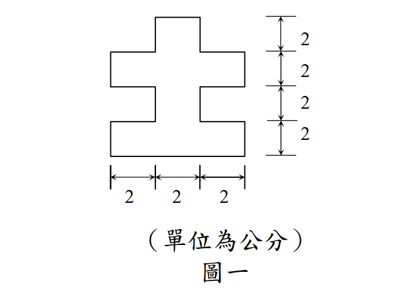

# 考題編號：SS-2010-1

**主分類：** `MM-U1-1` 斷面性質計算（材力）
**副分類：** 無
**設計法：** 概念題（材料力學）
**標籤：** `斷面性質` `降伏力矩` `塑性力矩` `十字形斷面` `平行軸定理` `塑性中性軸`

---

## 1. 原始題目重述 (Problem Restatement)

有一斷面如圖一所示，使用 SS540 鋼料（降伏強度 $F_y = 4.0\ \text{tf/cm}^2$），求此斷面強軸之：
1. 降伏力矩 $M_y$（tf-cm）
2. 塑性力矩 $M_p$（tf-cm）



*圖說：十字形（+）對稱斷面。水平方向分三等份 2-2-2（總寬 6 cm），垂直方向分四等份 2-2-2-2（總高 8 cm）。填充區域為：底部中央 2×2、下寬段 6×2、上寬段 6×2、頂部中央 2×2，構成上下左右均對稱之十字形。*

---

## 2. 考題核心精神與出題者意圖 (Core Concepts & Examiner's Intent)

**核心觀念：非標準斷面的 $M_y$ 與 $M_p$ 計算——分塊法（Decomposition Method）**

本題考驗考生對非標準（非 H 型鋼）斷面的斷面性質計算能力，核心工具是「平行軸定理」（計算 $I_x$）與「一次面積矩法」（計算 $Z_x$）。十字形斷面的特點是形狀因子遠大於 H 型鋼，直觀地展示了斷面形狀對塑性儲備的影響。

**出題者測驗重點：**

- **分塊法**：十字形斷面需分解為若干矩形，分別計算 $I_x$、$Z_x$，再加總
- **形心不在幾何中心的判斷**：此題因對稱，形心確實在幾何中心，但考生仍需驗算
- **$Z_x$ = PNA 以上（下）各件對 PNA 的一次面積矩之和**：PNA 在面積等分處（對稱斷面 = 形心）
- **形狀因子 1.80**：遠大於 H 型鋼（1.12～1.15），說明十字形斷面面積集中在遠離形心處，塑性儲備豐富

---

## 3. 解題戰略地圖與陷阱分析 (Strategic Roadmap & Trap Analysis)

**作戰計畫：**
```
前置：分解斷面為四個矩形，記錄各構件 (寬b, 高h, 面積Ai, 形心高ȳi)

Step 1  驗算形心（對稱斷面 → ȳ = 4 cm），確認 c = 4 cm

Step 2  計算 Ix：
        各構件 Ixi = bi hi³/12 + Ai di²（di = ȳi - 4）
        Ix = ΣIxi

Step 3  計算 My：
        Sx = Ix / c
        My = Fy × Sx

Step 4  確定 PNA（面積等分點）：
        A/2 = 16 cm²，從底部累積面積確定 PNA 高度

Step 5  計算 Zx：
        Zx = Σ(Ai × ēi)，PNA 以上及以下各件之一次面積矩合計

Step 6  計算 Mp = Fy × Zx
```

**陷阱分析：**

| 陷阱 | 說明 | 對策 |
|------|------|------|
| ❶ 翼板形心距算錯 | 構件①形心在 $y=1$（非 $y=0$），構件②形心在 $y=3$，以此類推 | 各構件形心在其自身高度的中點 |
| ❷ $I_x$ 漏算自身慣性矩 | 除了 $A_i d_i^2$（平行軸）還要加 $b_i h_i^3/12$（自身） | 用平行軸定理完整公式 $I_{xi} = b_i h_i^3/12 + A_i d_i^2$ |
| ❸ $Z_x$ 的 $\bar{e}_i$ 定義 | $\bar{e}_i$ 是各構件形心到 PNA 的距離，非到斷面頂/底 | PNA 在 $y = 4$ cm，故 $\bar{e}_i = |\bar{y}_i - 4|$ |
| ❹ 形狀因子誤算 | $f = Z_x/S_x = 48/(80/3) = 1.80$，不是整數要注意分數計算 | 建議保留分數：$S_x = 80/3$，$f = 48 \times 3/80 = 1.80$ |

---

## 3.5 變數層次分析（Variable Hierarchy Analysis）

> 複習提示：解題後，在每個卡住的知識點「卡關?」欄標記 `⚠`；第二次複習時只看有 `⚠` 的項目。

**最終目標：** 計算十字形斷面強軸降伏力矩 $M_y$ 與塑性力矩 $M_p$（形狀因子 1.80）

### 主要公式（$\boxed{\phantom{x}}$ = 未知，待推導）

$$\boxed{I_x} = \sum\left(\frac{b_i h_i^3}{12} + A_i d_i^2\right)$$
$$\boxed{S_x} = \frac{\boxed{I_x}}{c}, \quad \boxed{M_y} = F_y \cdot \boxed{S_x}$$
$$\boxed{Z_x} = 2\sum_{上半} A_i \bar{e}_i, \quad \boxed{M_p} = F_y \cdot \boxed{Z_x}$$

### L1：題目直接給定

| 符號 | 數值 | 說明 |
|------|------|------|
| 斷面形狀 | 十字形（+） | 總高 8 cm，總寬 6 cm |
| 上下寬段 | 6 cm × 2 cm（各一） | $y$ = 2～4 及 4～6 cm |
| 頂底窄段 | 2 cm × 2 cm（各一） | $y$ = 0～2 及 6～8 cm |
| $F_y$ | 4.0 tf/cm² | SS540 鋼料 |

### L2：需知識點推導

**Step 1：斷面分解與形心**

| 符號 | 公式 / 來源 | 卡關? |
|------|------------|:-----:|
| $A$ | $4 + 12 + 12 + 4 = 32$ cm² | |
| $\bar{y}$ | 4 cm（上下對稱，形心在幾何中心） | |
| $c$ | 4 cm（最外纖維至形心距離） | |

**Step 2：強軸慣性矩 $I_x$ 與 $M_y$**

| 符號 | 公式 / 來源 | 卡關? |
|------|------------|:-----:|
| $d_i$ | 各構件形心至形心的距離：①$-3$、②$-1$、③$+1$、④$+3$ cm | |
| $I_x$ | $\sum(b_i h_i^3/12 + A_i d_i^2) = 8/3 + 104 = 320/3 \approx 106.7$ cm⁴ | |
| $S_x$ | $I_x / c = (320/3)/4 = 80/3 \approx 26.67$ cm³ | |
| $M_y$ | $F_y \times S_x = 4.0 \times 80/3 \approx 106.7$ tf-cm | |

**Step 3：塑性斷面模數 $Z_x$ 與 $M_p$**

| 符號 | 公式 / 來源 | 卡關? |
|------|------------|:-----:|
| PNA 位置 | $A/2 = 16$ cm²；從底部累積至 $y = 4$ cm（①4 + ②12 = 16）→ PNA 在 $y = 4$ cm | |
| $\bar{e}_i$ | 各構件形心至 PNA 距離：①④各 3 cm，②③各 1 cm | |
| $Z_x$ | $(4\times3 + 12\times1)\times 2 = 48$ cm³ | |
| $M_p$ | $F_y \times Z_x = 4.0 \times 48 = 192$ tf-cm | |

### L3：深層知識（不懂就卡住）

| 知識點 | 說明 | 補強頁 | 卡關? |
|--------|------|:------:|:-----:|
| 平行軸定理完整公式 | $I_{x,i} = b_i h_i^3/12 + A_i d_i^2$；漏掉自身慣性矩 $b_i h_i^3/12$ 是常見錯誤 | | |
| $Z_x$ 的 $\bar{e}_i$ 定義 | $\bar{e}_i$ 是各構件形心到 **PNA** 的距離，非到斷面頂/底 | [[plastic-zx]] | |
| PNA 的確定方法 | PNA 位於面積等分處；對稱斷面 PNA = 形心；從底部累積面積找 $A/2$ 點 | | |
| 各構件形心高度 | 構件①形心在 $y = 1$ cm（非 $y = 0$），構件②在 $y = 3$ cm，以此類推 | | |
| 形狀因子 1.80 意義 | 十字形面積集中在寬段（遠離形心），塑性儲備比 H 型鋼（1.12）大；矩形為 1.50 | | |

---

## 4. 步驟化詳細計算過程 (Step-by-Step Calculation)

### 斷面幾何分解

以斷面底部為原點，$y$ 軸向上。斷面分解為四個矩形構件：

| 構件 | 位置（$y$ 範圍） | 寬 $b_i$（cm） | 高 $h_i$（cm） | 面積 $A_i$（cm²） | 形心高 $\bar{y}_i$（cm） |
|------|--------------|------------|------------|----------------|-----------------------|
| ① 底部中央突出 | 0～2 | 2 | 2 | 4 | 1 |
| ② 下寬段 | 2～4 | 6 | 2 | 12 | 3 |
| ③ 上寬段 | 4～6 | 6 | 2 | 12 | 5 |
| ④ 頂部中央突出 | 6～8 | 2 | 2 | 4 | 7 |

$$A = 4 + 12 + 12 + 4 = 32\ \text{cm}^2$$

形心位置：因斷面上下對稱，$\bar{y} = 4\ \text{cm}$，$c = 4\ \text{cm}$（最外纖維至形心距離）。

---

### 一、強軸慣性矩 $I_x$ 與 $M_y$

#### Step 1：$I_x$（平行軸定理）

$d_i = \bar{y}_i - 4$（各構件形心至全斷面形心之距離）：

| 構件 | $b_i h_i^3/12$（cm⁴） | $d_i$（cm） | $A_i d_i^2$（cm⁴） | $I_{x,i}$（cm⁴） |
|------|---------------------|-----------|------------------|----------------|
| ① | $2 \times 8/12 = 4/3$ | $-3$ | $4 \times 9 = 36$ | $37.33$ |
| ② | $6 \times 8/12 = 4$ | $-1$ | $12 \times 1 = 12$ | $16.00$ |
| ③ | $6 \times 8/12 = 4$ | $+1$ | $12 \times 1 = 12$ | $16.00$ |
| ④ | $2 \times 8/12 = 4/3$ | $+3$ | $4 \times 9 = 36$ | $37.33$ |

$$I_x = \frac{4}{3} + 36 + 4 + 12 + 4 + 12 + \frac{4}{3} + 36 = \frac{8}{3} + 104 = \frac{320}{3} \approx 106.7\ \text{cm}^4$$

#### Step 2：$M_y$

$$S_x = \frac{I_x}{c} = \frac{320/3}{4} = \frac{80}{3} \approx 26.67\ \text{cm}^3$$

$$\boxed{M_y = F_y \cdot S_x = 4.0 \times \frac{80}{3} = \frac{320}{3} \approx 106.7\ \text{tf-cm}}$$

---

### 二、塑性力矩 $M_p$

#### Step 3：確定 PNA

PNA 位於面積平分處：$A/2 = 16\ \text{cm}^2$

從底部往上累積：構件① = 4 cm²；構件①+② = 16 cm²，**PNA 在 $y = 4\ \text{cm}$**（與形心重合，對稱斷面必然如此）。

#### Step 4：$Z_x$（PNA 以上各件一次面積矩 × 2）

$\bar{e}_i = |\bar{y}_i - 4|$（各構件形心至 PNA 距離）：

| 構件 | $A_i$（cm²） | $\bar{e}_i$（cm） | $A_i \bar{e}_i$（cm³） |
|------|-----------|-----------------|---------------------|
| ① | 4 | 3 | 12 |
| ② | 12 | 1 | 12 |
| ③ | 12 | 1 | 12 |
| ④ | 4 | 3 | 12 |

$$Q_{上} = Q_{下} = 4 \times 3 + 12 \times 1 = 24\ \text{cm}^3$$

$$Z_x = Q_{上} + Q_{下} = 24 + 24 = 48\ \text{cm}^3$$

#### Step 5：$M_p$

$$\boxed{M_p = F_y \cdot Z_x = 4.0 \times 48 = 192\ \text{tf-cm}}$$

#### Step 6：形狀因子（供參）

$$f = \frac{M_p}{M_y} = \frac{Z_x}{S_x} = \frac{48}{80/3} = \frac{48 \times 3}{80} = \frac{144}{80} = 1.80$$

---

## 5. 結果彙整與驗算 (Summary & Verification)

| 項目 | 計算結果 |
|------|---------|
| 全斷面積 $A$ | $32\ \text{cm}^2$ |
| 強軸慣性矩 $I_x$ | $\dfrac{320}{3} \approx 106.7\ \text{cm}^4$ |
| 斷面模數 $S_x$ | $\dfrac{80}{3} \approx 26.67\ \text{cm}^3$ |
| **降伏力矩 $M_y$** | $\mathbf{\dfrac{320}{3} \approx 106.7\ \text{tf-cm}}$ |
| 塑性斷面模數 $Z_x$ | $48\ \text{cm}^3$ |
| **塑性力矩 $M_p$** | **$192\ \text{tf-cm}$** |
| 形狀因子 $f = M_p/M_y$ | $1.80$ |

**觀念精析：**

十字形斷面的形狀因子 1.80 遠大於 H 型鋼（1.12～1.15）和矩形（1.50），原因在於十字形斷面的面積集中在「翼板」（遠離形心的寬段），這些面積在塑性計算中力臂大（貢獻大），但在彈性計算中因慣性矩公式的距離平方效應，其相對貢獻反而因為寬度增加而提升有限。換言之，十字形斷面在塑性狀態下能充分發揮材料強度，有較大的韌性儲備。

PNA 與中性軸重合（$y = 4$ cm）是因為斷面上下對稱：全面積 32 cm²，從底部累積到 $y = 4$ cm 時恰好累積了 16 cm²（構件①的 4 cm² + 構件②的 12 cm²），確認 PNA 在 $y = 4$ cm。
