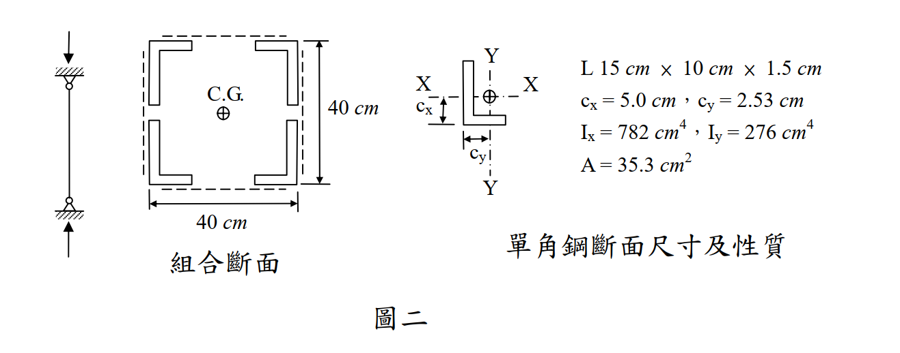

# 考題編號：SS-2010-3

**主分類：** `SS-U1-1` 拉力及壓力桿件
**副分類：** 無
**設計法：** 混合（ASD + LRFD）
**標籤：** `組合柱` `壓力桿件` `挫屈` `不等肢角鋼` `ASD` `LRFD` `Euler公式` `長柱` `有效長度` `回轉半徑`

---

## 1. 原始題目重述 (Problem Restatement)

有一受壓桿件，斷面由四個不等肢角鋼（L150×100×15）以繫板和繫條穩固組合而成（如圖二），柱的有效長度為 25 m，若繫板和繫條之斷面積不計，鋼料降伏強度 $F_y = 2.52\ \text{tf/cm}^2$，$E = 2{,}040\ \text{tf/cm}^2$。

1. 以容許應力設計法（ASD），求組合斷面之挫屈載重（tf）
2. 以極限設計法（LSD），求組合斷面之設計強度（tf）



*圖說：單角鋼 L 15cm×10cm×1.5cm，A=35.3 cm²，Ix=782 cm⁴，Iy=276 cm⁴，cx=5.0 cm，cy=2.53 cm。組合斷面整體外部尺寸 40cm×40cm（背靠背），C.G. 在幾何中心。*

---

## 2. 考題核心精神與出題者意圖 (Core Concepts & Examiner's Intent)

**核心觀念：組合柱斷面性質計算 + ASD vs LRFD 兩種設計法的挫屈載重**

本題要求考生先計算「四角鋼組合柱」的組合慣性矩，再分別用 ASD（容許應力法）和 LRFD（極限設計法）求出設計載重，測驗兩種設計法的基本公式與應用流程。

**出題者測驗重點：**

- **組合斷面弱軸的判斷**：$d_x = 20 - c_x = 15$ cm 對比 $d_y = 20 - c_y = 17.47$ cm，因 $d_y > d_x$，弱軸為 Y 軸（$I_y < I_x$）
- **平行軸定理的正確應用**：需用角鋼自身 $I_x$（或 $I_y$）加上 $Ad^2$，其中 $d$ 是各角鋼形心到**組合斷面形心軸**的距離
- **ASD 長短柱判斷**：$C_c = \sqrt{2\pi^2 E/F_y} = 126.4$，$k\ell/r = 163.8 > C_c$ → Euler 長柱，用 $\frac{12}{23}\frac{\pi^2 E}{(k\ell/r)^2}$
- **LRFD 彈性挫屈判斷**：$\lambda_c = 1.832 > 1.5$ → 彈性挫屈，用 $F_{cr} = \frac{0.877}{\lambda_c^2}F_y$

---

## 3. 解題戰略地圖與陷阱分析 (Strategic Roadmap & Trap Analysis)

**作戰計畫：**
```
前置：確認四個角鋼對稱配置，形心在幾何中心

Step 1  計算每個角鋼形心到組合形心的距離：
        dx = 20 - cx = 15 cm（距 Y 軸）
        dy = 20 - cy = 17.47 cm（距 X 軸）

Step 2  組合慣性矩（平行軸定理）：
        Ix,comb = 4(Ix,own + A·dy²)
        Iy,comb = 4(Iy,own + A·dx²)

Step 3  迴轉半徑 rx、ry，確認弱軸（ry 小，控制）

Step 4  kℓ/r 弱軸細長比 = 2500/15.26 = 163.8

(一) ASD：
  → 計算 Cc，判斷長柱
  → Fa = (12π²E)/(23(kℓ/r)²)
  → Pa = Fa × A

(二) LRFD：
  → λc = (kℓ/rπ)√(Fy/E)，判斷彈性/非彈性
  → Fcr（λc > 1.5 用 0.877/λc²·Fy）
  → φcPn = 0.85 × Fcr × A
```

**陷阱分析：**

| 陷阱 | 說明 | 對策 |
|------|------|------|
| ❶ 弱軸搞反 | $I_y < I_x$，弱軸是 Y 軸；$d_y = 17.47 > d_x = 15$，故 $I_y$ 更小 | 計算兩個方向的 $I$ 後比較，取較小者（$I_y$）為控制 |
| ❷ 平行軸距離用全深 | $d_x = 20 - c_x$，不是 20 cm；角鋼形心不在角鋼背（短腿背），要減去 $c_x$ | 從圖讀取 $c_x, c_y$，減去背至配置中心的 20 cm |
| ❸ ASD 公式選錯 | 長柱（$k\ell/r > C_c$）用 $\frac{12}{23}\frac{\pi^2 E}{(kl/r)^2}$，短柱才用 Johnson 公式 | 先求 $C_c$，再判斷長短柱 |
| ❹ $\lambda_c$ 分母漏 $\pi$ | $\lambda_c = (k\ell/r)/(\pi\sqrt{E/F_y})$，分母有 $\pi$ | 記憶：$\lambda_c = 1$ 對應 $k\ell/r = \pi\sqrt{E/F_y}$（Euler 臨界細長比） |
| ❺ LRFD 彈性挫屈公式 | $\lambda_c > 1.5$ 用 $0.877/\lambda_c^2 \cdot F_y$（非 $0.658^{\lambda_c^2}$） | 兩段公式：$\lambda_c \leq 1.5$ 用指數式；$> 1.5$ 用 $0.877/\lambda_c^2$ |

---

## 3.5 變數層次分析（Variable Hierarchy Analysis）

> 複習提示：解題後，在每個卡住的知識點「卡關?」欄標記 `⚠`；第二次複習時只看有 `⚠` 的項目。

**最終目標：** 四角鋼組合柱弱軸挫屈 → ASD 挫屈載重 $P_a$ 與 LRFD 設計強度 $\phi_c P_n$

### 主要公式（$\boxed{\phantom{x}}$ = 未知，待推導）

$$\boxed{I_{y,comb}} = 4\left(I_{y,own} + A \cdot d_x^2\right), \quad \boxed{r_y} = \sqrt{\frac{\boxed{I_{y,comb}}}{A_{total}}}$$

**ASD（長柱 Euler）：**
$$\boxed{F_a} = \frac{12}{23} \cdot \frac{\pi^2 E}{(k\ell/r)^2}, \quad \boxed{P_a} = \boxed{F_a} \times A_{total}$$

**LRFD（彈性挫屈）：**
$$\boxed{\lambda_c} = \frac{k\ell}{r_y \pi}\sqrt{\frac{F_y}{E}}, \quad \boxed{F_{cr}} = \frac{0.877}{\boxed{\lambda_c}^2} F_y \quad (\lambda_c > 1.5)$$
$$\boxed{\phi_c P_n} = 0.85 \times \boxed{F_{cr}} \times A_{total}$$

### L1：題目直接給定

| 符號 | 數值 | 說明 |
|------|------|------|
| 單角鋼 | L150×100×15 | 四個組合，外部 40cm×40cm |
| $A$ | 35.3 cm² | 單角鋼斷面積 |
| $I_x$（自身） | 782 cm⁴ | 單角鋼繞自身強軸 |
| $I_y$（自身） | 276 cm⁴ | 單角鋼繞自身弱軸 |
| $c_x$ | 5.0 cm | 形心至長腿背距 |
| $c_y$ | 2.53 cm | 形心至短腿背距 |
| $k\ell$ | 2500 cm | 有效長度 |
| $F_y$ | 2.52 tf/cm² | 降伏強度 |
| $E$ | 2040 tf/cm² | 彈性模數 |

### L2：需知識點推導

**Step 1：組合斷面性質**

| 符號 | 公式 / 來源 | 卡關? |
|------|------------|:-----:|
| $A_{total}$ | $4 \times 35.3 = 141.2$ cm² | |
| $d_x$ | $20 - c_x = 20 - 5.0 = 15$ cm（各角鋼形心距 Y 軸） | |
| $d_y$ | $20 - c_y = 20 - 2.53 = 17.47$ cm（各角鋼形心距 X 軸） | |
| $I_{x,comb}$ | $4(782 + 35.3 \times 17.47^2) = 46{,}224$ cm⁴ | |
| $I_{y,comb}$ | $4(276 + 35.3 \times 15^2) = 32{,}876$ cm⁴（弱軸，控制） | |
| $r_y$ | $\sqrt{32{,}876/141.2} = 15.26$ cm | |
| $k\ell/r_y$ | $2500/15.26 = 163.8$ | |

**Step 2：ASD 法**

| 符號 | 公式 / 來源 | 卡關? |
|------|------------|:-----:|
| $C_c$ | $\sqrt{2\pi^2 E/F_y} = 126.4$（長短柱界） | |
| 判斷 | $163.8 > 126.4$ → 長柱，用 Euler 公式 | |
| $F_a$ | $(12/23) \times \pi^2 E/(k\ell/r)^2 = 0.3914$ tf/cm² | |
| $P_a$ | $F_a \times A_{total} = 55.3$ tf | |

**Step 3：LRFD 法**

| 符號 | 公式 / 來源 | 卡關? |
|------|------------|:-----:|
| $\lambda_c$ | $(163.8/\pi)\sqrt{2.52/2040} = 1.832 > 1.5$ → 彈性挫屈 | |
| $F_{cr}$ | $0.877/\lambda_c^2 \times F_y = 0.658$ tf/cm² | |
| $\phi_c P_n$ | $0.85 \times 0.658 \times 141.2 = 79.0$ tf | |

### L3：深層知識（不懂就卡住）

| 知識點 | 說明 | 補強頁 | 卡關? |
|--------|------|:------:|:-----:|
| 弱軸判斷方法 | $d_y = 17.47 > d_x = 15$，故 $I_{y,comb} < I_{x,comb}$；Y 軸為弱軸 | | |
| 平行軸距離非 20 cm | $d_x = 20 - c_x$（減去角鋼形心偏距 $c_x$），不能直接用 20 cm | | |
| ASD 長短柱公式選擇 | $k\ell/r > C_c$ → Euler 長柱；$< C_c$ → Johnson 拋物線；先求 $C_c$ 再判斷 | [[asd-column]] | |
| $\lambda_c$ 分母含 $\pi$ | $\lambda_c = (k\ell/r)/(\pi\sqrt{E/F_y})$；漏 $\pi$ 會高估 3.14 倍 | [[lrfd-column]] · [[COLUMN-STRENGTH-CURVE]] | |
| LRFD 彈性挫屈公式 | $\lambda_c > 1.5$ 用 $0.877/\lambda_c^2 \cdot F_y$；$\leq 1.5$ 用 $0.658^{\lambda_c^2} F_y$ | [[lrfd-column]] · [[COLUMN-STRENGTH-CURVE]] | |
| 殘留應力 / 切線模數 | $\lambda_c = 1.832 > 1.5$ → 彈性挫屈，殘留應力不影響此段公式 | [[RESIDUAL-STRESS]] · [[TANGENT-MODULUS-THEORY]] | |

---

## 4. 步驟化詳細計算過程 (Step-by-Step Calculation)

### 單角鋼性質（題目給定）

| 參數 | 數值 |
|------|------|
| 斷面積 $A$ | $35.3\ \text{cm}^2$ |
| $I_x$（繞自身強軸） | $782\ \text{cm}^4$ |
| $I_y$（繞自身弱軸） | $276\ \text{cm}^4$ |
| $c_x$（形心至長腿背距） | $5.0\ \text{cm}$ |
| $c_y$（形心至短腿背距） | $2.53\ \text{cm}$ |

---

### 一、組合斷面性質計算

#### Step 1：全斷面積

$$A_{total} = 4 \times 35.3 = 141.2\ \text{cm}^2$$

#### Step 2：各角鋼形心至組合形心之距離

外部尺寸 40cm×40cm，各角鋼背靠背，組合形心在幾何中心（20 cm × 20 cm 處）：

$$d_x = 20 - c_x = 20 - 5.0 = 15\ \text{cm} \quad \text{（各角鋼形心距 Y 軸）}$$

$$d_y = 20 - c_y = 20 - 2.53 = 17.47\ \text{cm} \quad \text{（各角鋼形心距 X 軸）}$$

#### Step 3：組合慣性矩（平行軸定理）

$$I_{x,comb} = 4\left(I_{x,own} + A \cdot d_y^2\right) = 4\left(782 + 35.3 \times 17.47^2\right) = 4\left(782 + 10{,}774\right) = 46{,}224\ \text{cm}^4$$

$$I_{y,comb} = 4\left(I_{y,own} + A \cdot d_x^2\right) = 4\left(276 + 35.3 \times 15^2\right) = 4\left(276 + 7{,}943\right) = 32{,}876\ \text{cm}^4$$

$I_{y,comb} < I_{x,comb}$，故 **Y 軸為弱軸**（控制挫屈）。

#### Step 4：弱軸迴轉半徑與細長比

$$r_y = \sqrt{\frac{I_{y,comb}}{A_{total}}} = \sqrt{\frac{32{,}876}{141.2}} = \sqrt{232.8} = 15.26\ \text{cm}$$

$$\frac{k\ell}{r_y} = \frac{2{,}500}{15.26} = 163.8 \quad \text{（控制）}$$

---

### 二、ASD 設計法

#### Step 5：判斷長短柱

$$C_c = \sqrt{\frac{2\pi^2 E}{F_y}} = \sqrt{\frac{2 \times 9.8696 \times 2{,}040}{2.52}} = \sqrt{15{,}980} = 126.4$$

$$\frac{k\ell}{r} = 163.8 > C_c = 126.4 \quad \Rightarrow \text{長柱（Euler 範疇）}$$

#### Step 6：容許應力 $F_a$（Euler 長柱）

$$F_a = \frac{12}{23} \cdot \frac{\pi^2 E}{\left(\dfrac{k\ell}{r}\right)^2} = \frac{12 \times 9.8696 \times 2{,}040}{23 \times 163.8^2} = \frac{241{,}609}{617{,}090} = 0.3914\ \text{tf/cm}^2$$

$$\boxed{P_a = F_a \times A_{total} = 0.3914 \times 141.2 \approx 55.3\ \text{tf}}$$

---

### 三、LRFD 設計法

#### Step 7：計算 $\lambda_c$

$$\lambda_c = \frac{k\ell}{r_y \pi}\sqrt{\frac{F_y}{E}} = \frac{2{,}500}{15.26 \times \pi}\sqrt{\frac{2.52}{2{,}040}} = 52.13 \times 0.03514 = 1.832$$

#### Step 8：判斷挫屈模式

$$\lambda_c = 1.832 > 1.5 \quad \Rightarrow \text{彈性挫屈，使用} \quad F_{cr} = \frac{0.877}{\lambda_c^2} F_y$$

#### Step 9：設計強度

$$F_{cr} = \frac{0.877}{1.832^2} \times 2.52 = \frac{0.877}{3.356} \times 2.52 = 0.658\ \text{tf/cm}^2$$

$$\boxed{\phi_c P_n = 0.85 \times F_{cr} \times A_{total} = 0.85 \times 0.658 \times 141.2 \approx 79.0\ \text{tf}}$$

---

## 5. 結果彙整與驗算 (Summary & Verification)

| 項目 | 數值 |
|------|------|
| 全斷面積 $A_{total}$ | $141.2\ \text{cm}^2$ |
| $I_{x,comb}$ | $46{,}224\ \text{cm}^4$ |
| $I_{y,comb}$（控制） | $32{,}876\ \text{cm}^4$ |
| $r_y$（控制） | $15.26\ \text{cm}$ |
| $k\ell/r$（弱軸） | $163.8$ |
| $C_c$（ASD 長短柱界） | $126.4$ |
| $\lambda_c$（LRFD） | $1.832$（> 1.5，彈性挫屈） |
| **ASD 挫屈載重 $P_a$** | **$55.3\ \text{tf}$** |
| **LRFD 設計強度 $\phi_c P_n$** | **$79.0\ \text{tf}$** |

**觀念精析：**

弱軸為 Y 軸的原因：$d_y = 17.47\ \text{cm} > d_x = 15\ \text{cm}$，各角鋼形心距 Y 軸（$d_x$）較近，使 $I_y$ 較小，Y 軸為弱軸，控制挫屈。

ASD vs LRFD 結果對照：兩種設計法均用 Euler 公式，但係數不同（ASD 用 $\frac{12}{23}$，LRFD 用 $0.85 \times 0.877$），LRFD 結果 $79.0/55.3 = 1.43$ 倍，反映安全係數差異（$\approx 1/0.70$）。

繫板的設計意義：本題繫板面積不計，但實際設計中，依 AISC E6，組合柱需以修正後細長比 $(k\ell/r)_m$ 考量繫條剪力變形效應；本題因未給繫板間距，採整體斷面計算。
