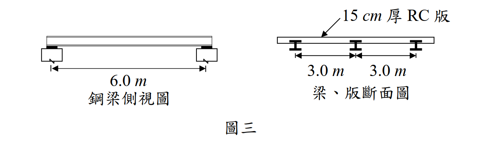

# 考題編號：SS-2010-4

**主分類：** `4.1.2` 梁桿件
**副分類：** 無
**設計法：** LRFD
**標籤：** `梁桿件` `斷面選擇` `使用性撓度` `LRFD` `全側撐` `塑性力矩` `RH斷面` `樓版載重` `撓度檢核`

---

## 1. 原始題目重述 (Problem Restatement)

有一 15 cm 厚鋼筋混凝土版由鋼梁支撐，鋼梁為跨距 6.0 m 之簡支承，梁與梁之間距為 3.0 m，上翼版埋入混凝土版內（如圖三），混凝土單位重 2.4 tf/m³，版面上貼大理石面磚，重 30 kg/m²，樓版承受活載重 400 kg/m²，荷重僅考慮靜載重與活載重之組合，試使用 A992 鋼料（降伏強度 $F_y = 3.52\ \text{tf/cm}^2$，$E = 2{,}040\ \text{tf/cm}^2$），以極限設計法（LSD）參考下表設計：

1. 僅就力矩考量，設計一最經濟之 RH 梁斷面。（15 分）
2. 檢核此斷面之撓度是否合乎 L/360 之規定。（15 分）



*圖說：鋼梁跨距 6.0m，梁間距 3.0m（兩側各 3.0m），RC 版厚 15cm。梁的上翼版埋入混凝土版內，即壓力翼版全程獲側向支撐（不發生側扭挫屈）。*

---

## 2. 考題核心精神與出題者意圖 (Core Concepts & Examiner's Intent)

**核心觀念：梁設計雙重驗算——強度（$\phi_b M_n \geq M_u$）與使用性（$\delta_L \leq L/360$）**

本題為樓版支撐鋼梁的完整設計流程：先由強度條件選斷面，再驗算活載重撓度。題目關鍵條件是「上翼版埋入混凝土版內」，直接告知考生無側扭挫屈（LTB），可直接取 $\phi_b M_p$。撓度與強度往往各自控制不同情況，本題示範撓度（使用率 98.6%）比強度（87.2%）更接近上限的典型案例。

**出題者測驗重點：**

- **「上翼版埋入」= 全側撐 = 無 LTB**：壓力翼版全程側向支撐，$\phi_b M_n = \phi_b M_p = \phi_b F_y Z_x$
- **載重集水寬度**：每根梁承擔 3.0 m 寬的載重（梁間距），線載重 = 面積載重 × 集水寬
- **撓度用未因數化活載重**：$L/360$ 限值針對**活載重**撓度，用服務載重（不乘 1.6），非因數化載重
- **自重迭代**：初步選斷面後須含自重再驗算，本題 RH298×149 因含自重後 $M_u$ 微超 $\phi_b M_n$ 而被淘汰

---

## 3. 解題戰略地圖與陷阱分析 (Strategic Roadmap & Trap Analysis)

**作戰計畫：**
```
(一) 斷面設計：
  Step 1  計算線載重：wD（RC版 + 面磚）× 3m，wL × 3m
  Step 2  設計力矩：wu = 1.2wD + 1.6wL，Mu = wuL²/8
  Step 3  需求 Zx ≥ Mu/(φb Fy)
  Step 4  從斷面表選最輕的 Zx 足夠者（含自重迭代驗算）

(二) 撓度檢核：
  Step 5  以活載重（服務載重，wL，不乘係數）計算撓度
  Step 6  δL = 5wLL⁴/(384EIx)
  Step 7  比較 δallow = L/360
```

**陷阱分析：**

| 陷阱 | 說明 | 對策 |
|------|------|------|
| ❶ 撓度用因數化載重 | 撓度為**使用性**（Serviceability）驗算，用**未因數化**活載重，非 $1.6w_L$ | $\delta = 5w_L L^4/(384EI)$，$w_L$ 是服務載重 |
| ❷ 忘記含自重後迭代 | 初步選斷面後需加入梁自重重新計算 $M_u$，再驗算是否仍通過 | 自重修正通常使 $M_u$ 增加 1～3%，可能使原斷面不足 |
| ❸ 「上翼版埋入」不知含義 | 誤以為仍需計算 LTB，套 $C_b$、$L_p$、$L_r$ | 壓力翼版全側撐 → 直接 $\phi_b M_n = \phi_b F_y Z_x$ |
| ❹ 集水寬搞錯 | 梁間距 3.0 m，但承擔的是**左右各 1.5 m 共 3.0 m**的載重 | 集水寬 = 梁間距 = 3.0 m（每根梁各承擔兩側各半） |
| ❺ 單位換算 | $w_L$ 須從 tf/m 換為 tf/cm（除以 100），$L$ 須從 m 換為 cm（乘以 100） | 撓度公式全用 cm 單位：$w_L = 0.0120$ tf/cm，$L = 600$ cm |

---

## 3.5 變數層次分析（Variable Hierarchy Analysis）

> 複習提示：解題後，在每個卡住的知識點「卡關?」欄標記 `⚠`；第二次複習時只看有 `⚠` 的項目。

**最終目標：** 選最輕合格 RH 鋼梁斷面（$\phi_b M_n \geq M_u$）→ 驗算活載重撓度（$\delta_L \leq L/360$）

### 主要公式（$\boxed{\phantom{x}}$ = 未知，待推導）

**Step 1：需求力矩（LRFD）**
$$\boxed{w_u} = 1.2 w_D + 1.6 w_L, \quad \boxed{M_u} = \frac{\boxed{w_u} L^2}{8}$$

**Step 2：斷面強度需求**
$$\boxed{Z_{x,req}} \geq \frac{\boxed{M_u}}{\phi_b F_y}$$
$$\phi_b M_n = \phi_b F_y \boxed{Z_x} \geq \boxed{M_u} \quad \text{（全側撐 → 無 LTB）}$$

**Step 3：活載重撓度**
$$\boxed{\delta_L} = \frac{5 w_L L^4}{384 E \boxed{I_x}} \leq \frac{L}{360}$$

### L1：題目直接給定

| 符號 | 數值 | 說明 |
|------|------|------|
| $L$ | 6.0 m = 600 cm | 梁跨距 |
| 梁間距 | 3.0 m | 集水寬 |
| RC 版厚 | 15 cm | 單位重 2.4 tf/m³ |
| 面磚 | 30 kg/m² | 靜載重附加 |
| 活載重 | 400 kg/m² | 服務載重 |
| $F_y$ | 3.52 tf/cm² | A992 鋼料 |
| $E$ | 2040 tf/cm² | 彈性模數 |
| $\phi_b$ | 0.9 | 彎曲強度折減係數 |
| 側撐條件 | 上翼版埋入 RC 版 | 全側撐，無 LTB |

### L2：需知識點推導

**Step 1：線載重計算**

| 符號 | 公式 / 來源 | 卡關? |
|------|------------|:-----:|
| $w_D^{(0)}$ | $(0.15 \times 2.4 + 0.030) \times 3.0 = 1.170$ tf/m（不含自重） | |
| $w_L$ | $0.400 \times 3.0 = 1.200$ tf/m | |
| $w_u^{(0)}$ | $1.2 \times 1.170 + 1.6 \times 1.200 = 3.324$ tf/m | |
| $M_u^{(0)}$ | $3.324 \times 6.0^2 / 8 = 14.96$ tf-m = 1496 tf-cm | |

**Step 2：斷面選擇（含自重迭代）**

| 符號 | 公式 / 來源 | 卡關? |
|------|------------|:-----:|
| $Z_{x,req}$ | $M_u^{(0)} / (\phi_b F_y) = 1496 / (0.9 \times 3.52) = 472.2$ cm³ | |
| RH298×149 | $Z_x = 475$ cm³，自重 32.0 kg/m → 含自重 $M_u = 1513 > \phi_b M_n = 1505$（不通過） | |
| RH244×175 | $Z_x = 550$ cm³，自重 43.6 kg/m → 含自重 $M_u = 1520 < \phi_b M_n = 1742$（通過） | |

**Step 3：活載重撓度**

| 符號 | 公式 / 來源 | 卡關? |
|------|------------|:-----:|
| $w_L$（tf/cm） | $1.200 / 100 = 0.01200$ tf/cm | |
| $I_x$ | 6040 cm⁴（RH244×175，查手冊） | |
| $\delta_L$ | $5 \times 0.01200 \times 600^4 / (384 \times 2040 \times 6040) = 1.643$ cm | |
| $\delta_{allow}$ | $L/360 = 600/360 = 1.667$ cm | |
| 結果 | $1.643 < 1.667$ ✓（使用率 98.6%） | |

### L3：深層知識（不懂就卡住）

| 知識點 | 說明 | 補強頁 | 卡關? |
|--------|------|:------:|:-----:|
| 「上翼版埋入」= 全側撐 = 無 LTB | 壓力翼版全程側向支撐，$\phi_b M_n = \phi_b M_p = \phi_b F_y Z_x$，不需算 $C_b$、$L_p$、$L_r$ | [[ltb-3zone]] · [[LATERAL-TORSIONAL-BUCKLING]] | |
| 撓度用服務載重（未因數化） | 撓度為使用性（Serviceability）驗算，用 $w_L$（非 $1.6w_L$）；強度用因數化 $w_u$ | | |
| 自重迭代必要性 | 初估合格的最輕斷面加入自重後可能 $M_u > \phi_b M_n$（本題 RH298×149 超過 0.5%） | | |
| 集水寬 = 梁間距 | 每根梁承擔兩側各 1.5 m，共 3.0 m；非兩倍梁間距 | | |
| 單位換算（tf/m → tf/cm） | 撓度公式全用 cm 單位：$w_L$ 除以 100，$L$ 乘以 100 | | |

---

## 4. 步驟化詳細計算過程 (Step-by-Step Calculation)

### 側向支撐條件

**上翼版埋入混凝土版內** → 壓力翼版全長側向支撐（$L_b = 0$），無側扭挫屈（LTB）：

$$\phi_b M_n = \phi_b M_p = \phi_b F_y Z_x = 0.9 \times 3.52 \times Z_x$$

---

### 一、斷面設計（僅就力矩）

#### Step 1：載重計算（集水寬 = 3.0 m）

| 靜載重來源 | 單位面積重 | 線載重（×3.0 m） |
|-----------|----------|----------------|
| RC 版（$0.15 \times 2.4$） | $0.360\ \text{tf/m}^2$ | $1.080\ \text{tf/m}$ |
| 大理石面磚 | $0.030\ \text{tf/m}^2$ | $0.090\ \text{tf/m}$ |
| 合計（不含自重） | | $w_D^{(0)} = 1.170\ \text{tf/m}$ |

$$w_L = 0.400 \times 3.0 = 1.200\ \text{tf/m}$$

#### Step 2：設計力矩（不含自重初估）

$$w_u^{(0)} = 1.2 \times 1.170 + 1.6 \times 1.200 = 1.404 + 1.920 = 3.324\ \text{tf/m}$$

$$M_u^{(0)} = \frac{3.324 \times 6.0^2}{8} = 14.96\ \text{tf·m} = 1{,}496\ \text{tf·cm}$$

#### Step 3：需求塑性斷面模數

$$Z_{x,req} \geq \frac{M_u}{\phi_b F_y} = \frac{1{,}496}{0.9 \times 3.52} = 472.2\ \text{cm}^3$$

#### Step 4：選擇斷面（含自重迭代）

初選 RH298×149（最輕，$Z_x = 475\ \text{cm}^3$，自重 32.0 kg/m）含自重驗算：

$$w_u = 1.2 \times (1.170 + 0.032) + 1.6 \times 1.200 = 1.442 + 1.920 = 3.362\ \text{tf/m}$$

$$M_u = \frac{3.362 \times 36}{8} = 1{,}513\ \text{tf·cm}; \quad \phi_b M_n = 0.9 \times 3.52 \times 475 = 1{,}505\ \text{tf·cm}$$

$$M_u = 1{,}513 > 1{,}505 \quad \Rightarrow \text{不通過（超過 0.5%，嚴格不合格）}$$

改選 **RH244×175**（$Z_x = 550\ \text{cm}^3$，自重 43.6 kg/m）：

$$w_u = 1.2 \times (1.170 + 0.044) + 1.6 \times 1.200 = 1.457 + 1.920 = 3.377\ \text{tf/m}$$

$$M_u = \frac{3.377 \times 36}{8} = 1{,}520\ \text{tf·cm}; \quad \phi_b M_n = 0.9 \times 3.52 \times 550 = 1{,}742\ \text{tf·cm}$$

$$M_u = 1{,}520 < 1{,}742 \quad \checkmark$$

$$\boxed{\text{選用 RH244×175（最經濟斷面，自重 43.6 kg/m）}}$$

---

### 二、撓度檢核

以**服務載重（未因數化）活載重** $w_L = 1.200\ \text{tf/m}$ 計算。

#### Step 5：撓度公式

$$\delta_L = \frac{5 w_L L^4}{384 E I_x}$$

| 參數 | 數值 |
|------|------|
| $w_L$（換算 tf/cm） | $1.200/100 = 0.01200\ \text{tf/cm}$ |
| $L$ | $600\ \text{cm}$ |
| $E$ | $2{,}040\ \text{tf/cm}^2$ |
| $I_x$（RH244×175） | $6{,}040\ \text{cm}^4$ |

#### Step 6：計算撓度

$$\delta_L = \frac{5 \times 0.01200 \times 600^4}{384 \times 2{,}040 \times 6{,}040} = \frac{7.776 \times 10^9}{4.731 \times 10^9} = 1.643\ \text{cm}$$

#### Step 7：容許撓度比較

$$\delta_{allow} = \frac{L}{360} = \frac{600}{360} = 1.667\ \text{cm}$$

$$\boxed{\delta_L = 1.643\ \text{cm} < 1.667\ \text{cm} \quad \checkmark \quad \text{撓度合乎 L/360（使用率 98.6\%）}}$$

---

## 5. 結果彙整與驗算 (Summary & Verification)

| 項目 | 數值 |
|------|------|
| 集水寬 | $3.0\ \text{m}$ |
| $w_D$（含梁自重） | $1.214\ \text{tf/m}$ |
| $w_L$ | $1.200\ \text{tf/m}$ |
| 設計力矩 $M_u$ | $1{,}520\ \text{tf·cm}$ |
| **選用斷面** | **RH244×175（43.6 kg/m）** |
| $\phi_b M_n$ | $1{,}742\ \text{tf·cm}$（強度使用率 87.2%） |
| 活載重撓度 $\delta_L$ | $1.643\ \text{cm}$ |
| 容許撓度 $L/360$ | $1.667\ \text{cm}$ |
| **撓度檢核** | **✅ 通過（使用率 98.6%）** |

**觀念精析：**

「上翼版埋入混凝土 = 全側撐」的理由：LRFD 中，壓力翼版若獲連續側向支撐，LTB 不發生，$L_b = 0$，故 $\phi_b M_n = \phi_b M_p = \phi_b F_y Z_x$，無需計算 $C_b$、$L_p$、$L_r$。本題上翼版為正彎矩的壓力翼版，嵌入混凝土使其全程受到支撐。

RH298×149 雖最輕但被淘汰：初估 $Z_x = 475 > 472.2\ \text{cm}^3$ 看似合格，但加入自重後 $M_u = 1{,}513\ \text{tf·cm}$ 超過 $\phi_b M_n = 1{,}505\ \text{tf·cm}$（差 0.5%），嚴格不通過。設計中必須以最終自重迭代驗算。

本題撓度（98.6%）比強度（87.2%）更控制斷面選擇，說明使用性設計（Serviceability Design）有時比強度設計（Strength Design）更為嚴苛，二者必須同時驗算。
