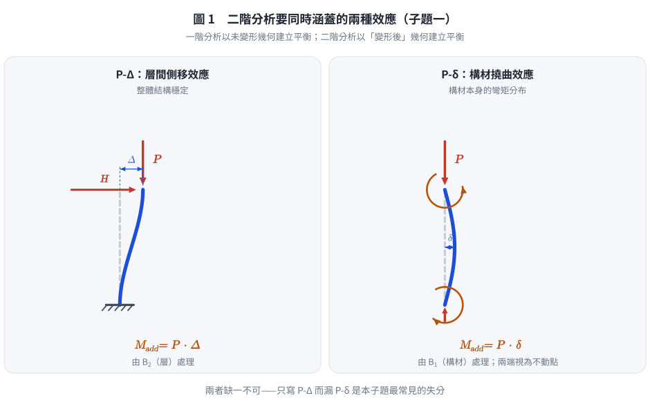
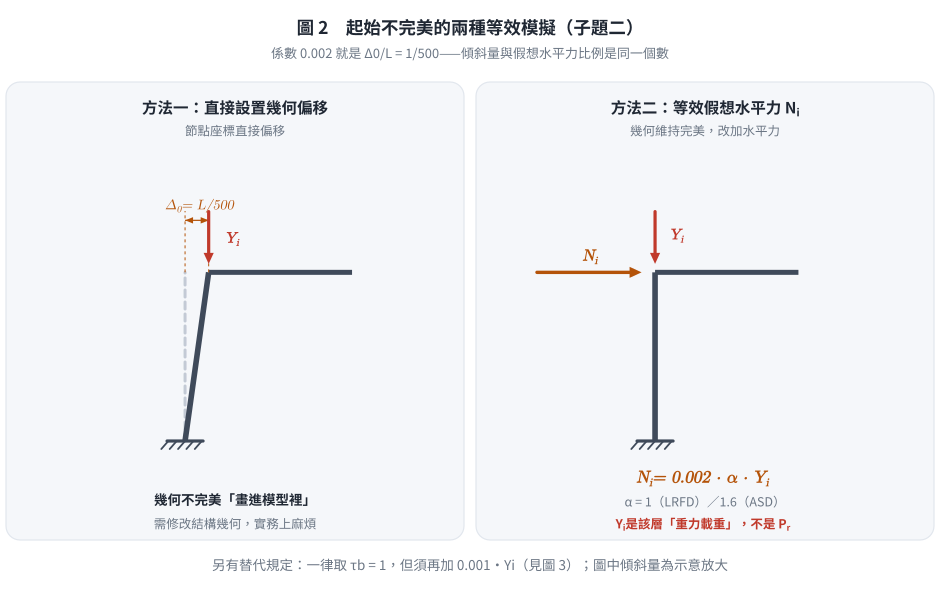
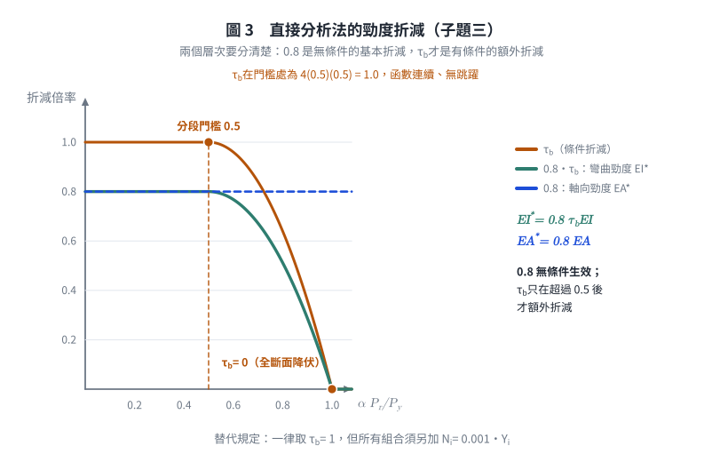
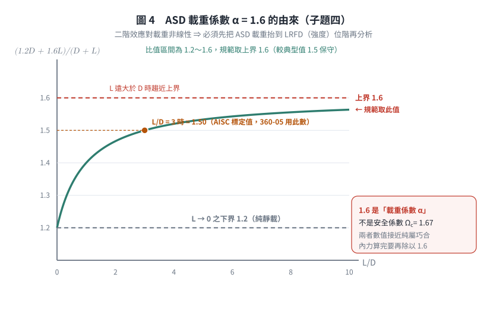

# 考題編號：SS-2011-1

**主分類：** `SS-U1-3` 梁柱桿件（穩定分析）
**副分類：** 無
**設計法：** 概念題
**標籤：** `直接分析法` `二階分析` `初始不完美` `剛度修正` `AISC 2010` `Chapter C` `ASD載重係數` `假想水平力` `tau_b` `規範版本差異`

---

## 1. 原始題目重述 (Problem Restatement)

AISC 2010 年版鋼結構設計規範第 C 章（Chapter C: Design for Stability）針對 AISC 2005 年版第 C 章作大幅修改，將原有第 C 章移至附錄並改用全新規範。AISC 2010 第 C 章要求以**直接分析法（Direct Analysis Method of Design）**進行鋼結構強度確認。

試簡要說明 AISC 2010 第 C 章中：

**(一)** 二階分析與一階分析有何不同？  
**(二)** 二階分析除直接設置結構起始不完美外，亦可用何者來模擬此起始不完美？  
**(三)** 二階分析為何要作剛度修正？什麼情況下需要作剛度修正？  
**(四)** 1.6 倍 ASD 載重中，如何得出此係數 1.6？（25 分）

> 本題無附圖。

---

## 2. 考題核心精神與出題者意圖 (Core Concepts & Examiner's Intent)

**核心觀念：** 測試考生對 AISC 2010 Chapter C「直接分析法」四大核心要素的理解深度——二階效應、初始不完美、剛度折減、ASD 載重放大。

**出題者意圖：**
- 確認考生理解「直接分析法」相較於傳統有效長度法（ELM）的根本差異
- 測試考生能否說明二階分析的理論基礎（P-Δ、P-δ 效應）
- 考察考生對初始不完美模擬方式（直接偏移 vs. 等效假想水平力 NI）的理解
- 測試勁度修正（$0.8\tau_b$ 折減）的物理意義
- 測試 ASD 中 1.6 倍載重的推導邏輯

**陷阱：** 二階分析不只考慮 P-Δ（整體側移），還要考慮 P-δ（構材撓曲），兩者缺一不可。

---

## 3. 解題戰略地圖與陷阱分析 (Strategic Roadmap & Trap Analysis)

| 子題 | 核心考點 | 關鍵陷阱 |
|------|---------|---------|
| (一) | P-Δ + P-δ 二階效應說明 | 一階分析忽略幾何非線性，二階分析考慮變形後幾何 |
| (二) | 等效假想水平力 NI | 非「直接設置偏移」，而是等效替代法 |
| (三) | $\tau_b$ 剛度折減的條件 | 全部構材一律 $0.8$；$\alpha P_r/P_y > 0.5$ 時再乘 $\tau_b < 1$ |
| (四) | ASD **載重係數** $\alpha = 1.6$ 的由來 | ⚠️ 1.6 是**載重係數**，不是安全係數 $\Omega$（$\Omega_c = 1.67$）。二階效應對載重非線性 ⇒ 必須在強度（LRFD）載重位階分析 |

---

## 3.5 變數層次分析（Variable Hierarchy Analysis）

> 複習提示：解題後，在每個卡住的知識點「卡關?」欄標記 `⚠`；第二次複習時只看有 `⚠` 的項目。

**最終目標：** 正確說明 AISC 2010 Chapter C 直接分析法四大核心要素：二階分析、初始不完美、剛度折減、ASD 1.6 倍係數推導

### 主要公式（$\boxed{\phantom{x}}$ = 未知，待推導）

**子題三：剛度修正**
$$EI^* = 0.8\,\tau_b\,EI, \quad EA^* = 0.8\,EA \qquad (\text{規範符號為 } \tau_b\text{，不是 } \tau_a)$$
$$\boxed{\tau_b} = \begin{cases} 1.0 & \alpha P_r/P_y \leq 0.5 \\ 4\left(\dfrac{\alpha P_r}{P_y}\right)\left(1 - \dfrac{\alpha P_r}{P_y}\right) & \alpha P_r/P_y > 0.5 \end{cases}$$

**子題四：ASD 係數推導**
$$\boxed{\alpha} = \frac{P_u}{P_a} \xrightarrow{L \gg D} \frac{1.6L}{L} = 1.6$$

### L1：題目直接給定

| 符號 | 數值 | 說明 |
|------|------|------|
| 規範版本 | AISC 2010 Chapter C | 直接分析法（DAM） |
| 子題數 | 四個子題 | 二階分析、初始不完美、剛度折減、1.6 係數 |

### L2：需知識點推導

**Step 1：二階分析 vs 一階分析**

| 符號 | 公式 / 來源 | 卡關? |
|------|------------|:-----:|
| 一階分析 | 基於未變形幾何，忽略幾何非線性 | |
| P-Δ 效應 | 整體側移 $\Delta$ 在柱軸力 $P$ 下產生附加彎矩 $M_{add} = P\Delta$ | |
| P-δ 效應 | 構材撓曲 $\delta$ 在軸力 $P$ 下產生附加彎矩 $M_{add} = P\delta$ | |

**Step 2：初始不完美模擬**

| 符號 | 公式 / 來源 | 卡關? |
|------|------------|:-----:|
| 直接偏移法 | 節點坐標偏移 $\Delta_0 = L/500$ | |
| 等效假想水平力（NI） | $N_i = 0.002 \alpha Y_i$（$\alpha = 1.0$ LRFD；$\alpha = 1.6$ ASD） | |

**Step 3：剛度折減條件**

| 符號 | 公式 / 來源 | 卡關? |
|------|------------|:-----:|
| 基本折減 | **所有**對穩定有貢獻之構材：$EI^* = 0.8\tau_bEI$、$EA^* = 0.8EA$ | |
| $\tau_b$ | 當 $\alpha P_r/P_y > 0.5$ 時 $\tau_b = 4(\alpha P_r/P_y)(1-\alpha P_r/P_y) < 1$ | |
| $\alpha P_r/P_y \leq 0.5$ | $\tau_b = 1.0$，只乘基本折減 0.8 | |
| 替代規定 | 規範允許**一律取 $\tau_b = 1.0$**，但須額外施加 $0.001Y_i$ 的假想水平力 | |
| 物理意義 | 殘留應力使有效勁度下降；高估勁度會低估側移與二階彎矩，導致不安全 | |

**Step 4：ASD 係數 1.6 推導**

| 符號 | 公式 / 來源 | 卡關? |
|------|------------|:-----:|
| 核心理由 | 二階效應對載重**非線性**，須在 **LRFD（強度）載重位階**評估；ASD 組合約為 LRFD 的 $1/1.6$ | |
| 常見推導 | $\dfrac{1.2D+1.6L}{D+L}$：$D\to0$ 時 $\to 1.6$（上限）；$L\to0$ 時 $\to 1.2$（下限）→ 取上限 1.6 | |
| ⚠️ 校核事實 | AISC 的 ASD↔LRFD 標定是 $\Omega = 1.5/\phi$（$L/D = 3$ 時 $\gamma = 1.5$），且 **360-05 的 H1.2 用的常數就是 1.5**，360-10 才改為 $\alpha = 1.6$。故「1.6」較 1.5 更保守，AISC 解說並未明列單一推導 | |

### L3：深層知識（不懂就卡住）

| 知識點 | 說明 | 補強頁 | 卡關? |
|--------|------|:------:|:-----:|
| P-Δ vs P-δ 差異 | P-Δ 影響整體結構穩定（層間側移）；P-δ 影響構材彎矩分布（桿件撓曲）；兩者均需考慮 | [[P-DELTA-EFFECT]] · [[SECOND-ORDER-ANALYSIS]] | |
| 假想水平力 $N_i$ 的 0.002 來源 | 對應柱初始傾斜 $1/500$（$\Delta_0/L = 0.002$，AISC 施工容許誤差）之等效水平力比例；$Y_i$ 是該層**重力載重**，不是 $P_r$ | | |
| $N_i$ 何時可只加在重力組合 | 當 $\Delta_{2nd}/\Delta_{1st} \leq 1.7$（360-16：$\leq 1.7$）時，$N_i$ 可視為「最小側力」只加在純重力組合；超過則須加在**所有**組合 | | |
| 勁度折減 0.8 的物理意義 | 使 DAM 的構材強度曲線與 ELM 的柱曲線在無側移情況下吻合（校準用）；$\tau_b$ 的額外折減反映高軸力下殘留應力造成的非彈性軟化 | [[RESIDUAL-STRESS]] · [[TANGENT-MODULUS-THEORY]] | |
| DAM 令 $K = 1.0$ 的原因 | DAM 已在分析中直接考慮二階效應、初始不完美、勁度折減，$K$ 的補償作用已無必要 —— 規範明定**取 $K = 1$**（不是「不得小於 1.0」） | [[effective-length-chart]] | |
| ELM／一階分析法的適用限制 | AISC 360-16 附錄 7：ELM（7.2）與一階分析法（7.3）皆限 $\Delta_{2nd}/\Delta_{1st} \leq 1.5$；一階分析法另限 $\alpha P_r/P_y \leq 0.5$。**DAM 無此限制**，適用所有結構 | | |
| ASD 1.6 倍載重後的還原 | 二階分析得到內力後需除以 1.6，再與 ASD 容許強度比較 | | |

---

## 4. 步驟化詳細計算過程 (Step-by-Step Detailed Calculation)

### (一) 二階分析與一階分析的差異

**一階分析（First-order Analysis）：**
- 基於未變形（原始）幾何建立平衡方程式
- 假設結構變形量極小，忽略幾何非線性
- 計算結果不含軸力與撓度交互影響的附加彎矩

**二階分析（Second-order Analysis）：**
- 基於**已變形後的幾何**建立平衡方程式
- 考慮兩種二階效應：

$$\boxed{P\text{-}\Delta \text{ 效應（整體側移效應）}}$$

即結構整體側移 $\Delta$ 在柱軸力 $P$ 下所產生的附加傾覆彎矩：

$$M_{add} = P \cdot \Delta$$

此效應影響整體結構穩定性。

$$\boxed{P\text{-}\delta \text{ 效應（構材局部撓曲效應）}}$$

即構材在軸壓下，由於自身撓曲 $\delta$ 所產生的附加彎矩：

$$M_{add} = P \cdot \delta$$

此效應影響構材本身的彎矩分布。

**策略註解：** 二階分析的本質是「在每個迭代步驟中更新幾何構形」，使平衡方程式反映真實的幾何非線性。一階分析只是二階分析的線性近似。

---

*圖 1　二階分析要同時涵蓋的兩種效應。左圖的變形量是「層」的、右圖是「構材」的；這張圖攔的是子題(一) 只寫 P-Δ 而漏掉 P-δ。*

### (二) 模擬起始不完美（Initial Imperfections）的兩種方式

AISC 2010 Chapter C 允許以下兩種方式模擬結構的初始幾何不完美：

**方法一：直接偏移法（Direct Geometric Imperfection）**
- 在模型中直接將節點坐標偏移，使結構幾何形狀反映初始傾斜或撓曲
- 典型假設：柱的初始傾斜量為 $\Delta_0 = L/500$（AISC 規範値）

**方法二：等效假想水平力法（Notional Loads, NI）**
- 以施加假想水平力（Notional Loads）來等效替代幾何不完美的影響
- 假想水平力大小：

$$N_i = 0.002 \cdot \alpha \cdot Y_i$$

其中：
- $N_i$：施加於第 $i$ 樓層的假想水平力
- $Y_i$：第 $i$ 樓層所承受的重力載重
- $\alpha = 1.0$（LRFD）或 $\alpha = 1.6$（ASD）

**物理意義：** 0.002 係數對應於柱初始傾斜 $1/500$（即 $\Delta_0/L = 1/500$）的等效水平力比例。

**策略註解：** 兩種方法在物理上是等效的，實務上多採用假想水平力法，因為不需要修改結構幾何。

---

*圖 2　起始不完美的兩種等效模擬。$0.002$ 就是 $\Delta_0/L = 1/500$ 這個同一個數；這張圖攔的是把 $N_i$ 寫成 $0.002P_r$（$Y_i$ 是該層**重力載重**，不是構材需求軸力）。*

### (三) 剛度修正（Adjustments to Stiffness）

**為何需要剛度修正？**

鋼結構在軸壓作用下，材料在到達彈性挫屈載重之前，因**殘留應力**的存在會提前進入局部降伏，導致有效剛度降低。若分析中仍使用彈性剛度 $EI$，將**高估結構的抵抗側移能力**，導致不安全的設計結果。

AISC 2010 §C2.3 規定對**所有對結構穩定有貢獻的構材**作以下修正（**規範符號為 $\tau_b$**，不是 $\tau_a$）：

$$EI^* = 0.8\,\tau_b\,EI \quad \text{（彎曲勁度）}$$
$$EA^* = 0.8\,EA \quad \text{（軸向勁度）}$$

其中勁度折減係數 $\tau_b$：

$$\tau_b = \begin{cases}
1.0 & \text{當 } \dfrac{\alpha P_r}{P_{y}} \leq 0.5 \\[6pt]
4\dfrac{\alpha P_r}{P_y}\left(1 - \dfrac{\alpha P_r}{P_y}\right) & \text{當 } \dfrac{\alpha P_r}{P_{y}} > 0.5
\end{cases}$$

其中：
- $P_r$：構材之需求軸壓強度
- $P_y = F_y A_g$：構材全斷面降伏力
- $\alpha = 1.0$（LRFD）或 $\alpha = 1.6$（ASD）

**兩個層次要分清楚：**

| 折減 | 適用範圍 | 何時生效 |
|------|---------|---------|
| **0.8**（基本折減） | 所有對穩定有貢獻的構材，**無條件** | **一律**生效 |
| **$\tau_b$**（額外折減） | 受壓構材之彎曲勁度 | 僅當 $\alpha P_r/P_y > 0.5$ |

**何時需要作勁度修正？**

$$\boxed{\text{勁度修正一律要做（}0.8\text{）；當 } \frac{\alpha P_r}{P_y} > 0.5 \text{ 時再額外乘 } \tau_b < 1.0}$$

$\tau_b$ 於 $\alpha P_r/P_y = 0.5$ 時值為 $4(0.5)(0.5) = 1.0$（**連續**，無跳躍）；於 $= 1.0$ 時降為 0（構材已全斷面降伏、失去彎曲勁度）。

**兩個物理意義層次：**
- **0.8**：並非直接代表殘留應力，而是**校準值**——使 DAM（$K=1$）算出的構材強度與 ELM 的柱曲線在無側移標準情況下吻合。
- **$\tau_b$**：反映高軸力下殘留應力造成的**非彈性軟化**（切線模數下降），使構材的側向勁度貢獻隨軸力增加而衰減。

> **實用替代規定（AISC 360-10 §C2.3(4)／360-16 §C2.3(c)）**：允許**一律取 $\tau_b = 1.0$**，但須在所有載重組合中**額外**施加 $N_i = 0.001Y_i$ 的假想水平力（與模擬初始不完美的 $0.002\alpha Y_i$ 相加）。此法免除逐構材迭代 $\tau_b$ 的麻煩，是實務常用做法。

---

*圖 3　兩個折減層次的分工。$0.8$ 是無條件的水平線、$\tau_b$ 才是超過 $\alpha P_r/P_y = 0.5$ 才轉折的曲線；這張圖攔的是「只有非彈性時才折減」這個常見誤答。*

### (四) ASD 載重中係數 1.6 的推導

**問題核心：** 直接分析法是基於 LRFD 載重組合開發的，ASD 設計載重為服務載重（未因數化），需要乘以 1.6 才能進行二階分析。

**推導過程：**

LRFD 典型重力載重組合：

$$P_u = 1.2 D + 1.6 L$$

ASD 典型服務載重：

$$P_a = D + L$$

**比較兩者之比值：**

在「活載重 $L$ 遠大於恆載重 $D$」的極端情況（控制設計的最不利情形）：

$$\frac{P_u}{P_a} = \frac{1.2D + 1.6L}{D + L} \xrightarrow{L \gg D} \frac{1.6L}{L} = 1.6$$

在「僅有恆載重 $D$，無活載重」的另一極端：

$$\frac{P_u}{P_a} = \frac{1.2D}{D} = 1.2$$

因此，LRFD 因數化載重相對於 ASD 服務載重的比值介於 1.2 至 1.6 之間。AISC 2010 規範取最保守值（上限）：

$$\boxed{\alpha = 1.6 \text{（ASD 時）}}$$

**應用方式：** ASD 進行直接分析法時，所有載重乘以 1.6 進行二階分析及穩定性計算；內力結果再除以 1.6，與 ASD 容許強度比較。

**⚠️ 三點必須說清楚（本子題最容易答得似是而非之處）：**

1. **1.6 是「載重係數 $\alpha$」，不是安全係數 $\Omega$。** ASD 的安全係數是 $\Omega_c = 1.67$（壓力）、$\Omega_b = 1.67$（撓曲）；$\alpha = 1.6$ 只用來把 ASD 載重「抬升」到 LRFD 位階以正確評估二階效應。兩者數值接近（1.6 vs 1.67）純屬巧合，混稱是常見扣分點。

2. **為什麼一定要抬升？** 二階效應（$B_2 = 1/(1-\sum P/\sum P_e)$）對載重是**非線性**的：在服務載重下算出的放大量會系統性低估強度位階的放大量。因此必須在 LRFD 位階分析，再把內力除回來。這是 AISC 給出的**根本理由**，比「1.6 怎麼算出來」更重要，答題時應先寫這一點。

3. **1.6 這個數字的來源要誠實交代。** AISC 規範解說**並未**給出唯一的算式，只說明「ASD 載重組合約為 LRFD 的 $1/1.6$」。可佐證的三項事實：
   - $\dfrac{1.2D+1.6L}{D+L}$ 的區間為 $1.2 \sim 1.6$，取**上限 1.6** 最保守（上面的推導）；
   - AISC 的 ASD／LRFD 標定關係為 $\Omega = 1.5/\phi$，其中 1.5 來自 $L/D = 3$ 時 $\dfrac{1.2D+1.6L}{D+L} = 1.5$；
   - **AISC 360-05 §H1.2 用的常數就是 1.5**，到 360-10 才以 $\alpha = 1.6$ 取代。
   
   換言之：**1.5 是「典型」比值，1.6 是「上限」比值，規範選了較保守的 1.6。** 考場作答寫「取 $L \gg D$ 之上限 1.6，較典型值 1.5 保守」即完整。

---

*圖 4　$\alpha = 1.6$ 的由來與界線。比值區間 $1.2\sim1.6$、規範取上界；這張圖攔的是把 $\alpha = 1.6$ 誤稱為安全係數 $\Omega_c = 1.67$（兩者數值接近純屬巧合）。*

## 5. 關鍵爭議點與進階探討 (Critical Issues & Advanced Discussion)

### 直接分析法 vs. 有效長度法（ELM）的根本差異

| 比較項目 | 直接分析法（DAM） | 有效長度法（ELM） |
|---------|--------------|--------------|
| 二階效應 | 分析中直接考慮 | 以 K 值間接考慮 |
| 初始不完美 | 顯式模擬（偏移或 NI） | 隱含於 K 值中 |
| 勁度折減 | **顯式折減**（$0.8\tau_bEI$、$0.8EA$） | 不折減（用彈性勁度） |
| K 值 | **可設定 K=1.0** | 必須計算 K |
| 適用範圍 | 所有結構型式 | 規則框架較準確 |

### 為何 DAM 可以令 K=1.0？

DAM 已在分析過程中直接考慮了所有的二階效應、初始不完美和非彈性勁度折減，因此構材的強度驗算不再需要透過 $K$ 值來補償這些效應。規範 §C3 明定：**構材受壓強度之有效長度取 $K = 1$**（不是「不得小於 1.0」——是就等於 1）。

**三者的分工可以這樣記：**

| 效應 | ELM 如何處理 | DAM 如何處理 |
|------|------|------|
| 二階效應（P-Δ、P-δ） | 隱含於 $K > 1$ ＋ $B_1B_2$ | **分析中直接算** |
| 初始不完美 | 隱含於 $K$ 與柱曲線 | **顯式**：節點偏移 $L/500$ 或 $N_i = 0.002\alpha Y_i$ |
| 非彈性軟化 | 隱含於柱曲線（$0.658^{\lambda^2}$） | **顯式**：$0.8\tau_bEI$ |

三個效應都被「移到分析裡」之後，$K$ 就沒有工作可做了。

### 考場建議

本題為純概念說明題，評分重點在於**四個子問題各能精準說明核心機制**。每子題建議答案長度：3–5 行，含關鍵術語（P-Δ、P-δ、Notional Load、$\tau_b$、$0.002\alpha Y_i$、$0.8\tau_bEI$），且須提供公式支撐。

**四個子題的「必寫關鍵詞」檢查表：**

| 子題 | 必寫 | 常見失分 |
|------|------|---------|
| (一) | 「以**變形後**幾何建立平衡」＋ **P-Δ**（層間側移）＋ **P-δ**（構材撓曲），兩者缺一不可 | 只寫 P-Δ、漏 P-δ |
| (二) | **假想水平力（Notional Load）** $N_i = 0.002\alpha Y_i$；$Y_i$ 是該層**重力載重** | 寫成 $0.002P_r$、或漏掉 $\alpha$ |
| (三) | **一律** $0.8$；**$\alpha P_r/P_y > 0.5$ 時再乘 $\tau_b$**；理由是非彈性軟化／校準 | 誤答「只有非彈性時才折減」（0.8 是無條件的）；符號寫成 $\tau_a$ |
| (四) | **1.6 是載重係數 $\alpha$**，因二階效應對載重非線性、須在 LRFD 位階分析；$1.2\sim1.6$ 取上限 | 誤稱 $\Omega = 1.6$；忘記「內力再除以 1.6」 |

---

## 6. 依最新規範（AISC 360-16／-22）對照

> **本題的特殊性**：本題問的**就是**當時的「最新規範」（AISC 2010）。故本節說明 **AISC 2010 → 2016 → 2022** 這三版之間，第 C 章又有哪些變動；以及**台灣規範至今仍未引進直接分析法**這件事。

### 6.1 台灣規範的現況：仍在 ELM 體系

| 規範 | 穩定設計方法 | $K$ | 初始不完美 | 勁度折減 |
|------|------|:---:|:---:|:---:|
| **台灣 2010（現行）** | **有效長度法（ELM）** ＋ 第 8.2 節 $B_1B_2$ | 需查對位圖（4.8 節） | 無顯式規定 | 無 |
| AISC 360-05 | ELM 為主，DAM 在附錄 7 | 需算 | 附錄 7 | 附錄 7 |
| **AISC 360-10／-16／-22** | **DAM（第 C 章，主方法）** | **$= 1$** | §C2.2 明文 | §C2.3 明文 |

⚠️ 這是本科的重要規範落差：**台灣現行規範沒有直接分析法**，本題（100 年／2011）等於在考「美國新規範」而非「我國規範」。以 AISC 360-16 為基礎之台灣修訂版**尚未發布**。

### 6.2 AISC 2010 → 2016 → 2022 的第 C 章變動

| 項目 | AISC 360-10（本題所問） | AISC 360-16 | AISC 360-22 |
|------|------|------|------|
| 章節結構 | Ch. C = DAM；App. 7 = ELM；App. 8 = $B_1B_2$ | 同 | 同 |
| 分析須計入之變形 | 撓曲、剪力、軸向 | 明列「**及所有其他**構材與接合變形」 | 同 |
| $\tau_b = 1.0$ 之替代規定 | §C2.3(4)，加 $0.001Y_i$ | §C2.3(c)，同 | 同 |
| $\alpha$（ASD） | §C2.1，$= 1.6$ | 同 | **§C2.1(d)**（條號調整），$= 1.6$ **不變** |
| 有效長度符號 | $KL$ | **$L_c = KL$**（新符號） | $L_c$ |
| ELM 適用限制 | $\Delta_{2nd}/\Delta_{1st} \leq 1.5$ | 同 | 同 |
| 一階分析法 | App. 7.3（$\alpha P_r/P_y \leq 0.5$） | 同 | 同 |

**最需要注意的一項**：AISC 360-16 起把有效長度寫成 **$L_c = KL$**，並在 E3 等式中直接用 $L_c$。若以新版術語作答，「$K$」要寫成「$L_c/L$」。本題屬 2011 年考題，用 $KL$ 即可。

### 6.3 $\alpha = 1.6$ 在 360-22 仍然不變

$$\text{AISC 360-22 §C2.1：ASD 之二階分析須在 } \mathbf{1.6} \times (\text{ASD 載重組合}) \text{ 下進行，結果再除以 } 1.6$$

自 2010 年引入至 2022 年版，**這個係數三版未變**。附錄 8 的 $B_2$ 分母亦寫成 $1 - \alpha\sum P_r/\sum P_{e\,story}$，同一個 $\alpha$。

### 6.4 對照結論

| 子題 | AISC 2010（本題主答） | AISC 360-16／-22 | 差異 |
|------|------|------|:---:|
| (一) 二階 vs 一階 | P-Δ ＋ P-δ | 同（-16 另明列「所有其他變形」） | 微幅擴充 |
| (二) 初始不完美 | 節點偏移 $L/500$ 或 $N_i = 0.002\alpha Y_i$ | 同 | 無 |
| (三) 勁度折減 | $0.8\tau_bEI$、$0.8EA$；可取 $\tau_b=1$＋$0.001Y_i$ | 同（條號 C2.3(c)） | 條號變 |
| (四) $\alpha = 1.6$ | 1.6 | **1.6（不變）** | 無 |
| $K$ | $= 1$ | $L_c = L$（符號改） | 符號 |

**四個子題的答案在 360-10／-16／-22 三版下實質相同**；本題的內容至今仍是有效的。真正的落差在於**台灣規範尚未引進 DAM**——作答時若被問「我國規範如何規定」，須答「我國現行仍採有效長度法＋$B_1B_2$（第 8.2 節），尚無直接分析法之對應條文」。

---

*修正日期：2026-08-22（勘誤：①勁度折減係數符號 $\tau_a$ 全面更正為規範用的 **$\tau_b$**；②釐清「$0.8$ 是無條件折減、$\tau_b$ 才是條件折減」（原文易讓人誤解為只有非彈性才折減），並補 $\tau_b$ 在 $\alpha P_r/P_y = 0.5$ 處連續、$= 1.0$ 處歸零之性質，以及「一律取 $\tau_b=1$ ＋ 額外 $0.001Y_i$」之替代規定；③§3 表格「ASD 安全係數 $\Omega = 1.6$」更正為「**載重係數** $\alpha = 1.6$」（$\Omega_c = 1.67$ 才是安全係數）；④子題(四) 補上誠實的來源交代——AISC 解說未列單一推導，且 **360-05 用的常數是 1.5**、360-10 才改為 1.6，$\Omega = 1.5/\phi$ 的標定給的是 1.5，故 1.6 是「取上限較保守」；⑤「$K$ 可取 1.0（但不得小於 1.0）」更正為規範明定「**取 $K=1$**」；⑥補 $N_i$ 之 $Y_i$ 定義（重力載重，非 $P_r$）與 $\Delta_{2nd}/\Delta_{1st} \leq 1.7$ 之最小側力規定、ELM／一階分析法之 $\leq 1.5$ 適用限制；⑦新增 §6：台灣規範仍在 ELM 體系（無 DAM）之落差說明，及 360-10→-16→-22 第 C 章變動對照（含 $L_c = KL$ 新符號、$\alpha=1.6$ 三版未變））*
*圖解補繪：2026-08-29（向量圖 4 張，腳本 `gen_SS-2011-1.py`，改輸入可原地重跑；SVG 供 wiki／PDF，2× PNG 供 pptx／影片）*
*驗證狀態：unverified*
