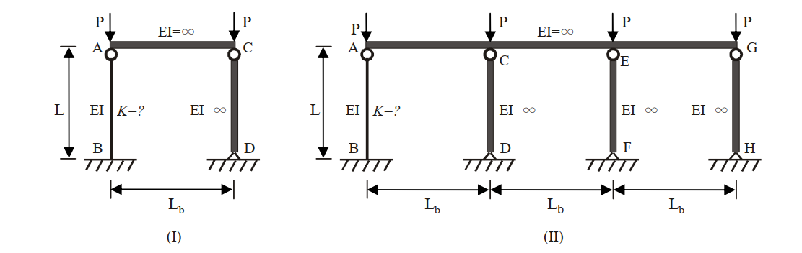

# 考題編號：SS-2011-2

**主分類：** `4.1.1` 拉力及壓力桿件
**副分類：** 無
**設計法：** LRFD
**標籤：** `壓力桿件` `有效長度` `LeMessurier公式` `靠柱效應` `側移構架` `整體挫屈` `K值修正`

---

## 1. 原始題目重述 (Problem Restatement)

AISC 規範針對受壓之鋼架結構系統，在其內部受靠柱效應（Leaning column effect）影響時，建議參考 LeMessurier 公式作有效長度係數 K 值的修正。修正公式如下：

$$K' = \sqrt{\frac{P_e}{P_i} \times \frac{\sum P}{\sum P_{eK}}}$$

- $P_i$：欲求 K 值之柱所受的垂直載重
- $P_e$：柱之尤拉挫屈載重（Euler buckling load）
- $\sum P$：整體結構承受的總垂直外載重
- $\sum P_{eK}$：整體結構所有非靠柱且考慮相應有效長度係數後之挫屈載重（Buckling load）

下圖中有兩個鋼架結構，已知**鋼架（I）中柱 CD，鋼架（II）中柱 CD、柱 EF 及柱 GH 為靠柱**。試以 LeMessurier 公式，分別求解鋼架（I）及鋼架（II）中柱 AB 之有效長度係數 $K_{(I)AB}$ 及 $K_{(II)AB}$，並試求二鋼架結構系統總挫屈載重 $\sum P_{(I)cr}$ 及 $\sum P_{(II)cr}$ 之比值，即 $\sum P_{(I)cr}/\sum P_{(II)cr} = ?$（25 分）



*圖說：鋼架（I）：柱 AB（EI 有限，固接底部 B，頂部 A 由無限剛性梁連接至靠柱 CD 頂部 C，跨度 L_b，柱高 L），靠柱 CD（EI=∞）各承受集中力 P。鋼架（II）：柱 AB（EI 有限）連接三根靠柱 CD、EF、GH（均 EI=∞），各跨度 L_b，各承受集中力 P，柱底均固接。*

---

## 2. 考題核心精神與出題者意圖 (Core Concepts & Examiner's Intent)

**核心觀念：** 靠柱效應（Leaning Column Effect）對側移構架穩定性的影響。靠柱自身不提供抗側力，卻要求「非靠柱」（sway-resisting columns）承擔整個系統的側向穩定性，導致有效 K 值遠大於對位圖所給值。

**出題者意圖：**
- 測試考生能否正確識別靠柱（EI=∞ 者，自身挫屈載重無窮大，但不提供側向剛度時需特別處理）
- 測試 LeMessurier 公式的正確應用（ΣP vs. ΣP_eK 的分母只含非靠柱）
- 揭示重要觀念：增加靠柱不會改變系統總挫屈載重，比值恆為 1

**關鍵陷阱：**
1. 對位圖的 K₀ 值計算錯誤——柱頂為無限剛性梁 → G_top = 0；固接基礎 → G_bottom = 0 → K₀ = 1.0
2. ΣP_eK 的分母誤將靠柱也加入（靠柱的挫屈載重 → ∞，但其貢獻是在 ΣP 的分子中，不在 ΣP_eK 中）
3. 比值計算未認識到系統總挫屈載重與靠柱數量無關

---

## 3. 解題戰略地圖與陷阱分析 (Strategic Roadmap & Trap Analysis)

```
Step 1：確認柱 AB 之邊界條件 → 對位圖求 K₀
         G_top = (EI/L) / (EI_beam/L_b) = (EI/L)/∞ = 0
         G_bottom = 0（固接）
         → 對位圖（無側撐構架）G_A=G_B=0 → K₀ = 1.0
         → P_e = π²EI / (K₀·L)² = π²EI/L²

Step 2：鋼架（I）套用 LeMessurier 公式
         P_i = P（柱 AB 之載重）
         ΣP = 2P（AB + CD 各 P）
         ΣP_eK = π²EI/L²（只含非靠柱 AB）
         → K'_(I)AB = √2 ≈ 1.414

Step 3：鋼架（II）套用 LeMessurier 公式
         P_i = P
         ΣP = 4P（AB + CD + EF + GH 各 P）
         ΣP_eK = π²EI/L²（仍只含非靠柱 AB）
         → K'_(II)AB = 2.0

Step 4：計算系統總挫屈載重比值
         ΣP_(I)cr = 2 × [π²EI/(√2·L)²] = π²EI/L²
         ΣP_(II)cr = 4 × [π²EI/(2L)²] = π²EI/L²
         → 比值 = 1
```

---

## 3.5 變數層次分析（Variable Hierarchy Analysis）

> 複習提示：解題後，在每個卡住的知識點「卡關?」欄標記 `⚠`；第二次複習時只看有 `⚠` 的項目。

**最終目標：** 套用 LeMessurier 公式求側移構架中柱 AB 的修正有效長度係數 K，並證明系統總挫屈載重比值 $\sum P_{(I)cr}/\sum P_{(II)cr} = 1$

### 主要公式（$\boxed{\phantom{x}}$ = 未知，待推導）

$$\boxed{K_0} = 1.0 \quad (G_A = G_B = 0 \text{ 查對位圖})$$
$$P_e = \frac{\pi^2 EI}{(K_0 L)^2}$$
$$\boxed{K'_{AB}} = \sqrt{\frac{P_e}{P_i} \times \frac{\sum P}{\sum P_{eK}}}$$
$$\boxed{\sum P_{cr}} = n_{col} \times \frac{\pi^2 EI}{(K'_{AB} \cdot L)^2}$$

### L1：題目直接給定

| 符號 | 數值 | 說明 |
|------|------|------|
| $EI$ | 有限值（柱 AB） | 柱 AB 的抗彎剛度 |
| $EI_{CD}$ | $\infty$（靠柱） | 靠柱之剛度無限大 |
| $EI_{beam}$ | $\infty$（頂梁） | 頂部梁剛度無限大 |
| $L$ | 柱高 | 柱 AB 之高度 |
| 邊界條件 | 底端固接，頂端無限剛性梁 | 兩端 $G = 0$ |
| 鋼架(I) 靠柱數 | 1（柱 CD） | 含 AB 共 2 根柱，各承受 P |
| 鋼架(II) 靠柱數 | 3（CD、EF、GH） | 含 AB 共 4 根柱，各承受 P |

### L2：需知識點推導

**Step 1：邊界條件分析，求 $K_0$**

| 符號 | 公式 / 來源 | 卡關? |
|------|------------|:-----:|
| $G_A$ | $\sum(EI_c/L_c)/\sum(EI_b/L_b) = (EI/L)/\infty = 0$ | |
| $G_B$ | 固接基礎 → $G = 0$ | |
| $K_0$ | 查對位圖（無側撐框架，$G_A=G_B=0$）→ $K_0 = 1.0$ | |
| $P_e$ | $\pi^2 EI / (K_0 L)^2 = \pi^2 EI / L^2$ | |

**Step 2：LeMessurier 公式 — 鋼架(I)**

| 符號 | 公式 / 來源 | 卡關? |
|------|------------|:-----:|
| $P_i$ | $P$（柱 AB 之載重） | |
| $\sum P_{(I)}$ | $2P$（AB + CD 各 P） | |
| $\sum P_{eK,(I)}$ | $\pi^2 EI/L^2$（只含非靠柱 AB） | |
| $K'_{(I)AB}$ | $\sqrt{(P_e/P) \times (2P/P_e)} = \sqrt{2}$ | |

**Step 3：LeMessurier 公式 — 鋼架(II)**

| 符號 | 公式 / 來源 | 卡關? |
|------|------------|:-----:|
| $\sum P_{(II)}$ | $4P$（AB + CD + EF + GH 各 P） | |
| $\sum P_{eK,(II)}$ | $\pi^2 EI/L^2$（仍只含非靠柱 AB） | |
| $K'_{(II)AB}$ | $\sqrt{(P_e/P) \times (4P/P_e)} = 2.0$ | |

**Step 4：系統總挫屈載重比值**

| 符號 | 公式 / 來源 | 卡關? |
|------|------------|:-----:|
| $\sum P_{(I)cr}$ | $2 \times \pi^2 EI/(K'_{(I)}\cdot L)^2 = \pi^2 EI/L^2$ | |
| $\sum P_{(II)cr}$ | $4 \times \pi^2 EI/(K'_{(II)}\cdot L)^2 = \pi^2 EI/L^2$ | |
| 比值 | $\sum P_{(I)cr}/\sum P_{(II)cr} = 1$ | |

### L3：深層知識（不懂就卡住）

| 知識點 | 說明 | 補強頁 | 卡關? |
|--------|------|:------:|:-----:|
| 靠柱效應定義 | 靠柱（EI=∞）自身不提供側向剛度，不列入 $\sum P_{eK}$ 分母 | | |
| LeMessurier 公式物理意義 | $\sum P_{eK}$ 只含「非靠柱」之挫屈載重；靠柱載重出現在 $\sum P$ 分子 | | |
| 有效長度係數 K | 對位圖查法：$G_A = G_B = 0$ 對應固定-固定（允許側移）→ $K_0 = 1.0$ | [[effective-length-chart]] | |
| 系統總挫屈載重與靠柱數無關 | $K' = \sqrt{n_{col}}$，代入後 $\sum P_{cr} = \pi^2 EI/L^2$ 恆定，靠柱僅稀釋個別 K 值 | | |
| 固接底部 G 值取法 | 固接底部理論值為 0，實務取 G = 1（或依題意 G = 0） | | |

---

## 4. 步驟化詳細計算過程 (Step-by-Step Detailed Calculation)

### Step 1：確認柱 AB 之邊界條件，求基礎 K₀

**柱 AB 的連結條件：**
- 下端 B：固接（固定端，Theoretically fixed）→ $G_B = 0$
- 上端 A：由無限剛性梁（$EI_{beam} = \infty$）連接

對位圖 G 值計算（上端 A）：

$$G_A = \frac{\sum(EI_{col}/L_{col})}{\sum(EI_{beam}/L_{beam})} = \frac{EI/L}{\infty/L_b} = 0$$

**【對位圖查值（無側撐構架 / Unbraced frame）：$G_A = 0$，$G_B = 0$】**

$$\boxed{K_0 = 1.0}$$

*策略註解：* 固接基礎 + 頂部無限剛性梁 = 兩端均有完全轉動拘束，側移構架中 K₀ = 1.0（對應「固定-固定，允許側移」的理論值）。

**柱 AB 的尤拉挫屈載重：**

$$P_e = \frac{\pi^2 EI}{(K_0 L)^2} = \frac{\pi^2 EI}{L^2}$$

---

### Step 2：鋼架（I）— $K_{(I)AB}$

**各量確認：**

| 參數 | 說明 | 值 |
|------|------|-----|
| $P_i$ | 柱 AB 所受垂直載重 | $P$ |
| $P_e$ | 柱 AB 尤拉挫屈載重（$K_0=1$） | $\pi^2 EI / L^2$ |
| $\sum P$ | 系統總垂直載重 = P（AB）+ P（CD） | $2P$ |
| $\sum P_{eK}$ | 非靠柱挫屈載重（只含 AB） | $\pi^2 EI / L^2$ |

*注意：* 靠柱 CD（$EI=\infty$）自身挫屈載重趨近無窮大，不參與抗側力，故**不列入 $\sum P_{eK}$**。

**套用 LeMessurier 公式：**

$$K'_{(I)AB} = \sqrt{\frac{P_e}{P_i} \times \frac{\sum P}{\sum P_{eK}}}
= \sqrt{\frac{\dfrac{\pi^2 EI}{L^2}}{P} \times \frac{2P}{\dfrac{\pi^2 EI}{L^2}}}
= \sqrt{2}$$

$$\boxed{K_{(I)AB} = \sqrt{2} \approx 1.414}$$

---

### Step 3：鋼架（II）— $K_{(II)AB}$

鋼架（II）含柱 AB 及三根靠柱 CD、EF、GH，各承受集中力 P。

**各量確認：**

| 參數 | 說明 | 值 |
|------|------|-----|
| $P_i$ | 柱 AB 所受垂直載重 | $P$ |
| $P_e$ | 柱 AB 尤拉挫屈載重（$K_0=1$） | $\pi^2 EI / L^2$ |
| $\sum P$ | 系統總垂直載重 = P×4（AB+CD+EF+GH） | $4P$ |
| $\sum P_{eK}$ | 非靠柱挫屈載重（只含 AB） | $\pi^2 EI / L^2$ |

**套用 LeMessurier 公式：**

$$K'_{(II)AB} = \sqrt{\frac{P_e}{P_i} \times \frac{\sum P}{\sum P_{eK}}}
= \sqrt{\frac{\dfrac{\pi^2 EI}{L^2}}{P} \times \frac{4P}{\dfrac{\pi^2 EI}{L^2}}}
= \sqrt{4}$$

$$\boxed{K_{(II)AB} = 2.0}$$

---

### Step 4：系統總挫屈載重比值

**鋼架（I）系統挫屈載重：**

柱 AB 的挫屈載重：

$$P_{cr,AB}^{(I)} = \frac{\pi^2 EI}{(K'_{(I)AB} \cdot L)^2} = \frac{\pi^2 EI}{(\sqrt{2} \cdot L)^2} = \frac{\pi^2 EI}{2L^2}$$

系統挫屈時，所有柱（AB 和 CD）均承受 $P = P_{cr,AB}^{(I)}$，故：

$$\sum P_{(I)cr} = 2 \times P_{cr,AB}^{(I)} = 2 \times \frac{\pi^2 EI}{2L^2} = \frac{\pi^2 EI}{L^2}$$

**鋼架（II）系統挫屈載重：**

柱 AB 的挫屈載重：

$$P_{cr,AB}^{(II)} = \frac{\pi^2 EI}{(K'_{(II)AB} \cdot L)^2} = \frac{\pi^2 EI}{(2L)^2} = \frac{\pi^2 EI}{4L^2}$$

系統挫屈時，四根柱均承受 $P = P_{cr,AB}^{(II)}$：

$$\sum P_{(II)cr} = 4 \times P_{cr,AB}^{(II)} = 4 \times \frac{\pi^2 EI}{4L^2} = \frac{\pi^2 EI}{L^2}$$

**比值：**

$$\boxed{\frac{\sum P_{(I)cr}}{\sum P_{(II)cr}} = \frac{\dfrac{\pi^2 EI}{L^2}}{\dfrac{\pi^2 EI}{L^2}} = 1}$$

---

## 5. 關鍵爭議點與進階探討 (Critical Issues & Advanced Discussion)

### 核心洞察：靠柱效應不改變系統總挫屈載重

$$\sum P_{cr} = n_{col} \times \frac{\pi^2 EI}{(K' L)^2}$$

使用 LeMessurier 公式，$K' = \sqrt{n_{col}}$（$n_{col}$ = 含靠柱的總柱數），代入得：

$$\sum P_{cr} = n_{col} \times \frac{\pi^2 EI}{n_{col} L^2} = \frac{\pi^2 EI}{L^2}$$

此值**與靠柱數量 $n_{col}$ 無關**！

**物理意義：** 系統的側向穩定性**完全由非靠柱提供**。增加靠柱只是「稀釋」每根柱的個別挫屈載重（K 值增大），但系統的總承載能力始終等於非靠柱自身的挫屈載重，不會隨靠柱數量增加而提高。

### K 值的直覺規律（LeMessurier）

$$K'_{AB} = K_0 \times \sqrt{\frac{\sum P}{\sum P_{eK}}} \times \frac{1}{K_0} = \sqrt{\frac{\sum P}{P_e / K_0^2} \times \frac{K_0^2 P_e}{P_i \cdot \sum P_{eK}}}$$

當 $K_0 = 1$、只有一根非靠柱 AB、每根柱各承 P：

$$K'_{AB} = \sqrt{n_{col}}$$

其中 $n_{col}$ 為含靠柱在內的總柱數。

### 考場應用建議

- 鋼架（I）：$K = \sqrt{2} \approx 1.414$
- 鋼架（II）：$K = 2.0$
- 比值：$\sum P_{(I)cr}/\sum P_{(II)cr} = 1$（最重要的結論）
- 答題需說明「靠柱不列入 $\sum P_{eK}$」的理由，否則會扣分
