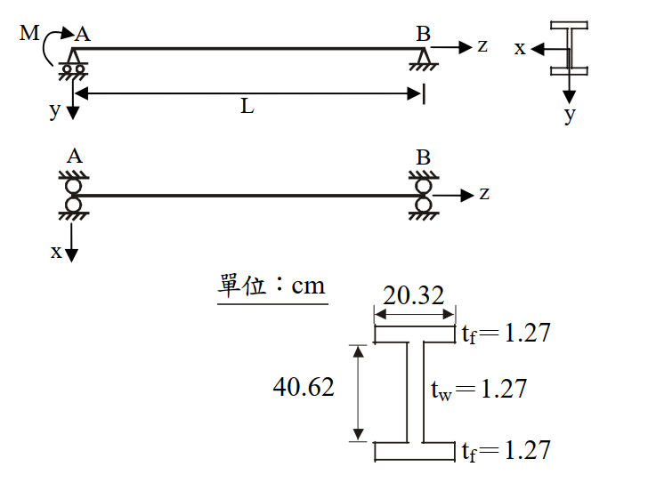

# 考題編號：SS-2011-3

**主分類：** `SS-U1-2` 梁桿件
**副分類：** 無
**設計法：** LRFD
**標籤：** `梁桿件` `LTB側扭挫屈` `非彈性LTB` `Cb係數` `端彎矩` `X1X2參數` `結實斷面` `標稱彎矩` `翹曲常數Cw` `規範版本差異`

---

## 1. 原始題目重述 (Problem Restatement)

圖示一鋼梁，已知鋼梁在 A 端有一彎矩 M 作用，鋼梁長度 L 為 812.8 cm，梁鋼材特性及斷面尺寸如下所示。試用 LRFD 規範求解此鋼梁所能承受之標稱彎矩 $M_n$，並確認此梁挫屈時是否在彈性範圍內。（25 分）

**材料特性：**
- $E = 2100 \text{ tf/cm}^2$，$G = 840 \text{ tf/cm}^2$
- $F_y = 2.52 \text{ tf/cm}^2$，$F_r = 1.05 \text{ tf/cm}^2$

**斷面尺寸（H 型鋼）：**
- 全深：$d = 40.62 \text{ cm}$
- 翼板寬：$b_f = 20.32 \text{ cm}$
- 翼板厚：$t_f = 1.27 \text{ cm}$
- 腹板厚：$t_w = 1.27 \text{ cm}$

**支撐條件：**
- A 端：施加彎矩 M，銷支承（可防止側移及扭轉）
- B 端：滾支承（可防止側移及扭轉）
- 無側向中間支撐，無側撐長度 $L_b = L = 812.8 \text{ cm}$



*圖說：簡支梁，A 端（左，銷支承）施加彎矩 M，B 端（右，滾支承），跨度 L=812.8 cm。斷面 H 型鋼（單位 cm）：全深 d=40.62，翼板寬 bf=20.32，翼板厚 tf=1.27（上下各），腹板厚 tw=1.27。側向扭轉挫屈邊界條件：A、B 兩端均為銷接（防止側移及扭轉），無側撐長度等於全跨。*

---

## 2. 考題核心精神與出題者意圖 (Core Concepts & Examiner's Intent)

**核心觀念：** 非對稱彎矩分布（端彎矩型）下，利用 $C_b = 1.75$、$X_1$–$X_2$ 參數法計算 LRFD 側扭挫屈標稱彎矩，並判斷 LTB 類型（彈性 vs. 非彈性）。

**出題者意圖：**
- 測試完整的 LTB 三段判斷流程（Lp / Lr 計算）
- 端彎矩型 $C_b = 1.75$ 的正確識別（而非預設 1.0）
- $X_1$、$X_2$ 複雜公式的計算能力（含 J、$C_W$ 之推導）
- LTB 類型判斷（此題 $L_b < L_r$ → 非彈性，與彈性差之毫釐）

**關鍵陷阱：**
1. $C_b$ 易誤設為 1.0（未考慮端彎矩加成效果 $C_b = 1.75$）
2. $d$ 與 $h$ 混淆：$d = 40.62$ cm 為全深，$h = d - 2t_f = 38.08$ cm 為腹板凈高
3. $M_n$ 上限需與 $M_p$ 比較（$C_b$ 放大後仍不能超過 $M_p$）
4. 題目問「是否在彈性範圍內」——需比較 $L_b$ 與 $L_r$

---

## 3. 解題戰略地圖與陷阱分析 (Strategic Roadmap & Trap Analysis)

```
Step 1：斷面幾何計算 → A、Ix、Iy、Sx、Zx、J、Cw、ry
Step 2：結實斷面確認（翼板、腹板寬厚比）
Step 3：Cb 計算（端彎矩型：Cb = 1.75）
Step 4：計算 X₁、X₂ → 計算 Lp、Lr
Step 5：比較 Lb 與 Lp、Lr → 判斷 LTB 類型
Step 6：套用非彈性 LTB 公式 → 得 Mn（≤ Mp）
```

---

## 3.5 變數層次分析（Variable Hierarchy Analysis）

> 複習提示：解題後，在每個卡住的知識點「卡關?」欄標記 `⚠`；第二次複習時只看有 `⚠` 的項目。

**最終目標：** 計算 H 型鋼梁在端彎矩型載重下的標稱彎矩 $M_n$（非彈性 LTB），並確認挫屈是否在彈性範圍內

### 主要公式（$\boxed{\phantom{x}}$ = 未知，待推導）

$$\boxed{L_p} = \frac{80 r_y}{\sqrt{F_y}}, \quad \boxed{L_r} = \frac{r_y X_1}{F_y - F_r}\sqrt{1 + \sqrt{1 + X_2(F_y-F_r)^2}}$$
$$C_b = 1.75 \quad (\text{端彎矩型，} M_1/M_2 = 0)$$
$$\boxed{M_n} = C_b\left[M_p - (M_p - M_r)\frac{L_b - L_p}{L_r - L_p}\right] \leq M_p$$

### L1：題目直接給定

| 符號 | 數值 | 說明 |
|------|------|------|
| $E$ | 2100 tf/cm² | 彈性模數 |
| $G$ | 840 tf/cm² | 剪切模數 |
| $F_y$ | 2.52 tf/cm² | 降伏應力 |
| $F_r$ | 1.05 tf/cm² | 殘留應力 |
| $L_b$ | 812.8 cm | 側向無支撐長度（全跨） |
| $d$ | 40.62 cm | 斷面全深 |
| $b_f$ | 20.32 cm | 翼板寬 |
| $t_f$ | 1.27 cm | 翼板厚 |
| $t_w$ | 1.27 cm | 腹板厚 |
| 載重型式 | A 端彎矩 M，B 端 0 | 端彎矩型（單向曲率） |

### L2：需知識點推導

**Step 1：斷面幾何計算**

| 符號 | 公式 / 來源 | 卡關? |
|------|------------|:-----:|
| $h$ | $d - 2t_f = 38.08$ cm（腹板淨高） | |
| $A$ | $2b_ft_f + ht_w = 99.97$ cm² | |
| $I_x$ | $\frac{1}{12}[b_f d^3 - (b_f-t_w)h^3] = 25{,}831$ cm⁴ | |
| $S_x$ | $I_x/(d/2) = 1271.8$ cm³ | |
| $Z_x$ | $b_ft_f(d-t_f) + t_wh^2/4 = 1475.9$ cm³ | |
| $I_y$ | $2t_fb_f^3/12 + ht_w^3/12 = 1782.4$ cm⁴ | |
| $r_y$ | $\sqrt{I_y/A} = 4.222$ cm | |
| $J$ | $(t_f^3/3)(2b_f + h) = 53.74$ cm⁴（St. Venant 扭矩） | |
| $C_W$ | **題目公式表**：$I_f h^2/2 = 687{,}469$ cm⁶（$I_f = t_fb_f^3/12$，$h = d-t_f$） | |

**Step 2：$C_b$ 與 $L_p$、$L_r$ 計算**

| 符號 | 公式 / 來源 | 卡關? |
|------|------------|:-----:|
| $C_b$ | $1.75 + 1.05(M_1/M_2) + 0.3(M_1/M_2)^2 = 1.75$（$M_1=0$） | |
| $M_p$ | $F_y Z_x = 3719.2$ tf·cm | |
| $M_r$ | $(F_y - F_r)S_x = 1869.6$ tf·cm | |
| $X_1$ | $(\pi/S_x)\sqrt{EGJA/2} = 170.1$ tf/cm² | |
| $X_2$ | $4(C_W/I_y)(S_x/GJ)^2 = 1.224$ cm⁴/tf² | |
| $L_p$ | $80r_y/\sqrt{F_y} = 212.8$ cm | |
| $L_r$ | $(r_y X_1/(F_y-F_r))\sqrt{1+\sqrt{1+X_2(F_y-F_r)^2}} = 833.2$ cm | |

**Step 3：LTB 類型判斷與 $M_n$ 計算**

| 符號 | 公式 / 來源 | 卡關? |
|------|------------|:-----:|
| 比較 | $L_p = 212.8 < L_b = 812.8 < L_r = 833.2$ cm → 非彈性 LTB（餘裕僅 20.4 cm） | |
| $M_n$ | $C_b[M_p - (M_p-M_r)(L_b-L_p)/(L_r-L_p)] = 3378$ tf·cm | |
| 上限檢核 | $M_n \leq M_p = 3719.2$ tf·cm ✓ | |

### L3：深層知識（不懂就卡住）

| 知識點 | 說明 | 補強頁 | 卡關? |
|--------|------|:------:|:-----:|
| LTB 三段判斷 | $L_b \leq L_p$ 塑性 / $L_p < L_b \leq L_r$ 非彈性 / $L_b > L_r$ 彈性，判斷錯會用錯公式 | [[ltb-3zone]] · [[LATERAL-TORSIONAL-BUCKLING]] | |
| $C_b$ 端彎矩型 | $M_1/M_2 = 0$ 時 $C_b = 1.75$，誤設 1.0 導致結果低 75% | [[cb-factor]] · [[BENDING-MODIFICATION-FACTOR-CB]] | |
| $X_1$、$X_2$ 參數 | 含 J（扭矩）、$C_W$（翹曲）的斷面挫屈參數，J 與 $C_W$ 定義容易混淆 | | |
| 翹曲常數 $C_W$ | 本卷公式表明列 $C_W = I_f h^2/2$（$I_f$＝**單一翼板**對弱軸慣性矩，$h = d-t_f$）；近似式 $I_y(d-t_f)^2/4$ 會高估 0.37%（差在腹板項，$I_y/2 \neq I_f$） | | |
| $M_n$ 上限不可超過 $M_p$ | $C_b$ 放大後仍需截斷在 $M_p$，否則預測強度超過塑性極限 | [[ltb-3zone]] | |
| 殘留應力 $F_r$ | 熱軋型鋼取 $F_r = 0.5F_y$ 或題目給定值，影響 $M_r$ 與 $L_r$ 計算 | [[RESIDUAL-STRESS]] | |

---

## 4. 步驟化詳細計算過程 (Step-by-Step Detailed Calculation)

### Step 1：斷面幾何計算

**基本幾何量：**

| 符號 | 計算 | 值 |
|------|------|-----|
| $h$（腹板凈高） | $d - 2t_f = 40.62 - 2(1.27)$ | $38.08 \text{ cm}$ |
| $A$（斷面積） | $2 b_f t_f + h t_w$ | $2(20.32)(1.27) + (38.08)(1.27) = 51.61 + 48.36 = 99.97 \text{ cm}^2$ |

**強軸慣性矩 $I_x$：**

$$I_x = \frac{1}{12}\left[b_f d^3 - (b_f - t_w)h^3\right]$$

$$= \frac{1}{12}\left[20.32 \times 40.62^3 - 19.05 \times 38.08^3\right]$$

$$= \frac{1}{12}\left[20.32 \times 67,023 - 19.05 \times 55,218\right]$$

$$= \frac{1}{12}\left[1,361,911 - 1,051,944\right] = \frac{309,967}{12}$$

$$\boxed{I_x = 25,831 \text{ cm}^4}$$

**強軸斷面模數 $S_x$：**

$$S_x = \frac{I_x}{d/2} = \frac{25,831}{20.31} = 1271.8 \text{ cm}^3$$

**強軸塑性斷面模數 $Z_x$（PNA 在形心）：**

$$Z_x = 2\left[b_f t_f \cdot \frac{d-t_f}{2}\right] + 2\left[t_w \cdot \frac{h}{2} \cdot \frac{h}{4}\right]$$

$$= b_f t_f (d - t_f) + \frac{t_w h^2}{4} = 25.806 \times 39.35 + \frac{1.27 \times 38.08^2}{4}$$

$$= 1015.5 + 460.4$$

$$\boxed{Z_x = 1475.9 \text{ cm}^3}$$

**弱軸慣性矩 $I_y$：**

$$I_y = \frac{2t_f b_f^3}{12} + \frac{h t_w^3}{12}$$

$$= \frac{2(1.27)(20.32)^3}{12} + \frac{(38.08)(1.27)^3}{12}$$

$$= \frac{2(1.27)(8390)}{12} + \frac{(38.08)(2.048)}{12} = 1775.9 + 6.5$$

$$\boxed{I_y = 1782.4 \text{ cm}^4}$$

**弱軸迴轉半徑 $r_y$：**

$$r_y = \sqrt{\frac{I_y}{A}} = \sqrt{\frac{1782.4}{99.97}} = 4.222 \text{ cm}$$

**扭轉常數 $J$（St. Venant 扭矩）：**

$$J = \frac{1}{3}\left[2b_f t_f^3 + h t_w^3\right] = \frac{t_f^3}{3}(2b_f + h)$$

$$= \frac{(1.27)^3}{3}(2 \times 20.32 + 38.08) = \frac{2.048}{3}(78.72)$$

$$\boxed{J = 53.74 \text{ cm}^4}$$

**翹曲常數 $C_W$（依本卷第三頁公式表：$C_W = I_f h^2 / 2$）：**

其中 $I_f$ 為**單一翼板**對弱軸之慣性矩，$h = d - t_f$ 為兩翼板形心距：

$$I_f = \frac{t_f b_f^3}{12} = \frac{1.27 \times 20.32^3}{12} = \frac{1.27 \times 8390.2}{12} = 887.96 \text{ cm}^4$$

$$h = d - t_f = 40.62 - 1.27 = 39.35 \text{ cm}$$

$$C_W = \frac{I_f h^2}{2} = \frac{887.96 \times 39.35^2}{2} = \frac{887.96 \times 1548.42}{2}$$

$$\boxed{C_W = 687,469 \text{ cm}^6}$$

> ⚠️ **易錯點**：常見近似式 $C_W \approx I_y(d-t_f)^2/4$ 得 689,985 cm⁶，比正解**高 0.37%**。
> 原因：$C_W$ 只計**翼板**的翹曲貢獻（$I_f$），而 $I_y = 2I_f + t_w^3h/12$ 還含腹板項，
> 故 $I_y/2 = 891.21 \neq I_f = 887.96$。本卷公式表既已明列 $I_f h^2/2$，即應照用。

---

### Step 2：結實斷面確認

**翼板寬厚比：**
$$\lambda_f = \frac{b_f}{2t_f} = \frac{20.32}{2(1.27)} = 8.0 < \frac{17}{\sqrt{F_y}} = \frac{17}{\sqrt{2.52}} = 10.71 \quad \checkmark \text{（結實翼板）}$$

**腹板寬厚比（純彎曲，$f_a = 0$）：**
$$\lambda_w = \frac{h}{t_w} = \frac{38.08}{1.27} = 29.98 < \frac{170}{\sqrt{F_y}} = \frac{170}{\sqrt{2.52}} = 107.1 \quad \checkmark \text{（結實腹板）}$$

→ 斷面為**結實斷面（Compact Section）**，$\phi_b M_p$ 為上限，可使用完整 LTB 公式。

---

### Step 3：Cb 計算（端彎矩型）

加載型式：A 端彎矩 M，B 端彎矩 0，彎矩圖為線性遞減（單向曲率）。

$$C_b = 1.75 + 1.05\left(\frac{M_1}{M_2}\right) + 0.3\left(\frac{M_1}{M_2}\right)^2 \leq 2.3$$

其中 $M_1 = 0$（較小端），$M_2 = M$（較大端）：

$$\boxed{C_b = 1.75 + 1.05(0) + 0.3(0)^2 = 1.75}$$

---

### Step 4：計算 $X_1$、$X_2$，求 $L_p$、$L_r$

**$X_1$（截面固有挫屈參數）：**

$$X_1 = \frac{\pi}{S_x}\sqrt{\frac{EGJA}{2}}$$

$$EGJA = 2100 \times 840 \times 53.75 \times 99.97 = 9.4805 \times 10^9$$

$$\sqrt{\frac{EGJA}{2}} = \sqrt{4.7403 \times 10^9} = 68,850$$

$$X_1 = \frac{\pi}{1271.8} \times 68,850 = \boxed{170.1 \text{ tf/cm}^2}$$

**$X_2$（截面固有挫屈參數）：**

$$X_2 = 4\frac{C_W}{I_y}\left[\frac{S_x}{GJ}\right]^2$$

$$\frac{C_W}{I_y} = \frac{687,469}{1782.4} = 385.68 \text{ cm}^2$$

$$\frac{S_x}{GJ} = \frac{1271.8}{840 \times 53.75} = \frac{1271.8}{45{,}150} = 0.028168 \text{ cm/tf}$$

$$X_2 = 4 \times 385.68 \times (0.028168)^2 = 4 \times 385.68 \times 7.934 \times 10^{-4} = \boxed{1.224 \text{ cm}^4/\text{tf}^2}$$

> 量綱檢查：$X_2(F_y-F_r)^2$ 須無因次 —— $(\text{cm}^4/\text{tf}^2)(\text{tf}/\text{cm}^2)^2 = 1$ ✓

**$L_p$（塑性彎矩對應之側撐長度上限）：**

$$L_p = \frac{80 r_y}{\sqrt{F_y}} = \frac{80 \times 4.222}{\sqrt{2.52}} = \frac{337.8}{1.5875}$$

$$\boxed{L_p = 212.8 \text{ cm}}$$

**$L_r$（彈性 LTB 對應之側撐長度下限）：**

$$L_r = \frac{r_y X_1}{F_y - F_r}\sqrt{1 + \sqrt{1 + X_2(F_y - F_r)^2}}$$

$$F_y - F_r = 2.52 - 1.05 = 1.47 \text{ tf/cm}^2$$

$$X_2(F_y - F_r)^2 = 1.224 \times 1.47^2 = 1.224 \times 2.1609 = 2.6455$$

$$\sqrt{1 + 2.6455} = \sqrt{3.6455} = 1.9093$$

$$\sqrt{1 + 1.9093} = \sqrt{2.9093} = 1.7057$$

$$L_r = \frac{4.222 \times 170.1}{1.47} \times 1.7057 = 488.5 \times 1.7057$$

$$\boxed{L_r = 833.2 \text{ cm}}$$

---

### Step 5：LTB 類型判斷

$$L_p = 212.8 \text{ cm} < L_b = 812.8 \text{ cm} < L_r = 833.2 \text{ cm}$$

$$\boxed{\text{非彈性側扭挫屈（Inelastic LTB）範圍}}$$

**結論：此梁挫屈時「不在彈性範圍內」**（$L_b < L_r$ 故為非彈性 LTB）

---

### Step 6：計算標稱彎矩 $M_n$

**基準彎矩：**

$$M_p = F_y Z_x = 2.52 \times 1475.9 = 3719.2 \text{ tf·cm}$$

$$M_r = (F_y - F_r)S_x = 1.47 \times 1271.8 = 1869.6 \text{ tf·cm}$$

**非彈性 LTB 公式：**

$$M_n = C_b\left[M_p - (M_p - M_r)\frac{L_b - L_p}{L_r - L_p}\right] \leq M_p$$

$$= 1.75 \times \left[3719.2 - (3719.2 - 1869.6) \times \frac{812.8 - 212.8}{833.2 - 212.8}\right]$$

$$= 1.75 \times \left[3719.2 - 1849.6 \times \frac{600.0}{620.4}\right]$$

$$= 1.75 \times \left[3719.2 - 1849.6 \times 0.96712\right]$$

$$= 1.75 \times \left[3719.2 - 1788.8\right]$$

$$= 1.75 \times 1930.4 = 3378.2 \text{ tf·cm}$$

**上限檢核：** $3378.2 \leq M_p = 3719.2$ tf·cm ✓

$$\boxed{M_n = 3378 \text{ tf·cm} \approx 33.78 \text{ tf·m}}$$

**設計強度：** $\phi_b M_n = 0.9 \times 3378 = 3040$ tf·cm

> ✅ **連續性交叉驗算**：因 $L_b$ 幾乎等於 $L_r$，改用**彈性** LTB 公式應得到幾乎相同的值：
> $$M_n^{elastic} = \frac{C_b S_x X_1\sqrt{2}}{L_b/r_y}\sqrt{1 + \frac{X_1^2X_2}{2(L_b/r_y)^2}} = 3380 \text{ tf·cm}$$
> 與非彈性式的 3378 tf·cm 僅差 **0.07%** —— 兩支曲線在 $L_b = L_r$ 處確實相接，證明
> $X_1$、$X_2$、$L_r$ 的計算彼此一致（若 $L_r$ 算錯，兩式必大幅分歧）。

---

## 5. 關鍵爭議點與進階探討 (Critical Issues & Advanced Discussion)

### $L_b$ 與 $L_r$ 非常接近的意義（本題最關鍵之處）

本題 $L_b = 812.8$ cm 與 $L_r = 833.2$ cm 相差僅 **20.4 cm（2.4%）**，此梁處於非彈性 LTB 的**最尾端**，幾乎貼著彈性 LTB 的邊界。

這使得題目那句「並確認此梁挫屈時是否在彈性範圍內」變成一個**高風險判斷**：

- $C_W$ 若用近似式 $I_y(d-t_f)^2/4$（高估 0.37%）→ $L_r = 833.5$ cm，答案仍是非彈性 ✓
- 但若 $C_W$、$X_2$ 或 $J$ 有 5% 以上誤差，$L_r$ 就可能跌破 812.8 cm，**答案會翻轉成「彈性」**
- 因此本題必須把 $J$、$C_W$、$X_1$、$X_2$ 逐項算準，並用「$L_b \approx L_r$ 時兩式應相接」做連續性驗算（見 Step 6）

若 $L_b$ 再增加 21 cm → 進入彈性 LTB，需改用：

$$M_n = \frac{C_b S_x X_1 \sqrt{2}}{L_b/r_y}\sqrt{1 + \frac{X_1^2 X_2}{2(L_b/r_y)^2}} \leq M_p$$

> ⚠️ **重要**：改用 AISC 360-16 的 $L_r$ 公式時，本題的**分區會直接翻轉為彈性 LTB**（$L_r = 721$ cm < 812.8 cm）。詳見 §6。

### $C_b = 1.75$ 的加成效果

若誤設 $C_b = 1.0$：

$$M_n^{(C_b=1)} = 1.0 \times 1930.4 = 1930 \text{ tf·cm}$$

正確 $C_b = 1.75$：

$$M_n = 3378 \text{ tf·cm}$$

兩者相差 **75%**！端彎矩型 $C_b$ 的影響極為顯著，考場上務必計算而非直接使用 1.0。

### 為什麼「端彎矩＋另一端為零」是最有利的 $C_b$？

舊式 $C_b = 1.75 + 1.05(M_1/M_2) + 0.3(M_1/M_2)^2$ 中，$M_1/M_2$ 取**負值代表單曲率**（同向彎曲）。本題 $M_1 = 0$ 為單曲率與雙曲率的分界，$C_b = 1.75$。若兩端等值反向（$M_1/M_2 = +1$，雙曲率）則 $C_b = 1.75+1.05+0.3 = 3.10 > 2.3$ 取 2.3；若兩端等值同向（純均勻彎矩，$M_1/M_2 = -1$）則 $C_b = 1.75-1.05+0.3 = 1.0$。**均勻彎矩是最不利情形（$C_b = 1.0$）**，因為整段側撐長度內壓力翼板都承受最大壓應力。

### 斷面性質計算總表（供驗算）

| 性質 | 值 | 單位 |
|------|-----|------|
| $A$ | 99.97 | cm² |
| $I_x$ | 25,831 | cm⁴ |
| $S_x$ | 1271.8 | cm³ |
| $Z_x$ | 1475.9 | cm³ |
| $I_y$ | 1782.4 | cm⁴ |
| $r_y$ | 4.222 | cm |
| $J$ | 53.75 | cm⁴ |
| $I_f$（單翼板） | 887.96 | cm⁴ |
| $C_W = I_fh^2/2$ | 687,469 | cm⁶ |
| $M_p$ | 3719.2 | tf·cm |
| $M_r$ | 1869.6 | tf·cm |
| $X_1$ | 170.1 | tf/cm² |
| $X_2$ | 1.224 | cm⁴/tf² |
| $L_p$ | 212.8 | cm |
| $L_r$ | 833.2 | cm |
| $C_b$ | 1.75 | — |
| **$M_n$** | **3378** | **tf·cm** |

---

## 6. 依最新規範（AISC 360-16／-22）對照

> **主答依據**：內政部「鋼構造建築物鋼結構設計技術規範」**民國 99 年（2010）修正版**（＝AISC LRFD 1993 體系，本卷第三頁公式表即為該體系）。以 AISC 360-16 為基礎之修訂版**尚未發布**，故僅列為對照。

### 6.1 本題是「規範改版會改變答案」的典型案例

AISC 360-05 起把 LTB 條文（§F2）全面改寫：廢除 $X_1$／$X_2$ 參數，改以 $r_{ts}$ 與 $J c/(S_x h_o)$ 表示；$M_r$ 由 $(F_y - F_r)S_x$ 改為固定的 $0.7F_yS_x$；$C_b$ 由三項式改為四點求積式。逐項對照：

| 項目 | 台灣 2010／AISC LRFD 1993 | AISC 360-16 §F2 | 本題數值 |
|------|------|------|:---:|
| $C_b$ | $1.75 + 1.05\frac{M_1}{M_2} + 0.3(\frac{M_1}{M_2})^2 \leq 2.3$ | $\dfrac{12.5M_{max}}{2.5M_{max}+3M_A+4M_B+3M_C} \leq 3.0$ | **1.75 → 1.667**（−4.8%） |
| $L_p$ | $80r_y/\sqrt{F_y}$ | $1.76r_y\sqrt{E/F_y}$ | 212.8 → **214.5** cm |
| 中間量 | $X_1 = \frac{\pi}{S_x}\sqrt{\frac{EGJA}{2}}$、$X_2 = \frac{4C_W}{I_y}(\frac{S_x}{GJ})^2$ | $r_{ts} = \sqrt{\frac{\sqrt{I_yC_W}}{S_x}}$、$\frac{Jc}{S_xh_o}$ | $X_1=170.1$、$X_2=1.224$ → $r_{ts}=5.246$ cm、$\frac{Jc}{S_xh_o}=0.001074$ |
| $M_r$（轉折彎矩） | $(F_y-F_r)S_x = 1.47S_x$ | $0.7F_yS_x = 1.764S_x$ | 1,869.6 → **2,243.5** tf·cm |
| $L_r$ | 見 Step 4 | $1.95r_{ts}\frac{E}{0.7F_y}\sqrt{\frac{Jc}{S_xh_o}+\sqrt{(\frac{Jc}{S_xh_o})^2+6.76(\frac{0.7F_y}{E})^2}}$ | 833.2 → **721.3** cm |

$C_b$ 的四點求積式：本題彎矩由 A 端的 $M$ 線性遞減至 B 端的 0，四分點彎矩為 $M_A = 0.75M$、$M_B = 0.5M$、$M_C = 0.25M$：

$$C_b = \frac{12.5M}{2.5M + 3(0.75M) + 4(0.5M) + 3(0.25M)} = \frac{12.5}{7.5} = 1.667$$

### 6.2 ⚠️ 分區翻轉：AISC 360-16 下本題變成「彈性」LTB

$$L_r^{AISC} = 721.3 \text{ cm} \ < \ L_b = 812.8 \text{ cm} \quad \Rightarrow \quad \textbf{彈性 LTB}$$

$$L_r^{TW} = 833.2 \text{ cm} \ > \ L_b = 812.8 \text{ cm} \quad \Rightarrow \quad \textbf{非彈性 LTB}$$

**同一根梁，兩個規範給出相反的答案。** 這正是題目那句「確認此梁挫屈時是否在彈性範圍內」最值得注意的地方。

$L_r$ 縮短 13.4% 的主因是 $M_r$ 的定義改變：舊版 $M_r = (F_y - F_r)S_x$ 用題目給的 $F_r = 1.05$（＝$0.417F_y$），得 $M_r = 1.47S_x$；新版固定用 $0.7F_yS_x = 1.764S_x$，轉折彎矩**提高 20%**，於是曲線更早（更短的 $L_b$）就降到 $M_r$，$L_r$ 自然變小。

### 6.3 AISC 360-16 的 $M_n$

$$\frac{L_b}{r_{ts}} = \frac{812.8}{5.246} = 154.9$$

$$F_{cr} = \frac{C_b\pi^2E}{(L_b/r_{ts})^2}\sqrt{1 + 0.078\frac{Jc}{S_xh_o}\left(\frac{L_b}{r_{ts}}\right)^2} = \frac{1.667\pi^2(2100)}{154.9^2}\sqrt{1+0.078(0.001074)(154.9^2)}$$

$$= 1.4394 \times \sqrt{1+2.0100} = 1.4394 \times 1.7349 = 2.4972 \text{ tf/cm}^2 < F_y = 2.52 \ \checkmark$$

$$M_n = F_{cr}S_x = 2.4972 \times 1271.8 = \mathbf{3176 \text{ tf·cm}} \ (\leq M_p = 3719.2 \ \checkmark)$$

$$\phi_b M_n = 0.9 \times 3176 = 2858 \text{ tf·cm}$$

### 6.4 對照結論

| 項目 | 台灣 2010（主答） | AISC 360-16／-22 | 差異 |
|------|------|------|:---:|
| $C_b$ | 1.75 | 1.667 | −4.8% |
| $L_p$ | 212.8 cm | 214.5 cm | +0.8% |
| $L_r$ | 833.2 cm | 721.3 cm | **−13.4%** |
| **挫屈分區** | **非彈性 LTB** | **彈性 LTB** | **⚠️ 翻轉** |
| $M_n$ | **3378 tf·cm** | **3176 tf·cm** | **−6.0%** |
| $\phi_bM_n$ | 3040 tf·cm | 2858 tf·cm | −6.0% |

**作答建議**：本卷第三頁已把 $X_1$、$X_2$、$L_p$、$L_r$、$C_b$、$C_W$ 的舊式公式全部印出，且卷首要求依 2010 規範作答，故**主答必須用舊式，答「非彈性」**。若要展現對新規範的掌握，可在答案末尾以三、五行補述「若依 AISC 360-16，$L_r$ 縮為 721 cm，本梁改屬彈性 LTB，$M_n$ 降至 3176 tf·cm」，屬加分而非替代。

---

*修正日期：2026-08-22（勘誤：$C_W$ 依本卷公式表改用 $I_fh^2/2 = 687{,}469$ cm⁶（原用近似式 689,693，高估 0.37%）；連帶 $X_2$ 1.230→**1.224**、$L_r$ 833.5→**833.2**、$M_n$ 3382→**3378** tf·cm；$A$／$I_x$／$S_x$／$Z_x$／$M_p$／$M_r$ 精度修正；新增彈性－非彈性連續性交叉驗算、$C_b$ 端彎矩討論、§6 最新規範對照（含 AISC 360-16 下**挫屈分區翻轉為彈性**之重要發現））*
*驗證狀態：unverified*
