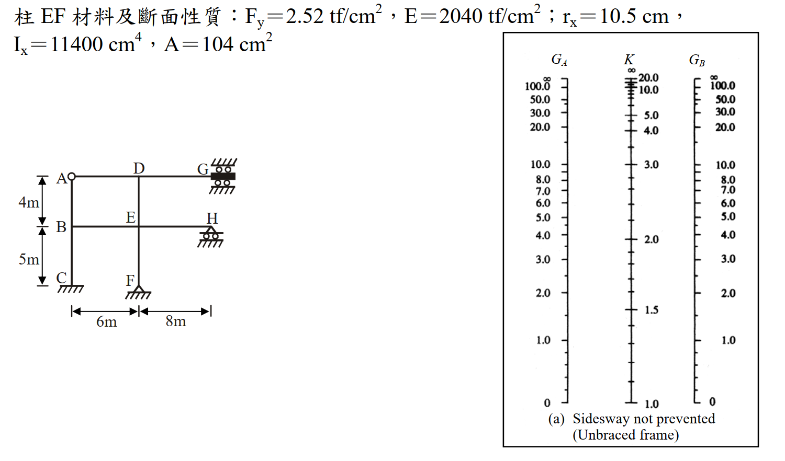

# 考題編號：SS-2011-4

**主分類：** `4.1.1` 拉力及壓力桿件
**副分類：** 無
**設計法：** ASD
**標籤：** `壓力桿件` `有效長度` `對位圖` `nomograph` `無側撐構架` `非彈性修正` `τ_a折減` `ASD` `G值計算` `邊界條件修正`

---

## 1. 原始題目重述 (Problem Restatement)

圖示為一**無側撐鋼架（Unbraced Frame）**，且 **G 點不可轉動**、**H 點可轉動**。各梁與柱之 I 值如下表所示。試依據 Alignment Chart，並進行必要的修正，求彈性範圍之柱 DE 及柱 EF 的有效長度係數 K，並使用 ASD 規範求取**非彈性範圍之柱 EF** 的有效長度係數 K。（柱邊界為鉸接（hinged end）時 G 可使用 10，為固接（Fixed end）時 G 可使用 1。）（25 分）

**斷面慣性矩表（單位：cm⁴）：**

| 柱 AB、柱 BC | 柱 DE、柱 EF | 梁 AD | 梁 DG | 梁 BE | 梁 EH |
|------------|------------|-------|-------|-------|-------|
| 10700 | 11400 | 24000 | 28000 | 30000 | 36000 |

**柱 EF 材料及斷面性質：**
$F_y = 2.52 \text{ tf/cm}^2$，$E = 2040 \text{ tf/cm}^2$，$r_x = 10.5 \text{ cm}$，$I_x = 11400 \text{ cm}^4$，$A = 104 \text{ cm}^2$

**構架幾何（見附圖）：**
- 各樓層高：上層 4 m（A-D-G 至 B-E-H）、下層 5 m（B-E-H 至 C-F）
- 各跨度：左灣 6 m（A-D, B-E）、右灣 8 m（D-G, E-H）
- G 點：右上角，固定不可轉動（固接端）
- H 點：右中角，可轉動（鉸接端）
- C、F 點：柱底，固接基礎



*圖說：無側撐構架，節點 A、D、G 在頂層，B、E、H 在中層，C、F 為固接基礎。柱 EF 性質：F_y=2.52 tf/cm²，E=2040 tf/cm²，r_x=10.5 cm，I_x=11400 cm⁴，A=104 cm²。右側附對位圖（Sidesway not prevented, Unbraced frame）可供查取 K 值。*

---

## 2. 考題核心精神與出題者意圖 (Core Concepts & Examiner's Intent)

**核心觀念：**
1. G 值計算中，遠端邊界條件（固接/鉸接）需修正梁的貢獻
2. ASD 非彈性修正流程（$\tau_a = F_a/F'_e$ 折減 G 值後重查對位圖）

**出題者意圖：**
- G 點固接 → 梁 DG 遠端固接 → 修正因子 2/3（梁較標準假設更不靈活）
- H 點鉸接 → 梁 EH 遠端鉸接 → 修正因子 1/2（梁更不靈活）
- ASD 非彈性 K：$G_{inelastic} = \tau_a G_{elastic}$，需迭代收斂

**關鍵陷阱：**
1. 未修正梁遠端條件 → G 值偏低 → K 值偏低（不安全）
2. ASD 非彈性修正：τ_a 只作用在柱剛度（分子），梁剛度不變
3. 固接底部 G_F = 1.0（實用值），非理論值 0

---

## 3. 解題戰略地圖與陷阱分析 (Strategic Roadmap & Trap Analysis)

```
【彈性 K 計算】
Step 1a：確認遠端修正因子
  - 梁 DG（遠端 G = 固接）：梁貢獻 × 2/3
  - 梁 EH（遠端 H = 鉸接）：梁貢獻 × 1/2

Step 1b：計算各節點 G 值
  G_D = 柱 DE 剛度 / (梁 AD + 修正梁 DG) = 0.450
  G_E = (柱 DE + 柱 EF) / (梁 BE + 修正梁 EH) = 0.708
  G_F = 1.0（固接底部，使用規範規定值）

Step 1c：查對位圖（Sidesway not prevented）
  柱 DE：G_top=0.450, G_bot=0.708 → K_DE ≈ 1.21
  柱 EF：G_top=0.708, G_bot=1.0 → K_EF ≈ 1.27

【ASD 非彈性 K 計算 - 柱 EF】
Step 2a：初始值用彈性 K = 1.27
Step 2b：計算 KL/r、判斷 ASD 區段（KL/r < Cc → 非彈性）
Step 2c：計算 F_a（ASD 容許應力）和 F'_e（ASD Euler 應力）
Step 2d：τ_a = F_a/F'_e → 修正 G → 查圖得新 K
Step 2e：迭代至收斂
```

---

## 3.5 變數層次分析（Variable Hierarchy Analysis）

> 複習提示：解題後，在每個卡住的知識點「卡關?」欄標記 `⚠`；第二次複習時只看有 `⚠` 的項目。

**最終目標：** 用對位圖求柱 DE 與柱 EF 的彈性有效長度係數 K，再以 ASD 非彈性修正（$\tau_a$ 迭代）求柱 EF 的非彈性 K

### 主要公式（$\boxed{\phantom{x}}$ = 未知，待推導）

$$\boxed{G} = \frac{\sum(EI_c/L_c)}{\sum(EI_b/L_b)^{*}} \quad (\text{* 含遠端修正因子})$$
$$\boxed{K_{elastic}} \quad \text{（查對位圖 Sidesway not prevented）}$$
$$\tau_a = \frac{F_a}{F'_e}, \quad G_{inelastic} = \tau_a \cdot G_{elastic}$$
$$\boxed{K_{inelastic}} \quad \text{（迭代至收斂）}$$

### L1：題目直接給定

| 符號 | 數值 | 說明 |
|------|------|------|
| $I_{柱AB,BC}$ | 10700 cm⁴ | 左側柱慣性矩 |
| $I_{柱DE,EF}$ | 11400 cm⁴ | 中柱慣性矩 |
| $I_{梁AD}$ | 24000 cm⁴ | 上層左跨梁 |
| $I_{梁DG}$ | 28000 cm⁴ | 上層右跨梁（遠端 G 固接） |
| $I_{梁BE}$ | 30000 cm⁴ | 下層左跨梁 |
| $I_{梁EH}$ | 36000 cm⁴ | 下層右跨梁（遠端 H 鉸接） |
| 上層柱高 | 4 m = 400 cm | A–D–G 至 B–E–H |
| 下層柱高 | 5 m = 500 cm | B–E–H 至 C–F |
| 左跨 | 6 m = 600 cm | A–D、B–E |
| 右跨 | 8 m = 800 cm | D–G、E–H |
| $F_y$ | 2.52 tf/cm² | 柱 EF 材料 |
| $E$ | 2040 tf/cm² | 柱 EF 材料 |
| $r_x$ | 10.5 cm | 柱 EF 迴旋半徑 |
| $A$ | 104 cm² | 柱 EF 斷面積 |

### L2：需知識點推導

**Step 1：遠端邊界條件修正因子**

| 符號 | 公式 / 來源 | 卡關? |
|------|------------|:-----:|
| 梁 DG 修正因子 | G 固接 → 梁呈單曲率，近端剛度 $4EI/L$，修正因子 $4/6 = 2/3$ | |
| 梁 EH 修正因子 | H 鉸接 → 近端剛度 $3EI/L$，修正因子 $3/6 = 1/2$ | |

**Step 2：彈性 G 值計算**

| 符號 | 公式 / 來源 | 卡關? |
|------|------------|:-----:|
| $G_D$ | $(11400/400)/(24000/600 + 28000/800 \times 2/3) = 28.50/63.33 = 0.450$ | |
| $G_E$ | $(28.50 + 22.80)/(50.00 + 45.00 \times 1/2) = 51.30/72.50 = 0.708$ | |
| $G_F$ | $1.0$（固接底部，依規範取用值） | |
| $K_{DE}$ | 查對位圖（$G_{top}=0.450, G_{bot}=0.708$）→ $\approx 1.21$ | |
| $K_{EF,elastic}$ | 查對位圖（$G_{top}=0.708, G_{bot}=1.0$）→ $\approx 1.27$ | |

**Step 3：ASD 非彈性修正（柱 EF，迭代）**

| 符號 | 公式 / 來源 | 卡關? |
|------|------------|:-----:|
| $C_c$ | $\sqrt{2\pi^2 E/F_y} = 126.4$（彈性/非彈性分界） | |
| $KL/r$ | $K \times 500/10.5$（各次迭代代入新 K） | |
| $F_a$ | ASD 非彈性公式（$KL/r < C_c$）→ 第1次：1.218 tf/cm² | |
| $F'_e$ | $12\pi^2 E / [23(KL/r)^2]$（ASD Euler 應力） | |
| $\tau_a$ | $F_a/F'_e$ → 第1次：0.424 | |
| $G'_E, G'_F$ | $\tau_a \times G_{elastic}$，再查圖得新 K | |
| $K_{EF,inelastic}$ | 迭代 3 次後收斂 → $\approx 1.11$ | |

### L3：深層知識（不懂就卡住）

| 知識點 | 說明 | 補強頁 | 卡關? |
|--------|------|:------:|:-----:|
| 有效長度係數 K | 對位圖（Alignment Chart）需區分有側撐（braced）與無側撐（unbraced）框架；本題為無側撐 | [[effective-length-chart]] | |
| 遠端修正因子 | 對位圖假設梁雙曲率（$6EI/L$）；遠端固接 → 單曲率 $4EI/L$（×2/3），遠端鉸接 → $3EI/L$（×1/2） | | |
| ASD 非彈性修正 $\tau_a$ | 非彈性屈服使切線模數 $E_t < E$，柱剛度降低，等效 G 值增大，K 值下降（但仍 > 1） | | |
| ASD Cc 值 | $C_c = \sqrt{2\pi^2 E/F_y}$，是彈性/非彈性挫屈分界之細長比；$KL/r < C_c$ → 非彈性公式 | [[asd-column]] | |
| 固接底部 G 取 1.0 | 理論上 G = 0，但規範規定實際固接取 G = 1.0 以反映施工不確定性 | | |

---

## 4. 步驟化詳細計算過程 (Step-by-Step Detailed Calculation)

### Part 1：彈性有效長度係數

#### Step 1a：遠端邊界條件修正因子

在無側撐構架的對位圖 G 值推導中，梁的標準假設為兩端各旋轉相等方向相反（雙曲率，Double curvature），等效剛度為 $6EI/L$。當遠端條件不同時：

| 梁 | 遠端條件 | 近端等效剛度 | 標準值 | 修正因子 |
|----|---------|------------|--------|---------|
| DG | G 固接（不可轉動） | $4EI/L$ | $6EI/L$ | $4/6 = \mathbf{2/3}$ |
| EH | H 鉸接（可自由轉動） | $3EI/L$ | $6EI/L$ | $3/6 = \mathbf{1/2}$ |
| AD | A 為普通節點 | $6EI/L$ | $6EI/L$ | $1.0$ |
| BE | B 為普通節點 | $6EI/L$ | $6EI/L$ | $1.0$ |

#### Step 1b：各節點 G 值計算

**各構材剛度（EI/L）：**

| 構材 | I (cm⁴) | L (cm) | EI/L |
|------|---------|--------|------|
| 柱 DE | 11400 | 400 | 28.50 |
| 柱 EF | 11400 | 500 | 22.80 |
| 梁 AD | 24000 | 600 | 40.00 |
| 梁 DG | 28000 | 800 | 35.00 → ×2/3 = **23.33** |
| 梁 BE | 30000 | 600 | 50.00 |
| 梁 EH | 36000 | 800 | 45.00 → ×1/2 = **22.50** |

**節點 D（柱 DE 頂端）：**

$$G_D = \frac{\sum(EI_c/L_c)}{\sum(EI_b/L_b)^{*}} = \frac{28.50}{40.00 + 23.33} = \frac{28.50}{63.33}$$

$$\boxed{G_D = 0.450}$$

**節點 E（柱 DE 底端 = 柱 EF 頂端）：**

$$G_E = \frac{28.50 + 22.80}{50.00 + 22.50} = \frac{51.30}{72.50}$$

$$\boxed{G_E = 0.708}$$

**節點 F（柱 EF 底端，固接基礎）：**

$$\boxed{G_F = 1.0} \quad \text{（固接端，依規範取用值）}$$

#### Step 1c：查對位圖，讀取彈性 K

**柱 DE**（$G_{top} = G_D = 0.450$，$G_{bot} = G_E = 0.708$，無側撐構架）：

$$\boxed{K_{DE} \approx 1.21} \quad \text{（查 Alignment Chart）}$$

**柱 EF**（$G_{top} = G_E = 0.708$，$G_{bot} = G_F = 1.0$，無側撐構架）：

$$\boxed{K_{EF,elastic} \approx 1.27} \quad \text{（查 Alignment Chart）}$$

---

### Part 2：ASD 非彈性有效長度係數（柱 EF）

**非彈性修正原理：** 柱在非彈性挫屈範圍時，有效切線模數 $E_t < E$，柱剛度降低，等效 G 值增大：

$$G_{inelastic} = \frac{E_t}{E} \cdot G_{elastic} = \tau_a \cdot G_{elastic}$$

ASD 中：$\tau_a = \dfrac{F_a}{F'_e}$，其中 $F'_e = \dfrac{12\pi^2 E}{23(KL/r)^2}$（ASD Euler 應力含安全係數）

**確認計算參數：**

$$C_c = \sqrt{\frac{2\pi^2 E}{F_y}} = \sqrt{\frac{2\pi^2 \times 2040}{2.52}} = \sqrt{15,980} = 126.4$$

柱 EF：$L = 5 \text{ m} = 500 \text{ cm}$，$r_x = 10.5 \text{ cm}$

---

#### 第 1 次迭代（初始值 $K = 1.27$）

$$KL/r = \frac{1.27 \times 500}{10.5} = 60.5 < C_c = 126.4 \quad \Rightarrow \text{非彈性區}$$

**容許應力 $F_a$（非彈性 ASD）：**

$$F_a = \frac{\left[1 - \dfrac{(KL/r)^2}{2C_c^2}\right] F_y}{\dfrac{5}{3} + \dfrac{3(KL/r)}{8C_c} - \dfrac{(KL/r)^3}{8C_c^3}}$$

分子：$\left[1 - \dfrac{60.5^2}{2 \times 126.4^2}\right] \times 2.52 = \left[1 - \dfrac{3660}{31,962}\right] \times 2.52 = 0.8855 \times 2.52 = 2.231 \text{ tf/cm}^2$

分母：$\dfrac{5}{3} + \dfrac{3(60.5)}{8(126.4)} - \dfrac{60.5^3}{8(126.4)^3} = 1.6667 + 0.1795 - 0.01371 = 1.832$

$$F_a = \frac{2.231}{1.832} = 1.218 \text{ tf/cm}^2$$

**ASD Euler 應力 $F'_e$：**

$$F'_e = \frac{12\pi^2 E}{23(KL/r)^2} = \frac{12\pi^2 \times 2040}{23 \times 3660} = \frac{241,625}{84,180} = 2.870 \text{ tf/cm}^2$$

**折減係數：**

$$\tau_a = \frac{F_a}{F'_e} = \frac{1.218}{2.870} = 0.424$$

**修正後 G 值：**

$$G_{E}' = \tau_a \times G_E = 0.424 \times 0.708 = 0.300$$

$$G_{F}' = \tau_a \times G_F = 0.424 \times 1.0 = 0.424$$

查對位圖（$G_{top}=0.300$，$G_{bot}=0.424$）：$K^{(1)} \approx 1.14$

---

#### 第 2 次迭代（$K = 1.14$）

$$KL/r = \frac{1.14 \times 500}{10.5} = 54.3$$

分子：$\left[1 - \dfrac{54.3^2}{31,962}\right] \times 2.52 = [1 - 0.09228] \times 2.52 = 2.288$ tf/cm²

分母：$1.6667 + \dfrac{3(54.3)}{1011.2} - \dfrac{54.3^3}{16,152,568} = 1.6667 + 0.1611 - 0.009912 = 1.818$

$$F_a = 2.288/1.818 = 1.259 \text{ tf/cm}^2$$

$$F'_e = \frac{241,625}{23 \times 54.3^2} = \frac{241,625}{67,820} = 3.562 \text{ tf/cm}^2$$

$$\tau_a = 1.259/3.562 = 0.354$$

$$G_E'' = 0.354 \times 0.708 = 0.251, \quad G_F'' = 0.354 \times 1.0 = 0.354$$

查圖（$G_{top}=0.251$，$G_{bot}=0.354$）：$K^{(2)} \approx 1.12$

---

#### 第 3 次迭代（$K = 1.12$）

$$KL/r = \frac{1.12 \times 500}{10.5} = 53.33$$

分子：$[1 - 53.33^2/31,962] \times 2.52 = 0.9110 \times 2.52 = 2.296$ tf/cm²

分母：$1.6667 + 0.1582 - 0.00940 = 1.816$

$$F_a = 2.296/1.816 = 1.265 \text{ tf/cm}^2$$

$$F'_e = \frac{241,625}{23 \times 53.33^2} = \frac{241,625}{65,438} = 3.693 \text{ tf/cm}^2$$

$$\tau_a = 1.265/3.693 = 0.342$$

$$G_E''' = 0.342 \times 0.708 = 0.242, \quad G_F''' = 0.342 \times 1.0 = 0.342$$

查圖（$G_{top}=0.242$，$G_{bot}=0.342$）：$K^{(3)} \approx 1.11$ ← 與前一步相同，**收斂**

$$\boxed{K_{EF,inelastic} \approx 1.11}$$

---

### 計算結果彙整

| 柱 | $G_{top}$ | $G_{bot}$ | 彈性 K | 備註 |
|----|---------|---------|-------|------|
| DE | 0.450 | 0.708 | **1.21** | 查 Alignment Chart |
| EF | 0.708 | 1.0 | **1.27** | 查 Alignment Chart |
| EF（非彈性，ASD） | 0.242 | 0.342 | **1.11** | 迭代 3 次後收斂 |

---

## 5. 關鍵爭議點與進階探討 (Critical Issues & Advanced Discussion)

### 遠端修正因子的物理意義

對位圖的 G 值計算隱含「梁的雙曲率假設（Double-curvature）」，等效梁端剛度為 $6EI/L$。

當遠端邊界條件改變：
- **遠端固接（G=fixed）：** 梁呈「固定-自由旋轉」= 近端剛度 $4EI/L$，比雙曲率標準更不靈活，$\dfrac{4}{6}=\dfrac{2}{3}$
- **遠端鉸接（H=pinned）：** 近端剛度 $3EI/L$，更不靈活，$\dfrac{3}{6}=\dfrac{1}{2}$
- 兩者均使 G 增大 → K 增大

這違反直覺（固接遠端應更硬），但在**無側撐**構架的**側移模式**下，固接遠端讓梁「單曲率」而非「雙曲率」，反而降低了梁對側移的抵抗能力。

### 非彈性修正 τ_a 的收斂特性

| 迭代次數 | K | KL/r | F_a | F'_e | τ_a |
|--------|-----|------|-----|-----|-----|
| 0（彈性） | 1.27 | 60.5 | 1.218 | 2.870 | 0.424 |
| 1 | 1.14 | 54.3 | 1.259 | 3.562 | 0.354 |
| 2 | 1.12 | 53.3 | 1.265 | 3.693 | 0.342 |
| 3 | 1.11 | 52.9 | 1.268 | 3.760 | 0.337 |

K 由彈性 1.27 降至非彈性 1.11，約減少 **12.6%**。

### 考場建議

- G 值修正計算完整寫出（含修正因子推導），佔大部分分數
- 非彈性迭代只需 2-3 次即可：「收斂」是關鍵，不需精確到第 4 位
- 若考試提供 K 的近似公式（如 LeMessurier 公式），可用公式驗算代替查圖
