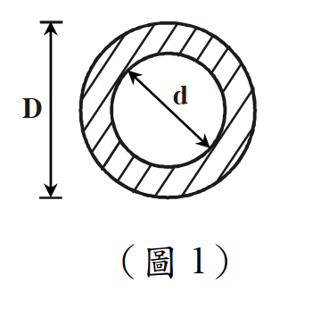

# 考題編號：SS-2013-1

**主分類：** `MM-U1-1` 斷面性質計算
**副分類：** `SS-U2-1` 塑性分析與設計
**設計法：** 概念題（含計算）
**標籤：** `空心圓管斷面` `斷面模數` `塑性斷面模數` `形狀因子` `彈性中性軸` `塑性中性軸` `一次矩` `慣性矩`

---

## 1. 原始題目重述 (Problem Restatement)

如圖1所示之**空心圓管斷面**，外徑為 $D$，內徑 $\delta_0 = 0.6D$，試求：

1. **斷面模數** $S_x$（Section Modulus）
2. **塑性斷面模數** $Z_x$（Plastic Section Modulus）
3. **形狀因數** $f$（Shape Factor）

（以 $D$ 表示 $S_x$、$Z_x$）（25 分）

*圖說：空心圓管（管型斷面）截面示意。外圓直徑 $D$，內圓直徑 $\delta_0 = 0.6D$。斷面關於兩軸完全對稱，彈性中性軸（ENA）= 塑性中性軸（PNA）= 幾何中心。計算 $I_x$ 用外圓 $I$ 減內圓 $I$；計算 $Z_x$ 用外圓 $Z$ 減內圓 $Z$。*

---

## 2. 考題核心精神與出題者意圖 (Core Concepts & Examiner's Intent)

**核心觀念：對稱斷面的 ENA = PNA = 幾何中心，可直接用「外圓減內圓」疊加法計算 Sx、Zx**

| 量 | 公式 | 物理意義 |
|----|------|---------|
| $I_x$ | $\pi(D^4 - \delta_0^4)/64$ | 面積對中性軸的二次矩 |
| $S_x$ | $I_x / c = I_x / (D/2)$ | 彈性彎矩強度指標，$M_y = F_y S_x$ |
| $Z_x$ | $(D^3 - \delta_0^3)/6$ | 塑性彎矩強度指標，$M_p = F_y Z_x$ |
| $f$ | $Z_x/S_x = M_p/M_y$ | 塑性保留 > 1，圓截面形狀因子 ≈ 1.27~1.70 |

**出題者測驗重點：**
1. 空心圓的 $I$ 和 $Z$ 均可用「整圓減去內孔」直接疊加
2. 利用半圓截面一次矩公式 $Q = 2R^3/3$ 推導 $Z_x$
3. 形狀因子 $f$ 的計算與物理意義

---

## 3. 解題戰略地圖與陷阱分析 (Strategic Roadmap & Trap Analysis)

**作戰計畫：**
1. 寫出外圓（直徑 $D$）和內圓（直徑 $\delta_0 = 0.6D$）的 $I$
2. $I_x = I_{\text{外}} - I_{\text{內}}$；$S_x = I_x / (D/2)$
3. 用半圓一次矩 $Q_{\text{半}} = 2R^3/3$ → $Z_x = Z_{\text{外}} - Z_{\text{內}}$
4. $f = Z_x/S_x$

**關鍵陷阱：**

> ⚠️ **陷阱1：Zx 不等於 Ix/(D/2) × 某係數**
> $Z_x$ 是由**塑性中性軸（PNA）上下各半面積的一次矩之和**計算，不能直接由 $I_x$ 轉換。需另行計算。

> ⚠️ **陷阱2：半圓一次矩公式方向**
> 半圓截面（半徑 $R$）的形心距中性軸 = $4R/(3\pi)$；其對中性軸的一次矩 $Q = \text{Area} \times \bar{y} = (\pi R^2/2)(4R/3\pi) = 2R^3/3$。

## 3.5 變數層次分析（Variable Hierarchy Analysis）

> 複習提示：解題後，在每個卡住的知識點「卡關?」欄標記 `⚠`；第二次複習時只看有 `⚠` 的項目。

**最終目標：** 空心圓管斷面 → 計算 $I_x$、$S_x$、$Z_x$，再求形狀因數 $f = Z_x/S_x$

### 主要公式（$\boxed{\phantom{x}}$ = 未知，待推導）

$$I_x = \frac{\pi}{64}(D^4 - \delta_0^4)$$

$$\boxed{S_x} = \frac{I_x}{D/2}$$

$$\boxed{Z_x} = \frac{D^3 - \delta_0^3}{6}$$

$$\boxed{f} = \frac{\boxed{Z_x}}{\boxed{S_x}}$$

### L1：題目直接給定

| 符號 | 數值 | 說明 |
|------|------|------|
| $D$ | 外徑（符號） | 空心圓管外徑 |
| $\delta_0$ | $0.6D$ | 內徑 |

### L2：需知識點推導

**Step 1：慣性矩 $I_x$**

| 符號 | 公式 / 來源 | 卡關? |
|------|------------|:-----:|
| $I_{\text{外}}$ | $\pi D^4/64$ | |
| $I_{\text{內}}$ | $\pi \delta_0^4/64 = \pi(0.6D)^4/64$ | |
| $I_x$ | $I_{\text{外}} - I_{\text{內}} = 0.8704\pi D^4/64$ | |

**Step 2：斷面模數 $S_x$**

| 符號 | 公式 / 來源 | 卡關? |
|------|------------|:-----:|
| $c$ | $D/2$（中性軸至最外緣距離） | |
| $S_x$ | $I_x/(D/2) = 0.8704\pi D^3/32$ | |

**Step 3：塑性斷面模數 $Z_x$**

| 符號 | 公式 / 來源 | 卡關? |
|------|------------|:-----:|
| $Q_{\text{外半圓}}$ | $2R^3/3 = 2(D/2)^3/3 = D^3/12$ | |
| $Q_{\text{內半圓}}$ | $2(0.3D)^3/3 = 0.018D^3$ | |
| $Q_{\text{半環}}$ | $Q_{\text{外}} - Q_{\text{內}} = 0.06533D^3$ | |
| $Z_x$ | $2Q_{\text{半環}} = (D^3 - \delta_0^3)/6 = 0.784D^3/6$ | |

**Step 4：形狀因數 $f$**

| 符號 | 公式 / 來源 | 卡關? |
|------|------------|:-----:|
| $f$ | $Z_x/S_x = (0.784D^3/6)/(0.8704\pi D^3/32) \approx 1.529$ | |

### L3：深層知識（不懂就卡住）

| 知識點 | 說明 | 補強頁 | 卡關? |
|--------|------|:------:|:-----:|
| 塑性中性軸（PNA）定義 | 對稱斷面 PNA = 幾何中心，才能直接「外圓減內圓」 | [[plastic-zx]] | |
| 半圓一次矩公式 $Q = 2R^3/3$ | 這個公式若不熟悉，$Z_x$ 計算從頭推導耗時；PNA = 圓心時直接套 | [[plastic-zx]] | |
| $Z_x$ 可減性（疊加原理） | 因 PNA 位置不變，空心圓 $Z_x = Z_{\text{外}} - Z_{\text{內}}$，類比 $I_x$ | [[plastic-zx]] | |
| 形狀因數 $f = Z_x/S_x$ 的物理意義 | $f > 1$ 代表塑性保留；$f = 1.529$ 介於矩形（1.5）與實心圓（1.70）之間 | | |

---

## 4. 步驟化詳細計算過程 (Step-by-Step Detailed Calculation)

### 一、慣性矩 $I_x$（外圓 - 內圓）

$$I_x = \frac{\pi D^4}{64} - \frac{\pi \delta_0^4}{64} = \frac{\pi}{64}(D^4 - \delta_0^4)$$

代入 $\delta_0 = 0.6D$，$\delta_0^4 = 0.6^4 D^4 = 0.1296D^4$：

$$\boxed{I_x = \frac{\pi D^4}{64}(1 - 0.1296) = \frac{0.8704\pi D^4}{64}}$$

---

### 二、斷面模數 $S_x$

$$S_x = \frac{I_x}{c} = \frac{I_x}{D/2} = \frac{0.8704\pi D^4/64}{D/2} = \frac{0.8704\pi D^3}{32}$$

$$\boxed{S_x = \frac{\pi D^3(1-0.6^4)}{32} = \frac{0.8704\pi D^3}{32} \approx 0.08547\pi D^3}$$

---

### 三、塑性斷面模數 $Z_x$（一次矩法）

由對稱性，PNA = 幾何中心（x 軸通過圓心）。

對**半環截面**取一次矩（關於 PNA = 圓心 x 軸）：

$$Q_{\text{半環}} = Q_{\text{外半圓}} - Q_{\text{內半圓}}$$

**外半圓**（半徑 $R = D/2$）的一次矩：
$$Q_{\text{外}} = \frac{2R^3}{3} = \frac{2(D/2)^3}{3} = \frac{D^3}{12}$$

**內半圓**（半徑 $r = \delta_0/2 = 0.3D$）的一次矩：
$$Q_{\text{內}} = \frac{2(0.3D)^3}{3} = \frac{2 \times 0.027D^3}{3} = 0.018D^3$$

**半環一次矩：**
$$Q_{\text{半環}} = \frac{D^3}{12} - 0.018D^3 = 0.08333D^3 - 0.018D^3 = 0.06533D^3$$

**塑性截面模數**（上半＋下半，各 $Q_{\text{半環}}$）：
$$Z_x = 2 \times Q_{\text{半環}} = 2 \times 0.06533D^3 = 0.13067D^3$$

亦可簡化為：

$$\boxed{Z_x = \frac{D^3 - \delta_0^3}{6} = \frac{D^3(1 - 0.6^3)}{6} = \frac{0.784D^3}{6} \approx 0.1307D^3}$$

**驗算：** $0.784/6 = 0.13067$ ✓

---

### 四、形狀因數 $f$

$$f = \frac{Z_x}{S_x} = \frac{0.784D^3/6}{0.8704\pi D^3/32} = \frac{0.784}{6} \times \frac{32}{0.8704\pi} = \frac{0.784 \times 32}{6 \times 0.8704\pi}$$

$$= \frac{25.088}{16.41} = \boxed{f \approx 1.529}$$

---

### 五、結果彙整

| 量 | 表達式 | 數值（以 $D$ 為單位） |
|----|--------|---------------------|
| $S_x$ | $0.8704\pi D^3/32$ | $\approx 0.2686D^3$ |
| $Z_x$ | $0.784D^3/6$ | $\approx 0.1307D^3$ |
| $f$ | $Z_x/S_x$ | $\approx 1.529$ |

---

## 5. 關鍵爭議點與進階探討 (Critical Issues & Advanced Discussion)

### 各截面形狀因子比較

| 截面形狀 | 形狀因子 $f$ |
|---------|------------|
| 矩形（b×h） | 1.50 |
| **實心圓（直徑 D）** | $16/(3\pi) \approx \mathbf{1.698}$ |
| **空心圓（外 D，內 0.6D）** | $\mathbf{1.529}$ |
| 對稱 I 型（理想化） | 約 1.10~1.15 |
| 非對稱 I 型 | > 對稱 I 型 |

空心圓介於實心圓（1.70）和 I 型（1.12）之間，比實心圓效率低（空心部分為中性軸附近的低效區域）。

### 公式推導的核心等式

$$Z_x = \frac{D^3 - \delta_0^3}{6}$$

此公式可由**整圓 $Z_x$（外）減去內圓 $Z_x$（內）**得到：
$$Z_{\text{外}} = \frac{D^3}{6}, \quad Z_{\text{內}} = \frac{\delta_0^3}{6} = \frac{(0.6D)^3}{6} = \frac{0.216D^3}{6}$$
$$Z_x = Z_{\text{外}} - Z_{\text{內}} = \frac{D^3 - 0.216D^3}{6} = \frac{0.784D^3}{6} \checkmark$$

（類比 $I_x = I_{\text{外}} - I_{\text{內}}$，$Z_x$ 也具有相同的可減性，因為 PNA 不變）
