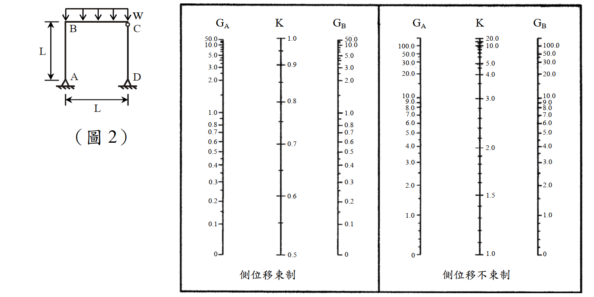
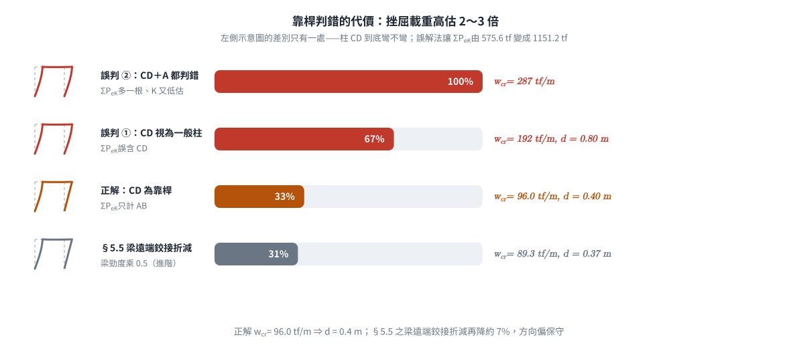

# 考題編號：SS-2013-2

**主分類：** `SS-U1-1` 拉力及壓力桿件（壓力桿件·框架穩定）
**副分類：** 無
**設計法：** LRFD（本題實際為**彈性穩定分析**，不含 $\phi$ 折減；索引沿用 LRFD）
**標籤：** `有效長度係數` `對位圖` `LeMessurier公式` `側移框架` `層間穩定` `彈性挫屈` `剛架` `靠桿` `leaning column` `挫屈載重`

---

## 1. 原始題目重述 (Problem Restatement)

如圖 2 所示之剛架承受均佈載重 $w$，**柱 CD 為「靠桿」（leaning column）**。已知：

| 參數 | 數值 |
|------|------|
| 彈性模數 $E$ | 2,040 tf/cm² |
| 梁、柱長度 $L$ | 6 m = 600 cm |
| 柱慣性矩 $I_c$ | 30,094 cm⁴ |
| 梁慣性矩 $I_b$ | 136,108 cm⁴ |
| 邊界條件 G 值 | 柱邊界為固接時 $G = 1$；為鉸接時 $G = 10$ |
| 堆置材料單位重 $\rho$ | 240 tf/m² |

試使用 **AISC Alignment Chart** 及**萊梅厥公式（LeMessurier formula）**求：

1. 剛架中柱 AB 之有效長度係數 $K'_{AB}$
2. 挫屈載重 $w_{cr}$（tf/m）
3. 今若僅於梁 BC 上配置單位重 $\rho = 240$ tf/m² 之均佈載重，求該載重容許配置的厚度 $d$（m）

（25 分）

**考卷給定之萊梅厥公式：**

$$K' = \sqrt{\frac{P_e}{P_I} \times \frac{\sum P}{\sum P_{eK}}}$$

| 符號 | 考卷原文定義 |
|:---:|:---|
| $P_I$ | 欲求 $K$ 值之柱所受的垂直載重 |
| $P_e$ | 柱之尤拉載重（Euler buckling load），即 $\pi^2EI/L^2$（**用實際長度，$K=1$**） |
| $\sum P$ | 整體結構承受的總垂直外載重 |
| $\sum P_{eK}$ | 整體結構所有**非靠桿**且考慮相應有效長度係數後之柱挫屈載重 |



*圖說：跨度 $L$ ×柱高 $L$ 之單層門型剛架。**A 與 D 皆為鉸支承（三角形符號）**；**B 為剛接節點**（梁柱剛性連接）；**C 為鉸接**（圖上以小圓圈標示梁 BC 與柱 CD 之間為鉸），因此柱 CD 上下兩端皆為鉸接、無法提供任何側向抵抗，即題目所稱之「靠桿（leaning column）」。梁 BC 頂部承受向下均佈載重 $w$。圖右為 AISC Alignment Chart 兩張：左圖標題「側位移束制」（$G_A$ 0～50、$K$ 0.5～1.0、$G_B$ 0～50），右圖標題「側位移不束制」（$G_A$ 0～100、$K$ 1.0～20.0、$G_B$ 0～100）。本題整層可側移，且僅 AB 具側向抵抗能力，故**查右圖（側位移不束制）**。*


*圖 2　把「靠桿」畫出來：CD 兩端皆鉸 ⇒ 二力構件 ⇒ 挫屈時保持直線、零側向勁度。圖上 AB 的彎曲程度由 §1 給定的 $I_c$、$I_b$ 以傾角變位法算出（$\theta_B = \psi\,I_c/(I_c+I_b)$），改變 $I_c/I_b$ 圖形會跟著變。**攔錯：** 把 CD 讀成「底端鉸接的一般柱」而去查它的 $K_{CD}$，使 $\sum P_{eK}$ 多算一根。*


---

## 2. 考題核心精神與出題者意圖 (Core Concepts & Examiner's Intent)

**核心觀念：靠桿（leaning column）把自己的重力載重「寄生」到有側向抵抗能力的柱上，必須用 LeMessurier 修正 $K$ 值。**

一般對位圖（Alignment Chart）內含一個隱藏假設：**同層所有柱同時達到挫屈、且每根柱都按比例分攤側移抵抗**。當層內有靠桿（兩端鉸接、不提供側移勁度）時，這個假設破裂——靠桿的重力照樣會放大整層的 $P\text{-}\Delta$ 效應，但抵抗全靠 AB 一根。LeMessurier 公式就是把「別人的重量」折算成 AB 的額外有效長度：

$$K'_{AB} = \underbrace{K_{AB}}_{\text{對位圖}} \times \sqrt{\underbrace{\frac{\sum P}{P_I}}_{\text{靠桿懲罰}}}$$

| 步驟 | 計算項目 | 關鍵要領 |
|------|---------|---------|
| 1 | 判讀 A、D 支承與 C 鉸接 | A、D 皆鉸 → $G_A = 10$；C 為鉸 → CD 為靠桿 |
| 2 | $G_B = \sum(I_c/L_c)/\sum(I_b/L_b)$ | 同長度時即 $I_c/I_b$ |
| 3 | 查**側位移不束制**對位圖 | 得 $K_{AB}$ |
| 4 | 靜力求各柱軸力 | CD 為二力構件 → $P_{CD} = wL/2$，故 $P_{AB} = wL/2$ |
| 5 | LeMessurier | $\sum P_{eK}$ **只計 AB**（CD 是靠桿要剔除） |
| 6 | $w_{cr} \to d$ | $d = w_{cr}/\rho$ |

**出題者測驗重點：**

1. 認得「靠桿」三個字 → 知道 $\sum P_{eK}$ 要把 CD 剔除，而 $\sum P$ 要把 CD 的載重算進去
2. 會用考卷給的 LeMessurier 公式（不是自己編一條 $\sum P = \sum P_e$）
3. 由靜力（不是「各分一半」的直覺）確認 $P_{AB} = P_{CD} = wL/2$
4. 單位換算：$w_{cr}$ 為 tf/m，最後 $d = w_{cr}/\rho$

---

## 3. 解題戰略地圖與陷阱分析 (Strategic Roadmap & Trap Analysis)

**作戰計畫：**
```
Step 1  判讀邊界：A 鉸、D 鉸、B 剛接、C 鉸 → CD 為靠桿
Step 2  G_A = 10（A 鉸接）、G_B = Ic/Ib = 0.221
Step 3  查「側位移不束制」對位圖 → K_AB ≈ 1.71
Step 4  Pe = π²EIc/L²（K=1）；PeK,AB = Pe/K_AB²
Step 5  靜力：CD 為二力構件 → P_CD = wL/2 → P_AB = wL/2，ΣP = wL
Step 6  LeMessurier：K' = √[(Pe/P_I)(ΣP/ΣPeK)]，ΣPeK 只含 AB
Step 7  P_I = π²EIc/(K'L)² → 解 w_cr → d = w_cr/ρ
```

**關鍵陷阱：**

> ⚠️ **陷阱 1（本題最致命）：「靠桿」不是「鉸接柱」**
> 「靠桿（leaning column）」＝**上下兩端皆鉸**、只能承重不能抗側移的柱。
> 若把 CD 誤讀成「底端鉸接的一般柱」而去查它自己的 $K_{CD}$，並寫成
> $w_{cr}L = P_{eK,AB} + P_{eK,CD}$，會把 $w_{cr}$ 高估 2～3 倍（詳見 §5.1）。
> 判別要訣：看圖上 C 點有沒有畫**小圓圈**（鉸）。有圓圈 → 梁無法拘束 CD 頂端轉動 → 靠桿。

> ⚠️ **陷阱 2：$\sum P$ 與 $\sum P_{eK}$ 的「不對稱」**
> $\sum P$（要抵抗的力）＝**全部**柱的垂直載重（含靠桿）；
> $\sum P_{eK}$（可用的容量）＝**只有非靠桿**柱的挫屈載重。
> 這個「載重算你的、容量不算你的」正是靠桿的懲罰機制，也是本公式的靈魂。

> ⚠️ **陷阱 3：對位圖用哪一張**
> 本題整層可自由側移（A、D 皆鉸、無斜撐）→ 查**側位移不束制**（右圖，$K \ge 1.0$）。
> 誤查左圖（側位移束制，$K \le 1.0$）會嚴重低估 $K$、高估承載力。

> ⚠️ **陷阱 4：$P_e$ 用 $K=1$，不是用 $K_{AB}$**
> 考卷定義 $P_e$ 為「柱之尤拉載重」＝ $\pi^2EI/L^2$。分子用 $P_e$、分母用 $\sum P_{eK}$（含 $K$），
> 兩者相除才會生出 $K_{AB}^2$。若分子也代 $K_{AB}$，$K'$ 會退化成 $\sqrt{2}$，喪失對位圖資訊。

> ⚠️ **陷阱 5：$d$ 的量綱**
> $\rho = 240$ tf/m² 為「每 m² 每 m 厚」的面載重密度，$w = \rho \cdot d$ 得 tf/m，
> 故 $d[\text{m}] = w_{cr}[\text{tf/m}] / \rho[\text{tf/m}^2]$，不需再乘梁寬。

## 3.5 變數層次分析（Variable Hierarchy Analysis）

> 複習提示：解題後，在每個卡住的知識點「卡關?」欄標記 `⚠`；第二次複習時只看有 `⚠` 的項目。

**最終目標：** 含靠桿之側移剛架 → 對位圖 $K_{AB}$ → LeMessurier 修正 $K'_{AB}$ → 挫屈載重 $w_{cr}$ → 容許堆置厚度 $d$

### 主要公式（$\boxed{\phantom{x}}$ = 未知，待推導）

$$\text{Step 1:}\quad G_A = 10\ (\text{A 鉸接}),\qquad \boxed{G_B} = \frac{\sum (I_c/L_c)}{\sum (I_b/L_b)} = \frac{I_c}{I_b}$$

$$\text{Step 2:}\quad \boxed{K_{AB}} \;\Leftarrow\; \text{側位移不束制對位圖}\left(G_A,\ \boxed{G_B}\right)$$

$$\text{Step 3:}\quad P_e = \frac{\pi^2 E I_c}{L^2},\qquad \boxed{P_{eK,AB}} = \frac{P_e}{\boxed{K_{AB}}^{\,2}}$$

$$\text{Step 4:}\quad \sum M_A = 0 \;\Rightarrow\; \boxed{P_{CD}} = \frac{wL}{2},\qquad P_I = P_{AB} = \frac{wL}{2},\qquad \sum P = wL$$

$$\text{Step 5:}\quad \boxed{K'_{AB}} = \sqrt{\frac{P_e}{P_I} \times \frac{\sum P}{\sum P_{eK}}} = \boxed{K_{AB}}\sqrt{\frac{\sum P}{P_I}}\quad\left(\sum P_{eK} = \boxed{P_{eK,AB}}\ \text{only}\right)$$

$$\text{Step 6:}\quad P_I = \frac{\pi^2 E I_c}{\left(\boxed{K'_{AB}}L\right)^2} = \frac{w_{cr}L}{2} \;\Rightarrow\; \boxed{w_{cr}}$$

$$\text{Step 7:}\quad \boxed{d} = \frac{\boxed{w_{cr}}}{\rho}$$

### L1：題目直接給定

_看到題目就能讀出的數字，不需要任何公式。_

| 符號 | 數值 | 說明 |
|:---:|:---|:---|
| $E$ | 2,040 tf/cm² | 梁、柱共用彈性模數 |
| $L$ | 600 cm（= 6 m） | 梁跨度＝柱高 |
| $I_c$ | 30,094 cm⁴ | 柱慣性矩（AB、CD 相同） |
| $I_b$ | 136,108 cm⁴ | 梁慣性矩 |
| $G$（固接端） | 1 | 題目指定（非理論值 0） |
| $G$（鉸接端） | 10 | 題目指定（非理論值 $\infty$） |
| $\rho$ | 240 tf/m² | 堆置材料單位重 |
| A、D | 鉸支承 | 由圖判讀（三角形符號） |
| B | 剛接節點 | 梁柱剛性連接 |
| C | 鉸接 | 圖上小圓圈 → CD 為靠桿 |

### L2：需知識點推導

_需要知道公式名稱與適用條件，套入 L1 即可算出。_

**第一階段：對位圖求 $K_{AB}$**

| 符號 | 公式／來源 | 卡關? |
|:---:|:---|:---|
| $G_A$ | A 為鉸接 → 題目規定用 10 | |
| $G_B$ | $\dfrac{I_c/L}{I_b/L} = \dfrac{30{,}094}{136{,}108} = 0.221$ | |
| $K_{AB}$ | 側位移不束制圖（$G_A=10$、$G_B=0.221$）$\approx 1.71$ | |

**第二階段：柱之挫屈載重**

| 符號 | 公式／來源 | 卡關? |
|:---:|:---|:---|
| $\pi^2 E I_c$ | $9.8696 \times 2040 \times 30{,}094 = 6.059 \times 10^8$ tf·cm² | |
| $P_e$ | $\pi^2EI_c/L^2 = 1{,}683$ tf（$K=1$ 之尤拉載重） | |
| $P_{eK,AB}$ | $P_e/K_{AB}^2 = 1683/1.71^2 = 575.6$ tf | |
| $\sum P_{eK}$ | $= P_{eK,AB} = 575.6$ tf（CD 為靠桿，**不計入**） | |

**第三階段：靜力求軸力**

| 符號 | 公式／來源 | 卡關? |
|:---:|:---|:---|
| $P_{CD}$ | CD 兩端鉸＋無橫載 → 二力構件；$\sum M_A = 0$：$wL\cdot\frac{L}{2} - P_{CD}L = 0 \Rightarrow \frac{wL}{2}$ | |
| $P_I = P_{AB}$ | $wL - P_{CD} = \dfrac{wL}{2}$ | |
| $\sum P$ | $wL$（含靠桿載重） | |
| $\sum P / P_I$ | $= 2$（與 $w$ 無關，純幾何比） | |

**第四階段：LeMessurier 與挫屈載重**

| 符號 | 公式／來源 | 卡關? |
|:---:|:---|:---|
| $K'_{AB}$ | $\sqrt{(P_e/P_I)(\sum P/\sum P_{eK})} = K_{AB}\sqrt{2} = 2.42$ | |
| $P_{cr,AB}$ | $\pi^2EI_c/(K'_{AB}L)^2 = 1683/2.42^2 = 287.9$ tf | |
| $w_{cr}$ | $2P_{cr,AB}/L_{beam} = 2(287.9)/6 = 96.0$ tf/m | |
| $d$ | $w_{cr}/\rho = 96.0/240 = 0.40$ m | |

### L3：深層知識（不懂就卡住）

| 知識點 | 說明 | 補強頁 | 卡關? |
|:---|:---|:---:|:---|
| 靠桿（leaning column）的定義 | 上下兩端皆鉸接之柱：可承重、零側向勁度；其重力仍放大整層 $P\text{-}\Delta$，抵抗全由非靠桿柱承擔 | [[effective-length-chart]] · [[FRAME-STABILITY-ADVANCED]] | |
| LeMessurier 公式的物理意義 | $K' = K\sqrt{\sum P / P_I}$：把「別人（含靠桿）的重量」折算成本柱的額外有效長度 | [[effective-length-chart]] | |
| $\sum P$ 含靠桿、$\sum P_{eK}$ 不含靠桿 | 載重算全部、容量只算能抗側移者——這個不對稱就是靠桿的懲罰 | | |
| 對位圖的隱藏假設 | 對位圖假設同層各柱同時挫屈且按比例分攤側移抵抗；有靠桿時假設破裂，必須修正 | [[effective-length-chart]] · [[P-DELTA-EFFECT]] | |
| 二力構件判定 | CD 兩端鉸接且無橫向載重 → 只能沿軸線傳力（$D_x = 0$），因此「柱 AB＋梁 BC」自由體靜定可解 | | |
| 靠桿本身的檢核用 $K = 1.0$ | 靠桿不承擔側移抵抗，其自身強度以 $K=1.0$ 檢核即可（本題 $P_{e,CD}=1683 \gg 288$ tf，OK） | | |

---

## 4. 步驟化詳細計算過程 (Step-by-Step Detailed Calculation)

### 一、邊界條件判讀（本題的分數所在）

| 位置 | 圖上符號 | 判定 | 對後續的影響 |
|:---:|:---|:---|:---|
| A（柱 AB 底端） | 三角形鉸支承 | **鉸接** | $G_A = 10$ |
| B（柱 AB 頂端） | 梁柱交會、無圓圈 | **剛接** | $G_B$ 由勁度比計算 |
| C（柱 CD 頂端） | **小圓圈** | **鉸接** | 梁不拘束 CD 轉動 |
| D（柱 CD 底端） | 三角形鉸支承 | **鉸接** | CD 兩端皆鉸 |

$\Rightarrow$ 柱 CD 上下皆鉸 $\Rightarrow$ **靠桿（leaning column）**，與題目文字「柱 CD 為靠桿」一致。
$\Rightarrow$ 整層側向抵抗**只有柱 AB**（透過 B 點剛接與梁 BC 的彎曲勁度）。

---

### 二、計算 G 值

**節點 B：**

$$G_B = \frac{\sum (I_c / L_c)}{\sum (I_b / L_b)} = \frac{30{,}094/600}{136{,}108/600} = \frac{30{,}094}{136{,}108} = \boxed{0.221}$$

**支承 A（鉸接，依題目規定取 10）：**

$$G_A = 10$$

---

### 三、由 AISC Alignment Chart 查有效長度係數

整層可側移 $\Rightarrow$ 使用**側位移不束制（sidesway uninhibited）**對位圖：

$$G_A = 10,\quad G_B = 0.221 \quad \Longrightarrow \quad \boxed{K_{AB} \approx 1.71}$$

*（Jackson–Moreland 近似式驗算）*

$$K_{AB} = \sqrt{\frac{1.6G_AG_B + 4(G_A+G_B) + 7.5}{G_A+G_B+7.5}} = \sqrt{\frac{1.6(10)(0.221)+4(10.221)+7.5}{10.221+7.5}}$$

$$= \sqrt{\frac{3.54+40.88+7.50}{17.72}} = \sqrt{2.930} = 1.712 \approx 1.71 \ \checkmark$$

*（精解超越方程式 $\dfrac{G_AG_B(\pi/K)^2-36}{6(G_A+G_B)} = \dfrac{\pi/K}{\tan(\pi/K)}$ 得 $K = 1.724$，與查圖值相符。）*

> **策略註解：** 此處 $K_{AB} = 1.71$ 只是「AB 自己一根、按比例分攤」的答案。它還**沒有**包含靠桿 CD 把重量壓過來的效應——那是下一步 LeMessurier 的工作。

---

### 四、各柱之尤拉載重與挫屈載重

共用量：

$$\pi^2 E I_c = 9.8696 \times 2040 \times 30{,}094 = 6.059 \times 10^8 \ \text{tf·cm}^2$$

**尤拉載重（$K = 1$，考卷定義之 $P_e$）：**

$$P_e = \frac{\pi^2 E I_c}{L^2} = \frac{6.059 \times 10^8}{600^2} = \frac{6.059 \times 10^8}{360{,}000} = \boxed{1{,}683 \ \text{tf}}$$

**柱 AB（非靠桿）考慮 $K_{AB}$ 後之挫屈載重：**

$$P_{eK,AB} = \frac{\pi^2 E I_c}{(K_{AB}L)^2} = \frac{P_e}{K_{AB}^2} = \frac{1{,}683}{1.71^2} = \frac{1{,}683}{2.924} = \boxed{575.6 \ \text{tf}}$$

**$\sum P_{eK}$（僅計非靠桿柱）：**

$$\sum P_{eK} = P_{eK,AB} = 575.6 \ \text{tf}$$

> ⚠️ 柱 CD 是靠桿，依考卷對 $\sum P_{eK}$ 的定義（「所有**非靠桿**且考慮相應有效長度係數後之柱挫屈載重」），**不得**加入 $P_{eK,CD}$。

---

### 五、靜力求各柱垂直載重

柱 CD 兩端鉸接、桿上無橫向載重 $\Rightarrow$ **二力構件**，只能沿桿軸（垂直）傳力，故 $D_x = 0$。

取「柱 AB＋梁 BC」為自由體（A 為鉸，未知 $A_x$、$A_y$、$P_{CD}$，共 3 個未知量，靜定）：

$$\sum M_A = 0:\quad (wL)\cdot\frac{L}{2} - P_{CD}\cdot L = 0 \quad \Longrightarrow \quad P_{CD} = \frac{wL}{2}$$

$$\sum F_y = 0:\quad P_{AB} = wL - P_{CD} = \frac{wL}{2}$$

因此：

$$P_I = P_{AB} = \frac{wL}{2},\qquad \sum P = P_{AB} + P_{CD} = wL,\qquad \boxed{\frac{\sum P}{P_I} = 2}$$

> **策略註解：** $\sum P / P_I = 2$ 與 $w$ 無關（純幾何比），所以 $K'$ 可以在還不知道 $w$ 的情況下先算出來——這是本題能「先求 $K'$ 再求 $w_{cr}$」的關鍵。

---

### 六、（一）萊梅厥公式求 $K'_{AB}$

$$K'_{AB} = \sqrt{\frac{P_e}{P_I} \times \frac{\sum P}{\sum P_{eK}}} = \sqrt{\frac{P_e}{\sum P_{eK}} \times \frac{\sum P}{P_I}} = \sqrt{K_{AB}^2 \times 2}= K_{AB}\sqrt{2}$$

$$= \sqrt{\frac{1{,}683}{575.6} \times 2} = \sqrt{2.924 \times 2} = \sqrt{5.848}$$

$$\boxed{K'_{AB} = 2.42}$$

> **物理解讀：** 對位圖給 1.71，LeMessurier 把它放大 $\sqrt{2} = 1.414$ 倍到 2.42。
> 根號裡那個「2」就是「AB 自己 1 份重量 ＋ 靠桿 CD 塞給它 1 份重量」。

---

### 七、（二）挫屈載重 $w_{cr}$

以 $K'_{AB}$ 檢核柱 AB：

$$P_{cr,AB} = \frac{\pi^2 E I_c}{(K'_{AB}L)^2} = \frac{1{,}683}{2.42^2} = \frac{1{,}683}{5.856} = 287.4 \ \text{tf}$$

（不四捨五入 $K'$ 而直接用 $P_{eK,AB}/(\sum P/P_I) = 575.6/2$ 得 $287.8$ tf；以下取 $287.9$ tf。）

令 $P_{AB} = P_{cr,AB}$：

$$\frac{w_{cr}L_{beam}}{2} = 287.9 \ \text{tf}, \qquad L_{beam} = 6 \ \text{m}$$

$$\boxed{w_{cr} = \frac{2 \times 287.9}{6} = 95.96 \approx 96.0 \ \text{tf/m}}$$

**獨立驗算（層穩定觀點）：** $K'$ 的定義本身就等價於「整層總垂直載重不得超過非靠桿柱之挫屈容量總和」：

$$\sum P \le \sum P_{eK} \;\Rightarrow\; w_{cr}L_{beam} \le 575.6 \ \text{tf} \;\Rightarrow\; w_{cr} = \frac{575.6}{6} = 95.9 \ \text{tf/m} \ \checkmark$$

兩條路徑吻合（差異僅來自 $K'$ 的四捨五入），確認 $K'$ 用法正確。

---

### 八、（三）容許配置厚度 $d$

堆置材料單位重 $\rho = 240$ tf/m²，堆厚 $d$（m）在梁上產生之線載重：

$$w = \rho \cdot d \quad [\text{tf/m}]$$

令 $w = w_{cr}$：

$$240\,d = 95.96 \quad \Longrightarrow \quad \boxed{d = \frac{95.96}{240} = 0.400 \ \text{m} \approx 40 \ \text{cm}}$$

---

### 九、結果彙整

| 求解項目 | 結果 |
|---------|------|
| $G_A$（A 鉸接） | 10 |
| $G_B$ | 0.221 |
| $K_{AB}$（側位移不束制對位圖） | 1.71 |
| $P_e$（$K=1$ 尤拉載重） | 1,683 tf |
| $P_{eK,AB}$ | 575.6 tf |
| $\sum P_{eK}$（僅 AB，剔除靠桿 CD） | 575.6 tf |
| $\sum P / P_I$ | 2 |
| **$K'_{AB}$（LeMessurier）** | **2.42** |
| $P_{cr,AB}$ | 287.9 tf |
| **$w_{cr}$** | **96.0 tf/m** |
| **$d$** | **0.40 m** |

**靠桿 CD 自身檢核：** $P_{CD} = 287.9$ tf $< P_{e,CD}(K=1.0) = 1{,}683$ tf ✓（靠桿不負擔側移抵抗，以 $K = 1.0$ 檢核）

---

## 5. 關鍵爭議點與進階探討 (Critical Issues & Advanced Discussion)

### 5.1 若把 CD 誤當成一般柱：高估 2 倍以上

這是本題最常見的錯法，值得完整寫下來當反例：

| 步驟 | 誤解法（CD 視為「底端鉸接的一般柱」） | 正解（CD 為靠桿） |
|:---|:---|:---|
| $K_{CD}$ | 查圖 $G_C = 0.221$、$G_D = 10$ → 1.71 | 不查（靠桿無 $K$ 可查） |
| $\sum P_{eK}$ | $575.6 + 575.6 = 1{,}151$ tf | $575.6$ tf（只有 AB） |
| 穩定條件 | $w_{cr}L = \sum P_{eK}$ | $K' = K\sqrt{\sum P/P_I}$，$P_I = \pi^2EI_c/(K'L)^2$ |
| $w_{cr}$ | $1{,}151/6 = 192$ tf/m | **96.0 tf/m** |
| $d$ | 0.80 m | **0.40 m** |

若更進一步把 $G_A$ 也誤取 1（誤判 A 為固接），$K_{AB}$ 掉到 1.21、$P_{eK,AB}$ 升到 1,150 tf，$w_{cr}$ 會衝到約 287 tf/m，**高估約 3 倍**。



*圖 3　同一個結構、四種讀法的挫屈載重量級。**攔錯：** 算出 $w_{cr}$ 落在 190～290 tf/m 卻沒察覺——那正是把靠桿的容量也算進 $\sum P_{eK}$ 的徵兆；正解只有 96.0 tf/m。*


**錯在哪：** C 點是鉸，梁 BC 對柱 CD 頂端的轉動**沒有任何拘束**，$G_C$ 根本無意義；CD 挫屈時只會隨 AB 一起平移（剛體傾斜），不會自己彎曲。它對整層穩定的貢獻是**負的**（送重量、不送勁度）。

### 5.2 LeMessurier 公式的兩種等價寫法

考卷給的形式：

$$K' = \sqrt{\frac{P_e}{P_I}\cdot\frac{\sum P}{\sum P_{eK}}}$$

代入 $P_e / P_{eK} = K^2$ 後可整理為：

$$K' = K\sqrt{\frac{\sum P}{P_I}} \qquad\text{或等價的層穩定判準}\qquad \frac{\sum P}{\sum P_{eK}} \le 1$$

後者計算最快，但**考場請照抄考卷給的形式**逐步代入，才拿得到過程分。第七節的兩路驗算就是在示範這件事。

### 5.3 依最新規範的作法：對位圖已非首選

| 項目 | 本題所用（台灣現行規範／AISC 舊法） | 最新規範（AISC 360-16／-22） |
|:---|:---|:---|
| 穩定分析主流程 | 有效長度法（$K$ 值＋對位圖） | **直接分析法 Direct Analysis Method（Ch. C）**：取 $K = 1.0$，改以「勁度折減 $0.8\tau_b$ ＋ 名義側向載重 $N_i = 0.002Y_i$ ＋ 二階分析」處理 |
| 靠桿處理 | 需 LeMessurier 手動修正 $K'$ | 二階分析**自動**含入靠桿的 $P\text{-}\Delta$，不需修正 $K$ |
| 有效長度法定位 | 唯一路徑 | 降為 **Appendix 7**（限 $\Delta_{2nd}/\Delta_{1st} \le 1.5$ 才可用） |

- 台灣現行有效版本為**內政部「鋼構造建築物鋼結構設計技術規範」民國 99 年（2010）修正版**，仍採有效長度法；參照 AISC 360-16 的修正草案（建研所研究案）已完成但**尚未發布施行**。
- 因此本題**考場答案仍應照對位圖＋LeMessurier 作答**；上表僅供理解「為什麼新規範要淘汰 $K$ 值法」——正是因為像本題這種含靠桿的框架，$K$ 值法需要額外的手工修正，最容易漏。

### 5.4 對位圖端部條件的 G 值修正

| 端部 | 理論 $G$ | 規範建議 $G$ | 原因 |
|:---|:---:|:---:|:---|
| 固接（完全固端） | 0 | 1 | 基礎必有彈性轉動，$G = 0$ 過於樂觀 |
| 鉸接（完全鉸端） | $\infty$ | 10 | 數值穩定性；實際鉸接仍有少量轉動拘束 |

本題 A 為鉸支承，依題目規定取 $G_A = 10$。若誤取理論值 $G_A = \infty$：

$$K_{AB} \to \sqrt{1.6G_B + 4} = \sqrt{4.354} = 2.09 \;\Rightarrow\; K' = 2.95 \;\Rightarrow\; P_{eK,AB} = 386.6\ \text{tf} \;\Rightarrow\; w_{cr} \approx 64.4\ \text{tf/m}$$

比正解低 33%（過度保守）。這說明題目為什麼要特地交代「鉸接時 $G$ 使用 10」——不是細節，而是會改變答案三成的關鍵指示。

### 5.5 梁遠端為鉸接的勁度修正（進階，非考場必要）

AISC 解說（Appendix 7）指出：對位圖假設梁遠端與柱剛接。本題梁 BC 遠端（C 點）為**鉸接**，嚴格上應將梁勁度乘以 0.5（側位移不束制情形）：

$$G_B' = \frac{I_c/L}{0.5\,I_b/L} = 0.442 \;\Rightarrow\; K_{AB} = 1.77 \;\Rightarrow\; K' = 2.51 \;\Rightarrow\; w_{cr} \approx 89.3\ \text{tf/m},\ d \approx 0.37\ \text{m}$$

差異約 7%，方向偏保守。考卷未提示此修正、且明確要求「使用 AISC Alignment Chart」，**考場以未修正的 $G_B = 0.221$ 作答為準**，此節僅供理解答案的保守方向。

*解析完成時間：2026-04-23*
*修正日期：2026-08-22（依考卷原文改正「柱 CD 為靠桿」之判讀與 LeMessurier 公式用法）*
*圖解補繪：2026-08-29（向量圖，腳本 `gen_SS-2013-2.py`，可重跑）*
*驗證狀態：unverified*
