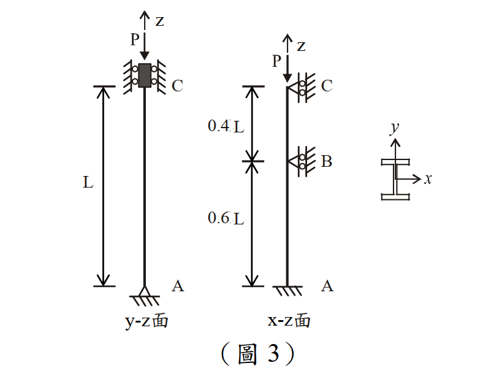

# 考題編號：SS-2013-3

**主分類：** `4.1.1` 拉力及壓力桿件
**副分類：** 無
**設計法：** 混合（ASD + LRFD）
**標籤：** `壓力桿件` `有效長度` `弱軸` `強軸` `分段側撐` `迴旋半徑` `Cc判斷` `非彈性挫屈` `W14x61` `ASD容許應力` `LRFD設計強度` `λc`

---

## 1. 原始題目重述 (Problem Restatement)

如圖 3 所示之受軸壓力 $P$ 之鋼柱，鋼柱總長度 $L = 16$ m，採用 **W14×61** 型鋼。

**材料與斷面性質：**

| 參數 | 數值 |
|------|------|
| 彈性模數 $E$ | 2,040 tf/cm² |
| 降伏強度 $F_y$ | 2.5 tf/cm² |
| 斷面積 $A$ | 116 cm² |
| 腹板高度 $d$ | 35.3 cm |
| 腹板厚度 $t_w$ | 0.952 cm |
| 翼板寬度 $b_f$ | 25.4 cm |
| 翼板厚度 $t_f$ | 1.64 cm |
| 強軸慣性矩 $I_x$ | 26,700 cm⁴ |
| 弱軸慣性矩 $I_y$ | 4,480 cm⁴ |

**邊界條件：**
- 底端 A：固接（all DOF restrained）
- 頂端 C：鉸接（pin，允許轉動但限制位移）
- 柱中 B 點（距 A 端 0.6L = 960 cm）：x-z 面上一鉸接側向支撐（弱軸方向側向支撐）

**子問題：**
1. **(一) ASD：** 求柱之容許壓力強度 $P_a$（15 分）
2. **(二) LRFD：** 求柱之設計壓力強度 $\phi P_n$（10 分）



*圖說：W14×61 受軸壓柱。左側 y-z 面（強軸平面）：A 固接、C 鉸接，強軸有效長度 $KL_x = 0.7 \times 1600 = 1120$ cm，$KL/r_x = 73.8$。右側 x-z 面（弱軸平面）：B 點（距 A = 960 cm = 0.6L）處有鉸接側向支撐；下段 A–B（固接–鉸接，K=0.7）：$KL/r_y = 0.7 \times 960 / 6.215 = 108.1$（控制）；上段 B–C（鉸接–鉸接，K=1.0）：$KL/r_y = 1.0 \times 640 / 6.215 = 103.0$。*

---

## 2. 考題核心精神與出題者意圖 (Core Concepts & Examiner's Intent)

**核心觀念：有側向支撐的柱，分強弱軸分段計算有效長度，取最大 KL/r 控制設計**

本題同時要求 ASD 與 LRFD，兩種設計法的核心步驟比較：

| 步驟 | ASD | LRFD |
|------|-----|------|
| 1 | 計算 $(KL/r)_{max}$ | 計算 $(KL/r)_{max}$ |
| 2 | 算 $C_c$，判斷彈性/非彈性 | 算 $\lambda_c$，判斷 $\lambda_c \lessgtr 1.5$ |
| 3 | 代入 ASD $F_a$ 公式 | 代入 LRFD $F_{cr}$ 公式 |
| 4 | $P_a = F_a \times A$ | $\phi P_n = 0.85 \times F_{cr} \times A$ |

**出題者測驗重點：**
1. 弱軸分兩段計算，找出控制段（不要漏掉分段）
2. 強軸全柱計算，與弱軸比較取最大 KL/r
3. ASD：非彈性挫屈公式含安全係數 FS 的完整計算
4. LRFD：$\lambda_c$ 的定義與 $F_{cr}$ 的指數計算

---

## 3. 解題戰略地圖與陷阱分析 (Strategic Roadmap & Trap Analysis)

**作戰計畫：**
```
Step 1  計算 rx, ry
Step 2  強軸（y-z面）：A固-C鉸，K=0.7，全長1600cm → KL/rx
Step 3  弱軸（x-z面）：
        下段 A-B（固-鉸，K=0.7，960cm） → KL/ry,下
        上段 B-C（鉸-鉸，K=1.0，640cm） → KL/ry,上
Step 4  取最大值 (KL/r)_max → 判斷設計區段
Step 5  ASD: Cc → Fa → Pa
Step 6  LRFD: λc → Fcr → φPn
```

**關鍵陷阱：**

> ⚠️ **陷阱1：強弱軸 KL/r 都要算，不能只算弱軸**
> 本題強軸全柱（1600 cm）也需計算，只是弱軸下段（108.1）比強軸（73.8）大，才由弱軸控制。

> ⚠️ **陷阱2：B 點側向支撐只影響弱軸（x-z面），不影響強軸**
> 強軸（y-z面）沒有中間支撐，有效長度仍為全柱（固-鉸，K=0.7）。

> ⚠️ **陷阱3：上段 B-C 的邊界條件**
> B 點為鉸接側向支撐（translational restraint only），等效為下端鉸；C 端亦為鉸接。上段兩端鉸，K = 1.0。

> ⚠️ **陷阱4：ASD 的安全係數 FS 公式（三項）**
> 非彈性區 FS = 5/3 + 3(KL/r)/(8Cc) − (KL/r)³/(8Cc³)，不能用固定 FS = 12/5。

## 3.5 變數層次分析（Variable Hierarchy Analysis）

> 複習提示：解題後，在每個卡住的知識點「卡關?」欄標記 `⚠`；第二次複習時只看有 `⚠` 的項目。

**最終目標：** W14×61 柱（強弱軸分段）→ $(KL/r)_{\max}$ → ASD 容許壓力 $P_a$ 及 LRFD 設計強度 $\phi P_n$

### 主要公式（$\boxed{\phantom{x}}$ = 未知，待推導）

$$r_x = \sqrt{I_x/A}, \quad r_y = \sqrt{I_y/A}$$

$$\left(\frac{KL}{r}\right)_{\max} = \max\!\left[(KL/r)_x,\;(KL/r)_{y,\text{下}},\;(KL/r)_{y,\text{上}}\right]$$

$$C_c = \sqrt{\frac{2\pi^2 E}{F_y}} \quad \text{(ASD)}$$

$$\boxed{F_a} = \frac{\left[1 - \dfrac{(KL/r)^2}{2C_c^2}\right] F_y}{\text{FS}}, \quad \boxed{P_a} = F_a \times A$$

$$\lambda_c = \frac{KL/r}{\pi}\sqrt{\frac{F_y}{E}}, \quad \boxed{F_{cr}} = 0.658^{\lambda_c^2} F_y, \quad \boxed{\phi P_n} = 0.85 F_{cr} A$$

### L1：題目直接給定

| 符號 | 數值 | 說明 |
|------|------|------|
| $E$ | 2,040 tf/cm² | 彈性模數 |
| $F_y$ | 2.5 tf/cm² | 降伏強度 |
| $A$ | 116 cm² | 斷面積 |
| $I_x$ | 26,700 cm⁴ | 強軸慣性矩 |
| $I_y$ | 4,480 cm⁴ | 弱軸慣性矩 |
| $L$ | 1,600 cm | 柱全長 |
| B 點位置 | $0.6L = 960$ cm（距 A） | 弱軸側向支撐點 |
| 底端 A | 固接 | 強弱軸均適用 |
| 頂端 C | 鉸接 | 強弱軸均適用 |
| B 點 | 鉸接側向支撐（弱軸用） | 僅影響弱軸 |

### L2：需知識點推導

**Step 1：斷面迴旋半徑**

| 符號 | 公式 / 來源 | 卡關? |
|------|------------|:-----:|
| $r_x$ | $\sqrt{26700/116} = 15.17$ cm | |
| $r_y$ | $\sqrt{4480/116} = 6.215$ cm | |

**Step 2：各方向有效長細比**

| 符號 | 公式 / 來源 | 卡關? |
|------|------------|:-----:|
| $(KL/r)_x$ | $0.7 \times 1600/15.17 = 73.8$（強軸，固-鉸，K=0.7） | |
| $(KL/r)_{y,\text{下}}$ | $0.7 \times 960/6.215 = 108.1$（下段 A–B，固-鉸，K=0.7）← 控制 | |
| $(KL/r)_{y,\text{上}}$ | $1.0 \times 640/6.215 = 103.0$（上段 B–C，鉸-鉸，K=1.0） | |

**Step 3：ASD 容許壓力 $P_a$**

| 符號 | 公式 / 來源 | 卡關? |
|------|------------|:-----:|
| $C_c$ | $\sqrt{2\pi^2 E/F_y} = 126.9$（非彈性/彈性分界） | |
| FS | $5/3 + 3(KL/r)/(8C_c) - (KL/r)^3/(8C_c^3) = 1.909$ | |
| $F_a$ | $[1-(KL/r)^2/(2C_c^2)]F_y/\text{FS} = 0.835$ tf/cm² | |
| $P_a$ | $F_a \times A = 97$ tf | |

**Step 4：LRFD 設計強度 $\phi P_n$**

| 符號 | 公式 / 來源 | 卡關? |
|------|------------|:-----:|
| $\lambda_c$ | $(KL/r)/(\pi\sqrt{E/F_y}) = 108.1/(\pi \times 28.57) = 1.205$ | |
| $F_{cr}$ | $0.658^{1.205^2} \times 2.5 = 1.360$ tf/cm²（非彈性，$\lambda_c < 1.5$） | |
| $\phi P_n$ | $0.85 \times 1.360 \times 116 = 134$ tf | |

### L3：深層知識（不懂就卡住）

| 知識點 | 說明 | 補強頁 | 卡關? |
|--------|------|:------:|:-----:|
| 強弱軸分別計算，取最大 KL/r | 只算弱軸或只算強軸都是錯的；本題弱軸下段控制 | [[lrfd-column]] | |
| B 點側向支撐僅影響弱軸 | 強軸（y-z 面）中間無支撐，全長 1600 cm 固-鉸，K=0.7 | | |
| 弱軸分段 K 值判斷 | 下段（固-鉸）K=0.7；上段（鉸-鉸）K=1.0；不能全段統一用同一 K | | |
| ASD 非彈性挫屈安全係數 FS | FS 隨 KL/r 變化（三項公式），非彈性段 FS ≠ 固定 5/3 | [[asd-column]] | |
| LRFD $\lambda_c$ 的物理意義 | $\lambda_c = \sqrt{F_y/F_e}$；$\lambda_c < 1.5$ 用 0.658 公式，$\lambda_c > 1.5$ 用 0.877 公式 | [[lrfd-column]] · [[COLUMN-STRENGTH-CURVE]] | |
| 殘留應力對非彈性挫屈的影響 | LRFD 公式隱含殘留應力修正（0.3Fy），ASD 的 Cc 也隱含此效應 | [[RESIDUAL-STRESS]] | |

---

## 4. 步驟化詳細計算過程 (Step-by-Step Detailed Calculation)

### 一、斷面迴旋半徑

$$r_x = \sqrt{\frac{I_x}{A}} = \sqrt{\frac{26{,}700}{116}} = \sqrt{230.2} = 15.17 \text{ cm}$$

$$r_y = \sqrt{\frac{I_y}{A}} = \sqrt{\frac{4{,}480}{116}} = \sqrt{38.62} = 6.215 \text{ cm}$$

---

### 二、強軸（y-z 面）有效長度

強軸平面：底端 A 固接，頂端 C 鉸接，無中間支撐 → **固端-鉸端：K = 0.7**

$$\left(\frac{KL}{r}\right)_x = \frac{0.7 \times 1600}{15.17} = \frac{1120}{15.17} = 73.8$$

---

### 三、弱軸（x-z 面）有效長度（分段計算）

弱軸側向支撐：B 點（距 A = $0.6L = 960$ cm）。

**下段 A–B（長 960 cm）：底端 A 固接、頂端 B 鉸接支撐 → K = 0.7**

$$\left(\frac{KL}{r}\right)_{y,\text{下}} = \frac{0.7 \times 960}{6.215} = \frac{672}{6.215} = \boxed{108.1}$$

**上段 B–C（長 640 cm）：底端 B 鉸接、頂端 C 鉸接 → K = 1.0**

$$\left(\frac{KL}{r}\right)_{y,\text{上}} = \frac{1.0 \times 640}{6.215} = \frac{640}{6.215} = 103.0$$

---

### 四、控制長細比

$$\left(\frac{KL}{r}\right)_{\max} = \max(73.8,\; 108.1,\; 103.0) = \boxed{108.1}$$

**控制段：弱軸下段（A–B），**$KL/r = 108.1$

---

### 五、(一) ASD 容許壓力強度 $P_a$

**計算 $C_c$（彈性/非彈性界限長細比）：**

$$C_c = \sqrt{\frac{2\pi^2 E}{F_y}} = \sqrt{\frac{2 \times 9.870 \times 2040}{2.5}} = \sqrt{\frac{40{,}270}{2.5}} = \sqrt{16{,}108} = 126.9$$

**判斷區段：** $KL/r = 108.1 < C_c = 126.9$ → **非彈性挫屈（Inelastic Buckling）**

**計算安全係數 FS（隨 KL/r 變化）：**

$$\text{FS} = \frac{5}{3} + \frac{3(KL/r)}{8C_c} - \frac{(KL/r)^3}{8C_c^3}$$

$$= \frac{5}{3} + \frac{3 \times 108.1}{8 \times 126.9} - \frac{108.1^3}{8 \times 126.9^3}$$

$$= 1.6667 + \frac{324.3}{1015.2} - \frac{1{,}264{,}290}{8 \times 2{,}043{,}963}$$

$$= 1.6667 + 0.3195 - \frac{1{,}264{,}290}{16{,}351{,}704}$$

$$= 1.6667 + 0.3195 - 0.07733 = 1.909$$

**計算容許應力 $F_a$：**

$$F_a = \frac{\left[1 - \dfrac{(KL/r)^2}{2C_c^2}\right] F_y}{\text{FS}}$$

$$= \frac{\left[1 - \dfrac{108.1^2}{2 \times 126.9^2}\right] \times 2.5}{1.909}$$

$$= \frac{\left[1 - \dfrac{11{,}686}{32{,}214}\right] \times 2.5}{1.909} = \frac{(1 - 0.3627) \times 2.5}{1.909} = \frac{0.6373 \times 2.5}{1.909}$$

$$= \frac{1.593}{1.909} = \boxed{0.835 \text{ tf/cm}^2}$$

**容許壓力強度：**

$$\boxed{P_a = F_a \times A = 0.835 \times 116 = 96.9 \approx 97 \text{ tf}}$$

---

### 六、(二) LRFD 設計壓力強度 $\phi P_n$

**計算 $\lambda_c$（LRFD 無量綱長細參數）：**

$$\lambda_c = \frac{KL/r}{\pi}\sqrt{\frac{F_y}{E}} = \frac{KL/r}{\pi\sqrt{E/F_y}}$$

$$\sqrt{\frac{E}{F_y}} = \sqrt{\frac{2040}{2.5}} = \sqrt{816} = 28.57$$

$$\lambda_c = \frac{108.1}{\pi \times 28.57} = \frac{108.1}{89.75} = 1.205$$

**判斷 $F_{cr}$ 公式：** $\lambda_c = 1.205 < 1.5$ → **非彈性挫屈（Johnson 公式）**

$$F_{cr} = 0.658^{\lambda_c^2} \times F_y$$

$$\lambda_c^2 = 1.205^2 = 1.452$$

$$0.658^{1.452} = e^{1.452 \times \ln(0.658)} = e^{1.452 \times (-0.4193)} = e^{-0.609} = 0.544$$

$$F_{cr} = 0.544 \times 2.5 = 1.360 \text{ tf/cm}^2$$

**設計壓力強度（$\phi_c = 0.85$）：**

$$\boxed{\phi P_n = 0.85 \times F_{cr} \times A = 0.85 \times 1.360 \times 116 = 134.0 \approx 134 \text{ tf}}$$

---

### 七、結果彙整

| 量 | 數值 |
|----|------|
| $r_x$ | 15.17 cm |
| $r_y$ | 6.215 cm |
| $(KL/r)_x$（強軸，全柱） | 73.8 |
| $(KL/r)_{y,\text{下}}$（弱軸下段，控制） | **108.1** |
| $(KL/r)_{y,\text{上}}$（弱軸上段） | 103.0 |
| $C_c$ | 126.9 |
| $\lambda_c$ | 1.205 |
| **$P_a$（ASD）** | **97 tf** |
| **$\phi P_n$（LRFD）** | **134 tf** |

---

## 5. 關鍵爭議點與進階探討 (Critical Issues & Advanced Discussion)

### ASD vs LRFD 結果比較

$$P_a = 97 \text{ tf} \quad (\text{ASD})$$
$$\phi P_n = 134 \text{ tf} \quad (\text{LRFD})$$

**等效比較：** 若以 LRFD 係數 $P_u = 1.2P_D + 1.6P_L$（約 1.4× 設計載重），則 $P_a \approx \phi P_n / 1.4 = 134/1.4 = 95.7$ tf ≈ $P_a$（大致一致）

### 為何弱軸下段控制？

| 段 | 有效長度 KL | $KL/r_y$ |
|----|------------|----------|
| 下段（K=0.7, L=960cm） | 672 cm | 108.1 ← **控制** |
| 上段（K=1.0, L=640cm） | 640 cm | 103.0 |

雖然上段物理長度較短（640 cm），但：
- 下段：K=0.7（固接底端），有效長度 = 672 cm
- 上段：K=1.0（兩端鉸接），有效長度 = 640 cm

672 > 640，故下段控制。

**設計直覺：** 若想提升承載力，可在中間再加一個側向支撐，進一步分割弱軸有效長度。

### ASD 安全係數的設計哲學

非彈性挫屈段的安全係數 $\text{FS}$ 介於：
- 在 $KL/r = 0$（純壓力）時：FS = 5/3 = 1.667
- 在 $KL/r = C_c$ 時：FS = 23/12 = 1.917（彈性挫屈邊界）

本題 FS = 1.909，接近彈性挫屈邊界（KL/r = 108 接近 Cc = 127）。

### LRFD $\lambda_c$ 的物理意義

$$\lambda_c = \frac{KL/r}{\pi\sqrt{E/F_y}} = \frac{KL/r}{\sqrt{E/F_y} \times \pi} = \sqrt{\frac{F_y}{F_{e}}}$$

其中 $F_e = \pi^2 E/(KL/r)^2$（歐拉應力）：
$$F_e = \frac{\pi^2 \times 2040}{108.1^2} = \frac{20{,}134}{11{,}686} = 1.722 \text{ tf/cm}^2$$

$$\lambda_c = \sqrt{\frac{F_y}{F_e}} = \sqrt{\frac{2.5}{1.722}} = \sqrt{1.452} = 1.205 \quad \checkmark$$

$\lambda_c > 1$ 代表降伏應力 $F_y$ 高於彈性挫屈應力 $F_e$，柱在達到完全彈性挫屈前已有局部降伏（非彈性挫屈）。

*解析完成時間：2026-04-23*
*驗證狀態：unverified*
