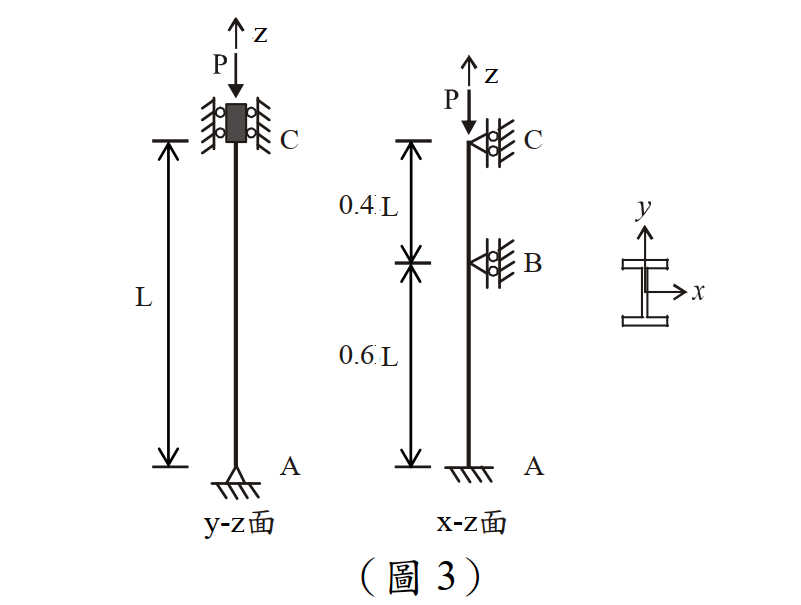

# 考題編號：SS-2013-3

**主分類：** `SS-U1-1` 拉力及壓力桿件
**副分類：** 無
**設計法：** 混合（ASD + LRFD）
**標籤：** `壓力桿件` `有效長度` `弱軸挫屈` `強軸挫屈` `分段側撐` `迴旋半徑` `ASD容許應力` `LRFD設計強度` `兩平面邊界不同` `Cc判斷` `λc`

---

## 1. 原始題目重述 (Problem Restatement)

如圖 3 所示之一受軸壓力 $P$ 作用之鋼柱，已知鋼柱**總長度為 16 m**，柱底 A 點處及柱頂 C 點處之邊界條件如圖 3 所示；另於柱中 B 點處的 **x-z 面**上有一**鉸接之側向支撐**。若此鋼柱採用 **W14×61** 型鋼：

| 參數 | 數值 |
|------|------|
| 彈性模數 $E$ | 2,040 tf/cm² |
| 降伏強度 $F_y$ | 2.5 tf/cm² |
| 斷面積 $A$ | 116 cm² |
| 斷面深度 $d$ | 35.3 cm |
| 腹板厚度 $t_w$ | 0.952 cm |
| 翼板寬度 $b_f$ | 25.4 cm |
| 翼板厚度 $t_f$ | 1.64 cm |
| 強軸慣性矩 $I_x$ | 26,700 cm⁴ |
| 弱軸慣性矩 $I_y$ | 4,480 cm⁴ |

**子問題：**

1. **(一)** 試以**容許應力設計法（ASD）**，求解該柱之容許壓力強度 $P_a$（15 分）
2. **(二)** 試以**極限設計法（LRFD）**，求解該柱之設計壓力強度 $\phi_c P_n$（10 分）

**考卷附有效長度係數表：**

| 條件 | 邊界無側位移 | | | 邊界有側位移* | | |
|:---|:---:|:---:|:---:|:---:|:---:|:---:|
| **端點型式** | 固接-固接 | 鉸接-固接 | 鉸接-鉸接 | 固接*-固接 | 固接*-鉸接 | 自由端*-固接 |
| **理論 K 值** | 0.5 | **0.7** | **1.0** | 1.0 | 2.0 | 2.0 |
| **設計 K 值** | 0.65 | **0.8** | **1.0** | 1.2 | 2.0 | 2.1 |

**邊界條件（由圖 3 逐一判讀——本題兩個平面的邊界並不相同）：**

| 平面 | 對應軸 | 柱底 A | 柱中 B | 柱頂 C |
|:---|:---|:---|:---|:---|
| **y-z 面**（左圖） | 變位在 $y$ 向 → 繞 $x$ 軸彎曲 → **強軸**（$I_x$、$r_x$） | **鉸支承**（三角形符號） | 無支撐 | **固接但可沿軸向滑動**（實心方塊夾在兩片有滾輪的斜線牆之間：轉動被拘束、側向位移被拘束、僅容許沿 z 軸滑動） |
| **x-z 面**（右圖） | 變位在 $x$ 向 → 繞 $y$ 軸彎曲 → **弱軸**（$I_y$、$r_y$） | **固接**（斜線陰影固定端） | **鉸接側向支撐**（滾輪貼斜線牆：僅拘束側向位移，容許轉動），位置距 A 為 $0.6L = 960$ cm | **鉸接側向支撐**（滾輪貼斜線牆） |



*圖說：W14×61 受軸壓柱，總長 $L = 16$ m $= 1600$ cm。**左側 y-z 面（強軸平面，用 $I_x$、$r_x$）**：柱底 A 為鉸支承（三角形），柱頂 C 為「固接可滑動」（實心方塊夾在兩排滾輪之間，轉動與側向位移皆被拘束、僅能沿軸向 z 滑動），全長無中間支撐 → 端點型式屬「**鉸接-固接、邊界無側位移**」，理論 $K = 0.7$（設計 $K = 0.8$）。**右側 x-z 面（弱軸平面，用 $I_y$、$r_y$）**：柱底 A 為**固接**（斜線陰影固定端），B 點（距 A $= 0.6L = 960$ cm）與柱頂 C 點各有一「滾輪貼牆」式**鉸接側向支撐**（只拘束側向位移、容許轉動）→ 弱軸分為下段 A–B（$0.6L = 960$ cm，固接-鉸接，理論 $K = 0.7$）與上段 B–C（$0.4L = 640$ cm，鉸接-鉸接，$K = 1.0$）。**兩個平面的柱底條件相反（強軸鉸、弱軸固），是本題最主要的判讀陷阱。** 最右側為 W 型鋼斷面：翼板水平、$x$ 軸水平（強軸）、$y$ 軸垂直（弱軸）。*

---

## 2. 考題核心精神與出題者意圖 (Core Concepts & Examiner's Intent)

**核心觀念：兩個正交平面各自獨立判斷邊界與分段，把三個 $KL/r$ 都算出來，取最大者控制；再以同一個 $KL/r$ 分別跑 ASD 與 LRFD 兩套公式。**

| 步驟 | ASD | LRFD |
|------|-----|------|
| 1 | 計算 $(KL/r)_{\max}$（三段比較） | 計算 $(KL/r)_{\max}$（同一值） |
| 2 | 算 $C_c = \sqrt{2\pi^2E/F_y}$，判斷彈性／非彈性 | 算 $\lambda_c = \dfrac{KL/r}{\pi}\sqrt{F_y/E}$，判斷 $\lambda_c \lessgtr 1.5$ |
| 3 | 代入 $F_a$（含變動安全係數 FS） | 代入 $F_{cr} = 0.658^{\lambda_c^2}F_y$ |
| 4 | $P_a = F_a A$ | $\phi_c P_n = \phi_c F_{cr} A$ |

**出題者測驗重點：**

1. **兩平面邊界不同**：強軸平面柱底是**鉸**、弱軸平面柱底是**固**——粗心者會兩個平面用同一組邊界
2. **弱軸要分段**：B 點側向支撐把弱軸切成 0.6L 與 0.4L 兩段，兩段的 $K$ 值還不一樣
3. **強軸不分段**：B 點的支撐只在 x-z 面，對強軸（y-z 面）完全無效，強軸仍用全長 1600 cm
4. ASD 非彈性段的安全係數 FS 是 $KL/r$ 的三次函數，不是常數
5. LRFD 的 $\lambda_c$ 定義與 $0.658^{\lambda_c^2}$ 的指數運算

---

## 3. 解題戰略地圖與陷阱分析 (Strategic Roadmap & Trap Analysis)

**作戰計畫：**
```
Step 1  計算 rx, ry
Step 2  強軸（y-z面，全長1600cm）：A鉸 - C固（無側位移）→ K=0.7 → KL/rx
Step 3  弱軸（x-z面，分兩段）：
        下段 A-B（A固 - B鉸，960cm）→ K=0.7 → KL/ry,下
        上段 B-C（B鉸 - C鉸，640cm）→ K=1.0 → KL/ry,上
Step 4  取最大值 (KL/r)_max → 判斷設計區段
Step 5  ASD: Cc → FS → Fa → Pa
Step 6  LRFD: λc → Fcr → φcPn
```

**關鍵陷阱：**

> ⚠️ **陷阱 1（本題最主要）：兩個平面的柱底條件相反**
> 左圖（y-z 面／強軸）A 是**三角形鉸支承**；右圖（x-z 面／弱軸）A 是**斜線陰影固定端**。
> 若把兩個平面都當成「A 固接」或都當成「A 鉸接」，強軸的 $K$ 就會取錯。
> （本題碰巧強軸「鉸-固」與弱軸下段「固-鉸」的 $K$ 同為 0.7，**答案不變但敘述會錯**——
> 若考官改動任一端條件，這個誤讀就會直接吃分。）

> ⚠️ **陷阱 2：柱頂 C 在 y-z 面是「固接」不是「鉸接」**
> 圖上 C 是一個**實心方塊夾在兩排滾輪導軌之間**：滾輪允許沿軸向（z）滑動，但方塊被兩片牆夾住，
> **轉動與側向位移都被拘束** → 屬「固接（無側位移）」。若誤判為鉸接（鉸-鉸），$K$ 會變成 1.0，
> $KL/r_x = 105.5$，雖仍不控制，但推理已錯。

> ⚠️ **陷阱 3：B 點側向支撐只影響弱軸**
> B 點的支撐畫在 **x-z 面**，只拘束 $x$ 向位移 → 只切割弱軸。強軸（y-z 面）中間無支撐，
> 有效長度仍為全長 1600 cm。誤把強軸也分段會嚴重高估承載力。

> ⚠️ **陷阱 4：弱軸兩段的 $K$ 值不同，且「短的那段不一定控制」**
> 下段 $K = 0.7$、$L = 960$ → $KL = 672$ cm；上段 $K = 1.0$、$L = 640$ → $KL = 640$ cm。
> 下段雖然 $K$ 較小，但長度較長，$KL$ 反而較大 → **下段控制**。必須比 $KL$ 而非比 $L$。

> ⚠️ **陷阱 5：ASD 的安全係數 FS 是三項式**
> 非彈性區 $\text{FS} = \dfrac{5}{3} + \dfrac{3(KL/r)}{8C_c} - \dfrac{(KL/r)^3}{8C_c^3}$，
> 隨 $KL/r$ 由 1.667 變化到 1.917，**不可用固定值 5/3 或 23/12**。

> ⚠️ **陷阱 6：理論 K 值 vs 設計 K 值**
> 考卷同時給了兩列。圖上支承畫得很理想化，多數解答採**理論 K**；若採**設計 K**（0.8／1.0），
> $P_a$ 會從 96.8 掉到 79.6 tf、$\phi_cP_n$ 從 134 掉到 111 tf（詳見 §5.2）。
> 作答時**務必寫明採用哪一列**。

## 3.5 變數層次分析（Variable Hierarchy Analysis）

> 複習提示：解題後，在每個卡住的知識點「卡關?」欄標記 `⚠`；第二次複習時只看有 `⚠` 的項目。

**最終目標：** W14×61 柱（兩平面邊界不同、弱軸分段）→ $(KL/r)_{\max}$ → ASD 容許壓力 $P_a$ 及 LRFD 設計強度 $\phi_c P_n$

### 主要公式（$\boxed{\phantom{x}}$ = 未知，待推導）

$$\boxed{r_x} = \sqrt{I_x/A}, \qquad \boxed{r_y} = \sqrt{I_y/A}$$

$$\boxed{\left(\frac{KL}{r}\right)_{\max}} = \max\!\left[\underbrace{\frac{0.7(1600)}{\boxed{r_x}}}_{\text{強軸全柱}},\;\underbrace{\frac{0.7(960)}{\boxed{r_y}}}_{\text{弱軸下段}},\;\underbrace{\frac{1.0(640)}{\boxed{r_y}}}_{\text{弱軸上段}}\right]$$

$$C_c = \sqrt{\frac{2\pi^2 E}{F_y}} \quad \text{(ASD 彈性／非彈性分界)}$$

$$\boxed{\text{FS}} = \frac{5}{3} + \frac{3\boxed{(KL/r)}}{8C_c} - \frac{\boxed{(KL/r)}^3}{8C_c^3}$$

$$\boxed{F_a} = \frac{\left[1 - \dfrac{\boxed{(KL/r)}^2}{2C_c^2}\right] F_y}{\boxed{\text{FS}}}, \qquad \boxed{P_a} = \boxed{F_a} \times A$$

$$\boxed{\lambda_c} = \frac{\boxed{(KL/r)}}{\pi}\sqrt{\frac{F_y}{E}}, \qquad \boxed{F_{cr}} = 0.658^{\boxed{\lambda_c}^2} F_y, \qquad \boxed{\phi_c P_n} = 0.85\,\boxed{F_{cr}}\,A$$

### L1：題目直接給定

_看到題目就能讀出的數字，不需要任何公式。_

| 符號 | 數值 | 說明 |
|:---:|:---|:---|
| $E$ | 2,040 tf/cm² | 彈性模數 |
| $F_y$ | 2.5 tf/cm² | 降伏強度 |
| $A$ | 116 cm² | 斷面積 |
| $I_x$ | 26,700 cm⁴ | 強軸慣性矩 |
| $I_y$ | 4,480 cm⁴ | 弱軸慣性矩 |
| $L$ | 1,600 cm | 柱總長 |
| B 點位置 | $0.6L = 960$ cm（距 A） | 弱軸側向支撐點 |
| A（y-z 面／強軸） | **鉸支承** | 三角形符號 |
| C（y-z 面／強軸） | **固接（可軸向滑動、無側位移）** | 方塊＋兩側滾輪導軌 |
| A（x-z 面／弱軸） | **固接** | 斜線陰影固定端 |
| B、C（x-z 面／弱軸） | **鉸接側向支撐** | 滾輪貼牆 |
| $K$ 值表 | 理論 0.5／0.7／1.0／…；設計 0.65／0.8／1.0／… | 考卷提供 |

### L2：需知識點推導

_需要知道公式名稱與適用條件，套入 L1 即可算出。_

**Step 1：斷面迴旋半徑**

| 符號 | 公式／來源 | 卡關? |
|:---:|:---|:---|
| $r_x$ | $\sqrt{26700/116} = 15.17$ cm | |
| $r_y$ | $\sqrt{4480/116} = 6.215$ cm | |

**Step 2：三個有效長細比（採理論 $K$ 值）**

| 符號 | 公式／來源 | 卡關? |
|:---:|:---|:---|
| $(KL/r)_x$ | $0.7(1600)/15.17 = 73.8$（強軸全柱；A 鉸-C 固，無側位移，$K = 0.7$） | |
| $(KL/r)_{y,\text{下}}$ | $0.7(960)/6.215 = 108.1$（弱軸下段 A–B；A 固-B 鉸，$K = 0.7$）← **控制** | |
| $(KL/r)_{y,\text{上}}$ | $1.0(640)/6.215 = 103.0$（弱軸上段 B–C；B 鉸-C 鉸，$K = 1.0$） | |
| $(KL/r)_{\max}$ | $108.1$ | |
| 細長比上限檢核 | $108.1 < 200$（規範建議上限）✓ | |

**Step 3：(一) ASD 容許壓力 $P_a$**

| 符號 | 公式／來源 | 卡關? |
|:---:|:---|:---|
| $C_c$ | $\sqrt{2\pi^2(2040)/2.5} = 126.9$ | |
| 區段判定 | $108.1 < 126.9$ → **非彈性挫屈** | |
| FS | $5/3 + 3(108.1)/(8 \times 126.9) - 108.1^3/(8 \times 126.9^3) = 1.909$ | |
| $F_a$ | $[1-108.1^2/(2 \times 126.9^2)](2.5)/1.909 = 0.834$ tf/cm² | |
| $P_a$ | $0.834 \times 116 = 96.8$ tf | |

**Step 4：(二) LRFD 設計強度 $\phi_c P_n$**

| 符號 | 公式／來源 | 卡關? |
|:---:|:---|:---|
| $\sqrt{E/F_y}$ | $\sqrt{2040/2.5} = 28.57$ | |
| $\lambda_c$ | $108.1/(\pi \times 28.57) = 1.205$ | |
| 區段判定 | $\lambda_c = 1.205 < 1.5$ → **非彈性挫屈** | |
| $F_{cr}$ | $0.658^{1.452} \times 2.5 = 1.362$ tf/cm² | |
| $\phi_c P_n$ | $0.85 \times 1.362 \times 116 = 134.3$ tf | |
| 局部挫屈檢核 | 翼板 $b_f/2t_f = 7.74 < 0.56\sqrt{E/F_y} = 16.0$；腹板 $h/t_w = 33.6 < 1.49\sqrt{E/F_y} = 42.6$ → 非細長 ✓ | |

### L3：深層知識（不懂就卡住）

| 知識點 | 說明 | 補強頁 | 卡關? |
|:---|:---|:---:|:---|
| 兩正交平面須各自獨立判斷 | 同一根柱在兩個平面可以有完全不同的支承與分段；本題柱底一鉸一固 | [[effective-length-chart]] | |
| 「y-z 面」對應哪個軸 | 變位在 $y$ 向 → 繞 $x$ 軸彎曲 → 用 $I_x$、$r_x$（強軸）。判別靠斷面圖的軸向定義 | | |
| 側向支撐只作用於其所在平面 | B 點畫在 x-z 面 → 只切弱軸；強軸仍是全長 | | |
| 分段後應比較 $KL$ 而非 $L$ | 下段 $K$ 小但長，$KL = 672 >$ 上段 $KL = 640$ → 下段控制 | [[lrfd-column]] | |
| 「固接可滑動」的 $K$ 判定 | 轉動被拘束＋側向位移被拘束＋僅軸向可滑動 → 屬「固接、無側位移」端 | [[effective-length-chart]] | |
| ASD 非彈性挫屈安全係數 FS | FS 隨 $KL/r$ 由 5/3（$=1.667$）變化到 23/12（$=1.917$），是三項式而非常數 | [[asd-column]] · [[asd-fa-formula-basis]] | |
| LRFD $\lambda_c$ 的物理意義 | $\lambda_c = \sqrt{F_y/F_e}$；$\lambda_c \le 1.5$ 用 $0.658^{\lambda_c^2}$，$>1.5$ 用 $0.877/\lambda_c^2$ | [[lrfd-column]] · [[COLUMN-STRENGTH-CURVE]] | |
| 殘留應力對非彈性挫屈的影響 | LRFD 的 $0.658$ 曲線與 ASD 的 $C_c$ 都隱含殘留應力（約 $0.5F_y$）效應 | [[RESIDUAL-STRESS]] | |
| 理論 K 值與設計 K 值的取捨 | 支承理想化明確時可用理論值；實際施工難達理想時規範建議用設計值（較大） | [[effective-length-chart]] | |

---

## 4. 步驟化詳細計算過程 (Step-by-Step Detailed Calculation)

### 一、斷面迴旋半徑

$$r_x = \sqrt{\frac{I_x}{A}} = \sqrt{\frac{26{,}700}{116}} = \sqrt{230.2} = 15.17 \ \text{cm}$$

$$r_y = \sqrt{\frac{I_y}{A}} = \sqrt{\frac{4{,}480}{116}} = \sqrt{38.62} = 6.215 \ \text{cm}$$

---

### 二、強軸（y-z 面）有效長度

**邊界：** 柱底 A **鉸支承**、柱頂 C **固接（可軸向滑動、側向位移被拘束）**，中間無支撐。

依考卷表：端點型式「**鉸接-固接**」、「**邊界無側位移**」→ 理論 $K = 0.7$

$$\left(\frac{KL}{r}\right)_x = \frac{0.7 \times 1600}{15.17} = \frac{1120}{15.17} = 73.8$$

> **策略註解：** 強軸用**全長 1600 cm**。B 點的側向支撐畫在 x-z 面，對本平面（y-z）沒有任何作用。

---

### 三、弱軸（x-z 面）有效長度（分段計算）

**邊界：** 柱底 A **固接**；B 點（距 A $= 0.6L = 960$ cm）與柱頂 C **鉸接側向支撐**。

**下段 A–B（長 $0.6L = 960$ cm）：** A 固接、B 鉸接 → 「鉸接-固接、無側位移」→ $K = 0.7$

$$\left(\frac{KL}{r}\right)_{y,\text{下}} = \frac{0.7 \times 960}{6.215} = \frac{672}{6.215} = \boxed{108.1}$$

**上段 B–C（長 $0.4L = 640$ cm）：** B 鉸接、C 鉸接 → 「鉸接-鉸接」→ $K = 1.0$

$$\left(\frac{KL}{r}\right)_{y,\text{上}} = \frac{1.0 \times 640}{6.215} = \frac{640}{6.215} = 103.0$$

---

### 四、控制長細比

$$\left(\frac{KL}{r}\right)_{\max} = \max(73.8,\; 108.1,\; 103.0) = \boxed{108.1}$$

**控制段：弱軸下段（A–B）**，$KL/r = 108.1$

$$108.1 < 200 \quad \text{（壓力桿件細長比上限）} \ \checkmark$$

---

### 五、(一) ASD 容許壓力強度 $P_a$

**計算 $C_c$（彈性／非彈性界限長細比）：**

$$C_c = \sqrt{\frac{2\pi^2 E}{F_y}} = \sqrt{\frac{2 \times 9.8696 \times 2040}{2.5}} = \sqrt{\frac{40{,}268}{2.5}} = \sqrt{16{,}107} = 126.9$$

**判斷區段：** $KL/r = 108.1 < C_c = 126.9$ → **非彈性挫屈（Inelastic Buckling）**

**計算安全係數 FS（隨 $KL/r$ 變化）：**

$$\text{FS} = \frac{5}{3} + \frac{3(KL/r)}{8C_c} - \frac{(KL/r)^3}{8C_c^3}$$

$$= 1.6667 + \frac{3 \times 108.1}{8 \times 126.9} - \frac{108.1^3}{8 \times 126.9^3} = 1.6667 + \frac{324.3}{1015.2} - \frac{1{,}263{,}214}{16{,}344{,}566}$$

$$= 1.6667 + 0.3194 - 0.0773 = \boxed{1.909}$$

**計算容許應力 $F_a$：**

$$F_a = \frac{\left[1 - \dfrac{(KL/r)^2}{2C_c^2}\right] F_y}{\text{FS}} = \frac{\left[1 - \dfrac{108.1^2}{2(126.9)^2}\right] \times 2.5}{1.909}$$

$$= \frac{\left[1 - \dfrac{11{,}686}{32{,}211}\right] \times 2.5}{1.909} = \frac{(1 - 0.3628) \times 2.5}{1.909} = \frac{1.593}{1.909} = \boxed{0.834 \ \text{tf/cm}^2}$$

**容許壓力強度：**

$$\boxed{P_a = F_a \times A = 0.834 \times 116 = 96.8 \ \text{tf}}$$

---

### 六、(二) LRFD 設計壓力強度 $\phi_c P_n$

**計算 $\lambda_c$（無量綱長細參數）：**

$$\sqrt{\frac{E}{F_y}} = \sqrt{\frac{2040}{2.5}} = \sqrt{816} = 28.57$$

$$\lambda_c = \frac{KL/r}{\pi}\sqrt{\frac{F_y}{E}} = \frac{108.1}{\pi \times 28.57} = \frac{108.1}{89.73} = \boxed{1.205}$$

**判斷 $F_{cr}$ 公式：** $\lambda_c = 1.205 < 1.5$ → **非彈性挫屈**

$$\lambda_c^2 = 1.205^2 = 1.452$$

$$0.658^{1.452} = e^{1.452 \ln 0.658} = e^{1.452(-0.4187)} = e^{-0.6080} = 0.5446$$

$$F_{cr} = 0.5446 \times 2.5 = 1.362 \ \text{tf/cm}^2$$

**局部挫屈檢核（不可略）：**

$$\text{翼板（無側支撐板元）：}\ \frac{b_f}{2t_f} = \frac{25.4}{2(1.64)} = 7.74 \;<\; 0.56\sqrt{\frac{E}{F_y}} = 0.56(28.57) = 16.0 \ \checkmark$$

$$\text{腹板（有側支撐板元）：}\ \frac{h}{t_w} = \frac{35.3 - 2(1.64)}{0.952} = 33.6 \;<\; 1.49\sqrt{\frac{E}{F_y}} = 1.49(28.57) = 42.6 \ \checkmark$$

兩者均為**非細長斷面**，故無需折減（$Q = 1.0$），$F_{cr}$ 可直接採整體彎曲挫屈值。

**設計壓力強度（台灣現行規範 $\phi_c = 0.85$）：**

$$\boxed{\phi_c P_n = 0.85 \times F_{cr} \times A = 0.85 \times 1.362 \times 116 = 134.3 \approx 134 \ \text{tf}}$$

---

### 七、結果彙整

| 量 | 數值 |
|----|------|
| $r_x$ | 15.17 cm |
| $r_y$ | 6.215 cm |
| $(KL/r)_x$（強軸全柱，A 鉸-C 固，$K = 0.7$） | 73.8 |
| $(KL/r)_{y,\text{下}}$（弱軸下段，A 固-B 鉸，$K = 0.7$） | **108.1 ← 控制** |
| $(KL/r)_{y,\text{上}}$（弱軸上段，B 鉸-C 鉸，$K = 1.0$） | 103.0 |
| $C_c$ | 126.9 |
| FS | 1.909 |
| $F_a$ | 0.834 tf/cm² |
| **$P_a$（ASD）** | **96.8 tf** |
| $\lambda_c$ | 1.205 |
| $F_{cr}$ | 1.362 tf/cm² |
| **$\phi_c P_n$（LRFD，$\phi_c = 0.85$）** | **134 tf** |

---

## 5. 關鍵爭議點與進階探討 (Critical Issues & Advanced Discussion)

### 5.1 為何弱軸下段控制？——比 $KL$，不比 $L$

| 段 | $K$ | $L$ (cm) | $KL$ (cm) | $KL/r_y$ |
|:---|:---:|:---:|:---:|:---:|
| 下段 A–B | 0.7 | 960 | **672** | **108.1 ← 控制** |
| 上段 B–C | 1.0 | 640 | 640 | 103.0 |

上段物理長度較短（640 < 960 cm），但兩端皆鉸（$K = 1.0$）；下段雖有固接底端（$K = 0.7$）卻長得多，
$KL$ 反而較大。**「短的那段不一定安全」是本題的設計直覺重點。**

**設計啟示：** 若要提升承載力，最有效的是把 B 點側撐往下移（讓兩段的 $KL$ 相等）。
令 $0.7a = 1.0(1600-a)$ 得 $a = 941$ cm，此時兩段 $KL = 659$ cm、$KL/r_y = 106.0$，$P_a$ 可提升約 1.5%；
若在弱軸再加一道側撐（三分點），$KL/r_y$ 可降到約 72，$P_a$ 提升約 40%。

### 5.2 理論 K 值 vs 設計 K 值：答案差 18%

考卷同時給出兩列 $K$ 值，因此必須交代採用哪一列：

| 採用 | $(KL/r)_x$ | $(KL/r)_{y,\text{下}}$ | $(KL/r)_{y,\text{上}}$ | 控制值 | $F_a$ | **$P_a$** | $\lambda_c$ | $F_{cr}$ | **$\phi_cP_n$** |
|:---|:---:|:---:|:---:|:---:|:---:|:---:|:---:|:---:|:---:|
| **理論 K**（0.7／0.7／1.0） | 73.8 | **108.1** | 103.0 | 108.1 | 0.834 | **96.8 tf** | 1.205 | 1.362 | **134 tf** |
| **設計 K**（0.8／0.8／1.0） | 84.4 | **123.6** | 103.0 | 123.6 | 0.686 | **79.6 tf** | 1.377 | 1.130 | **111 tf** |

**如何選？**

- 圖 3 把支承畫成**理想化符號**（純鉸、純固定端、滾輪導軌），且題目未指示「支承僅能近似理想條件」
  → 多數解答採**理論 K 值**（本檔採用）。
- 若強調「設計」二字、認為實際柱底不可能是完美鉸／完美固接 → 採**設計 K 值**（規範建議值），答案較保守。
- **考場作法：** 主答採理論 K 值，並在旁註明「若採設計 K 值（0.8）則 $P_a = 79.6$ tf、$\phi_cP_n = 111$ tf」。
  兩列都給了，兩種答案都應該被接受，但**不寫明依據**才會被扣分。

### 5.3 依最新規範計算的差異

| 項目 | 本題所用（台灣現行規範，民國 99 年版） | AISC 360-16／-22 | 本題影響 |
|:---|:---|:---|:---|
| **LRFD $\phi_c$** | **0.85** | **0.90** | $\phi_cP_n$：134 → **142 tf**（+6%） |
| LRFD 界限判準 | $\lambda_c \le 1.5$ | $KL/r \le 4.71\sqrt{E/F_y} = 134.5$ | 等價（$1.5\pi = 4.712$），本題 108.1 < 134.5，同屬非彈性 |
| LRFD $F_{cr}$ 式 | $0.658^{\lambda_c^2}F_y$ | $\left[0.658^{F_y/F_e}\right]F_y$ | **完全相同**（$F_y/F_e \equiv \lambda_c^2$）；$F_e = \pi^2E/(KL/r)^2 = 1.723$ tf/cm²，$F_y/F_e = 1.451$ → $F_{cr} = 1.362$ ✓ |
| ASD 架構 | $F_a$（$C_c$＋變動 FS） | 統一：$P_a = F_{cr}A/\Omega$，$\Omega = 1.67$ | $F_{cr}/\Omega = 1.362/1.67 = 0.816$ tf/cm² → $P_a = 94.6$ tf（比 96.8 低 2.3%） |
| 細長比上限 | 建議 $KL/r \le 200$ | 同（E2 條文說明） | 108.1 ✓ |

**結論：** 台灣現行有效版本仍為**民國 99 年（2010）修正版**，$\phi_c$ 仍是 **0.85**；參照 AISC 360-16 的修正草案
（建研所研究案）已完成但尚未發布施行。因此**考場請照 $\phi_c = 0.85$ 作答**（$\phi_c P_n = 134$ tf）；
若為實務設計並採 AISC 360-22，則為 142 tf。ASD 兩套架構的結果只差 2.3%，可互為驗算。

### 5.4 ASD 與 LRFD 結果的合理性交叉檢核

$$\frac{\phi_c P_n}{P_a} = \frac{134.3}{96.8} = 1.39$$

若以典型載重組合 $P_u \approx 1.4 P_{service}$（$D:L = 1:1$ 時 $\dfrac{1.2+1.6}{2} = 1.4$）反推：

$$P_{service,\text{允許}} = \frac{134.3}{1.4} = 95.9 \ \text{tf} \approx P_a = 96.8 \ \text{tf} \quad \checkmark$$

兩法給出幾乎相同的可用服務載重，代表計算沒有量級錯誤——這是考場上最快的自我檢查。

### 5.5 ASD 安全係數的設計哲學

$$\text{FS}\big|_{KL/r = 0} = \frac{5}{3} = 1.667, \qquad \text{FS}\big|_{KL/r = C_c} = \frac{23}{12} = 1.917$$

本題 FS = 1.909，已非常接近彈性挫屈邊界的 1.917（因 $KL/r = 108.1$ 已接近 $C_c = 126.9$）。
**物理意義：** 長柱的挫屈行為對初始缺陷與殘留應力更敏感、離散度更大，故規範給較大的安全係數。

*解析完成時間：2026-04-23*
*修正日期：2026-08-22（依考卷圖 3 逐一改正兩平面之邊界判讀：強軸為「A 鉸-C 固接可滑動」、弱軸柱底為「固接」；修正 $F_a$ 0.835→0.834、$P_a$ 96.9→96.8；補設計 K 值對照與最新規範 $\phi_c = 0.90$ 對照）*
*驗證狀態：unverified*
