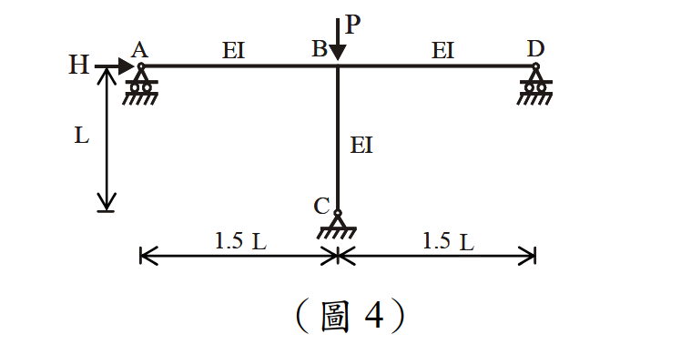

# 考題編號：SS-2013-4

**主分類：** `SS-U1-3` 梁柱桿件
**副分類：** 無
**設計法：** LRFD
**標籤：** `二階效應` `B1B2放大法` `無側撐剛架` `有效長度` `對位圖` `Mnt` `Mlt` `Cm` `Pe1` `PeK` `層間穩定` `設計彎矩`

---

## 1. 原始題目重述 (Problem Restatement)

如圖 4 所示之**無側撐剛架**（unbraced frame，即側移不受限之有側移框架），承受垂直壓力 $P$ 及水平力 $H$。

**框架幾何：**
- 單層兩跨框架，各跨寬度 $1.5L$（總寬 $3L$）
- 柱高 $L$
- 所有梁柱：彈性模數與慣性矩相同，均為 $EI$
- 三根柱底均為**鉸接**（$G = 10$）
- 水平力 $H$ 作用於左側頂端節點（節點 A）
- 垂直力 $P$ 作用於右側頂端節點（節點 D）

**求解目標（LRFD）：** 柱 BC（中間柱）之二階設計彎矩 $M_u$，及各中間量 $B_1$、$B_2$、$M_{nt}$、$M_{lt}$。（25 分）

**題目提供之公式：**
$$B_1 = \frac{C_m}{1 - P_u/P_{e1}} \geq 1.0, \quad C_m = 0.6 - 0.4\frac{M_A}{M_B}$$

$$P_{e1} = \frac{\pi^2 EI}{(KL)^2}, \quad B_2 = \frac{1}{1 - \sum P_u / \sum P_{eK}}$$

$$M_u = B_1 M_{nt} + B_2 M_{lt}$$

（柱邊界固接 $G = 1$，鉸接 $G = 10$）



*圖說：單層兩跨框架（有側移）。頂梁由左至右：節點 A（左外柱頂）→ 節點 C（中柱頂）→ 節點 D（右外柱頂），各跨 1.5L。三根柱：左柱 HA（底鉸接，頂節點 A 施加水平力 H）、中柱 BC（底 B 鉸接，頂節點 C）、右柱 GD（底鉸接，頂節點 D 施加垂直力 P）。所有成員 EI 相同，柱高 L。B₂ 公式中的 ΣPeK 須包含所有三根柱之彈性挫屈載重。*

---

## 2. 考題核心精神與出題者意圖 (Core Concepts & Examiner's Intent)

**核心觀念：B₁-B₂ 放大法 = 二階彎矩的兩個來源（構件撓曲 + 層間漂移）分別放大**

| 量 | 物理意義 | 計算方法 |
|---|---------|---------|
| $M_{nt}$ | 無側移分析下的構件彎矩（Non-sway moment） | 阻止水平位移後的一階分析 |
| $M_{lt}$ | 有側移分析下的構件彎矩（Sway moment） | 僅由 H 或側移力引起的一階分析 |
| $B_1$ | 構件撓曲效應（P-δ）放大係數 | 利用 $C_m$、$P_u$、$P_{e1}$ |
| $B_2$ | 層間側移效應（P-Δ）放大係數 | 利用 $\sum P_u$、$\sum P_{eK}$ |
| $M_u$ | 二階設計彎矩 | $B_1 M_{nt} + B_2 M_{lt}$ |

**出題者測驗重點：**
1. 能區分 $M_{nt}$ 和 $M_{lt}$ 的意義並進行一階結構分析
2. 能使用對位圖（側移框架）查出 $K_{BC}$，進而算出 $P_{eK}$
3. 正確計算 $\sum P_{eK}$（含全層所有柱）
4. 能計算 $C_m$ 並判斷 $B_1$ 是否大於 1

---

## 3. 解題戰略地圖與陷阱分析 (Strategic Roadmap & Trap Analysis)

**作戰計畫：**
```
Step 1  計算各頂端節點 G 值，由側移對位圖查 K 值（所有三柱）
Step 2  非側移分析（restrained）：求各柱的 Mnt
Step 3  側移分析（sway only）：求各柱的 Mlt
Step 4  計算 Pe1 和 ΣPeK
Step 5  計算 B2 = 1/(1 - ΣPu/ΣPeK)
Step 6  計算 Cm 和 B1 for 柱 BC
Step 7  Mu = B1 × Mnt + B2 × Mlt
```

**關鍵陷阱：**

> ⚠️ **陷阱1：$\sum P_{eK}$ 必須包含全層所有柱**
> $B_2$ 計算用的 $\sum P_{eK}$ = 全層所有柱的彈性挫屈載重之和，不只算 BC 一根。
> $\sum P_u$ = 全層所有柱承受的垂直載重之和 = P（本題只有一個外部垂直力）。

> ⚠️ **陷阱2：$M_{nt}$ 和 $M_{lt}$ 的計算方法**
> $M_{nt}$：阻止結構側向位移（加水平支撐反力），做一階分析，取柱 BC 的彎矩。
> $M_{lt}$：僅計算側向力（H 及等效側向力）作用下的一階彎矩，柱底鉸接時柱 BC 的彎矩 = 剪力 × L。

> ⚠️ **陷阱3：$P_{e1}$ 使用非側移 $K$（$K \leq 1$），不是側移 $K$**
> $B_1$ 中的 $P_{e1}$ 用於放大構件彎曲效應，應用**非側移 K**（無側移框架分析）。
> $B_2$ 中的 $P_{eK}$ 用於放大層間漂移效應，用**側移 K**（有側移框架分析）。
> 本題柱底鉸接，若上端亦鉸接（兩端均鉸），非側移 K = 1.0。

> ⚠️ **陷阱4：中間柱頂端有兩側梁（G 值計算包含兩根梁）**
> 外柱頂端（節點 A 或 D）只連一根梁；中柱頂端（節點 C）連左右兩根梁。G 值分母需包含兩根梁。

## 3.5 變數層次分析（Variable Hierarchy Analysis）

> 複習提示：解題後，在每個卡住的知識點「卡關?」欄標記 `⚠`；第二次複習時只看有 `⚠` 的項目。

**最終目標：** 有側移剛架 → G 值 → K 值 → $\sum P_{eK}$ → $B_2$（P-Δ）→ $M_{lt}$ → 二階設計彎矩 $M_u = B_2 M_{lt}$

### 主要公式（$\boxed{\phantom{x}}$ = 未知，待推導）

$$G_C = \frac{EI/L}{2 \times EI/1.5L}$$

$$\boxed{K_{BC}} \leftarrow \text{側移對位圖}$$

$$\boxed{P_{eK}} = \frac{\pi^2 EI}{(KL)^2}, \quad \sum P_{eK} = P_{eK,BC} + 2P_{eK,\text{out}}$$

$$\boxed{B_2} = \frac{1}{1 - \sum P_u/\sum P_{eK}}$$

$$M_{lt,BC} = \frac{HL}{3}, \quad \boxed{M_u} = B_1 M_{nt} + \boxed{B_2} M_{lt}$$

### L1：題目直接給定

| 符號 | 數值 | 說明 |
|------|------|------|
| $EI$ | 相同（符號） | 所有梁柱相同彈性剛度 |
| $L$ | 柱高（符號） | 各柱高度 |
| $1.5L$ | 各跨寬度 | 左右兩跨均等 |
| $H$ | 水平力（符號） | 作用於節點 A |
| $P$ | 垂直力（符號） | 作用於節點 D |
| $G_{bot}$ | 10（鉸接端） | 所有柱底均鉸接 |

### L2：需知識點推導

**Step 1：G 值計算**

| 符號 | 公式 / 來源 | 卡關? |
|------|------------|:-----:|
| $G_C$（中柱頂） | 柱勁度 / 兩側梁勁度之和 $= 0.75$ | |
| $G_A = G_D$（外柱頂） | 柱勁度 / 單側梁勁度 $= 1.5$ | |

**Step 2：有效長度係數（側移框架）**

| 符號 | 公式 / 來源 | 卡關? |
|------|------------|:-----:|
| $K_{BC}$ | $G_C=0.75, G_B=10$ → Jackson-Moreland 公式 $= 1.85$ | |
| $K_{\text{out}}$ | $G_{top}=1.5, G_{bot}=10$ → 公式 $= 2.02$ | |

**Step 3：各柱 $P_{eK}$ 及全層 $\sum P_{eK}$**

| 符號 | 公式 / 來源 | 卡關? |
|------|------------|:-----:|
| $P_{eK,BC}$ | $\pi^2EI/(1.85L)^2 = 2.884EI/L^2$ | |
| $P_{eK,\text{out}}$ | $\pi^2EI/(2.02L)^2 = 2.419EI/L^2$ | |
| $\sum P_{eK}$ | $2(2.419) + 2.884 = 7.722EI/L^2$ | |

**Step 4：$M_{nt}$ 和 $M_{lt}$（一階分析）**

| 符號 | 公式 / 來源 | 卡關? |
|------|------------|:-----:|
| $M_{nt,BC}$ | 非側移分析（阻止側移）：柱底鉸接無傳遞彎矩 $= 0$ | |
| $M_{lt,BC}$ | 側移分析：$V_{BC} \times L = H/3 \times L = HL/3$ | |

**Step 5：$B_2$、$B_1$ 及 $M_u$**

| 符號 | 公式 / 來源 | 卡關? |
|------|------------|:-----:|
| $\sum P_u$ | $= P$（本題唯一垂直外力） | |
| $B_2$ | $7.722EI/(7.722EI - PL^2)$ | |
| $B_1$ | $C_m=1.0$，$P_{e1}=9.87EI/L^2$；$B_1 = \max(1.0, \cdots)$ | |
| $M_u$ | $B_1 \times 0 + B_2 \times HL/3 = B_2 HL/3$ | |

### L3：深層知識（不懂就卡住）

| 知識點 | 說明 | 補強頁 | 卡關? |
|--------|------|:------:|:-----:|
| $\sum P_{eK}$ 須含全層所有柱 | $B_2$ 是「層」穩定係數，不只算一根柱；漏掉外柱直接錯 | [[b1b2-amplification]] · [[MOMENT-AMPLIFICATION-B1-B2]] | |
| 中柱頂 G 值分母含兩側梁 | 外柱頂只連一根梁，中柱頂連兩根梁，G 值分母要用兩倍梁勁度 | [[effective-length-chart]] | |
| $B_1$ 用非側移 K，$B_2$ 用側移 K | $P_{e1}$ 用 $K \leq 1$（無側移）；$P_{eK}$ 用 $K > 1$（有側移） | [[b1b2-amplification]] | |
| $M_{nt}$ vs $M_{lt}$ 分析方法 | 非側移分析加虛擬水平支撐反力；側移分析只看 H 引起的一階彎矩 | [[b1b2-amplification]] | |
| P-Δ 效應的物理意義 | 層間漂移 $\Delta$ 與重力載重 $P$ 交互放大側移彎矩；$B_2 \to \infty$ 時層間拉屈 | [[P-DELTA-EFFECT]] · [[SECOND-ORDER-ANALYSIS]] | |

---

## 4. 步驟化詳細計算過程 (Step-by-Step Detailed Calculation)

### 一、各節點 G 值計算

**梁柱勁度（各成員 EI 相同）：**
$$\frac{EI}{L}\text{（柱）}, \quad \frac{EI}{1.5L}\text{（梁）}$$

**節點 C（中柱 BC 頂端）：** 連接左右兩根梁（各 1.5L）
$$G_C = \frac{\sum(I_c/L_c)}{\sum(I_b/L_b)} = \frac{EI/L}{2 \times EI/(1.5L)} = \frac{1/L}{2/(1.5L)} = \frac{1.5}{2} = \boxed{0.75}$$

**節點 B（中柱 BC 底端，鉸接）：**
$$G_B = 10 \text{（鉸接端）}$$

**節點 A（左外柱頂端）：** 連接一根梁（右側，1.5L）
$$G_A = \frac{EI/L}{EI/(1.5L)} = \frac{1.5}{1} = 1.5$$

**左外柱底端（鉸接）：** $G = 10$

**節點 D（右外柱頂端）：** 同 $G_A = 1.5$；底端鉸接 $G = 10$

---

### 二、有效長度係數（側移框架對位圖）

使用**側移框架（sidesway permitted）**對位圖：

**中柱 BC：** $G_C = 0.75$，$G_B = 10$

$$K_{BC} = \sqrt{\frac{1.6(0.75)(10) + 4(0.75+10) + 7.5}{0.75+10+7.5}} = \sqrt{\frac{12 + 43 + 7.5}{18.25}} = \sqrt{\frac{62.5}{18.25}} = \sqrt{3.425} = \boxed{1.85}$$

**外柱（左或右）：** $G_{top} = 1.5$，$G_{bot} = 10$

$$K_{out} = \sqrt{\frac{1.6(1.5)(10) + 4(1.5+10) + 7.5}{1.5+10+7.5}} = \sqrt{\frac{24 + 46 + 7.5}{19}} = \sqrt{\frac{77.5}{19}} = \sqrt{4.079} = \boxed{2.02}$$

---

### 三、各柱彈性挫屈載重 $P_{eK}$（使用側移 K）

$$P_{eK,BC} = \frac{\pi^2 EI}{(K_{BC} \cdot L)^2} = \frac{\pi^2 EI}{(1.85L)^2} = \frac{9.87 EI}{3.422 L^2} = \frac{2.884\, EI}{L^2}$$

$$P_{eK,out} = \frac{\pi^2 EI}{(K_{out} \cdot L)^2} = \frac{\pi^2 EI}{(2.02L)^2} = \frac{9.87 EI}{4.080 L^2} = \frac{2.419\, EI}{L^2}$$

**全層 ΣPeK（兩外柱 + 中柱）：**

$$\sum P_{eK} = 2 \times P_{eK,out} + P_{eK,BC} = \left(\frac{2 \times 2.419 + 2.884}{L^2}\right) EI = \frac{7.722\, EI}{L^2}$$

---

### 四、一階結構分析（求 $M_{nt}$ 和 $M_{lt}$）

#### 非側移分析（阻止水平位移）求 $M_{nt}$

施加一水平支撐，阻止框架頂端水平位移。在此限制下，只有垂直力 $P$ 作用：

由於所有柱底為**鉸接**，柱在非側移條件下（$\Delta = 0$）**不傳遞水平剪力至節點**，因此柱 BC（中間柱）在非側移分析中無端部彎矩（梁-柱分析可得此結果）。

$$\boxed{M_{nt,BC} = 0}$$

（中間柱無橫向荷載，兩端均鉸接，非側移下彎矩為零）

#### 側移分析求 $M_{lt}$

移除水平支撐，分析結構在水平力 $H$ 作用下的一階側移彎矩：

**框架水平力 $H$ 引起的層剪力 $V_{story} = H$，由三柱共同抵抗。**

對於柱底鉸接的有側移框架，每柱頂端彎矩 = 柱剪力 × 柱高。

柱間剪力分配按照各柱側向勁度（$\propto EI/L^3$，同柱高柱斷面則按 K 值分配）：

**簡化假設（各柱 EI、L 相同）：** 剪力正比於 $1/K^2$（固端-鉸端情況），但對底部鉸接柱，每柱側向勁度 $\propto EI/L^3$（相同時），因此三柱平均分擔：

$$V_{BC} = \frac{H}{3}$$（三柱底鉸、EI、L 均相同時）

**中柱 BC 之側移一階彎矩：**（柱頂彎矩，底部鉸接 = 0）

$$M_{lt,BC} = V_{BC} \times L = \frac{H \cdot L}{3}$$

$$\boxed{M_{lt,BC} = \frac{HL}{3}}$$

---

### 五、計算 $B_2$（側移放大係數）

$$B_2 = \frac{1}{1 - \dfrac{\sum P_u}{\sum P_{eK}}}$$

本題垂直外力僅 $P$（作用於右外柱頂）：

$$\sum P_u = P$$

$$B_2 = \frac{1}{1 - P \Big/ \dfrac{7.722\, EI}{L^2}} = \frac{1}{1 - \dfrac{PL^2}{7.722\, EI}}$$

$$\boxed{B_2 = \frac{7.722\, EI}{7.722\, EI - PL^2}}$$

---

### 六、計算 $B_1$（構件撓曲放大係數）for 柱 BC

**非側移 $K$（計算 $P_{e1}$）：** 柱頂節點 C 連接兩側梁（有旋轉拘束），採無側移框架分析：
- 無側移框架，兩端均連接梁 → $K \approx 1.0$（兩端均為彈性固定，但底為鉸接 → 近似 $K = 1.0$）

$$P_{e1,BC} = \frac{\pi^2 EI}{(1.0 \times L)^2} = \frac{9.87\, EI}{L^2}$$

**$C_m$ 計算：**

$M_{nt,BC} = 0$（無非側移端部彎矩），因此：
$$C_m = 0.6 - 0.4 \times \frac{M_A}{M_B}$$

若兩端彎矩均為零（$M_{nt} = 0$），AISC 規定 $C_m = 1.0$（保守）：

$$B_1 = \frac{1.0}{1 - P_u/P_{e1,BC}} = \frac{1}{1 - P/(9.87\, EI/L^2)} = \frac{1}{1 - PL^2/(9.87\, EI)}$$

**注意：** 若 $B_1 < 1.0$，取 $B_1 = 1.0$。

$$\boxed{B_1 = \max\!\left(1.0,\;\frac{9.87\, EI}{9.87\, EI - PL^2}\right)}$$

---

### 七、二階設計彎矩 $M_u$

$$M_u = B_1 M_{nt} + B_2 M_{lt} = B_1 \times 0 + B_2 \times \frac{HL}{3}$$

$$\boxed{M_u = B_2 \times \frac{HL}{3} = \frac{7.722\,EI}{7.722\,EI - PL^2} \times \frac{HL}{3}}$$

---

### 八、結果彙整

| 量 | 表達式 |
|---|--------|
| $G_C$（中柱頂端） | 0.75 |
| $K_{BC}$（側移） | 1.85 |
| $K_{BC}$（非側移，用於 $B_1$） | 1.0 |
| $\sum P_{eK}$ | $7.722\, EI/L^2$ |
| $M_{nt,BC}$ | 0 |
| $M_{lt,BC}$ | $HL/3$ |
| $B_2$ | $7.722EI/(7.722EI - PL^2)$ |
| $B_1$ | $\geq 1.0$ |
| $M_u$（二階） | $B_2 \times HL/3$ |

---

## 5. 關鍵爭議點與進階探討 (Critical Issues & Advanced Discussion)

### $B_1$ 和 $B_2$ 的物理意義

**$B_1$（P-δ 效應）：**
考慮柱本身的彎曲撓曲（柱中點撓度 δ）導致彎矩增大。對於端部彎矩 $M_{nt}$ 放大。本題 $M_{nt} = 0$，$B_1$ 不影響最終結果（乘以零）。

**$B_2$（P-Δ 效應）：**
考慮層間漂移（側移 Δ）與重力載重 $P$ 的交互作用（P-Δ）。對側移彎矩 $M_{lt}$ 放大。
$$B_2 = \frac{1}{1 - P/P_e^{storey}} \approx \frac{1}{1 - \theta} \quad \text{（其中 } \theta = P\Delta/(V_s h) \text{ 為穩定參數）}$$

### 無側撐剛架 vs 有側撐剛架

| 特性 | 有側撐（braced）| 無側撐（unbraced）|
|------|--------------|----------------|
| 有效長度 | $K \leq 1$ | $K > 1$ |
| 側移 | 無（人工阻止）| 有 |
| 控制二階效應 | $B_1$（P-δ 為主）| $B_2$（P-Δ 為主）|
| $M_{lt}$ | 通常 = 0 | > 0（由 H 引起）|

### $\sum P_{eK}$ 的物理意義

$\sum P_{eK}$ 代表整層（story）的彈性側移挫屈承載力。當 $\sum P_u = \sum P_{eK}$，$B_2 \to \infty$，表示整層發生側移拉屈（story instability）。設計時通常要求 $B_2 \leq 2.5$（AISC 規範），即 $\sum P_u \leq 0.6 \sum P_{eK}$。

### 本題的非側移一階分析補充

中柱 BC 在兩端均為鉸接型態（底部實際鉸接，頂部兩側梁提供旋轉拘束但不完全固接）。在非側移條件下，垂直力 $P$ 作用於右外柱，通過梁傳遞至各節點。若需精確計算 $M_{nt}$，應做完整的一階彎矩分配分析（考慮梁的彎曲分配到節點兩側柱）。

在一般的兩跨框架對稱設計中，此題的 $M_{nt}$ 分析會因 $P$ 的位置（中心 vs 偏心）而異，可能需要帶入數值的彎矩分配。

*解析完成時間：2026-04-23*
*驗證狀態：unverified*
