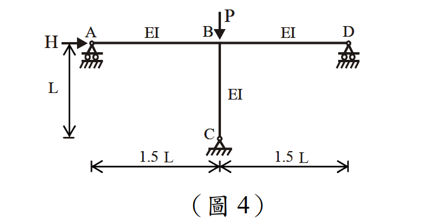

# 考題編號：SS-2013-4

**主分類：** `SS-U1-3` 梁柱桿件
**副分類：** 無
**設計法：** LRFD
**標籤：** `二階效應` `B1B2放大法` `無側撐剛架` `有效長度係數` `對位圖` `Mnt` `Mlt` `層間穩定` `設計彎矩` `滾支承` `符號解`

---

## 1. 原始題目重述 (Problem Restatement)

> **原卷逐字**：「如圖 4 所示一**無側撐剛架**，承受垂直軸壓力 P 及水平力 H。試使用 LRFD 求解**柱 BC** 之二階設計彎矩（Second-order design moment）$M_u$ 及 $B_1$、$B_2$、$M_{nt}$、$M_{lt}$。（求解柱 BC 之有效長度係數時，請參考題二之 Alignment Chart。）（25 分）（柱邊界為固接（Fixed end）時 G 使用 1、為鉸接（hinged end）時 G 使用 10。）」



*圖說（依原卷圖 4 目視判讀）：**上方**為連續水平梁 **A—B—D**，$AB = BD = 1.5L$（全長 $3L$），各段 $EI$ 相同。**A 端與 D 端均為滾支承**（三角形＋滾輪＋斜線地面符號）——只提供**垂直**支承，水平方向**可自由平移**。**B 點**為梁與柱之剛性交會點。自 B 往**下**接一根長度 $L$、剛度 $EI$ 之柱 **BC**，柱底 **C 為鉸支承**（三角形＋斜線地面，無滾輪）——同時束制水平與垂直。**水平力 $H$ 作用於 A 點**（向右），**垂直軸壓力 $P$ 作用於 B 點**（向下，即柱頂）。*

**⚠️ 幾何判讀重點（本題最易誤讀之處）：**

| 項目 | 正確判讀 | 常見誤讀 |
|------|---------|---------|
| 柱數 | **僅 1 根**（柱 BC） | 誤為「單層兩跨、三根柱」 |
| A、D 之角色 | 梁兩端之**滾支承**（在地面／支座上） | 誤為兩根外柱的柱頂節點 |
| 水平束制來源 | **只有 C 點的鉸支承**（故可側移＝無側撐剛架） | — |
| $P$ 之作用位置 | **B 點**（柱頂，與柱同軸） | 誤為作用於 D 點 |
| $H$ 之作用位置 | A 點（經梁傳至 B，再下傳至 C） | — |

**為何是「無側撐剛架」：** A、D 為滾支承，水平方向不提供束制；整個梁可水平平移，唯一抵抗側移者為柱 BC 之撓曲。故側移**未受束制**（sidesway uninhibited），符合原卷「無側撐剛架」之描述，$K > 1$。

**題目提供之公式（原卷圖 4 下方）：**
$$B_1 = \frac{C_m}{1 - P_u/P_{eK}} \geq 1.0, \quad C_m = 0.6 - 0.4\frac{M_A}{M_B}$$
$$P_{eK} = \frac{\pi^2 EI}{(KL)^2} = \frac{P_e}{K^2}, \quad B_2 = \frac{1}{1 - \sum P_u/\sum P_{eK}}$$
$$M_u = B_1 M_{nt} + B_2 M_{lt}$$

**題目提供之 K 值表（原卷題三下方，本題可參照）：**

| 條件 | 邊界無側位移 | | | 邊界有側位移* | | |
|------|:---:|:---:|:---:|:---:|:---:|:---:|
| 端點型式 | 固接-固接 | 鉸接-固接 | 鉸接-鉸接 | 固接*-固接 | 固接*-鉸接 | 自由端*-固接 |
| 理論 K | 0.5 | 0.7 | 1.0 | 1.0 | 2.0 | 2.0 |
| 設計 K | 0.65 | 0.8 | 1.0 | 1.2 | 2.0 | 2.1 |

> 本題採 **Alignment Chart（有側移）** 求 $K$，K 值表僅作對照參考。

**本題為符號解**：$P$、$H$、$L$、$EI$ 均為符號，答案應以符號表示。

---

## 2. 考題核心精神與出題者意圖 (Core Concepts & Examiner's Intent)

**核心觀念：$B_1$-$B_2$ 放大法 —— 二階彎矩的兩個來源分別放大後再相加**

| 量 | 物理意義 | 求法 | 本題結果 |
|---|---------|------|---------|
| $M_{nt}$ | **no translation**：側移被束制後的一階彎矩 | 加虛擬水平支撐，只施加重力載重，作一階分析 | **0** |
| $M_{lt}$ | **lateral translation**：僅側移（水平力）造成的一階彎矩 | 只施加水平力，作一階分析 | **$HL$** |
| $B_1$ | 構材撓曲 P-δ 放大係數（作用於 $M_{nt}$） | $C_m/(1-P_u/P_{eK})$，$P_{eK}$ 用**無側移 K** | 1.0（$M_{nt}=0$，不影響結果） |
| $B_2$ | 層間側移 P-Δ 放大係數（作用於 $M_{lt}$） | $1/(1-\sum P_u/\sum P_{eK})$，$P_{eK}$ 用**有側移 K** | $\dfrac{1}{1 - PL^2/(2.88EI)}$ |
| $M_u$ | 二階設計彎矩 | $B_1M_{nt} + B_2M_{lt}$ | $B_2 \cdot HL$ |

**出題者測驗重點：**
1. 能正確判讀支承型式（滾支承 vs 鉸支承）並判定「可側移」
2. 能分離 $M_{nt}$ 與 $M_{lt}$（本題 $M_{nt}=0$ 是關鍵發現）
3. 能用有側移對位圖查 $K$（$G$ 值分母含**兩側**梁）
4. 知道 $\sum P_{eK}$ 只計「抵抗側移之柱」，本題僅 1 根

---

## 3. 解題戰略地圖與陷阱分析 (Strategic Roadmap & Trap Analysis)

**作戰計畫：**
```
Step 1  判讀支承：A、D 滾支承（水平自由）、C 鉸支承（水平束制）→ 可側移，僅 1 根柱
Step 2  G 值：柱頂 B 之分母含左右兩段梁；柱底 C 為鉸接 → G = 10
Step 3  有側移對位圖 → K_BC
Step 4  Mnt：束制側移後，P 沿柱軸直下 + 幾何對稱 → Mnt = 0
Step 5  Mlt：對 C 取矩，H 作用於 L 高處 → Mlt = H·L
Step 6  ΣPeK = π²EI/(K L)²（只有 BC 一根）；ΣPu = P
Step 7  B2 = 1/(1 − ΣPu/ΣPeK)；Mu = B1·0 + B2·HL = B2·HL
```

**關鍵陷阱：**

> ⚠️ **陷阱1：把 A、D 誤認為柱頂節點（本題最致命）**
> A、D 是**梁端的滾支承**，不是柱。全結構**只有一根柱（BC）**。若誤為三根柱，$\sum P_{eK}$ 會膨脹成約 2.7 倍、$M_{lt}$ 會被錯誤地分成 $H/3 \times L$，兩處錯誤同時發生。

> ⚠️ **陷阱2：$M_{lt}$ 不是 $HL/3$，而是 $HL$**
> 只有柱 BC 抵抗側移（A、D 為滾支承，水平反力為零），故層剪力**全部**由 BC 承擔：$V_{BC} = H$，$M_{lt} = H \times L$。

> ⚠️ **陷阱3：$M_{nt} = 0$，但仍須說明理由**
> $P$ 直接作用於柱頂 B、與柱同軸，且梁兩側跨度相同（$1.5L = 1.5L$）。束制側移後，梁在 B 點的變形對稱 → $\theta_B = 0$ → 左右梁端彎矩等值反向、於節點相消 → 不傳遞彎矩給柱 → $M_{nt} = 0$。

> ⚠️ **陷阱4：$P_{e1}$（$B_1$ 用）與 $P_{eK}$（$B_2$ 用）的 K 不同**
> $B_1$ 之 $P_{e1}$ 用**無側移** K（規範明定 $K \leq 1.0$）；$B_2$ 之 $P_{eK}$ 用**有側移** K（規範 4.8 節，$K \geq 1.0$）。混用會嚴重高估或低估。

> ⚠️ **陷阱5：$C_m$ 在 $M_{nt} = 0$ 時是 $0/0$**
> $M_A/M_B = 0/0$ 無定義。但 $B_1 M_{nt} = B_1 \times 0 = 0$，$B_1$ 之數值不影響 $M_u$；依規範下限取 $B_1 = 1.0$ 即可，**不可編造「規範規定 $C_m = 1.0$」**。

## 3.5 變數層次分析（Variable Hierarchy Analysis）

> 複習提示：解題後，在每個卡住的知識點「卡關?」欄標記 `⚠`；第二次複習時只看有 `⚠` 的項目。

**最終目標：** 判讀支承 → $G$ → 有側移 $K$ → $\sum P_{eK}$ → $B_2$；一階分析得 $M_{nt}=0$、$M_{lt}=HL$ → $M_u = B_2 HL$

### 主要公式（$\boxed{\phantom{x}}$ = 未知，待推導）

$$\boxed{G_B} = \frac{\sum (I_c/L_c)}{\sum (I_g/L_g)} = \frac{EI/L}{2 \times EI/(1.5L)}, \qquad G_C = 10\ (\text{鉸接})$$

$$\boxed{K_{BC}} \leftarrow \text{有側移對位圖（Alignment Chart, sidesway uninhibited）}$$

$$\boxed{\sum P_{eK}} = \frac{\pi^2 EI}{(\boxed{K_{BC}}\,L)^2} \quad (\textbf{僅 BC 一根}), \qquad \sum P_u = P$$

$$\boxed{M_{nt}} = 0, \qquad \boxed{M_{lt}} = H \cdot L$$

$$\boxed{B_2} = \frac{1}{1 - \sum P_u/\boxed{\sum P_{eK}}}, \qquad \boxed{M_u} = B_1 \boxed{M_{nt}} + \boxed{B_2}\,\boxed{M_{lt}}$$

### L1：題目直接給定

| 符號 | 數值 | 說明 |
|------|------|------|
| $EI$ | 符號（梁、柱相同） | 原卷圖上梁、柱均標 $EI$ |
| $L$ | 符號 | 柱 BC 之長度 |
| $1.5L$ | 各梁段長 | $AB = BD = 1.5L$ |
| $H$ | 符號 | 水平力，作用於 **A 點** |
| $P$ | 符號 | 垂直軸壓力，作用於 **B 點**（柱頂） |
| A、D 支承 | **滾支承** | 僅垂直束制，水平可自由平移 |
| C 支承 | **鉸支承** | 水平＋垂直束制，不傳彎矩 |
| $G$ 約定 | 固接 = 1、鉸接 = 10 | 原卷明文 |
| 公式 | $B_1$、$C_m$、$P_{eK}$、$B_2$、$M_u$ | 原卷圖 4 下方提供 |

### L2：需知識點推導

**Step 1：$G$ 值**

| 符號 | 公式 / 來源 | 卡關? |
|------|------------|:-----:|
| 柱勁度 | $I_c/L_c = I/L$ | |
| 梁勁度（兩段） | $\sum I_g/L_g = 2 \times I/(1.5L) = 1.333\,I/L$ | |
| $G_B$（柱頂） | $(I/L)/(1.333\,I/L) = \mathbf{0.75}$ | |
| $G_C$（柱底，鉸接） | $\mathbf{10}$（原卷約定） | |

**Step 2：有側移 $K$**

| 符號 | 公式 / 來源 | 卡關? |
|------|------------|:-----:|
| 對位圖方程式 | $\dfrac{G_BG_C(\pi/K)^2 - 36}{6(G_B+G_C)} = \dfrac{\pi/K}{\tan(\pi/K)}$ | |
| 近似式（Jackson–Moreland） | $K = \sqrt{\dfrac{1.6G_BG_C + 4(G_B+G_C) + 7.5}{G_B+G_C+7.5}}$ | |
| $K_{BC}$ | 近似式 $= 1.851$；精解 $= 1.847$ → 取 **$K \approx 1.85$** | |

**Step 3：$\sum P_{eK}$ 與 $\sum P_u$**

| 符號 | 公式 / 來源 | 卡關? |
|------|------------|:-----:|
| $P_{eK,BC}$ | $\pi^2EI/(1.85L)^2 = \mathbf{2.88\,EI/L^2}$ | |
| $\sum P_{eK}$ | $= P_{eK,BC} = 2.88\,EI/L^2$（**只有一根柱**）⚠ 常見卡關 | |
| $\sum P_u$ | $= P$（全層唯一垂直載重） | |

**Step 4：一階彎矩 $M_{nt}$、$M_{lt}$**

| 符號 | 公式 / 來源 | 卡關? |
|------|------------|:-----:|
| $M_{nt}$ | 束制側移＋$P$ 與柱同軸＋跨度對稱 → $\theta_B = 0$ → $\mathbf{0}$ | |
| $M_{lt}$ | 柱 FBD 對 C 取矩：$H \cdot L$ → $\mathbf{HL}$（C 端為 0） | |

**Step 5：$B_1$、$B_2$、$M_u$**

| 符號 | 公式 / 來源 | 卡關? |
|------|------------|:-----:|
| $P_{e1}$（無側移，$K = 1$） | $\pi^2EI/L^2 = 9.87\,EI/L^2$ | |
| $B_1$ | $M_{nt}=0 \Rightarrow$ 乘積為零；取規範下限 $\mathbf{1.0}$ | |
| $B_2$ | $\dfrac{1}{1 - PL^2/(2.88EI)} = \dfrac{2.88EI}{2.88EI - PL^2}$ | |
| $M_u$ | $1.0 \times 0 + B_2 \times HL = \mathbf{B_2\,HL}$ | |

### L3：深層知識（不懂就卡住）

| 知識點 | 說明 | 補強頁 | 卡關? |
|--------|------|:------:|:-----:|
| 滾支承 vs 鉸支承的判讀 | 三角形**加滾輪**＝僅垂直束制（水平自由）；三角形**無滾輪**＝鉸接（水平＋垂直束制）。此一符號差別決定本題「可側移」與「只有一根柱抵抗側移」 | | |
| $\sum P_{eK}$ 只計抵抗側移之柱 | $B_2$ 是「層」的穩定係數；分母為該層**提供側向勁度**之柱的 $P_{eK}$ 總和。滾支承不是柱，不計入 | [[b1b2-amplification]] · [[MOMENT-AMPLIFICATION-B1-B2]] | |
| $\sum P_u$ 含靠桿（leaning column） | $\sum P_u$ 為該層**全部**垂直載重（含不抵抗側移者）；本題 $P$ 全在 BC 上，無靠桿 | [[b1b2-amplification]] | |
| $B_1$ 用無側移 K、$B_2$ 用有側移 K | 規範：$P_{e1}$ 之 $K \leq 1.0$（P-δ 屬構材內效應）；$P_{e2}$ 之 $K$ 依 4.8 節且 $\geq 1.0$（P-Δ 屬層效應）。混用即重複計入側移 | [[b1b2-amplification]] | |
| 對位圖 $G$ 的分母 | 為節點上**所有**梁的 $I/L$ 之和；柱頂 B 連左右兩段，故分母是單段的兩倍，$G$ 減半 | [[effective-length-chart]] | |
| 對位圖對梁遠端條件的假設 | 有側移對位圖內設「梁遠端反對稱轉動」（梁勁度 $6EI/L_g$）。本題梁遠端為滾支承（轉動自由，實際勁度 $3EI/L_g$），嚴格應將 $I_g/L_g$ 乘 0.5，見 §5 | [[effective-length-chart]] | |
| P-Δ 與 P-δ 的分工 | P-Δ：層間漂移 × 重力 → 放大 $M_{lt}$；P-δ：構材撓曲 × 軸力 → 放大 $M_{nt}$ | [[P-DELTA-EFFECT]] · [[SECOND-ORDER-ANALYSIS]] | |

---

## 4. 步驟化詳細計算過程 (Step-by-Step Detailed Calculation)

### 一、支承判讀與結構行為

由圖 4 目視判讀：

- **A、D**：三角形＋**滾輪**＋斜線地面 → **滾支承**，$R_x = 0$、$R_y \neq 0$、$M = 0$
- **C**：三角形＋斜線地面（無滾輪）→ **鉸支承**，$R_x \neq 0$、$R_y \neq 0$、$M = 0$
- **B**：梁與柱之剛性交會（剛架節點）

**水平力平衡（整體）：**
$$\sum F_x = 0:\quad H + R_{x,A} + R_{x,D} + R_{x,C} = 0 \ \xrightarrow{\ R_{x,A}=R_{x,D}=0\ }\ R_{x,C} = -H$$

→ 水平力**全部**經梁傳至 B、再沿柱 BC 下傳至 C。柱 BC 是**唯一**的抗側力構材，故本剛架**側移未受束制**（無側撐剛架），$K > 1$。

---

### 二、$G$ 值計算

各構材 $EI$ 相同，取 $I_c = I_g = I$：

$$\text{柱勁度} = \frac{I_c}{L_c} = \frac{I}{L}, \qquad \text{梁勁度（兩段之和）} = \frac{I}{1.5L} + \frac{I}{1.5L} = \frac{2I}{1.5L} = \frac{4I}{3L}$$

**柱頂 B：**
$$G_B = \frac{\sum(I_c/L_c)}{\sum(I_g/L_g)} = \frac{I/L}{4I/(3L)} = \frac{3}{4} = \boxed{0.75}$$

**柱底 C（鉸接）：** 依原卷約定
$$G_C = \boxed{10}$$

---

### 三、有側移有效長度係數 $K_{BC}$

**方法一：Jackson–Moreland 近似式（AISC 解說所列，適用有側移）**

$$K = \sqrt{\frac{1.6\,G_BG_C + 4(G_B+G_C) + 7.5}{G_B + G_C + 7.5}}$$

$$= \sqrt{\frac{1.6(0.75)(10) + 4(0.75+10) + 7.5}{0.75+10+7.5}} = \sqrt{\frac{12 + 43 + 7.5}{18.25}} = \sqrt{\frac{62.5}{18.25}} = \sqrt{3.4247} = 1.851$$

**方法二：對位圖之精確超越方程式（交叉驗算）**

$$\frac{G_BG_C(\pi/K)^2 - 36}{6(G_B+G_C)} = \frac{\pi/K}{\tan(\pi/K)}$$

數值解得 $\pi/K = 1.7005$ → $K = 1.8474$。

$$\boxed{K_{BC} \approx 1.85}\qquad(\text{近似式 } 1.851 \text{ vs 精解 } 1.847，\text{差 } 0.17\% \ \checkmark)$$

> ✅ **方程式自我驗證**：以 $G_B = G_C = 0$（兩端完全固接、可側移）代入精確式，得 $K = 1.00$ —— 與 K 值表「固接*-固接：理論 K = 1.0」吻合，證明所用方程式正確。

---

### 四、各柱之 $P_{eK}$ 與全層 $\sum P_{eK}$

$$P_{eK,BC} = \frac{\pi^2 EI}{(K_{BC}L)^2} = \frac{\pi^2 EI}{(1.851L)^2} = \frac{9.8696\,EI}{3.4247\,L^2} = \frac{2.882\,EI}{L^2}$$

**全層總和 —— 本結構只有一根柱：**

$$\boxed{\sum P_{eK} = P_{eK,BC} = \frac{2.88\,EI}{L^2}}$$

> ⚠️ A、D 是**支承**而非柱，不提供側向勁度，也沒有 $P_{eK}$ 可加。

**全層垂直載重：**
$$\sum P_u = P$$

---

### 五、一階分析（求 $M_{nt}$ 與 $M_{lt}$）

#### 5.1 無側移分析 → $M_{nt}$

在 B 點加一虛擬水平支撐（阻止側移），只施加重力載重 $P$：

- $P$ 直接作用於節點 B，**與柱 BC 同軸**，本身不對柱產生偏心彎矩。
- 梁 A—B—D 在 B 點兩側跨度**相同**（$1.5L = 1.5L$）、$EI$ 相同 → 對 B 點幾何**對稱**。
- 垂直力作用於對稱點時，變形形狀對稱於 B，故 $\theta_B = 0$；左右兩段梁在 B 端的彎矩**等值反向**，於節點處相互抵銷。

$$\Rightarrow \text{節點 B 不傳遞彎矩給柱} \quad \Rightarrow \quad \boxed{M_{nt} = 0}$$

（柱底 C 為鉸接本已無彎矩；柱身無橫向載重。）

#### 5.2 側移分析 → $M_{lt}$

移除虛擬支撐，只施加水平力 $H$。取**柱 BC 之自由體**，對 C 點取矩：

$$\sum M_C = 0:\quad M_{B} = H \times L$$

（作用於 B 點的水平力等於 $H$，力臂為柱高 $L$；柱底 C 為鉸接，彎矩為 0。）

$$\boxed{M_{lt} = H\,L \quad (\text{柱頂 B}),\qquad M_{lt,C} = 0}$$

> **對照**：若誤判為三根柱平均分擔，會得 $M_{lt} = HL/3$，**低估 3 倍**。

---

### 六、$B_2$（側移放大係數）

$$B_2 = \frac{1}{1 - \dfrac{\sum P_u}{\sum P_{eK}}} = \frac{1}{1 - \dfrac{P}{2.88\,EI/L^2}} = \frac{1}{1 - \dfrac{P L^2}{2.88\,EI}}$$

$$\boxed{B_2 = \frac{2.88\,EI}{2.88\,EI - P L^2}}$$

**適用範圍檢核：** 須 $\sum P_u < \sum P_{eK}$，即 $P < 2.88\,EI/L^2$；否則該層已達側移挫屈（$B_2 \to \infty$）。實務並要求 $B_2 \leq 1.5\sim2.5$。

---

### 七、$B_1$（構材撓曲放大係數）

**$P_{e1}$（用無側移 $K$）：** 規範明定 $B_1$ 之 $P_{e1}$ 取彎曲平面上 $K \leq 1.0$：

$$P_{e1} = \frac{\pi^2 EI}{(1.0\,L)^2} = \frac{9.87\,EI}{L^2}$$

**$C_m$：** $M_{nt} = 0$（兩端皆為 0），故 $M_A/M_B = 0/0$ **無定義**，$C_m$ 不可計算。

但因

$$B_1 M_{nt} = B_1 \times 0 = 0 \quad(\text{對任意 } B_1)$$

$B_1$ 的數值**不影響** $M_u$。依規範下限：

$$\boxed{B_1 = 1.0}$$

> ⚠️ 不要寫「$M_{nt}=0$ 時規範規定 $C_m = 1.0$」——規範並無此條文。正確說法是「$M_{nt}=0$ 使 $B_1M_{nt}=0$，$B_1$ 取下限 1.0」。

---

### 八、二階設計彎矩 $M_u$

$$M_u = B_1 M_{nt} + B_2 M_{lt} = 1.0 \times 0 + B_2 \times HL$$

$$\boxed{M_u = B_2\,HL = \frac{2.88\,EI}{2.88\,EI - PL^2}\,HL = \frac{HL}{1 - \dfrac{PL^2}{2.88\,EI}}}$$

**極限行為檢查（量綱與趨勢）：**

| 情況 | $M_u$ | 是否合理 |
|------|------|:---:|
| $P \to 0$ | $\to HL$（純一階） | ✓ |
| $P \to 2.88EI/L^2$ | $\to \infty$（層間側移挫屈） | ✓ |
| $P = 0.5 \times 2.88EI/L^2$ | $B_2 = 2.0$，$M_u = 2HL$ | ✓ |

量綱：$EI$ 為 $[\text{力}\cdot\text{長}^2]$，$PL^2$ 為 $[\text{力}\cdot\text{長}^2]$ → $B_2$ 無因次 ✓；$M_u \sim HL$ 為 $[\text{力}\cdot\text{長}]$ ✓。

---

### 九、結果彙整

| 量 | 表達式／數值 |
|---|--------|
| $G_B$（柱頂，含兩側梁） | 0.75 |
| $G_C$（柱底，鉸接） | 10 |
| $K_{BC}$（有側移） | **1.85**（近似 1.851／精解 1.847） |
| $\sum P_{eK}$（**僅 1 根柱**） | $2.88\,EI/L^2$ |
| $\sum P_u$ | $P$ |
| $P_{e1}$（無側移，$K=1$） | $9.87\,EI/L^2$ |
| $M_{nt}$ | **0** |
| $M_{lt}$ | **$HL$** |
| $B_1$ | **1.0**（$M_{nt}=0$，數值不影響 $M_u$） |
| $B_2$ | $\dfrac{2.88EI}{2.88EI - PL^2}$ |
| **$M_u$（二階設計彎矩）** | $\boxed{\dfrac{2.88EI}{2.88EI - PL^2}\,HL}$ |

---

## 5. 關鍵爭議點與進階探討 (Critical Issues & Advanced Discussion)

### 爭議一：對位圖是否應對「梁遠端鉸接」作 0.5 折減？

有側移對位圖的推導**內設**梁兩端作反對稱轉動，對應梁的轉動勁度 $6EI/L_g$。本題梁的遠端（A、D）是**滾支承**（轉動自由），實際勁度只有 $3EI/L_g$，僅為對位圖假設的一半。AISC 解說對此提供修正：**有側移時，遠端鉸接之梁其 $I_g/L_g$ 應乘 0.5**。

| | 未修正（原卷應期望之解法） | 乘 0.5 修正（理論較嚴謹） |
|---|:---:|:---:|
| $\sum I_g/L_g$ | $2I/(1.5L) = 1.333\,I/L$ | $0.5 \times 1.333 = 0.667\,I/L$ |
| $G_B$ | **0.75** | 1.50 |
| $K$（近似／精解） | **1.851 / 1.847** | 2.020 / 2.008 |
| $\sum P_{eK}$ | **$2.88\,EI/L^2$** | $2.42\,EI/L^2$ |
| $B_2$ | $\dfrac{2.88EI}{2.88EI-PL^2}$ | $\dfrac{2.42EI}{2.42EI-PL^2}$ |

**取捨：** 原卷只給了「固接 $G=1$、鉸接 $G=10$」這一項約定，未提及梁端折減，且要求「參考題二之 Alignment Chart」，故**主答採未修正之 $G_B = 0.75$、$K = 1.85$**。若答題時間充裕，可加註「梁遠端為滾支承，嚴格應乘 0.5 折減，得 $K = 2.02$、$\sum P_{eK} = 2.42EI/L^2$，$B_2$ 更大、設計更保守」——屬加分，不是替代。

### 爭議二：本結構的「層」只有一根柱，$B_2$ 還適用嗎？

$B_2$ 的推導基礎是「該層的側移勁度」與「該層的重力載重」之比，與柱數無關。單柱情況下 $B_2$ 退化為單一構材的側移放大係數，仍然成立。事實上本題可直接驗證：

$$B_2 = \frac{1}{1 - P/P_{cr,sway}}, \qquad P_{cr,sway} = \frac{\pi^2 EI}{(K L)^2} = \frac{2.88EI}{L^2}$$

—— 即「側移挫屈載重」的定義，物理意義完全一致。

### 爭議三：$P$ 究竟全部落在柱 BC 上嗎？

$P$ 作用於節點 B。B 點的支撐路徑有兩條：柱 BC 的**軸向**勁度 $EA/L$，與梁兩側的**撓曲**勁度（$\sim 3EI/(1.5L)^3$ 每側）。對常見鋼構斷面，$EA/L \gg EI/L^3$（相差約 $(L/r)^2$ 倍，通常 $10^3$ 以上），故 $P$ 幾乎全數由柱承擔：

$$P_{u,BC} \approx P, \qquad \sum P_u = P$$

即使少量由梁分擔，$\sum P_u$（該層全部垂直載重）仍為 $P$，$B_2$ 不受影響。

### $B_1$ 與 $B_2$ 的物理意義對照

| | $B_1$（P-δ） | $B_2$（P-Δ） |
|---|---|---|
| 變形量 | 構材自身撓曲 $\delta$（相對於兩端連線） | 層間相對側移 $\Delta$ |
| 放大對象 | $M_{nt}$ | $M_{lt}$ |
| $K$ | 無側移，$K \leq 1.0$ | 有側移，$K \geq 1.0$ |
| 分母 | $1 - P_u/P_{e1}$（單一構材） | $1 - \sum P_u/\sum P_{eK}$（整層） |
| 本題 | 不起作用（$M_{nt}=0$） | **控制全部答案** |

**本題是「純 P-Δ 題」**：所有二階效應都來自層間側移，構材內的 P-δ 完全不參與。這正是出題者要考的分工。

### 無側撐剛架 vs 有側撐剛架

| 特性 | 有側撐（braced） | 無側撐（unbraced，本題） |
|------|--------------|----------------|
| 側向束制來源 | 斜撐／剪力牆／核心 | 剛架本身的撓曲 |
| $K$ | $\leq 1.0$ | $> 1.0$ |
| $M_{lt}$ | 通常 = 0 | $> 0$（本題 $= HL$） |
| 二階效應主體 | $B_1$（P-δ） | $B_2$（P-Δ） |

---

## 6. 依最新規範（AISC 360-16／-22）對照

> **主答依據**：內政部「鋼構造建築物鋼結構設計技術規範」**極限設計法（民國 99 年／2010 修正版）** 第 8.2 節（$M_u = B_1M_{nt} + B_2M_{lt}$，式 8.2-2～8.2-5），與原卷提供之公式一致。以 AISC 360-16 為基礎之修訂版**尚未發布**，故僅列為對照。

### 6.1 $B_1$-$B_2$ 放大法在 AISC 360 中被「降級」

這是本題在新舊規範間最大的差異：

| 規範 | 穩定設計的主方法 | $B_1$-$B_2$ 的地位 |
|------|------|------|
| 台灣 2010／AISC LRFD 1993／AISC 360-05 | **有效長度法（ELM）**＋$B_1$-$B_2$ 放大 | 規範本體（第 8.2 節 / Ch. C） |
| **AISC 360-10／-16／-22** | **直接分析法（DAM，Chapter C）** | 移入 **Appendix 8「二階分析之近似解」**，僅作為 ELM／一階分析法的配套工具 |

AISC 360-16 的預設流程是：以**二階分析**（或 App. 8 的 $B_1$-$B_2$ 近似）求 $M_r$，同時計入初始不完美（$N_i = 0.002\alpha Y_i$）與勁度折減（$0.8\tau_b EI$、$0.8EA$），並取 **$K = 1.0$**——**完全不需要查對位圖**。

### 6.2 若本題改依 AISC 360-16 Appendix 8

Appendix 8 的公式與台灣 2010 幾乎相同，但有三處差異：

| 項目 | 台灣 2010（第 8.2 節） | AISC 360-16 App. 8 |
|------|------|------|
| 二階彎矩 | $M_u = B_1M_{nt} + B_2M_{lt}$ | $M_r = B_1M_{nt} + B_2M_{lt}$（式 A-8-1，形式相同） |
| $B_1$ 之 $C_m$ | 規範 (8.2-3) 之 Taiwan 專用式（含 0.64／0.32） | $C_m = 0.6 - 0.4(M_1/M_2)$（式 A-8-4） |
| $P_{e1}$ | $A_gF_y/\lambda_c^2$，$K \leq 1.0$ | $\pi^2EI^*/(L_{c1})^2$，$L_{c1}$ 取無側移長度（通常 $= L$） |
| $B_2$ 分母 | $1 - \sum P_u/\sum P_{e2}$ | $1 - \alpha\sum P_r/\sum P_{e\,story}$（**多了 $\alpha$**：LRFD 1.0、ASD 1.6） |
| $\sum P_{e,story}$ | $\sum \pi^2EI/(K_2L)^2$（需查對位圖） | $R_M \dfrac{\sum H L}{\Delta_H}$（**用一階側移直接算，不需 K**）；$R_M = 1 - 0.15(P_{mf}/P_{story})$ |
| 勁度 | 彈性 $EI$ | 折減 $EI^* = 0.8\tau_b EI$ |

**用 AISC 360-16 的側移法重算本題（示範差異）：**

一階側移分析（只有柱 BC，柱底鉸接，柱頂由梁提供轉動束制）。由 §5 爭議一的勁度模型（梁遠端鉸接，$k_\theta = 4EI/L$）作斜率-偏移法：

$$\theta_B = \frac{3}{7}\psi,\qquad M_{BC} = \frac{3EI}{L}(\theta_B - \psi) = -\frac{12EI}{7L}\psi,\qquad H = \frac{|M_{BC}|}{L} = \frac{12EI}{7L^2}\psi$$

$$\Rightarrow \Delta_H = \psi L = \frac{7HL^3}{12EI}$$

$$\sum P_{e,story} = R_M\frac{\sum H \cdot L}{\Delta_H} = R_M \cdot \frac{HL}{7HL^3/(12EI)} = R_M\cdot\frac{12EI}{7L^2} = 1.714\,R_M\frac{EI}{L^2}$$

本題全部垂直載重都在抗彎構架的柱上（$P_{mf} = P_{story}$）→ $R_M = 1 - 0.15 = 0.85$：

$$\sum P_{e,story} = 0.85 \times 1.714\frac{EI}{L^2} = 1.457\frac{EI}{L^2}$$

$$B_2^{AISC} = \frac{1}{1 - \dfrac{1.0 \times P}{1.457EI/L^2}} = \frac{1}{1 - \dfrac{PL^2}{1.457EI}}\quad(\text{LRFD, }\alpha=1.0)$$

對照台灣 2010 之 $B_2 = 1/(1 - PL^2/2.88EI)$：AISC 的分母門檻由 $2.88EI/L^2$ 降到 $1.457EI/L^2$，**放大量明顯較大（較保守）**。差異來源：① $R_M$ 折減 0.85；② 側移法用的是「梁遠端鉸接」之真實勁度（相當於 §5 爭議一的修正情形，且不受對位圖 $6EI/L_g$ 假設拖累）；③ 若再計入 $0.8\tau_b$ 勁度折減，$\sum P_{e,story}$ 還會再降 20%。

> 這也**印證了 §5 爭議一**：對位圖未修正的 $K = 1.85$ 確實偏樂觀；AISC 的側移法（不查 K）自然地反映了滾支承梁端的真實柔度。

### 6.3 對照結論

| 項目 | 台灣 2010（主答） | AISC 360-16／-22 | 差異 |
|------|------|------|:---:|
| 主方法 | ELM ＋ $B_1$-$B_2$ | DAM（$K=1$、$N_i$、$0.8\tau_bEI$） | 觀念大改 |
| $M_{nt}$ | **0** | 同 | 無 |
| $M_{lt}$ | **$HL$** | 同（一階靜力，與規範無關） | 無 |
| $B_1$ | 1.0（$M_{nt}=0$） | 同 | 無 |
| $\sum P_{eK}$ | $2.88EI/L^2$（查對位圖） | $1.46EI/L^2$（$R_M\sum HL/\Delta_H$） | **−49%** |
| $B_2$ | $\dfrac{2.88EI}{2.88EI-PL^2}$ | $\dfrac{1.457EI}{1.457EI-PL^2}$ | AISC 較保守 |
| $M_u$ | $B_2 HL$ | $B_2^{AISC}HL$（較大） | 形式同、數值較大 |

**作答建議：** 原卷已印出 $B_1$、$C_m$、$P_{eK}$、$B_2$、$M_u$ 的舊式公式並要求查對位圖，故**主答必須用台灣 2010／ELM 體系**。可在末尾以三、五行補述「AISC 360-10 起已把 $B_1$-$B_2$ 移入附錄 8，主方法改為直接分析法，$K$ 一律取 1.0，$\sum P_{e,story}$ 改由一階側移 $\Delta_H$ 直接推算」，屬加分。

---

*解析完成時間：2026-04-23*
*修正日期：2026-08-22（**重大勘誤：原解析對圖 4 的幾何判讀完全錯誤**——原文寫成「單層兩跨、三根柱、柱底均鉸接、P 作用於節點 D」，實際上 A、D 是**梁兩端的滾支承**、全結構**只有一根柱 BC**、**P 作用於柱頂 B**。連帶更正：$M_{lt}$ 由 $HL/3$ 改為 **$HL$**（層剪力全由 BC 承擔）、$\sum P_{eK}$ 由 $7.722EI/L^2$（三柱）改為 **$2.88EI/L^2$**（單柱）、$B_2$ 與 $M_u$ 隨之改寫。另刪除「$M_{nt}=0$ 時 AISC 規定 $C_m=1.0$」之虛構條文；新增對位圖精確超越方程式之交叉驗算（1.847 vs 近似 1.851）與 $G_B=G_C=0 \Rightarrow K=1$ 之自我驗證、$M_{nt}=0$ 的對稱性證明、梁遠端鉸接之 0.5 折減討論、$P$ 分配之勁度比討論、§6 最新規範對照（含 AISC 360-16 App. 8 之 $R_M\sum HL/\Delta_H$ 側移法重算）*
*驗證狀態：unverified*
