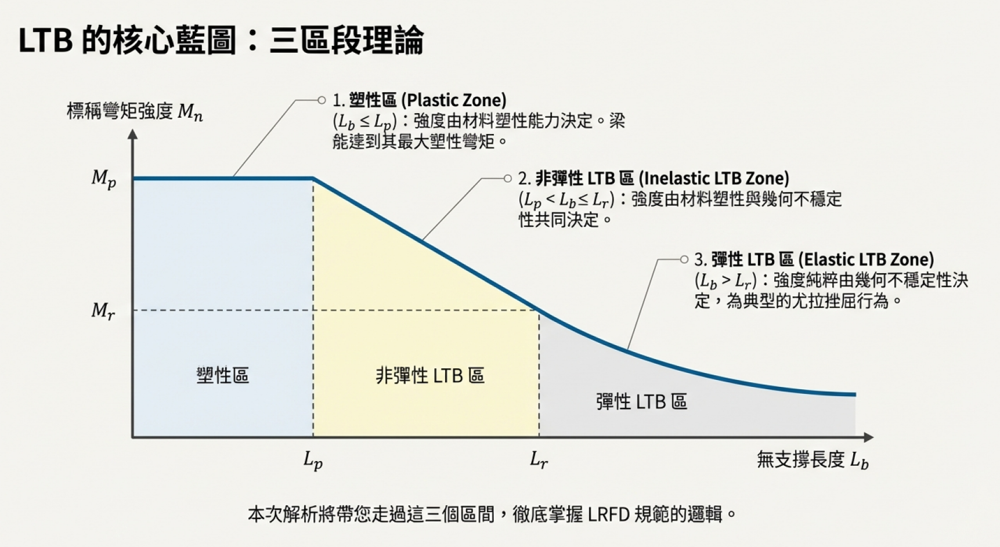
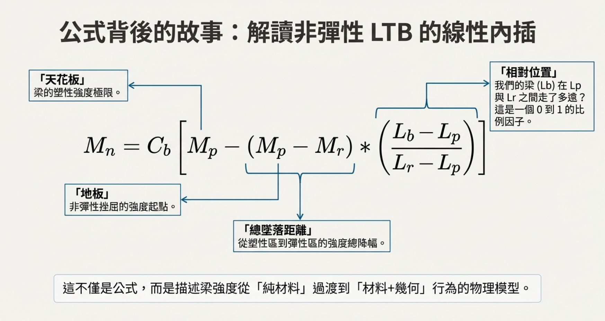

# 考題編號：SS-2014-3

**主分類：** `4.1.2` 梁桿件
**副分類：** 無
**設計法：** LRFD
**標籤：** `梁桿件` `LTB側扭挫屈` `雙向彎曲` `非彈性LTB` `Cb係數` `弱軸彎曲` `雙向彎曲互制` `結實斷面` `使用性撓度`

---

## 1. 原始題目重述 (Problem Restatement)

有一 ASTM A572 Gr.50 之 **W21×93 簡支鋼梁**，梁長 **4 m**，在梁兩端（一端鉸接支承、另一端滾支承）均有側向支撐，梁全長承受均佈載重造成的雙向彎矩：

- $M_{ux} = 400 \text{ kN-m}$（強軸，已含載重係數）
- $M_{uy} = 50 \text{ kN-m}$（弱軸，已含載重係數）

兩彎矩均作用在梁之剪力中心，利用 LRFD 檢核此梁是否滿足設計要求。（25分）

**給定資料：**

| 項目 | 數值 |
|------|------|
| 鋼材 | $F_y = 350$ MPa，$F_r = 78$ MPa |
| $S_x$ | $3{,}146{,}316 \text{ mm}^3$ |
| $S_y$ | $362{,}154 \text{ mm}^3$ |
| $Z_x$ | $3{,}621{,}541 \text{ mm}^3$ |
| $Z_y$ | $568{,}631 \text{ mm}^3$ |
| $d$ | $548.6 \text{ mm}$ |
| $b_f$ | $214 \text{ mm}$ |
| $t_f$ | $23.6 \text{ mm}$ |
| $t_w$ | $14.7 \text{ mm}$ |
| $\lambda_p$（翼板） | $9.19$ |
| $\lambda_r$（翼板） | $22.3$ |
| $L_p$ | $2 \text{ m}$ |
| $L_r$ | $5.8 \text{ m}$ |

公式：$C_b = \dfrac{12.5 M_{max}}{2.5M_{max} + 3M_A + 4M_B + 3M_C}$

---

## 2. 考題核心精神與出題者意圖 (Core Concepts & Examiner's Intent)

**核心觀念：**
- **雙向彎曲（Biaxial Bending）**：強弱軸各有不同的強度計算邏輯，最終用互制公式疊加
- **非彈性 LTB（側扭挫屈）**：$L_p < L_b < L_r$ 時，強度介於 $M_p$ 與 $M_r$ 之間，Cb 可提升

**出題意圖：**
1. 測試 LTB 三段式（塑性、非彈性、彈性）的判斷與計算
2. 測試弱軸彎矩強度的特殊限制（$M_{ny} \leq 1.5 F_y S_y$）
3. 測試雙向彎矩互制公式的正確應用

**陷阱：**
- ⚠️ 弱軸強度上限：$Z_y/S_y = 1.57 > 1.5$，必須用 $1.5F_yS_y$ 而非 $F_yZ_y$
- ⚠️ Cb 的計算：均布載重下矩形面積→拋物線，$C_b = 1.136$（非 1.0）
- ⚠️ 無側向中間支撐：$L_b$ = 全梁長 = 4 m（不是一半）

---

## 3. 解題戰略地圖與陷阱分析 (Strategic Roadmap & Trap Analysis)

**作戰計畫：**
```
Step 1：局部挫屈確認（翼板、腹板寬厚比 → 確認結實斷面）
Step 2：強軸 φbMnx 計算
  ├─ 確定 Lb = 4 m，落在 Lp < Lb < Lr（非彈性 LTB）
  ├─ 計算 Cb（均布荷載下，拋物線彎矩圖）
  ├─ Mn = Cb[Mp - (Mp-Mr)(Lb-Lp)/(Lr-Lp)] ≤ Mp
  └─ φbMnx = 0.9 × Mn
Step 3：弱軸 φbMny 計算（注意上限！）
  ├─ Mny = min(FyZy, 1.5FySy)
  └─ 比較 Zy/Sy 是否 > 1.5
Step 4：雙向彎矩互制公式
  └─ Mux/φbMnx + Muy/φbMny ≤ 1.0
```

## 3.5 變數層次分析（Variable Hierarchy Analysis）

> 複習提示：解題後，在每個卡住的知識點「卡關?」欄標記 `⚠`；第二次複習時只看有 `⚠` 的項目。

**最終目標：** W21×93 雙向彎曲梁 → 強軸 LTB（非彈性，含 $C_b$）→ 弱軸強度（含上限）→ 互制公式 $\leq 1.0$

### 主要公式（$\boxed{\phantom{x}}$ = 未知，待推導）

$$C_b = \frac{12.5M_{\max}}{2.5M_{\max} + 3M_A + 4M_B + 3M_C}$$

$$\boxed{M_{nx}} = C_b\left[M_p - (M_p - M_r)\frac{L_b - L_p}{L_r - L_p}\right] \leq M_p \quad (L_p < L_b < L_r)$$

$$\boxed{M_{ny}} = \min(F_y Z_y,\; 1.5 F_y S_y)$$

$$\frac{M_{ux}}{\phi_b M_{nx}} + \frac{M_{uy}}{\phi_b M_{ny}} \leq 1.0$$

### L1：題目直接給定

| 符號 | 數值 | 說明 |
|------|------|------|
| $F_y$ | 350 MPa | 鋼材降伏強度 |
| $F_r$ | 78 MPa | 殘留應力 |
| $S_x$ | 3,146,316 mm³ | 強軸斷面模數 |
| $S_y$ | 362,154 mm³ | 弱軸斷面模數 |
| $Z_x$ | 3,621,541 mm³ | 強軸塑性斷面模數 |
| $Z_y$ | 568,631 mm³ | 弱軸塑性斷面模數 |
| $L_p$ | 2 m | 塑性區界限長度 |
| $L_r$ | 5.8 m | 彈性 LTB 界限長度 |
| $\lambda_p$（翼板） | 9.19 | 結實斷面上限 |
| $M_{ux}$ | 400 kN-m | 強軸設計彎矩（已含載重係數）|
| $M_{uy}$ | 50 kN-m | 弱軸設計彎矩（已含載重係數）|
| $L_b$ | 4 m（全梁，兩端支承）| 側向無支撐長度 |

### L2：需知識點推導

**Step 1：斷面結實性確認**

| 符號 | 公式 / 來源 | 卡關? |
|------|------------|:-----:|
| $\lambda_{翼板}$ | $b_f/(2t_f) = 214/(2 \times 23.6) = 4.53 < \lambda_p = 9.19$ ✓ | |
| $h/t_w$ | $(d - 2t_f)/t_w = 501.4/14.7 = 34.1 < 89.8$ ✓ | |

**Step 2：強軸 $\phi_b M_{nx}$（非彈性 LTB）**

| 符號 | 公式 / 來源 | 卡關? |
|------|------------|:-----:|
| LTB 區段判斷 | $L_p = 2 < L_b = 4 < L_r = 5.8$ → 非彈性 LTB | |
| $C_b$ | 均布載重，拋物線彎矩圖：$M_A = M_C = 3/4 M_{\max}$，$M_B = M_{\max}$；$C_b = 1.136$ | |
| $M_p$ | $F_y Z_x = 350 \times 3{,}621{,}541 = 1267.5$ kN-m | |
| $M_r$ | $(F_y - F_r)S_x = 272 \times 3{,}146{,}316 = 855.8$ kN-m | |
| $M_{nx}$ | $1.136[1267.5 - 411.7 \times 2/3.8] = 1193.7$ kN-m $< M_p$ ✓ | |
| $\phi_b M_{nx}$ | $0.9 \times 1193.7 = 1074.3$ kN-m | |

**Step 3：弱軸 $\phi_b M_{ny}$（含上限）**

| 符號 | 公式 / 來源 | 卡關? |
|------|------------|:-----:|
| $Z_y/S_y$ | $568631/362154 = 1.57 > 1.5$ → 上限控制 | |
| $M_{ny}$ | $\min(F_yZ_y,\;1.5F_yS_y) = 1.5 \times 350 \times 362154 = 190.1$ kN-m | |
| $\phi_b M_{ny}$ | $0.9 \times 190.1 = 171.1$ kN-m | |

**Step 4：雙向彎矩互制公式**

| 符號 | 公式 / 來源 | 卡關? |
|------|------------|:-----:|
| 互制比 | $400/1074.3 + 50/171.1 = 0.372 + 0.292 = 0.664 \leq 1.0$ ✓ | |

### L3：深層知識（不懂就卡住）

| 知識點 | 說明 | 補強頁 | 卡關? |
|--------|------|:------:|:-----:|
| LTB 三段判斷 | 先比較 $L_b$ 與 $L_p$、$L_r$；本題落非彈性段，$C_b$ 可提升強度但不超過 $M_p$ | [[ltb-3zone]] · [[LATERAL-TORSIONAL-BUCKLING]] | |
| $C_b$ 的計算 | 均布載重下彎矩圖為拋物線，四分點彎矩 $= 3/4 M_{\max}$；$C_b = 1.136 \neq 1.0$ | [[cb-factor]] · [[BENDING-MODIFICATION-FACTOR-CB]] | |
| 弱軸強度上限 $1.5 F_y S_y$ | I 型斷面弱軸 $Z_y/S_y$ 常 > 1.5；直接用 $F_y Z_y$ 會高估強度（考試陷阱） | | |
| $M_r = (F_y - F_r)S_x$ | $F_r$ 為殘留應力（題目給定 78 MPa）；忘記減 $F_r$ 會高估 $M_r$，低估 LTB 削減量 | [[RESIDUAL-STRESS]] | |
| 雙向彎矩互制公式選擇 | 無軸力時用 H1-2 線性公式，而非 H1-1a/H1-1b | [[pm-interaction]] | |

---

## 4. 步驟化詳細計算過程 (Step-by-Step Detailed Calculation)

### Step 1：局部挫屈檢核

**翼板寬厚比：**

$$\lambda = \frac{b_f}{2t_f} = \frac{214}{2 \times 23.6} = \frac{214}{47.2} = 4.53$$

題目給定：$\lambda_p = 9.19$，$\lambda_r = 22.3$

$$\lambda = 4.53 < \lambda_p = 9.19 \quad \Rightarrow \quad \textbf{結實斷面（翼板）✓}$$

**腹板寬厚比：**

$$h = d - 2t_f = 548.6 - 2(23.6) = 501.4 \text{ mm}$$

$$\frac{h}{t_w} = \frac{501.4}{14.7} = 34.1$$

$$\lambda_{p,\text{web}} = 3.76\sqrt{\frac{E}{F_y}} = 3.76\sqrt{\frac{200{,}000}{350}} = 3.76 \times 23.9 = 89.8$$

$$34.1 < 89.8 \quad \Rightarrow \quad \textbf{結實斷面（腹板）✓}$$

> 斷面為結實斷面（Compact Section），可達全塑性彎矩 $M_p$。

---

### Step 2：強軸彎矩強度 $\phi_b M_{nx}$



*圖說：LTB 核心藍圖——三區段理論。橫軸為無支撐長度 $L_b$，縱軸為標稱彎矩強度 $M_n$。① 塑性區（$L_b \leq L_p$）：強度由材料塑性能力決定，梁能達全塑性彎矩 $M_p$。② 非彈性 LTB 區（$L_p < L_b \leq L_r$）：強度由材料塑性與幾何不穩定性共同決定，曲線線性下降（含 $C_b$ 修正）。③ 彈性 LTB 區（$L_b > L_r$）：強度純粹由幾何不穩定性決定，為典型的尤拉挫屈行為（$M_n = M_{cr}$）。本題 $L_b = 4$ m 落於第②區（非彈性 LTB）。*

#### 2a. 確定 LTB 範圍

無側向中間支撐，兩端支承處有側向支撐：

$$L_b = 4 \text{ m}$$

比較：$L_p = 2 \text{ m} < L_b = 4 \text{ m} < L_r = 5.8 \text{ m}$

$$\Rightarrow \textbf{非彈性 LTB 控制}$$

#### 2b. 計算 $C_b$（均布載重，拋物線彎矩圖）

均布載重下，彎矩圖為拋物線，$L_b = 4$ m（全梁），$M_{max} = M_{ux} = 400$ kN-m：

| 位置 | 相對位置 | 彎矩 |
|------|---------|------|
| $M_A$（$L/4$處） | $x = 1$ m | $M_A = \frac{3}{4}M_{max} = 300$ kN-m |
| $M_B$（$L/2$處） | $x = 2$ m | $M_B = M_{max} = 400$ kN-m |
| $M_C$（$3L/4$處） | $x = 3$ m | $M_C = \frac{3}{4}M_{max} = 300$ kN-m |

*策略註解：均布載重下 $M(x) = 4M_{max} \cdot x(L-x)/L^2$，在四分點 $M = 3/4 \cdot M_{max}$*

$$C_b = \frac{12.5 \times 400}{2.5(400) + 3(300) + 4(400) + 3(300)} = \frac{5000}{1000 + 900 + 1600 + 900} = \frac{5000}{4400} = \boxed{1.136}$$

#### 2c. 計算 $M_p$ 與 $M_r$

$$M_p = F_y Z_x = 350 \times 3{,}621{,}541 = 1{,}267{,}539{,}350 \text{ N-mm} = \boxed{1267.5 \text{ kN-m}}$$

$$M_r = (F_y - F_r) S_x = (350 - 78) \times 3{,}146{,}316 = 272 \times 3{,}146{,}316 = 855{,}798{,}000 \text{ N-mm} = \boxed{855.8 \text{ kN-m}}$$

*策略註解：$F_r = 78$ MPa 為殘留應力，題目已給定，不可忘記*

#### 2d. 非彈性 LTB 標稱強度



*圖說：非彈性 LTB 線性內插公式的物理意義拆解。$M_n = C_b \left[ M_p - (M_p - M_r) \cdot \dfrac{L_b - L_p}{L_r - L_p} \right] \leq M_p$。各項含義：「天花板」= $M_p$，梁的塑性強度極限；「地板」= $M_r$，非彈性挫屈的強度起點；「總墜距離」= $M_p - M_r$，從塑性區到彈性區的強度縮幅；「相對位置」= $(L_b - L_p)/(L_r - L_p)$，梁的 $L_b$ 在 $L_p$ 與 $L_r$ 之間走了多遠的比例（0 到 1）。此公式本質是描述梁強度從「純材料」過渡到「材料＋幾何」行為的線性內插模型。$C_b$ 乘入後需以 $M_p$ 為上限截斷。*

$$M_n = C_b \left[ M_p - (M_p - M_r)\frac{L_b - L_p}{L_r - L_p} \right] \leq M_p$$

$$M_n = 1.136 \times \left[ 1267.5 - (1267.5 - 855.8) \times \frac{4 - 2}{5.8 - 2} \right]$$

$$= 1.136 \times \left[ 1267.5 - 411.7 \times \frac{2}{3.8} \right]$$

$$= 1.136 \times \left[ 1267.5 - 216.7 \right]$$

$$= 1.136 \times 1050.8 = 1193.7 \text{ kN-m}$$

**上限檢核：** $M_n = 1193.7 < M_p = 1267.5$ kN-m ✓（無需截斷）

$$\boxed{\phi_b M_{nx} = 0.9 \times 1193.7 = \textbf{1074.3 kN-m}}$$

---

### Step 3：弱軸彎矩強度 $\phi_b M_{ny}$

弱軸彎曲：I 型斷面弱軸無 LTB，僅考量斷面強度。

$$M_{p,y} = F_y Z_y = 350 \times 568{,}631 = 199{,}021{,}000 \text{ N-mm} = 199.0 \text{ kN-m}$$

> ⚠️ **陷阱：弱軸強度上限**
>
> AISC-LRFD 規範對雙對稱 I 型斷面弱軸彎曲，設有上限：
> $$M_{ny} \leq 1.5 \times F_y \times S_y$$

**驗算形狀因數：**

$$\frac{Z_y}{S_y} = \frac{568{,}631}{362{,}154} = 1.570 > 1.5$$

由於 $Z_y > 1.5 S_y$，以上限值控制：

$$M_{ny} = 1.5 F_y S_y = 1.5 \times 350 \times 362{,}154 = 190{,}131{,}000 \text{ N-mm} = 190.1 \text{ kN-m}$$

$$\boxed{\phi_b M_{ny} = 0.9 \times 190.1 = \textbf{171.1 kN-m}}$$

*策略註解：$Z_y/S_y = 1.57 > 1.5$，這是 W 型寬翼鋼梁的常見情況，考試重要陷阱！*

---

### Step 4：雙向彎矩互制公式檢核

AISC-LRFD 規範對無軸力梁的雙向彎曲互制公式（H1-2）：

$$\frac{M_{ux}}{\phi_b M_{nx}} + \frac{M_{uy}}{\phi_b M_{ny}} \leq 1.0$$

代入數值：

$$\frac{400}{1074.3} + \frac{50}{171.1} = 0.372 + 0.292 = \boxed{0.664}$$

$$0.664 \leq 1.0 \quad \Rightarrow \quad \textbf{✅ 梁滿足設計要求}$$

---

### 補充：剪力強度確認

> 📝 **考場策略說明：** 本題未提供剪力強度公式，且核心考點明確落在 LTB、弱軸上限與雙向互制。對 W 型鋼受均布載重而言，**彎矩幾乎必然先於剪力達到極限**，剪力公式省略有其出題邏輯。
>
> **考場建議作法：** 在總結處補一句「W 型斷面腹板充足，剪力強度安全無虞，省略詳細計算」，即可向閱卷委員展示你知道這個極限狀態的存在，同時不浪費時間。

若需完整驗算（參考用），由彎矩反推均布載重：

$$w_u = \frac{8 M_{ux}}{L^2} = \frac{8 \times 400}{4^2} = 200 \text{ kN/m}$$

$$V_u = \frac{w_u L}{2} = \frac{200 \times 4}{2} = 400 \text{ kN}$$

腹板寬厚比 $h/t_w = 34.1 < 2.46\sqrt{E/F_y} = 58.7$，屬非細長腹板，適用最基本的降伏公式：

$$V_n = 0.6 F_y A_w = 0.6 \times 350 \times (548.6 \times 14.7) = 1{,}693 \text{ kN}$$

$$\phi_v V_n = 0.9 \times 1{,}693 = 1{,}524 \text{ kN} \gg V_u = 400 \text{ kN} \quad \textbf{✓ 剪力利用率僅 26\%，無虞}$$

---


### 總結

| 檢核項目 | 需求 | 強度 | 利用率 | 結果 |
|---------|------|------|-------|------|
| 斷面結實性 | 翼板 λ=4.53 | λp=9.19 | — | ✅ |
| 強軸 LTB | Mux=400 kN-m | φbMnx=1074.3 kN-m | 37.2% | ✅ |
| 弱軸強度 | Muy=50 kN-m | φbMny=171.1 kN-m | 29.2% | ✅ |
| 雙向互制 | 0.664 | ≤ 1.0 | **66.4%** | ✅ |
| 剪力 | Vu=400 kN | φvVn=1524 kN | 26.2% | ✅ |

$$\boxed{\text{W21×93 梁滿足 LRFD 設計要求，互制比 = 0.664}}$$

---

## 5. 關鍵爭議點與進階探討 (Critical Issues & Advanced Discussion)

**①「均佈的雙向彎矩」的解讀：**
題目說「梁全長承受均佈的雙向彎矩」，應解讀為均佈載重造成的最大彎矩（Mux=400 kN-m，Muy=50 kN-m），而非常數彎矩（constant moment）。簡支梁在簡支條件下不可能有常數彎矩（需要端力矩）。均布載重產生拋物線彎矩圖，$C_b = 1.136$。

若誤解為常數彎矩（$C_b = 1.0$）：
$M_n = 1.0 \times [1267.5 - 411.7 \times 2/3.8] = 1050.8$ kN-m
$\phi_b M_{nx} = 0.9 \times 1050.8 = 945.7$ kN-m（偏保守）
互制比 = 400/945.7 + 50/171.1 = 0.423 + 0.292 = 0.715 < 1.0（仍通過）

**②弱軸 $1.5F_y S_y$ 上限的規範依據與物理原因：**

規範出處：台灣《鋼結構設計規範─極限設計法》**第 6.6 節「對弱軸彎曲之 I 型斷面與槽型斷面」**（對應 AISC Chapter F, Section F6）。

物理原因：I 型斷面繞弱軸彎曲時，兩片翼板幾乎承擔全部力矩。翼板的行為近似「兩塊獨立矩形板」，其形狀因數恰好為 1.5。若允許強度發展到 $F_y Z_y$，工作載重下翼板外緣將產生大範圍深度降伏，造成不可恢復的永久變形，故規範以 $1.5 F_y S_y$ 設定上限。

**考場提醒：** 即使題目未給此公式，$M_{ny} \leq 1.5 F_y S_y$ 屬於必須內化的規範常識——題目同時給出 $Z_y$ 和 $S_y$ 本身就是陷阱信號。$Z_y/S_y = 1.57 > 1.5$ 時若直接用 $F_y Z_y$，會高估弱軸強度，屬扣分項。（新版 AISC 360-10 起上限放寬為 $1.6 F_y S_y$，本題依 2014 年考試時點採 $1.5$）

**③若 Lb > Lr（彈性 LTB）時的計算變化：**
若 $L_b > L_r = 5.8$ m，則：$M_n = C_b \frac{\pi}{L_b}\sqrt{GJ \cdot EI_y + (E\pi/L_b)^2 I_y C_w} \leq M_p$
此時 $C_b$ 的效益更顯著，但需輸入 $GJ$ 和 $C_w$（題目未給），彈性 LTB 通常不是此題考點。

**④實務上的側向支撐設計建議：**
本題梁因 $L_b = 4$ m = $2L_p$，LTB 已削減強度。若在梁中點加設側向支撐，則 $L_b$ 減半為 2 m = $L_p$，可達全塑性強度 $\phi_b M_p = 0.9 \times 1267.5 = 1140.8$ kN-m，設計利用率可由 37% 提升至梁的最大強度。

---
