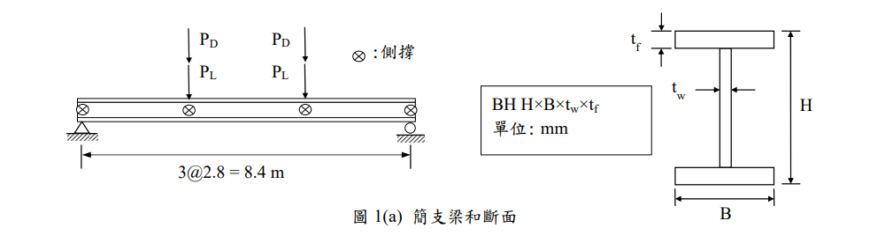
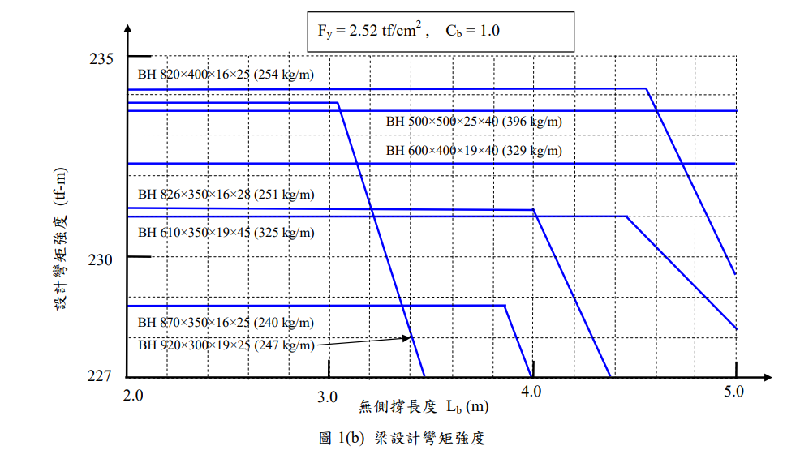
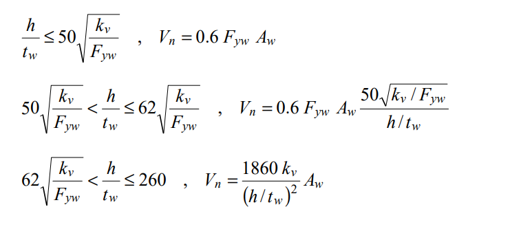

# 考題編號：SS-2015-1

**主分類：** `4.1.2` 梁桿件
**副分類：** 無
**設計法：** LRFD
**標籤：** `LTB側扭挫屈` `斷面選擇` `剪力強度` `使用性撓度` `圖表判讀` `Lp判斷` `三分點集中力`

---

## 1. 原始題目重述 (Problem Restatement)

**結構描述：**
- 跨距 $L = 8.4$ m 之簡支承鋼梁
- 三分點各承受集中力：靜載重 $P_D = 22$ tf，活載重 $P_L = 35$ tf（兩點對稱）
- 側向支撐位置：支承點 + 兩載重點（A、B、C、D 四點）→ $L_b = 2.8$ m
- 材料：A709-36 級，$F_y = 2.52$ tf/cm²，$E_s = 2040$ tf/cm²
- 設計圖表：題目提供圖 1(b)（$C_b = 1.0$ 條件下，各斷面設計彎矩強度 vs $L_b$）



*圖說：簡支梁總長 8.4 m，兩個集中載重分別作用於 x = 2.8 m 和 x = 5.6 m（三分點）。A、B、C、D 四點均有側向支撐，故無側撐長度 $L_b = 2.8$ m（非梁總長）。BH 型鋼命名：H × B × tw × tf，尺寸單位 mm。*



*圖說：設計輔助圖，橫軸 $L_b$（m），縱軸 $\phi_b M_n$（tf-m），$F_y = 2.52$ tf/cm²，$C_b = 1.0$。候選斷面（由輕到重）：BH 870×350×16×25（240 kg/m）、BH 920×300×19×25（247 kg/m）、BH 826×350×16×28（251 kg/m）、BH 820×400×16×25（254 kg/m）、BH 610×350×19×45（325 kg/m）、BH 600×400×19×40（329 kg/m）、BH 500×500×25×40（396 kg/m）。y 軸水平虛線在 235、230、227 tf-m。*

**子問題：**
1. 由圖 1(b) 設計**最佳**（最輕）之抗彎矩斷面
2. 檢核此斷面之剪力強度（$\phi_v = 0.9$，無加勁板，$k_v = 5.0$）
3. 檢核因**活載重**造成之撓度是否符合規範限制



*圖說：題目提供之剪力強度公式（三段判斷）：*
- *段一 $\dfrac{h}{t_w} \leq 50\sqrt{\dfrac{k_v}{F_{yw}}}$：$V_n = 0.6 F_{yw} A_w$*
- *段二 $50\sqrt{\dfrac{k_v}{F_{yw}}} < \dfrac{h}{t_w} \leq 62\sqrt{\dfrac{k_v}{F_{yw}}}$：$V_n = 0.6 F_{yw} A_w \cdot \dfrac{50\sqrt{k_v/F_{yw}}}{h/t_w}$*
- *段三 $62\sqrt{\dfrac{k_v}{F_{yw}}} < \dfrac{h}{t_w} \leq 260$：$V_n = \dfrac{1860\,k_v}{(h/t_w)^2} A_w$*

---

## 2. 考題核心精神與出題者意圖 (Core Concepts & Examiner's Intent)

**核心觀念：梁設計完整流程**
此題模擬真實梁設計三步驟——彎矩選斷面 → 剪力檢核 → 使用性撓度檢核。測驗考生是否能以「最輕斷面」為目標進行有效篩選，同時正確區分**極限載重（因數化）** vs. **服務載重（未因數化）**的應用場合。

**出題者測驗重點：**
- 圖表判讀：能否將 $(L_b, M_u)$ 座標點映射到圖中，找出滿足的最輕曲線
- $L_b$ 判讀：側撐點在「支承點 + 載重點」，故 $L_b = 2.8$ m（非梁全長）
- 剪力段落判斷：$h/t_w$ 對應哪一段公式
- 三分點撓度公式：需用 $23PL^3/648EI$（單個 $P$），非均佈公式

---

## 3. 解題戰略地圖與陷阱分析 (Strategic Roadmap & Trap Analysis)

**作戰計畫：**
```
Step 1  Pu = 1.2PD + 1.6PL → Mu = Pu × (L/3)
Step 2  圖 1(b) Lb=2.8m 處畫水平線 Mu=230.72 tf-m，
        由輕到重逐一確認 φbMn ≥ Mu，計算 φbMp 驗算
Step 3  Vu = Pu（支承反力），計算 h/tw，判斷剪力段，求 φvVn
Step 4  δL = 23PL·L³/(648EI)（P = 未因數化活載重 35 tf）
        比較 δL ≤ L/360
```

**陷阱分析：**

| 陷阱 | 說明 | 對策 |
|------|------|------|
| ❶ 圖中最輕誤判 | BH 870×350×16×25（240 kg/m）外觀最輕，但 $\phi_bM_p = 228.7$ tf-m < 230.72，不足 | 計算 $Z_x$ 驗算，不單靠圖讀 |
| ❷ 撓度用因數化載重 | 使用 $P_u = 82.4$ tf 而非 $P_L = 35$ tf 計算撓度 | 使用性 → 未因數化活載重 |
| ❸ 剪力 Aw 定義 | 用 $h_w \times t_w$ 而非 $H \times t_w$ | 台灣規範 $A_w = d \times t_w$（全深） |
| ❹ 三分點公式 | 誤用均佈或跨中集中力撓度公式 | 三分點對稱兩集中力：$\delta = 23PL^3/648EI$ |

---

## 3.5 變數層次分析（Variable Hierarchy Analysis）

> 複習提示：解題後，在每個卡住的知識點「卡關?」欄標記 `⚠`；第二次複習時只看有 `⚠` 的項目。

**最終目標：** 選最輕合格斷面（彎矩） → 驗剪力強度 → 驗活載重撓度

### 主要公式（$\boxed{\phantom{x}}$ = 未知，待推導）

**Step 1：需求彎矩（LRFD）**
$$\boxed{P_u} = 1.2 P_D + 1.6 P_L$$
$$\boxed{M_u} = \boxed{P_u} \times \frac{L}{3}$$

**Step 2：選最輕斷面（讀圖 + 塑性驗算）**
$$\boxed{Z_x} = b_f t_f (H - t_f) + t_w \frac{h_w^2}{4}$$
$$\boxed{\phi_b M_p} = 0.9 \, F_y \, \boxed{Z_x} \geq \boxed{M_u} \quad \checkmark$$

**Step 3：剪力強度**
$$\boxed{A_w} = d \times t_w$$
$$\boxed{\phi_v V_n} = \phi_v \times 0.6 F_y \times \boxed{A_w} \geq V_u \quad \checkmark$$

**Step 4：活載重撓度**
$$\boxed{\delta} = \frac{23 \, P_L \, L^3}{648 \, E \, \boxed{I_x}} \leq \frac{L}{360} \quad \checkmark$$

### L1：題目直接給定

| 符號 | 數值 | 說明 |
|------|------|------|
| $L$ | 8.4 m | 梁跨距 |
| $P_D$ | 22 tf | 靜載重（每個集中力） |
| $P_L$ | 35 tf | 活載重（每個集中力） |
| $L_b$ | 2.8 m | 側向無束制長度（支承＋三分點支撐） |
| $F_y$ | 2.52 tf/cm² | 降伏應力（A709-36 級） |
| $E_s$ | 2040 tf/cm² | 彈性模數 |
| $k_v$ | 5.0 | 剪力屈曲係數（無加勁板） |
| $\phi_v$ | 0.9 | 剪力強度折減係數 |
| 設計圖表 | 圖1(b) | $\phi_bM_n$ vs $L_b$（含候選斷面曲線） |

### L2：需知識點推導

**Step 1：需求彎矩（LRFD）**

| 符號 | 公式 / 來源 | 卡關? |
|------|------------|:-----:|
| $P_u$ | $1.2P_D + 1.6P_L = 82.4$ tf | |
| $R_a$ | $P_u$（對稱簡支，兩載重均等） | |
| $M_u$ | $R_a \times L/3 = 230.72$ tf-m | |

**Step 2：選最輕斷面**

| 符號 | 公式 / 來源 | 卡關? |
|------|------------|:-----:|
| 圖讀 $\phi_bM_n$ | 在 $L_b = 2.8$ m 處對各曲線讀值 | |
| $L_p$ 確認 | $80 r_y / \sqrt{F_y}$（確認是否在塑性區） | |
| $r_y$ | $\sqrt{I_y / A}$（查斷面手冊或計算） | |
| $Z_x$ | $b_f t_f(H - t_f) + t_w h_w^2 / 4$ | |
| $\phi_b M_p$ | $0.9 \times F_y \times Z_x$（塑性區的上限） | |

**Step 3：剪力強度檢核**

| 符號 | 公式 / 來源 | 卡關? |
|------|------------|:-----:|
| $V_u$ | $R_a = 82.4$ tf（支承反力） | |
| $h/t_w$ | $h_w / t_w = 77.0 / 1.6 = 48.1$ | |
| 段落門檻 | $50\sqrt{k_v / F_{yw}} = 70.4$ | |
| $A_w$ | $d \times t_w = 82.6 \times 1.6$（**全深** $d$，非淨高） | |
| $\phi_v V_n$ | $0.9 \times 0.6 F_{yw} \times A_w$ | |

**Step 4：活載重撓度**

| 符號 | 公式 / 來源 | 卡關? |
|------|------------|:-----:|
| $P_{服務}$ | $P_L = 35$ tf（**未因數化**活載重） | |
| $\delta$ | $23 P_L L^3 / (648 E I_x)$（三分點對稱公式） | |
| $I_x$ | 查選定斷面手冊（BH 826×350×16×28） | |
| 限制值 | $L / 360 = 840 / 360 = 2.33$ cm | |

### L3：深層知識（不懂就卡住）

| 知識點 | 說明 | 補強頁 | 卡關? |
|--------|------|:------:|:-----:|
| LRFD 載重組合 | 為何用 $1.2D + 1.6L$？係數代表什麼意義？ | | |
| LTB 塑性區判斷 | $L_b \leq L_p$ 才能取 $\phi_bM_n = \phi_bM_p$；超過要線性內插 | [[ltb-3zone]] · [[LATERAL-TORSIONAL-BUCKLING]] | |
| 使用性 vs 強度載重 | 撓度用**服務載重**（未因數化），強度設計用因數化載重 | | |
| $A_w$ 定義差異 | 台灣規範取全深 $d \cdot t_w$，不是腹板淨高 $h_w \cdot t_w$ | [[SHEAR-BUCKLING-WEB]] | |
| 三分點撓度推導 | $Pa(3L^2 - 4a^2)/24EI$，令 $a = L/3$ 化簡得 $23PL^3/648EI$ | | |

---

## 4. 步驟化詳細計算過程 (Step-by-Step Detailed Calculation)

> 📊 **剪力圖與彎矩圖請參閱：** `SS-2015-1-sfd-bmd-viz.html`

### Step 1：需求彎矩計算

**因數化集中力：**
$$P_u = 1.2 P_D + 1.6 P_L = 1.2 \times 22 + 1.6 \times 35 = 26.4 + 56.0 = 82.4 \text{ tf}$$

**反力（對稱）：** $R_a = R_b = P_u = 82.4$ tf

**最大彎矩（兩載重點之間為等彎矩段）：**
$$M_u = R_a \times \frac{L}{3} = 82.4 \times 2.8 = \boxed{230.72 \text{ tf-m}}$$

---

### Step 2：圖 1(b) 選擇最佳斷面

**條件：** $L_b = 2.8$ m，需 $\phi_b M_n \geq 230.72$ tf-m

從最輕斷面起逐一驗算 $\phi_b M_p$（因各候選斷面 $L_b < L_p$，均在塑性區間）：

#### 驗算 BH 870×350×16×25（240 kg/m）
$$Z_x = b_f t_f (H - t_f) + t_w \frac{h_w^2}{4} = 35 \times 2.5 \times (87-2.5) + 1.6 \times \frac{82^2}{4}$$
$$= 87.5 \times 84.5 + 1.6 \times 1681 = 7393.8 + 2689.6 = 10083 \text{ cm}^3$$
$$\phi_b M_p = 0.9 \times 2.52 \times 10083 = 22868 \text{ tf-cm} = 228.7 \text{ tf-m}$$

確認 $L_b < L_p$：$r_y = \sqrt{17893/306.2} = 7.65$ cm，$L_p = 80 \times 7.65/\sqrt{2.52} = 385$ cm = 3.85 m > 2.8 m ✓（塑性區）

$$\phi_b M_n = 228.7 \text{ tf-m} < 230.72 \text{ tf-m} \quad \text{❌ 不足（差 2 tf-m，約 0.9\%）}$$

#### 驗算 BH 826×350×16×28（251 kg/m）
$$h_w = 82.6 - 2 \times 2.8 = 77.0 \text{ cm}，\quad A = 2(35 \times 2.8) + 77 \times 1.6 = 196 + 123.2 = 319.2 \text{ cm}^2$$
$$Z_x = 35 \times 2.8 \times (82.6 - 2.8) + 1.6 \times \frac{77^2}{4} = 98 \times 79.8 + 1.6 \times 1482.25 = 7820.4 + 2371.6 = 10192 \text{ cm}^3$$
$$\phi_b M_p = 0.9 \times 2.52 \times 10192 = 23116 \text{ tf-cm} = \boxed{231.2 \text{ tf-m}}$$

確認 $L_b < L_p$：
$$I_y = 2 \times \frac{2.8 \times 35^3}{12} + \frac{77 \times 1.6^3}{12} = 2 \times 10003.5 + 26.3 = 20033 \text{ cm}^4$$
$$r_y = \sqrt{\frac{20033}{319.2}} = \sqrt{62.76} = 7.92 \text{ cm}，\quad L_p = \frac{80 \times 7.92}{\sqrt{2.52}} = \frac{633.6}{1.5875} = 399 \text{ cm} = 3.99 \text{ m}$$

$L_b = 2.8 \text{ m} < L_p = 3.99 \text{ m}$ → 確在**塑性區間**

$$\phi_b M_n = 231.2 \text{ tf-m} \geq M_u = 230.72 \text{ tf-m} \quad \checkmark$$

> 策略註解：BH 870×350×16×25（240 kg/m）雖然是最輕選項，計算驗證後僅差 2 tf-m 仍不足。BH 826×350×16×28（251 kg/m）為**最輕的合格斷面**，此即「最佳斷面」。

**選定斷面：BH 826×350×16×28（251 kg/m）**

---

### Step 3：剪力強度檢核

**需求剪力：** $V_u = R_a = 82.4$ tf

**腹板細長比（含義：$h$ 指腹板淨高 $h_w$）：**
$$\frac{h}{t_w} = \frac{h_w}{t_w} = \frac{77.0}{1.6} = 48.1$$

**段落判斷（$k_v = 5.0$，$F_{yw} = 2.52$ tf/cm²）：**
$$50\sqrt{\frac{k_v}{F_{yw}}} = 50\sqrt{\frac{5.0}{2.52}} = 50 \times 1.409 = 70.4$$

$h/t_w = 48.1 < 70.4$ → **段一（完全塑性剪力降伏）**

**腹板面積（台灣規範以全深 $d = H$ 計算）：**
$$A_w = d \times t_w = 82.6 \times 1.6 = 132.2 \text{ cm}^2$$

**標稱剪力強度：**
$$V_n = 0.6 F_{yw} A_w = 0.6 \times 2.52 \times 132.2 = 199.8 \text{ tf}$$

$$\phi_v V_n = 0.9 \times 199.8 = \boxed{179.8 \text{ tf}} \gg V_u = 82.4 \text{ tf} \quad \checkmark$$

**使用率：** $82.4/179.8 = 45.8\%$，剪力強度充裕。

---

### Step 4：活載重撓度檢核

**三分點對稱集中力撓度公式推導：**

對稱簡支梁，兩個等載重 $P$ 各距支承 $a = L/3$，跨中最大撓度：
$$\delta_{max} = \frac{Pa\left(3L^2 - 4a^2\right)}{24EI} = \frac{P \cdot \frac{L}{3}\left(3L^2 - \frac{4L^2}{9}\right)}{24EI} = \frac{P \cdot \frac{L}{3} \cdot \frac{23L^2}{9}}{24EI} = \frac{23PL^3}{648EI}$$

**計算 $I_x$（BH 826×350×16×28）：**

各翼板形心距總中性軸距離：$\dfrac{h_w}{2} + \dfrac{t_f}{2} = \dfrac{77}{2} + \dfrac{2.8}{2} = 38.5 + 1.4 = 39.9$ cm

$$I_x = 2\left[\frac{b_f t_f^3}{12} + b_f t_f \times 39.9^2\right] + \frac{t_w h_w^3}{12}$$
$$= 2\left[\frac{35 \times 2.8^3}{12} + 35 \times 2.8 \times 1592.0\right] + \frac{1.6 \times 77^3}{12}$$
$$= 2\left[64.1 + 156\,016\right] + \frac{1.6 \times 456\,533}{12}$$
$$= 2 \times 156\,080 + 60\,871 = 312\,160 + 60\,871 = \boxed{373\,031 \text{ cm}^4}$$

**代入公式（$P = P_L = 35$ tf，$L = 840$ cm）：**

$$\delta_L = \frac{23 \times 35 \times 840^3}{648 \times 2040 \times 373\,031}$$

- 分子：$23 \times 35 \times 592\,704\,000 = 805 \times 592\,704\,000 = 4.771 \times 10^{11}$
- 分母：$648 \times 2040 \times 373\,031 = 1\,321\,920 \times 373\,031 = 4.930 \times 10^{11}$

$$\delta_L = \frac{4.771 \times 10^{11}}{4.930 \times 10^{11}} = \boxed{0.968 \text{ cm}}$$

**規範限制：**
$$\delta_{allow} = \frac{L}{360} = \frac{840}{360} = 2.33 \text{ cm}$$

$$\delta_L = 0.968 \text{ cm} < \delta_{allow} = 2.33 \text{ cm} \quad \checkmark \quad \text{（僅達限制值的 41.5\%）}$$

---

## 5. 關鍵爭議點與進階探討 (Critical Issues & Advanced Discussion)

**爭議一：BH 870×350×16×25 與 BH 826×350×16×28 的圖讀混淆**

舊版解析選用 BH 870×350×16×25（240 kg/m）為最佳斷面，然計算確認 $\phi_bM_p = 228.7$ tf-m < $M_u = 230.72$ tf-m，**不足 2 tf-m（約 0.9%）**。此差異在圖表上難以辨識，但計算不可迴避。考場建議：圖讀初選後，**務必計算 $Z_x$ 驗算 $\phi_bM_p$**。

**爭議二：腹板面積 $A_w$ 定義**

台灣 2010 規範（仿 AISC LRFD）對剪力計算採 $A_w = d \times t_w$（全深），非腹板淨高 $h_w \times t_w$。兩者差異：
$$A_w(\text{全深}) = 82.6 \times 1.6 = 132.2 \text{ cm}^2$$
$$A_w(\text{淨高}) = 77.0 \times 1.6 = 123.2 \text{ cm}^2$$
採全深可得較大剪力容量，為規範規定。

**進階：深梁特性（撓度充裕的原因）**

所選斷面 $L/d = 840/82.6 = 10.2$（$d = H$），屬深梁（一般梁 $L/d \approx 15\sim25$）。深梁 $I_x$ 大，自然使撓度遠低於限制。**此題由彎矩強度控制，撓度自動滿足**，此為鋼結構梁桿件之常見現象。

---

*解析完成時間：2026-04-08（重新解析，依當前 CLAUDE.md 格式）*
*驗證狀態：unverified*
