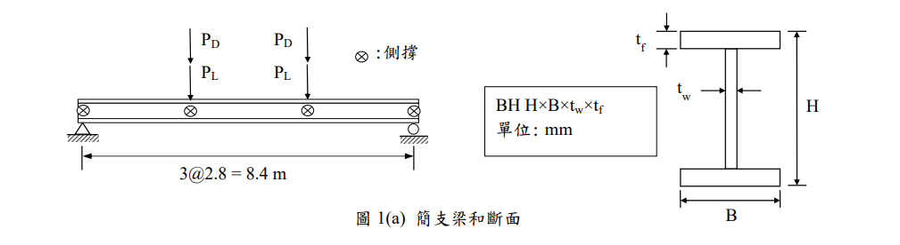
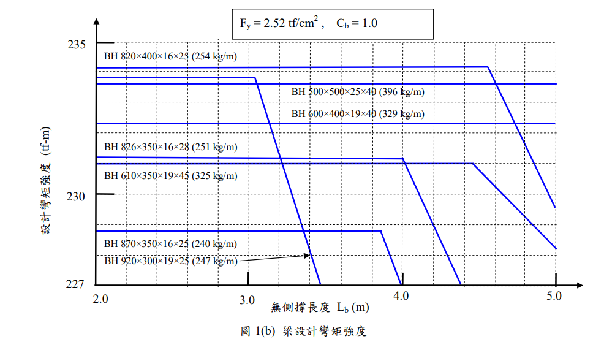
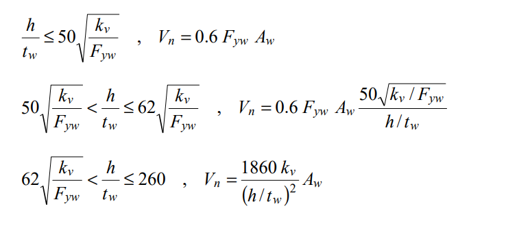

# 考題編號：SS-2015-1

**主分類：** `SS-U1-2` 梁桿件
**副分類：** 無
**設計法：** LRFD
**標籤：** `LTB側扭挫屈` `斷面選擇` `剪力強度` `使用性撓度` `圖表判讀` `Lp判斷` `三分點集中力` `最輕斷面判定` `腹板面積定義`

---

## 1. 原始題目重述 (Problem Restatement)

**結構描述：**
- 跨距 $L = 8.4$ m 之簡支承鋼梁
- 三分點各承受集中力：靜載重 $P_D = 22$ tf，活載重 $P_L = 35$ tf（兩點對稱）
- 側向支撐位置：支承點 + 兩載重點（A、B、C、D 四點）→ $L_b = 2.8$ m
- 材料：A709-36 級，$F_y = 2.52$ tf/cm²，$E_s = 2040$ tf/cm²
- 設計圖表：題目提供圖 1(b)（$C_b = 1.0$ 條件下，各斷面設計彎矩強度 vs $L_b$）



*圖說：簡支梁總長 8.4 m，兩個集中載重分別作用於 x = 2.8 m 和 x = 5.6 m（三分點）。A、B、C、D 四點均有側向支撐，故無側撐長度 $L_b = 2.8$ m（非梁總長）。BH 型鋼命名：H × B × tw × tf，尺寸單位 mm。*



*圖說：設計輔助圖，橫軸 $L_b$（m），縱軸 $\phi_b M_n$（tf-m），$F_y = 2.52$ tf/cm²，$C_b = 1.0$。候選斷面（由輕到重）：BH 870×350×16×25（240 kg/m）、BH 920×300×19×25（247 kg/m）、BH 826×350×16×28（251 kg/m）、BH 820×400×16×25（254 kg/m）、BH 610×350×19×45（325 kg/m）、BH 600×400×19×40（329 kg/m）、BH 500×500×25×40（396 kg/m）。y 軸水平虛線在 235、230、227 tf-m。*

**子問題：**
1. 由圖 1(b) 設計**最佳**（最輕）之抗彎矩斷面
2. 檢核此斷面之剪力強度（$\phi_v = 0.9$，無加勁板，$k_v = 5.0$）
3. 檢核因**活載重**造成之撓度是否符合規範限制



*圖說：題目提供之剪力強度公式（三段判斷）：*
- *段一 $\dfrac{h}{t_w} \leq 50\sqrt{\dfrac{k_v}{F_{yw}}}$：$V_n = 0.6 F_{yw} A_w$*
- *段二 $50\sqrt{\dfrac{k_v}{F_{yw}}} < \dfrac{h}{t_w} \leq 62\sqrt{\dfrac{k_v}{F_{yw}}}$：$V_n = 0.6 F_{yw} A_w \cdot \dfrac{50\sqrt{k_v/F_{yw}}}{h/t_w}$*
- *段三 $62\sqrt{\dfrac{k_v}{F_{yw}}} < \dfrac{h}{t_w} \leq 260$：$V_n = \dfrac{1860\,k_v}{(h/t_w)^2} A_w$*

---

## 2. 考題核心精神與出題者意圖 (Core Concepts & Examiner's Intent)

**核心觀念：梁設計完整流程**
此題模擬真實梁設計三步驟——彎矩選斷面 → 剪力檢核 → 使用性撓度檢核。測驗考生是否能以「最輕斷面」為目標進行有效篩選，同時正確區分**極限載重（因數化）** vs. **服務載重（未因數化）**的應用場合。

**出題者測驗重點：**
- 圖表判讀：能否將 $(L_b, M_u)$ 座標點映射到圖中，找出滿足的最輕曲線
- $L_b$ 判讀：側撐點在「支承點 + 載重點」，故 $L_b = 2.8$ m（非梁全長）
- 剪力段落判斷：$h/t_w$ 對應哪一段公式
- 三分點撓度公式：需用 $23PL^3/648EI$（單個 $P$），非均佈公式

---

## 3. 解題戰略地圖與陷阱分析 (Strategic Roadmap & Trap Analysis)

**作戰計畫：**
```
Step 1  Pu = 1.2PD + 1.6PL → Mu = Pu × (L/3)
Step 2  圖 1(b) Lb=2.8m 處畫水平線 Mu=230.72 tf-m，
        由輕到重逐一確認 φbMn ≥ Mu，計算 φbMp 驗算
Step 3  Vu = Pu（支承反力），計算 h/tw，判斷剪力段，求 φvVn
Step 4  δL = 23PL·L³/(648EI)（P = 未因數化活載重 35 tf）
        比較 δL ≤ L/360
```

**陷阱分析：**

| 陷阱 | 說明 | 對策 |
|------|------|------|
| ❶ 圖中最輕誤判 | BH 870×350×16×25（240 kg/m）外觀最輕，但 $\phi_bM_p = 228.69$ tf-m < 230.72，不足 | 計算 $Z_x$ 驗算，不單靠圖讀 |
| ❷ 跳過次輕斷面 | 870 不合格後**直接跳到 BH 826×350×16×28（251 kg/m）**，漏掉中間的 BH 920×300×19×25（**247 kg/m**）| 候選曲線須依單位重**由輕到重排序後逐一**檢核，不可跳號 |
| ❸ 撓度用因數化載重 | 使用 $P_u = 82.4$ tf 而非 $P_L = 35$ tf 計算撓度 | 使用性 → 未因數化活載重 |
| ❹ 剪力 Aw 定義 | 本卷第三頁公式表**只給 $V_n$ 三段式，未定義 $A_w$** | 台灣規範（及 100 年考卷公式表）明列 $A_w = (d-2t_f)t_w$；AISC 360 為 $d\,t_w$。取前者較保守，兩者本題皆遠大於 $V_u$ |
| ❺ 三分點公式 | 誤用均佈或跨中集中力撓度公式 | 三分點對稱兩集中力：$\delta = 23PL^3/648EI$ |

---

## 3.5 變數層次分析（Variable Hierarchy Analysis）

> 複習提示：解題後，在每個卡住的知識點「卡關?」欄標記 `⚠`；第二次複習時只看有 `⚠` 的項目。

**最終目標：** 選最輕合格斷面（彎矩） → 驗剪力強度 → 驗活載重撓度

### 主要公式（$\boxed{\phantom{x}}$ = 未知，待推導）

**Step 1：需求彎矩（LRFD）**
$$\boxed{P_u} = 1.2 P_D + 1.6 P_L$$
$$\boxed{M_u} = \boxed{P_u} \times \frac{L}{3}$$

**Step 2：選最輕斷面（讀圖 + 塑性驗算）**
$$\boxed{Z_x} = b_f t_f (H - t_f) + t_w \frac{h_w^2}{4}$$
$$\boxed{\phi_b M_p} = 0.9 \, F_y \, \boxed{Z_x} \geq \boxed{M_u} \quad \checkmark$$

**Step 3：剪力強度**
$$\boxed{A_w} = (d - 2t_f)\, t_w \quad (\text{台灣規範定義；AISC 360 為 } d\,t_w)$$
$$\boxed{\phi_v V_n} = \phi_v \times 0.6 F_{yw} \times \boxed{A_w} \geq V_u \quad \checkmark$$

**Step 4：活載重撓度**
$$\boxed{\delta} = \frac{23 \, P_L \, L^3}{648 \, E \, \boxed{I_x}} \leq \frac{L}{360} \quad \checkmark$$

### L1：題目直接給定

| 符號 | 數值 | 說明 |
|------|------|------|
| $L$ | 8.4 m | 梁跨距 |
| $P_D$ | 22 tf | 靜載重（每個集中力） |
| $P_L$ | 35 tf | 活載重（每個集中力） |
| $L_b$ | 2.8 m | 側向無束制長度（支承＋三分點支撐） |
| $F_y$ | 2.52 tf/cm² | 降伏應力（A709-36 級） |
| $E_s$ | 2040 tf/cm² | 彈性模數 |
| $k_v$ | 5.0 | 剪力屈曲係數（無加勁板） |
| $\phi_v$ | 0.9 | 剪力強度折減係數 |
| 設計圖表 | 圖1(b) | $\phi_bM_n$ vs $L_b$（含候選斷面曲線） |

### L2：需知識點推導

**Step 1：需求彎矩（LRFD）**

| 符號 | 公式 / 來源 | 卡關? |
|------|------------|:-----:|
| $P_u$ | $1.2P_D + 1.6P_L = 82.4$ tf | |
| $R_a$ | $P_u$（對稱簡支，兩載重均等） | |
| $M_u$ | $R_a \times L/3 = 230.72$ tf-m | |

**Step 2：選最輕斷面**

| 符號 | 公式 / 來源 | 卡關? |
|------|------------|:-----:|
| 候選排序 | 依單位重由輕到重：240 → **247** → 251 → 254 → 325 → 329 → 396 kg/m | |
| 圖讀 $\phi_bM_n$ | 在 $L_b = 2.8$ m 處對各曲線讀值 | |
| $L_p$ 確認 | $80 r_y / \sqrt{F_{yf}}$（確認是否在塑性區） | |
| $r_y$ | $\sqrt{I_y / A}$（查斷面手冊或計算） | |
| $Z_x$ | $b_f t_f(H - t_f) + t_w h_w^2 / 4$ | |
| $\phi_b M_p$ | $0.9 \times F_y \times Z_x$（塑性區的上限） | |

**Step 3：剪力強度檢核**

| 符號 | 公式 / 來源 | 卡關? |
|------|------------|:-----:|
| $V_u$ | $R_a = 82.4$ tf（支承反力） | |
| $h/t_w$ | $h_w / t_w = 87.0 / 1.9 = 45.8$ | |
| 段落門檻 | $50\sqrt{k_v / F_{yw}} = 70.4$ → **段一** | |
| $A_w$ | $(d - 2t_f)t_w = 87.0 \times 1.9 = 165.3$ cm² | |
| $\phi_v V_n$ | $0.9 \times 0.6 F_{yw} \times A_w = 224.9$ tf | |

**Step 4：活載重撓度**

| 符號 | 公式 / 來源 | 卡關? |
|------|------------|:-----:|
| $P_{服務}$ | $P_L = 35$ tf（**未因數化**活載重） | |
| $\delta$ | $23 P_L L^3 / (648 E I_x)$（三分點對稱公式） | |
| $I_x$ | 選定斷面 BH 920×300×19×25：$I_x = 404\,726$ cm⁴ | |
| 限制值 | $L / 360 = 840 / 360 = 2.33$ cm | |

### L3：深層知識（不懂就卡住）

| 知識點 | 說明 | 補強頁 | 卡關? |
|--------|------|:------:|:-----:|
| LRFD 載重組合 | 為何用 $1.2D + 1.6L$？係數代表什麼意義？ | | |
| LTB 塑性區判斷 | $L_b \leq L_p$ 才能取 $\phi_bM_n = \phi_bM_p$；超過要線性內插 | [[ltb-3zone]] · [[LATERAL-TORSIONAL-BUCKLING]] | |
| 使用性 vs 強度載重 | 撓度用**服務載重**（未因數化），強度設計用因數化載重 | | |
| $A_w$ 定義差異 | 台灣規範取腹板淨高 $(d-2t_f)t_w$；AISC 360 取全深 $d\,t_w$ | [[SHEAR-BUCKLING-WEB]] | |
| 三分點撓度推導 | $Pa(3L^2 - 4a^2)/24EI$，令 $a = L/3$ 化簡得 $23PL^3/648EI$ | | |

---

## 4. 步驟化詳細計算過程 (Step-by-Step Detailed Calculation)

> 📊 **剪力圖與彎矩圖請參閱：** `SS-2015-1-sfd-bmd-viz.html`

### Step 1：需求彎矩計算

**因數化集中力：**
$$P_u = 1.2 P_D + 1.6 P_L = 1.2 \times 22 + 1.6 \times 35 = 26.4 + 56.0 = 82.4 \text{ tf}$$

**反力（對稱）：** $R_a = R_b = P_u = 82.4$ tf

**最大彎矩（兩載重點之間為等彎矩段）：**
$$M_u = R_a \times \frac{L}{3} = 82.4 \times 2.8 = \boxed{230.72 \text{ tf-m}}$$

---

### Step 2：圖 1(b) 選擇最佳斷面

**條件：** $L_b = 2.8$ m，需 $\phi_b M_n \geq 230.72$ tf-m

**先把圖 1(b) 的 7 條曲線依單位重排序**（「最佳」＝最輕，故必須依重量而非依圖面高低逐一檢核）：

| 順位 | 斷面 | 單位重 (kg/m) |
|:---:|------|:---:|
| 1 | BH 870×350×16×25 | 240 |
| 2 | **BH 920×300×19×25** | **247** |
| 3 | BH 826×350×16×28 | 251 |
| 4 | BH 820×400×16×25 | 254 |
| 5 | BH 610×350×19×45 | 325 |
| 6 | BH 600×400×19×40 | 329 |
| 7 | BH 500×500×25×40 | 396 |

斷面性質公式（BH 為銲接組合斷面，$h_w = H - 2t_f$）：
$$Z_x = b_f t_f (H - t_f) + t_w \frac{h_w^2}{4}，\quad I_y = \frac{t_f b_f^3}{6} + \frac{h_w t_w^3}{12}，\quad r_y = \sqrt{I_y/A}，\quad L_p = \frac{80 r_y}{\sqrt{F_{yf}}}$$

#### 順位 1：BH 870×350×16×25（240 kg/m）❌
$$h_w = 87 - 2(2.5) = 82.0，\quad A = 2(35)(2.5) + 82(1.6) = 175 + 131.2 = 306.2 \text{ cm}^2$$
$$Z_x = 35 \times 2.5 \times (87-2.5) + 1.6 \times \frac{82^2}{4} = 7393.8 + 2689.6 = 10\,083 \text{ cm}^3$$
$$\phi_b M_p = 0.9 \times 2.52 \times 10\,083 = 22\,869 \text{ tf-cm} = 228.69 \text{ tf-m}$$
$$I_y = \frac{2.5 \times 35^3}{6} + \frac{82 \times 1.6^3}{12} = 17\,864 + 28.0 = 17\,892 \text{ cm}^4，\ r_y = \sqrt{\tfrac{17\,892}{306.2}} = 7.64 \text{ cm}$$
$$L_p = \frac{80 \times 7.64}{1.5875} = 385 \text{ cm} = 3.85 \text{ m} > L_b = 2.8 \text{ m} \Rightarrow \text{塑性區，} \phi_bM_n = \phi_bM_p$$
$$\phi_b M_n = 228.69 < M_u = 230.72 \text{ tf-m} \quad ❌ \text{ 不足 2.03 tf-m（0.88\%）}$$

#### 順位 2：BH 920×300×19×25（247 kg/m）✓ ← **最輕合格斷面**
$$h_w = 92 - 2(2.5) = 87.0，\quad A = 2(30)(2.5) + 87(1.9) = 150 + 165.3 = 315.3 \text{ cm}^2$$
$$Z_x = 30 \times 2.5 \times (92 - 2.5) + 1.9 \times \frac{87^2}{4} = 75 \times 89.5 + 1.9 \times 1892.25$$
$$= 6712.5 + 3595.3 = 10\,308 \text{ cm}^3$$
$$\phi_b M_p = 0.9 \times 2.52 \times 10\,308 = 23\,378 \text{ tf-cm} = \boxed{233.78 \text{ tf-m}}$$

確認在塑性區：
$$I_y = \frac{2.5 \times 30^3}{6} + \frac{87 \times 1.9^3}{12} = 11\,250 + 49.7 = 11\,300 \text{ cm}^4$$
$$r_y = \sqrt{\frac{11\,300}{315.3}} = \sqrt{35.83} = 5.99 \text{ cm}，\quad L_p = \frac{80 \times 5.99}{1.5875} = 302 \text{ cm} = 3.02 \text{ m}$$

$L_b = 2.8 \text{ m} < L_p = 3.02 \text{ m}$ → **恰在塑性區間內**（僅餘裕 0.22 m，這正是圖 1(b) 中此曲線在 $L_b \approx 3.0$ m 就開始陡降的原因）

$$\phi_b M_n = 233.78 \text{ tf-m} \geq M_u = 230.72 \text{ tf-m} \quad \checkmark \quad (\text{使用率 } 98.7\%)$$

#### 其餘順位（供對照，均合格但更重）

| 斷面 | 單位重 | $Z_x$ (cm³) | $\phi_bM_p$ (tf-m) | $L_p$ (m) | 判定 |
|------|:---:|:---:|:---:|:---:|:---:|
| BH 870×350×16×25 | 240 | 10 083 | 228.69 | 3.85 | ❌ |
| **BH 920×300×19×25** | **247** | **10 308** | **233.78** | **3.02** | **✓ 選用** |
| BH 826×350×16×28 | 251 | 10 192 | 231.15 | 3.99 | ✓（較重） |
| BH 820×400×16×25 | 254 | 10 322 | 234.09 | 4.58 | ✓（較重） |
| BH 610×350×19×45 | 325 | 10 183 | 230.95 | 4.44 | ✓（較重） |
| BH 600×400×19×40 | 329 | 10 244 | 232.34 | 5.09 | ✓（較重） |
| BH 500×500×25×40 | 396 | 10 302 | 233.66 | 6.48 | ✓（較重） |

> 上表 $\phi_bM_p$ 與 $L_p$ 與圖 1(b) 的曲線平台高度、轉折位置逐條吻合（例如 826 於 4.0 m 轉折、870 於 3.85 m 轉折、920 於 3.0 m 轉折、500×500 全區間 5 m 內不轉折），可反證斷面性質計算無誤。

> ⚠️ **關鍵陷阱**：BH 920×300×19×25 的平台高度（233.78）與 BH 500×500×25×40（233.66）在圖上幾乎重疊，且其標籤在圖 1(b) 中是以**引線指向 $L_b \approx 3.1$ m 的陡降段**，極易被誤讀或漏看，因此常見解法從 240 不合格後「直接跳到 251」。實際上 247 kg/m 才是最輕合格者。

**選定斷面：BH 920×300×19×25（247 kg/m）**

---

### Step 3：剪力強度檢核

**需求剪力：** $V_u = R_a = 82.4$ tf

**腹板細長比（$h$ 指腹板淨高 $h_w = H - 2t_f$）：**
$$\frac{h}{t_w} = \frac{h_w}{t_w} = \frac{87.0}{1.9} = 45.8$$

**段落判斷（$k_v = 5.0$，$F_{yw} = 2.52$ tf/cm²）：**
$$50\sqrt{\frac{k_v}{F_{yw}}} = 50\sqrt{\frac{5.0}{2.52}} = 50 \times 1.4086 = 70.4$$

$h/t_w = 45.8 < 70.4$ → **段一（完全塑性剪力降伏，無剪力挫屈折減）**

**腹板面積：**
$$A_w = (d - 2t_f)\,t_w = 87.0 \times 1.9 = 165.3 \text{ cm}^2$$

**標稱剪力強度：**
$$V_n = 0.6 F_{yw} A_w = 0.6 \times 2.52 \times 165.3 = 249.9 \text{ tf}$$

$$\phi_v V_n = 0.9 \times 249.9 = \boxed{224.9 \text{ tf}} \gg V_u = 82.4 \text{ tf} \quad \checkmark$$

**使用率：** $82.4/224.9 = 36.6\%$，剪力強度充裕。

> **若採 $A_w = d\,t_w$（AISC 360 定義）**：$A_w = 92 \times 1.9 = 174.8$ cm²，$\phi_vV_n = 0.9 \times 0.6 \times 2.52 \times 174.8 = 237.9$ tf。兩種定義相差 5.7%，本題**結論相同**。

---

### Step 4：活載重撓度檢核

**三分點對稱集中力撓度公式推導：**

對稱簡支梁，兩個等載重 $P$ 各距支承 $a = L/3$，跨中最大撓度：
$$\delta_{max} = \frac{Pa\left(3L^2 - 4a^2\right)}{24EI} = \frac{P \cdot \frac{L}{3}\left(3L^2 - \frac{4L^2}{9}\right)}{24EI} = \frac{P \cdot \frac{L}{3} \cdot \frac{23L^2}{9}}{24EI} = \frac{23PL^3}{648EI}$$

**計算 $I_x$（BH 920×300×19×25）：**

各翼板形心距總中性軸距離：$\dfrac{h_w}{2} + \dfrac{t_f}{2} = \dfrac{87}{2} + \dfrac{2.5}{2} = 43.5 + 1.25 = 44.75$ cm

$$I_x = 2\left[\frac{b_f t_f^3}{12} + b_f t_f \times 44.75^2\right] + \frac{t_w h_w^3}{12}$$
$$= 2\left[\frac{30 \times 2.5^3}{12} + 30 \times 2.5 \times 2002.6\right] + \frac{1.9 \times 87^3}{12}$$
$$= 2\left[39.1 + 150\,192\right] + \frac{1.9 \times 658\,503}{12}$$
$$= 2 \times 150\,231 + 104\,263 = 300\,463 + 104\,263 = \boxed{404\,726 \text{ cm}^4}$$

**代入公式（$P = P_L = 35$ tf，$L = 840$ cm）：**

$$\delta_L = \frac{23 \times 35 \times 840^3}{648 \times 2040 \times 404\,726}$$

- 分子：$23 \times 35 \times 592\,704\,000 = 805 \times 592\,704\,000 = 4.7713 \times 10^{11}$
- 分母：$648 \times 2040 \times 404\,726 = 1\,321\,920 \times 404\,726 = 5.3502 \times 10^{11}$

$$\delta_L = \frac{4.7713 \times 10^{11}}{5.3502 \times 10^{11}} = \boxed{0.892 \text{ cm}}$$

**規範限制：**
$$\delta_{allow} = \frac{L}{360} = \frac{840}{360} = 2.33 \text{ cm}$$

$$\delta_L = 0.892 \text{ cm} < \delta_{allow} = 2.33 \text{ cm} \quad \checkmark \quad \text{（僅達限制值的 38.2\%）}$$

---

## 5. 關鍵爭議點與進階探討 (Critical Issues & Advanced Discussion)

**爭議一：「最佳」＝最輕，必須依單位重逐一檢核（本題最易失分處）**

圖 1(b) 的曲線在圖面上是依 $\phi_bM_n$ 高低排列，**與單位重的排序不一致**。實際重量排序為 240 → 247 → 251 → 254 → 325 → 329 → 396 kg/m，而圖面高低（$\phi_bM_p$）排序卻是 254 → 247 ≈ 396 → 329 → 251 ≈ 325 → 240。

- BH 870×350×16×25（240）：$\phi_bM_p = 228.69 < 230.72$ ❌
- BH 920×300×19×25（**247**）：$\phi_bM_p = 233.78 \geq 230.72$ ✓ ← 最輕合格
- BH 826×350×16×28（251）：$\phi_bM_p = 231.15$ ✓ 但比 247 重 4 kg/m

**BH 920×300×19×25 的平台高度 233.78 與 BH 500×500×25×40 的 233.66 在圖上幾乎重疊**，且其標籤引線指向 $L_b \approx 3.1$ m 的陡降段（因 $L_p = 3.02$ m 最小），故極易被誤判為「不合格」或整條被漏看。這是把 251 誤當成答案的根本原因。

**爭議二：腹板面積 $A_w$ 定義（本卷未給定）**

本卷第三頁參考公式**只列 $V_n$ 三段式，並未定義 $A_w$**。兩種來源：

| 來源 | $A_w$ 定義 | 本題數值 | $\phi_vV_n$ |
|------|-----------|:---:|:---:|
| 台灣規範／100 年考卷公式表明列 $A_w = (d - 2t_f)t_w$ | 腹板淨高 | 87.0 × 1.9 = 165.3 cm² | **224.9 tf** |
| AISC 360-16 §G2.1 $A_w = d\,t_w$ | 全深 | 92 × 1.9 = 174.8 cm² | 237.9 tf |

兩者相差 5.7%。本解析採**較保守的淨高定義**為主答，並註明 AISC 定義；由於 $V_u = 82.4$ tf 遠小於兩者，**結論不受影響**。考場作答時建議明寫所採定義。

**進階：深梁特性（撓度充裕的原因）**

所選斷面 $L/d = 840/92 = 9.1$，屬深梁（一般梁 $L/d \approx 15\sim25$）。深梁 $I_x$ 大，自然使撓度遠低於限制。**此題由彎矩強度控制，撓度與剪力自動滿足**，此為鋼結構梁桿件之常見現象。

---

## 6. 依最新規範（AISC 360-16／-22）對照

> **主答依據**：內政部「鋼構造建築物鋼結構設計技術規範」**民國 99 年（2010）修正版**——本卷注意事項（四）明文：「作答請採用內政部發布 2010 年『鋼結構設計技術規範』為原則」。以 AISC 360-16 為基礎之修訂版**尚未發布**，故僅列為對照。

### 6.1 $L_p$ 公式：形式不同、數值幾乎相同

| 項目 | 台灣 2010（＝AISC LRFD 1993） | AISC 360-16 §F2.2 |
|------|------|------|
| 公式 | $L_p = \dfrac{80 r_y}{\sqrt{F_{yf}}}$（$F_y$ 單位 tf/cm²） | $L_p = 1.76 r_y \sqrt{E/F_y}$ |
| 本題（$r_y = 5.99$ cm） | 3.02 m | $1.76 \times 5.99 \times \sqrt{2040/2.52} = 3.00$ m |

$80/\sqrt{F_y}$ 與 $1.76\sqrt{E/F_y}$ 在 $E = 2040$ tf/cm² 時等價（$1.76\sqrt{2040} = 79.5 \approx 80$），故**兩規範的塑性區界限實質相同**。$L_b = 2.8$ m 在兩者下皆 $< L_p$，$M_n = M_p$ 成立，**選定斷面不變**。

### 6.2 斷面結實性（compact）檢核

| 項目 | 本題值 | 台灣 2010 $\lambda_p$ | AISC 360-16 $\lambda_p$ | 判定 |
|------|:---:|:---:|:---:|:---:|
| 翼板 $b_f/2t_f$ | 30/5 = **6.00** | $17/\sqrt{F_y} = 10.71$ | $0.38\sqrt{E/F_y} = 10.81$ | 結實 ✓ |
| 腹板 $h/t_w$ | **45.79** | $170/\sqrt{F_y} = 107.1$ | $3.76\sqrt{E/F_y} = 106.98$ | 結實 ✓ |

兩規範界限值差異 < 1%，判定一致。

### 6.3 剪力：AISC 360-16 §G2 的 $\phi_v = 1.00$

$$\frac{h}{t_w} = 45.79 \leq 2.24\sqrt{\frac{E}{F_y}} = 2.24 \times 28.45 = 63.7$$

→ AISC 360-16 允許 $\phi_v = \mathbf{1.00}$（而非 0.90），且 $C_{v1} = 1.0$：
$$V_n = 0.6 F_y A_w = 0.6 \times 2.52 \times 174.8 = 264.3 \text{ tf}，\quad \phi_v V_n = 264.3 \text{ tf}$$

vs 台灣 2010（本題指定 $\phi_v = 0.9$）：224.9 tf。**AISC 高出 17.5%**（$\phi_v$ 0.9→1.0 與 $A_w$ 淨高→全深兩項疊加）。但本題已由題目指定 $\phi_v = 0.9$，主答仍用 0.9。

### 6.4 使用性撓度

AISC 360 本體不規定撓度限值（歸屬 Chapter L 及 IBC）；$L/360$（活載重）為兩地通用慣例，**無差異**。

### 6.5 對照結論

| 子題 | 台灣 2010（主答） | AISC 360-16 | 差異 |
|------|------|------|:---:|
| (一) 最佳斷面 | **BH 920×300×19×25（247 kg/m）** | 同 | 無 |
| (二) $\phi_v V_n$ | 224.9 tf ≫ 82.4 tf ✓ | 264.3 tf ✓ | +17.5%，結論同 |
| (三) $\delta_L$ | 0.892 cm < 2.33 cm ✓ | 同 | 無 |

**三小題的答案在兩規範下完全一致**；差異僅在剪力容量的數值大小。

---

*解析完成時間：2026-04-08（重新解析，依當前 CLAUDE.md 格式）*
*修正日期：2026-08-22（勘誤：子題(一)最佳斷面由 BH 826×350×16×28 改為 **BH 920×300×19×25**；連帶修正 $A_w$ 定義、$h/t_w$、$\phi_vV_n$、$I_x$、$\delta_L$；新增 §6 最新規範對照）*
*驗證狀態：unverified*
