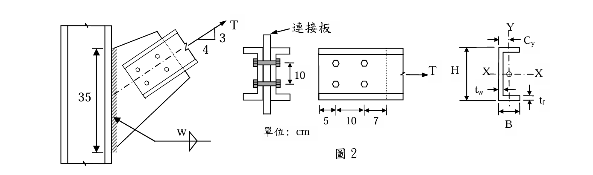
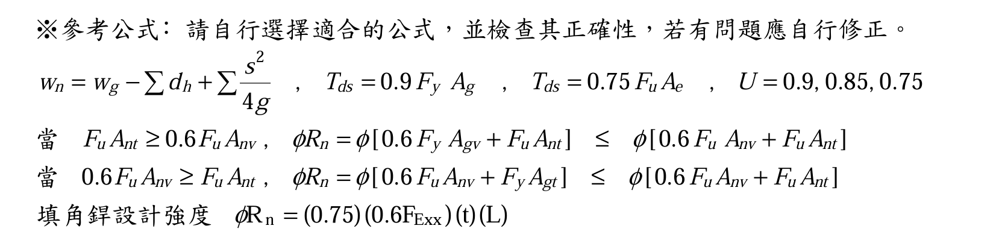
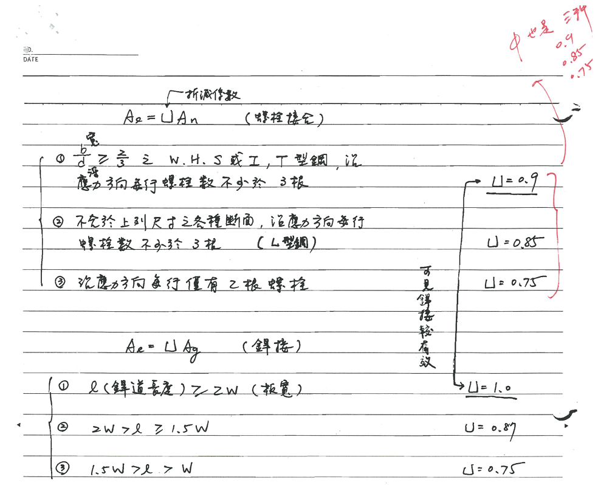
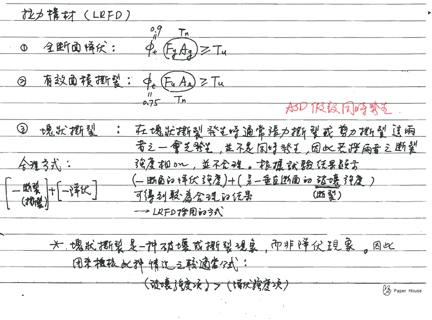
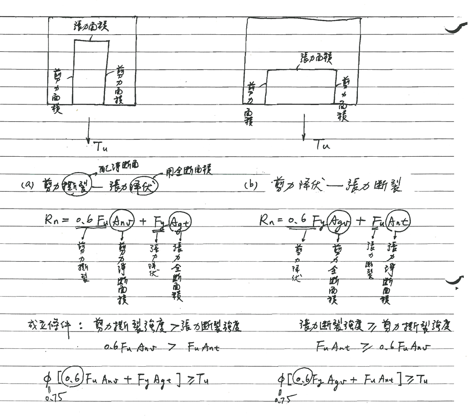
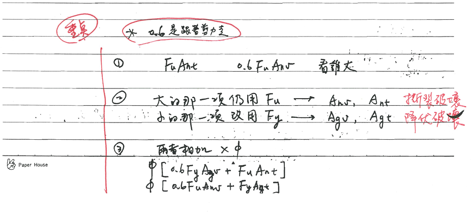

# 考題編號：SS-2015-2

**主分類：** `4.1.1` 拉力及壓力桿件
**副分類：** `4.1.4` 接合之分析與設計
**設計法：** LRFD
**標籤：** `拉力桿件` `剪力遲滯` `塊狀剪力` `填角銲` `雙槽鋼` `U值` `接合設計`

---

## 1. 原始題目重述 (Problem Restatement)

**結構描述：**
- 雙槽鋼（2×C200×75）拉力桿，透過連接板與 H 柱翼板接合
- C200×75 斷面：$H \times B \times t_w \times t_f = 200 \times 75 \times 6 \times 12.5$ mm
- 斷面性質（題目提供）：$A = 29.9$ cm²，$C_y = 2.49$ cm
- 螺栓：A325，$d_b = 2.5$ cm（高拉力螺栓，承壓型）
- 連接板：$t = 1.6$ cm，與 H 柱有效銲長 $L_w = 35$ cm
- 鋼材：A992，$F_y = 3.5$ tf/cm²，$F_u = 4.6$ tf/cm²
- 銲條：E70，$F_{EXX} = 4.9$ tf/cm²



*圖說：雙槽鋼拉力桿接合詳圖（單位：cm）。兩根 C200×75 背靠背排列，共用中央連接板。螺栓縱向排列：端距 5 cm、螺栓間距 10 cm（縱向 2 個螺栓位置）、端距 7 cm，合計接合長度 22 cm。縱向螺栓群長度（接合長度）$L = 10$ cm。連接板厚 $t = 1.6$ cm，與 H 柱翼板之填角銲有效銲長 $L_w = 35$ cm（兩側各一道），銲腳長度 $w$ 待求。$C_y = 2.49$ cm 為單一 C200×75 斷面形心到腹板外面之距離。*



*圖說：題目提供參考公式。【淨寬】$w_n = w_g - \sum d_h + \sum \frac{s^2}{4g}$。【拉力設計強度】$T_{ds} = 0.9F_yA_g$（GSY）；$T_{ds} = 0.75F_uA_e$（NSF），$U = 0.9, 0.85, 0.75$。【塊狀剪力（BSR）】當 $F_uA_{nt} \geq 0.6F_uA_{nv}$：$\phi R_n = \phi[0.6F_yA_{gv} + F_uA_{nt}] \leq \phi[0.6F_uA_{nv} + F_uA_{nt}]$；當 $0.6F_uA_{nv} \geq F_uA_{nt}$：$\phi R_n = \phi[0.6F_uA_{nv} + F_yA_{gt}] \leq \phi[0.6F_uA_{nv} + F_uA_{nt}]$。【填角銲】$\phi R_n = (0.75)(0.6F_{EXX})(t)(L)$，$t = 0.707w$。*

**子問題：**
1. 求此拉力桿的**設計強度**（20 分）
2. 若連接板強度足夠，求設計**填角銲銲腳長度** $w$（10 分）

---

## 2. 考題核心精神與出題者意圖 (Core Concepts & Examiner's Intent)

**核心觀念：拉力桿件三重極限狀態 × 接合反算設計**

拉力桿件設計必須同時評估三個互相競爭的破壞模式，取最脆弱者（最小值）為設計強度。第二小題再以此強度「反推」銲腳尺寸，測驗完整的接合設計流程。

**出題者測驗重點：**
- **GSY**：全斷面降伏（$A_g$ 使用全斷面，$\phi = 0.9$）
- **NSF**：淨斷面斷裂（用 $U$ 折減，$\phi = 0.75$）；雙槽鋼只有腹板接觸螺栓 → 剪力遲滯必考
- **BSR**：塊狀剪力（識別破壞路徑、正確選用 $F_uA_{nt}$ vs $F_yA_{gt}$ 的條件公式）
- **填角銲**：從需求強度反算銲腳尺寸，並與最小銲腳尺寸取較大值

---

## 3. 解題戰略地圖與陷阱分析 (Strategic Roadmap & Trap Analysis)

**作戰計畫：**
```
Step 1  整理幾何：斷面尺寸（mm→cm）、孔徑 dh、螺栓排列
Step 2  GSY：最快，φt × Fy × (2Ag)
Step 3  NSF：An（扣一排孔）→ U = 1 - x̄/L → Ae = U·An → φt × Fu × (2Ae)
Step 4  BSR：識別剪力面（2 面）與拉力面（1 面）→ 比較 FuAnt vs 0.6FuAnv
         → 選對條件公式 → 乘 2（雙槽鋼）
Step 5  取三者最小值 = 設計強度
Step 6  填角銲：φRn = 0.75 × 0.6FEXX × 0.707w × (2 × 35) ≥ 設計強度 → 解 w
```

**陷阱分析：**

| 陷阱 | 說明 | 對策 |
|------|------|------|
| ❶ 忘記乘 2 | C200×75 是單根性質，需 ×2 | 每步計算完單根後立即標註 ×2 |
| ❷ 螺栓孔徑 | 標準孔 = $d_b + 0.3$ cm | $d_h = 2.5 + 0.3 = 2.8$ cm |
| ❸ NSF 扣孔數 | 臨界截面只穿過**一排**螺栓孔（縱向佈置，每排 1 孔） | $A_n = A_g - 1 \times d_h \times t_w$ |
| ❹ BSR 條件公式選錯 | 比較 $F_uA_{nt}$ 與 $0.6F_uA_{nv}$，**較大者配 Fu（淨面積），較小者改用 Fy（全面積）** | 先判斷哪個大，再套對應公式 |
| ❺ BSR 拉力面方向 | 拉力面是**垂直於力方向**（縱向），在最遠端螺栓到板端 7 cm | 不要搞混剪力面（平行於力）與拉力面（垂直於力） |
| ❻ 銲道兩側 | 連接板兩側各一道填角銲，有效總長 = 2 × 35 = 70 cm | $\phi R_n = 0.75 \times 0.6F_{EXX} \times 0.707w \times 70$ |

---

## 3.5 變數層次分析（Variable Hierarchy Analysis）

> 複習提示：解題後，在每個卡住的知識點「卡關?」欄標記 `⚠`；第二次複習時只看有 `⚠` 的項目。

**最終目標：** 三種極限狀態（GSY / NSF / BSR）取最小值為設計強度 → 反算填角銲銲腳尺寸 $w$

### 主要公式（$\boxed{\phantom{x}}$ = 未知，待推導）

$$\phi_t P_n^{(GSY)} = 0.9 F_y (2A_g)$$

$$\boxed{A_e} = \boxed{U} \cdot \boxed{A_n}, \quad \phi_t P_n^{(NSF)} = 0.75 F_u (2\boxed{A_e})$$

$$\boxed{\phi R_n^{(BSR)}} = 0.75 \left[0.6 F_u \boxed{A_{nv}} + F_y \boxed{A_{gt}}\right] \times 2$$

$$\boxed{\phi_t P_n} = \min\left(\phi_t P_n^{(GSY)},\ \phi_t P_n^{(NSF)},\ \phi R_n^{(BSR)}\right)$$

$$\boxed{w} \geq \frac{\boxed{\phi_t P_n}}{0.75 \times 0.6 F_{EXX} \times 0.707 \times 2L_w}$$

### L1：題目直接給定

| 符號 | 數值 | 說明 |
|------|------|------|
| $A_g$（單根） | 29.9 cm² | C200×75 斷面積 |
| $C_y$ | 2.49 cm | 形心到腹板外面距離 |
| $t_w$ | 0.6 cm | 腹板厚度 |
| $t_f$ | 1.25 cm | 翼板厚度 |
| $d_b$ | 2.5 cm | 螺栓直徑 |
| $L_w$ | 35 cm | 連接板有效銲長（各側） |
| $F_y$ | 3.5 tf/cm² | 降伏應力（A992） |
| $F_u$ | 4.6 tf/cm² | 抗拉強度（A992） |
| $F_{EXX}$ | 4.9 tf/cm² | 銲條抗拉強度（E70） |
| $e_1$ | 5 cm | 近端端距 |
| $s$ | 10 cm | 縱向螺栓間距（接合長度 $L$） |
| $e_2$ | 7 cm | 遠端端距 |

### L2：需知識點推導

**Step 1：幾何整理**

| 符號 | 公式 / 來源 | 卡關? |
|------|------------|:-----:|
| $d_h$ | $d_b + 0.3 = 2.8$ cm（標準孔） | |
| 接合長度 $L$ | 縱向螺栓間距 = 10 cm | |

**Step 2：GSY 全斷面降伏**

| 符號 | 公式 / 來源 | 卡關? |
|------|------------|:-----:|
| $\phi_t P_n^{(GSY)}$ | $0.9 \times 3.5 \times (2 \times 29.9) = 188.4$ tf | |

**Step 3：NSF 淨斷面斷裂**

| 符號 | 公式 / 來源 | 卡關? |
|------|------------|:-----:|
| $A_n$ | $A_g - 1 \times d_h \times t_w = 29.9 - 1.68 = 28.22$ cm²（扣一排孔） | |
| $U$ | $1 - \bar{x}/L = 1 - C_y/L = 1 - 2.49/10 = 0.751$ | |
| $A_e$ | $U \times A_n = 0.751 \times 28.22 = 21.19$ cm²（單根） | |
| $\phi_t P_n^{(NSF)}$ | $0.75 \times 4.6 \times (2 \times 21.19) = 146.2$ tf | |

**Step 4：BSR 塊狀剪力**

| 符號 | 公式 / 來源 | 卡關? |
|------|------------|:-----:|
| $A_{nv}$（淨剪力面） | $2 \times [(e_1+s) - 2 \times d_h/2 \times 2] \times t_w$；兩剪力面各扣 2 孔 = 14.64 cm² | |
| $A_{nt}$（淨拉力面） | $(e_2 - d_h/2) \times t_w = 3.36$ cm² | |
| $A_{gt}$（全拉力面） | $e_2 \times t_w = 4.2$ cm² | |
| 判斷控制模式 | $F_uA_{nt} = 15.46 < 0.6F_uA_{nv} = 40.41$ → 剪力斷裂控制 | |
| $\phi R_n$（單根） | $0.75 \times [0.6 F_u A_{nv} + F_y A_{gt}] = 41.33$ tf | |
| $\phi R_n^{(BSR)}$（雙根） | $2 \times 41.33 = 82.7$ tf | |

**Step 5：設計強度 & 填角銲**

| 符號 | 公式 / 來源 | 卡關? |
|------|------------|:-----:|
| $\phi_t P_n$ | $\min(188.4, 146.2, 82.7) = 82.7$ tf（BSR 控制） | |
| $w$ 需求 | $82.7 / (0.75 \times 0.6 \times 4.9 \times 0.707 \times 70) = 7.58$ mm | |
| $w$ 取用 | 最小銲腳（板厚 16 mm）= 8 mm → 取 **8 mm** | |

### L3：深層知識（不懂就卡住）

| 知識點 | 說明 | 補強頁 | 卡關? |
|--------|------|:------:|:-----:|
| 剪力遲滯 U 值公式法 | $U = 1 - \bar{x}/L$，$\bar{x} = C_y$（槽鋼腹板連接），$L$ = 縱向接合長度 | [[shear-lag-u]] · [[SHEAR-LAG]] | |
| BSR 條件公式選擇 | 比較 $F_uA_{nt}$ 與 $0.6F_uA_{nv}$：較大者用淨面積+Fu，較小者改全面積+Fy | [[block-shear]] · [[BLOCK-SHEAR-RUPTURE]] | |
| 雙槽鋼需乘 2 | 所有單根計算完後，設計強度乘以 2（BSR、NSF 均需）| | |
| 螺栓孔徑扣 $d_b + 0.3$ | 標準孔，強度計算時扣孔徑 = $d_b + 0.3$ cm（不是 $d_b$） | | |
| 填角銲最小銲腳尺寸 | 依板厚查規範（$t > 12$ mm 時最小 8 mm），與計算需求取較大值 | | |

---

## 4. 步驟化詳細計算過程 (Step-by-Step Detailed Calculation)



*圖說：U 值計算整理。查表法：① W/H/S/T 型鋼翼板連接，沿力方向每排 ≥3 個螺栓 → U=0.9；② 其他斷面（含槽鋼）每排 ≥3 個螺栓 → U=0.85；③ 每排 2 個螺栓 → U=0.75。公式法：$U = 1 - \bar{x}/L$（$\bar{x}$ 為斷面形心到剪力傳力面之距離，$L$ 為接合縱向長度）。兩者取較大值。C 型鋼只有腹板連接時 $\bar{x} = C_y$。*



*圖說：三種極限狀態概念。GSY：全斷面降伏，$\phi=0.9$，$P_n = F_yA_g$。NSF：有效淨截面斷裂，$\phi=0.75$，$P_n = F_uA_e = F_u U A_n$。BSR：塊狀剪力，$\phi=0.75$；兩條判斷規則：(a) $F_uA_{nt} \geq 0.6F_uA_{nv}$ → 張力斷裂 + 剪力降伏：$R_n = 0.6F_yA_{gv} + F_uA_{nt}$；(b) $0.6F_uA_{nv} > F_uA_{nt}$ → 剪力斷裂 + 張力降伏：$R_n = 0.6F_uA_{nv} + F_yA_{gt}$。兩種情況均有上限：$R_n \leq 0.6F_uA_{nv} + F_uA_{nt}$。*

### 基本幾何整理

| 參數 | 單位換算 | 結果 |
|------|----------|------|
| $H = 200$ mm | → cm | 20.0 cm |
| $B = 75$ mm | → cm | 7.5 cm |
| $t_w = 6$ mm | → cm | 0.6 cm |
| $t_f = 12.5$ mm | → cm | 1.25 cm |
| $A_g$（單根） | 題目給定 | 29.9 cm² |
| $C_y$（形心到腹板外面） | 題目給定 | 2.49 cm |
| $d_h = d_b + 0.3$ | $= 2.5 + 0.3$ | 2.8 cm |
| 接合長度 $L$ | 縱向螺栓間距 | 10 cm |
| 端距（近端）$e_1$ | 圖讀 | 5 cm |
| 端距（遠端）$e_2$ | 圖讀 | 7 cm |

---

### Part (一)：拉力桿設計強度

#### 極限狀態一：全斷面降伏（GSY）

$$\phi_t P_n = \phi_t F_y (2 A_g) = 0.9 \times 3.5 \times (2 \times 29.9) = 0.9 \times 3.5 \times 59.8 = \boxed{188.4 \text{ tf}}$$

> 策略註解：GSY 使用**全斷面積**，不扣孔，不考慮剪力遲滯。此值通常是三者中最大的。

---

#### 極限狀態二：淨斷面斷裂（NSF）

**淨斷面積 $A_n$（單根槽鋼）：**

臨界截面穿過一排螺栓孔（縱向排列，每橫截面上 1 個孔在腹板上）：
$$A_n = A_g - 1 \times d_h \times t_w = 29.9 - 2.8 \times 0.6 = 29.9 - 1.68 = 28.22 \text{ cm}^2$$

**剪力遲滯係數 $U$：**

雙槽鋼只有**腹板**連接至螺栓，翼板力流需繞過，發生剪力遲滯。

$$U = 1 - \frac{\bar{x}}{L} = 1 - \frac{C_y}{L} = 1 - \frac{2.49}{10} = 0.751$$

> 策略註解：$\bar{x} = C_y = 2.49$ cm，為斷面形心到**剪力傳力面**（腹板外面）的距離。$L = 10$ cm 為縱向螺栓間距（接合長度）。

查表法（作為交叉驗核）：C 型鋼腹板連接，縱向每列 2 個螺栓 → $U = 0.75$。取計算值 $U = 0.751 \approx 0.75$（兩者相近，以計算值為準）。

**有效淨斷面積：**
$$A_e = U \cdot A_n = 0.751 \times 28.22 = 21.19 \text{ cm}^2 \text{（單根）}$$

**設計強度：**
$$\phi_t P_n = 0.75 \times F_u \times (2 A_e) = 0.75 \times 4.6 \times (2 \times 21.19) = 0.75 \times 4.6 \times 42.38 = \boxed{146.2 \text{ tf}}$$

---

#### 極限狀態三：塊狀剪力破壞（BSR）



*圖說：塊狀撕裂兩種路徑圖解。路徑(a)（張力斷裂控制）：張力面用淨面積 $A_{nt}$（斷裂），剪力面用全面積 $A_{gv}$（降伏）；條件 $F_uA_{nt} \geq 0.6F_uA_{nv}$；$R_n = 0.6F_yA_{gv} + F_uA_{nt}$。路徑(b)（剪力斷裂控制）：剪力面用淨面積 $A_{nv}$（斷裂），張力面用全面積 $A_{gt}$（降伏）；條件 $0.6F_uA_{nv} > F_uA_{nt}$；$R_n = 0.6F_uA_{nv} + F_yA_{gt}$。兩種路徑上限均為 $0.6F_uA_{nv} + F_uA_{nt}$。*

**破壞路徑幾何（單根槽鋼腹板）：**

雙槽鋼腹板連接時，腹板上每側有 1 排縱向螺栓（2 個螺栓，間距 10 cm）。腹板材料可在螺栓群的**上下兩側**各形成一個剪力面，在**遠端**形成一個拉力面。

```
    e1=5  s=10   e2=7
  ┌──────┬──────────┬───────┐
  │      ●          ●       │  ← 螺栓（腹板上，縱向間距10cm）
  │  ↑  ↑            ↑ ↑   │
  │ 剪力面（2條）    拉力面  │
  └──────────────────────────┘
```

**剪力淨面積 $A_{nv}$（2 個剪力面，各通過 2 個螺栓孔）：**

每個剪力面長度（從近端到最遠螺栓）：$e_1 + s = 5 + 10 = 15$ cm

$$A_{nv} = 2 \times \left[(e_1 + s) - n_v \times d_h\right] \times t_w = 2 \times [15 - 2 \times 1.4] \times 0.6 = 2 \times 12.2 \times 0.6 = 14.64 \text{ cm}^2$$

**拉力淨面積 $A_{nt}$（1 個拉力面，從最遠螺栓到板端，扣半孔）：**

$$A_{nt} = \left(e_2 - \frac{d_h}{2}\right) \times t_w = (7 - 1.4) \times 0.6 = 5.6 \times 0.6 = 3.36 \text{ cm}^2$$

**拉力全面積 $A_{gt}$：**
$$A_{gt} = e_2 \times t_w = 7 \times 0.6 = 4.2 \text{ cm}^2$$

**剪力全面積 $A_{gv}$：**
$$A_{gv} = 2 \times (e_1 + s) \times t_w = 2 \times 15 \times 0.6 = 18.0 \text{ cm}^2$$

**判斷哪個破壞模式控制：**
$$F_u A_{nt} = 4.6 \times 3.36 = 15.46 \text{ tf}$$
$$0.6 F_u A_{nv} = 0.6 \times 4.6 \times 14.64 = 40.41 \text{ tf}$$

因 $0.6 F_u A_{nv}\ (40.41) > F_u A_{nt}\ (15.46)$ → **剪力斷裂 + 張力降伏**（條件二）

$$\phi R_n = \phi \left[0.6 F_u A_{nv} + F_y A_{gt}\right] \leq \phi \left[0.6 F_u A_{nv} + F_u A_{nt}\right]$$

$$= 0.75 \times [40.41 + 3.5 \times 4.2] = 0.75 \times [40.41 + 14.70] = 0.75 \times 55.11 = 41.33 \text{ tf/根}$$

上限確認：$0.75 \times [40.41 + 15.46] = 0.75 \times 55.87 = 41.90$ tf → $41.33 < 41.90$ ✓

**雙槽鋼 BSR 強度：**
$$\phi R_n = 2 \times 41.33 = \boxed{82.7 \text{ tf}}$$

> 策略註解：條件二（剪力斷裂 + 張力降伏）中，剪力面用 $F_u \times A_{nv}$（淨面積、斷裂），張力面用 $F_y \times A_{gt}$（全面積、降伏）。切記「**0.6 跟著剪力走**」，是哪種破壞（斷裂 or 降伏）就配對應的面積。

---

#### 三種極限狀態比較

| 極限狀態 | 設計強度 |
|---------|---------|
| GSY 全斷面降伏 | 188.4 tf |
| NSF 淨斷面斷裂 | 146.2 tf |
| **BSR 塊狀剪力（控制）** | **82.7 tf** |

$$\boxed{\phi P_n = 82.7 \text{ tf，由塊狀剪力破壞控制}}$$

---

### Part (二)：填角銲銲腳長度 $w$

**銲道設計：**
- 連接板兩側各一道填角銲（對稱），有效銲長各 35 cm
- 銲道需傳遞拉力桿設計強度：$T = 82.7$ tf

**填角銲強度公式（有效喉厚 $t = 0.707w$）：**
$$\phi R_n = (0.75)(0.6 F_{EXX})(0.707w)(L_{total})$$

其中總有效銲長 $L_{total} = 2 \times 35 = 70$ cm（兩側各 35 cm）：

$$\phi R_n = 0.75 \times 0.6 \times 4.9 \times 0.707w \times 70 = 0.75 \times 2.94 \times 49.49 \times w = 109.2w$$

**解 $w$：**
$$109.2w \geq 82.7 \text{ tf}$$
$$w \geq \frac{82.7}{109.2} = 0.758 \text{ cm} = 7.58 \text{ mm}$$

**最小銲腳尺寸確認（板厚 $t = 1.6$ cm = 16 mm，依規範 $t > 12$ mm 時最小銲腳 = 8 mm）：**

計算需求 7.58 mm ≤ 最小規定 8 mm，故取規範最小值：

$$\boxed{w = 8 \text{ mm} = 0.8 \text{ cm}}$$



*圖說：【BSR 判斷總規則】0.6 永遠跟著剪力（V）走。① 比較 $F_uA_{nt}$ 與 $0.6F_uA_{nv}$；② 較大那一項保持 $F_u$（淨面積）→ 表示該面發生**斷裂**；較小那一項改為 $F_y$（全面積）→ 表示該面發生**降伏**；③ 兩者相加：$\phi = 0.75$，上限為 $\phi(0.6F_uA_{nv} + F_uA_{nt})$。此題 $0.6F_uA_{nv} = 40.41$ tf > $F_uA_{nt} = 15.46$ tf → 剪力斷裂（用 $F_u A_{nv}$） + 張力降伏（用 $F_y A_{gt}$）。*

---

## 5. 關鍵爭議點與進階探討 (Critical Issues & Advanced Discussion)

**爭議一：BSR 條件公式的選用（常見錯誤）**

舊版解析誤用了上限公式 $\phi[0.6F_uA_{nv} + F_uA_{nt}]$ 作為設計強度，得到 83.8 tf。正確做法：先判斷 $F_uA_{nt}$ vs $0.6F_uA_{nv}$ 大小，再套對應條件公式。

本題 $0.6F_uA_{nv} = 40.41 > F_uA_{nt} = 15.46$，故用：
$$\phi R_n = \phi[0.6F_uA_{nv} + \mathbf{F_y}A_{gt}]$$

（張力面用降伏應力 $F_y$ + 全面積 $A_{gt}$，而非 $F_u A_{nt}$）

兩值差異：$41.33$ vs $41.90$ tf/根（差 1.4%），但公式原則性的正確性仍需維持。

**爭議二：U 值的選取（查表 vs 計算）**

本題計算法 $U = 0.751$，與查表值（2 個螺栓，槽鋼腹板連接）$U = 0.75$ 幾乎相同。AISC 允許取兩者較大者，故用 0.751 無誤。接合長度 $L$ 定義為「縱向最外兩排螺栓之間距」= 10 cm。

**進階：為何 BSR 遠低於 NSF？**

BSR = 82.7 tf vs NSF = 146.2 tf，差距幾乎 2 倍。原因：BSR 涉及的有效受力面積（$A_{nv}$ 和 $A_{nt}$）都是**腹板局部面積**，而 NSF 的 $A_n$ 是**整個斷面**的淨面積。雙槽鋼的接合，螺栓僅穿過腹板（$t_w = 0.6$ cm），腹板面積相對較小，故 BSR 往往是控制模式。

此結果提示：提高拉力桿強度的最有效途徑是**改善接合詳圖**（增加螺栓排數或加大接合長度），而非單純換用更強的鋼材。

---

*解析完成時間：2026-04-08（重新解析，依當前 CLAUDE.md 格式）*
*驗證狀態：unverified*
