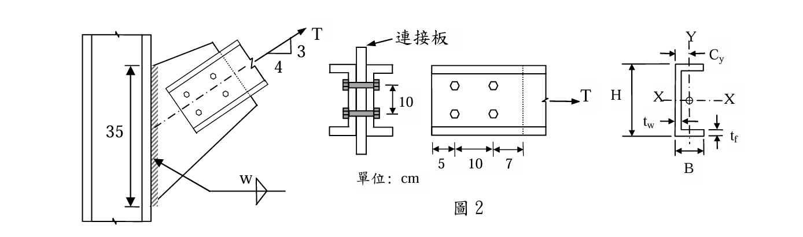
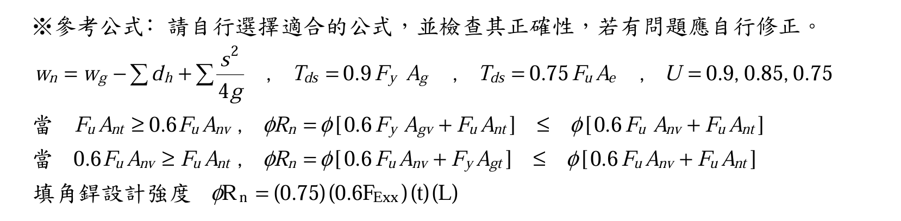
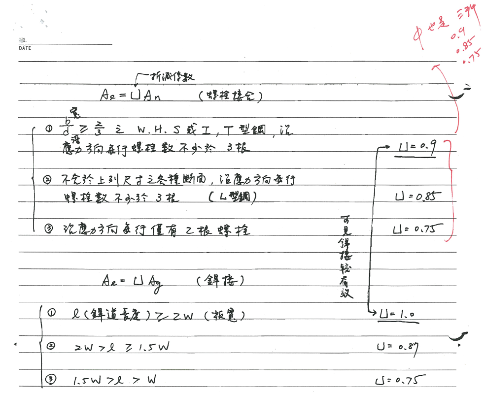
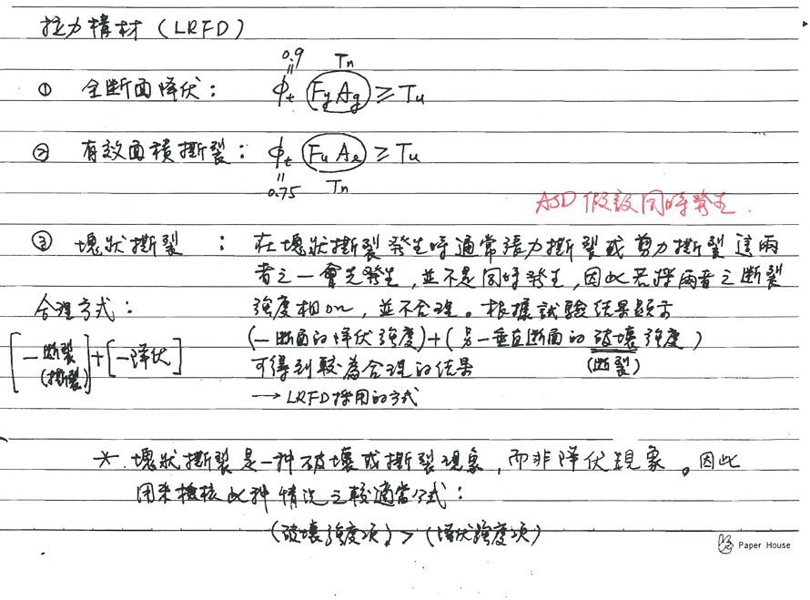
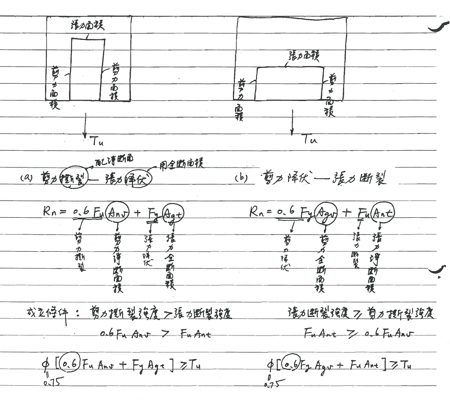
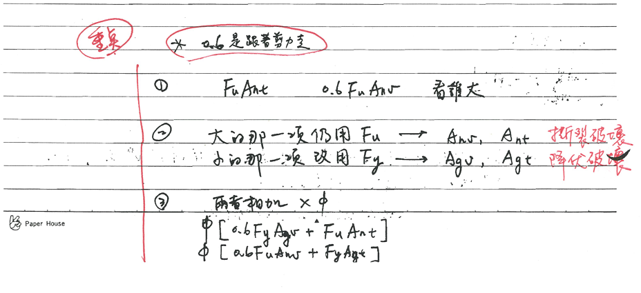

# 考題編號：SS-2015-2

**主分類：** `SS-U1-1` 拉力及壓力桿件
**副分類：** `SS-U1-4` 接合之分析與設計
**設計法：** LRFD
**標籤：** `拉力桿件` `剪力遲滯` `塊狀剪力` `填角銲` `雙槽鋼` `U值` `接合設計` `上限式` `方向性強度` `孔壁承壓` `錯列淨斷面`

---

## 1. 原始題目重述 (Problem Restatement)

**結構描述：**
- 雙槽鋼（2×C200×75）拉力桿，透過連接板與 H 柱翼板接合
- C200×75 斷面：$H \times B \times t_w \times t_f = 200 \times 75 \times 6 \times 12.5$ mm
- 斷面性質：$A = 29.9$ cm²，$C_y = 2.49$ cm
  - ⚠️ **此二值第二題本身並未給定**，係取自**同一份試卷第三題**所列之「單一槽鋼 C200×75：$I_x = 1970$ cm⁴、$I_y = 170$ cm⁴、$A = 29.9$ cm²、$C_y = 2.49$ cm」。兩題斷面相同，援用合理。
  - 若僅由 $200 \times 75 \times 6 \times 12.5$ 作矩形理想化：$A_g = 2(7.5)(1.25) + (20 - 2.5)(0.6) = 18.75 + 10.5 = 29.25$ cm²（差 2.2%，型鋼實際有翼板斜度與圓角）。
- 螺栓：A325，$d_b = 2.5$ cm（高拉力螺栓，承壓型），**共 4 支（縱向 2 排 × 橫向 2 列）**
- 連接板：$t = 1.6$ cm，與 H 柱有效銲長 $L_w = 35$ cm
- 鋼材：A992，$F_y = 3.5$ tf/cm²，$F_u = 4.6$ tf/cm²
- 銲條：E70，$F_{EXX} = 4.9$ tf/cm²
- $E_s = 2040$ tf/cm²



*圖說：雙槽鋼拉力桿接合詳圖（單位：cm）。中央為連接板（gusset），兩側各一根 C200×75，槽鋼**腹板**貼合連接板、翼板朝外，螺栓僅貫穿腹板。螺栓配置（2026-08-22 重新判讀原始試卷確認）：**縱向**（力方向）自槽鋼端緣起 5 cm → 第一排螺栓 → 10 cm → 第二排螺栓 → 7 cm 至連接板邊緣（圖中虛線）；**橫向**（垂直力方向）兩列螺栓間距 $g = 10$ cm（見中央端視圖之「10」尺寸）。故**每根槽鋼腹板上共 4 個螺栓孔（2×2）**。接合長度（縱向最外兩排螺栓中心距）$L = 10$ cm。連接板厚 $t = 1.6$ cm，與 H 柱翼板之填角銲有效銲長 $L_w = 35$ cm（板兩側各一道），銲腳長度 $w$ 待求；拉力 $T$ 之作用線與銲道軸（鉛垂）成 3:4 斜率（與水平夾 36.87°），並通過銲道群形心（無附加偏心彎矩）。$C_y = 2.49$ cm 為單一 C200×75 斷面形心到腹板外面之距離。*

> 🔍 **關鍵圖面判讀更正**：圖中「7 cm」量至一條**虛線**（隱藏線），該虛線為**連接板之邊緣**，非槽鋼之端緣；槽鋼右側有折斷符號表示構材延續。因此對**槽鋼**而言，自由端在左側（端距 5 cm），塊狀撕裂之剪力面長度為 $5 + 10 = 15$ cm，**不是** 7 cm 側。舊版解析誤將 7 cm 當成槽鋼端距並據以取拉力面，須更正（見 §4 極限狀態三）。



*圖說：題目提供參考公式。【淨寬】$w_n = w_g - \sum d_h + \sum \frac{s^2}{4g}$。【拉力設計強度】$T_{ds} = 0.9F_yA_g$（GSY）；$T_{ds} = 0.75F_uA_e$（NSF），$U = 0.9, 0.85, 0.75$。【塊狀剪力（BSR）】當 $F_uA_{nt} \geq 0.6F_uA_{nv}$：$\phi R_n = \phi[0.6F_yA_{gv} + F_uA_{nt}] \leq \phi[0.6F_uA_{nv} + F_uA_{nt}]$；當 $0.6F_uA_{nv} \geq F_uA_{nt}$：$\phi R_n = \phi[0.6F_uA_{nv} + F_yA_{gt}] \leq \phi[0.6F_uA_{nv} + F_uA_{nt}]$。【填角銲】$\phi R_n = (0.75)(0.6F_{EXX})(t)(L)$，$t = 0.707w$。*

**子問題：**
1. 求此拉力桿的**設計強度**（20 分）
2. 若連接板強度足夠，求設計**填角銲銲腳長度** $w$（10 分）

---

## 2. 考題核心精神與出題者意圖 (Core Concepts & Examiner's Intent)

**核心觀念：拉力桿件三重極限狀態 × 接合反算設計**

拉力桿件設計必須同時評估三個互相競爭的破壞模式，取最脆弱者（最小值）為設計強度。第二小題再以此強度「反推」銲腳尺寸，測驗完整的接合設計流程。

**出題者測驗重點：**
- **GSY**：全斷面降伏（$A_g$ 使用全斷面，$\phi = 0.9$）
- **NSF**：淨斷面斷裂（用 $U$ 折減，$\phi = 0.75$）；雙槽鋼只有腹板接觸螺栓 → 剪力遲滯必考
- **BSR**：塊狀剪力（識別破壞路徑、正確選用 $F_uA_{nt}$ vs $F_yA_{gt}$ 的條件公式）
- **填角銲**：從需求強度反算銲腳尺寸，並與最小銲腳尺寸取較大值

---

## 3. 解題戰略地圖與陷阱分析 (Strategic Roadmap & Trap Analysis)

**作戰計畫：**
```
Step 1  整理幾何：斷面尺寸（mm→cm）、孔徑 dh、螺栓排列
Step 2  GSY：最快，φt × Fy × (2Ag)
Step 3  NSF：An（扣 2 孔，橫向 gauge 10cm）→ U = 0.75（規範表列）→ Ae = U·An
         → φt × Fu × (2Ae)
Step 4  BSR：先定自由端（5cm 側）→ 剪力面 2 條（長 15cm，扣 1.5 孔）
         → 拉力面 1 條（寬 g=10cm，扣 1 孔）→ 比較 FuAnt vs 0.6FuAnv
         → 選對條件公式 → 再與上限取小 → 乘 2（雙槽鋼）
Step 5  取三者最小值 = 設計強度
Step 6  填角銲：φRn = 0.75 × 0.6FEXX × 0.707w × (2 × 35) ≥ 設計強度 → 解 w
```

**陷阱分析：**

| 陷阱 | 說明 | 對策 |
|------|------|------|
| ❶ 忘記乘 2 | C200×75 是單根性質，需 ×2 | 每步計算完單根後立即標註 ×2 |
| ❷ 螺栓孔徑 | 標準孔 = $d_b + 0.3$ cm | $d_h = 2.5 + 0.3 = 2.8$ cm |
| ❸ NSF 扣孔數 | 橫向臨界截面同時穿過**同一縱向位置之 2 個孔**（橫向間距 $g = 10$ cm）；**不是** 1 孔 | $A_n = A_g - \mathbf{2} \times d_h \times t_w$ |
| ❹ BSR 條件公式選錯 | 比較 $F_uA_{nt}$ 與 $0.6F_uA_{nv}$，**較大者配 Fu（淨面積），較小者改用 Fy（全面積）**；且**兩式均受上限拘束** | 先判斷哪個大，再套對應公式，最後與上限取小 |
| ❺ BSR 破壞塊之方位 | 剪力面沿**兩條螺栓列線**由槽鋼自由端（5 cm 側）延伸至最遠一排螺栓（長 15 cm）；拉力面為**通過最遠一排螺栓、寬度等於橫向間距 $g$** 之橫斷面 | 先確認自由端在哪一側（本題為 5 cm 側），再畫塊 |
| ❻ 銲道兩側 | 連接板兩側各一道填角銲，有效總長 = 2 × 35 = 70 cm | $\phi R_n = 0.75 \times 0.6F_{EXX} \times 0.707w \times 70$ |
| ❼ 最小銲腳尺寸查錯 | 台灣規範表 10.2-4：$12 < t \le 19$ mm → 最小 **6 mm**（$19 < t \le 38$ mm 才是 8 mm） | 連接板 16 mm ⇒ 最小 6 mm，本題由**強度**控制 |

---

## 3.5 變數層次分析（Variable Hierarchy Analysis）

> 複習提示：解題後，在每個卡住的知識點「卡關?」欄標記 `⚠`；第二次複習時只看有 `⚠` 的項目。

**最終目標：** 三種極限狀態（GSY / NSF / BSR）取最小值為設計強度 → 反算填角銲銲腳尺寸 $w$

### 主要公式（$\boxed{\phantom{x}}$ = 未知，待推導）

$$\phi_t P_n^{(GSY)} = 0.9 F_y (2A_g)$$

$$\boxed{A_e} = \boxed{U} \cdot \boxed{A_n}, \quad \phi_t P_n^{(NSF)} = 0.75 F_u (2\boxed{A_e})$$

$$\boxed{\phi R_n^{(BSR)}} = 0.75 \times \min\!\left(0.6 F_u \boxed{A_{nv}} + F_y \boxed{A_{gt}},\;\; 0.6F_u\boxed{A_{nv}} + F_u\boxed{A_{nt}}\right) \times 2$$

$$\boxed{\phi_t P_n} = \min\left(\phi_t P_n^{(GSY)},\ \phi_t P_n^{(NSF)},\ \phi R_n^{(BSR)}\right)$$

$$\boxed{w} \geq \frac{\boxed{\phi_t P_n}}{0.75 \times 0.6 F_{EXX} \times 0.707 \times 2L_w}$$

### L1：題目直接給定

| 符號 | 數值 | 說明 |
|------|------|------|
| $A_g$（單根） | 29.9 cm² | C200×75 斷面積（取自同卷第三題） |
| $C_y$ | 2.49 cm | 形心到腹板外面距離（同卷第三題） |
| $t_w$ | 0.6 cm | 腹板厚度 |
| $t_f$ | 1.25 cm | 翼板厚度 |
| $d_b$ | 2.5 cm | 螺栓直徑 |
| $L_w$ | 35 cm | 連接板有效銲長（各側） |
| $F_y$ | 3.5 tf/cm² | 降伏應力（A992） |
| $F_u$ | 4.6 tf/cm² | 抗拉強度（A992） |
| $F_{EXX}$ | 4.9 tf/cm² | 銲條抗拉強度（E70） |
| $e_1$ | 5 cm | **槽鋼自由端**至第一排螺栓（縱向端距） |
| $s$ | 10 cm | 縱向螺栓間距（＝接合長度 $L$） |
| $e_2$ | 7 cm | 第二排螺栓至**連接板邊緣**（虛線；非槽鋼端距） |
| $g$ | 10 cm | 橫向螺栓間距（gauge） |
| $T$ 之方向 | 3:4（與水平 36.87°） | 與鉛垂銲道軸夾 53.13° |

### L2：需知識點推導

**Step 1：幾何整理**

| 符號 | 公式 / 來源 | 卡關? |
|------|------------|:-----:|
| $d_h$ | $d_b + 0.3 = 2.8$ cm（標準孔） | |
| 接合長度 $L$ | 縱向螺栓間距 = 10 cm | |

**Step 2：GSY 全斷面降伏**

| 符號 | 公式 / 來源 | 卡關? |
|------|------------|:-----:|
| $\phi_t P_n^{(GSY)}$ | $0.9 \times 3.5 \times (2 \times 29.9) = 188.4$ tf | |

**Step 3：NSF 淨斷面斷裂**

| 符號 | 公式 / 來源 | 卡關? |
|------|------------|:-----:|
| $A_n$ | $A_g - \mathbf{2} \times d_h \times t_w = 29.9 - 3.36 = 26.54$ cm²（橫斷面切過 2 孔） | |
| $U$（規範表列） | 每線 2 個螺栓 → $U = 0.75$（試卷參考公式僅列 0.9 / 0.85 / 0.75） | |
| $U$（AISC 公式） | $1 - \bar{x}/L = 1 - C_y/L = 1 - 2.49/10 = 0.751$（幾乎同值） | |
| $A_e$ | $0.75 \times 26.54 = 19.905$ cm²（單根） | |
| $\phi_t P_n^{(NSF)}$ | $0.75 \times 4.6 \times (2 \times 19.905) = 137.3$ tf | |

**Step 4：BSR 塊狀剪力**（破壞塊：兩條縱向剪力面 + 一條橫向拉力面）

| 符號 | 公式 / 來源 | 卡關? |
|------|------------|:-----:|
| 剪力面長度 | $e_1 + s = 5 + 10 = 15$ cm（自槽鋼自由端至最遠一排螺栓） | |
| $A_{gv}$（全剪力面） | $2 \times 15 \times 0.6 = 18.0$ cm² | |
| $A_{nv}$（淨剪力面） | $2 \times [15 - 1.5 d_h] \times t_w = 2 \times 10.8 \times 0.6 = 12.96$ cm²（每面切 1 整孔 + 1 半孔） | |
| $A_{gt}$（全拉力面） | $g \times t_w = 10 \times 0.6 = 6.0$ cm² | |
| $A_{nt}$（淨拉力面） | $(g - 2 \times d_h/2) \times t_w = 7.2 \times 0.6 = 4.32$ cm² | |
| 判斷控制模式 | $F_uA_{nt} = 19.87 < 0.6F_uA_{nv} = 35.77$ → 剪力斷裂 + 張力降伏（第二式） | |
| 第二式 $R_n$ | $0.6F_uA_{nv} + F_yA_{gt} = 35.77 + 21.00 = 56.77$ tf | |
| 上限 $R_n$ | $0.6F_uA_{nv} + F_uA_{nt} = 35.77 + 19.87 = 55.64$ tf → **上限控制** | |
| $\phi R_n$（單根） | $0.75 \times 55.64 = 41.73$ tf | |
| $\phi R_n^{(BSR)}$（雙根） | $2 \times 41.73 = 83.5$ tf | |

**Step 5：設計強度 & 填角銲**

| 符號 | 公式 / 來源 | 卡關? |
|------|------------|:-----:|
| $\phi_t P_n$ | $\min(188.4,\ 137.3,\ 83.5) = 83.5$ tf（BSR 控制） | |
| $w$ 需求 | $83.46 / (0.75 \times 0.6 \times 4.9 \times 0.707 \times 70) = 83.46/109.13 = 0.765$ cm $= 7.65$ mm | |
| 最小銲腳 | 表 10.2-4：較厚板 16 mm（$12 < t \le 19$）→ **6 mm** | |
| $w$ 取用 | $\max(7.65,\ 6) = 7.65$ mm → 進位取 **8 mm**（強度控制） | |

### L3：深層知識（不懂就卡住）

| 知識點 | 說明 | 補強頁 | 卡關? |
|--------|------|:------:|:-----:|
| 剪力遲滯 U 值：表列 vs 公式 | 台灣 2010 規範／本試卷僅列 $U = 0.9 / 0.85 / 0.75$（依斷面型式與每線螺栓數）；$U = 1 - \bar{x}/L$ 為 AISC 360-05 起之公式，$\bar{x} = C_y$（槽鋼僅腹板連接） | [[shear-lag-u]] · [[SHEAR-LAG]] | |
| BSR 條件公式選擇 | 比較 $F_uA_{nt}$ 與 $0.6F_uA_{nv}$：較大者用淨面積+Fu，較小者改全面積+Fy；**兩式都要再與上限 $0.6F_uA_{nv}+F_uA_{nt}$ 取小**（本題即由上限控制） | [[block-shear]] · [[BLOCK-SHEAR-RUPTURE]] | |
| BSR 幾何從「自由端」畫起 | 剪力面自**構材自由端**沿螺栓列線量至最遠一排螺栓；拉力面寬度為橫向間距 $g$。判錯自由端是本題最大陷阱 | [[block-shear]] | |
| 剪力面之扣孔為 $1.5 d_h$ | 剪力面通過第 1 孔（整孔）與第 2 孔（僅半孔，因面終止於孔心）⇒ 共扣 1.5 個孔徑 | | |
| 雙槽鋼需乘 2 | 所有單根計算完後，設計強度乘以 2（GSY、NSF、BSR 均需）| | |
| 螺栓孔徑扣 $d_b + 0.3$ | 標準孔，強度計算時扣孔徑 = $d_b + 0.3$ cm（不是 $d_b$）；AISC 360-16 為 $d_b + 1/8''= d_b + 0.318$ cm，實質同值 | | |
| 填角銲最小銲腳尺寸 | 台灣表 10.2-4：$t \le 6 \to 3$；$6 < t \le 12 \to 5$；$12 < t \le 19 \to \mathbf{6}$；$19 < t \le 38 \to 8$ mm。與計算需求取較大值 | | |

---

## 4. 步驟化詳細計算過程 (Step-by-Step Detailed Calculation)



*圖說：U 值計算整理。查表法：① W/H/S/T 型鋼翼板連接，沿力方向每排 ≥3 個螺栓 → U=0.9；② 其他斷面（含槽鋼）每排 ≥3 個螺栓 → U=0.85；③ 每排 2 個螺栓 → U=0.75。公式法：$U = 1 - \bar{x}/L$（$\bar{x}$ 為斷面形心到剪力傳力面之距離，$L$ 為接合縱向長度）；C 型鋼只有腹板連接時 $\bar{x} = C_y$。*

> 📌 **規範版本提醒**：筆記所寫「兩者取較大值」是 **AISC 360-05 之後**的規定。台灣 2010 規範與本試卷第三頁參考公式**只列表列值** $U = 0.9 / 0.85 / 0.75$，並未給公式法。本題兩法為 0.75 vs 0.751（差 0.13%），作答依表列值 0.75 為宜（詳 §5 爭議三、§6.1）。



*圖說：三種極限狀態概念。GSY：全斷面降伏，$\phi=0.9$，$P_n = F_yA_g$。NSF：有效淨截面斷裂，$\phi=0.75$，$P_n = F_uA_e = F_u U A_n$。BSR：塊狀剪力，$\phi=0.75$；兩條判斷規則：(a) $F_uA_{nt} \geq 0.6F_uA_{nv}$ → 張力斷裂 + 剪力降伏：$R_n = 0.6F_yA_{gv} + F_uA_{nt}$；(b) $0.6F_uA_{nv} > F_uA_{nt}$ → 剪力斷裂 + 張力降伏：$R_n = 0.6F_uA_{nv} + F_yA_{gt}$。兩種情況均有上限：$R_n \leq 0.6F_uA_{nv} + F_uA_{nt}$。*

### 基本幾何整理

| 參數 | 單位換算 | 結果 |
|------|----------|------|
| $H = 200$ mm | → cm | 20.0 cm |
| $B = 75$ mm | → cm | 7.5 cm |
| $t_w = 6$ mm | → cm | 0.6 cm |
| $t_f = 12.5$ mm | → cm | 1.25 cm |
| $A_g$（單根） | 同卷第三題 | 29.9 cm² |
| $C_y$（形心到腹板外面） | 同卷第三題 | 2.49 cm |
| $d_h = d_b + 0.3$ | $= 2.5 + 0.3$ | 2.8 cm |
| 接合長度 $L$ | 縱向螺栓間距 | 10 cm |
| 槽鋼端距 $e_1$ | 圖讀（自由端側） | 5 cm |
| 至連接板邊緣 $e_2$ | 圖讀（虛線） | 7 cm |
| 橫向間距 $g$ | 圖讀（端視圖） | 10 cm |
| 螺栓數 | 縱向 2 排 × 橫向 2 列 | 4 支 |

---

### Part (一)：拉力桿設計強度

#### 極限狀態一：全斷面降伏（GSY）

$$\phi_t P_n = \phi_t F_y (2 A_g) = 0.9 \times 3.5 \times (2 \times 29.9) = 0.9 \times 3.5 \times 59.8 = \boxed{188.4 \text{ tf}}$$

> 策略註解：GSY 使用**全斷面積**，不扣孔，不考慮剪力遲滯。此值通常是三者中最大的。

---

#### 極限狀態二：淨斷面斷裂（NSF）

**淨斷面積 $A_n$（單根槽鋼）：**

⚠️ **本項為舊版解析之錯誤所在。** 腹板上螺栓為 **2×2** 配置（橫向間距 $g = 10$ cm），故任一垂直於力方向之橫斷面**同時切過 2 個孔**，不是 1 個：

$$A_n = A_g - \mathbf{2} \times d_h \times t_w = 29.9 - 2 \times 2.8 \times 0.6 = 29.9 - 3.36 = \boxed{26.54 \text{ cm}^2}$$

**錯列（stagger）路徑交叉驗核**——依試卷參考公式 $w_n = w_g - \sum d_h + \sum \dfrac{s^2}{4g}$：

| 破壞路徑 | 扣除量 |
|---------|-------|
| 直線（切 2 孔，同一縱向位置） | $2 d_h = 5.60$ cm |
| 斜線（由 (5, +5) 至 (15, −5)，切 2 孔並回加 $s^2/4g$） | $2 d_h - \dfrac{10^2}{4 \times 10} = 5.60 - 2.50 = 3.10$ cm |

直線扣除 5.60 cm > 斜線 3.10 cm ⇒ **直線斷面控制** ✓（無需考慮錯列）

**剪力遲滯係數 $U$：**

雙槽鋼只有**腹板**連接至螺栓，翼板力流需繞過，發生剪力遲滯。

**本試卷第三頁參考公式明載** $U = 0.9,\ 0.85,\ 0.75$ 三個表列值（並未給 $U = 1-\bar{x}/L$ 公式），與台灣 2010 規範一致：

| 情況 | $U$ |
|------|-----|
| W/S/H 型鋼翼板連接，$b_f \ge 2d/3$，每線 ≥ 3 螺栓 | 0.90 |
| 其他斷面（含槽鋼），每線 ≥ 3 螺栓 | 0.85 |
| **每線 2 個螺栓（本題）** | **0.75** |

$$\boxed{U = 0.75}$$

*交叉驗核（AISC 360-05 起之公式法，見 §6）：*
$$U = 1 - \frac{\bar{x}}{L} = 1 - \frac{C_y}{L} = 1 - \frac{2.49}{10} = 0.751$$
兩者差 0.13%，實質同值。$\bar{x} = C_y = 2.49$ cm 為斷面形心到**剪力傳力面**（腹板外面）之距離；$L = 10$ cm 為縱向最外兩排螺栓中心距。

**有效淨斷面積：**
$$A_e = U \cdot A_n = 0.75 \times 26.54 = 19.905 \text{ cm}^2 \text{（單根）}$$

**設計強度：**
$$\phi_t P_n = 0.75 \times F_u \times (2 A_e) = 0.75 \times 4.6 \times (2 \times 19.905) = 0.75 \times 4.6 \times 39.81 = \boxed{137.3 \text{ tf}}$$

*（若採 $U = 0.751$：137.5 tf，差 0.13%）*

---

#### 極限狀態三：塊狀剪力破壞（BSR）



*圖說：手寫筆記，塊狀撕裂兩種破壞路徑圖解（無具體數值）。上方兩幅示意圖畫出破壞塊：**兩側為剪力面（平行於 $T_u$）、遠端一條為張力面（垂直於 $T_u$）**——與本題更正後所採之幾何一致。(a)「剪力斷裂—張力降伏」：$R_n = 0.6F_u A_{nv} + F_y A_{gt}$（剪力用淨斷面積、張力用全斷面積），成立條件 $0.6F_uA_{nv} \ge F_uA_{nt}$，設計式 $\phi[0.6F_uA_{nv} + F_yA_{gt}] \ge T_u$，$\phi = 0.75$。(b)「剪力降伏—張力斷裂」：$R_n = 0.6F_y A_{gv} + F_u A_{nt}$，成立條件 $F_uA_{nt} \ge 0.6F_uA_{nv}$，設計式 $\phi[0.6F_yA_{gv} + F_uA_{nt}] \ge T_u$。筆記中圈註「$A_{nv}, A_{nt}$ → 斷裂破壞；$A_{gv}, A_{gt}$ → 降伏破壞」。*

> 📌 **筆記未含之規範細節**：試卷參考公式在兩式後方均加註上限 $\le \phi[0.6F_uA_{nv} + F_uA_{nt}]$。本題即由此上限控制（見下方計算與 §5 爭議二），手寫筆記未涵蓋此點。

**破壞路徑幾何（單根槽鋼腹板）—— 已依重新判讀之圖面更正：**

槽鋼腹板上有 **2×2 = 4 個螺栓**（縱向間距 $s = 10$ cm、橫向間距 $g = 10$ cm）。$T$ 將槽鋼往右拉，螺栓對腹板施加**向左**之承壓力，故破壞塊往**左側自由端（$e_1 = 5$ cm 一側）**擠出：

- **剪力面（2 條，平行於力）**：沿上、下兩條螺栓列線，自槽鋼自由端（$x=0$）延伸至最遠一排螺栓（$x=15$ cm）
- **拉力面（1 條，垂直於力）**：通過最遠一排螺栓、寬度等於橫向間距 $g = 10$ cm

```
   T 之反向（螺栓推腹板向左）  ←──
   x=0        x=5        x=15
    │          │           │
────┼──────────●───────────●────────  ← 剪力面①（上列螺栓線） y=+5
    │                      ┃
    │      破壞塊          ┃ 拉力面（寬 g=10 cm）
    │                      ┃
────┼──────────●───────────●────────  ← 剪力面②（下列螺栓線） y=−5
    ↑                      ↑
  槽鋼自由端            最遠一排螺栓
  （剪力面長 5+10 = 15 cm）
```

**剪力全／淨面積（2 個剪力面）：**

每個剪力面長度 $= e_1 + s = 5 + 10 = 15$ cm。剪力面通過第 1 孔（**整孔**）與第 2 孔（**僅半孔**，因剪力面終止於該孔心）：

$$A_{gv} = 2 \times 15 \times t_w = 2 \times 15 \times 0.6 = \boxed{18.0 \text{ cm}^2}$$

$$A_{nv} = 2 \times \left[15 - 1.5\,d_h\right] \times t_w = 2 \times [15 - 1.5 \times 2.8] \times 0.6 = 2 \times 10.8 \times 0.6 = \boxed{12.96 \text{ cm}^2}$$

**拉力全／淨面積（1 個拉力面，寬度 = $g$，兩端各扣半孔）：**

$$A_{gt} = g \times t_w = 10 \times 0.6 = \boxed{6.0 \text{ cm}^2}$$

$$A_{nt} = \left(g - 2 \times \frac{d_h}{2}\right) \times t_w = (10 - 2.8) \times 0.6 = 7.2 \times 0.6 = \boxed{4.32 \text{ cm}^2}$$

**判斷哪個破壞模式控制：**
$$F_u A_{nt} = 4.6 \times 4.32 = 19.87 \text{ tf}$$
$$0.6 F_u A_{nv} = 0.6 \times 4.6 \times 12.96 = 35.77 \text{ tf}$$

因 $0.6 F_u A_{nv}\ (35.77) > F_u A_{nt}\ (19.87)$ → **剪力斷裂 + 張力降伏**（試卷參考公式第二式）

$$\phi R_n = \phi \left[0.6 F_u A_{nv} + F_y A_{gt}\right] \leq \phi \left[0.6 F_u A_{nv} + F_u A_{nt}\right]$$

$$\text{第二式：} \; 0.6F_uA_{nv} + F_yA_{gt} = 35.77 + 3.5 \times 6.0 = 35.77 + 21.00 = 56.77 \text{ tf}$$

$$\text{上限：} \; 0.6F_uA_{nv} + F_uA_{nt} = 35.77 + 19.87 = 55.64 \text{ tf}$$

⚠️ **上限（55.64）小於第二式（56.77）⇒ 本題由上限控制**（此為易漏之細節：兩條件式皆受上限拘束）：

$$\phi R_n = 0.75 \times 55.64 = 41.73 \text{ tf/根}$$

**雙槽鋼 BSR 強度：**
$$\phi R_n = 2 \times 41.73 = \boxed{83.5 \text{ tf}}$$

> 策略註解：條件二（剪力斷裂 + 張力降伏）中，剪力面用 $F_u \times A_{nv}$（淨面積、斷裂），張力面用 $F_y \times A_{gt}$（全面積、降伏）。切記「**0.6 跟著剪力走**」，是哪種破壞（斷裂 or 降伏）就配對應的面積；最後**務必再與上限取小**。

---

#### 三種極限狀態比較

| 極限狀態 | 公式 | 設計強度 |
|---------|------|---------|
| GSY 全斷面降伏 | $0.9 F_y (2A_g)$ | 188.4 tf |
| NSF 淨斷面斷裂 | $0.75 F_u (2A_e)$ | 137.3 tf |
| **BSR 塊狀剪力（控制）** | $0.75 \times 2 \times \min(\text{式二},\ \text{上限})$ | **83.5 tf** |

$$\boxed{\phi P_n = 83.5 \text{ tf，由塊狀剪力破壞控制}}$$

**接合端補充檢核（試卷參考公式未列，但實務必須；見 §5）：**

| 項目 | 設計強度 | 是否控制 |
|------|---------|---------|
| 螺栓雙剪（A325，螺紋在剪力面 N） | 99.0 tf | 否 |
| 螺栓雙剪（A325，螺紋不在剪力面 X） | 123.8 tf | 否 |
| 腹板孔壁承壓／撕出（雙根合計） | 85.5 tf | 否（僅高於 BSR 2.4%） |

三者皆 > 83.5 tf，故 **BSR 仍為控制模式**。

---

### Part (二)：填角銲銲腳長度 $w$

**銲道設計：**
- 連接板兩側各一道填角銲（對稱），有效銲長各 35 cm
- 銲道需傳遞拉力桿設計強度：$T = 83.46$ tf
- 由圖面，$T$ 之作用線通過銲道群形心（35 cm 之中點），故**無附加偏心彎矩**，僅需檢核合成剪力

**填角銲強度公式（試卷參考公式，有效喉厚 $t = 0.707w$）：**
$$\phi R_n = (0.75)(0.6 F_{EXX})(0.707w)(L_{total})$$

其中總有效銲長 $L_{total} = 2 \times 35 = 70$ cm（兩側各 35 cm）：

$$\phi R_n = 0.75 \times 0.6 \times 4.9 \times 0.707w \times 70 = 2.205 \times 49.49 \times w = 109.13\,w \quad (w \text{ in cm})$$

**解 $w$：**
$$109.13\,w \geq 83.46 \text{ tf}$$
$$w \geq \frac{83.46}{109.13} = 0.765 \text{ cm} = 7.65 \text{ mm}$$

**最小／最大銲腳尺寸確認：**

| 檢核 | 依據 | 結果 |
|------|------|------|
| 最小銲腳 | 台灣規範表 10.2-4：較厚板 $t = 16$ mm 落在 $12 < t \le 19$ → 最小 **6 mm** | 7.65 > 6 ✓ **強度控制** |
| 最大銲腳（沿板緣） | $t \ge 6$ mm 時 $w \le t - 2 = 14$ mm | 8 ≤ 14 ✓ |

⚠️ 舊版解析稱「$t > 12$ mm 時最小銲腳 = 8 mm，故由最小規定控制」，係誤查規範表（$19 < t \le 38$ mm 才是 8 mm）。本題最終答案相同，但**控制理由不同**：是強度需求 7.65 mm 進位而得，非規範最小值。

$$\boxed{w = 8 \text{ mm} = 0.8 \text{ cm}}$$

**驗算：** $\phi R_n = 109.13 \times 0.8 = 87.3 \text{ tf} > 83.5 \text{ tf}$ ✓

**母材檢核（連接板沿銲道之剪力）：**
$$\phi R_n = 0.75 \times 0.6 F_u \times t_p L_w = 0.75 \times 0.6 \times 4.6 \times 1.6 \times 35 = 115.9 \text{ tf} > 83.5 \; \checkmark$$
$$\phi R_n = 1.0 \times 0.6 F_y \times t_p L_w = 1.0 \times 0.6 \times 3.5 \times 1.6 \times 35 = 117.6 \text{ tf} > 83.5 \; \checkmark$$



*圖說：手寫筆記【重點】「0.6 是跟著剪力走」。① 比較 $F_uA_{nt}$ 與 $0.6F_uA_{nv}$，「看誰大」；② 大的那一項仍用 $F_u$ → 配 $A_{nv}$、$A_{nt}$（斷裂破壞）；小的那一項改用 $F_y$ → 配 $A_{gv}$、$A_{gt}$（降伏破壞）；③ 兩者相加後乘 $\phi$，並列出兩式 $\phi[0.6F_yA_{gv} + F_uA_{nt}]$ 與 $\phi[0.6F_uA_{nv} + F_yA_{gt}]$。筆記為通則整理，不含本題數值，亦未列上限式。*

**套用於本題：** $0.6F_uA_{nv} = 35.77$ tf $>$ $F_uA_{nt} = 19.87$ tf → 剪力斷裂（用 $F_u A_{nv}$）+ 張力降伏（用 $F_y A_{gt}$），得 56.77 tf；再與上限 55.64 tf 取小 ⇒ **55.64 tf/根**。

---

## 5. 關鍵爭議點與進階探討 (Critical Issues & Advanced Discussion)

**爭議一（本次最重要更正）：BSR 破壞塊之幾何**

舊版解析把腹板螺栓誤讀為「1 排縱向 2 支」，因而：
1. 把**拉力面**放在「最遠螺栓到 7 cm 板端」——但 7 cm 是量到**連接板邊緣的虛線**，不是槽鋼端緣；
2. 完全未使用**橫向間距 $g = 10$ cm**（拉力面的真正寬度）；
3. 剪力面之扣孔寫成「各扣 2 孔」但數值代 $2 \times 1.4 = 2.8$（實為 1 個孔徑），符號與數值不一致。

更正後之幾何與結果對照：

| 項目 | 舊版 | 本版（更正） |
|------|------|------------|
| 剪力面長度 | 15 cm | 15 cm（同） |
| 剪力面扣孔 | $1.0\,d_h$ | $1.5\,d_h$（1 整孔 + 1 半孔） |
| $A_{nv}$ | 14.64 cm² | **12.96 cm²** |
| 拉力面 | $e_2 - d_h/2 = 5.6$ cm（誤用 7 cm 側） | $g - d_h = 7.2$ cm（通過最遠一排螺栓） |
| $A_{nt}$ | 3.36 cm² | **4.32 cm²** |
| $A_{gt}$ | 4.2 cm² | **6.0 cm²** |
| 控制式 | 第二式 41.33 tf/根 | **上限式 41.73 tf/根** |
| BSR（雙根） | 82.7 tf | **83.5 tf** |

雖然最終數值僅差 1.0%（幾何的兩處誤差恰好部分相消），但**破壞機構的物理圖像完全不同**，若題目改變 $g$ 或 $e_1$，舊版會給出嚴重錯誤的答案。

**爭議二：兩條件式皆受上限拘束（本題由上限控制）**

試卷參考公式兩式後方均寫有 $\le \phi[0.6F_uA_{nv} + F_uA_{nt}]$。本題：

$$\text{式二} = 56.77 \text{ tf} \;>\; \text{上限} = 55.64 \text{ tf} \;\Rightarrow\; \text{取上限}$$

物理意義：張力面若以 $F_y A_{gt}$（降伏 × 全面積）計得的貢獻 21.00 tf 超過其斷裂能力 $F_u A_{nt} = 19.87$ tf，即為不合理，故以斷裂值封頂。

**爭議三：$U$ 值——表列 vs 公式**

本試卷第三頁參考公式**只給表列值** $U = 0.9 / 0.85 / 0.75$（與台灣 2010 規範一致，源自 AISC LRFD 1993）。$U = 1 - \bar{x}/L$ 是 AISC 360-05 才納入之公式（Table D3.1 Case 2）。

本題兩者為 0.75 vs 0.751，差 0.13%，對答案（137.3 vs 137.5 tf）與最終控制模式（BSR 83.5 tf）皆無影響。**作答建議依試卷給定之表列值 0.75**，並可註明公式法亦得 0.751。

**爭議四：$A_g$ 之取值**

第二題本身未給 $A_g$。若考生未注意到第三題已列 $A = 29.9$ cm²，而自行以 $200 \times 75 \times 6 \times 12.5$ 矩形理想化得 29.25 cm²，則：

| $A_g$ | GSY | NSF | BSR | 設計強度 |
|-------|-----|-----|-----|---------|
| 29.9 cm²（本文） | 188.4 | 137.3 | 83.5 | **83.5 tf** |
| 29.25 cm²（矩形化） | 184.3 | 130.6 | 83.5 | **83.5 tf** |

因 BSR 只用腹板局部面積、與 $A_g$ 無關，**設計強度不受影響**——這是本題的幸運之處。

**補充檢核：螺栓剪力與孔壁承壓（試卷未列，實務必要）**

$A_b = \pi (2.5)^2/4 = 4.909$ cm²，4 支螺栓、雙剪（每支貫穿槽鋼—連接板—槽鋼，2 個剪力面）：

| 項目 | 計算 | 結果 |
|------|------|------|
| 螺栓剪力（N，$F_v = 0.4F_u^b = 3.36$） | $0.75 \times 4 \times 2 \times 4.909 \times 3.36$ | 99.0 tf |
| 螺栓剪力（X，$F_v = 0.5F_u^b = 4.20$） | $0.75 \times 4 \times 2 \times 4.909 \times 4.20$ | 123.8 tf |
| 承壓：端螺栓 $L_c = 5 - 1.4 = 3.6$ | $\min(1.2 L_c t_w F_u,\ 2.4 d t_w F_u) = \min(11.92,\ 16.56)$ | 11.92 tf/支 |
| 承壓：內螺栓 $L_c = 10 - 2.8 = 7.2$ | $\min(23.85,\ 16.56)$ | 16.56 tf/支 |
| 承壓合計（2 根槽鋼） | $0.75 \times 2 \times (2 \times 11.92 + 2 \times 16.56)$ | 85.5 tf |

$A_{325}$ 之 $F_u^b = 8.4$ tf/cm²。三者皆 > 83.5 tf ⇒ **BSR 仍控制**，惟承壓僅高出 2.4%，屬同一量級，實務上應一併列出。

**進階：為何 BSR 遠低於 NSF？**

BSR = 83.5 tf vs NSF = 137.3 tf，差 1.6 倍。原因：BSR 涉及的有效受力面積（$A_{nv}$、$A_{nt}$）都是**腹板局部面積**（$t_w = 0.6$ cm，總計不到 20 cm²），而 NSF 的 $A_n$ 是**整個斷面**的淨面積（26.5 cm²）並乘 $F_u$。雙槽鋼僅腹板連接，腹板局部面積小，故 BSR 往往控制。

此結果提示：提高拉力桿強度最有效的途徑是**改善接合詳圖**（增加縱向螺栓排數以拉長剪力面、或加大橫向間距 $g$ 以加寬拉力面），而非單純換用更強的鋼材。試算：若縱向改為 3 排（$s = 10$ cm ×2），剪力面長 25 cm，$A_{nv} = 2(25 - 2.5 \times 2.8)(0.6) = 21.6$ cm²，$0.6F_uA_{nv} = 59.6$ tf，BSR 升至約 119 tf，且 $U$ 可由 0.75 提高至 0.85。

---

## 6. 依最新規範（AISC 360-16／-22）對照

> **本題主答案所依規範**：內政部「鋼構造建築物鋼結構設計技術規範」民國 99 年（2010）修正版之**鋼結構極限設計法**（第五章受拉構材、第十章接合設計）。本試卷第一頁注意事項（四）明載：「作答請採用內政部發布 2010 年『鋼結構設計技術規範』為原則，並依題目指定設計法作答。」故以下 AISC 對照僅供延伸理解。

### 6.1 有效淨斷面積 $U$：表列 → 公式

| 項目 | 台灣 2010／AISC LRFD 1993 | AISC 360-05 起（至 -22） |
|------|--------------------------|------------------------|
| 規定形式 | **表列** $U = 0.90 / 0.85 / 0.75$ | **Table D3.1 分 8 種 Case** |
| 槽鋼僅腹板連接 | 每線 2 螺栓 → $U = 0.75$ | Case 2：$U = 1 - \bar{x}/L$ |
| 本題數值 | **0.75** | $1 - 2.49/10 = 0.751$ |
| NSF 設計強度 | **137.3 tf** | 137.5 tf |

360-05 起改為公式法的意義：表列值對「接合長度很長」的情形過於保守（$L$ 越長，剪力遲滯越輕微，$U \to 1$）。本題 $L$ 僅 10 cm 而 $C_y = 2.49$ cm，兩法恰好同值。

### 6.2 塊狀撕裂：二式 → 單式（本題同值！）

| 項目 | 台灣 2010（本試卷參考公式） | AISC 360-05 起 §J4.3 式 (J4-5) |
|------|--------------------------|------------------------------|
| 形式 | **兩條件式**（依 $F_uA_{nt}$ 與 $0.6F_uA_{nv}$ 大小分歧），各受上限拘束 | **單一式**：$R_n = 0.60F_uA_{nv} + U_{bs}F_uA_{nt} \le 0.60F_yA_{gv} + U_{bs}F_uA_{nt}$ |
| 張力面係數 | — | $U_{bs} = 1.0$（張力均勻）／0.5（不均勻） |
| $\phi$ | 0.75 | 0.75（$\Omega = 2.00$） |

本題代入 AISC 單式（$U_{bs} = 1.0$）：

$$R_n = 35.77 + 19.87 = 55.64 \text{ tf};\qquad \text{上限} = 0.6(3.5)(18.0) + 19.87 = 37.80 + 19.87 = 57.67 \text{ tf}$$

$$\Rightarrow R_n = 55.64 \text{ tf} \;\Rightarrow\; \phi R_n \times 2 = \boxed{83.5 \text{ tf}}$$

**與台灣二式結果完全相同**——因為台灣二式的「上限」在本題控制，而該上限式正是 AISC 單式的主式。這是理解兩套寫法關係的最佳範例：AISC 只是把台灣的「上限」提為主式，把「$0.6F_yA_{gv}$」改為新的上限。

### 6.3 填角銲：方向性強度使需求銲腳由 8 mm 降為 6 mm

台灣 2010 規範一律取 $0.6F_{EXX}$。AISC 360-16 §J2.4(a) 允許：

$$F_{nw} = 0.60F_{EXX}\left(1.00 + 0.50\sin^{1.5}\theta\right)$$

本題 $T$ 與鉛垂銲道軸夾 $\theta = 90° - \arctan(3/4) = 53.13°$（$\sin\theta = 0.8$）：

$$1.00 + 0.50(0.8)^{1.5} = 1.358$$

$$w \ge \frac{83.46}{0.75 \times 0.6 \times 4.9 \times 1.358 \times 0.707 \times 70} = \frac{83.46}{148.2} = 0.563 \text{ cm} = 5.63 \text{ mm}$$

$$\Rightarrow \text{改由最小銲腳 6 mm 控制} \;\Rightarrow\; \boxed{w = 6 \text{ mm}}\ (\text{台灣 2010：8 mm})$$

即 **AISC 360-16 可省下 25% 銲腳尺寸**（銲接量與 $w^2$ 成正比，約省 44% 銲料）。此為 AISC 360 系列對填角銲最實質的放寬。

> ⚠️ 本題 $T$ 通過銲道群形心（同心受力、單一直線銲道群），正好落在 §J2.4(a) 明確允許的適用範圍內，故此增益可直接使用（不同於 SS-2017-4 之偏心銲道群需經瞬心法）。

### 6.4 螺栓孔徑與承壓／撕出

| 項目 | 台灣 2010 | AISC 360-16 | AISC 360-22 |
|------|----------|-------------|-------------|
| 淨斷面用孔徑 | $d_b + 0.3$ cm | $d_b + 1/8'' = d_b + 0.318$ cm | 同 -16 |
| 承壓／撕出 | 併於承壓式（$F_p$ 或 $1.2L_ct F_u \le 2.4dtF_u$） | §J3.10 **合併**為一式 | §J3.11 承壓／**§J3.12 撕出分列** |
| 本題數值影響 | $d_h = 2.8$ vs 2.818 cm，$A_n$ 差 0.03% | — | 分列後需分別檢核，數值不變 |

360-22 把「承壓（bearing）」與「撕出（tear-out）」拆為兩個獨立極限狀態，是為釐清概念（撕出屬剪力破壞、承壓屬壓陷），計算結果與 -16 之合併式相同。

### 6.5 對照總表

| 極限狀態 | 台灣 2010（本文主答案） | AISC 360-16／-22 |
|---------|----------------------|-----------------|
| GSY | $0.9F_y(2A_g) = 188.4$ tf | 同（$\phi_t = 0.90$） |
| NSF | $U = 0.75$（表列）→ **137.3 tf** | $U = 0.751$（公式）→ 137.5 tf |
| BSR | 二式 + 上限 → **83.5 tf** | 單式 (J4-5) → **83.5 tf**（同值） |
| **設計強度** | **83.5 tf（BSR 控制）** | **83.5 tf（BSR 控制）** |
| 填角銲 $w$ | $0.6F_{EXX}$ → **8 mm** | 方向性強度 → **6 mm**（最小銲腳控制） |

---

*修正日期：2026-08-22*
*本次修正內容：①以 300–500 dpi 影像重新判讀試卷圖 2，確認腹板螺栓為 2×2 配置、橫向間距 $g = 10$ cm、且「7 cm」係量至**連接板邊緣虛線**而非槽鋼端緣；②NSF 之 $A_n$ 由「扣 1 孔」更正為「扣 2 孔」（28.22 → 26.54 cm²），NSF 由 146.2 → **137.3 tf**，並補入錯列路徑 $s^2/4g$ 交叉驗核；③$U$ 改採試卷／規範表列值 0.75（原用 AISC 公式 0.751），並註明兩者差異來源；④BSR 破壞塊幾何全面更正（剪力面扣 $1.5d_h$、拉力面寬度改為 $g$），$A_{nv}$ 14.64→12.96、$A_{nt}$ 3.36→4.32、$A_{gt}$ 4.2→6.0 cm²，並發現**上限式控制**，BSR 由 82.7 → **83.5 tf**；⑤更正最小銲腳尺寸查表（表 10.2-4：$12<t\le19$ mm 為 6 mm，非 8 mm），$w$ 需求 7.58 → **7.65 mm**，取用 8 mm 之理由由「規範最小值」改為「強度控制」；⑥補入 $A_g$ 出處說明（同卷第三題）、$T$ 之 3:4 方向、螺栓剪力與孔壁承壓補充檢核、母材檢核；⑦新增 §6 依最新規範對照。設計強度由 82.7 → **83.5 tf**（仍由 BSR 控制）。*
*驗證狀態：unverified*
