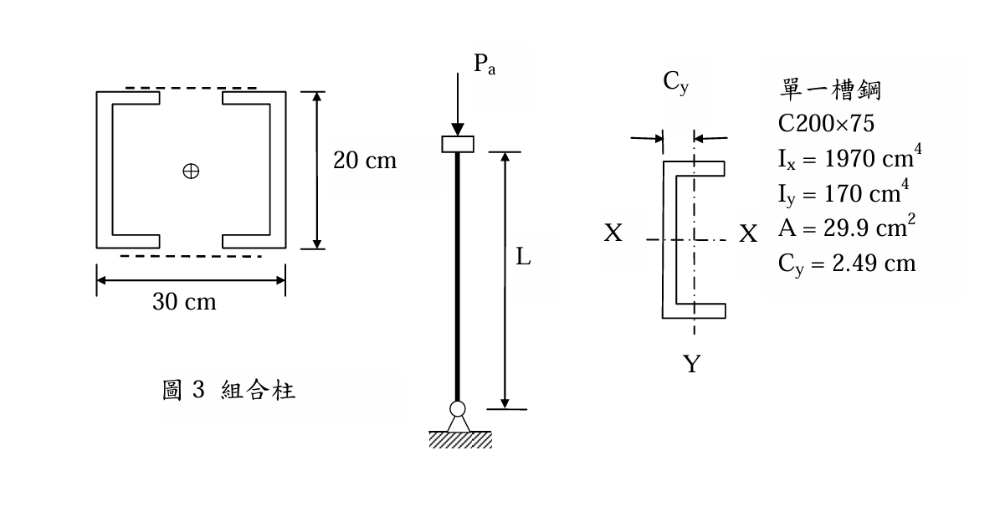
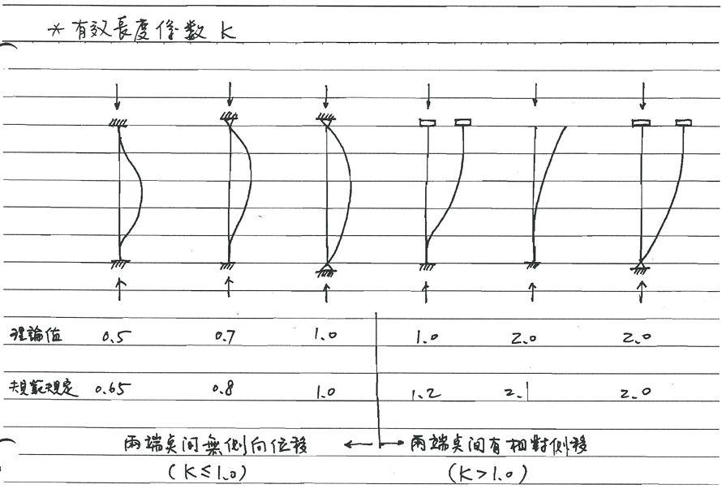

# SS-2015-3 終極深度解析

### 考題編號：SS-2015-3

**主分類：** `SS-U1-1` 拉力及壓力桿件
**副分類：** 無
**設計法：** ASD
**標籤：** `壓力桿件` `組合柱` `ASD` `平行軸定理` `有效長度` `迴旋半徑` `Cc判斷` `彈性挫屈`

---

## 1. 原始題目重述 (Problem Restatement)

**結構描述：**
- 組合柱：2×C200×75 槽鋼，以繫條穩固接合（繫條面積省略不計）
- C200×75 斷面性質（題目給定，單根）：
  - $I_x = 1970$ cm⁴，$I_y = 170$ cm⁴
  - $A = 29.9$ cm²，$C_y = 2.49$ cm（形心到腹板外面之距離）
- 鋼材：SM400，$F_y = 2.52$ tf/cm²，$E_s = 2040$ tf/cm²
- 邊界條件：底部鉸接，頂端可平移但不能轉動 → $k = 2.0$



*圖說：組合柱斷面配置。兩根 C200×75 翼板朝內、腹板朝外（ `[ ]` 型排列），兩側腹板外緣間距（總外寬）= 30 cm；腹板高度（斷面深度）= 20 cm（即 C200×75 的「200」mm）。每根槽鋼形心距組合中心 $d = 30/2 - C_y = 15 - 2.49 = 12.51$ cm。柱高 $L$，底部鉸接、頂端可平移不能轉動，有效長度係數 $k = 2.0$。*

**子問題：**
1. 假設繫條斷面積省略不計，求組合柱斷面之**最小迴旋半徑** $r$（cm）
2. 若此組合柱須承受軸心載重 $P_a = 21.1$ tf，求容許之**最大長度** $L$（cm）

---

## 2. 考題核心精神與出題者意圖 (Core Concepts & Examiner's Intent)

**核心觀念：組合斷面慣性矩 × ASD 壓力桿完整流程**

此題分兩步驟：先用**平行軸定理**求複合斷面的最小慣性矩（決定弱軸），再套 ASD 壓力桿設計公式（計算 $C_c$、判斷彈性/非彈性挫屈段、反算最大長度）。

**出題者測驗重點：**
- 識別複合斷面的強/弱軸（$I_X$ vs $I_Y$ 的比較）
- 平行軸定理：哪個軸需要用，哪個不需要
- ASD 公式：先算 $C_c$，再判斷 $KL/r$ vs $C_c$，選正確段公式
- 邊界條件：$k = 2.0$（頂端可平移不能轉 + 底端鉸接 = 懸臂式）

---

## 3. 解題戰略地圖與陷阱分析 (Strategic Roadmap & Trap Analysis)

**作戰計畫：**
```
Step 1  確認幾何：30 cm = 腹板外緣總寬，20 cm = 腹板高度（非形心間距！）
        每根槽鋼形心距組合中心 d = 30/2 − Cy = 15 − 2.49 = 12.51 cm
Step 2  IX = 2×Ix（形心在X軸上，無平行軸修正）
        IY = 2(Iy + A×d²)（d = 12.51 cm，需平行軸）
Step 3  比較 IX vs IY，取最小者求 rmin
Step 4  ASD 流程：fa = Pa/Atotal → Cc → 比較 KL/r → Fa → 反算 L
```

**陷阱分析：**

| 陷阱 | 說明 | 對策 |
|------|------|------|
| ❶ **20 cm 誤讀為形心間距** | 圖中 20 cm 是腹板高度（C200 的深度），不是形心間距！ | 槽鋼排列為翼板朝內腹板朝外；形心間距 $d = 30/2 - C_y = 12.51$ cm |
| ❷ IX 用平行軸 | $I_X$ 不需要平行軸（兩形心都在 X 軸上） | $I_X = 2 \times I_x = 3940$ cm⁴ |
| ❸ IY 忘記平行軸 | $I_Y$ 的形心離 Y 軸有偏移，必須用 $I_y + Ad^2$ | $d = 12.51$ cm（距組合中心 Y 軸距離） |
| ❹ k = 2.0 忘記套用 | KL/r 計算時忘乘 k | $KL = 2.0 \times L$ |
| ❺ ASD 段落選錯 | 未先確認是否超過 $C_c$ | 先算 $C_c$，再比較 |

---

## 3.5 變數層次分析（Variable Hierarchy Analysis）

> 複習提示：解題後，在每個卡住的知識點「卡關?」欄標記 `⚠`；第二次複習時只看有 `⚠` 的項目。

**最終目標：** 平行軸定理求最小迴旋半徑 $r_{min}$ → ASD 彈性挫屈公式反算容許最大長度 $L$

### 主要公式（$\boxed{\phantom{x}}$ = 未知，待推導）

$$I_X = 2 I_x, \quad \boxed{I_Y} = 2\left(I_y + A \cdot \boxed{d}^2\right), \quad \boxed{d} = \frac{30}{2} - C_y$$

$$\boxed{r_{min}} = \sqrt{\frac{I_{min}}{2A}}$$

$$C_c = \sqrt{\frac{2\pi^2 E}{F_y}}, \quad F_a = \frac{12\pi^2 E}{23(KL/r)^2} \quad (KL/r > C_c)$$

$$\boxed{L} = \frac{\boxed{KL/r} \cdot r_{min}}{K}$$

### L1：題目直接給定

| 符號 | 數值 | 說明 |
|------|------|------|
| $I_x$（單根） | 1,970 cm⁴ | C200×75 強軸慣性矩 |
| $I_y$（單根） | 170 cm⁴ | C200×75 弱軸慣性矩 |
| $A$（單根） | 29.9 cm² | C200×75 斷面積 |
| $C_y$ | 2.49 cm | 形心到腹板外面距離 |
| 組合外寬 | 30 cm | 兩腹板外緣間距 |
| $K$ | 2.0 | 有效長度係數（底鉸頂可平移不轉） |
| $P_a$ | 21.1 tf | 軸心設計載重 |
| $F_y$ | 2.52 tf/cm² | 降伏應力（SM400） |
| $E$ | 2,040 tf/cm² | 彈性模數 |

### L2：需知識點推導

**Step 1：組合斷面幾何**

| 符號 | 公式 / 來源 | 卡關? |
|------|------------|:-----:|
| $d$ | $30/2 - C_y = 15 - 2.49 = 12.51$ cm（每根形心距組合 Y 軸） | |
| $A_{total}$ | $2 \times 29.9 = 59.8$ cm² | |

**Step 2：各軸慣性矩**

| 符號 | 公式 / 來源 | 卡關? |
|------|------------|:-----:|
| $I_X$ | $2 \times 1970 = 3940$ cm⁴（無平行軸，形心在 X 軸） | |
| $I_Y$ | $2(170 + 29.9 \times 12.51^2) = 9698$ cm⁴（需平行軸修正） | |
| $I_{min}$ | $I_X = 3940$ cm⁴（X 軸為弱軸） | |
| $r_{min}$ | $\sqrt{3940/59.8} = 8.12$ cm | |

**Step 3：ASD 柱設計（反算 L）**

| 符號 | 公式 / 來源 | 卡關? |
|------|------------|:-----:|
| $f_a$ | $P_a / A_{total} = 21.1/59.8 = 0.353$ tf/cm² | |
| $C_c$ | $\sqrt{2\pi^2 E / F_y} = 126.4$ | |
| $(KL/r)^2$ | 令 $F_a = 0.353$：$12\pi^2 E / (23 \times 0.353) = 29{,}764$ | |
| $KL/r$ | $\sqrt{29764} = 172.5 > C_c = 126.4$ → 彈性段 ✓ | |
| $L$ | $172.5 \times r_{min} / K = 172.5 \times 8.12 / 2.0 = 700$ cm | |

### L3：深層知識（不懂就卡住）

| 知識點 | 說明 | 補強頁 | 卡關? |
|--------|------|:------:|:-----:|
| 30 cm 是外寬非形心間距 | 圖中 30 cm 為腹板外緣間距；每根形心距組合中心需減去 $C_y$ | | |
| X 軸不需平行軸修正 | 兩槽鋼形心都在 X 軸上，$I_X = 2I_x$（不加 $Ad^2$） | | |
| ASD 柱設計 Cc 判斷 | $KL/r < C_c$ 非彈性段；$> C_c$ 彈性段（各用不同公式） | [[asd-column]] | |
| k=2.0 的邊界條件 | 底鉸接+頂可平移不能轉 = 懸臂柱，$k=2.0$ | [[effective-length-chart]] | |
| 先假設彈性段再驗證 | 先用彈性公式解 $KL/r$，解完後確認是否 $> C_c$ | [[asd-column]] | |

---

## 4. 步驟化詳細計算過程 (Step-by-Step Detailed Calculation)

### Part (一)：最小迴旋半徑

**組合斷面幾何確認：**

兩根 C200×75 翼板朝內、腹板朝外排列（`[ ]` 型）：
- 圖中 **30 cm** = 兩側腹板外緣間距（組合斷面總外寬）
- 圖中 **20 cm** = 腹板高度（C200×75 的斷面深度，即截面名稱中的「200 mm」）

每根槽鋼形心距組合中心 Y 軸的距離：
$$d = \frac{30}{2} - C_y = 15 - 2.49 = 12.51 \text{ cm}$$

複合斷面的 X 軸（水平）通過兩個槽鋼的形心，Y 軸（垂直）為對稱軸。

**計算 $I_X$（關於水平 X 軸）：**

兩槽鋼形心均在 X 軸上 → **不需要平行軸修正**：

$$I_X = 2 \times I_x = 2 \times 1970 = 3940 \text{ cm}^4$$

**計算 $I_Y$（關於垂直 Y 軸）：**

每根槽鋼形心距複合 Y 軸距離 $d = 12.51$ cm → 需要平行軸修正：

$$I_Y = 2\left(I_y + A \cdot d^2\right) = 2\left(170 + 29.9 \times 12.51^2\right) = 2(170 + 4{,}679) = 2 \times 4{,}849 = 9{,}698 \text{ cm}^4$$

**比較兩軸慣性矩：**

$$I_X = 3940 \text{ cm}^4 < I_Y = 9{,}698 \text{ cm}^4$$

→ **X 軸為弱軸**，$I_{min} = I_X = 3940$ cm⁴

> 策略註解：增大槽鋼間距（加大外寬）只影響 $I_Y$，而不影響 $I_X$。因此，對本複合斷面，**無論槽鋼間距如何，$I_X$ 始終是弱軸**（僅能靠換用較大 $I_x$ 的槽鋼規格才能改善）。

**最小迴旋半徑：**

$$r_{min} = r_X = \sqrt{\frac{I_X}{A_{total}}} = \sqrt{\frac{3940}{2 \times 29.9}} = \sqrt{\frac{3940}{59.8}} = \sqrt{65.89} = \boxed{8.12 \text{ cm}}$$

---

### Part (二)：容許最大長度 $L$

**需求應力：**
$$f_a = \frac{P_a}{A_{total}} = \frac{21.1}{59.8} = 0.353 \text{ tf/cm}^2$$

**計算 $C_c$（彈性/非彈性挫屈分界）：**
$$C_c = \sqrt{\frac{2\pi^2 E}{F_y}} = \sqrt{\frac{2 \times \pi^2 \times 2040}{2.52}} = \sqrt{\frac{40268}{2.52}} = \sqrt{15980} = 126.4$$

**設定 $F_a = f_a$ 反算 $KL/r$（先假設彈性挫屈段）：**

彈性挫屈段（$KL/r > C_c$）容許應力：
$$F_a = \frac{12\pi^2 E}{23(KL/r)^2}$$

令 $F_a = 0.353$ tf/cm²：
$$(KL/r)^2 = \frac{12\pi^2 \times 2040}{23 \times 0.353} = \frac{12 \times 9.870 \times 2040}{8.119} = \frac{241\,640}{8.119} = 29\,764$$

$$KL/r = \sqrt{29\,764} = 172.5$$

**驗證段落假設：** $KL/r = 172.5 > C_c = 126.4$ → **確為彈性挫屈段** ✓

**反算最大柱長 $L$：**

$$\frac{KL}{r} = 172.5 \Rightarrow \frac{2.0 \times L}{8.12} = 172.5$$

$$L = \frac{172.5 \times 8.12}{2.0} = \frac{1400.7}{2.0} = \boxed{700 \text{ cm}}$$

**驗算：**
$$KL/r = \frac{2.0 \times 700}{8.12} = \frac{1400}{8.12} = 172.4 \quad \checkmark$$
$$F_a = \frac{12\pi^2 \times 2040}{23 \times 172.4^2} = \frac{241\,640}{684\,690} = 0.353 \text{ tf/cm}^2 = f_a \quad \checkmark$$

---

## 5. 關鍵爭議點與進階探討 (Critical Issues & Advanced Discussion)

**爭議一：20 cm vs 30 cm 的幾何意義**

從圖中可清楚判讀：
- **30 cm** = 兩側腹板外緣間距（整體外寬），標示於斷面橫向
- **20 cm** = 腹板高度（截面深度，即 C**200**×75 中「200 mm」所對應的尺寸），標示於斷面縱向

槽鋼排列方式為翼板朝內、腹板朝外（`[ ]` 型）。30 cm 是量腹板背面到背面的水平距離，因此：

$$d = \frac{30}{2} - C_y = 15 - 2.49 = 12.51 \text{ cm} \quad \text{（每根形心距組合中心）}$$


**爭議二：繫條的力學作用**

題目要求「繫條斷面積省略不計」，意指在計算截面積時忽略繫條本身，但**繫條的存在確保兩根槽鋼能共同作動、不分開挫屈**。若無繫條或繫條剛度不足，需額外檢核單根槽鋼的局部挫屈（個別構件的 $KL_b/r$ 不得超過組合柱整體的 $KL/r$）。

**進階：為何是懸臂柱（$k = 2.0$）？**

邊界條件：「底部鉸接，頂端可平移但不能轉動」。從挫屈形狀來看：
- 頂端可平移（無水平約束）→ 側移不受限
- 底端鉸接（可轉動，無水平約束）→ 底端可自由轉動

這等效於「一端固定-一端自由」模型，即懸臂柱，$k = 2.0$。注意：此與「一端固定一端鉸接（$k=0.7$）」或「兩端固定（$k=0.5$）」不同，務必仔細識別邊界條件。

---

## 手寫補充



*圖說：有效長度係數 $k$ 六種邊界條件對照圖。左半（兩端支間無側向位移，$k \leq 1.0$）：兩端固定 $k=0.5/0.65$、一端固定一端鉸接 $k=0.7/0.8$、兩端鉸接 $k=1.0/1.0$。右半（兩端支間有相對側移，$k > 1.0$）：一端固定一端鉸接（側移型）$k=1.0/1.2$、一端固定一端自由 $k=2.0/2.1$、一端固定一端可移（不轉）$k=2.0/2.0$。本題（底鉸頂可平移不能轉動）對應最右側，$k=2.0$。每種情形均附挫屈形狀示意。*

---

*解析完成時間：2026-04-08（重新解析，依當前 CLAUDE.md 格式）*
*驗證狀態：unverified*
