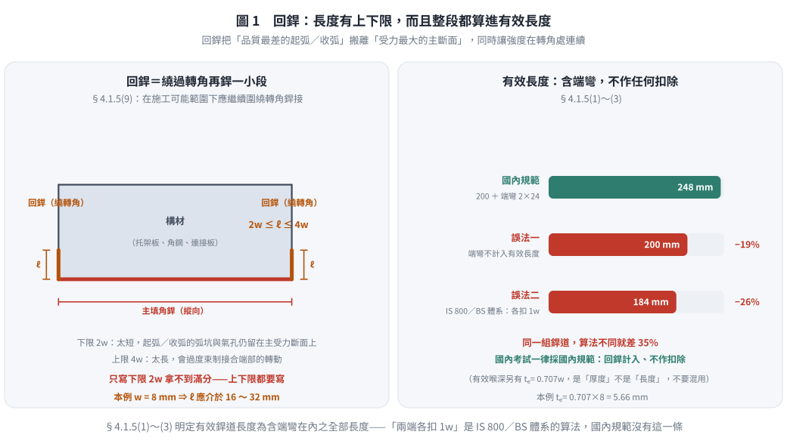
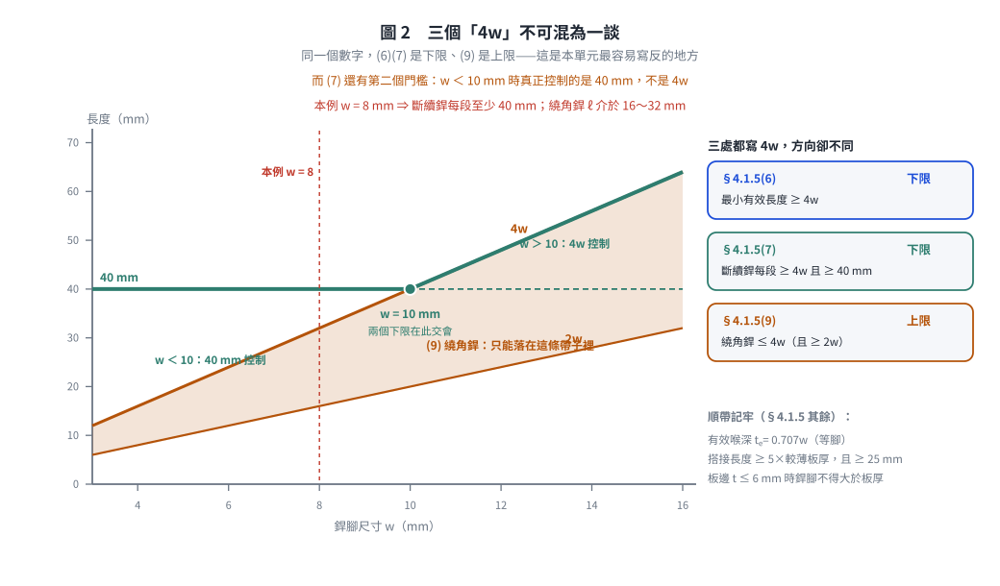
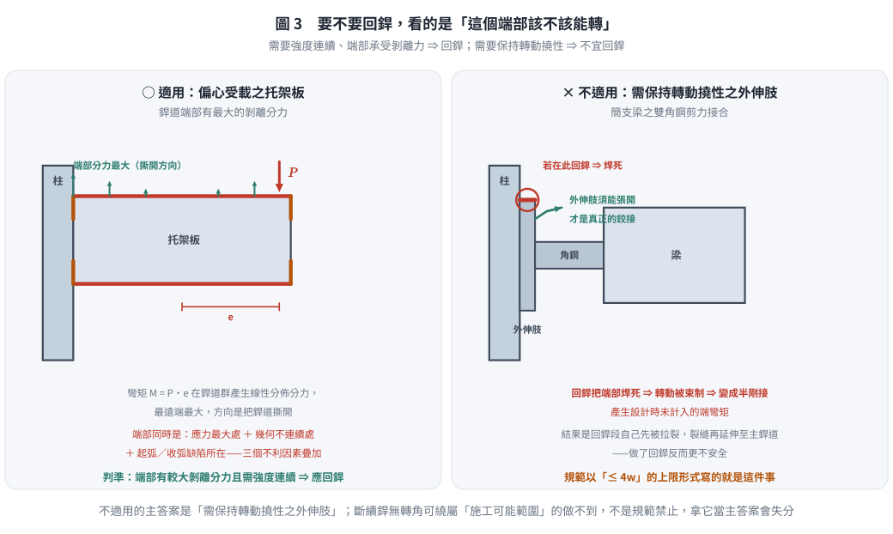

# 考題編號：SS-2016-2

**主分類：** `SS-U2-3` 設計規範對施工之要求
**副分類：** 無
**設計法：** 概念題
**標籤：** `施工規範` `填角銲` `回銲` `繞角銲` `轉角銲` `end return` `銲接細節` `有效銲道長度` `撓性接合`

---

## 1. 原始題目重述 (Problem Restatement)

**子問題：**

1. **(一)** 何謂回銲（圍繞轉角銲接，end return）？（10 分）
2. **(二)** 請舉例說明何時適用回銲？何時不適用回銲？（各舉一例）（15 分）

（本題無附圖。）

> **命題出處：** 鋼構造建築物鋼結構施工規範第四章「銲接施工」**§4.1.5 第 9 項**：
>
> 「**接合部或構材側面填角銲或端部填角銲，分別在側或端部終止時，在施工可能範圍下，應繼續圍繞轉角銲接，其長度不得小於銲接尺寸之二倍，不得超過銲接尺寸之四倍。**」
>
> 同節第 1～3 項另定義：**填角銲之有效銲道長度為包括端彎（繞角銲）在內的全部填角銲道**。

---

## 2. 考題核心精神與出題者意圖 (Core Concepts & Examiner's Intent)

**核心觀念：回銲是「把銲道的起訖點搬離受力最大處」，但它同時會把接合變硬——所以規範同時訂了下限與上限。**

多數考生只背得出「$\ge 2w$」，卻不知道規範**同一句話裡還訂了 $\le 4w$**。這個上限正是子題 (二)「何時不適用回銲」的答案來源：

- **下限 $2w$** 的用意：回銲太短，起弧／收弧的缺陷仍留在受力斷面上，等於沒繞
- **上限 $4w$** 的用意：回銲太長，會把原本應該可以轉動的接合端部**焊死**，使假設為鉸接（簡支）的接合實際承受彎矩，銲道端部反被拉裂

**出題者測驗重點：**

1. 能寫出回銲的幾何定義**與規範明訂的長度範圍（$2w \sim 4w$）**
2. 能從「銲道端部應力集中」的角度說明回銲的功用
3. 能區分需要回銲（端部受剝離力、需要強度連續）與不適用回銲（**接合需保持撓性**、板件邊緣受計算拉應力、施工上無轉角可繞）的案例

---

## 3. 解題戰略地圖與陷阱分析 (Strategic Roadmap & Trap Analysis)

**步驟規劃：**

1. 定義回銲（幾何 + 規範長度範圍 $2w \le \ell \le 4w$ + 目的）
2. 舉正例：什麼接合形式**適用** → 說明力學理由（端部剝離力、強度連續）
3. 舉反例：什麼接合形式**不適用** → 說明理由（撓性需求／邊緣拉應力／幾何不可行）

**關鍵陷阱：**

> ⚠️ **陷阱 1：只寫 $\ge 2w$，漏掉 $\le 4w$**
> 規範 §4.1.5(9) **同一句**訂了上下限：「不得小於銲接尺寸之二倍，**不得超過銲接尺寸之四倍**」。上限不只是數字，它是子題 (二) 的答案骨幹。

> ⚠️ **陷阱 2：以為回銲長度不計入有效長度**
> 恰恰相反。規範 §4.1.5 第 1～3 項明定：**填角銲之有效銲道長度為「包括端彎（繞角銲）在內」的全部填角銲道**。國內規範**不做「兩端各扣 $1w$」之扣除**——那是部分國外規範（如 IS／BS 體系採 實長 $-2s$）的作法，不可混用。

> ⚠️ **陷阱 3：舉例只列場合、未說明力學原因**
> 適用／不適用的理由須從「**銲道端部應力分佈**」或「**接合的轉動需求**」兩個角度解釋，才拿得到分。

> ⚠️ **陷阱 4：混淆回銲與「環繞全周銲」（weld-all-around）**
> 全周銲是沿整個接合輪廓繞一圈（銲接符號為圓圈）；回銲只在銲道端部繞轉角延伸 $2w\sim4w$。兩者目的與範圍完全不同。

---

## 3.5 變數層次分析（Variable Hierarchy Analysis）

> 複習提示：解題後，在每個卡住的知識點「卡關?」欄標記 `⚠`；第二次複習時只看有 `⚠` 的項目。

**最終目標：** 定義回銲（End Return）之幾何與**規範明訂之長度上下限** → 舉例說明適用與不適用之場合及其力學原因

### 主要公式（規範明文，概念題）

**回銲長度（施工規範 §4.1.5(9)）：**

$$2w \;\le\; \ell_{\text{end return}} \;\le\; 4w \qquad (w = \text{填角銲腳尺寸})$$

**有效銲道長度（§4.1.5(1)～(3)）：**

$$L_{\text{eff}} = \text{全部填角銲道長度（\textbf{包括繞角銲在內}）}$$

**依強度計算之最小有效長度（§4.1.5(6)）：**

$$L_{\text{eff}} \;\ge\; 4w$$

**斷續填角銲每段之有效長度（§4.1.5(7)）：**

$$\ell_{\text{seg}} \;\ge\; 4w \quad\text{且}\quad \ell_{\text{seg}} \;\ge\; 40\ \text{mm}$$

**搭接接頭最小搭接長度（§4.1.5(8)）：**

$$L_{\text{lap}} \;\ge\; 5t_{\min} \quad\text{且}\quad L_{\text{lap}} \;\ge\; 25\ \text{mm}$$

### L1：題目直接給定

| 符號 | 數值 | 說明 |
|------|------|------|
| 子問題(一) | 定義回銲（10 分）| 幾何描述 + **長度上下限** + 目的 |
| 子問題(二) | 適用／不適用**各舉一例**（15 分）| 需說明力學原因 |

### L2：需知識點推導

**Step 1：回銲定義（§4.1.5(9)）**

| 項目 | 規定／來源 | 卡關? |
|------|----------|:-----:|
| 幾何 | 側面或端部填角銲在側／端終止時，**繼續圍繞轉角銲接** | |
| 施作前提 | 「**在施工可能範圍下**」——無轉角可繞或無法施銲者不強制 | |
| 長度下限 | $\ell \ge 2w$ | |
| 長度上限 | $\ell \le 4w$ | |
| 是否計入有效長度 | **計入**（§4.1.5(1)～(3)：有效銲道長度包括端彎在內）| |
| 目的 | 消除銲道端部（起弧／收弧、幾何不連續）之應力集中；提供抗剝離能力；使強度在轉角處連續 | |

**Step 2：適用回銲的場合**

| 項目 | 內容 | 卡關? |
|------|------|:-----:|
| 典型案例 | **托架板（Bracket Plate）／懸臂連接板以填角銲銲於柱翼板**，承受偏心垂直載重 | |
| 力學原因 | 偏心彎矩使銲道**端部**產生最大的剝離（撕開）分力；若銲道在轉角突然終止，該處同時是應力尖峰與起弧／收弧缺陷所在，是裂縫萌生點 | |
| 回銲的作用 | 把起訖點搬離受力最大斷面，並以繞角段直接承擔端部剝離力；對反覆載重（疲勞）與地震尤其重要 | |

**Step 3：不適用（或須限制）回銲的場合**

| 情形 | 規範／力學依據 | 卡關? |
|------|--------------|:-----:|
| **① 接合之外伸肢需保持轉動撓性者** | 規範對回銲訂**上限 $4w$**，即為此而設。典型例：簡支梁之**雙角鋼（或頂角鋼）剪力接合**，角鋼外伸肢須能隨梁端轉動而張開；若在該肢頂端施作（或過長之）回銲，等於把接合焊死 ⇒ 假設為鉸接的接合實際產生端彎矩，回銲段首先被拉裂，反而降低安全 | |
| **② 搭接接頭中，一板件伸出另一板件邊緣且該邊緣受計算拉應力者** | 填角銲應在**距該邊緣一段距離處終止**，不得繞至該自由邊；繞至邊緣會在受拉自由邊製造缺口與殘留拉應力，成為斷裂起點 | |
| **③ 施工上無轉角可繞或無法施銲者** | 規範用語「**在施工可能範圍下**」已預留此彈性。例：斷續（間歇）填角銲各段位於腹板中間、無構材轉角可繞；或與其他構件干涉、銲槍無法伸入之位置 | |

### L3：深層知識（不懂就卡住）

| 知識點 | 說明 | 補強頁 | 卡關? |
|--------|------|:------:|:-----:|
| 銲道端部為何是應力集中處 | 銲道起弧／收弧品質最差（弧坑、氣孔），且幾何在此不連續，應力集中係數大，是疲勞裂縫的萌生點 | [[FILLET-WELD-DESIGN]] | |
| 為什麼下限訂 $2w$ | 繞角段至少要有兩倍銲腳長，才足以把起弧／收弧的不良段完全移出主受力斷面 | | |
| **為什麼上限訂 $4w$（本題關鍵）** | 回銲越長，端部轉動束制越強。對「設計上假設為簡支（鉸接）」的接合，束制會誘發設計時未計入的端彎矩，銲道端部因而被拉裂——這是規範唯一以**上限**形式寫出的「不適用」情形 | | |
| 回銲**計入**有效長度（國內規範）| §4.1.5(1)～(3)：有效銲道長度為包括端彎在內的全部填角銲道。國內**不採「兩端各扣 $1w$」之扣除**（該作法屬 IS／BS 等其他規範體系） | [[FILLET-WELD-DESIGN]] | |
| $4w$ 的兩個身分不可混淆 | §4.1.5(6)：依強度計算之**最小有效長度** $\ge 4w$（不足者該銲道不予採計）；§4.1.5(9)：**繞角銲長度上限** $\le 4w$。兩者數字相同、意義完全不同 | | |
| 回銲 vs 環繞全周銲 | 全周銲沿整個接合輪廓繞一圈（符號為圓圈）；回銲只在端部繞轉角 $2w\sim4w$ | | |

---

## 4. 步驟化詳細計算過程 (Step-by-Step Detailed Calculation)

### (一) 何謂回銲（End Return）（10 分）

#### 1. 定義

**回銲（End Return，又稱繞角銲、圍繞轉角銲接）** 是指：當填角銲在構材的**側面或端部終止**時，不在轉角處突然停止，而是**繼續圍繞該轉角銲接一小段**，使銲道的起訖點離開主要受力斷面。

依鋼構造建築物鋼結構施工規範 **§4.1.5 第 9 項**：

> 「接合部或構材側面填角銲或端部填角銲，分別在側或端部終止時，**在施工可能範圍下，應繼續圍繞轉角銲接**，其長度**不得小於銲接尺寸之二倍**，**不得超過銲接尺寸之四倍**。」

#### 2. 幾何說明

```
                    構材（如托架板、角鋼、連接板）
        ┌──────────────────────────────────────┐
        │                                      │
        └──────────────────────────────────────┘
        ↑                                      ↑
   回銲（繞轉角）                          回銲（繞轉角）
   2w ≤ ℓ ≤ 4w                            2w ≤ ℓ ≤ 4w
        ←──────── 主要填角銲（沿縱向）────────→
```

- **主銲道**：沿接合受力方向（縱向）施銲
- **回銲段**：在主銲道之一端或兩端，繞過構材轉角繼續延伸

#### 3. 長度規定（本小題的核心得分點）

$$\boxed{\;2w \;\le\; \ell_{\text{end return}} \;\le\; 4w\;}\qquad (w = \text{填角銲腳尺寸})$$

| 界限 | 數值 | 訂定理由 |
|------|:----:|---------|
| **下限** | $2w$ | 繞角段太短，起弧／收弧的弧坑與氣孔仍留在主受力斷面上，等於沒繞 |
| **上限** | $4w$ | 繞角段太長，會過度**束制接合端部的轉動**；對假設為鉸接的接合將誘發未計入的端彎矩，反而拉裂銲道 |

#### 4. 是否計入有效長度

依規範 **§4.1.5 第 1～3 項**：**填角銲之有效銲道長度為「包括端彎（繞角銲）在內」的全部填角銲道長度。**

亦即國內規範**將回銲段計入有效長度**，且**不作「兩端各扣 $1w$」的扣除**。

> ⚠️ 須與同節第 6 項區分：依強度計算所得之填角銲**最小有效長度不得小於 $4w$**——這是「銲道太短就不予採計」的規定，與繞角銲的 $4w$ 上限**數字相同、意義完全不同**。



*圖 1　回銲把品質最差的起弧／收弧搬離受力最大的主斷面，而且整段都算進有效長度。本圖攔的是只寫下限 $2w$ 而漏掉上限 $4w$，以及沿用 IS 800／BS 的「兩端各扣 $1w$」——國內規範 §4.1.5(1)～(3) 沒有這一條，兩種算法在本例差 $35\%$。*

#### 5. 目的（功能性說明）

1. **把銲道的起訖點搬離受力最大處**：起弧與收弧是銲道品質最差的兩段（弧坑、氣孔、未填滿），主銲道端部又正好是幾何不連續的應力集中區；回銲讓「最差的銲」落在「受力最小的地方」。
2. **提供端部的抗剝離（peeling／tearing）能力**：當接合承受使銲道端部脫開方向的力（如偏心彎矩造成的撕開趨勢）時，繞角段直接承擔該分力。
3. **使強度在轉角處連續**：避免板件轉角處成為未銲接的自由邊，降低疲勞裂縫萌生機率；繞角段並計入有效長度而貢獻強度。

---



*圖 2　同一個 $4w$ 在三處條文裡方向不同：(6)(7) 是下限、(9) 是上限。本圖攔的是把三者寫反，也攔漏掉 (7) 的第二道門檻——$w < 10$ mm 時真正控制的是 $40$ mm 而不是 $4w$。*

### (二) 適用回銲 vs 不適用回銲（各舉一例）（15 分）

#### ✅ 適用回銲：承受偏心載重之托架板（Bracket Plate）銲於柱翼板

**情境：** 一托架板（或懸臂連接板）以兩道縱向填角銲銲接於 H 型柱之翼板上，板端承受垂直集中載重 $P$，載重作用線距銲道群形心有偏心距 $e$。

**力學分析：**

- 銲道群同時承受**直接剪力 $P$** 與**偏心彎矩 $M = P\cdot e$**
- 彎矩在銲道群產生線性分佈的分力，**最遠端（銲道端部）分力最大**，且方向為使銲道**撕開（剝離）**
- 若填角銲在托架板端部突然終止，該端點同時是：① 應力最大處 ② 幾何不連續處 ③ 起弧／收弧缺陷所在 ⇒ 三個不利因素疊加，是最典型的起裂位置

**回銲的作用：**

- 在銲道端部繞過板緣繼續延伸 $2w \sim 4w$
- 端部的剝離分力由繞角段承擔，應力尖峰被分散
- 起弧／收弧的缺陷段移出主受力斷面
- 繞角段並計入有效長度，直接提升接合強度

$$\text{判斷準則：} \quad \text{銲道端部存在較大的剝離（垂直於銲道面）分力，且需要強度連續時} \Rightarrow \text{應施作回銲}$$

**其他適用例：** 角鋼單邊銲於節點板端部、承受反覆（疲勞）或地震載重之懸臂接合、受端彎矩之連接板。

---

#### ❌ 不適用回銲：需保持轉動撓性之接合外伸肢——簡支梁之雙角鋼（或頂角鋼）剪力接合

**情境：** 一簡支梁以**雙角鋼剪力接合**連於柱翼板：角鋼的一肢銲（或鎖）於梁腹板，另一肢（**外伸肢**）連於柱面。設計上此接合**假設為鉸接**，只傳遞剪力、不傳遞彎矩。

**為何不適用（或必須嚴格限制）回銲：**

1. **接合必須能轉動。** 梁受載變形時梁端會轉動，角鋼外伸肢須能隨之**張開變形**，才能實現「鉸接」的假設。
2. **回銲會把端部焊死。** 若在外伸肢的頂端施作回銲（或回銲過長），端部轉動被束制，接合實際上變成半剛接，**產生設計時未計入的端彎矩**。
3. **後果是回銲段自己先破壞。** 該端彎矩使銲道端部承受集中的拉力，最先被拉裂；裂縫再往主銲道延伸，接合整體失效——**做了回銲反而更不安全**。
4. **規範以「上限」的形式寫出這件事。** §4.1.5(9) 訂繞角銲長度**不得超過銲接尺寸之四倍**，正是為了限制此類束制效應。

$$\text{判斷準則：} \quad \text{接合之外伸肢需要保持轉動撓性（設計上假設為鉸接）時} \Rightarrow \text{不宜施作回銲，必要時長度須嚴格受限}$$

---



*圖 3　要不要回銲，看的是這個端部該不該能轉：需要強度連續、端部承受剝離力就回銲，需要保持轉動撓性就不宜。本圖攔的是把「不適用」的主答案寫成斷續銲——那是「施工可能範圍」下的做不到，不是規範認為不該做。*

#### 其他兩種不適用（或不施作）的情形（作答時可補充）

**① 搭接接頭中，一板件伸出另一板件之邊緣且該邊緣受計算拉應力者**

填角銲應在**距該自由邊一段距離處終止**，不得繞至該邊緣。理由：受拉自由邊上若加銲道，會製造缺口效應與銲接殘留拉應力，成為斷裂起始點。

**② 施工上無轉角可繞或無法施銲者**

規範用語「**在施工可能範圍下**」已預留此彈性。例如：

- **斷續（間歇）填角銲**各段的端部位於腹板中段，無構材轉角可繞，物理上無法施作
- 與其他構件干涉、銲槍或銲工姿勢無法到達之位置

> 註：此情形是「**做不到**」，與前述「**不該做**」（撓性需求、受拉自由邊）性質不同。答題若舉此例，務必說明是「施工可能範圍」的限制，而非規範禁止。

---

## 5. 關鍵爭議點與進階探討 (Critical Issues & Advanced Discussion)

### 5.1 有效長度到底怎麼算？（本題最容易被誤導之處）

| 規範體系 | 填角銲有效長度 |
|---------|--------------|
| **國內施工規範 §4.1.5(1)～(3)** | **全部填角銲道長度，包括端彎（繞角銲）在內；不另作扣除** |
| AISC 360 | 有效長度為全尺寸填角銲之長度；端荷重之長銲道（$L > 100w$）另乘折減係數 $\beta$ |
| IS 800／BS 等體系 | 有效長度 $=$ 實長 $- 2s$（兩端各扣一個銲腳，考慮弧坑）|

**考國內考試一律採國內規範：回銲計入有效長度、不作扣除。**

### 5.2 兩個「$4w$」不可混為一談

| 條號 | 內容 | 意義 |
|------|------|------|
| §4.1.5(6) | 依強度計算所得之填角銲**最小有效長度不得小於 $4w$** | **下限**：太短的銲道不予採計 |
| §4.1.5(7) | 斷續填角銲**任一段之有效長度不得小於 $4w$，亦不得小於 40 mm** | **下限**：每段的最小值 |
| §4.1.5(9) | **繞角銲長度不得超過銲接尺寸之四倍** | **上限**：太長會束制轉動 |

三處都出現 $4w$，方向卻不同——這是本單元最容易寫反的地方。

### 5.3 相關的填角銲細節規定（一併記憶，投報率最高）

| 項目 | 規定 | 條號 |
|------|------|------|
| 有效喉深 | 自銲道根部至銲道表面之最短距離（等腳時 $t_e = 0.707w$）| §4.1.5(1) |
| 有效銲道長度 | 全部填角銲道，**含端彎** | §4.1.5(1)～(3) |
| 最小銲腳尺寸 | 依接合部**較厚板**厚度查表（3／5／6／8 mm）| §4.1.5(4)、表 4.1-1 |
| 最大銲腳尺寸 | 沿厚度 $\le 6$ mm 之板邊銲接時，不得大於板厚 | §4.1.5(5) |
| 最小有效長度 | $\ge 4w$ | §4.1.5(6) |
| 斷續銲每段 | $\ge 4w$ 且 $\ge 40$ mm | §4.1.5(7) |
| 搭接最小搭接長度 | $\ge 5t_{\min}$ 且 $\ge 25$ mm | §4.1.5(8) |
| **繞角銲（回銲）** | $2w \le \ell \le 4w$ | **§4.1.5(9)** |

### 5.4 考場安全答法摘要

| 子題 | 核心答法 |
|------|---------|
| (一) 定義 | 「填角銲在側面或端部終止時，**在施工可能範圍下**繞過轉角繼續銲接」+ 圖示 |
| (一) 長度 | 「規範明訂 **$2w \le \ell \le 4w$**」——**上下限都要寫**，只寫 $2w$ 拿不到滿分 |
| (一) 有效長度 | 「回銲**計入**有效銲道長度（有效長度為含端彎在內之全部填角銲道）」 |
| (一) 目的 | 「把起弧／收弧的缺陷與應力尖峰搬離主受力斷面；提供端部抗剝離力；強度在轉角處連續」 |
| (二) 適用 | 「**托架板／懸臂連接板銲於柱翼板**，偏心彎矩使銲道端部受最大剝離力 → 應回銲」 |
| (二) 不適用 | 「**需保持轉動撓性之接合外伸肢**（如簡支梁雙角鋼剪力接合的外伸肢），回銲會束制端部轉動、誘發未計入之端彎矩而拉裂銲道——規範以 $\le 4w$ 的上限規定此事」 |

---

*修正日期：2026-08-22 —— 回查「鋼構造建築物鋼結構施工規範」第四章 §4.1.5 原文後改寫。主要更正：① 回銲長度補入規範明訂之**上限 $\le 4w$**（原解析只有下限 $\ge 2w$）；② 刪除「主銲道有效長度 $=$ 總長 $-2w$」與「回銲段若 $\le 4w$ 全段不計入有效長度」兩項無依據之敘述——規範 §4.1.5(1)～(3) 明定**有效銲道長度包括端彎（繞角銲）在內**；③ 子題(二)「不適用」之主答案由「間歇銲縫端部（規範明文不允許）」更正為**「需保持轉動撓性之接合外伸肢」**（即 $4w$ 上限的立法理由），並補入「搭接接頭受拉自由邊」一例；間歇銲一項改列為「施工可能範圍」的限制而非規範禁止；④ 補入 §4.1.5 全套填角銲細節規定對照表。詳見 `wiki/log.md` 2026-08-22 第五批。*
*圖解補繪：2026-08-29（向量圖 3 張，腳本 `gen_SS-2016-2.py`，改輸入可原地重跑；SVG 供 wiki／PDF，2× PNG 供 pptx／影片）*
