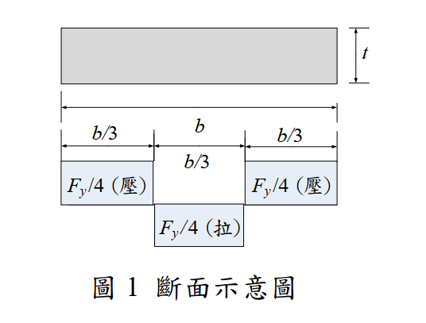
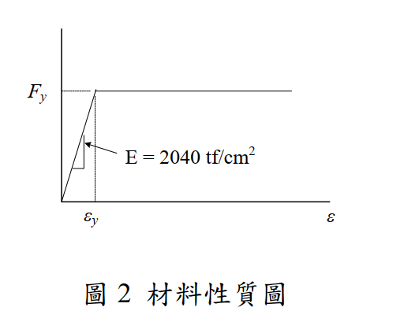

# 考題編號：SS-2016-3

**主分類：** `SS-U1-1` 拉力及壓力桿件
**副分類：** 無
**設計法：** LRFD
**標籤：** `殘留應力` `壓力桿件` `柱強度曲線` `切線模數` `挫屈應力` `比例限` `Euler曲線`

---

## 1. 原始題目重述 (Problem Restatement)

**子問題：**
1. **(一)** 何謂殘留應力？（5 分）
2. **(二)** 殘留應力的來源有哪些？（5 分）
3. **(三)** 殘留應力對受壓桿件的影響為何？（5 分）
4. **(四)** 圖 1 所示為某一斷面殘留應力的分布圖（翼板外側各 $b/3$ 為壓應力 $F_y/4$，內側為拉應力 $F_y/4$），請繪出該斷面受壓時強軸的 $F_{cr}$ vs $L/r$ 曲線（$F_{cr}$：由軸壓力所引致的挫屈應力；$y$ 軸為 $F_{cr}$，$x$ 軸為 $L/r$，假設 $K=1$）。已知材料降伏應力 $F_y = 2.5 \text{ tf/cm}^2$，完美彈塑性曲線如圖 2，$E = 2040 \text{ tf/cm}^2$。（15 分）

**殘留應力分佈（圖 1）：**

```
        ←── 翼板寬 b ──→
   ┌────┬────────────┬────┐  ← 翼板（厚 t）
   │-b/3│    b/3     │-b/3│
   │壓Fy/4│ 拉Fy/4  │壓Fy/4│
   └────┴────────────┴────┘
   （翼板兩端 b/3 為殘留壓應力，中段為殘留拉應力）
   （腹板區域：拉應力 Fy/4 ← 圖 1 標示在下方）
```



*圖說（圖 1 斷面示意圖）：翼板寬度 $b$，厚度 $t$，殘留應力為塊狀分佈：翼板兩端各 $b/3$ 區段為殘留**壓**應力 $F_y/4$（圖中標「壓」），中央 $b/3$ 區段為殘留**拉**應力 $F_y/4$（圖中標「拉」）；腹板區域（圖下方小方塊）亦為拉應力 $F_y/4$。殘留應力呈自平衡分佈：壓區合力 $= 2 \times (b/3) \times t \times (F_y/4)$，拉區合力 $= (b/3) \times t \times (F_y/4) + \text{腹板拉力}$，合計淨力為零。*



*圖說（圖 2 材料性質圖）：鋼材採完全彈塑性假設（Perfect Elastic-Plastic）。彈性段：應力 $F = E\varepsilon$，斜率 $E = 2040\text{ tf/cm}^2$，至降伏應變 $\varepsilon_y = F_y/E$。塑性段：應力維持 $F = F_y = 2.5\text{ tf/cm}^2$ 水平延伸（無應變硬化，無下降段）。此假設是切線模數理論的材料基礎——降伏後切線模數 $E_t = 0$，降伏前 $E_t = E$。*

> 📊 **互動圖請參閱：** `SS-2016-3-column-curve-viz.html`

---

## 2. 考題核心精神與出題者意圖 (Core Concepts & Examiner's Intent)

**核心觀念：殘留應力降低柱的挫屈強度——中間細長比最危險**

此題系統性地測驗考生對殘留應力的全面理解：從定義、來源、影響機制，到**定量繪製柱強度曲線**的能力。第四小題需要具體計算曲線上的關鍵轉折點。

**出題者測驗重點：**
- 殘留應力的「比例限（Proportional Limit）」概念
- 切線模數（Tangent Modulus）與有效彈性模數的關係
- 能否正確計算 $L/r$ 的轉折點（由彈性轉向非彈性的臨界細長比）
- Euler 曲線 vs 實際柱強度曲線的形狀差異

---

## 3. 解題戰略地圖與陷阱分析 (Strategic Roadmap & Trap Analysis)

**步驟規劃（第四題）：**

1. 由殘留應力分佈求出**比例限**（Proportional Limit）$F_{PL}$
2. 計算彈性挫屈轉折點 $(L/r)_{\text{trans}}$：令 $F_e = F_{PL}$
3. 確定曲線的三個區域：塑性（短柱）、非彈性挫屈（中等柱）、彈性 Euler（長柱）
4. 計算關鍵點的數值，繪製示意圖

**關鍵陷阱：**

> ⚠️ **陷阱1：比例限的計算方向**
> 殘留應力為**壓應力** $F_{rc} = F_y/4$ 時，疊加外部壓應力 $F_a$ 後，翼板尖端最先達到降伏：
> $F_a + F_{rc} = F_y$ → $F_a = F_y - F_{rc} = 3F_y/4$
> 比例限 $F_{PL} = 3F_y/4 = 1.875 \text{ tf/cm}^2$，**非** $F_y$ 本身。

> ⚠️ **陷阱2：曲線形狀描述不完整**
> 完整的 $F_{cr}$ vs $L/r$ 曲線需包含三段：(a) $F_{cr} = F_y$（極短柱），(b) 切線模數非彈性曲線，(c) Euler 彈性曲線。漏掉任何一段均不完整。

> ⚠️ **陷阱3：Euler 曲線的起始點計算錯誤**
> Euler 曲線的有效起始點是 $(L/r)_{\text{trans}}$，其數值由 $F_e = F_{PL}$ 求出，而非由 $F_e = F_y$ 求出。

---

## 3.5 變數層次分析（Variable Hierarchy Analysis）

> 複習提示：解題後，在每個卡住的知識點「卡關?」欄標記 `⚠`；第二次複習時只看有 `⚠` 的項目。

**最終目標：** 定義殘留應力 → 說明來源與對壓力桿影響 → 計算比例限 $F_{PL}$ 與轉折點 $(L/r)_{trans}$ → 繪製三段式柱強度曲線

### 主要公式（$\boxed{\phantom{x}}$ = 未知，待推導）

$$\boxed{F_{PL}} = F_y - F_{rc} = F_y - \frac{F_y}{4} = \frac{3F_y}{4}$$

$$\boxed{(L/r)_{trans}} = \sqrt{\frac{\pi^2 E}{F_{PL}}} = \sqrt{\frac{4\pi^2 E}{3F_y}}$$

$$F_{cr}^{(\text{非彈性})} = \frac{F_y \cdot F_e}{F_e + F_{rc}} \quad (L/r \leq (L/r)_{trans})$$

$$F_{cr}^{(\text{彈性})} = \frac{\pi^2 E}{(L/r)^2} \quad (L/r > (L/r)_{trans})$$

### L1：題目直接給定

| 符號 | 數值 | 說明 |
|------|------|------|
| $F_y$ | 2.5 tf/cm² | 降伏應力 |
| $E$ | 2,040 tf/cm² | 彈性模數 |
| $F_{rc}$ | $F_y/4 = 0.625$ tf/cm² | 殘留壓應力（翼板外側各 $b/3$） |
| $K$ | 1.0 | 有效長度係數（題目假設） |
| 殘留應力分佈 | 翼板外側各 $b/3$ 壓，中段 $b/3$ 拉，腹板拉 | 塊狀分佈（圖 1） |

### L2：需知識點推導

**Step 1：殘留應力定義與來源（子問題一、二）**

| 符號 | 公式 / 來源 | 卡關? |
|------|------------|:-----:|
| 定義 | 無外力作用下，截面自平衡的初始應力系統 | |
| 主要來源 | ① 不均勻冷卻（熱軋型鋼）② 焊接 ③ 冷加工 | |

**Step 2：殘留應力對壓力桿的影響（子問題三）**

| 符號 | 公式 / 來源 | 卡關? |
|------|------------|:-----:|
| 提前降伏條件 | $F_a + F_{rc} \geq F_y$ → 翼板尖端提前降伏 | |
| 切線模數降低 | $E_t < E$ → $F_{cr} < F_e$（Euler） | |
| 影響最大的範圍 | 中等細長比（非彈性挫屈段），短柱和長柱影響較小 | |

**Step 3：比例限與轉折點（子問題四）**

| 符號 | 公式 / 來源 | 卡關? |
|------|------------|:-----:|
| $F_{PL}$ | $F_y - F_{rc} = 2.5 - 0.625 = 1.875$ tf/cm² | |
| $(L/r)_{trans}$ | $\sqrt{4\pi^2 E / 3F_y} = \sqrt{10742} = 103.6$ | |

**Step 4：三段式 Fcr 曲線**

| 符號 | 公式 / 來源 | 卡關? |
|------|------------|:-----:|
| 短柱（$L/r \to 0$） | $F_{cr} = F_y = 2.5$ tf/cm²（全截面降伏） | |
| 非彈性段（$L/r \leq 103.6$） | $F_{cr} = F_y F_e / (F_e + F_{rc})$（切線模數理論） | |
| 彈性段（$L/r > 103.6$） | $F_{cr} = \pi^2 E / (L/r)^2$（Euler） | |
| 轉折點 | $(L/r = 103.6, F_{cr} = 1.875)$（兩段連續） | |

### L3：深層知識（不懂就卡住）

| 知識點 | 說明 | 補強頁 | 卡關? |
|--------|------|:------:|:-----:|
| 比例限 $F_{PL}$ 的計算方向 | $F_{PL} = F_y - F_{rc}$（外壓 + 殘留壓 = 降伏），$F_{PL}$ 是外壓的上限 | [[RESIDUAL-STRESS]] | |
| 切線模數理論（Shanley） | 挫屈時應力單調增加，全截面用 $E_t$，為保守下界；優於雙模數理論 | [[TANGENT-MODULUS-THEORY]] | |
| Euler 曲線的起始點 | 由 $F_e = F_{PL}$ 決定，不是 $F_e = F_y$！（常見錯誤） | [[COLUMN-STRENGTH-CURVE]] | |
| 三段曲線的形狀 | 短柱水平線（$F_y$）→ 非彈性下彎段（低於 Euler）→ 彈性 Euler 曲線 | [[COLUMN-STRENGTH-CURVE]] | |
| 殘留應力自平衡條件 | 壓區合力 = 拉區合力，淨力與淨力矩均為零 | [[RESIDUAL-STRESS]] | |

---

## 4. 步驟化詳細計算過程 (Step-by-Step Detailed Calculation)

### (一) 殘留應力的定義

**殘留應力（Residual Stress）** 是構材在沒有任何外力作用下，由於製造、加工或施工過程中的不均勻處理，仍殘留於截面內部的自平衡應力系統。

- 截面內部的殘留應力**自我平衡**：壓區合力 = 拉區合力（淨力 = 0，淨力矩 = 0）
- 屬於初始應力（Initial Stress），在外力施加前即已存在
- 無法用一般量測外部反力的方式檢測，需截斷取樣或 X 射線繞射法量測

---

### (二) 殘留應力的來源

| 類型 | 說明 | 典型場合 |
|------|------|---------|
| **①不均勻冷卻** | 熱軋型鋼脫模後，截面各部位冷卻速率不同（翼板尖端最薄，冷最快；翼板-腹板交叉處最厚，冷最慢）。先冷部位受拉，後冷部位因受先冷部位的拘束而受壓。 | 熱軋 H 型鋼（最主要）|
| **②焊接（熱輸入不均）** | 焊縫處局部加熱冷卻後收縮，在焊縫鄰近區域產生壓應力，遠處產生拉應力 | 組合斷面、補強板 |
| **③冷加工（Cold Working）** | 在常溫下進行彎曲、矯正、剪切等加工，使材料局部超過降伏點後，卸載時彈性回彈不完全 | 冷彎型鋼、機械矯直 |
| **④表面處理** | 噴砂、研磨等處理使表層產生局部壓縮殘留應力（通常有利）| 疲勞強化處理 |
| **⑤裝配應力** | 強迫對位、預應力螺栓拉緊等施工操作 | 鋼構架施工 |

---

### (三) 殘留應力對受壓桿件的影響

**影響機制（三步驟說明）：**

**步驟 1：提前降伏，減小有效彈性截面**

當施加的外部壓應力 $F_a$ 加上截面殘留壓應力 $F_{rc}$ 超過 $F_y$ 時，該處纖維提前降伏：

$$F_a + F_{rc} \geq F_y \quad \Rightarrow \quad F_a \geq F_y - F_{rc}$$

此時截面只有**未降伏的彈性區域**能抵抗額外的壓力增量，有效截面積減小。

**步驟 2：切線模數（Tangent Modulus）降低**

由於部分截面已降伏（斜率 $E_t < E$），有效剛度降低：

$$E_t < E \quad \Rightarrow \quad F_{cr} = \frac{\pi^2 E_t}{(KL/r)^2} < \frac{\pi^2 E}{(KL/r)^2} = F_e$$

**步驟 3：柱強度在中等細長比（Intermediate Slenderness）時降低最多**

- **極短柱**（$L/r \to 0$）：$F_{cr} \to F_y$（全截面壓縮降伏），殘留應力影響有限
- **中等細長比**（$30 < L/r < 130$ 左右）：挫屈發生在非彈性範圍，殘留應力大幅降低 $F_{cr}$
- **極長柱**（$L/r$ 很大）：彈性挫屈，殘留應力已無顯著影響（因為 $F_e < F_{PL}$，整截面仍彈性）

$$\boxed{\text{殘留應力對中等細長比的柱影響最大，實際 } F_{cr} \text{ 低於 Euler 理論值}}$$

---

### (四) 繪製 $F_{cr}$ vs $L/r$ 曲線（強軸，$K = 1$）

**已知：**
$$F_y = 2.5 \text{ tf/cm}^2, \quad E = 2040 \text{ tf/cm}^2, \quad F_{rc} = F_y/4 = 0.625 \text{ tf/cm}^2$$

#### 步驟 1：求比例限 $F_{PL}$

翼板尖端受殘留壓應力 $F_{rc} = F_y/4$，外部壓應力疊加達降伏：

$$F_{PL} = F_y - F_{rc} = F_y - \frac{F_y}{4} = \frac{3F_y}{4} = \frac{3 \times 2.5}{4} = \boxed{1.875 \text{ tf/cm}^2}$$

#### 步驟 2：求彈性-非彈性轉折點 $(L/r)_{\text{trans}}$

彈性 Euler 挫屈臨界應力等於比例限時，為由彈性進入非彈性的轉折點：

$$F_e = \frac{\pi^2 E}{(L/r)^2} = F_{PL} = \frac{3F_y}{4}$$

$$(L/r)_{\text{trans}}^2 = \frac{\pi^2 E}{3F_y/4} = \frac{4\pi^2 E}{3F_y} = \frac{4 \times 9.870 \times 2040}{3 \times 2.5} = \frac{80,567}{7.5} = 10,742$$

$$(L/r)_{\text{trans}} = \sqrt{10{,}742} = \boxed{103.6}$$

#### 步驟 3：建立各區域的 $F_{cr}$ 公式

**區域 A（彈性挫屈，$L/r > 103.6$）：**

$$F_{cr} = F_e = \frac{\pi^2 E}{(L/r)^2} = \frac{\pi^2 \times 2040}{(L/r)^2}$$

**區域 B（非彈性挫屈，$0 \leq L/r \leq 103.6$）：**

依切線模數理論，對於本題殘留應力分佈（翼板端部均勻壓應力 $F_{rc}$），推導得：

$$F_{cr} = \frac{F_y \cdot F_e}{F_e + F_{rc}} = \frac{F_y}{\displaystyle 1 + \frac{F_{rc}}{F_e}}$$

其中 $F_{rc} = F_y/4 = 0.625 \text{ tf/cm}^2$。

邊界條件驗證：
- $L/r \to 0$：$F_e \to \infty$，$F_{cr} \to F_y = 2.5 \text{ tf/cm}^2$ ✓
- $L/r = 103.6$：$F_e = 1.875 = F_{PL}$，$F_{cr} = \dfrac{2.5 \times 1.875}{1.875 + 0.625} = \dfrac{4.688}{2.500} = 1.875$ ✓（與彈性段連續）

#### 步驟 4：計算曲線關鍵數值

| $L/r$ | $F_e = \pi^2 E / (L/r)^2$ (tf/cm²) | $F_{cr}$ (tf/cm²) | 備註 |
|--------|--------------------------------------|-------------------|------|
| 0 | ∞ | **2.500** | 等於 $F_y$（短柱降伏）|
| 40 | 12.57 | $2.5 \times 12.57/13.20 =$ **2.381** | 非彈性 |
| 60 | 5.59 | $2.5 \times 5.59/6.22 =$ **2.247** | 非彈性 |
| 80 | 3.147 | $2.5 \times 3.147/3.772 =$ **2.086** | 非彈性 |
| 100 | 2.013 | $2.5 \times 2.013/2.638 =$ **1.909** | 非彈性 |
| **103.6** | **1.875** | **1.875** | ← 轉折點（$F_{PL}$）|
| 120 | 1.395 | **1.395** | 彈性 Euler |
| 150 | 0.896 | **0.896** | 彈性 Euler |
| 200 | 0.504 | **0.504** | 彈性 Euler |

#### 步驟 5：曲線特徵描述

```
F_cr
(tf/cm²)
  2.5 ─── ○ ─────────────────────────────── F_y = 2.5（短柱塑性降伏線）
           ╲
           ╲  ← 非彈性區（切線模數曲線，位於 Euler 曲線之下）
  1.875 ─── ╲ ─ ○ ─────────────────────
               ╲ ╲ ← 轉折點 (L/r=103.6, Fcr=1.875)
                ╲   ╲ Euler 曲線（彈性，L/r > 103.6）
                 ╲     ╲
                  ╲       ╲
  0 ────────────────────────────────── L/r
                  |
               103.6
```

**三段特徵：**
1. **$L/r \leq$ 約 5**：$F_{cr} \approx F_y$（完全塑性降伏，短柱不挫屈）
2. **$5 < L/r \leq 103.6$**：非彈性挫屈（切線模數）曲線，位於 Euler 曲線之下，位於 $F_y$ 之下
3. **$L/r > 103.6$**：彈性 Euler 曲線，$F_{cr} = \pi^2 E / (L/r)^2$

$$\boxed{(L/r)_{\text{trans}} = 103.6, \quad F_{PL} = 1.875 \text{ tf/cm}^2}$$

---

## 5. 關鍵爭議點與進階探討 (Critical Issues & Advanced Discussion)

### 切線模數公式的推導背景

本解採用的非彈性 $F_{cr}$ 公式 $F_{cr} = F_y F_e/(F_e + F_{rc})$ 是針對**翼板尖端有均勻殘留壓應力，且分佈為矩形塊狀**（每側 $b/3$ 寬度）的情況推導。若殘留應力為線性（三角形）分佈，公式會略有不同，但曲線形狀趨勢相同。

### Shanley 切線模數理論 vs 雙模數理論

- **切線模數理論（Tangent Modulus Theory）**：Shanley（1947）証明柱在挫屈發生時，**截面各點應力單調增加**（無回彈），故全截面使用切線模數 $E_t$，為保守下界。
- **雙模數理論（Double Modulus Theory / Engesser）**：假設挫屈時一側回彈（$E$）一側繼續加載（$E_t$），理論上偏不保守。
- 實驗結果接近切線模數理論，現行規範（AISC/LRFD）採用切線模數作為基礎。

### 強軸 vs 弱軸差異

本題要求強軸。若計算弱軸（$r_y < r_x$），相同的 $L/r$ 值對應更低的 $r$，即物理上更短的無支撐長度才達到同等細長比——弱軸通常控制整體挫屈設計。

### 考場安全答法

| 子題 | 核心答法 |
|------|---------|
| (一) | 「無外力作用下，由製造過程產生、截面自平衡的初始應力」 |
| (二) | 「不均勻冷卻（主要）、焊接、冷加工」（至少三項）|
| (三) | 「提前降伏 → 有效截面縮小 → 切線模數下降 → 挫屈強度降低，中等細長比影響最大」 |
| (四) | 計算 $F_{PL} = 3F_y/4 = 1.875$，$(L/r)_{\text{trans}} = 103.6$，畫出三段式曲線 |
