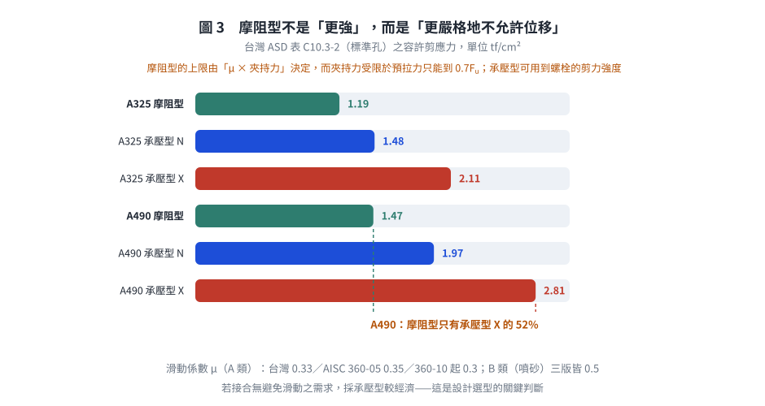

# 考題編號：SS-2017-2

**主分類：** `SS-U1-4` 接合之分析與設計
**副分類：** 無
**設計法：** LRFD
**標籤：** `高強度螺栓` `摩阻型接合` `Slip-critical` `剪力傳遞機制` `極限狀態` `夾緊力` `摩擦係數` `滑動` `預拉力0.7Fu` `孔型係數` `規範版本差異`

---

## 1. 原始題目重述 (Problem Restatement)

請敘述高強度螺栓接合中摩阻型（Slip-critical）螺栓接合承受剪力時之**傳遞機制**及如何定義其**極限狀態**。（15 分）

---

## 2. 考題核心精神與出題者意圖 (Core Concepts & Examiner's Intent)

**核心觀念：高強度螺栓靠「夾力 → 摩擦」而非「螺栓直接承壓」來傳遞剪力**

此題測驗考生能否區分摩阻型（Slip-critical）與承壓型（Bearing-type）螺栓接合的根本差異，並正確定義滑動這個「極限狀態」的層面（使用性極限 or 強度極限？）。

**出題者測驗重點：**
- 高拉力預緊 → 夾緊力 → 摩擦力 的因果鏈
- 摩擦力的計算要素：夾緊力、摩擦係數（μ or ks）、接觸面數
- 極限狀態分類：滑動可能是 (a) 使用性極限狀態 或 (b) 強度極限狀態，依設計情境而定
- 摩阻型與承壓型的轉換關係

---

## 3. 解題戰略地圖與陷阱分析 (Strategic Roadmap & Trap Analysis)

**步驟規劃：**
1. 說明「高拉力預緊」是摩阻型接合的先決條件
2. 說明剪力傳遞機制：摩擦力（非螺栓孔承壓）
3. 定義滑動極限狀態（主要）+ 其他極限狀態（次要）
4. 說明 LRFD 下的摩阻型設計公式

**關鍵陷阱：**

> ⚠️ **陷阱1：誤以為摩阻型螺栓靠螺栓桿傳力**
> 摩阻型設計的核心是**接觸面摩擦力**，不是螺栓桿的剪力或承壓。只要接合未滑動，螺栓桿實際上幾乎不受剪力（全靠夾緊力產生的摩擦）。

> ⚠️ **陷阱2：極限狀態只說「滑動」而未說明分類**
> 滑動在某些情況是使用性極限（服務載重下不能滑動，如：精密機械設備的接合，滑動後影響精度），在某些情況是強度極限（大地震或重要結構，滑動後立即破壞）。需要明確區分。

> ⚠️ **陷阱3：忘記「接觸面數（nf）」的影響**
> 一個螺栓可有單剪（nf = 1）或雙剪（nf = 2）接觸面，摩擦力與接觸面數成正比。

---

## 3.5 變數層次分析（Variable Hierarchy Analysis）

> 複習提示：解題後，在每個卡住的知識點「卡關?」欄標記 `⚠`；第二次複習時只看有 `⚠` 的項目。

**最終目標：** 說明摩阻型螺栓靠「預緊→夾緊力→摩擦力」傳遞剪力的機制，並定義滑動（Slip）為主要極限狀態及其使用性/強度極限的分類

### 主要公式（$\boxed{\phantom{x}}$ = 未知，待推導）

**台灣 2010 規範（容許應力設計法）—— 表列容許剪應力，不用公式：**
$$f_v \le F_v^{\text{摩阻型}} \quad\text{（A325 標準孔 } 1.19\text{ tf/cm}^2\text{；A490 標準孔 } 1.47\text{ tf/cm}^2\text{）}$$

**AISC 360 系列（公式化）：**
$$\boxed{R_n} = \mu \cdot D_u \cdot h_f \cdot T_b \cdot n_s \quad \text{（每支螺栓）}$$

$$\text{預拉力：} \; T_b = 0.70\,F_u^b\,A_t \quad\text{（規範表列，「等於最小抗拉強度之 0.7 倍」）}$$

> ⚠️ $\phi$ 之取法**因規範版本而異**，見 §4(二) 與 §6：AISC 360-05 依「使用性／強度極限」分 1.00／0.85；**AISC 360-10 起改依孔型**分 1.00／0.85／0.70。

### L1：題目直接給定

| 符號 | 數值 | 說明 |
|------|------|------|
| 接合類型 | 摩阻型（Slip-critical）| 靠夾緊摩擦傳力，非螺栓桿直接承壓 |
| 設計法 | LRFD | 強度折減係數 $\phi$ 依極限狀態選取 |

### L2：需知識點推導

**Step 1：高拉力預緊機制**

| 符號 | 公式 / 來源 | 卡關? |
|------|------------|:-----:|
| $T_b$（$T_o$） | 規定最小螺栓預拉力 = $0.70 F_u^b A_t$（規範表列，$A_t$ 為螺紋處有效抗拉面積）| |
| 夾緊力 | 螺桿拉伸 → 頭部/螺帽對鋼板形成正向壓力 $T_o$ | |
| 接觸面摩擦力 | $f = \mu \times T_o$（每支螺栓、每個接觸面）| |

**Step 2：剪力傳遞機制**

| 符號 | 公式 / 來源 | 卡關? |
|------|------------|:-----:|
| $\mu$（$k_s$）| 滑動係數：台灣規範要求「潔淨銹皮與噴氣清除及表面塗以護膜者，其滑動係數應在 **0.33** 以上」；AISC 360-10 起 A 類 = **0.30**、B 類（噴砂）= **0.50** | |
| $n_s$ | 接觸面數：單剪 = 1，雙剪 = 2 | |
| $D_u$ | 實際／規定最小預拉力之比（AISC 取 **1.13**）| |
| $h_{sc}$ / $h_f$ | AISC 360-05：孔型係數 $h_{sc}$（標準孔 1.0、超大孔 0.85、長槽孔 0.70）；**AISC 360-10 起改為填隙板係數 $h_f$**，孔型效應移入 $\phi$ | |
| 螺栓桿受力狀態 | 滑動前螺栓桿幾乎不受剪——全靠摩擦傳力 | |

**Step 3：極限狀態定義**

| 符號 | 公式 / 來源 | 卡關? |
|------|------------|:-----:|
| 主要極限狀態 | 接觸面滑動（Slip at faying surface）| |
| 使用性極限 | 服務載重下不允許滑動（精密／疲勞接合）；AISC 360-05 之 $\phi = 1.00$ | |
| 強度極限 | 因數化載重下不允許滑動（安全等級高）；AISC 360-05 之 $\phi = 0.85$ | |
| ⚠️ 版本注意 | **AISC 360-10 起 $\phi$ 改依孔型**（標準孔／短槽孔垂直力向 1.00；超大孔／短槽孔平行力向 0.85；長槽孔 0.70），不再依使用性／強度區分 | |
| 次要極限狀態 | 螺栓桿剪力破壞、孔壁承壓、淨截面斷裂（滑動後轉承壓型）| |

### L3：深層知識（不懂就卡住）

| 知識點 | 說明 | 補強頁 | 卡關? |
|--------|------|:------:|:-----:|
| 摩阻型 vs 承壓型的根本差異 | 摩阻型靠摩擦（螺栓桿不受剪）；承壓型靠螺栓桿剪力+孔壁承壓 | | |
| 接觸面處理等級 | 滑動係數 $\mu$ 取決於表面處理；A/B 類差異大，設計師需在規格書中明定 | | |
| 滑動極限的雙重分類 | 使用性 vs 強度——這是**概念上**的分類（本題答題核心）；至於 $\phi$ 是否依此分類取值則因規範版本而異（360-05 是、360-10 起否） | | |
| 接觸面數 $n_s$ | 單剪（一個接觸面）vs 雙剪（兩個接觸面）；強度直接成比例 | | |
| 預拉力係數 0.70 | $T_b = 0.70F_u^bA_t$；此係數自 AISC LRFD 1993 至 360-22 未變（台灣規範原文：「等於最小抗拉強度之 0.7 倍」） | | |
| 滑動後行為 | 接合滑動後螺栓桿接觸孔壁，轉變為承壓型行為，繼續加載才會桿剪破壞 | | |

---

## 4. 步驟化詳細計算過程 (Step-by-Step Detailed Calculation)

### (一) 摩阻型螺栓接合承受剪力時的傳遞機制

#### 前提：高拉力預緊（High-Tension Preloading）

摩阻型接合的根本前提是螺栓在安裝時被施加高拉力（預緊力），在接合板間產生強大的**夾緊力（Clamping Force）**。

對於一支螺栓，其規定**最小預拉力** $T_b$ 依規範表列（台灣規範表 10.3-1 之原文：「等於最小抗拉強度之 **0.7 倍**」）：

$$T_b = 0.70 \times F_u^b \times A_t$$

其中 $F_u^b$ 為螺栓最小抗拉強度、$A_t$ 為**螺紋處有效抗拉面積**（$\approx 0.75 A_b$）。

*數值驗核（3/4 in A325，$F_u^b = 120$ ksi、$A_t = 0.334$ in²）：$0.70 \times 120 \times 0.334 = 28.1$ kips，與 AISC 表 J3.1 所列 28 kips 相符 ✓。若誤用全斷面積 $A_b = 0.442$ in² 則得 37.1 kips，高估 33%。*

日系扭剪型螺栓（F10T／S10T）之標準張力另依 JIS／CNS 表列（例如 M20 之設計軸力約 160 kN、M22 約 200 kN），台灣工程實務兩套系統並存，**須依設計圖說所指定之螺栓標準查表**。

#### 剪力傳遞機制：接觸面摩擦力

當接合承受水平剪力 $V$ 時：

```
 ─────────────────────────────────
 板 1（上）  |  ← V 受剪力
 ─────────────────────────────────
     ↑ 夾緊力 T₀        ← 螺栓高拉力預緊，使兩板緊密壓合
 ─────────────────────────────────
 板 2（下）  |
 ─────────────────────────────────
     接觸面存在摩擦力 f = μ × T₀
```

**傳遞步驟：**

1. **螺栓預緊**：安裝後，以扭力扳手、轉角法或直接張力指示器（DTI）等方式，將螺栓預緊至設計拉力 $T_o$。
2. **夾緊力形成**：螺桿拉伸 → 頭部和螺帽對鋼板形成夾緊壓力 $T_o$（正向力）。
3. **摩擦力抵抗剪力**：在接觸面（faying surface）上，摩擦力 $f = \mu \times T_o$ 抵抗外部剪力。
   - $\mu$（或 $k_s$）= 滑動係數，取決於接觸面處理方式（未塗裝 / 噴砂 / 熱浸鍍鋅等）
4. **不滑動狀態**：在外力未超過摩擦力總量之前，接合板不產生相對滑動，**螺栓桿本身幾乎不承受剪力或承壓力**。


*圖 1　剪力的傳遞路徑：預緊 → 夾緊力 → 接觸面摩擦，力完全不經過螺栓桿。這張圖攔的是「摩阻型靠螺栓桿傳剪」這個最根本的誤解，也標出 $T_b$ 要乘的是螺紋處有效抗拉面積 $A_t$。*

**設計滑動強度 —— 兩套規範寫法**

**(a) 台灣 2010 規範（容許應力設計法第十章）：表列容許剪應力**

台灣 ASD 規範**不用乘積公式**，而是直接表列摩阻型接合之螺栓容許剪應力（表 10.3-2／C10.3-2）：

| 螺栓 | 標準孔 | 超大孔／短槽孔 | 長槽孔 |
|------|-------|--------------|-------|
| A325 | 1.19 tf/cm²（17 ksi） | 1.05 | 0.84 |
| A490 | 1.47 tf/cm²（21 ksi） | 1.26 | 1.05 |

並於 §10.3.7 規定接觸面處理：「潔淨銹皮與噴氣清除及表面塗以護膜者，其**滑動係數應在 0.33 以上**」。

*（對照：同表之**承壓型** A490 螺紋不在剪力面者為 40 ksi = 2.81 tf/cm²——摩阻型僅為承壓型的 **52%**，這是摩阻型設計「較保守」的量化證據。）*

**(b) AISC 360 系列：乘積公式**

$$R_n = \mu \cdot D_u \cdot h_f \cdot T_b \cdot n_s$$

其中：
- $\mu$（或 $k_s$）= 平均滑動係數：**AISC 360-10 起** A 類（未塗裝軋製鋼）= **0.30**、B 類（噴砂）= **0.50**（360-05 之 A 類為 0.35；AISC LRFD 1993 與台灣規範為 0.33）
- $D_u = 1.13$ = 實際安裝預拉力與規定最小值之比
- $h_f$ = 填隙板（filler）係數（**360-10 起**取代 360-05 之孔型係數 $h_{sc}$）
- $T_b = 0.70F_u^bA_t$ = 規定最小預拉力
- $n_s$ = 接觸面（faying surface）數：單剪 = 1，雙剪 = 2

$$\phi R_n:\quad \begin{cases}
\text{AISC 360-05：} & \phi = 1.00\ (\text{使用性極限}),\quad \phi = 0.85\ (\text{強度極限}) \\[2pt]
\text{AISC 360-10／-16／-22：} & \phi = 1.00\ (\text{標準孔、短槽孔垂直力向}) \\
& \phi = 0.85\ (\text{超大孔、短槽孔平行力向}) \\
& \phi = 0.70\ (\text{長槽孔})
\end{cases}$$

> ⚠️ **這是本題最容易答錯的細節**：「$\phi = 1.0$ 用於使用性、$\phi = 0.85$ 用於強度」是 **AISC 360-05（及台灣規範所本之 LRFD 1999 附錄）**的規定；**AISC 360-10 起 $\phi$ 改依孔型取值**，孔型效應由 $h_{sc}$ 移入 $\phi$，而「使用性／強度」之區分則純粹決定**檢核時所用的載重組合**（使用載重 vs 因數化載重），不再影響 $\phi$。

**傳力機制示意（雙剪接合）：**

```
板A ──→ V ──→ 接觸面1（摩擦）──→ 板B ──→ 接觸面2（摩擦）──→ 板A
                nf = 2 → 總摩擦力 = 2 × μ × T₀（每支螺栓）
```

---

### (二) 極限狀態定義

摩阻型螺栓接合的**主要極限狀態**是**接合滑動（Slip）**，但依設計情境有不同分類：

#### 極限狀態 1：滑動（Slip）—— 主要極限狀態

**定義：** 當外部剪力超過接觸面摩擦阻力時，接合板產生相對位移（滑動），摩擦傳力失效。此為摩阻型接合的**設計控制極限狀態**。

| 滑動的設計分類 | 檢核載重 | 適用情境 | AISC 360-05 之 $\phi$ |
|--------------|---------|---------|---------------------|
| **使用性極限狀態（Serviceability）** | **服務載重**（未因數化） | 精密接合、疲勞接合、需避免板件相對位移影響幾何精度者；滑動後結構仍安全 | 1.00 |
| **強度極限狀態（Strength）** | **因數化設計載重** | 接合一旦滑動即危及結構安全（如超大孔或長槽孔使滑動量過大、或滑動後承壓型強度不足者） | 0.85 |

> 📌 **AISC 360-10 起之改變**：「使用性／強度」之區分**仍然存在**，但只決定**用哪一組載重去檢核**；$\phi$ 改依**孔型**取值（1.00／0.85／0.70）。台灣 2010 規範（ASD）則以表列容許剪應力涵蓋孔型效應（標準孔／超大孔／長槽孔三欄），概念一致。


*圖 2　滑動不是「破壞」，而是傳力機制的切換；滑動後接合轉為承壓型行為，還要再檢核螺栓剪力、孔壁承壓與淨斷面。這張圖攔的是極限狀態只答「滑動」而說不出後續與分類。*

#### 極限狀態 2：螺栓桿破壞（Bolt Shear Failure）

一旦接合滑動後（摩擦喪失），螺栓桿直接接觸孔壁，接合轉變為「承壓型行為」。繼續加載會導致螺栓桿剪力破壞：

$$R_n = F_{nv} \cdot A_b$$

其中 $F_{nv}$ = 螺栓剪力強度，$A_b$ = 螺栓截面積。

#### 極限狀態 3：承壓破壞（Bearing Failure）

螺栓孔壁承壓應力超過鋼板極限強度，孔壁擠壓擴孔：

$$R_n = 1.2 L_c t F_u \le 2.4 F_u d t \quad\text{（AISC 360-16 §J3.10；360-22 拆為承壓 §J3.11 + 撕出 §J3.12）}$$

#### 極限狀態 4：淨截面斷裂（Net Section Rupture）

接合板有孔，在螺栓排列方向的最危險斷面拉斷。

---

**各極限狀態的設計優先序（摩阻型）：**

```
摩阻型設計 → 首要控制：Slip Resistance ≥ 設計剪力
                     ↓（若滑動後）
                  轉承壓型行為 → 檢核：螺栓剪力 + 承壓 + 淨截面
```

$$\boxed{\text{主要極限狀態：接觸面滑動（Slip at faying surface）}}$$

---

## 5. 關鍵爭議點與進階探討 (Critical Issues & Advanced Discussion)

### 摩阻型 vs 承壓型的設計哲學差異

| 項目 | 摩阻型（Slip-critical） | 承壓型（Bearing-type） |
|------|----------------------|---------------------|
| 傳力方式 | 接觸面摩擦力 | 螺栓桿剪力 + 孔壁承壓 |
| 需要預緊？ | 是（且需驗證）| 需要安裝，但不依賴特定預緊力 |
| 允許滑動？ | 不允許（服務或強度）| 允許滑動至孔壁接觸再傳力 |
| 設計強度 | 通常較低（保守）| 通常較高（利用螺栓全強度）|
| 適用場合 | 動態/疲勞/精密/孔大 | 靜態/一般/孔標準 |

### 接觸面處理的重要性與規範版本差異

滑動係數 $\mu$ 對設計強度影響很大，且**各版規範數值不同**：

| 表面等級 | 台灣 2010／AISC LRFD 1993 | AISC 360-05 | AISC 360-10／-16／-22 |
|---------|--------------------------|-------------|---------------------|
| **A 類**（未塗裝清潔軋製鋼面、經噴氣清除之銹皮面） | **0.33** | 0.35 | **0.30** |
| **B 類**（噴砂清潔至近白色，SSPC-SP6） | 0.50 | 0.50 | 0.50 |
| C 類（熱浸鍍鋅後打毛） | 0.35（部分版本） | 併入 A 類 | 併入 A 類 |

台灣規範 §10.3.7(g) 之原文要求：「潔淨銹皮與噴氣清除及表面塗以護膜者，其**滑動係數應在 0.33 以上**」。

設計者必須在規格書中明確要求接觸面處理方式，並在施工前確認——**這是唯一無法靠計算補救的參數**。實務常見問題：
- 接觸面誤塗防銹底漆（未經認可之塗裝會使 $\mu$ 降至 0.1 以下）
- 熱浸鍍鋅面未打毛
- 施工期間接觸面沾附油污、泥土

### 摩阻型接合強度為何遠低於承壓型？（量化）

由台灣 ASD 規範表 C10.3-2（標準孔）：

| 螺栓 | 摩阻型 | 承壓型（螺紋在剪力面 N） | 承壓型（螺紋不在剪力面 X） |
|------|-------|----------------------|------------------------|
| A325 | 1.19 tf/cm² | 1.48 tf/cm² | 2.11 tf/cm² |
| A490 | 1.47 tf/cm² | 1.97 tf/cm² | 2.81 tf/cm² |
| A490 摩阻型／承壓型 X | — | — | **52%** |

摩阻型只能用到承壓型（X）約一半的容量。原因：摩阻型的強度上限由「$\mu \times$ 夾持力」決定，而夾持力受限於螺栓不得超過其抗拉強度的 70%；而承壓型可用到螺栓的**剪力強度**（約 $0.5F_u^b$）。

**設計意涵**：摩阻型不是「更強」，而是「更嚴格地不允許位移」。若接合並無避免滑動之需求，採承壓型較經濟。



*圖 3　摩阻型的容許剪應力只有承壓型 X 的一半。上限由「$\mu \times$ 夾持力」決定，而夾持力受限於預拉力只能到 $0.7F_u$；這張圖攔的是「摩阻型比較強」的直覺——它換到的是「不允許位移」，不是強度。*

### 何時必須用摩阻型？（規範強制情形）

| 情形 | 理由 |
|------|------|
| 承受反復荷重需**變換方向**之接合 | 滑動會造成反復衝擊、螺栓疲勞 |
| 使用**超大孔或長槽孔**且不允許相對位移者 | 滑動量過大會影響幾何 |
| 承受**疲勞**載重之接合（AISC 附錄 3） | 滑動處易生磨蝕疲勞 |
| **耐震**抗彎構架之特定接合（AISC 341） | 韌性需求，滑動會改變塑鉸位置 |
| 螺栓與銲接**共同承擔**同一力者 | 銲道剛度遠高於承壓型螺栓，須靠摩擦分擔 |

### 考場安全答法

| 項目 | 核心答法 |
|------|---------|
| 傳遞機制 | 「螺栓高拉力預緊（$T_b = 0.7F_u^bA_t$）→ 板間夾緊力 → 接觸面摩擦力抵抗剪力；**滑動前螺栓桿幾乎不受剪、孔壁不承壓**」 |
| 傳遞公式 | 「$R_n = \mu \cdot D_u \cdot h_f \cdot T_b \cdot n_s$（每支螺栓）；台灣 ASD 則直接查表列容許剪應力」 |
| 極限狀態（主） | 「**接觸面滑動（slip at faying surface）**」 |
| 滑動之分類 | 「依滑動之後果分為**使用性極限狀態**（以服務載重檢核）與**強度極限狀態**（以因數化載重檢核）」 |
| 極限狀態（次） | 「滑動後轉為承壓型行為：螺栓剪力破壞、孔壁承壓／撕出、板件全斷面降伏與淨斷面斷裂、塊狀撕裂」 |
| 加分句 | 「$\mu$ 取決於接觸面處理，須於規格書明訂並於施工前查驗；$\mu$ 值各版規範不同（台灣 0.33、AISC 360-16 之 A 類 0.30、B 類 0.50）」 |

---

## 6. 依最新規範（AISC 360-16／-22）對照

> **本題主答案所依規範**：內政部「鋼構造建築物鋼結構設計技術規範」民國 99 年（2010）修正版。本題為敘述題，機制與極限狀態之定義三套規範一致；差異在**強度式的表達方式與 $\phi$／$\mu$ 之取值**。

### 6.1 設計滑動強度之表達方式演進

| 規範 | 形式 | $\phi$（或容許應力） |
|------|------|-------------------|
| 台灣 2010 **ASD** | 表列容許剪應力（依螺栓等級 × 孔型） | A325 標準孔 1.19、A490 標準孔 1.47 tf/cm² |
| 台灣 2010 **LRFD** | 設計滑動強度（依 AISC LRFD 1999 體系） | 滑動係數 ≥ 0.33 |
| **AISC 360-05** | $R_n = \mu D_u h_{sc} T_b n_s$ | $\phi = 1.00$（使用性）／$0.85$（強度） |
| **AISC 360-10／-16／-22** | $R_n = \mu D_u h_f T_b n_s$ | **$\phi$ 依孔型**：1.00 / 0.85 / 0.70 |

**兩項關鍵改變（360-05 → 360-10）：**

1. **孔型係數 $h_{sc}$ → 填隙板係數 $h_f$**：孔型效應由乘積項移入 $\phi$。理由：孔型影響的是「滑動後可容許之位移量」（即可靠度需求），而非摩擦機制本身的強度。
2. **$\phi$ 由「使用性／強度」改為「依孔型」**：使用性／強度之區分仍在，但只決定所用的**載重組合**。

### 6.2 滑動係數 $\mu$ 之數值變動

| 表面等級 | 台灣 2010 | AISC 360-05 | AISC 360-10／-16／-22 | 變動 |
|---------|----------|-------------|---------------------|------|
| A 類 | 0.33 | 0.35 | **0.30** | −14%（相對 360-05） |
| B 類 | 0.50 | 0.50 | 0.50 | 不變 |

360-10 調降 A 類 $\mu$ 是基於更多試驗數據（未塗裝軋製鋼面之離散性大）。**設計影響**：採 A 類表面之摩阻型接合，AISC 360-16 所得強度較台灣規範低約 9%。

### 6.3 預拉力 $T_b$ 與螺栓標準

| 項目 | 台灣 2010 | AISC 360-16／-22 |
|------|----------|-----------------|
| 預拉力定義 | 「等於最小抗拉強度之 **0.7 倍**」 | 「Equal to **0.70** times the minimum tensile strength」 |
| 面積 | 螺紋處有效抗拉面積 $A_t$ | 同 |
| 螺栓標準 | ASTM A325／A490；日系 F10T／S10T | **ASTM F3125**（Grade A325／A490 已整併入此標準） |
| $D_u$ | 隱含於表列值 | 1.13（明列） |

⇒ **0.70 這個係數自 AISC LRFD 1993 至 360-22 從未改變**，是本題最穩固的答案要素。

### 6.4 滑動後之極限狀態：360-22 之細化

| 極限狀態 | 台灣 2010 | AISC 360-16 | AISC 360-22 |
|---------|----------|-------------|-------------|
| 滑動 | §10.3（摩阻型） | §J3.8 | §J3.8 |
| 螺栓剪力 | 表列 $F_v$ | §J3.7 $F_{nv}A_b$ | §J3.7 |
| 孔壁承壓 | 式(10.3-1) | §J3.10（**承壓＋撕出合併**） | **§J3.11 承壓 + §J3.12 撕出（分列）** |
| 板件淨斷面斷裂 | 第五章 | §D2、§J4.1 | 同 |
| 塊狀撕裂 | §10.4 | §J4.3 | 同 |

### 6.5 對照總表

| 項目 | 台灣 2010（本文主答案） | AISC 360-16／-22 |
|------|----------------------|-----------------|
| 傳遞機制 | 預拉力 → 夾緊力 → 接觸面摩擦力 | **完全相同** |
| 主要極限狀態 | 接觸面滑動 | **完全相同** |
| 滑動之分類 | 使用性 / 強度 | **概念相同**；但 $\phi$ 自 360-10 起改依孔型 |
| 強度表達 | ASD 表列容許剪應力 | $R_n = \mu D_u h_f T_b n_s$ |
| $\mu$（A 類 / B 類） | 0.33 / 0.50 | **0.30** / 0.50 |
| 孔型效應 | 表列三欄（標準／超大／長槽） | 移入 $\phi$（1.00 / 0.85 / 0.70） |
| 預拉力係數 | 0.70 | 0.70（不變） |

---

*修正日期：2026-08-22*
*本次修正內容：①**釐清 $\phi$ 值之規範版本歸屬**——舊版逕稱「$\phi = 1.0$ 使用性、$\phi = 0.85$ 強度」，此為 **AISC 360-05** 之規定；**AISC 360-10 起 $\phi$ 改依孔型取值**（標準孔／短槽孔垂直力向 1.00、超大孔／短槽孔平行力向 0.85、長槽孔 0.70），且孔型係數 $h_{sc}$ 已改為填隙板係數 $h_f$；②補入**台灣 2010 規範之實際做法**（容許應力設計法以表列容許剪應力處理，不用乘積公式）並列出規範表值 A325 標準孔 1.19 tf/cm²、A490 標準孔 1.47 tf/cm²，及 §10.3.7(g)「滑動係數應在 0.33 以上」之原文；③更正滑動係數表：台灣 0.33、AISC 360-05 為 0.35、**AISC 360-10 起 A 類為 0.30**（舊版誤將 0.33 標為 AISC 值）；④**移除來源不明之 F10T 預拉力表**，改以規範原文「等於最小抗拉強度之 0.7 倍」＝ $0.70F_u^bA_t$（$A_t$ 為螺紋處有效抗拉面積）表述，並以 3/4 in A325 之 28 kips 表值作數值驗核；⑤補入「摩阻型僅為承壓型 X 之 52%」之量化比較、規範強制採用摩阻型之情形、承壓／撕出之 360-16 → -22 拆分；⑥新增 §6 依最新規範對照。*
*圖解補繪：2026-08-29（向量圖 3 張，腳本 `gen_SS-2017-2.py`，改輸入可原地重跑；SVG 供 wiki／PDF，2× PNG 供 pptx／影片）*
*驗證狀態：unverified*
