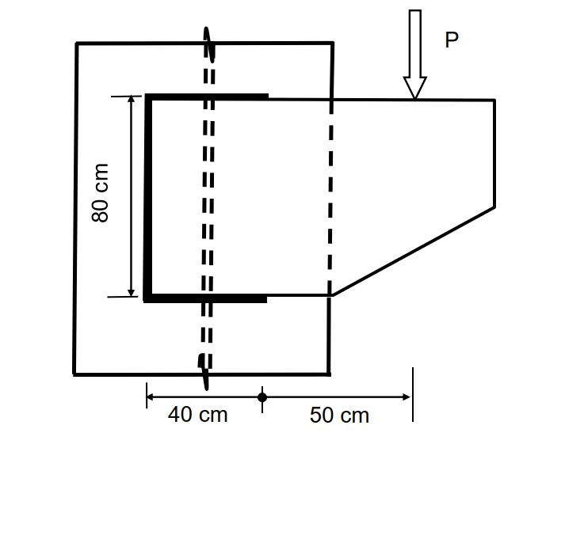

# 考題編號：SS-2017-4

**主分類：** `4.1.4` 接合之分析與設計
**副分類：** 無
**設計法：** LRFD
**標籤：** `填角銲` `偏心銲縫` `托架接合` `銲道群形心` `扭矩分析` `E70XX` `彈性向量法` `Jw極慣性矩`

---

## 1. 原始題目重述 (Problem Restatement)

一銲接於鋼柱托架承受 $P$ 之集中載重，採用 E70XX 銲條，填角銲之有效喉厚為 **10 mm**，銲道長度如下圖，上、下水平銲道長度相同。請依極限設計法（LRFD）檢核該銲道可承受之最大集中載重 $P_u$。（30 分）

$$\phi = 0.75,\quad \phi \cdot 0.6F_{EXX} \text{（銲縫標稱強度）},\quad \text{不須考慮載重係數}$$

**銲道幾何（由圖判讀）：**

```
         P（垂直向下）
         ↓
    ─────┬───────────────────────── 
    柱翼板│  ← 銲道（U形，開口朝右）    bracket plate
         │════════════════════╗ ← 上水平銲道 40 cm
         ║                   ║
         ║   80 cm           ║
   左垂直║ （銲道高度）       ║（bracket 無右側銲道）
         ║                   ║
         ║════════════════════╝ ← 下水平銲道 40 cm
         │
    ─────┴───────────────────────── 
              40 cm    50 cm
              ←bracket→←—e'—→
```

**銲道群組成：**
- 左垂直銲道：$d = 80$ cm
- 上水平銲道：$b = 40$ cm
- 下水平銲道：$b = 40$ cm（與上相同）
- 右側無銲道（U形缺口）

**載重位置：**
$P$ 施加於托架板右端，距柱翼板（銲道左端）之水平距離：$b + e' = 40 + 50 = 90$ cm



*圖說：柱翼板（左側大矩形，虛線表示柱輪廓）與梯形托架板（右側）之銲接接合平面圖。U 形銲道（粗黑線）由三段組成：左垂直銲道（高 80 cm）、上水平銲道（長 40 cm）、下水平銲道（長 40 cm），右側無銲道（開口朝右）。托架板右緣承受垂直向下集中載重 $P$（空心箭頭），載重作用點距柱翼板面水平距離 = 40 cm（銲道長度）+ 50 cm（托架板懸挑）= 90 cm。虛線直線為柱翼板中心線及托架板的參考線。銲道群形心計算：$\bar{x} = 40^2/(2\times40+80) = 10\text{ cm}$（距柱面），$\bar{y} = 40\text{ cm}$（距銲道底端），偏心距 $e = 90 - 10 = 80\text{ cm}$。*

> 📊 **互動圖請參閱：** `SS-2017-4-connection-viz.html`

---

## 2. 考題核心精神與出題者意圖 (Core Concepts & Examiner's Intent)

**核心觀念：偏心銲縫群的彈性向量法（Elastic Vector Method）**

此題考查偏心荷載下銲縫群的分析——P 在銲道群形心的**右方**，產生扭轉力矩，使各處銲道受到「直接剪力」與「扭矩剪力」的疊加。關鍵是找到臨界點（合成應力最大的銲道位置）並設定強度條件。

**出題者測驗重點：**
- 正確計算 U 形銲道群的**形心位置**（$\bar{x}$、$\bar{y}$）
- 正確計算銲道群的**極慣性矩** $J_w$（對形心的二次矩總和）
- 辨別**臨界點**（右端上下水平銲道端部，距形心最遠且方向最不利）
- 向量疊加：直接剪力（均勻向下）+ 扭矩剪力（垂直於 $r$ 方向）

---

## 3. 解題戰略地圖與陷阱分析 (Strategic Roadmap & Trap Analysis)

**作戰步驟：**
1. 確認銲道幾何（三段線段）
2. 求形心 $\bar{x}$、$\bar{y}$（對銲道群）
3. 求極慣性矩 $J_w$（各段對形心的 $\int r^2 \, dL$）
4. 計算偏心矩 $M = P \cdot e$（$e$ = P 到形心的水平距離）
5. 找臨界點，計算直接剪力 + 扭矩剪力分量
6. 合成最大剪力 = 銲道容許強度 → 求 $P_u$

**關鍵陷阱：**

> ⚠️ **陷阱1：形心位置計算錯誤（取距離柱面的距離）**
> U 形銲道的形心不在左端（$\bar{x} \neq 0$），而是向右偏移 $\bar{x} = b^2/(2b+d)$，忽略此偏移會導致偏心距計算錯誤。

> ⚠️ **陷阱2：扭矩方向判斷錯誤**
> $P$（向下）作用於形心右方 → 對形心產生**順時針（CW）**力矩。各點扭矩剪力方向需依 CW 方向推導。

> ⚠️ **陷阱3：臨界點不在直覺位置**
> 不是「距形心最遠的角點」就是臨界點——必須同時考慮扭矩剪力方向與直接剪力方向的向量和。右端水平銲道的扭矩剪力有朝下分量，與直接剪力同向，最危險。

> ⚠️ **陷阱4：喉厚單位**
> 有效喉厚 $t_e = 10$ mm $= 1$ cm，代入時需與銲道長度單位（cm）一致。

---

## 3.5 變數層次分析（Variable Hierarchy Analysis）

> 複習提示：解題後，在每個卡住的知識點「卡關?」欄標記 `⚠`；第二次複習時只看有 `⚠` 的項目。

**最終目標：** 求 U 形銲道群的形心與極慣性矩 $J_w$ → 計算偏心矩 → 彈性向量法疊加直接剪力與扭矩剪力 → 由臨界點強度條件反求最大 $P_u$

### 主要公式（$\boxed{\phantom{x}}$ = 未知，待推導）

$$\boxed{\bar{x}} = \frac{b^2}{2b+d} = \frac{40^2}{2\times40+80} = 10\text{ cm},\quad \bar{y} = 40\text{ cm}$$

$$\boxed{J_w} = \sum_i \int r^2\,dL = 197{,}333\text{ cm}^3,\quad e = 90 - \bar{x} = 80\text{ cm}$$

$$f_{\text{res}} = \sqrt{f_{tx}^2 + (f_v + f_{ty})^2} = 0.02454\,P \leq \phi\cdot0.6F_{EXX}\cdot t_e$$

$$\boxed{P_u} = \frac{2.215}{0.02454} \approx 90.3\text{ tf}$$

### L1：題目直接給定

| 符號 | 數值 | 說明 |
|------|------|------|
| 銲道形狀 | U 形（左垂直 + 上下水平）| 開口朝右 |
| 垂直銲道長 | $d = 80$ cm | |
| 水平銲道長 | $b = 40$ cm（上下各一）| |
| 有效喉厚 | $t_e = 10$ mm $= 1$ cm | |
| 銲條等級 | E70XX | $F_{EXX} = 70$ ksi $= 4.922$ tf/cm² |
| 載重偏心距 | 距柱翼板面 $40 + 50 = 90$ cm | |
| $\phi$ | 0.75 | 銲道強度折減係數 |

### L2：需知識點推導

**Step 1：計算銲道群形心**

| 符號 | 公式 / 來源 | 卡關? |
|------|------------|:-----:|
| $L_{\text{total}}$ | $40 + 80 + 40 = 160$ cm | |
| $\bar{x}$ | $\frac{40\times20 + 80\times0 + 40\times20}{160} = 10$ cm（U形速算：$b^2/(2b+d)$）| |
| $\bar{y}$ | $\frac{40\times0 + 80\times40 + 40\times80}{160} = 40$ cm（對稱，為銲道中高）| |

**Step 2：計算極慣性矩 $J_w$**

| 符號 | 公式 / 來源 | 卡關? |
|------|------------|:-----:|
| $I_{w1}$（下水平）| $\int_0^{40}[(x-10)^2 + (0-40)^2]dx = 73{,}333$ cm³ | |
| $I_{w2}$（左垂直）| $\int_0^{80}[(0-10)^2 + (y-40)^2]dy = 50{,}667$ cm³ | |
| $I_{w3}$（上水平）| 與 $I_{w1}$ 相同 $= 73{,}333$ cm³（對稱）| |
| $J_w$ | $73{,}333 + 50{,}667 + 73{,}333 = 197{,}333$ cm³ | |

**Step 3：偏心矩與直接剪力**

| 符號 | 公式 / 來源 | 卡關? |
|------|------------|:-----:|
| 偏心距 $e$ | $x_P - \bar{x} = 90 - 10 = 80$ cm | |
| 力矩 $M$ | $80P$（tf·cm，CW 順時針）| |
| $f_v^{\text{direct}}$ | $P/160$（均勻，垂直向下）| |

**Step 4：臨界點彈性向量法**

| 符號 | 公式 / 來源 | 卡關? |
|------|------------|:-----:|
| 臨界點 | 右端上/下水平銲道端部（$r_x=30,\;r_y=\pm40$）| |
| $f_{tx}$ | $M r_y / J_w = 80P\times40/197{,}333 = 0.01621P$（水平）| |
| $f_{ty}$ | $-M r_x / J_w = -80P\times30/197{,}333 = -0.01216P$（向下）| |
| $f_y^{\text{total}}$ | $-P/160 - 0.01216P = -0.01841P$ | |
| $f_{\text{res}}$ | $P\sqrt{0.01621^2 + 0.01841^2} = 0.02454P$ | |

**Step 5：由強度條件求 $P_u$**

| 符號 | 公式 / 來源 | 卡關? |
|------|------------|:-----:|
| 銲道單位強度 $q$ | $\phi\times0.6F_{EXX}\times t_e = 0.75\times0.6\times4.922\times1.0 = 2.215$ tf/cm | |
| $P_u$ | $2.215 / 0.02454 = 90.3$ tf | |

### L3：深層知識（不懂就卡住）

| 知識點 | 說明 | 補強頁 | 卡關? |
|--------|------|:------:|:-----:|
| 偏心銲道彈性向量法 | 直接剪力均勻分佈 + 扭矩剪力垂直半徑 $r$；向量疊加求合成 | [[eccentric-weld]] | |
| U 形形心偏移 | $\bar{x} \neq 0$（向右偏 $b^2/(2b+d)$）；偏心距需從形心量，非從銲道邊量 | [[eccentric-weld]] | |
| $J_w$ 是線積分非面積分 | 銲道是線段（cm³），非截面（cm⁴）；每段對形心的 $\int r^2 dL$ | | |
| CW 扭矩的分量符號 | CW 旋轉：$f_{tx} = +Mr_y/J_w$，$f_{ty} = -Mr_x/J_w$；方向不可混淆 | | |
| 臨界點的辨別邏輯 | 不只看距形心最遠，須確認扭矩剪力與直接剪力是否同向疊加 | [[eccentric-weld]] | |
| E70XX 強度換算 | 70 ksi × 0.07031 = 4.922 tf/cm²；台灣考試常考單位換算 | | |

---

## 4. 步驟化詳細計算過程 (Step-by-Step Detailed Calculation)

### Step 1：確認銲道群幾何

取座標原點於銲道群**左下角**（左垂直銲道底端）：

| 段 | 路徑 | 長度 |
|----|------|------|
| ① 下水平銲道 | $x: 0 \to 40$，$y = 0$ | $L_1 = 40$ cm |
| ② 左垂直銲道 | $x = 0$，$y: 0 \to 80$ | $L_2 = 80$ cm |
| ③ 上水平銲道 | $x: 0 \to 40$，$y = 80$ | $L_3 = 40$ cm |

$$L_{\text{total}} = 40 + 80 + 40 = 160 \text{ cm}$$

---

### Step 2：求銲道群形心 $(\bar{x},\,\bar{y})$

$$\bar{x} = \frac{\sum L_i \bar{x}_i}{L_{\text{total}}} = \frac{40 \times 20 + 80 \times 0 + 40 \times 20}{160} = \frac{800 + 0 + 800}{160} = \frac{1600}{160} = 10 \text{ cm}$$

$$\bar{y} = \frac{40 \times 0 + 80 \times 40 + 40 \times 80}{160} = \frac{0 + 3200 + 3200}{160} = \frac{6400}{160} = 40 \text{ cm}$$

$$\boxed{\text{形心 } C = (10,\;40) \text{ cm，自左下角量起}}$$

---

### Step 3：計算極慣性矩 $J_w$

對形心 $C = (10, 40)$，各段對形心的積分 $\int r^2\, dL = \int [(x-\bar{x})^2 + (y-\bar{y})^2]\, dL$：

**① 下水平銲道**（$y=0$，$x: 0\to40$，令 $u = x-10$，$u: -10\to30$）：

$$I_{w1} = \int_0^{40}\left[(x-10)^2 + (0-40)^2\right]dx$$

$$= \left[\frac{(x-10)^3}{3}\right]_0^{40} + 1600 \times 40$$

$$= \frac{30^3 - (-10)^3}{3} + 64{,}000 = \frac{27{,}000 + 1{,}000}{3} + 64{,}000 = 9{,}333 + 64{,}000 = 73{,}333 \text{ cm}^3$$

**② 左垂直銲道**（$x=0$，$y: 0\to80$，令 $v = y-40$，$v: -40\to40$）：

$$I_{w2} = \int_0^{80}\left[(0-10)^2 + (y-40)^2\right]dy$$

$$= 100 \times 80 + \left[\frac{(y-40)^3}{3}\right]_0^{80}$$

$$= 8{,}000 + \frac{40^3 - (-40)^3}{3} = 8{,}000 + \frac{2 \times 64{,}000}{3} = 8{,}000 + 42{,}667 = 50{,}667 \text{ cm}^3$$

**③ 上水平銲道**（$y=80$）：與①積分形式完全相同：

$$I_{w3} = 73{,}333 \text{ cm}^3$$

**銲道群極慣性矩：**

$$J_w = I_{w1} + I_{w2} + I_{w3} = 73{,}333 + 50{,}667 + 73{,}333 = \boxed{197{,}333 \text{ cm}^3}$$

---

### Step 4：偏心矩與直接剪力

**P 的位置（以左下角為原點）：** $x_P = 40 + 50 = 90$ cm，高度取形心高 $y_P = 40$ cm（P 垂直作用，水平臂才影響力矩）

**偏心矩（對形心 $C$ 的力矩）：**

$$M = P \cdot e = P \times (x_P - \bar{x}) = P \times (90 - 10) = 80P \quad \text{（tf·cm，CW 順時針）}$$

**直接剪力（均勻分佈於全銲道）：**

$$f_v^{\text{direct}} = \frac{P}{L_{\text{total}}} = \frac{P}{160} \quad \text{（tf/cm，垂直向下）}$$

---

### Step 5：臨界點分析（彈性向量法）

對銲道群上任意點 $(r_x, r_y)$（從形心量起），扭矩剪力分量為（CW 旋轉）：

$$f_{tx} = \frac{M \cdot r_y}{J_w}, \qquad f_{ty} = -\frac{M \cdot r_x}{J_w}$$

合成剪力：
$$f_{\text{res}} = \sqrt{\left(f_{tx}\right)^2 + \left(f_v^{\text{direct}} + f_{ty}\right)^2}$$

**檢核各角點：**

| 位置 | $(r_x,\;r_y)$ | $f_{tx}/P$ | $f_{ty}/P$ | $f_v/P$ | $f_{\text{res}}/P$ |
|------|--------------|-----------|-----------|--------|-------------------|
| 上水平右端 | $(30,\;40)$ | $+0.01621$ | $-0.01216$ | $-0.00625$ | **0.02454** |
| 下水平右端 | $(30,\;-40)$ | $-0.01621$ | $-0.01216$ | $-0.00625$ | **0.02454** |
| 上水平左端 | $(-10,\;40)$ | $+0.01621$ | $+0.00406$ | $-0.00625$ | 0.01636 |
| 下水平左端 | $(-10,\;-40)$ | $-0.01621$ | $+0.00406$ | $-0.00625$ | 0.01636 |
| 垂直銲道頂端 | $(-10,\;40)$ | $+0.01621$ | $+0.00406$ | $-0.00625$ | 0.01636 |

**臨界點為上水平銲道右端及下水平銲道右端，應力相等。**

以上水平右端 $(r_x=30,\;r_y=40)$ 詳算：

$$f_{tx} = \frac{80P \times 40}{197{,}333} = \frac{3{,}200P}{197{,}333} = 0.01621P \quad \text{（向右）}$$

$$f_{ty} = -\frac{80P \times 30}{197{,}333} = -\frac{2{,}400P}{197{,}333} = -0.01216P \quad \text{（向下）}$$

$$f_y^{\text{total}} = -0.00625P - 0.01216P = -0.01841P \quad \text{（向下）}$$

$$f_{\text{res}} = P\sqrt{0.01621^2 + 0.01841^2} = P\sqrt{0.000263 + 0.000339} = P\sqrt{0.000602} = 0.02454P$$

---

### Step 6：求最大荷載 $P_u$

**E70XX 銲道標稱強度：**

$$F_{EXX} = 70 \text{ ksi} \times 0.07031 \text{ tf/cm}^2\text{/ksi} = 4.922 \text{ tf/cm}^2$$

**銲道容許強度（每 cm 銲道長度）：**

$$q_{\text{allow}} = \phi \cdot 0.6 F_{EXX} \cdot t_e = 0.75 \times 0.6 \times 4.922 \times 1.0 = \boxed{2.215 \text{ tf/cm}}$$

**強度條件：**

$$f_{\text{res}} \leq q_{\text{allow}} \quad \Rightarrow \quad 0.02454 \cdot P_u = 2.215$$

$$\boxed{P_u = \frac{2.215}{0.02454} \approx 90.3 \text{ tf}}$$

---

## 5. 關鍵爭議點與進階探討 (Critical Issues & Advanced Discussion)

### 公式整理（彈性向量法速查）

| 步驟 | 公式 |
|------|------|
| 形心 $\bar{x}$ | $\dfrac{\sum L_i \bar{x}_i}{\sum L_i}$，U形：$\bar{x} = \dfrac{b^2}{2b+d}$ |
| 極慣性矩 $J_w$ | $\displaystyle\sum_i \int_{\text{segment}_i} r^2 \, dL$（線積分，非面積分）|
| 直接剪力 | $f_v = V/L_{\text{total}}$（均勻，方向與 V 相同）|
| 扭矩剪力 | $f_t = Mr/J_w$（垂直於半徑 $r$，依旋轉方向）|
| 分量（CW）| $f_{tx} = Mr_y/J_w$，$f_{ty} = -Mr_x/J_w$ |
| 合成 | $f_{\text{res}} = \sqrt{f_x^2 + f_y^2} \leq \phi \cdot 0.6F_{EXX} \cdot t_e$ |

### U 形銲道的形心位移速算公式

$$\bar{x} = \frac{b^2}{2b + d} = \frac{40^2}{2 \times 40 + 80} = \frac{1600}{160} = 10 \text{ cm}$$

此公式適用於對稱 U 形（上下水平銲道等長）。

### 與瞬心法（AISC Table 8-4）的差異

AISC 手冊提供「瞬心法（Instantaneous Center Method）」，考慮銲道非線性強度折減，通常比彈性向量法給出更高（較不保守）的強度。考試若無特別說明，用彈性向量法為標準解法。

### 銲道有效喉厚 $t_e$ vs 銲腳尺寸 $w$

- 本題直接給定 $t_e = 10$ mm（有效喉厚）
- 若題目給的是銲腳尺寸 $w$：$t_e = 0.707w$（45° 填角銲）

### 考場安全答法

| 步驟 | 簡化重點 |
|------|---------|
| 形心 | 先算 $\bar{x} = 10$ cm（U形速算公式）、$\bar{y} = 40$ cm（對稱）|
| $J_w$ | 分三段積分，上下水平段相同（各 73,333），垂直段 50,667；合計 197,333 cm³ |
| 偏心矩 | $e = 90 - 10 = 80$ cm，$M = 80P$ |
| 臨界點 | 右端上下水平銲道（各算一次即可，結果相同）|
| $P_u$ | $= q_{\text{allow}} / 0.02454 = 2.215 / 0.02454 \approx \mathbf{90 \text{ tf}}$ |
