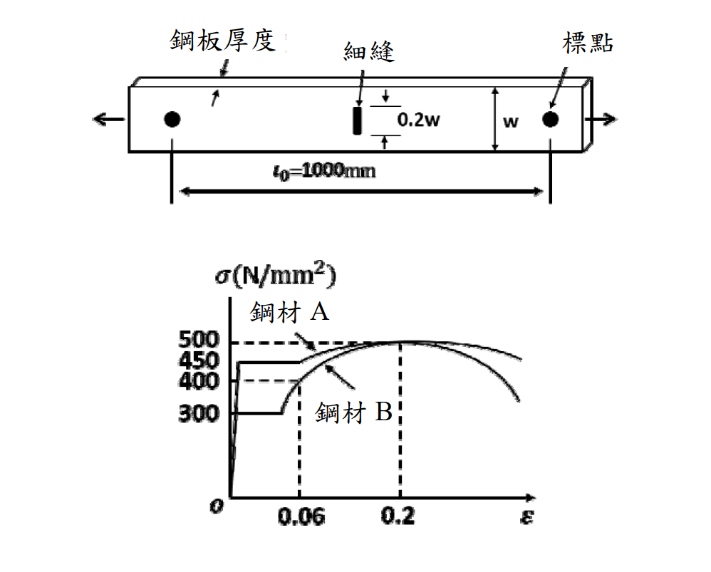

# SS-2018-1 解析

### 考題編號：SS-2018-1

**主分類：** `SS-U2-2` 鋼結構材料特性
**副分類：** 無
**設計法：** 概念題
**標籤：** `降伏比` `σ-ε曲線` `伸長量` `均勻伸長` `應力集中` `韌性` `細縫鋼板` `應變硬化`

---

## 1. 原始題目重述 (Problem Restatement)

**題目：** 如圖，有一中間設有細縫（slit）之鋼板受拉力作用，此鋼件考慮分別使用應力-應變關係不同之兩種鋼材 A 與 B 製作。

**(一)** 忽略應力/應變集中進行分析，試推估兩種材料之鋼件受最大拉力時標點間伸長量為何？（15 分）

**(二)** 說明降伏比對鋼件伸長量之影響。（10 分）

**已知條件：**
- 鋼板標點距（gauge length）：$L_0 = 1000 \text{ mm}$
- 細縫（slit）位於鋼板中央附近，寬度 $0.2w$，標點至細縫距離 $w$
- 鋼材 A（應力-應變圖）：$\sigma_y^A \approx 300 \text{ N/mm}^2$，$\sigma_u^A \approx 500 \text{ N/mm}^2$，破裂應變 $\varepsilon_u^A = 0.2$
- 鋼材 B（應力-應變圖）：$\sigma_y^B \approx 400 \text{ N/mm}^2$，$\sigma_u^B \approx 450 \text{ N/mm}^2$，破裂應變 $\varepsilon_u^B = 0.06$

*圖說：鋼板標點間距 $L_0 = 1000$ mm；細縫位於標點間，佔 $0.2w$ 長度。σ-ε 圖中，鋼材 A 降伏點約 300 N/mm²，極限應力約 500 N/mm²，極限應變 $\varepsilon_u = 0.2$；鋼材 B 降伏點約 400 N/mm²，極限應力約 450 N/mm²，極限應變 $\varepsilon_u = 0.06$。兩材料降伏比分別為 0.60 與 0.89。*

---

## 2. 考題核心精神與出題者意圖 (Core Concepts & Examiner's Intent)

**核心觀念：** 「忽略應力/應變集中」使得標點間全長發生均勻應變，破裂應變（$\varepsilon_u$）決定最大伸長量。降伏比（$F_y/F_u$）越低，應變硬化區段越長，$\varepsilon_u$ 越大，故伸長量越大。

**出題者意圖：**
1. 考核學生能否正確理解「忽略應力集中 = 應變均勻分布」的假設
2. 考核學生能否從 σ-ε 圖中讀取 $\varepsilon_u$
3. 考核學生理解降伏比對材料韌性（耐震性能）的影響

**關鍵概念：** 在忽略應力/應變集中的情況下，細縫截面不會產生局部應力放大，整個標點間長度以「均勻應變」模式延伸至破裂。此時最大伸長量完全由材料之極限均勻應變（$\varepsilon_u$）控制。

---

## 3. 解題戰略地圖與陷阱分析 (Strategic Roadmap & Trap Analysis)

**作戰計畫：**
1. 確認「忽略應力集中」代表全截面均勻應變（$\varepsilon$ 為均一值）
2. 識別「最大拉力時」 = 鋼材剛達到極限應力 $\sigma_u$、應變達 $\varepsilon_u$ 之瞬間
3. 代入 $\Delta = \varepsilon_u \times L_0$ 直接算出兩種材料之伸長量
4. 比較 $\varepsilon_u^A$（0.2）與 $\varepsilon_u^B$（0.06）解釋降伏比影響

**關鍵陷阱：**

| 陷阱 | 說明 | 應對 |
|------|------|------|
| ❌ 忘記「忽略集中」的意義 | 若考慮集中，細縫處應變極大，其餘段仍彈性，總伸長遠小於 $\varepsilon_u \times L_0$ | 題目明言忽略，直接用均勻應變 |
| ❌ 混淆降伏應變與極限應變 | $\varepsilon_y$ 是降伏點的應變，$\varepsilon_u$ 是破裂點的應變，兩者差別極大 | 從 σ-ε 圖末端讀 $\varepsilon_u$ |
| ❌ 誤以為最大拉力時整個 σ 都到 σ_u | 細縫處截面積較小先到 σ_u，若有集中，全段平均應力會低於 σ_u | 忽略集中→ 全段均達 $\varepsilon_u$ 的假設 |

---

## 3.5 變數層次分析（Variable Hierarchy Analysis）

> 複習提示：解題後，在每個卡住的知識點「卡關?」欄標記 `⚠`；第二次複習時只看有 `⚠` 的項目。

**最終目標：** 確認「忽略應力集中 → 全段均勻應變」假設 → 由 σ-ε 圖讀取 $\varepsilon_u$ → 計算伸長量 → 以降伏比解釋差異

### 主要公式（$\boxed{\phantom{x}}$ = 未知，待推導）

**Step 1：伸長量計算**
$$\boxed{\Delta} = \varepsilon_u \times L_0$$

**Step 2：降伏比定義**
$$\text{降伏比} = \frac{\sigma_y}{\sigma_u}$$

### L1：題目直接給定

| 符號 | 數值 | 說明 |
|------|------|------|
| $L_0$ | 1000 mm | 標點距（gauge length） |
| $\sigma_y^A$ | 300 N/mm² | 鋼材 A 降伏應力 |
| $\sigma_u^A$ | 500 N/mm² | 鋼材 A 極限應力 |
| $\varepsilon_u^A$ | 0.2 | 鋼材 A 極限（破裂）應變（由 σ-ε 圖末端讀取） |
| $\sigma_y^B$ | 400 N/mm² | 鋼材 B 降伏應力 |
| $\sigma_u^B$ | 450 N/mm² | 鋼材 B 極限應力 |
| $\varepsilon_u^B$ | 0.06 | 鋼材 B 極限（破裂）應變（由 σ-ε 圖末端讀取） |
| 假設 | 忽略應力集中 | 全截面均勻應變（題目明訂） |

### L2：需知識點推導

**Step 1：兩種材料伸長量**

| 符號 | 公式 / 來源 | 卡關? |
|------|------------|:-----:|
| $\Delta_A$ | $\varepsilon_u^A \times L_0 = 0.2 \times 1000 = 200$ mm | |
| $\Delta_B$ | $\varepsilon_u^B \times L_0 = 0.06 \times 1000 = 60$ mm | |

**Step 2：降伏比計算與比較**

| 符號 | 公式 / 來源 | 卡關? |
|------|------------|:-----:|
| 鋼材 A 降伏比 | $300/500 = 0.60$（低）→ 應變硬化區長 → $\varepsilon_u$ 大 | |
| 鋼材 B 降伏比 | $400/450 = 0.89$（高）→ 應變硬化區短 → $\varepsilon_u$ 小 | |

### L3：深層知識（不懂就卡住）

| 知識點 | 說明 | 補強頁 | 卡關? |
|--------|------|:------:|:-----:|
| 忽略應力集中的物理意義 | 細縫截面不放大應變，全段均勻應變達 $\varepsilon_u$；若考慮集中則細縫處局部破裂，其餘仍彈性，總伸長遠小於 $\varepsilon_u \times L_0$ | | |
| 極限應變 vs 降伏應變 | $\varepsilon_u$ 是 σ-ε 圖最末端（破裂點）的應變，不是降伏點 $\varepsilon_y$；兩者相差 10 倍以上 | | |
| 應變硬化區（strain hardening） | 降伏後至極限應力前的塑性變形能力，降伏比越低代表此區越長，$\varepsilon_u$ 越大 | [[RESIDUAL-STRESS]] | |
| 降伏比對耐震性能的工程意義 | 低降伏比（如 SN 鋼材要求 $F_y/F_u \leq 0.80$）確保地震時有足夠塑性變形能力與能量吸收，避免脆斷 | | |

---

## 4. 步驟化詳細計算過程 (Step-by-Step Detailed Calculation)

### 前提確認

「忽略應力/應變集中」= 鋼板在標點間的應變為**均勻分布**。

在受最大拉力時（即材料即將破裂），整個標點間的應變達到材料的**極限均勻應變** $\varepsilon_u$（即 σ-ε 圖的破裂端應變值）。

$$\Delta = \varepsilon_u \times L_0$$

### **(一) 兩種材料之標點間伸長量**

#### 鋼材 A

從 σ-ε 圖讀取：$\varepsilon_u^A = 0.2$

$$\boxed{\Delta_A = \varepsilon_u^A \times L_0 = 0.2 \times 1000 = 200 \text{ mm}}$$

#### 鋼材 B

從 σ-ε 圖讀取：$\varepsilon_u^B = 0.06$

$$\boxed{\Delta_B = \varepsilon_u^B \times L_0 = 0.06 \times 1000 = 60 \text{ mm}}$$

**結論：鋼材 A 之伸長量（200 mm）遠大於鋼材 B（60 mm）**

---

### **(二) 降伏比對伸長量之影響**

**降伏比定義：**
$$\text{降伏比} = \frac{F_y}{F_u} = \frac{\sigma_y}{\sigma_u}$$

| 材料 | $\sigma_y$ | $\sigma_u$ | 降伏比 | $\varepsilon_u$ | $\Delta$ |
|------|-----------|-----------|--------|----------------|---------|
| A    | 300 N/mm² | 500 N/mm² | **0.60**（低） | 0.2 | **200 mm**（大） |
| B    | 400 N/mm² | 450 N/mm² | **0.89**（高） | 0.06 | **60 mm**（小） |

**影響機制：**

降伏比低（如鋼材 A）意味著：
- $\sigma_y$ 遠低於 $\sigma_u$ → 應變硬化（strain hardening）區段長
- 材料在達到極限應力 $\sigma_u$ 前可以承受大量塑性應變
- 破裂應變 $\varepsilon_u$ 大 → 均勻伸長量大

降伏比高（如鋼材 B）意味著：
- $\sigma_y \approx \sigma_u$ → 應變硬化區段極短
- 材料降伏後很快達到極限應力並破裂
- 破裂應變 $\varepsilon_u$ 小 → 均勻伸長量小

**工程意義（耐震設計）：** 低降伏比鋼材具有較高的塑性變形能力與能量吸收能力，是耐震設計（如 SN 耐震鋼材）對降伏比設上限（一般 $F_y/F_u \leq 0.80$）的主要原因。高降伏比鋼材雖然強度高，但韌性不足，地震時可能在幾乎無警告的情況下突然斷裂。

---

## 5. 關鍵爭議點與進階探討 (Critical Issues & Advanced Discussion)

### 「忽略應力集中」vs 「考慮應力集中」的差異

若**考慮應力集中**（實際情況）：
- 細縫尖端因幾何不連續，應力集中因子 $K_t > 1$
- 局部應變在細縫處極大（破裂先在此發生），其餘段仍為彈性
- 全段平均伸長量 ≈ $\varepsilon_u \times L_{\text{slit}} + \varepsilon_{\text{elastic}} \times (L_0 - L_{\text{slit}})$
- 其中 $L_{\text{slit}} \approx 0$（薄縫），故總伸長量極小

若**忽略應力集中**（本題設定）：
- 細縫僅減少淨截面積，但不放大應變
- 全段均勻達到 $\varepsilon_u$ → 伸長量 = $\varepsilon_u \times L_0$

### SN 耐震鋼材的降伏比規範

台灣建築耐震設計規範要求耐震結構用鋼（SN 系列）之降伏比須符合：
$$\frac{F_y}{F_u} \leq 0.80$$

此規定確保鋼材在地震時有足夠的應變硬化區，能吸收地震能量而不會過早脆裂，與本題鋼材 A（低降伏比，高韌性）、鋼材 B（高降伏比，低韌性）的對比完全呼應。

### 考場建議

- 第（一）小題的關鍵是「忽略集中 → 均勻應變 → $\Delta = \varepsilon_u \times L_0$」這個邏輯鏈，寫清楚即可得高分
- 第（二）小題要提到：降伏比低 → 應變硬化長 → $\varepsilon_u$ 大 → 伸長量大 → 韌性好
- 需要有量化數字（0.60 vs 0.89）和具體 $\varepsilon_u$ 值（0.2 vs 0.06）支撐論述
