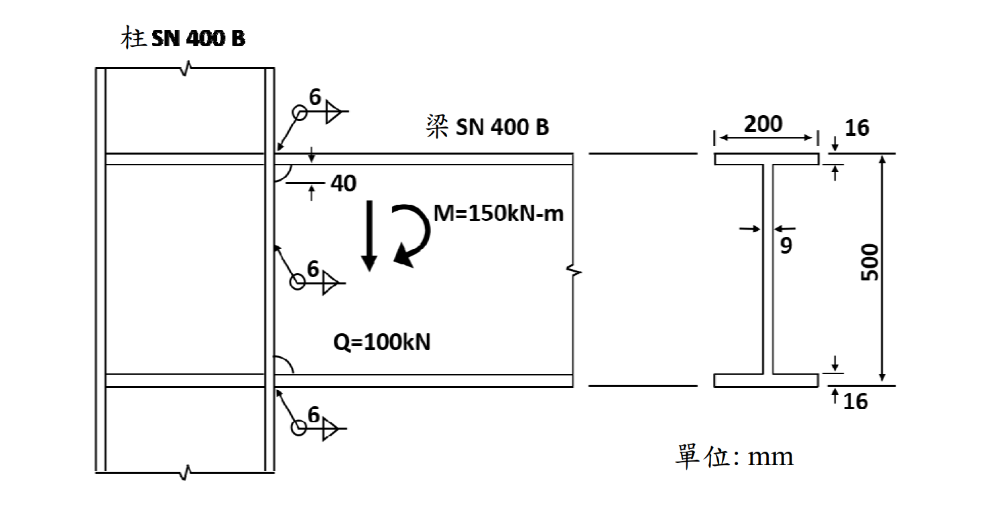

# SS-2018-3 解析

### 考題編號：SS-2018-3

**主分類：** `SS-U1-4` 接合之分析與設計
**副分類：** `SS-U2-3`（涉及 SN 鋼材特性）
**設計法：** ASD
**標籤：** `填角銲` `梁柱接頭` `ASD` `銲道容許應力` `SN400B` `箱型柱` `H型梁` `梁翼彎矩` `梁腹彎矩` `組合應力`

---

## 1. 原始題目重述 (Problem Restatement)

**題目：** 試以容許應力設計法（ASD）檢核圖中 SN400B 鋼箱型柱-H 型梁接頭之銲接尺寸。梁翼與梁腹負擔彎矩分別為 $M_f = 124.5$ kNm 與 $M_w = 25.5$ kNm。（30 分）

**已知條件（題目給定）：**

| 參數 | 數值 |
|------|------|
| 梁翼負擔彎矩 | $M_f = 124.5$ kNm |
| 梁腹負擔彎矩 | $M_w = 25.5$ kNm |
| 總彎矩 | $M = M_f + M_w = 150$ kNm |
| 設計剪力 | $Q = 100$ kN |
| 銲道容許應力 | $f_a = 90.5$ N/mm² |
| 梁腹銲喉斷面模數 | $S_w = \dfrac{2 \times 6/\sqrt{2} \times 388^2}{6} \times 10^{-3} = 212.9$ cm³ |
| 銲道外側拉應力 | $\tau_{w1} = M_w/S_w = 119.8$ N/mm² |
| 鋼材 | SN400B（$F_y = 245$ N/mm²，$F_u = 400$ N/mm²）|

**梁斷面（H 型，尺寸取自圖形）：**

| 部位 | 尺寸 |
|------|------|
| 總高度 | 500 mm（含翼板）|
| 翼板寬度 $b_f$ | 200 mm |
| 翼板厚度 $t_f$ | 16 mm |
| 腹板厚度 $t_w$ | 9 mm |

**銲接配置（圖中所示）：**
- 梁翼：完全熔透開槽銲（CJP groove weld，本解析判斷）
- 梁腹：6 mm 填角銲（雙面），有效長度 388 mm

*圖說：梁柱接頭圖中，柱為 SN400B 箱型斷面，梁為 SN400B H 型斷面（總高 500 mm，翼寬 200 mm，翼厚 16 mm，腹厚 9 mm）。腹板銲道有效長度 = 500 - 2×(40+16) = 388 mm（上下各留 56 mm）。$M = 150$ kNm，$Q = 100$ kN。*

---

## 2. 考題核心精神與出題者意圖 (Core Concepts & Examiner's Intent)

**核心觀念：** 梁柱接頭將梁端彎矩分為「梁翼負擔部分 $M_f$」與「梁腹負擔部分 $M_w$」，兩者分別由不同類型的銲道承擔。腹板銲道同時承受 $M_w$（產生彎曲應力）與 $Q$（產生剪應力），需以向量合成計算組合應力。

**出題者意圖：**
1. 考核梁柱接頭彎矩分配（翼板 vs 腹板）的物理意義
2. 考核腹板填角銲在彎矩＋剪力作用下的組合應力計算
3. 考核翼板接合強度驗算
4. $\tau_{w1} = 119.8 > f_a = 90.5$，引導學生計算所需銲道尺寸

---

## 3. 解題戰略地圖與陷阱分析 (Strategic Roadmap & Trap Analysis)

**作戰計畫：**
1. 確認腹板銲道有效長度（188 mm 起迄計算）
2. 計算腹板銲道組合應力（$\tau_{w1}$：彎矩，$\tau_{w2}$：剪力，向量合成）
3. 判定 6 mm 腹板銲道 → NG，求所需最小銲道尺寸
4. 驗算梁翼接合（CJP 銲道對應翼板應力）

**關鍵陷阱：**

| 陷阱 | 說明 | 應對 |
|------|------|------|
| ❌ $\tau_{w1}$ 直接與 $f_a$ 比較即下結論 | 腹板銲道尚有剪力 $Q$ 貢獻的 $\tau_{w2}$，需向量合成才是真實應力 | 計算 $\tau_{w2}$ 後合成再比較 |
| ❌ 銲喉面積計算錯誤 | 填角銲有效喉厚 = $w/\sqrt{2} = 0.707w$，不是 $w$；且雙面銲需乘 2 | $A_w = 2 \times (w/\sqrt{2}) \times l_w$ |
| ❌ 腹板銲道長度直接用 500 mm | 銲道需留開口或返銲空間（40 mm）及翼板高度（16 mm），有效長 = 388 mm | 按題目所給 $S_w$ 公式中的 388 mm |
| ❌ 梁翼用填角銲檢核 | 此類矩接頭梁翼通常用 CJP（完全熔透），按基材強度驗算，不用填角銲公式 | 確認接頭型式再選擇計算方法 |

---

## 3.5 變數層次分析（Variable Hierarchy Analysis）

> 複習提示：解題後，在每個卡住的知識點「卡關?」欄標記 `⚠`；第二次複習時只看有 `⚠` 的項目。

**最終目標：** 梁腹 6 mm 填角銲組合應力 → 與容許應力比較 → NG → 求所需銲腳尺寸；梁翼 CJP 按基材強度驗算 → OK

### 主要公式（$\boxed{\phantom{x}}$ = 未知，待推導）

$$\boxed{\tau_{w1}} = \frac{M_w}{S_w} \quad \text{（彎矩引起，水平方向）}$$

$$\boxed{\tau_{w2}} = \frac{Q}{A_w} = \frac{Q}{2 \times 0.707w \times l_w} \quad \text{（剪力引起，垂直方向）}$$

$$\boxed{\tau} = \sqrt{\tau_{w1}^2 + \tau_{w2}^2} \leq f_a \quad \text{（向量合成 vs 容許應力）}$$

$$\boxed{w_{req}} = \frac{\sqrt{(M_w/S_{w0})^2 + (Q/A_{w0})^2}}{f_a} \quad \text{（反算所需銲腳尺寸）}$$

### L1：題目直接給定

| 符號 | 數值 | 說明 |
|------|------|------|
| $M_f$ | 124.5 kNm | 梁翼負擔彎矩 |
| $M_w$ | 25.5 kNm | 梁腹負擔彎矩 |
| $Q$ | 100 kN | 設計剪力 |
| $f_a$ | 90.5 N/mm² | 填角銲容許應力（ASD，規範給定） |
| $w$ | 6 mm | 腹板填角銲銲腳尺寸（初始設計） |
| $l_w$ | 388 mm | 腹板銲道有效長度（題目 $S_w$ 公式中反推） |
| $b_f$ | 200 mm | 梁翼板寬度 |
| $t_f$ | 16 mm | 梁翼板厚度 |
| $d$ | 500 mm | 梁總高度 |
| $F_y$ | 245 N/mm² | SN400B 降伏強度 |

### L2：需知識點推導

**Step 1：腹板銲道幾何**

| 符號 | 公式 / 來源 | 卡關? |
|------|------------|:-----:|
| 喉厚 $t$ | $6/\sqrt{2} = 4.243$ mm（填角銲有效喉厚） | |
| $S_w$（6 mm） | $2 \times 4.243 \times 388^2 / 6 = 212{,}900$ mm³（題目已給） | |
| $A_w$（6 mm） | $2 \times 4.243 \times 388 = 3{,}292$ mm² | |

**Step 2：腹板銲道應力計算與合成**

| 符號 | 公式 / 來源 | 卡關? |
|------|------------|:-----:|
| $\tau_{w1}$ | $M_w / S_w = 25.5 \times 10^6 / 212{,}900 = 119.8$ N/mm²（水平） | |
| $\tau_{w2}$ | $Q / A_w = 100{,}000 / 3{,}292 = 30.4$ N/mm²（垂直） | |
| $\tau$（合成） | $\sqrt{119.8^2 + 30.4^2} = 123.6$ N/mm² > 90.5 → NG ✗ | |

**Step 3：求所需銲腳尺寸**

| 符號 | 公式 / 來源 | 卡關? |
|------|------------|:-----:|
| $S_w(w)$ | $35{,}503\,w$ mm³（線性正比於 $w$） | |
| $A_w(w)$ | $549.0\,w$ mm²（線性正比於 $w$） | |
| $w_{req}$ | $741 / 90.5 = 8.19$ mm → 採用 9 mm | |
| 9 mm 驗算 | $\tau = 82.4$ N/mm² < 90.5 → OK ✓ | |

**Step 4：梁翼 CJP 銲道驗算**

| 符號 | 公式 / 來源 | 卡關? |
|------|------------|:-----:|
| 力偶臂 | $d - t_f = 500 - 16 = 484$ mm | |
| $F_f$ | $M_f / 484 = 124.5 \times 10^6 / 484 = 257{,}231$ N | |
| $A_f$ | $b_f \times t_f = 200 \times 16 = 3{,}200$ mm² | |
| $\sigma_f$ | $257{,}231 / 3{,}200 = 80.4$ N/mm² < $0.6 F_y = 147$ N/mm² → OK ✓ | |

### L3：深層知識（不懂就卡住）

| 知識點 | 說明 | 補強頁 | 卡關? |
|--------|------|:------:|:-----:|
| 填角銲有效喉厚 | 喉厚 = $w/\sqrt{2} = 0.707w$；ASD 應力需對喉截面積計算，不是對銲腳面積 | | |
| 腹板彎矩與剪力應力方向正交 | $\tau_{w1}$（彎矩）水平，$\tau_{w2}$（剪力）垂直，兩者需向量合成才是最大合應力 | | |
| 梁翼用 CJP vs 梁腹用填角銲 | 翼板力大且集中（拉/壓合力），需全滲透銲（CJP）按基材強度設計；腹板剪力傳遞用填角銲即可 | | |
| 腹板銲道有效長度推算 | 總高 500 mm，扣兩側翼板（$2 \times 16$）及返銲空間（$2 \times 40$）= 388 mm；理解每端留 56 mm | | |
| ASD 填角銲容許應力來源 | $f_a = 90.5$ N/mm²（規範查表值），對應 SN400B + E70 銲條組合；不是自行計算 | | |

---

## 4. 步驟化詳細計算過程 (Step-by-Step Detailed Calculation)

### 【梁腹銲道檢核】（6 mm 填角銲，雙面）

#### Step 1：確認腹板銲道幾何

由題目 $S_w$ 公式反推：

$$S_w = \frac{2 \times (6/\sqrt{2}) \times 388^2}{6} \times 10^{-3}$$

可知腹板銲道有效長度 $l_w = 388$ mm（上下各留空 56 mm = 16 mm 翼板 + 40 mm 返銲空間）

有效喉厚：$t = 6/\sqrt{2} = 4.243$ mm

#### Step 2：彎矩引起之銲道應力 $\tau_{w1}$（題目已給）

$$\tau_{w1} = \frac{M_w}{S_w} = \frac{25.5 \times 10^6}{212,900} = 119.8 \text{ N/mm}^2$$

此為腹板銲道**外側極端纖維**的彎曲剪應力（水平向）。

#### Step 3：剪力引起之銲道應力 $\tau_{w2}$

腹板銲道截面積（雙面）：
$$A_w = 2 \times t \times l_w = 2 \times 4.243 \times 388 = 3{,}292 \text{ mm}^2$$

剪力應力（垂直向）：
$$\tau_{w2} = \frac{Q}{A_w} = \frac{100{,}000}{3{,}292} = 30.4 \text{ N/mm}^2$$

#### Step 4：向量合成最大組合應力

$\tau_{w1}$（水平）與 $\tau_{w2}$（垂直）方向正交，向量合成：

$$\tau = \sqrt{\tau_{w1}^2 + \tau_{w2}^2} = \sqrt{119.8^2 + 30.4^2} = \sqrt{14352 + 924} = \sqrt{15276}$$

$$\boxed{\tau = 123.6 \text{ N/mm}^2}$$

#### Step 5：與容許應力比較

$$\tau = 123.6 \text{ N/mm}^2 > f_a = 90.5 \text{ N/mm}^2 \quad \Rightarrow \text{ NG} ✗$$

**6 mm 腹板填角銲不符合 ASD 要求。**

---

#### Step 6：求所需腹板填角銲尺寸

設所需銲腳尺寸為 $w_{\text{req}}$，喉厚 = $0.707 w_{\text{req}}$

$$S_w(w) = \frac{2 \times 0.707 w_{\text{req}} \times 388^2}{6} = 35{,}503 \, w_{\text{req}} \text{ mm}^3$$

$$A_w(w) = 2 \times 0.707 w_{\text{req}} \times 388 = 549.0 \, w_{\text{req}} \text{ mm}^2$$

組合應力：

$$\tau(w) = \sqrt{\left(\frac{M_w}{S_w}\right)^2 + \left(\frac{Q}{A_w}\right)^2} = \sqrt{\left(\frac{718.3}{w_{\text{req}}}\right)^2 + \left(\frac{182.1}{w_{\text{req}}}\right)^2}$$

$$= \frac{1}{w_{\text{req}}}\sqrt{718.3^2 + 182.1^2} = \frac{1}{w_{\text{req}}}\sqrt{515{,}995 + 33{,}160} = \frac{741}{w_{\text{req}}}$$

令 $\tau = f_a = 90.5$：

$$w_{\text{req}} = \frac{741}{90.5} = 8.19 \text{ mm} \quad \Rightarrow \text{採用 } \boxed{w = 9 \text{ mm}}$$

**驗算 9 mm 填角銲：**

| 參數 | 數值 |
|------|------|
| 喉厚 $t$ | $9 \times 0.707 = 6.364$ mm |
| $S_w$ | $2 \times 6.364 \times 388^2 / 6 = 319{,}404$ mm³ |
| $A_w$ | $2 \times 6.364 \times 388 = 4{,}938$ mm² |
| $\tau_{w1} = M_w/S_w$ | $25.5 \times 10^6 / 319{,}404 = 79.8$ N/mm² |
| $\tau_{w2} = Q/A_w$ | $100{,}000 / 4{,}938 = 20.3$ N/mm² |
| $\tau = \sqrt{\tau_{w1}^2 + \tau_{w2}^2}$ | $\sqrt{79.8^2 + 20.3^2} = \sqrt{6368+412} = 82.4$ N/mm² |
| 判定 | $82.4 < 90.5$ → **OK ✓** |

---

### 【梁翼銲道檢核】（CJP 完全熔透開槽銲）

#### Step 1：梁翼力偶臂與翼板力

梁總高度 $d = 500$ mm（含翼板），翼板厚度 $t_f = 16$ mm

$$\text{力偶臂} = d - t_f = 500 - 16 = 484 \text{ mm}$$

$$F_f = \frac{M_f}{\text{力偶臂}} = \frac{124.5 \times 10^6}{484} = 257{,}231 \text{ N} = 257.2 \text{ kN}$$

#### Step 2：翼板應力計算

梁翼板截面積：
$$A_f = b_f \times t_f = 200 \times 16 = 3{,}200 \text{ mm}^2$$

$$\sigma_f = \frac{F_f}{A_f} = \frac{257{,}231}{3{,}200} = 80.4 \text{ N/mm}^2$$

#### Step 3：與容許應力比較

對於 CJP 開槽銲，按基材強度設計：
$$f_{a,\text{tension}} = 0.6 F_y = 0.6 \times 245 = 147 \text{ N/mm}^2$$

$$\sigma_f = 80.4 \text{ N/mm}^2 < 147 \text{ N/mm}^2 \quad \Rightarrow \boxed{\text{OK ✓}}$$

---

### 總結

| 接合部位 | 接合型式 | 應力 | 容許應力 | 判定 |
|----------|---------|------|---------|------|
| 梁腹（6 mm 填角銲） | 雙面填角 | 123.6 N/mm² | 90.5 N/mm² | **NG ✗** |
| 梁腹（9 mm 填角銲） | 雙面填角 | 82.4 N/mm² | 90.5 N/mm² | **OK ✓** |
| 梁翼（CJP 開槽銲） | 完全熔透 | 80.4 N/mm² | 147 N/mm² | **OK ✓** |

**結論：梁腹填角銲需由 6 mm 加大至 9 mm，梁翼 CJP 開槽銲強度充足。**

---

## 5. 關鍵爭議點與進階探討 (Critical Issues & Advanced Discussion)

### 梁翼/梁腹彎矩分配的物理意義

**梁翼承擔彎矩 $M_f$（大部份）：**
翼板遠離中性軸，產生較大力偶臂，承擔大部分彎矩效率最高。翼板透過 CJP 銲道傳遞集中的拉/壓力至柱面（或柱的水平加勁板）。

**梁腹承擔彎矩 $M_w$（小部份）＋剪力 $Q$（全部）：**
腹板靠近中性軸，傳遞彎矩效率低，但是傳遞剪力的主體。填角銲道需同時承受 $M_w$ 產生的水平分力與 $Q$ 產生的垂直分力。

### 腹板銲道有效長度計算（388 mm 的由來）

梁總高 500 mm，翼板 16 mm × 2 = 32 mm，淨腹板高 468 mm。

腹板銲道兩端各留 40 mm（返銲空間或開口），但需另加翼板厚度 16 mm：
$$l_w = 500 - 2 \times (40 + 16) = 500 - 112 = 388 \text{ mm} ✓$$

### 容許應力 $f_a = 90.5$ N/mm² 的來源

對於 SN400B（$F_u = 400$ N/mm²）配合 E70（$F_{EXX} = 70 \text{ ksi} \approx 483$ N/mm²）填角銲：

$$f_a = 0.3 F_{EXX} = 0.3 \times 483 = 144.9 \text{ N/mm}^2$$

但採用日本 JIS 規範的填角銲容許應力（台灣建築鋼結構規範）：
$$f_a \approx 90.5 \text{ N/mm}^2$$（規範直接給定值，已含安全係數）

此值約為 $0.6 F_y \times 0.5 / \sqrt{3}$（von Mises 容許剪應力），是常見考試給定值。

### 考場實務建議

- 本題已給 $S_w$ 與 $\tau_{w1}$，核心計算是 $\tau_{w2}$ 和向量合成（約 1 分鐘內可完成）
- 發現 NG 後不要停止，需進一步計算所需銲道尺寸（題目要求「檢核銲接尺寸」，隱含需給出正確答案）
- 翼板 CJP 銲道是「從梁翼設計」而非「從銲道設計」，切換思維模式
